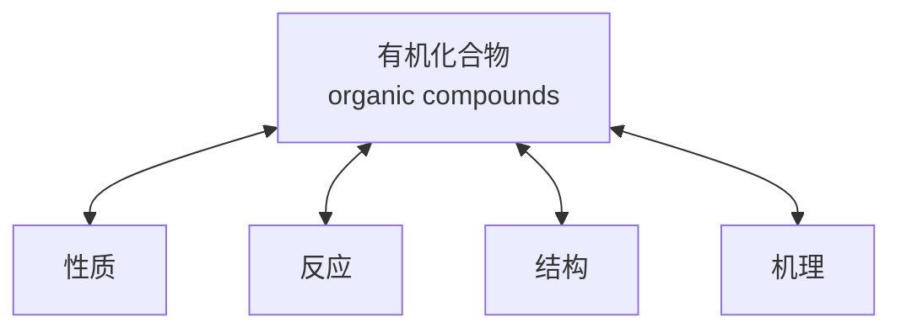

# 有机化学

# Organic Chemistry

# 第一章：绪论

主讲: 王锋

华中科技大学化学与化工学院

School of Chemistry & Chemical Engineering, HUST

## 王锋 教授化学与化工学院

text_image

華中科技大學
HUAZHOU
UNIVERSITY OF SCIENCE AND TECHNOLOGY
明德厚學 永文創新
HUAN CHENG

text_image

中國科學院
THE CHINESE ACADEMY OF SCIENCES

text_image

格明德
SAPIENTIA·ET·VIRTUS

2001 – 2005 华中科技大学 应用化学 理学学士  
• 2008 – 2013 中国科学院 有机化学 理学博士  
. 2013 – 2016 香港大学 化学系 博士后

## 课程说明

学时：讲授（52学时）+实验（44学时）

教学用书：

text_image

普通高等教育“十二五”规划教材
普通高等院校化学精品教材
有机化学
龚跃法 郑炎松 陈东红 张正波 编著
清华大学出版社

《有机化学》龚跃法 郑炎松 陈东红 等编著 华中科技大学出版社

《基础化学实验》龚跃法 主编 高等教育出版社

课程成绩 = 平时成绩（30%）+闭卷考试（70%）

平时成绩=作业成绩（40%）+实验成绩（60%）

实验成绩 = 出勤10% + 预习报告20% + 实验报告70%

## 课程说明

## 关于作业：

每章讲完后留作业，写在纸上（可不抄题），班长收齐后交给我。

## 关于答疑：

习题讲解课答疑  
课前课后答疑

## 课后作业要求

用纸：A4白纸

第1章作业

姓名：

学号：

班级：

## 为什么要学习有机化学？

## 有机化学与衣食住行

text_image

聚酯
polyester

chemical

Chemical structure of a polymeric compound with hydroxyl and ether linkages, labeled as n

chemical

3D ball-and-stick molecular model of a polycyclic aromatic hydrocarbon with red, white, and black atoms

聚对苯二甲酸乙二酯  
poly(ethylene terephthalate)

text_image

Composite image showing dairy cows in a field with a large red question mark overlaying the image, likely indicating a placeholder or error.

chemical

β-1,4苷键分子结构示意图，展示其在多链脂肪链中的位置

natural_image

Close-up of dry grass blades under sunlight, no text or symbols visible

纤维素 cellulose

chemical

α-1,4苷键分子结构示意图，标注了两个不同链基位置

natural_image

Close-up of assorted baked bread rolls and sesame seeds with wheat stalks (no text or symbols visible)

直链淀粉amylose

地球南极上空的臭氧空洞，面积约为2.5个欧洲大小臭氧含量低于正常浓度15%

$$
\begin{array}{c} \mathrm {F_ {3} C - Cl} \longrightarrow \mathrm {F_ {3} C\cdot + \cdotCl} \\ \cdot \mathrm{Cl+O} _ {3} \longrightarrow \mathrm{Cl-O+O} _ {2} \end{array}
$$

O 3 臭氧空洞 Ozone Hole

##

natural_image

Portrait of a man wearing glasses and a suit (no text or symbols visible)

Paul J. Crutzen

美国加州大学伯克利分校

natural_image

Portrait of a smiling man with beard and mustache wearing a striped shirt and tie (no text or symbols visible)

Mario J.Molina

美国麻省理工学院

natural_image

Portrait of an older man wearing glasses and a suit (no text or symbols visible)

F.Sherwood

Rowland

美国加州大学欧文分校

The Nobel Prize in Chemistry 1995 was awarded jointly to Paul J. Crutzen, Mario J. Molina and F. Sherwood Rowland "for their work in atmospheric chemistry, particularly concerning the formation and decomposition of ozone."

text_image

聚苯乙烯
Polystyrene
TPE免充气轮胎

chemical

Chemical structure of a polymeric compound with benzene ring and ethylene chain

## 为什么要学习有机化学？

## 有机化学与生命现象

chemical

Chemical structure of dopamine, labeled as '多巴胺' (diabutylamine)

神经递质，传递兴奋及开心的信息

natural_image

Silhouette of two hands forming a heart shape against a bright sky (no text or symbols)

text_image

adidas®
Cam
Caja
Mediterraneo
adidas®
Mercè
SORTI
跑马
adidas®
CAM
Caja Mediterraneo
www.bon.cat/lesports
Dorsalo
201 a 1999
Dorsalo
201 a 2000
CURSA DE LA MERCÉ
575
43
123
1
77
17
59
17
Dor
1 al

chemical

Complex peptide or glycoside molecular structure with multiple functional groups including hydroxyl, amide, and amide bonds

## α-Endorphin

## 安多芬

## 产生持续的欣快感

chemical

Chemical structure of a chiral molecule with methyl and carbonyl groups, undergoing photoinduced reaction under hv light

chemical

Chemical structure of a substituted cyclohexane derivative with methyl and hydrogen groups

α,β-不饱和醛，吸收光子后发生顺反异构引起视觉反应  

natural_image

Close-up of a human eye with a futuristic blue-tinted holographic overlay, showing the cornea and iris (no text or symbols)

## 为什么要学习有机化学？

## 有机化学与医学

chemical

Molecular structure of a phenylamine derivative with hydroxyl and amine functional groups, alongside a photo of blue-and-white capsules.

Seudo-ephedrine  
伪麻黄碱  
缓解感冒症状

chemical

Chemical structure of a benzene derivative with an amine group attached to the chiral carbon

text_image

毒品

Methamphetamine  
冰毒  
毒品、家破人亡

chemical

Molecular structure of a steroid derivative with ketone and hydroxyl functional groups

## Artemisinin

## 青蒿素

抗疟疾药， 挽救无数人的生命

## 屠呦呦

text_image

ALF.
NOBEL
Baidu 百科

2015年诺贝尔生理学或医学奖

text_image

青蒿及
青蒿素类药物

QINGHAO JIQINGHAOSULEI YAOWU

屠呦呦编著  

chemical

Molecular structure of a compound with labeled methyl groups and stereochemistry, labeled 'Baike 百能谱 星盛出版社' (Baikao Chemical Press)

“全世界每年感染疟疾的病人接近2亿。目前青蒿素已被广泛用于所有疟疾肆虐的地区。当青蒿素被用于综合疗法时，它能够降低疟疾的总死亡率20%，降低儿童疟疾死亡率30%。仅在非洲，这就意味着每年超过10万人因此得救……科研发现对全球的影响及其对人类福祉的改善无可估量。”

2015年10月5日，瑞典斯德哥尔摩，诺奖委员会对屠呦呦的颁奖词

## 青蒿素的人工合成——有机化学的魅力

natural_image

Portrait of a smiling man wearing glasses, suit, and red tie (no text or symbols visible)

张万斌 教授上海交通大学

natural_image

Close-up of green leafy plant with needle-like structures, no visible text or symbols

chemical

Molecular structure of a steroid derivative with ketone and hydroxyl functional groups

青蒿素Artemisinin

chemical

Synthetic pathway for compound 5 from single sugar, showing biosynthesis, RuPHOX-Ru reaction, and SJTU Cat. reagent steps

chemical

3D ball-and-stick molecular model of a cyclic compound with orange, red, and white atoms, surrounded by red solvent molecules

chemical

Chemical structure of a phosphorus-containing compound with hydroxyl and methoxy groups, labeled with stereochemistry

## 磷霉素

## Fosfomycin

抗生素，对革兰氏阳性和阴性菌有效

## 磷霉素抗菌机理

chemical

细胞壁合成酶结构示意图，展示磷酸氧键与水解形成的过程

## 磷霉素

## Fosfomycin

抗生素，其作用机菌细胞壁合成酶相抑制细菌细胞壁的到杀菌的目的。

## 环氧乙烷 C2H4O

## ethylene oxide

低温杀菌剂，医疗设备消毒剂

## 环氧乙烷杀菌机理

chemical

环张式结构示意图，展示碳原子与SH细胞的连接关系

力大，易开环

## 有机化学

text_image

Organic
Chemistry

natural_image

Digital illustration of a DNA double helix with blue fluorescence, no text or symbols present

创造：创造自然界不存在的物质（有机合成、药物化学、高分子化学、材料化学……）

认识：从分子层面认识、解决问题（药理病理、生命现象、基因编辑……）

## 欢迎走进 的世界

natural_image

Molecular model of water molecules with orange and blue spheres connected by rods, against a blue gradient background (no text or labels)

## 有机化学

## 研究含碳化合物 （有机化合物）的化学

flowchart

## 1.1 有机化学发展简史

古代：酿酒、制醋、炼丹术…

有机化学相关活动

natural_image

Black-and-white illustration of people in a garden setting with mountains and plants, no visible text or symbols

text_image

山東先醫陳丹者
中國大會的長壽
西漢子書於黃李
地王太

## 1.1 有机化学发展简史

18世纪中叶：分离出纯有机化合物（酒石酸、尿素、乳酸）

• 1770年：Torbern Bergman（瑞典）提出“有机物”和“无机物”概念  
• 1806年：瑞典化学家J. Berzelius（贝采尼乌斯）首先使用“有机化学”概念 ， 并 提 出 生 命 力 论 （ vitalistictheory）：阻碍有机化学发展

natural_image

Portrait painting of a man in 18th-century attire with red collar and cap (no visible text or symbols)

Torbern Bergman

1735 – 1784

瑞典化学家

## 1.1 有机化学发展简史

1828年：魏勒（Friedrich Wöhler，德国）从无机物制备出尿素，打破“生命力论”

natural_image

Portrait engraving of a 19th-century man with curly hair and formal attire (no text or symbols visible)

Friedrich Wöhler

1800 – 1882

德国化学家

$$
\mathrm{NH} _ {4} ^ {+} \stackrel {-} {\mathrm{OCN}} \xrightarrow {\text { Heat }}
$$

氰酸铵

（无机盐）

chemical

Chemical structure of ammonia (NH2) showing carbonyl group attached to nitrogen

尿素

（有机物）

## 1.1 有机化学发展简史

## 20世纪中叶起：现代有机化学大发展

合成纤维、合成塑料、合成橡胶、人工合成牛胰岛素（1965年，中国）

1965年9月17日，第一次用人工方法合成了一种具有生物活力的蛋白质———结晶牛胰岛素。  
1965年11月，研究工作在《科学通报》杂志发表。  
1966年3月30日，研究工作全文在《科学通报》杂志发表。

## 参与单位：

中科院上海生物化学研究所中科院上海有机化学研究所北京大学

natural_image

Group of scientists in lab coats gathered around a display case with a mouse, likely in a laboratory or industrial setting (no visible text or symbols)

natural_image

Microscopic view of cellular or crystalline structures with hexagonal and circular features (no text or symbols)

chemical

3D molecular structure showing a complex organic compound with multiple functional groups and electron density clouds

text_image

C
O
N
S
H

牛胰岛素晶体模型  
The structural model of bovine insulin  

chemical

Chemical formula of a sulfonamide compound with its molecular formula C₂₅₄H₃₇₇N₆₅O₇₅S₆

text_image

No one else has more...
1 3 0,2 2 0,8 2 2
ORGANIC AND INORGAN C
SUBSTANCES
A global team of scientists is regularly disclosed by
substance information from the world's disclosed
chemistry to the CAS REGISTRY™, the gold
standard for chemical substance information.

text_image

No one else has more...
1 3 0.2 4 6.0 4 1
ORGANIC AND INORGANIC
SUBSTANCES
TO CNT
A local level of scientists is not directly adding
substance information from the world's disclosed
chemistry to the CAS REGISTRY™, the gold
standard for chemical substance information.
26781种新物质!

text_image

CAS®
A DIVISION OF THE
AMERICAN CHEMICAL SOCIETY
ACS | Journals | C&EN | CAS | Languages
Site Search
GO
Log In To: SciFinder
GO
Products
Content
Training
Contact Us
News
About CAS
YOUR NEXT
BREAKTHROUGH
STARTS HERE
CAS CHANGED
CHEMISTRY
RESEARCH.
CIT'S
HAPPENING
AGAIN.
Available Spring 2017
More >>
Scientists
Patent Experts
No one else has more...
1 3 0,2 2 0,8 2 2
ORGANIC AND NORGANIC
SUBSTANCES
TO DATE
A global team of scientists is continually adding
substance information from the world's disclosed
chemistry to the CAS REGISTRY™, the gold
standard for chemical substance information.

text_image

CAS®
A DIVISION OF THE
AMERICAN CHEMICAL SOCIETY
ACS | Journals | C&EN | CAS | Languages
See Search
GO
Login To: SciFinder
GO
Products
Content
Training
Contact Us
News
About CAS
YOUR NEXT
BREAKTHROUGH
STARTS HERE
At CAS, we organize, analyze and share
information that drives scientific discoveries.
We facilitate your research to fuel tomorrow's
innovation.
Together, we will do great things.
More >>
CAS CHANGED
CHEMISTRY
RESEARCH.
IT'S
HAPPENING
AGAIN.
Available Spring 2017
LEARN MORE
Scientists
Patent Experts
No one else has more...
1 3 0, 2 4 6, 0 4 1 ORGANIC AND INORGANIC
SUBSTANCES
TO DATE
A global team of scientists is continually adding
substance information from the world's disclosed
chemistry to the CAS REGISTRY™, the gold
standard for chemical substance information.

2017-6-20 12:00 pm

2017-6-27 12:00 pm

## 1.2 有机化合物和有机化学

text_image

Group
1A
H 2A
Li Be
Na Mg
K Ca Sc Ti V Cr Mn Fe Co Ni Cu Zn Ga Ge As Se Br Kr
Rb Sr Y Zr Nb Mo Tc Ru Rh Pd Ag Cd In Sn Sb Te I Xe
Cs Ba La Hf Ta W Re Os Ir Pt Au Hg TI Pb Bi Po At Rn
Fr Ra Ac
3A 4A 5A 6A 7A 8A
B C N O F He
Al Si P S Cl Ar
Ga Ge As Se Br Kr
In Sn Sb Te I Xe
TI Pb Bi Po At Rn

有机化合物：含碳的化合物 $( \mathsf C \mathsf O _ { 2 } , \mathsf C \mathsf O , \mathsf H _ { 2 } \mathsf C \mathsf O _ { 3 }$ ，碳酸盐不属于有机化合物）  
• 有机化合物组成：碳，氢，氧，氮，卤素，硫，膦  
• 有机化学：研究含碳化合物的化学

## 1.3 有机化合物的特征

p 数量多、 结构复杂  
p 易燃  
p 热稳定性差、熔点、沸点较低  
p 难溶于水  
p 反应速度慢、副反应多

## 常见的化学键

## 离子键

由原子或分子得/失电子形成的阴/阳离子之间，通过静电引力而形成化学键称为离子键，也称电价键

## 金属键

金属原子最外层的价电子很容易脱离原子核的束缚，然后自由地在由正离子产生的势场中运动，这些自由电子与正离子相互吸引，使原子紧密堆积起来，形成金属晶体。这种使金属原子结合成金属晶体的化学键称为金属键。

## 共价键

由两个或多个原子通过共用电子对产生的一种化学键称为共价键。

## 价键理论 (Valence Bond Theory)

## 核心内容

共价键是成键两原子通过共享电子对而形成的。

chemical

Diagram showing hydrogen bonding between water molecules, illustrating 1s and H₂ molecule formation

text_image

H
H
Circular
cross-section

## 价键理论的发展

• 1916年，Lewis提出共价键理论，认为分子中的原子都有形成稀有气体电子结构的趋势，共价分子中原子之间以共用电子对的方式成键。  
• 1927年，Heitler和London应用量子力学处理氢分子结构，形成近代共价键理论。  
• 1931年，Pauling引入杂化轨道概念，形成了现代价键理论。

## 价键理论要点 (Valence Bond Theory)

（1）假如原子A与原子B各拥有一个未成对的电子，且自旋方向相反，那么它们就可以互相配对，形成共价（单）键（H2）。如果A和B各拥有两个或三个未成对电子，那么配对形成的共价键就是双键或叁键$( \mathsf { N } _ { 2 } )$ ）。如果A原子有两个未成对电子，B原子有一个未成对电子，那么一个A原子可以与两个B原子相结合（ $( \mathsf { H } _ { 2 } \mathsf { O } )$ ）

H-H

$\ V { \overline { { = } } } \mathbb { N }$

H、 H0

## 价键理论要点 (Valence Bond Theory)

（2）一个电子与另一个自旋相反的电子配对以后，就不能再与第三个电子配对。这说明了共价键的形成具有饱和性。

chemical

Chemical reaction diagram showing carbon reacting with hydrogen to form a carbon, hydrogen, and water molecules

即当一个电子与另一个电子配对成键后就不能与“第三者”配对，原子的外层价电子数就是可成键数。

## 价键理论要点 (Valence Bond Theory)

（3）两个电子配对，也就是指它们的原子轨道发生重叠。原子轨道重叠越多，形成的共价键越强。因此，原子轨道要尽可能在电子云密度最大的方向叠加，即共价键的形成具有方向性。

1s1s

σbond

chemical

Molecular orbital diagram showing positive and negative charge states in a molecule

1s

2p

σbond

chemical

Molecular orbital diagram showing electron delocalization with positive and negative lobes

2p

2p

πbond

## 价键理论要点 (Valence Bond Theory)

（4）能量相近的原子轨道，可以进行杂化，组成能量相等的杂化轨道，这样可以使成键能力增强，体系的能量降低，而成键后可达到最稳定的分子状态。

chemical

3D ball-and-stick model of a molecule with black, white, and gray spheres representing different atoms or functional groups.

chemical

Molecular structure diagram of 2-methylpropan-1,3-butadiene showing bond angles and height

<table><tr><td>Element</td><td>Atomic number</td><td colspan="2">Configuration</td></tr><tr><td>Hydrogen</td><td>1</td><td>1s</td><td></td></tr><tr><td rowspan="3">Carbon</td><td rowspan="3">6</td><td>2p</td><td></td></tr><tr><td>2s</td><td></td></tr><tr><td>1s</td><td></td></tr></table>

## $\mathfrak { G } \sharp ^ { \sharp }$ 杂化轨道

## $\mathsf { C H } _ { 4 }$

$$
(2 s) ^ {2} (2 p _ {x}) ^ {1} (2 p _ {y}) ^ {1} \xrightarrow {\text {跃迁}} (2 s) ^ {1} (2 p _ {x}) ^ {1} (2 p _ {y}) ^ {1} (2 p _ {z}) ^ {1} \xrightarrow {\text {杂化}} 4 (s p ^ {3})
$$

chemical

Diagram illustrating the formation of four sp³ hybrid structures from a single orbital, showing electron density and symmetry labels.

每个 $\cdot \sin ^ { 3 }$ 杂化轨道，含1/4的s轨道成分，3/4的p轨道成分四个 $\mathsf { s p } ^ { 3 }$ 杂化轨道呈正四面体分布，键角为109.5度

sp3杂化轨道  

chemical

Molecular orbital hybridization diagram showing electron density states (2pₓ, 2pᵧ, 2p_z) and tetrahedral orbitals (Four tetrahedral sp³ or an sp³)

乙烷的成键方式

chemical

Molecular orbital diagram showing sp³ carbon and sp³ bond formation from a central C atom

## sp2杂化轨道

$\mathrm { B F _ { 3 } } ( 2 s ) ^ { 2 } ( 2 p _ { x } ) ^ { 1 } \xrightarrow { 1 3 \sqrt { 2 } \times 1 5 t } , ( 2 s ) ^ { 1 } ( 2 p _ { x } ) ^ { 1 } ( 2 p _ { y } ) ^ { 1 } \xrightarrow { 3 \sqrt { 2 } \times 1 5 t } 3 ( s p ^ { 2 } )$

chemical

Diagram illustrating the formation of hybrid orbitals from s orbital and pₓ to pᵧ, with sp² hybrid orbitals shown.

chemical

Molecular orbital diagram of a three-petal flower with 120° orbital labels

three sp²hybrid orbitals superimposed

chemical

Molecular orbital diagram showing unhybridized p_z orbital and sp² orbitals

sp²hybrid carbon atom (viewed from the side)

每个 $\mathsf { s p } ^ { 2 }$ 杂化轨道，含1/3的s轨道成分，2/3的p轨道成分$\sum \hbar \mathsf { s p } ^ { 2 }$ 杂化轨道呈平面三角形分布，键角为120度

## sp2杂化轨道

text_image

p
90°
sp²
sp²

Sideview

chemical

Molecular orbital diagram showing 120° bond angle and sp² orbitals with electron density p

Topview

chemical

Molecular orbital diagrams showing p orbitals and sp² orbitals in a 3D lattice structure

sp²carbon  
sp²carbon

烯的成键方  

text_image

方式
π bond
σ bond
C C
π bond

Carbon-carbon double bond

## sp杂化轨道

${ \mathsf { B e C l } } _ { 2 }$

flowchart

text_image

destructive
overlap
constructive
overlap
s
p
→
sp hybrid

text_image

constructive
overlap
destructive
overlap
s (-)p
second sp hybrid

每个sp杂化轨道，含1/2的s轨道成分，1/2的p轨道成分两个 $\mathsf { s p } ^ { 2 }$ 杂化轨道直线形分布，键角为180度

## sp杂化轨道

chemical

Molecular orbital diagrams showing one and another sp hybrid states with 180° angle and p/p orbital labels

键方式  

text_image

乙炔的成像
sp orbital
p orbitals
sp orbitals
p orbitals
sp orbital

text_image

π bond
π bond
σ bond

Carbon-carbon triple bond

## 分子轨道理论 (Molecular Orbital Theory)

分子轨道理论用于解释复杂分子（多原子）体系：

1. 分子轨道由组成分子的原子轨道线性组合而成；原子轨道的数目与形成的分子轨道数目相等；n个原子轨道可以组合成n个分子轨道。例如两个原子轨道组成两个分子轨道，其中一个分子轨道由两个原子轨道的波函数相加组成（符号相同的原子轨道叠加），称为成键轨道；另一个分子轨道由两个原子轨道的波函数相减组成（符号不同的原子轨道叠），称为反键轨道。

2. 分子轨道同样有不同能级，每一轨道只能容纳两个自旋相反的电子，电子首先占据能量最低的轨道。

## 分子轨道理论 (Molecular Orbital Theory)

text_image

Two 1s orbitals
Combine
Node
反键轨道
——
σ Antibonding MO
(unfilled)
σ Bonding MO
(filled)
成键轨道
Energy

σ键指两个原子轨道在键轴方向“头对头”发生重叠后形成共价键

## 分子轨道理论 (Molecular Orbital Theory)

3. 原子轨道组成分子轨道，须具备能量相近、电子云最大重叠、对称性相同三个条件。

能量相近原则：组成分子轨道的两个原子轨道的能量差越小，越能有效成键，成键过程中能量降低越多，成键越稳定

chemical

Energy level diagram showing two states φ₁ and φ₂ with their combination, labeled in Chinese.

chemical

Energy level diagram showing transitions between states φ₁, φ₂, and their combinations with energy

原子轨道能量相近原则：成键过程能量降低大，能形成稳定分子轨道

## 分子轨道理论 (Molecular Orbital Theory)

最大交叠原则：原子轨道相互重叠的部分要最大，重叠越大所形成的键越强。

对称性匹配原则：原子轨道在不同区域具有不同的符号（相位）相位相同的重叠才能有效成键。

text_image

1s
2pₓ
X

电子云最大重叠原则：最有效成键、键最强对称性原则：波函数符号相同的重叠，能有效成键

chemical

Two identical molecular orbital diagrams labeled p_y, showing electron density distribution

chemical

Molecular orbital diagram showing s orbital and p_y orbital with electron density distribution

波函数符号不同，不能有效成键

## 共价键参数

键长  
键角  
键能  
键的极性

## 共价键参数

## 键长：指的是成键原子核间的距离

常用 $\mathring { \mathsf { A } }$ $( 1 0 ^ { - 1 0 } \ m$ ， $\mathbf { 1 0 m = 1 0 ^ { - 1 2 } m } )$ ）做单位  
A—B 是最近和最远距离的平均值  
键长与键型、成键原子轨道的杂化类型有关

• 原子半径小的原子形成的键长较短  
• 相同原子形成的单键较长、双键次之、三键最短

## 共价键参数

## • 同一种键在不同分子中的差别不大

Table1.2  
Comparison ofC-CandC-HBonds in Methane, Ethane,Ethylene,and Acetylene

<table><tr><td rowspan="2">Molecule</td><td rowspan="2">Bond</td><td colspan="2">Bond strength</td><td rowspan="2">Bond length (pm)</td></tr><tr><td>(kJ/mol)</td><td>(kcal/mol)</td></tr><tr><td>Methane,  $CH_4$ </td><td> $(sp^3)C-H$ </td><td>436</td><td>104</td><td>109</td></tr><tr><td rowspan="2">Ethane,  $CH_3CH_3$ </td><td> $(sp^3)C-C(sp^3)$ </td><td>376</td><td>90</td><td>154</td></tr><tr><td> $(sp^3)C-H$ </td><td>423</td><td>101</td><td>109</td></tr><tr><td rowspan="2">Ethylene,  $H_2C=CH_2$ </td><td> $(sp^2)C-C(sp^2)$ </td><td>728</td><td>174</td><td>134</td></tr><tr><td> $(sp^2)C-H$ </td><td>465</td><td>111</td><td>107</td></tr><tr><td rowspan="2">Acetylene, HC≡CH</td><td> $(sp)C≡C(sp)$ </td><td>965</td><td>231</td><td>120</td></tr><tr><td> $(sp)C-H$ </td><td>556</td><td>133</td><td>106</td></tr></table>

## 共价键参数

键长: 单键>双键>叁键  
• $C - H : S P ^ { 3 } - S > S P ^ { 2 } - S > S P - S$

Table1.2  
Comparison ofC-Cand C-HBonds in Methane, Ethane,Ethylene,nd Acetylene

<table><tr><td rowspan="2">Molecule</td><td rowspan="2">Bond</td><td colspan="2">Bond strength</td><td rowspan="2">Bond length (pm)</td></tr><tr><td>(kJ/mol)</td><td>(kcal/mol)</td></tr><tr><td>Methane,  $CH_4$ </td><td> $(sp^3)C-H$ </td><td>436</td><td>104</td><td>109</td></tr><tr><td rowspan="2">Ethane,  $CH_3CH_3$ </td><td> $(sp^3)C-C(sp^3)$ </td><td>376</td><td>90</td><td>154</td></tr><tr><td> $(sp^3)C-H$ </td><td>423</td><td>101</td><td>109</td></tr><tr><td rowspan="2">Ethylene,  $H_2C=CH_2$ </td><td> $(sp^2)C-C(sp^2)$ </td><td>728</td><td>174</td><td>134</td></tr><tr><td> $(sp^2)C-H$ </td><td>465</td><td>111</td><td>107</td></tr><tr><td rowspan="2">Acetylene, HC≡CH</td><td> $(sp)C≡C(sp)$ </td><td>965</td><td>231</td><td>120</td></tr><tr><td> $(sp)C-H$ </td><td>556</td><td>133</td><td>106</td></tr></table>

## 共价键参数

键角：键与键之间的夹角。

chemical

Molecular structure diagram of 109.5° carbon showing bond angle and distance between C and H atoms

chemical

Molecular structure of ethene showing bond angles and distances between carbon atoms

键角确定分子的几何形状

chemical

3D ball-and-stick model of a molecule with four spherical atoms connected in a tetrahedral geometry

甲烷  
（球棍模型）

chemical

3D ball-and-stick model of methane (CH₄) showing carbon, hydrogen, and oxygen atoms in a symmetric configuration

chemical

3D ball-and-stick model of ethanol (CH₃)

乙烯  
（比例模型）

## 共价键参数

键能：将一个气态分子分解成组成它的全部原子（气态）时所需的能量，等于分子中全部化学键能的总和。对于同一分子中的相同共价键，其总能量除以化学键的数目，就是每个化学键的平均键能。

$$
\mathrm{CH} _ {4} (g) \longrightarrow \mathrm{C} \cdot (g) + 4 \mathrm{H} \cdot (g) + 1 6 6 1 \mathrm{kJ}
$$

$$
\mathrm{E} (C - H) = 1 6 6 1 \mathrm{kJ} \mathrm{mol} ^ {- 1} / 4 = 4 1 5. 5 \mathrm{kJ} \mathrm{mol} ^ {- 1}
$$

键能是化学键强度的主要标志之一，在一定程度上反映了键的稳定性。

## 共价键参数

共价键的极性(polarity)：  

非极性共价键

极性共价键

离子键

## 电负性

<table><tr><td>H</td><td>C</td><td>N</td><td>O</td><td>F</td><td>Cl</td><td>Br</td><td>I</td></tr><tr><td>2.2</td><td>2.5</td><td>3.1</td><td>3.5</td><td>4.0</td><td>3.2</td><td>3.0</td><td>2.7</td></tr></table>

chemical

Chemical structure showing proton (H) and chlorine (Cl) atoms with delta (+) and delta (-) charge labels

原子核与非价电子（内层电子）组成一个实体，成为原子实原子实对价电子的吸引能力，就是一个原子的电负性

• 两个原子的电负性相差1.7个单位以上，形成离子键  
电负性相差0-0.6个单位，形成非极性共价键  
相差0.6-1.7，形成极性共价键

## 共价键参数

## 共价键的极性(polarity)：

同种原子形成的共价键无极性

H H

异种原子形成的共价键有极性

$\hat { \mathbf { C } } \frac { \delta ^ { + } } { + } \frac { \delta ^ { - } } { \mathbf { C } } \mathbf { l }$

• 键的极性大小用键的偶极距来衡量

$$
\overrightarrow {\mu} = \mathrm{ed}
$$

e：电量

d：两个电荷中心之间的距离

## 分子的极性(polarity)：

双原子分子的极性：与共价键的极性一致

H-Cl

=1.03D

## 多原子分子的极性:

分子的极性是分子中极性键的向量和  
. 分子的极性取决于键的极性与分子的对称性

chemical

Chemical structure diagram showing chlorine (Cl) atoms bonded to central carbon (C) with μ=0 notation

chemical

Molecular structure diagram of chlorine (Cl) and hydrogen (H) atoms with chemical shift μ=1.86D

## 分子的极性(polarity)

chemical

Molecular structure diagram showing a central atom bonded to three surrounding atoms, with a color gradient background indicating electrostatic potential.

chemical

Chemical structure of a protonated ester with labeled hydrogen atoms and charge distribution

Methanol

Chloromethane

chemical

Molecular structure of dichloroethane (CH3Cl2)

chemical

Molecular structure diagram showing a central atom bonded to three surrounding atoms, likely representing a halogen or halide ion.

## 1.5 有机化合物的主要反应类型

均裂反应

chemical

自由基 radical reaction diagram showing bond breaking under uniform deformation

异裂反应

chemical

碳正离子与Y⁻反应生成碳正离子的化学反应示意图

chemical

碳负离子反应示意图，展示碳负离子与Y+离子的转化过程

## 碳自由基 碳正离子 碳负离子的结构

chemical

Molecular structure of methane (CH₄) showing carbon bonded to hydrogen and a water droplet

甲基碳自由基

$$
\mathsf {s p} ^ {2}
$$

chemical

Molecular structure of acetic acid showing carbon bonded to hydrogen and a positively charged oxygen

甲基碳正离子

$$
\mathsf {s p} ^ {2}
$$

chemical

Molecular structure of methane (CH₃) showing carbon bonded to hydrogen and a single oxygen atom

甲基碳负离子

$$
\mathsf {s p} ^ {3}
$$

## 1.5 有机化合物的主要官能团

<table><tr><td>化合物类型</td><td>官能团</td><td>实例</td></tr><tr><td>烷烃</td><td>无</td><td> $CH_4$ ,</td></tr><tr><td>烯烃</td><td> $\backslash C=C$  (烯键)</td><td> $CH_2=CH_2, C_6H_5CH=CH_2$ </td></tr><tr><td>炔烃</td><td>-C≡C- (炔键)</td><td> $HC≡CH, HC≡CCH_2OH$ </td></tr><tr><td>卤代烃</td><td>-X (卤素)</td><td> $CH_3Br, C_6H_5Cl, CHCl_3$ </td></tr><tr><td>醇、酚</td><td>-OH (羟基)</td><td> $CH_3OH, C_6H_5OH$ </td></tr><tr><td>硫醇、硫酚</td><td>-SH (巯基)</td><td> $CH_3SH, C_6H_5SH$ </td></tr><tr><td>醚</td><td>R-O-R (醚键)</td><td> $CH_3OCH_3, C_6H_5OCH_3$ </td></tr><tr><td>醛</td><td>-CHO (醛基)</td><td> $CH_3CHO, C_6H_5CHO$ </td></tr><tr><td>酮</td><td> $\backslash C=O$  (酮基)</td><td> $CH_3COCH_3, C_6H_5COCH_3$ </td></tr><tr><td>羧酸</td><td>-COOH (羧基)</td><td> $CH_3COOH, CF_3COOH$ </td></tr><tr><td>胺</td><td>-NH2 (氨基)</td><td> $CH_3NH_2, C_6H_5NH_2$ </td></tr></table>

## 1.6 有机化学中的酸碱概念

酸碱是化学变化中应用最广的概念之一。有机反应中有许多酸碱反应，熟悉酸碱的概念对理解有机反应很有用。

1.质子理论 (Brönsted-Lowry)  
2. 路易斯的酸碱理论 (Lewis)

## Brönsted-Lowry酸碱理论（质子理论）

定义：凡是能给出质子的物质是酸，凡能接受质子的物质是碱。酸给出质子后即形成了该酸的共轭碱，碱则反之。

chemical

化学反应示意图，展示酸、碱、共轭碱和共轭酸的转化过程

酸给出质子后变成共轭碱；碱得到质子后变成共轭酸酸碱互换

## Brönsted-Lowry酸碱理论

chemical

Molecular structure of ammonia (H₂O) showing carbon and hydrogen atoms with lone pair

chemical

Chemical structure of ethyl acetate (C2H4O3)

chemical

Chemical structure of ethyl acetate (C2H4O3)

chemical

Molecular structure of ammonia (NH₃) showing nitrogen bonded to three hydrogen atoms

chemical

Molecular structure of ammonia (NH₃) showing nitrogen atom bonded to three hydrogen atoms

## Brönsted-Lowry酸碱理论

chemical

Chemical structure of acetic acid (CH3) showing carbon, hydrogen, oxygen, and hydroxyl groups

质子酸碱理论中，一个化合物是酸还是碱，要根据具体的反应来定义

## Brönsted-Lowry酸碱理论

chemical

化学反应示意图，展示酸、碱、共轭碱和共轭酸之间的转化过程

给出质子的能力越强，酸性越强— 共轭碱的碱性越弱接受质子的能力越强，碱性越强— 共轭酸的酸性越弱

## Lewis酸碱理论（电子理论）

定义：凡能接受电子对的物质是酸, 凡能给出电子对的物质是碱。故酸和碱又可分别称为电子对的受体和给体，而酸碱反应则是生成配位键的过程，生成酸碱加合物。酸有外层空轨道，碱可以提供孤对电子。

text_image

Filled
orbital
B
+
Vacant
orbital
Lewis base
Lewis acid
B—A
路易斯碱
路易斯酸
酸碱加合

## Lewis酸碱理论（电子理论）

Boron triftuoride (Lewisacid) 三氟化硼

Dimethyl ether (Lewis base) 乙醚

Acid-base complex

## Lewis酸碱理论（电子理论）

## Lewis酸

(1) 可接受电子的分子： ${ \mathsf { B F } } _ { 3 } , \ { \mathsf { A l C l } } _ { 3 }$ ， $\mathsf { S n C l } _ { 4 }$ ， $Z \mathsf { n C l } _ { 2 }$ ，

$$
\mathrm{FeCl} _ {3} \dots\dots
$$

(2) 金属离子：Li+， ${ \mathsf { A } } { \mathsf { g } } ^ { + } , \ { \mathsf { C u } } ^ { 2 + }$ ·····

(3) 正离子：C+，Br+， ${ \mathsf { N O } } _ { 2 } { } ^ { + }$ ，H+

## Lewis酸碱理论（电子理论）

## Lewis碱

(1) 具有未共享电子对原子的化合物： $N H _ { 3 }$ ， ${ \mathsf { R N H } } _ { 2 }$ ，ROH，ROR，RCHO，RCOR’，RSH…

(2) 负离子：X-，HO-，RO-，HS-，R-

(3) 烯或芳香化合物

## Lewis酸碱理论（电子理论）

? Lewis碱与Brönsted碱没有太大区别  
• Lewis酸的范围比Brönsted酸的范围广，按Brönsted的定义，把产生质子的分子或离子（如HCl）称为酸，而按Lewis定义，它们称为酸碱加合物。

## 共振理论

chemical

Molecular structure diagram showing hydrogen bonding and C-C bond formation in a cyclic compound, labeled A and B

chemical

3D ball-and-stick model of a molecule with black, white, and gray spheres representing different atoms or functional groups

chemical

Molecular structure of methane (CH₄) showing a six-membered ring with alternating black and white atoms, likely representing methane.

chemical

Chemical equilibrium diagram showing hydrogen bonding between two benzene rings

共振结构（共振极限式）

共振结构：表达某一分子、离子、自由基真实电子结构时所采用的两个或两个以上的经典共价键结构

# 苯的电子云分布图及共振式

chemical

Molecular structure diagram showing a central atom bonded to six surrounding atoms, likely representing a halogen or carbon-based compound.

chemical

Chemical equilibrium diagram showing hydrogen bonding between a cyclohexane ring and a pentane ring structure

Benzene(two resonance forms)

## 共振理论

chemical

Chemical equilibrium reaction showing the conversion of an ester to a carbonyl compound

两个共振极限式结构相同，能量相同，对共振杂化结构的贡献相同。

## 共振理论

# 乙酸根的电子云分布图及共振式

chemical

Molecular structure diagram showing a central atom bonded to three peripheral atoms, with color gradient indicating electron density or bonding.

chemical

Chemical reaction showing deprotonation of a carbocation to form a protonated carboxylate ion

Acetate ion-tworesonanceforms

## 共振理论

较稳定

两个共振极限式结构不同，能量不同，对共振杂化结构的贡献不同。较稳定者贡献较大。

## 本章作业

习题 （P11）：1-3，1-6，1-7，1-9