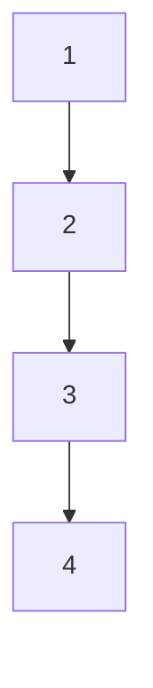

## 有机化学

## Organic Chemistry

## 第二章：有机化合物的命名

主讲: 王锋

华中科技大学化学与化工学院

School of Chemistry & Chemical Engineering, HUST

## 有机化合物的命名

普通命名法 （结构简单化合物）  
系统命名法（结构复杂化合物）  
俗名 （约定俗成）

## 基团的命名

烃基：烷基、烯基、炔基、环烃基、芳基

含杂原子基团：卤素（X）、含氧（O）基团、含氮（N）基团、含硫（S）基团

## 常见的烷基

CH3-

甲基

$\mathrm { C H } _ { 3 } \mathrm { C H } _ { 2 ^ { - } }$

乙基

${ \mathsf { C H } } _ { 3 } { \mathsf { C H } } _ { 2 } { \mathsf { C H } } _ { 2 } =$

正丙基

chemical

Chemical structure of a conjugated alkene with R substituent

$( \mathsf { C H } _ { 3 } ) _ { 2 } \mathsf { C H } _ { 2 ^ { - } }$

异丙基

chemical

Chemical structure of a YR group with double bond, likely representing a substituted alkene or alkoxide

CH3CH2CH2CH2-正丁基

chemical

Chemical structure of a conjugated alkene with R group, likely representing a diene or alkane derivative

(CH3)2CHCH2 -异丁基

chemical

Chemical structure of a chiral alkene with R substituent

CH3CH2CH(CH3)-仲丁基

chemical

Chemical structure of a branched alkene with a substituent R group

(CH3)3C-叔丁基 (CH3)2CHCH2CH2-

chemical

Chemical structure of a substituted alkene with R group notation

异戊基

chemical

Chemical structure of a branched alkene with a substituent R group

CH3C(CH3)CH2CH3

叔戊基

chemical

Chemical structure of a substituted alkene with R group

(CH3)3CCH2-

新戊基

chemical

Chemical structure of a branched alkene with R substituent

## 常见的烯基

$$
\mathrm{CH} _ {2} = \mathrm{CH} -
$$

## 乙烯基

$$
\mathrm{CH} _ {3} \mathrm{CH} _ {2} = \mathrm{CH} -
$$

## 丙烯基

$$
\mathrm{CH} _ {2} = \mathrm{CHCH} _ {2} -
$$

## 烯丙基

$$
\mathrm{CH} _ {2} = \mathrm{C} (\mathrm{CH} _ {3}) -
$$

## 异丙烯基

$$
\mathrm{CH} _ {2} = \mathrm{CH} - \mathrm{CH} = \mathrm{CH} -
$$

## 1,3-丁二烯基

## 常见的炔基

## CH≡C-乙炔基

## 3 2 1${ \mathsf { C H } } _ { 3 } { \mathsf { C H } } \equiv { \mathsf { C } } -$ 1-丙炔基

## 3 2 1$C H \equiv C C H _ { 2 } -$ 2-丙炔基

# 常见的含苯环基团

chemical

Chemical structure of benzene ring with a methyl substituent

苯基

chemical

Chemical structure of 1,3-dimethylbenzene showing benzene ring with methyl substituent

对甲苯基

chemical

Chemical structure of 1,3-benzenesulfonylpropano-2-ylbenzene

苄基

chemical

Chemical structure of a substituted benzene ring with two phenyl groups and one central carbon

三苯甲基

chemical

Chemical structure of 1,3-dimethylcyclohexene showing benzene ring with double bond and hydrogen atoms

苯乙烯基

## 常见的环烃基

natural_image

Simple geometric shape resembling a triangle with a horizontal line extending from its right side (no text or symbols)

环丙基

chemical

Chemical structure of a substituted cyclohexane with methyl group

2-甲基环丙基

chemical

Chemical structure of cyclohexane, a six-membered aromatic ring with a methyl substituent

环己基

chemical

Chemical structure of cyclopentenone, a five-membered aromatic ring with a methyl substituent

3-环戊烯基

chemical

Chemical structure of 1,3-dimethylcyclohexene

2,4-环戊二烯基

## 含杂原子基团

## 卤素

F,

氟

Cl,

氯

Br,

溴

碘

## 含氧基团

HO-羟基

${ \mathrm { C H } } _ { 3 } { \mathrm { O } } \cdot$ 甲氧基${ \mathsf { C H } } _ { 3 } { \mathsf { C H } } _ { 2 } { \mathsf { O } } \cdot$ 乙氧基

chemical

Chemical structure of a biphenyl ether with ethylene glycol group

苄氧基$\sum \limits _ { C H _ { 3 } C = 0 } ^ { 0 }$ 乙酰氧基

chemical

四种羰基化合物的化学结构式，分别为羰基、甲酰基、乙酰基和甲氧羰基

chemical

Chemical structures of benzene, acetylene, and chloroethylene with their respective functional groups: phenyl酰基,氯甲酰基, and羧基

## 含氮基团

-NH2

氨基

-NHCH3

甲氨基

$\left. \mathbf { - N } ( \mathbf { C } \mathbf { H } _ { 3 } ) _ { 2 } \right.$

二甲氨基

$\mathbf { - N O } _ { 2 }$

硝基

-NO

亚硝基

-CN

氰基

## 含硫基团

-SH巯基-SCH3甲硫基

-SO3H磺酸基

$$
- \begin{array}{c} \mathrm{O} \\ \mathrm{S} - \mathrm{OH} \\ \mathrm{O} \end{array}
$$

$\begin{array}{c} { \boldsymbol { \mathbf { \mathit { \Sigma } } } } \displaystyle { \mathbf { \Sigma } } { \mathbf { \bar { \Sigma } } } { \mathbf { \bar { \Sigma } } } { \mathbf { \bar { \Sigma } } } { \mathbf { \Sigma } } { \mathbf { \bar { \Sigma } } } { \mathbf { \Sigma } } { \mathbf { \bar { \Sigma } } }  \end{array} { } { \mathbf { \Sigma } } { \mathbf { \Sigma } } { \mathbf { \Sigma } } { \mathbf { \bar { \Sigma } } } { \mathbf { \Sigma } } = { \mathbf { \bar { \Sigma } } } { \mathbf { \bar { \Sigma } } } { \mathbf { \Sigma } } { \mathbf { \Sigma } } \displaystyle { \mathbf { \Sigma } } { \mathbf { \bar { \Sigma } } } { \mathbf { \Sigma } } \displaystyle { \mathbf { \Sigma } } { \mathbf { \bar { \Sigma } } } { \mathbf { \Sigma } } \displaystyle { \mathbf { \Sigma } } { \mathbf { \Sigma } } { \mathbf { \bar { \Sigma } } } { \mathbf { \Sigma } } { \mathbf { \Sigma } } $ 甲砜基

$$
- \begin{array}{c} \mathrm{O} \\ \mathrm{S} - \mathrm{CH} _ {3} \\ \mathrm{O} \end{array}
$$

-SOCH3 3甲亚砜基

$$
- \stackrel {\mathrm{O}} {\mathrm{S}} - \mathrm{CH} _ {3}
$$

## 普通命名法

• 按分子中的碳原子数目的多少来命名。  
• 用正、异、新等字区别同分异构体

正：不含支链

异：在链端的第二位碳原子上有一个- $- C H _ { 3 }$ 支链

新：在链端的第二位碳原子上有两个- $- C H _ { 3 }$ 支链

适用于十个碳原子以内化合物的命名

甲、乙、丙、丁、戊、己、庚、辛、壬、癸

一、二、三、四、五、六、七、八、九、十

正：不含支链

异：在链端的第二位碳原子上有一个 $\mathbf { \bar { \mathbf { \rho } } } _ { \mathbf { \bar { \mathbf { \rho } } } } - \mathbf { C H } _ { 3 }$ 支链新：在链端的第二位碳原子上有两个- $\mathbf { \bar { \mathbf { \rho } } } _ { \mathbf { \bar { \mathbf { \rho } } } } - \mathbf { \bar { \mathbf { C } } H _ { 3 } }$ 支链

chemical

正戊烷与异戊烷的化学结构式图，显示两个正戊烷和异戊烷的分子关系

chemical

New戊烷分子结构式，显示两个正负碳原子和一个新戊烷的代入式

$$
\begin{array}{c} \mathrm{CH} _ {3} \\ | \\ \mathrm{CH} _ {3} \mathrm{CHCH=CH} _ {2} \end{array}
$$

异戊烯

$$
\begin{array}{c} \mathrm{CH} _ {3} \\ | \\ \mathrm{CH} _ {3} \mathrm{CHC} \equiv \mathrm{CH} \end{array}
$$

异戊炔

## 系统命名法-烷烃的系统命名

• 选择一个最长的碳链作为主链，按这个链所含碳原子数将此母体命名为某烷  
• 主链碳原子编号从靠近支链的一端开始  
• 相同的取代基在名称中合并列出,用中文数字表明取代基数目，阿拉伯数字表示取代基位置  
• 不同基团如编号相同，按顺序规则，从顺序较小的一端开始编号  
• 次级取代基从主链相连的碳原子开始编号  
• 优先选取代基数目最多和取代基编号较小的碳 链

• 选择一个最长的碳链作为主链  
• 编号从靠近支链的一端开始

chemical

Chemical structure of a branched alkane with methyl and ethyl substituents, labeled with carbon chain lengths (8, 1, 2, 8) and numbered positions.

2-甲基辛烷

如果含有几个相同的取代基，则在名称中合并列出  
取代基前面以二、三、四等中文数字表明取代基的数目  
• 阿拉伯数字表示取代基的位置

chemical

Structural formula of a branched alkane with methyl and ethyl groups

chemical

Chemical structure of 2,6,7-trimethyl-1-methyl-3-methylaniline with labeled carbon positions and methyl groups

烷

chemical

Chemical structure diagram of a triethylmethyl-2,3,7-dimethyl-1,2,3-tris(1,2,3,7-triethylmethyl)heptane with labeled carbon positions and methyl groups

正确

烷

## 顺序规则

1. 单原子取代基按原子序数大小排列，原子序数大的 序号大；同位素中质量高的序号大；

$$
I > B r > C l > S > P > F > O > N > C > D > H
$$

2. 多原子基团按逐级比较原则：先比较大的——有大则大

$$
\begin{array}{c c} - \mathrm{CH} _ {2} \mathrm{Cl} & - \mathrm{CHF} _ {2} \\ \mathrm{C(Cl,H,H)} & \mathrm{C(F,F,H)} \end{array}
$$

3. 含双键或叁键基团，可认为连有两个或三个相同原子(课本P18)

chemical

Chemical structures of various alkene functional groups including -C≡CH, -C(CH₃)₃, and -CH=CH₂

提示：将双键/叁键打开，两边各补齐所连接的 原子后再做比较

如果有不同的取代基，按“顺序规则”中基团顺序，序号较小的取代基优先写出（小号优先）

$$
I > B r > C l > S > P > F > O > N > C > D > H
$$

chemical

Chemical structure of a brominated alkane with numbered positions 8, 6, 2, and 1

2-甲基-6-溴辛烷

如果两个不同取代基所在的位置从两端编号均相同，按“顺序规则”，从较小基团的一端开始标号

$$
I > B r > C l > S > P > F > O > N > C > D > H
$$

$$
\begin{array}{c} \text {Cl} \\ \text {CH} _ {3} \text {CHCH} _ {2} \text {CH} _ {2} \text {CH} _ {2} \text {CH} _ {2} \text {CH} _ {2} \text {CHCH} _ {3} \end{array}
$$

2-甲基-7-氯辛烷

## 如果支链上还有次级取代基：

• 从与主链相连的碳原子开始将支链碳原子依次以1’,2’,3’…编号  
• 支链取代基的位置就由这个编号所得的序号表示  
次级取代基用括号括起来写在支链序号后和支链名称的前面

chemical

Chemical structure diagram with numbered carbon atoms and functional groups, including a numerical identifier 2,7,9

2,7,9-三甲基-6-(2’-甲基丙基)十一烷

-三甲基-6-异丁基十一烷具有两个或两个以上相同长度碳链的分子，选择取代基数目最多的碳链为主链

chemical

Chemical structure diagram showing carbon chain with numbered atoms and branching paths

2,3,5-三甲基-4-丙基辛烷

## 2,5-二甲基-4-(2’-甲基丙基)庚烷

chemical

Structural formula of a branched alkane molecule with methyl and ethyl groups

## 2,5-二甲基-4-异丁基庚烷

chemical

Structural formula of a branched alkane molecule with methyl and ethyl substituents

5,5-二甲基-4-乙基壬烷

## 单环化合物的系统命名

• 脂肪/芳香环上连有简单烷基、硝基、亚硝基、卤素时，以环为母体命名

chemical

Chemical structure of 1,2-dimethylcyclohexane showing a cyclopentene ring attached to a CH3 group

甲基环戊烷

chemical

Chemical structure of a substituted cyclohexanone with nitro and methyl groups

1-甲基-2-硝基环己烷

chemical

Chemical structure of 1-chloro-2,4-dimethylbenzene showing benzene ring with chlorine and methyl substituents

2-氯甲苯

## 单环化合物的系统命名

• 脂肪/芳香环上连有复杂烷基（烯烃、炔烃基团）、氨基、羟基、醛基、羧基等时，环作为取代基命名

chemical

Chemical structure of a carboxylic acid (COOH) with a triangular ring and double bond

环丙基甲酸

chemical

Chemical structure of a substituted cyclohexanol with hydroxyl and methyl groups

2-甲基环己醇

## 多环烷烃：含有两个或多个环的烷烃

桥环：两个环共用两个或多个碳原子的多环烷烃

flowchart

二环[1.1.0]丁烷

[X.Y.Z]

X. Y: 主桥两侧碳原子数，先多后少Z:主桥碳原子数

chemical

Numbered molecular structure diagram with numbered vertices

二环[3.2.1]辛烷

螺环：单环之间共用一个碳原子的多环烷烃

text_image

1
2
3
4
5
6
7
8
9
10

螺[4. 5]癸烷

natural_image

Two interlocking hexagons forming a symmetric design (no text or symbols)

螺[5. 5]十一烷

## 顺反异构体的命名

• 环烷烃环上有两个取代基时，可用“顺/反”表明取代基与环平面的位置关系；两个取代基在同侧——“顺”，反之为“反”

chemical

Chemical structure of a cyclohexane ring with two chlorine substituents

chemical

Chemical structure of a cyclohexane ring with chlorine substituents

顺-1,4-二氯环己烷

反-1,4-二氯环己烷

## 烯烃/炔烃的普通命名

简单的烯/炔烃用普通名，但大多数烯烃用系统命名法命名

$$
\begin{array}{l} \mathrm{CH} _ {2} = \mathrm{CH} _ {2} \\ \mathrm{CH} _ {2} = \mathrm{CHCH} _ {3} \\ \mathrm{CH} _ {2} = \begin{array}{c} \mathrm{CH} _ {3} \\ \mathrm{CCH} _ {3} \end{array} \\ \end{array}
$$

$$
\mathrm{H} _ {3} \mathrm{C} - \mathrm{C} \equiv \mathrm{C} - \mathrm{CH} _ {3}
$$

二甲基乙炔

$$
\mathrm {H_ {3} C - C\equiv C - CH_ {CH_ {3}} ^ {C H _ {3}}}
$$

甲基异丙基乙炔

## 烯烃/炔烃的系统命名

## 烯烃/炔烃的系统命名法：

1. 选择含双键/叁键的最长碳链为主链，按主链碳原子数命名为“某烯”/“某炔”  
2. 从靠近双键/叁键一端开始给主链编号，使双键/叁键所在碳原子位号最小，把双键/叁键的较小数字及取代基的位次、数目和名称写在某烯/某炔之前

chemical

Chemical structure of a branched alkane with numbered carbon atoms and a central CH group

3-甲基-1-己烯

chemical

Chemical structure of 1,2,3,4,5-butene showing carbon chain with methyl groups and hydrogen bonds

4-甲基-2-戊烯

## 烯烃/炔烃的系统命名

chemical

Chemical structure of a branched alkane with numbered carbon positions

3-甲基-1-丁炔

## 顺反异构体的命名

若分子中两个双键碳原子连有两个相同的基团时，可用“顺反”命名区别。两个相同的基团在双键同侧为“顺”，反之为“反”

chemical

Structural formula of 2-methylcyclohexane showing carbon, hydrogen, and methyl groups

顺-2-丁烯

chemical

Structural formula of 1,3-butene showing carbon chain with methyl and hydrogen substituents

反-2-丁烯

## 顺反异构体的命名

• 若分子中两个双键碳原子连有两个或多个不同的基团相连，可采用Z-E构型来标示。Z-E确定原则：按顺序规则，两个双键碳原子上的两个序数大的原子（或基团）在双键同侧，为Z型；在异侧，为E型。注：先区分同一碳原子上基团的大小，再看两个碳原子上的大基团在双键上的空间分布，同侧Z，异侧E。

chemical

Molecular structure of bromo-1,2-dimethyl-3-methane (BrCH₃) with labeled atoms and bonds

两个大基团在双键异侧（E）

chemical

Chemical structure diagram showing a central carbon bonded to three chlorine, bromine, and methyl groups, with small and large red boxes below.

两个大基团在双键同侧（Z）

(E)-1-溴丙烯

(Z)-1-氯-1-溴丙烯

# 卤代烃的命名:普通命名法

$$
\mathrm{CH} _ {3} \mathrm{CH} _ {2} \mathrm{CH} _ {2} \mathrm{CH} _ {2} \mathrm{Cl}
$$

正丁基氯

$$
\mathrm{CH} _ {3} \mathrm{CHCH} _ {3}
$$

Br

溴异丙烷

$$
\mathrm{H} _ {2} \mathrm{C} = \mathrm{CHCH} _ {2} \mathrm{Br}
$$

烯丙基溴

$$
\mathrm{H} _ {2} \mathrm{C} = \mathrm{CHCl}
$$

氯乙烯

chemical

Chemical structure of 1,3-benzenesulfonyl chloride

苄基氯（苄氯）

chemical

Chemical structure of bromobenzene, showing a benzene ring with a bromine substituent

溴苯

## 卤代烃的命名:系统命名法

• 系统命名法中，卤原子作为取代基来命名。

chemical

Chemical structure of a branched alkane with methyl and chlorine substituents

3-甲基-2-氯戊烷

chemical

Chemical structure of a brominated alkane with two methyl groups attached to the carbon chain

2-甲基-4-溴戊烷

chemical

Chemical structure of 1-chloro-4-methylbenzene showing methyl and chlorine substituents on benzene ring

4-氯甲苯（对氯甲苯）

3-氯-1-丙烯

## 醇的结构和命名（普通命名）

$$
\mathrm{CH} _ {3} \mathrm{CH} _ {2} \mathrm{CH} _ {2} \mathrm{CH} _ {2} \mathrm{OH}
$$

正丁醇

chemical

Chemical structure of cyclohexanol, showing a benzene ring with an OH group attached to the adjacent carbon.

环己醇

饱和醇

$$
\mathrm{CH} _ {2} = \mathrm{CH} - \mathrm{CH} _ {2} \mathrm{OH}
$$

烯丙醇

不饱和醇

chemical

Chemical structure of benzoic acid, showing a benzene ring with an OH group attached to the adjacent carbon.

苄醇

芳香醇

## 醇的结构和命名（系统命名）

chemical

Chemical structure of a diol with methyl and hydroxyl substituents

2-丁醇

chemical

Chemical structure of a branched hydrocarbon with methyl and hydroxyl groups

4-甲基-2-戊醇

chemical

Chemical structure of a branched hydrocarbon with methyl and chlorine substituents

2,4,5-三甲基-3-氯-1-庚醇

$$
\mathrm{CH} _ {3} - \mathrm{CH} = \mathrm{CHCH} _ {2} \mathrm{CH} _ {2} \mathrm{OH}
$$

3-戊烯-1-醇

## 醛酮的命名（普通命名）

甲醛

乙醛

chemical

Chemical structure of a chiral molecule with oxygen and double bond groups

丙烯醛

chemical

Chemical structure of a dichloroalkane molecule with methyl and CHO groups

α-氯丙醛

chemical

Chemical structure of a brominated alkane with methyl and hydroxyl groups

β-溴丁醛

chemical

Chemical structure of a branched alkene with methyl and carbonyl groups

丙酮

chemical

Chemical structure of a polyethylene glycol with a terminal hydroxyl group

甲乙酮甲基乙基酮甲基乙烯基酮

chemical

Chemical structure of a branched alkene with methyl and vinyl groups

## 醛酮的命名（系统命名）

$$
\begin{array}{c} \mathsf {C H} _ {3} - \mathsf {C H} - \mathsf {C H O} \\ \mathsf {C H} _ {3} \end{array}
$$

2-甲基丙醛

$$
\mathrm{CH} _ {2} = \mathrm{CH} - \stackrel {\mathrm{O}} {\mathrm{C}} - \mathrm{CH} _ {3}
$$

3-丁烯-2-酮

$$
\begin{array}{c} \mathrm{O} \\ \mathrm{CH} _ {3} - \stackrel {{\mathrm{I}}} {{\mathrm{C}}} - \stackrel {{\mathrm{I}}} {{\mathrm{CH}}} - \mathrm{CH} _ {3} \end{array}
$$

3-甲基-2-丁酮

3-甲基环己酮

苯甲醛

苯乙酮

二苯甲酮（二苯酮）

4-苯基-2-丁酮

## 羧酸的命名

chemical

Chemical structure of a branched-chain organic molecule with methyl and carboxyl functional groups

3-甲基丁酸  
β-甲基丁酸

chemical

Chemical structure of a triacrylate ester with methyl and carboxyl groups

2-丁烯酸

chemical

Chemical structure of a cyclopentane derivative with two methyl groups and one carboxyl group

3-环戊基丙酸  
β-环戊基丙酸

chemical

Chemical structure of a substituted cyclohexane with methyl and carboxyl groups

顺-2-甲基环己烷酸

## 胺类化合物的命名

## 简单的胺用它们所含的烃基命名

$\mathsf { C H } _ { 3 } \mathsf { N H } _ { 2 }$

甲胺

$( C H _ { 3 } ) _ { 2 } N H$

二甲胺

$( C H _ { 3 } ) _ { 3 } N$

三甲胺

$( \mathsf { C H } _ { 3 } ) _ { 2 } \mathsf { C H N H } _ { 2 }$

异丙胺

chemical

Chemical structure of 2-methylcyclohexane, showing a benzene ring with an amino group attached

环己胺

chemical

Chemical structure of an amino group (NH₂) attached to a benzene ring

苯胺

chemical

Chemical structure of 2-methylphenylamine, showing a benzene ring with nitrogen and methyl substituents

N,N-二甲苯胺

chemical

Chemical structure of a hydrazone derivative with an amino group attached to a benzene ring

N-乙基-对甲苯胺

$H _ { 2 } N ( C H _ { 2 } ) _ { 6 } N H _ { 2 }$

己二胺

## 胺类化合物的命名

复杂的胺以烃基为母体，氨基作为取代基来命名

$$
\begin{array}{c} (\mathrm{CH} _ {3}) _ {2} \mathrm{CHCH-CH} _ {3} \\ \mathrm{NH} _ {2} \end{array}
$$

2-氨基-3-甲基丁烷

$$
(\mathbf {C H} _ {3}) _ {4} \overset {+} {\mathbf {N C l}}
$$

氯化四甲铵

$$
\begin{array}{c} \mathrm {N(C_ {2} H_ {5}) _ {2}} \\ \mathrm {CH_ {3} CH_ {2} CH - \overset {\cdot} {C} HCH_ {3}} \\ \overset {\cdot} {C} H _ {3} \end{array}
$$

2-(N,N-二乙氨基)-3-甲基戊烷

$$
[ (\mathbf {C H} _ {3}) _ {3} \overset {+} {\mathrm{NC}} _ {2} \mathrm{H} _ {5} ] \mathrm{OH} ^ {-}
$$

氢氧化三甲乙铵

## 多官能团命名

羧酸 > 酯 > 酰卤 > 酰胺 > 腈 > 醛 > 酮 >醇> 胺> 醚>炔烃>烯烃>烷烃  
• -X和 $\left. - \mathsf { N O } _ { 2 } \right.$ 只作为取代基，不作为母体

chemical

Chemical structure of a carboxylic acid with hydroxyl and methyl substituents

3-羟基丁酸

chemical

Chemical structure of a carbonyl compound with a CHO group attached to the carbon

3-氧代戊醛

## 多官能团命名

分子中同时含有双键和叁键，可以烯炔做词尾，给双键、叁键尽可能低的位号，如果位号有选择，双键位号比叁键小。

$$
\mathrm{CH} _ {3} \mathrm{CH} = \mathrm{CHC} \equiv \mathrm{CH}
$$

3-戊烯-1-炔

$$
\mathrm{HC} \equiv \mathrm{CCH} _ {2} \mathrm{CH} = \mathrm{CH} _ {2}
$$

1-戊烯-4-炔

## 俗名

chemical

Chemical structure of a disaccharide with methyl and hydroxyl groups

乳酸

新陈代谢、运动中产生阿司匹林以及很多止痛药里的成分

chemical

Chemical structure of a substituted benzene ring with carboxylic acid and hydroxyl groups

水杨酸

chemical

Chemical structure of a substituted benzene ring with carboxylic acid, hydroxyl, and hydroxymethyl groups

没食子酸

食品工业，抗氧化剂

chemical

Chemical structure of a polyene compound with cyclohexene and hydroxyl functional groups

维生素A

chemical

Chemical structure of a glycoside derivative with multiple hydroxyl groups and a lactone ring

维生素C

## 本章作业

## 1. 用系统命名法给下列化合物命名

(1) $( \mathsf { C H } _ { 3 } ) _ { 2 } \mathsf { C H C H } _ { 2 } \mathsf { C H } _ { 2 } \mathsf { C H } _ { 1 } ( \mathsf { C H } _ { 3 } ) _ { 2 }$

(2) $\begin{array} { r } { \mathsf { C H } _ { 3 } \qquad \mathsf { C H } _ { 3 } \qquad \mathsf { C H } _ { 3 } \qquad \mathsf { C H } _ { 2 } \mathrm { - } \mathsf { C H } _ { 3 } } \\ { \mathsf { C H } _ { 3 } \mathrm { - } \mathsf { C H } _ { 2 } \mathrm { - } \mathsf { C H } \mathrm { - } \mathsf { C H } _ { 2 } \mathrm { - } \underset { \mathsf { C H } _ { 3 } } { \underbrace { \mathsf { C H } _ { 3 } } } \mathrm { C H } _ { 2 } \mathrm { - } \mathsf { C H } \mathrm { - } \mathsf { C H } _ { 2 } \mathrm { - } \mathsf { C H } _ { 3 } } \end{array}$

chemical

Chemical structure of a branched alkane with methyl and ethyl groups, labeled as (3)

chemical

Chemical structure of a branched alkene with methyl and ethyl groups

chemical

Chemical structure of a branched alkene with methyl and ethyl substituents

chemical

Chemical structure of a branched alkane with methyl and vinyl substituents

chemical

Chemical structure of a branched alkene with methyl and ethyl substituents

(8)  

chemical

Chemical structure of a branched alkane with two methyl groups and one cyclohexane ring

## 2. 根据下列名称写出化合物的结构式

（1）新戊烷  
（2）异丁烷  
（3）3,4,5-三甲基-4-丙基庚烷  
（4）4-叔丁基庚烷  
（5）1-丁烯  
（6）2,4-二甲基-2-戊烯  
（7）反-3,4-二甲基-3-己烯  
（7） 甲基环己烷  
（8）甘油

3.（选择题）下列化合物中为螺环化合物的是\_\_，为桥环化合物的是

chemical

Chemical structure of naphthalene, labeled as compound A

chemical

Chemical structure of a chlorinated cyclohexane ring with two cyclopentadienyl rings attached to a cyclohexane ring

chemical

Chemical structure diagram labeled C, showing a cyclohexane ring with chlorine substituent

chemical

Chemical structure of a fused heterocyclic compound with nitrogen and double bond indicated

