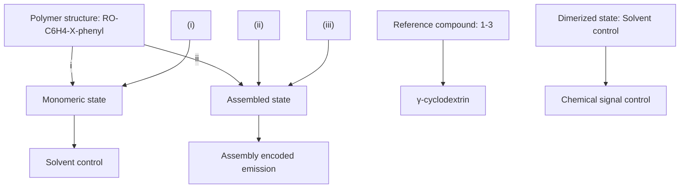
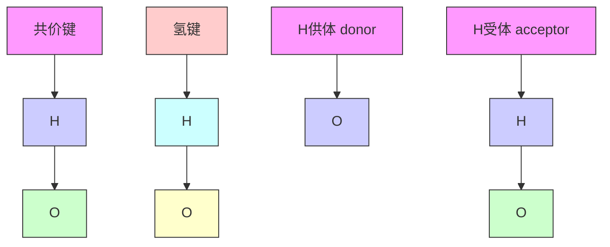

# 有机化学

# Organic Chemistry

## 第三章：有机分子的弱相互作用与物理性质

主讲: 王锋

华中科技大学化学与化工学院

School of Chemistry & Chemical Engineering, HUST

natural_image

Portrait of an elderly man wearing glasses and a collared shirt (no text or symbols visible)

## 超分子化学

## supramolecular chemistry

Jean-Marie Lehn: 法国化学家

1987年诺贝尔化学奖：超分子化学

## 化学架起了通向研究复杂物质的桥梁

text_image

The Big Bang
PHYSICS
CHEMISTRY
BIOLOGY
Towards Complex Matter
Chemistry starts around here
300 thousand years
3 minutes
1 second
10⁻¹⁰ seconds
10⁻²⁴ seconds
10⁻³³ seconds
10⁻³⁹ degrees
10⁻⁴⁷ degrees
10⁻⁵⁵ degrees
10⁻⁶³ degrees
10⁻⁷¹ degrees
10⁻⁷⁹ degrees
10⁻⁸⁶ degrees
10⁻⁹⁴ degrees
10⁻¹⁰¹ degrees
10⁻¹⁰⁹ degrees
10⁻¹¹⁷ degrees
10⁻¹²⁶ degrees
10⁻¹³⁴ degrees
10⁻¹⁴² degrees
10⁻¹⁵¹ degrees
10⁻¹⁵⁹ degrees
10⁻¹⁶⁷ degrees
10⁻¹⁷⁵ degrees
10⁻¹⁸⁴ degrees
10⁻¹⁹³ degrees
10⁻²⁰² degrees
10⁻²¹¹ degrees
10⁻²²⁰ degrees
10⁻²³⁹ degrees
10⁻²⁵⁸ degrees
10⁻²⁷⁷ degrees
10⁻²⁹⁶ degrees
10⁻³¹⁵ degrees
10⁻³³⁴ degrees
10⁻³⁵² degrees
10⁻³⁷¹ degrees
10⁻³⁸⁹ degrees
10⁻⁴⁰⁷ degrees
10⁻⁴²⁵ degrees
10⁻⁴⁵³ degrees
10⁻⁴⁷² degrees
10⁻⁴⁹¹ degrees
10⁻⁵¹⁹ degrees
10⁻⁵³⁷ degrees
10⁻⁵⁵⁵ degrees
10⁻⁵⁷³ degrees
10⁻⁶⁰¹ degrees
10⁻6²⁹ degrees
10⁻6⁴⁷ degrees
10⁻⁶⁷⁵ degrees
10⁻⁶⁹³ degrees
10⁻⁷¹² degrees
10⁻⁷³¹ degrees
10⁻⁷⁵⁹ degrees
10⁻⁷7⁷ degrees
10⁻⁸⁰⁵ degrees
10⁻8²³degrees
proton
neutron
meson
hydrogen
deuterium
heffium
electron
Li lithium

Angew Chem Int Ed 2013, 52, 2836.

text_image

TOWARDS COMPLEX MATTER
By SELF-ORGANIZATION
CHEMISTRY
PHYSICS
BIOLOGY
The Laws of
the Universe
The Rules of
Life
The BRIDGE towards COMPLEX MATTER

## 超分子化学 supramolecular chemistry

flowchart

D.-H. Qu, H. Tian, et al. Nature Communications, 2020, 11, 158.

## 3.1 分子间的弱相互作用

范德华作用力

色散力 诱导力 取向力

氢键作用  
疏水亲脂作用

## 化学键：200 – 600 kJ mol-1

## 分子间作用力：< 100 kJ mol-1

分子间作用力：比化学键弱、作用范围比化学键广

## 范德华作用力

• 又称“分子间作用力”  
• 分子间弱相互作用  
分子接近一定距离时产生，随分子间距离的增加迅速减弱  
• 色散力、诱导力、取向力

natural_image

Portrait of an elderly man with a white beard and glasses, wearing formal attire (no text or symbols visible)

范德华（1837-1923）  
荷兰物理学家

## 色散力 (dispersion force)

# 由瞬时偶极而产生的分子间相互作用力

natural_image

Simple black oval shape on white background with no text or symbols

一大段时间内的大体情况

text_image

+ -

每一瞬间

text_image

+ -
+ -

非极性分子的瞬时偶极之间的相互作用

text_image

- + - +

色散力存在于非极性分子之间、极性分子与非极性分子之间、极性分子之间

## 诱导力 (induction force)

诱导偶极与固有偶极之间产生的分子间相互作用力。

text_image

+ -

分子离得较远  

natural_image

Simple oval shape with no text, numbers, or symbols

text_image

+ -

text_image

+ -

分子靠近时

诱导力存在于极性分子与非极性分子之间、极性分子之间，诱导力必须有极性分子存在时才存在

## 取向力 (orientation force)

极性分子之间固有偶极的取向所产生的吸引力。

text_image

- - +
+ +

分子离得较远

text_image

+ - + -

取向

取向力只存在于极性分子之间

非极性分子-非极性分子： 色散力

极性分子-非极性分子：色散力、诱导力

极性分子-极性分子：色散力、诱导力、取向力

## DNA双螺旋结构

## 生命的密码

氢键

hydrogen bond

chemical

3D molecular structure of DNA showing helical arrangement with color-coded atoms

# 氢键是一种分子间的弱相互作用力

chemical

Molecular structure diagram showing red and gray spheres representing atoms in a 3D arrangement

水分子形成氢键网络

共价键的键能：200-600 kJ mol-1

氢键的键能：20-30 kJ mol-1

（作用力弱， 作用范围广）

natural_image

Illustration of children playing with hands on a grassy field under a cloudy sky (no text or symbols)

## 氢键作用

分子中与一个电负性很大的元素相结合的H原子，还能与另一分子中电负性很大的原子间产生一定的结合力而形成的键。

表示为：X—H Y，其中X，Y代表F，O，N等…电负性大的原子。

chemical

氢键的本质是静电作用示意图，展示氢键通过氢键与氢键结合生成氢键的结构

## 氢键作用

氢键的键能比化学键的键能小且具有较强的方向性和饱和性。氢键的静电作用的本质可成功地解释氢键的一些性质，例如：

1）氢键键能一般为20-30 kJ/mol，这与理论计算的偶极-偶极或偶极-离子的静电作用能基本相当。  
2）不同类型氢键的键能随X，Y原子电负性的增大或半径的减小而增大。  
3）氢键的几何构型一般为直线型或稍有弯曲，以使X，Y间静电斥力最小。（方向性）

## 氢键的方向性和饱和性

flowchart

## 氢键的方向性(directionality)和饱和性(saturability)

• H受体Y与供体X之间的角度接近180°  
• 氢供体、氢原子、氢受体成一直线  
• 一般情况下，一个H受体只与一个H原子形成氢键

chemical

3D molecular structure of DNA showing major and minor grooves with labeled positions 3', 5', 3' and 5'

chemical

Chemical structure of a nucleotide chain with labeled nucleotides and phosphate groups

氢键的高度方向性使得被氢键连接的两个基团维持特有的几何排列。  
DNA双螺旋结构精准的三维结构即得益于氢键的方向性。

腺嘌呤(A)和胸腺嘧啶(T)之间形成两个氢键鸟嘌呤(G)和胞嘧啶(C)之间形成三个氢键

chemical

Chemical structure of a benzene ring with carboxylic acid and hydroxyl groups

分子内氢键intramolecular hydrogen bond  

chemical

Chemical structure of a benzene ring with hydroxyl and carbonyl groups

natural_image

Cartoon illustration of a boy wearing a T-shirt with a smiley face (no text or symbols)

邻羟基苯甲醛（水杨醛）

沸点：197 ℃

chemical

Chemical structure of a substituted benzene ring with ketone and hydroxyl groups

对羟基苯甲醛

沸点：246 ℃

chemical

分子间氢键（intermolecular hydrogen bond）的化学反应示意图，展示两个不同分子间氢键生成的结构式

chemical

氢键分子结构示意图，标注了氢键位置

chemical

Chemical structure of a naphthalene derivative with two carbonyl groups and a hydroxyl group at the top

英国诺丁汉大学研究成果  
b  

text_image

氢键
-7.0 Hz
-10.0
-12.0
-14.0
-16.0
-18.0
-20.0
-21.0

C  

chemical

Molecular structure diagram showing hydrogen bonding interactions with color-coded electrostatic potential map

## Dynamic Force Microscopy (DFM) 动态力显微成像技术

A. M. Sweetman, et al., “Mapping the force field of a hydrogen-bonded assembly”, Nature Communications, 2014, 5, 3931.

## 萘四甲酸二亚胺

Naphthalenetetracarboxylic diimide

## Cancer \_Medicine

chemical

Molecular structure of a naphthalene derivative with ester and hydroxyl functional groups

阿克拉菌酮aklavinone

natural_image

Microscopic view of a red, textured biological structure against a purple background (no text or symbols)

## 氢键在有机化学中的应

chemical

Reaction mechanism diagram showing bromination, dehydration, and oxidation steps with 90% yield

## 亲脂疏水作用

有机分子溶解于水后，水分子要保持原有的结构而排斥有机分子的倾向称为疏水作用，而有机分子之间的范德华吸引力称为亲脂作用。  
• 表面活性剂分子在水中因为这种作用可以形成胶束。

## 胶束：表面活性剂去污原理

chemical

Molecular structure of a virus with H₂O molecules shown as small droplets

Micelle

  
hydrophillic  
(water-loving)  
hydrophobic  
(water-hating)  
tail

chemical

Chemical structure of a sodium sulfonate compound with benzene ring and alkyl chain

尾

## 亲脂疏水作用的应用

chemical

Chemical structure of P-NB polymer with repeating units and functional groups labeled

ang, Min Wen, Ke Feng, Wen-Jing Liang, Xu-Bing Li, Bin Chen, Chen-Ho Tung, Li-Zhu Wu\* , Chem. Common., 2016, 52, 457-460.

line chart

| Time / h | Concentration / M |
| -------- | ----------------- |
| 0        | 0.0               |
| 5        | ~5.0×10⁻⁵         |
| 10       | ~1.0×10⁻⁴         |
| 20       | ~1.8×10⁻⁴         |
| 30       | ~1.9×10⁻⁴         |
| 50       | ~1.9×10⁻⁴         |

line chart

| Wavenumber / cm⁻¹ | P-NB | PDT | PDT@P-NB |
| ----------------- | ---- | --- | -------- |
| 2071              |      |     |          |
| 2029              |      |     |          |
| 2032              |      |     |          |
| 2072              |      |     |          |

line chart

| Diameter (nm) | P-NB | PDT@P-NB |
| ------------- | ---- | -------- |
| 31.0          | 31.0 | 31.7     |

## 亲脂疏水作用的应用

chemical

Molecular structure of a photonic device with UV light interacting with H2 and Ru(bpy)32+ catalysts, alongside a PDT model showing Fe-SO coordination.

Self-assembled system for photocatalytic ${ \sf H } _ { 2 }$ production in aqueous system

Micellar system  

Organic system  

bar chart

| Samples | CH₃CN/H₂O = 4/1 (TON x 10) | H₂O (TON x 10) | CH₃CN/H₂O = 4/1 (TON x 10) | H₂O (TON x 10) |
| :--- | :--- | :--- | :--- | :--- |
| A | 5 | 48 | 4.1 | 134 |
| B | 16 | 89 | - | - |
| C | 39 | 134 | - | - |

组装体系优点：

• 省去复杂的合成工作  
• 水中质子迁移速率提高  
• 局部催化剂浓度增强效应

## 3.2 分子间弱相互作用对物理性质的影响

分子间相互作用与沸点  
• 分子间相互作用与熔点  
• 分子间相互作用与溶解性

## 分子间弱相互作用与化合物的沸点

<table><tr><td>化合物</td><td>甲烷</td><td>丙烷</td><td>戊烷</td><td>庚烷</td><td>壬烷</td></tr><tr><td>沸点°C</td><td>-161.6</td><td>-42.1</td><td>36.1</td><td>98.4</td><td>150.7</td></tr></table>

## 直链烷烃随碳原子数增加，沸点增加

原因：碳原子增加、分子链变长，分子与分子之间的接触面增加——范德华作用力增强。

chemical

Molecular structure of methane (CH₄) showing carbon bonded to three hydrogen atoms in a ring

甲烷之间接触面小  

chemical

Molecular structure of methane (CH₄) showing carbon bonded to three hydrogen atoms in a ring

chemical

Two identical organic molecular structures, each consisting of a methyl group and connected to a branched alkane chain

正戊烷之间接触面大

## 同分异构体：直链烷烃的沸点大于支链烷烃。支链越多，沸点越低。

chemical

Simple zigzag line structure representing a linear alkane or polymer chain

正戊烷

36 ℃

chemical

Simple organic molecule structure with two branched alkyl chains

异戊烷

28 ℃

natural_image

Simple geometric line drawing with three intersecting lines forming a symmetrical shape (no text or symbols)

新戊烷

9.5 ℃

chemical

Chemical structure of ethene showing carbon-carbon double bond with methyl groups and hydrogen atoms

顺-2-丁烯

沸点：3.7 ℃

chemical

Molecular structure of ethane showing carbon-carbon double bond with hydrogen and methyl groups

反-2-丁烯

沸点：0.9 ℃

同分异构体：顺式烯烃沸点高于反式烯烃顺式偶极矩大

## 分子间弱相互作用与化合物的沸点

$C H _ { 3 } C H _ { 2 } O H$

乙醇（78.3℃）

$C H _ { 3 } O C H _ { 3 }$

$\boxed { \pm } \boxed { \pm 1 / \pm } \ \left( - 2 4 ^ { \circ } \mathbf { C } \right)$

$\mathbf { C H } _ { 3 } \mathbf { C H } _ { 2 } \mathbf { C H } _ { 3 }$

丙烷（-42.1 ℃）

分子量相当的醚和烷烃，醚的沸点较高：醚是极性分子，除具有色散力外，还具有诱导力和取向力，分子间作用力更强  
分子量相同的醇和醚，醇的沸点较高：醇分子中具有氢键

$$
\begin{array}{c c c} \mathrm {CH_ {3} CH_ {2} CHO} & \mathrm {CH_ {3} CCH_ {3}} & \mathrm {CH_ {3} CH_ {2} CH_ {2} CH_ {3}} \\ \text {丙醛(48°C)} & \text {丙酮(56°C)} & \text {丁烷(-0.5°C)} \end{array}
$$

分子量相当的醛、酮和烷烃，醛、酮的沸点较高：醛酮是极性分子，分子间作用力更强

chemical

Chemical structure of a cyclic ester with R and C substituents, showing stereochemistry

羧酸因为分子间形成氢键，容易形成二缔合体，沸点较相近分子量的醇、酯的沸点还高

$$
\mathrm{CH} _ {3} \mathrm{NH} _ {2}
$$

$$
\mathrm{CH} _ {3} \mathrm{CH} _ {2} \mathrm{NH} _ {2}
$$

$$
\mathrm{CH} _ {3} \mathrm{CH} _ {2} \mathrm{CH} _ {2} \mathrm{NH} _ {2}
$$

$$
\mathrm{CH} _ {3} \mathrm{CH} _ {2} \mathrm{CH} _ {2} \mathrm{CH} _ {2} \mathrm{NH} _ {2}
$$

甲胺（-7）

乙胺（17）

丙胺（49）

丁胺（77.8）

有机胺：随C原子数增加，沸点增加

$$
\left(\mathrm{CH} _ {3} \mathrm{CH} _ {2}\right) _ {2} \mathrm{NH}
$$

$$
\mathrm{CH} _ {3} \mathrm{CH} _ {2} \mathrm{CH} _ {2} \mathrm{CH} _ {2} \mathrm{NH} _ {2}
$$

## 二乙胺（56）

## 丁胺（77.8）

碳原子数相同，沸点：伯胺>仲胺>叔胺

伯胺可生成分子间氢键  
叔胺不能生成分子间氢键  
伯胺与仲胺比较，伯胺的链状使其分子间作用力更大

${ \mathsf { C H } } _ { 3 } { \mathsf { C H } } _ { 3 }$

乙烷（-88.5）

$\mathbf { C H } _ { 3 } \mathbf { C H } _ { 2 } \mathbf { N H } _ { 2 }$

乙胺（17）

${ \mathsf { C H } } _ { 3 } { \mathsf { C H } } _ { 2 } { \mathsf { O H } }$

乙醇（78.3）

相碳原子数的烷烃、伯胺、醇

沸点：醇>伯胺>烷烃

氢键：N-H---N比O-H---O弱

chemical

Chemical structure of a nitro-substituted benzene derivative with hydroxyl and amine groups

chemical

Chemical structure of a benzene ring with hydroxyl and nitro groups

chemical

Chemical structure of a bisphenol derivative with two nitro groups and a phenyl ether linkage

<table><tr><td>化合物</td><td>邻硝基苯酚</td><td>间硝基苯酚</td><td>对硝基苯酚</td></tr><tr><td>沸点/°C(0.009 MPa)</td><td>100</td><td>194</td><td>分解</td></tr></table>

沸点：分子内氢键化合物<分子间氢键化合物

## 分子间弱相互作用与化合物的熔点

## 熔点：有机分子的对称性、分子间的弱相互作用

对称性越好，熔点越高。  
分子间作用力越大，熔点越高。

表3.9常见直链烷烃的熔点

<table><tr><td>化合物</td><td>熔点/°C</td><td>化合物</td><td>熔点/°C</td></tr><tr><td>甲烷</td><td>-182.6</td><td>庚烷</td><td>-90.5</td></tr><tr><td>乙烷</td><td>-183.3</td><td>辛烷</td><td>-56.8</td></tr><tr><td>丙烷</td><td>-187.1</td><td>壬烷</td><td>-53.7</td></tr><tr><td>丁烷</td><td>-138</td><td>癸烷</td><td>-29.7</td></tr><tr><td>戊烷</td><td>-129.7</td><td>十一烷</td><td>-25.6</td></tr><tr><td>己烷</td><td>-95</td><td>十二烷</td><td>-9.7</td></tr></table>

line chart

| 碳原子数 | 熔点/°C (实线) | 熔点/°C (虚线) |
| -------- | -------------- | -------------- |
| 1        | -190           | -190           |
| 2        | -185           | -185           |
| 3        | -190           | -190           |
| 4        | -140           | -140           |
| 5        | -130           | -130           |
| 6        | -100           | -100           |
| 7        | -80            | -80            |
| 8        | -60            | -60            |
| 9        | -60            | -60            |
| 10       | -30            | -30            |
| 11       | -20            | -20            |
| 12       | -10            | -10            |
| 13       | 0              | 0              |
| 14       | 10             | 10             |
| 15       | 20             | 20             |

图3.3常见直链烷烃的熔点

直链烷烃的熔点随碳原子数的增加而升高  
含偶数碳原子的直链烷烃的熔点升高幅度大于含奇数碳原子的升高幅度  
偶数碳原子的烷烃分子的对称性要好于含奇数碳原子的烷烃，导致其熔点高于相邻奇数碳原子烷烃的熔点。

chemical

Simple zigzag line structure representing a linear molecule or chain

正戊烷

沸点 36 ℃

-130 熔点 ℃

chemical

Simple organic molecule structure with two branched alkyl chains

异戊烷

>

>

28 ℃

-160 ℃

>

<

natural_image

Simple geometric line drawing with three intersecting lines forming a symmetrical shape (no text or symbols)

新戊烷

9.5 ℃

-17 ℃

顺-2-丁烯

反-2-丁烯

沸点 3.7 ℃

>

0.9 ℃

熔点 -139 ℃

<

-105.5 ℃

## 分子间弱相互作用与溶解性

## 相似相溶

极性相似的化合物之间具有良好的相互溶解能力极性差别很大的化合物之间相互溶解能力差

## 3.3 分子识别与自组装

分子识别 molecular recognition  

chemical

Four crown ether molecular structures labeled 12-Crown-4, 15-Crown-5, 18-Crown-6, and 21-Crown-7, each with an inner diameter range in nm.

Li（0.136nm）

-057

1.21

0.00

1

Na+（0.194nm）

1.67

428

K+（0.266nm）

1.60

350

5.67

4.30

Cs+（0.334nm）

1.63

2.74

4.50

Binding Constant in Methanol (log Ka)

## 分子识别

chemical

Chemical structure of a polysaccharide repeating unit with glucose units and hydroxyl groups

a

chemical

Chemical structure of a cyclic sugar molecule with multiple hydroxyl groups and ring segments

3d diagram

| Hydrophobic Cavity Type | Cavity Size (nm) |
| ---------------------- | ---------------- |
| α-Cyclodextrin         | 0.45             |
| β-Cyclodextrin         | 0.70             |
| γ-Cyclodextrin         | 0.85             |

环糊精

## 自组装 self-assembly

chemical

金刚烷与Rim Binding反应示意图，展示β-CD作用下的聚合物结构及水解过程

J. Phys. Chem. Lett. 2011, 2, 2094–2098

## 利用主客体识别作用构筑纳米材料

chemical

Complex molecular structure with multiple aromatic rings and functional groups, labeled as compound 1

chemical

Complex polycyclic aromatic hydrocarbon molecular structure with fused rings and substituents labeled 2

chemical

Diagram illustrating the reaction of porphyrin nanowire 3 to form a polymer with water addition

natural_image

Microscopic image of a nanoscale structure with 100nm scale bar, no textual annotations or symbols present

natural_image

Microscopic image showing a nanoscale structure with a 20nm scale bar, no text or symbols present.

## 利用主客体识别作用构筑光催化剂

photocatalytic syngas production in H2O

photocatalyticactivity over>200 h

60.41mmol g1

CO: H = 2: 3

text_image

CuInS₂/ZnS
QD

CD-CISZ QD

chemical

Chemical structure of Co complex with self-assembly reaction, showing ligand C1

chemical

Diagram illustrating electron-hole pair generation and hydrogen bonding in a photoexcitator system, showing electron flow and H2/H+ interaction

C1@CD-CISZ QD

## 第3章作业

$3 - 2 3 - 3 3 - 4 3 - 5$

注：3-4第（1）小题不做3-5第（3）小题删掉“丙胺”