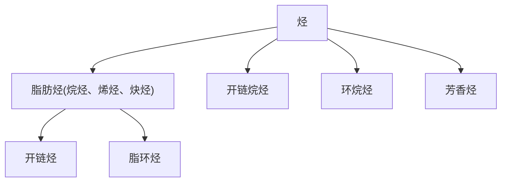
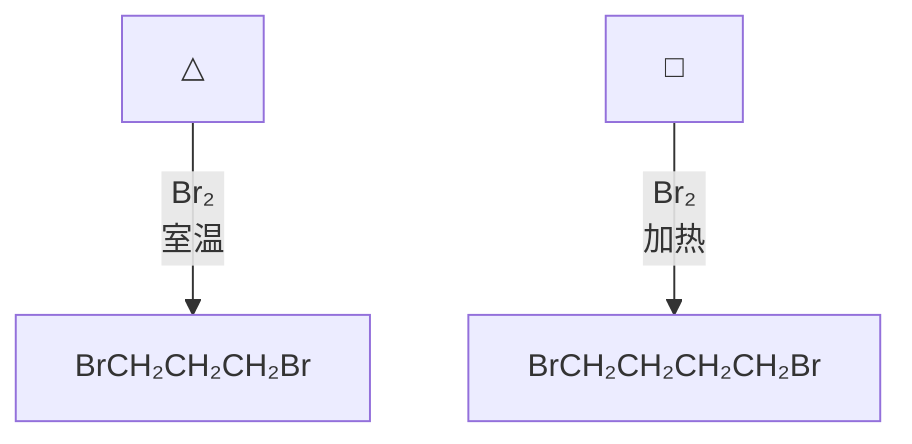

# 有机化学

# Organic Chemistry

## 第四章：饱和烃

主讲：王锋

华中科技大学化学与化工学院

School of Chemistry & Chemical Engineering, HUST烷烃：分子中碳、氢原子都以单键相连的烃类化合物，称为饱和碳氢化合物，简称烷烃；如果烷烃的碳原子连接成链，则称为开链烷烃，也称脂肪烃；如果碳原子连接成环，则称为环烷烃。开链烷烃的通式是 $C_{n}H_{2n+2}$

flowchart

## 烷烃的同分异构体

- 烷烃从丁烷开始有同分异构现象，即分子式相同而构造式不同的现象，称为构造异构体。  
- 构造：分子中原子相互连接的次序

$$
\mathrm{CH} _ {3} \mathrm{CH} _ {2} \mathrm{CH} _ {3}
$$

丙烷

$$
\mathrm{CH} _ {3} \mathrm{CH} _ {2} \mathrm{CH} _ {2} \mathrm{CH} _ {3}
$$

正丁烷

$$
\mathrm{CH} _ {3} \mathrm{CH} _ {2} \mathrm{CH} _ {2} \mathrm{CH} _ {2} \mathrm{CH} _ {3}
$$

正戊烷

$$
\begin{array}{c} \mathsf {C H} _ {3} \mathsf {C H C H} _ {3} \\ \dot {\mathsf {C H}} _ {3} \end{array}
$$

异丁烷

$$
\begin{array}{c} \mathsf {C H} _ {3} \mathsf {C H C H} _ {2} \mathsf {C H} _ {3} \\ \dot {\mathsf {C H}} _ {3} \end{array}
$$

异戊烷

<table><tr><td>烷烃含碳数</td><td>异构体数目</td></tr><tr><td>己烷(6C)</td><td>5</td></tr><tr><td>癸烷(10C)</td><td>75</td></tr><tr><td>十五烷</td><td>4347</td></tr></table>

$$
\begin{array}{c} \mathrm{CH} _ {3} \\ \mathrm{CH} _ {3} \mathrm{CCH} _ {3} \\ \mathrm{CH} _ {3} \end{array}
$$

新戊烷

$CH_{3}CH_{2}CH_{2}CH_{2}CH_{3}$ 伯碳
1°C仲碳
2°C

$CH_{3}CH_{2}CH_{3}$

$CH_{3}$ $CH_{3}CCH_{3}$ $CH_{3}$ 叔碳
3°C

季碳
4°C

与一个碳原子相连，是一级碳原子，用1°C表示（或称伯碳），1°C上的氢称为一级氢，用1°H表示。

与两个碳原子相连，是二级碳原子，用 $2^{\circ} \mathrm{C}$ 表示（或称仲碳）， $2^{\circ} \mathrm{C}$ 上的氢称为二级氢，用 $2^{\circ} \mathrm{H}$ 表示。

与三个碳原子相连，是三级碳原子，用3°C表示（或称叔碳），3°C上的氢称为三级氢，用3°H表示。

与四个碳原子相连，是四级碳原子，用4°C表示（或称季碳）。

## 甲烷

chemical

Molecular hybridization and bonding process of C-H σ bond formation in methane

## 甲烷分子为四面体构型

构型(configuration): 在一定构造的分子中的原子在空间的排列状况

## 甲烷的结构

chemical

Molecular structure diagram of 1,3-dimethylpropan-2-ene (isobutylene)

## 乙烷

chemical

碳原子结构变化示意图，展示从2→C-Cσ键生成Ethane的化学反应过程

这种沿着轨道电子云的轴向叠合所形成的键,称为σ-键

## 乙烷的结构

chemical

3D ball-and-stick model of a molecule with black, white, and gray spheres representing different atoms or functional groups.

chemical

3D ball-and-stick model of a molecule, likely ethanol or similar, showing carbon and hydrogen atoms in 3D space

## 丙烷的结构

chemical

3D ball-and-stick model of a molecule with black, white, and gray spheres representing different atoms or functional groups

chemical

3D ball-and-stick model of a molecule, likely ethanol or similar, showing carbon and hydrogen atoms in 3D representation.

## 正丁烷的结构

chemical

3D ball-and-stick model of a molecule with black, white, and gray spheres representing different atoms or functional groups

chemical

3D ball-and-stick model of a molecule, likely ethanol or similar, showing carbon and hydrogen atoms in a molecular structure.

## 烷烃的结构模型

chemical

Molecular structure and environmental photo of a coastal region with a close-up of its molecular model and background foliage.

## 烷烃的构象

转动能磊：12.1 kJ mol $^{-1}$

chemical

Molecular structure diagram showing σ-bonding with curved arrow indicating rotational direction

## 构象 conformation

一定构型的分子中，由于单键的旋转而导致原子或基团在空间的不同排布。

## 烷烃的构象

\- 同一构型的化合物，由于单键的旋转而产生分子中原子在空间不同的相对位置，称为构象。

chemical

Molecular structure of 2-butene showing hydrogen atoms and bond angles

交叉式  
C-C σ-键旋转

chemical

Molecular structure of 2-butene showing two hydrogen atoms bonded to a central carbon with dashed bonds

重叠式

楔形结构式：

- 直线键表式与纸共平面的键  
- 实楔形键表示伸向纸面外的键  
- 虚楔形键表示伸向纸面里的键

## Newman投影式

  
View  
→

chemical

Molecular structure of 2-butene showing carbon-carbon double bond with hydrogen atoms

chemical

Molecular structure of methane (CH₄) showing carbon bonded to four hydrogen atoms

chemical

Molecular structure diagram of methane (CH₄) showing carbon atoms and hydrogen bonds

后端C  
前端C  
Newman 投影式

锲型式  

chemical

Molecular transformation showing the conversion of a carbon-carbon bond to a tetrahedral intermediate with water molecules

Newman投影式: 把旋转的σ-键轴放在垂直于纸面的位置,然后沿键轴由上至下垂直投影,即为Newman投影式。靠近眼睛的C原子用点表示,远离眼睛的c原子用圆圈表示。常用来表示烷烃的构象变化。

## 乙烷的构象

chemical

Molecular structure of ethene showing carbon and hydrogen atoms with bond angle notation

chemical

Molecular structure of ethylene (C2H4) showing carbon and hydrogen atoms with bond angle indicated

chemical

Molecular structure of ethane showing carbon-carbon double bond with hydrogen atoms and lone pairs

chemical

3D ball-and-stick model of a molecule with carbon, hydrogen, oxygen, and chlorine atoms

A

chemical

3D ball-and-stick model of a molecule with carbon, hydrogen, oxygen, and chlorine atoms

B

chemical

3D ball-and-stick model of a molecule with carbon, hydrogen, oxygen, and chlorine atoms

C

chemical

3D ball-and-stick molecular model of methane (CH₄) showing carbon, hydrogen, oxygen, and chlorine atoms

chemical

3D ball-and-stick model of a molecule with gray, blue, green, and red atoms

chemical

3D ball-and-stick model of a molecule with gray, blue, green, and red atoms

交叉式

重叠式

交叉式

line chart

| Torsional angle | Energy (E) |
| --------------- | ---------- |
| 0               | ~0         |
| 60              | ~1.5       |
| 120             | ~0         |
| 180             | ~1.5       |
| 240             | ~0         |
| 300             | ~1.5       |
| 360             | ~0         |

乙烷构象的势能图

交叉式：能量低、最稳定，为优势构象

## 丁烷的构象

line chart

| 类别       | 基因         | E (kcal mol⁻¹) |
| ---------- | ------------ | -------------- |
| 对位交叉式 | HCH₃         | 3.8            |
| 对位交叉式 | H₃C          | 3.6            |
| 对位交叉式 | HCH₃         | 2.9            |
| 邻位交叉式 | CH₃          | -              |
| 邻位交叉式 | H₃C          | -              |
| 邻位交叉式 | CH₃          | -              |
| 对位交叉式 | H          | -              |
| 对位交叉式 | CH₃          | -              |

丁烷构象的势能图

## 概念

1）构造（constitution）：分子中原子间的连接次序

例：正戊烷、异戊烷、新戊烷（碳骨架不同）

2）构型（configuration）：一定构造的分子中，原子和基团在空间的排布；

例： $sp^3$ 杂化的C具有正四面体构型，顺反异构体等

3）构象（conformation）：一定构型的分子中，由于单键的旋转而导致原子和基团在空间的不同排布。

例：乙烷的交叉式和重叠式构象

构型是固定的，而构象一般是瞬间的。构型的变化须破坏化学键，而构象的变化则不会发生键的断裂。

## 烷烃的化学性质

- 通常情况下不活泼，不与酸、碱及氧化剂反应  
- 在高温或催化剂作用下，发生自由基反应（如卤化反应）、燃烧反应、裂解反应等

## 甲烷的氯化

$$
\mathrm{CH} _ {4} + \mathrm{Cl} _ {2} \xrightarrow {\text {hv or 高温}} \mathrm{CH} _ {3} \mathrm{Cl} + \mathrm{CH} _ {2} \mathrm{Cl} _ {2} + \mathrm{CHCl} _ {3} + \mathrm{CCl} _ {4} + \mathrm{HCl}
$$

卤化反应：氢原子被卤素取代的反应称为卤代反应

## 甲烷的氯化的机理

链引发 产生高能量自由基引发反应

$$
\mathrm{Cl} _ {2} \xrightarrow {\text {光或热}} 2 \mathrm{Cl} ^ {\bullet}
$$

链转移一个自由基消失，产生另一个自由基，反复循环

$$
\begin{array}{l} \mathrm{CH} _ {4} + \mathrm{Cl} ^ {\bullet} \longrightarrow \mathrm{CH} _ {3} ^ {\bullet} + \mathrm{HCl} \\ \mathrm{CH} _ {3} ^ {\bullet} + \quad \mathrm{Cl} _ {2} \longrightarrow \mathrm{CH} _ {3} \mathrm{Cl} + \mathrm{Cl} ^ {\bullet} \\ \end{array}
$$

链终止 反应物浓度降低，自由基碰撞机会增加，自由基消失，反应结束

$$
\mathrm{Cl} ^ {\bullet} + \mathrm{Cl} ^ {\bullet} \longrightarrow \mathrm{Cl} _ {2}
$$

$$
\mathrm{CH} _ {3} ^ {\bullet} + \quad \mathrm{CH} _ {3} ^ {\bullet} \longrightarrow \mathrm{CH} _ {3} \mathrm{CH} _ {3}
$$

$$
\mathrm{CH} _ {3} ^ {\bullet} + \quad \mathrm{Cl} ^ {\bullet} \longrightarrow \mathrm{CH} _ {3} \mathrm{Cl}
$$

- 凡有利于产生自由基的因素，均有利于此反应的进行  
- 1个 CI 原子可以使链反应平均进行5000次  
- $\mathrm{Cl}_{2}$ 的反应活性较 $\mathrm{Br}_{2}$ 大约250,000倍

## 课后思考题:

氟利昂消耗臭氧的化学机理是什么？

natural_image

Fluorescently labeled biological structure with a central blue nucleus and swirling green, red, and yellow regions against a black background (no text or symbols)

## 丙烷的构象

line chart

| dihedral angle | potential energy |
| -------------- | ---------------- |
| 0°             | ~1.0             |
| 60°            | ~0.0             |
| 120°           | ~1.0             |

chemical

Three resonance structures of a hydrocarbon with HCH3 groups and 60° and 120° angles, showing bond angles and angular relationships.

## 高级烷烃的卤化

$$
\begin{array}{l} \mathrm{CH} _ {3} \mathrm{CH} _ {2} \mathrm{CH} _ {3} \\ \xrightarrow [ h \nu ]{C l _ {2}} \\ \mathrm{CH} _ {3} \mathrm{CH} _ {2} \mathrm{CH} _ {2} \stackrel {\mathrm{Cl}} {\mathrm{+}} \quad \mathrm{CH} _ {3} \stackrel {\mathrm{CHCH} _ {3}} {\stackrel {\mathrm{Cl}} {\mathrm{-}}} \\ 43 \% \\ 57 \% \\ \end{array}
$$

$$
\mathrm{反应活性：} \quad {\frac {\mathrm{仲氢}}{\mathrm{伯氢}}} = {\frac {5 7 / 2}{4 3 / 6}} = 4 / 1
$$

chemical

Chemical reaction scheme showing chlorination of an alkene under UV light, yielding 64% and 36% yields

反应活性： $\frac{\text{叔氢}}{\text{伯氢}} = \frac{36 / 1}{64 / 9} = 5 / 1$

叔: 仲: 伯 = 5 : 4 : 1
反应活性: $3^{\circ} \mathrm{H} > 2^{\circ} \mathrm{H} > 1^{\circ} \mathrm{H} > \mathrm{CH}_{4}$

chemical

Two-step organic reaction scheme showing bromination and hydrogenation of alkyl chains, with yield percentages noted for each step.

叔：仲：伯 = 1600 : 82 : 1

## 烷烃氢的活性为

$$
3 ^ {\circ} \mathrm{H} > 2 ^ {\circ} \mathrm{H} > 1 ^ {\circ} \mathrm{H} > \mathrm{CH} _ {4}
$$

在卤代反应中，生成的中间体是自由基

中间体自由基越稳定，其过渡态位能越低，反应活化能越小，反应活性越大。

## 甲基自由基

chemical

Molecular structure of methane (CH₄) showing tetrahedral geometry with four hydrogen atoms and a central carbon atom

$$
\mathrm{CH} _ {4}
$$

甲烷

均裂

chemical

Molecular orbital diagram showing odd electron and p orbital with hydrogen atoms

$$
^ \circ \mathrm{CH} _ {3}
$$

甲基自由基

碳自由基呈sp²杂化

## σ -p 超共轭结构

chemical

Molecular structure of methane (CH₃) showing carbon bonded to hydrogen atoms with lone pairs

$CH_{2}CH_{3}$

chemical

Molecular structure diagram of methane (CH₃) showing hydrogen bonding between two carbonyl groups

$CH_{3}-\dot{CH}-CH_{3}$

chemical

Molecular structure diagram of acetic acid (CH₃COOH) showing hydrogen bonding and electron configuration

$CH_{3}-\overset{\cdot}{C}-CH_{3}$ $CH_{3}$

稳定性

乙基自由基

<

异丙基自由基

<

叔丁基自由基

- 碳自由基的p轨道可与相邻碳上的C-H的σ轨道发生部分重叠，使σ键的电子云部分离域这种现象就是σ-p超共轭  
- $\sigma$ -p超共轭使电荷分散，因此体系变得稳定

## 碳自由基

碳自由基的稳定性：

$$
\begin{array}{l} \begin{array}{c} \mathsf {H} _ {3} \mathsf {C} - \dot {\mathsf {C}} - \mathsf {C H} _ {3} \\ \mathsf {C H} _ {3} \end{array} \\ > \quad \begin{array}{c} \mathrm{H} _ {3} \mathrm{C} - \dot {\mathrm{C}} - \mathrm{CH} _ {3} \\ \mathrm{H} \end{array} \\ > \begin{array}{c} \mathrm{H} _ {3} \mathrm{C} - \dot {\mathrm{C}} - \mathrm{H} \\ \mathrm{H} \end{array} \\ > \quad \begin{array}{c} \mathrm{H} - \dot {\mathrm{C}} - \mathrm{H} \\ \mathrm{H} \end{array} \\ \end{array}
$$

叔丁基自由基

异丙基自由基

乙基自由基

甲基自由基

烷烃氢的活性为

$$
3 ^ {\circ} \mathrm{H} > 2 ^ {\circ} \mathrm{H} > 1 ^ {\circ} \mathrm{H} > \mathrm{CH} _ {4}
$$

## 卤素的反应活性

chemical

Chemical reaction equation showing photoexcitation of a halide compound with X₂ under hv light

反应活性： $F_{2}>Cl_{2}>Br_{2}>I_{2}$

$F_{2}$ ：反应剧烈，爆炸危险  
$\mathsf{Cl}_2$ ：反应活性适中  
Br₂: 反应活性较Cl₂低，但位置选择性好  
$I_{2}$ ：反应活性非常低，基本不反应

## 烷烃的热裂反应

chemical

Chemical reaction diagram showing the formation of a hydrogenated alkene from two methyl groups and a hydrogen, with an additional CH₃CH=CH₂ + H₂ and CH₄ + CH₂=CH₂ groups.

## 烷烃的氧化反应

$$
\mathrm{RCH} _ {2} \mathrm{CH} _ {2} \mathrm{R} ^ {\prime} \xrightarrow [ \text {锰盐，} 1 2 0 ^ {\circ} \mathrm{C} , 1 . 5 - 3 \mathrm{MPa} ]{\mathrm{O} _ {2}} \mathrm{RCOOH} + \mathrm{R} ^ {\prime} \mathrm{COOH}
$$

## 环烷烃

## 环烷烃

环烷烃：分子中含有环状结构的烷烃，单环烷烃的通式 $C_{n}H_{2n}$

单环烷烃

小环： $C_{3}-C_{4}$

普环： $C_{5}-C_{7}$

中环： $C_{8}-C_{12}$

大环： $>C_{12}$

多环烷烃

桥环

螺环

## 单环烷烃：只含有一个环的烷烃 $C_{n}H_{2n}$

text_image

环丙烷 环丁烷 环戊烷 环己烷 环庚烷 环辛烷

- 普环、中环、大环与一般烷烃相似  
- 小环化合物由于“张力”的存在，具有与烯烃类似的性质，可开环进行加成反应。

## 环烷烃的结构

## 拜耳张力学说

拜耳张力学说：所有环状化合物都具有平面型结构，可以用公式：

偏转角= $(109^{\circ}28'$ -正多边形内角)/2

计算不同碳环化合物中C-C-C键键角与 $\mathfrak{sp}^3$ 杂化轨道正常键角109°28′的偏离程度。偏转角越大，角张力越大，化合物的稳定性越差。张力学说正确性存在问题，但提出分子内键角由于某种原因偏离正常键角时产生张力是经常存在的，因此学说有其合理性

natural_image

Portrait of an elderly man with a beard and mustache, wearing formal attire (no text or symbols visible)

阿道夫·冯·拜尔  
(1835-1917)

德国化学家  
1905年诺贝尔化学奖得主  
  
+24°44'  
+9°44'  
+0°44'  
-5°16'  
-9°33'  
-12°46'

角张力：键的屈挠引起化合物内部的张力

## 环丙烷

chemical

Molecular orbital diagram showing a four-petal structure with a 109.5° bond angle indicated

chemical

3D ball-and-stick molecular model of methane (CH₄) showing tetrahedral geometry with carbon and hydrogen atoms

chemical

3D ball-and-stick model of a molecule with white and black spheres representing different atoms or functional groups

## 环丙烷

## cyclopropane

C-C-C键角：105°30'

H-C-H键角：115°

C-C键长：151 pm

C-H键长：108.9 pm

text_image

109.5° tetrahedral
angle
60°
49.5° angle
compression

chemical

香蕉键（banana bond）结构示意图，展示碳原子与电子荷离子的结构

## 环丁烷

H H

| |

H-C-C-H

| |

H-C-C-H

| |

H H

环丁烷

cyclobutane

chemical

3D ball-and-stick model of a carbon-oxygen molecule, showing carbon (black), hydrogen (white), and oxygen (light) atoms in a tetrahedral geometry

环丁烷

cyclobutane

## 环丁烷

chemical

3D ball-and-stick molecular model of acetic acid, showing carbon, hydrogen, and oxygen atoms in a ball-and-stick model

A

chemical

Molecular geometry diagram showing bond angles and distances, including 107°, 88.5°, 1.551 Å, and 26° angle of bend

B

Rapid flip  

chemical

Molecular structure diagram of 2-butene showing carbon and hydrogen atoms with single bonds

折叠型构象

折叠的碳环，减少了C-H间的重叠

## 环丁烷

chemical

Molecular structure of 1,3-butadiene showing hydrogen bonding geometry

6.3 kJ mol $^{-1}$  

chemical

Molecular structure of a branched alkane with hydrogen atoms labeled H and H'

natural_image

Two butterflies, one yellow and black striped, with visible wing patterns and blue nuclei (no text or symbols)

## 小环烷烃的化学性质

## 加成反应：催化加氢

chemical

Chemical reaction equation showing addition of H₂ to Ni at 40°C and then to CH₃CH₂CH₃

chemical

Chemical reaction equation showing nickel complex formation with hydrogen gas under 100°C at room temperature

chemical

Chemical reaction equation showing cyclopentene reacting with hydrogen to form a catalyst under Pt catalyst at 300°C and 1 atm

chemical

Chemical reaction equation showing cyclohexane reacting with hydrogen to form a catalyst under Pt at 300°C and 1 atm

## 加成反应：与卤素加成

flowchart

## 加成反应—与HX和H₂O加成

chemical

Chemical reaction pathway showing bromination and acidification steps of a diol compound

## 反应条件不同，产物不同

chemical

Chemical reaction condition label showing Cl₂/FeCl₃ in room temperature

chemical

Chemical formula of dichloromethane (CH2Cl) is shown as a single bond

加成反应

chemical

Chemical reaction diagram showing Cl₂ and hv as reactants

chemical

Chemical structure of dichloroethane (ClCH3)

取代反应

## 环戊烷

chemical

3D ball-and-stick molecular model of a carbon-based compound

A

chemical

Molecular geometry diagram of a hydrogen-boron-oxygen compound with bond angles labeled

B

平面结构中，C-H键都是重叠的，有较大的扭转张力

natural_image

Abstract geometric shape composed of black lines forming a 3D-like form (no text or symbols)

natural_image

Pink envelope icon with a white cutout, no text or symbols present

信封型构象

envelope conformation

## 环己烷

chemical

Chemical structure transformation showing bond angles and distances between numbered carbon atoms

椅式

chemical

3D ball-and-stick molecular model of a carbon chain with hydrogen atoms

C

chemical

Molecular structure diagram of a cyclic compound with numbered atoms and hydrogen bonds

chemical

Molecular structure diagram showing steric repulsion between two hydrogen atoms with labeled positions and curved arrows indicating electron movement

chemical

3D ball-and-stick molecular model of methane (CH₄) showing two identical hydrocarbon molecules bonded to carbon and hydrogen atoms

船式

## 环己烷-椅式

chemical

3D ball-and-stick molecular model of a carbon-based compound

chair conformation

chemical

Molecular structure diagram showing a fused ring system with hydrogen atoms and a shaded 3D region, accompanied by light reflections.

viewed along the “seat” bonds

natural_image

Illustration of a person relaxing on a green table, no text or symbols present

chemical

Two identical molecular structures with hydrogen atoms and methyl groups, likely representing a diatomic molecule or cyclohexane ring system.

Newman projection

## 环己烷-船式

chemical

3D ball-and-stick molecular model of ethane, showing carbon and hydrogen atoms in a ring structure

boat conformation

chemical

Molecular structure of a hydrogenated cyclohexane with "flagpole" hydrogens shown, illustrating electron transfer and conformational change

symmetrical boat

船式

chemical

Chemical structure showing a molecule with two identical carbon atoms and an eclipsed group, labeled as 'eclipsed'

Newman projection

chemical

Molecular structure diagram of a branched alkane with hydrogen atoms labeled (H)

"twist" boat

扭船式

## 椅式-船式互变

line chart

| 类型   | 数量 | 压力 (kcal) |
| ------ | ---- | ----------- |
| 椅式   | 6    | 10          |
| 椅式   | 5    | 42          |
| 椅式   | 4    | 4           |
| 椅式   | 3    | 2           |
| 椅式   | 2    | 3           |
| 椅式   | 1    | 6           |
| 扭船式 | 5.5  | 23          |
| 扭船式 | 6.9  | 29          |
室温时，椅式构99.9%

稳定性：椅式 > 扭船式 > 船式

chemical

Molecular structure transformation showing a chemical reaction with activation energy Ea = 10.8 kcal mol⁻¹

椅式和它的翻转椅式处在动态平衡中

text_image

Molecular axis
1
2
3
4
5
6

a-键

直立键

natural_image

Abstract geometric diagram with colored polygonal shapes and connecting lines, no text or symbols present

e-键

平伏键

chemical

Molecular structure diagram showing a central atom bonded to four peripheral atoms labeled 'a' and 'c', with bonds indicated by lines.

Axial (a) and equatorial (e) positions

- 分子中有两个平行的平面: $C_1$ 、 $C_3$ 、 $C_5$ 和 $C_2$ 、 $C_4$ 、 $C_6$  
• 12个氢原子分成两类: 一类垂直于环平面（a键），一类与环平面平行（e键）

chemical

Molecular structure of a cyclohexane with methyl substituent labeled CH₃

chemical

Chemical structure of 1,3-butene showing a cyclohexane ring with methyl substituent

chemical

Molecular structure of a methyl-substituted cyclohexane with methyl group attached to the carbon

单取代环己烷以取代基为e-键的构象最稳定

1,1-二甲基环己烷

chemical

Chemical structure of 1,3-dimethylcyclohexane showing two methyl groups attached to a cyclohexane ring

chemical

Molecular structure of 1,3-butadiene showing methyl and hydrogen substituents on a cyclohexane ring

50%

chemical

Molecular structure of a substituted cyclohexane with methyl groups and hydrogen atoms

50%

顺-1,2-二甲基环己烷

chemical

Chemical structure of 1,3-dimethylcyclohexane showing three methyl groups attached to a cyclohexane ring

顺-1,4-二甲基环己烷顺-1,3-二甲基环己烷？

chemical

Chemical structure of 1,3-dimethylcyclohexane showing two methyl groups attached to a cyclohexane ring

有多个取代基时，以较多取代基为e键的构象稳定反-1,2-二甲基环己烷
反-1,3-二甲基环己烷
反-1,4-二甲基环己烷

的稳定构象？？？

chemical

Chemical structure of 1,3-dimethylcyclohexane showing methyl groups on a cyclohexane ring

反-1,2-二甲基环己烷

chemical

Chemical equilibrium reaction between a cyclohexane and an enone, showing ee yield >99%

若取代基不同时，以较大的取代基为e键的构象稳定

## 十氢萘的构象

## 反式比顺式稳定

chemical

Molecular structure of a fused bicyclic compound with hydrogen atoms labeled at the chiral center

反式十氢萘（e, e）

chemical

Molecular structure of 2-butene showing two carbon atoms bonded to hydrogen atoms

Equatorial C–C bonds
trans-Decalin

反式

chemical

Molecular structure of a fused bicyclic compound with two hydrogen atoms (H) attached to the central carbon

顺式十氢萘（a, e）

>
稳定性

chemical

正直键结构示意图，标注了直键和平键位置

Axial C–C bonds Equatorial C–C bonds cis-Decalin

顺式

## 第4章作业

4-3 4-4 4-10 4-11