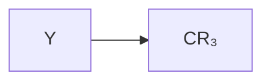
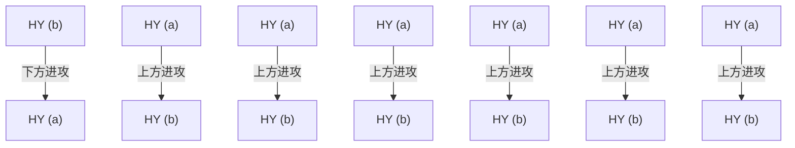

# 有机化学

# Organic Chemistry

# 第五章：有机化学中的取代效应

主讲: 王锋

华中科技大学化学与化工学院

School of Chemistry & Chemical Engineering, HUST

诱导效应  
共轭效应  
超共轭效应

## 电负性

<table><tr><td>H</td><td>C</td><td>N</td><td>O</td><td>F</td><td>Cl</td><td>Br</td><td>I</td></tr><tr><td>2.2</td><td>2.5</td><td>3.1</td><td>3.5</td><td>4.0</td><td>3.2</td><td>3.0</td><td>2.7</td></tr></table>

chemical

Chemical structure showing proton (H) and chlorine (Cl) atoms with delta (+) and delta (-) charge labels

原子核与非价电子（内层电子）组成一个实体，成为原子实原子实对价电子的吸引能力，就是一个原子的电负性

• 两个原子的电负性相差1.7个单位以上，形成离子键  
电负性相差0-0.6个单位，形成非极性共价键  
相差0.6-1.7，形成极性共价键

## 电负性

text_image

Ionic character
Covalent bond
δ+
δ-
Polar covalent bond
Ionic bond
X⁺ :Y⁻

从共价键到离子键是一个过渡，无严格划分

## 诱导效应（inductive effect）

chemical

Structural formula of ethylene (C2H4) showing carbon chain with hydrogen and methyl groups

非极性

chemical

Chemical structure of a dichloromethane derivative with methyl and ethyl groups

极性

诱导效应：当分子中原子或基团的极性（电负性）不同而引起成键电子云沿着原子链向某一方向移动的效应称为诱导效应，用I表示

## 特点：

（1）电子云是沿着原子链传递  
（2）作用随距离增加迅速下降，一般考虑三个键

## 诱导效应

$$
\mathrm{CH} _ {3} \mathrm{COOH}
$$

$$
\mathrm{pK} _ {\mathrm{a}} = 4. 7 6
$$

chemical

Chemical reaction mechanism diagram showing electron movement and ring opening between chlorine and hydrogen

氯乙酸

$$
\mathrm{pK} _ {\mathrm{a}} = 2. 8 6
$$

${ \mathsf { p K } } _ { \mathsf { a } }$ 值越小，酸性越强

## 诱导效应

<table><tr><td> $CH_3CH_2CH_2COOH$ </td><td> $CH_2CH_2CH_2COOH$  $\overset{\cdot}{Cl}$ </td><td> $CH_3CHCH_2COOH$  $\overset{\cdot}{Cl}$ </td><td> $CH_3CH_2CHCOOH$  $\overset{\cdot}{Cl}$ </td></tr></table>

${ \mathsf { C H } } _ { 3 } { \mathsf { C O O H } }$

$\mathsf { I C H } _ { 2 } \mathsf { C O O H }$

$\mathsf { B r C H } _ { 2 } \mathsf { C O O H }$

$C | \mathbf { C } \mathsf { H } _ { 2 } \mathbf { C O O H }$

$\mathsf { C l } _ { 2 } \mathsf { C H C O O H }$

${ \bf C } | _ { 3 } { \bf C } { \bf C } { \bf O } { \bf O } { \bf H }$

## 诱导效应

诱导效应一般以乙酸的α氢作为比较标准，如果取代基的吸电子能力比α氢强，称其具有吸电子诱导效应，用-I表示；如果取代基的给电子能力比α氢强，称其具有给电子诱导效应，用+I表示

flowchart

吸电子诱导效应（-I）

chemical

Chemical structure of a disaccharide with labeled carbon chain α and hydroxyl group

标准

flowchart

给电子诱导效应（+I）

## 诱导效应

(1)与碳原子直接相连的原子，同一族，随原子序数增加而吸电子诱导效应降低；同一周期，自左向右吸电子诱导效应增加。

吸电子诱导效应

$$
- F > - C l > - B r > - I
$$

$$
- O R > - S R
$$

$$
- F > - O R > - N H _ {2} > - C R _ {3}
$$

## 诱导效应

(2)与碳原子直接相连的基团，不饱和程度越大，吸电子诱导效应越强。

吸电子诱导效应

$$
- \mathrm{C} \equiv \mathrm{CR} > - \mathrm{C} = \mathrm{CR} _ {2} > - \mathrm{CH} _ {2} - \mathrm{CR} _ {3}
$$

不同杂化状态下（sp，sp2 ，sp3）的杂化轨道中，s成分多，吸电子能力强

## 诱导效应

(3)带正电荷的基团具有吸电子诱导效应，带负电荷的基团具有给电子诱导效应。

常见吸电子基团的吸电子诱导效应强弱排序

$$
\begin{array}{l} - \overset {+} {N} R _ {3} > - N O _ {2} > - C N > - C O O H > - C O O R > \underset {R (H)} {\overset {O} {\mathrm{C}}} > - F > - C l > - B r > - I \\ > - C \equiv C R > - O C H _ {3} (\text { or } - O H) > - C _ {6} H _ {5} > - C = C R _ {2} > H \end{array}
$$

## 共轭效应

## 共轭效应

chemical

Chemical structure of benzoic acid (benzenesulfonic acid) showing benzene ring with hydroxyl group attached to oxygen

$$
\mathrm{pK} _ {\mathrm{a}} = 9. 9 9
$$

${ \mathsf { C H } } _ { 3 } { \mathsf { O H } }$

$$
\mathrm{pK} _ {\mathrm{a}} = 1 7
$$

## 共轭效应（conjugated effect）

两个π键以单键相连接后，一个经典π轨道中的电子就会运动到另一个经典的π轨道中去，这种现象叫做电子的离域（delocalization）

chemical

Molecular structure diagram of ethylene (C2H4) showing two ethylene atoms bonded to hydrogen atoms

乙烯 $\scriptstyle ( \mathbf { C H } _ { 2 } = \mathbf { C H } _ { 2 } )$

chemical

Molecular structure diagram showing hydrogen bonding interactions between three oxygen atoms

1，3-丁二烯 $\scriptstyle ( \mathbf { C H } _ { 2 } { = } \mathbf { C H } \mathbf { C H } { = } \mathbf { C H } _ { 2 } )$  

chemical

Molecular structure diagram of ethylene (C2H4) showing hydrogen bonding and electron configuration

苯 $\mathrm { ( C _ { 6 } H _ { 6 } ) }$

π电子的离域能够降低体系的能量。

单双键交替出现的体系叫共轭体系，在共轭体系中，由于原子间的相互影响使体系内的π电子分布发生变化的一种电子效应称为共轭效应。(键长平均化)

chemical

Molecular structure diagram of water (H₂O) showing electron density clouds and bonding

苯酚分子内的p-共轭作用

chemical

Molecular structure of benzene showing electron delocalization and partial charges

共轭效应引起的电子对偏移

chemical

Chemical structure of benzoic acid (benzenesulfonic acid) showing benzene ring with hydroxyl group attached to oxygen

$$
\mathrm{pK} _ {\mathrm{a}} = 9. 9 9
$$

诱导效应

共轭效应（p-π 共轭）

${ \mathsf { C H } } _ { 3 } { \mathsf { O H } }$

$$
p K _ {a} = 1 7
$$

诱导效应

## 共轭效应

吸电子共轭效应（-C）：能够降低共轭体系π电子云密度。

$\mathbf { - N O } _ { 2 } , \mathbf { - C N } , \mathbf { - C O O H } , \mathbf { - C H O } , \mathbf { - C O R }$ 均有吸电子共轭效应

给电子共轭效应（+C）：能够增加共轭体系π电子云密度。

$- \mathbf { N } \mathbf { R } _ { 2 } , - \mathbf { O } \mathbf { R } , - \mathbf { O } \mathbf { H } , - \mathbf { F } , - \mathbf { C l } , - \mathbf { B r }$ ，-I 均有给电子共轭效应

## 共轭效应的特点：

• 只能在共轭体系中传递  
• 无论共轭体系有多大，共轭效应能够贯穿整个共轭体系

chemical

Chemical structure of phenol, showing a hydroxyl group attached to a benzene ring

chemical

Chemical structure of a benzene ring with hydroxyl and nitro groups

chemical

Chemical structure of a benzene ring with hydroxyl and nitro groups

chemical

Chemical structure of a benzene ring with hydroxyl and nitro substituents

$$
\mathsf {p K} _ {\mathsf {a}} = 9. 9 9
$$

$$
\mathsf {p K} _ {\mathsf {a}} = 7. 2 3
$$

$$
\mathsf {p K} _ {\mathsf {a}} = 8. 4 0
$$

$$
\mathsf {p K} _ {\mathsf {a}} = 7. 1 6
$$

chemical

Molecular structure diagram showing hydrogen bonding and electron density distribution around a nitrogen atom

chemical

Chemical reaction mechanism showing electron transfer between water and nitric oxide

共轭效应引起的电子对偏移硝基与苯环之间存在π-π共轭，硝基表现为吸电子共轭效应

chemical

Chemical structure of a nitrobenzoic acid derivative with hydroxyl and nitro groups

$$
\mathrm{pK} _ {\mathrm{a}} = 7. 1 6
$$

chemical

Chemical structure of a benzene ring with hydroxyl and nitro groups

$$
\mathrm{pK} _ {\mathrm{a}} = 7. 2 3
$$

chemical

Chemical structure of a benzene ring with hydroxyl and nitro groups

$$
\mathrm{pK} _ {\mathrm{a}} = 8. 4 0
$$

chemical

Chemical structure of phenol, showing a hydroxyl group attached to a benzene ring

$$
\mathrm{pK} _ {\mathrm{a}} = 9. 9 9
$$

$- N O _ { 2 }$ 对于-OH

吸电子诱导效应吸电子共轭效应$- N O _ { 2 }$ 对于-OH

吸电子诱导效应

邻硝基苯酚由于空间位阻较大，与苯环的共轭程度较对位低，因此邻位共轭效应较对位弱

chemical

Chemical structure of phenol, showing a hydroxyl group attached to a benzene ring

$$
\mathsf {p K} _ {\mathsf {a}} = 9. 9 9
$$

chemical

Chemical structure of a substituted benzene ring with hydroxyl and chloro groups

$$
\mathrm{pK} _ {\mathrm{a}} = 8. 4 8
$$

chemical

Chemical structure of a substituted benzene ring with hydroxyl and chloro groups

$$
\mathrm{pK} _ {\mathrm{a}} = 9. 0 2
$$

chemical

Chemical structure of a chlorinated aromatic compound with hydroxyl and chlorine substituents

$$
\mathrm{pK} _ {\mathrm{a}} = 9. 3 8
$$

• -Cl具有吸电子诱导效应，也具有给电子共轭效应  
氯代苯酚酸性比苯酚强，说明吸电子诱导效应（-I）主导。  
邻位受到的诱导效应最强，所以酸性最强；间位次之；对位再次之；

## 总电子效应

• 大部分取代基的诱导效应和共轭效应一致。  
• 有些取代基的诱导效应与共轭效应相反，如-Cl，这时要看总的结果。总结果是给电子的，该基团就是给电子基，总结果是吸电子的，该基团为吸电子基。

## 注意！

## 共轭效应只在共轭体系中存在

## 偶极矩由取代基到苯环

## 给电子基团

1.6

chemical

Chemical structure of a benzene ring substituted with dimethylamino groups

1.6

1.5

1.2

0

## 偶极矩由苯环到取代基

## 吸电子基团

chemical

Chemical structure of benzoic acid, showing a benzene ring with carboxyl group attached

1.0

2.8

1.3

chemical

Chemical structure of a benzene ring substituted with COCH3 group

2.9

1.5

3.9

1.6

4.0

chemical

Chemical structure of 1,2-dimethyl-1,3-benzoic acid

1.9

• 基团的电子效应包含诱导效应和共轭效应（在共轭体系中）两种因素，其表现出的吸电子/给电子效应是两种效应的共同作用。  
• 共轭效应仅在共轭体系中考虑。  
常见基团的电子效应（共轭体系中）：

## 给电子基团

$$
\begin{array}{l l l l} - \mathrm{OH} & - \mathrm{N} (\mathrm{CH} _ {3}) _ {2} & - \mathrm{NH} _ {2} & - \mathrm{OR} (\text {烷氧基}) \\ - \mathrm{R} (\text {烃基}) \end{array}
$$

## 吸电子基团

$$
\begin{array}{r l} {- \mathrm{NO} _ {2}} & {- \mathrm{CN} \quad \text {含羰基基团（醛基、酮基、}} \\ {\text {酰基、酯基、羧基）}} & {- \mathrm{x（卤素）}} \end{array}
$$

## 几种特征的共轭体系

π-π 共轭

p-π共轭

p-p共轭

## 几种特征的共轭体系

π-π共轭：两个或两个以上的双键（或三键）以单键相连时所发生的π电子离域作用

chemical

Chemical structure of 1,3-benzenesylbenzene

苯乙烯

chemical

Chemical structure of a carbonyl compound with two methyl groups and one nitrogen

丙烯腈

chemical

Chemical structure of a carbonyl compound with methoxy group

丙烯酸甲酯

## 几种特征的共轭体系

p-π共轭：π轨道与p轨道之间的共轭离域作用。

（1） $\mathbf { 0 } , \mathbf { N } , \mathbf { S } ,$ 卤素（X）直接与简单的 $\pi$ 体系相连时，分子体系中的p电子和 $\pi$ 电子可以在p轨道和 $\pmb { \pi }$ 轨道间进行离域运动。

chemical

Chemical structure of aniline, showing a benzene ring with an ammonium group attached to the nitrogen.

苯胺

chemical

Chemical structure of a substituted benzene ring with methoxy group

苯甲醚

chemical

Chemical structure of a benzene ring with a methyl group (SH)

硫酚

（2）烯丙基正离子和苄基正离子，或烯丙基自由基和苄基自由基可形成 $| \mathbf { p } { - } \pmb { \pi }$ 共轭，这种情况在碳正离子或自由基化学中出现。

chemical

Molecular orbital diagram showing electron density distribution with positive and negative lobes

## 几种特征的共轭体系

p-p共轭：一个缺电子的 $\mathbf { p }$ 轨道与含有一对电子（n电子）的 $\mathbf { p }$ 轨道之间的共轭离域作用。杂原子O, N, S或卤素（X）与碳正离子相连可形成 $\left[ \mathbf { p - p } \right.$ 共轭

chemical

Chemical structure of methyl ether (CH₃C(OCH₂)⁺)

chemical

Molecular structure diagram showing hydrogen bonding between water and oxygen atoms

## 超共轭效应

超共轭效应又称 σ-π或σ-p共轭，主要是指由一个C-H键的σ电子云与邻近的π电子云或空2p轨道之间相互交盖而产生电子部分离域的种共轭现象。

chemical

Molecular structure diagram showing carbon and hydrogen atoms with dashed bonds

丙烯的π键与C-H键间的σ-π超共轭效应

chemical

Molecular structure of ethane showing carbon-carbon double bond with hydrogen atoms and curved arrows indicating electron movement

超共轭效应引起的电子云偏移方向

## σ-π超共轭效应

α位的H具有一定的酸性,C-H键与C=O之间有σ-π超共轭效应

chemical

Chemical reaction diagram showing electron transfer between carbon and hydrogen atoms with methyl group

chemical

Chemical structure of a triphenyl ether compound with methyl and ethyl substituents

酸

text_image

: B

chemical

Chemical structure of a triphenyl ether compound with methyl and ethyl groups

共轭碱

## 超σ共-p轭超效共应轭效应

chemical

Molecular structure of methane (CH₄) showing carbon bonded to hydrogen atoms with lone pairs

$\dot { \mathrm { C H } } _ { 2 } \mathrm { C H } _ { 3 }$

chemical

Molecular structure diagram of methane (CH₃) showing hydrogen bonding between two carbonyl groups

$C H _ { 3 } - C H - C H _ { 3 }$

chemical

Molecular structure diagram of acetic acid (CH₃COOH) showing hydrogen bonding and electron configuration

$\begin{array} { l } { \displaystyle \mathrm { C H _ { 3 } } - \dot { \mathrm { C } } - \mathrm { C H _ { 3 } } } \\ { \displaystyle \qquad \dot { \mathrm { C H _ { 3 } } } } \end{array}$

稳定性

乙基自由基

异丙基自由基

叔丁基自由基

碳自由基的p轨道可与相邻碳上的C-H的σ轨道发生部分重叠，使σ键的电子云部分离域这种现象就是σ-P超共轭  
• σ-P超共轭使电荷分散，因此体系变得稳定

## σ-p超共轭效应

碳自由基的稳定性：

$$
\begin{array}{l} \begin{array}{c} \mathsf {H} _ {3} \mathsf {C} - \dot {\mathsf {C}} - \mathsf {C H} _ {3} \\ \mathsf {C H} _ {3} \end{array} \\ > \quad \begin{array}{c} \mathrm{H} _ {3} \mathrm{C} - \dot {\mathrm{C}} - \mathrm{CH} _ {3} \\ \mathrm{H} \end{array} \\ > \begin{array}{c} \mathrm{H} _ {3} \mathrm{C} - \dot {\mathrm{C}} - \mathrm{H} \\ \mathrm{H} \end{array} \\ > \quad \begin{array}{c} \mathrm{H} - \dot {\mathrm{C}} - \mathrm{H} \\ \mathrm{H} \end{array} \\ \end{array}
$$

  
No alkyl groups donating electrons  
Onealkyl group donating electrons  
Twoalkyl groups donatingelectrons  
Threealkyl groups donating electrons

Figure6.11 Acomparison of inductive stabilization formethyl.primary,secondary,and tertiarycarbocations.Themore alkylgroups thereare bonded to thepositively charged carbon,themoreelectrondensity shifts toward thecharge,making thecharged carbon less electron-poor(blueinelectrostaticpotentialmaps).

## 动态诱导极化效应

当非极性分子与具有永久偶极矩的极性分子相互接近时，会发生诱导极化，形成瞬时诱导偶极，分子间的诱导极化产生的瞬时偶极矩，会引起原来不带电荷的反应中心原子的反应性的显著变化，这种作用称为动态诱导极化效应。

极性分子

text_image

+ -

分子间距较大时

非极性分子

natural_image

Simple red oval outline on white background (no text or symbols)

极性分子

text_image

+ -

非极性分子

text_image

+ -

分子靠近时

产生瞬时诱导偶极

## 动态诱导极化效应

在强极性溶剂中，非极性的溴分子发生动态诱导极化，使得溴的反应活性提高，发生三取代反应。

## 立体效应

## 立体效应的主要因素是基团的空间位阻

## 空间位阻引起：

分子结构的变化  
分子物理化学性质的变化  
分子稳定构象的变化

chemical

Molecular structure of 1,2-dimethylpropano-1,3-dihydroxybenzene

联苯：两个苯环共平面，相互共轭

chemical

Chemical structure of a naphthalene derivative with carboxylic acid and methyl substituents

大基团的存在破坏两个苯环的共平面构象，两个苯环正交，降低大基团的位阻

## 立体效应

chemical

Molecular structure of a chiral alcohol with methyl and hydrogen substituents, labeled (I)

优势构象

chemical

Molecular structure of a chiral carbon with methyl and hydrogen substituents, labeled (II)

## 立体效应

$$
\mathrm{CH} _ {3} \mathrm{CH} _ {2} \mathrm{ONa}
$$

$$
\mathrm{CH} _ {3} \mathrm{CH} _ {2} \mathrm{O} ^ {\ominus}
$$

chemical

Chemical structure of a brominated alkene with hydrogen atoms and stereochemistry indicated

+  

chemical

Chemical structure of a brominated alkene with methyl and ethyl substituents

chemical

Chemical structure of a chiral alcohol with methyl and hydrogen substituents

反应速率快位阻小

chemical

Chemical structure of a chiral carbon with methyl groups and a carboxylic acid group

反应速率慢位阻大

## 立体效应

flowchart

(a)位置进攻，S基团位阻小

chemical

Chemical structure diagram with labeled atoms L, H, M, S, Y, OH and stereochemistry indicators

chemical

Chemical structure diagram labeled (II), showing a central atom bonded to L, H, M, S, and Y atoms with dashed bonds indicating stereochemistry.

## 第5章作业

5-3, 5-4, 5-5, 5-8, 5-9课堂练习：指出下列分子中标注基团存在的取代基效应类型，并指出下列分子中各碳原子周围电子云密度高低。

$$
\mathrm{CH} _ {3} \mathrm{CH} _ {2} \mathrm{CH} _ {2} \mathrm{NO} _ {2}
$$

$$
\mathrm{CH} _ {3} \mathrm{CH} = \mathrm{CHCHO}
$$

chemical

Chemical structure of phenol, showing a benzene ring attached to an OH group

$$
\mathrm{CH} _ {3} \mathrm{CH} _ {2} \mathrm{CH} _ {2} \mathrm{NO} _ {2}
$$

$$
\mathrm{CH} _ {3} \mathrm{CH} = \mathrm{CHCHO}
$$

chemical

Chemical structure of phenol, showing a benzene ring with an OH group attached to the hydroxyl group

$\mathbf { - N O } _ { 2 } \colon$ ：吸电子诱导效应

-CHO：吸电子诱导效应吸电子共轭效应总体表现为吸电子-OH：吸电子诱导效应给电子共轭效应总体表现为给电子

## 课堂练习：判断下列分子的酸性强弱

chemical

Four organic molecular structures: cyclohexanol, chlorophenol, benzene, and nitrobenzene

$\mathbf { - N O _ { 2 } }$ ：吸电子诱导效应；吸电子共轭效应；总体：吸电子（强）  
-Cl：吸电子诱导效应；给电子共轭效应；总体：吸电子（弱）

chemical

Chemical reaction sequence showing oxidation of nitrobenzene to cyclohexanol via chlorination and hydrolysis steps

