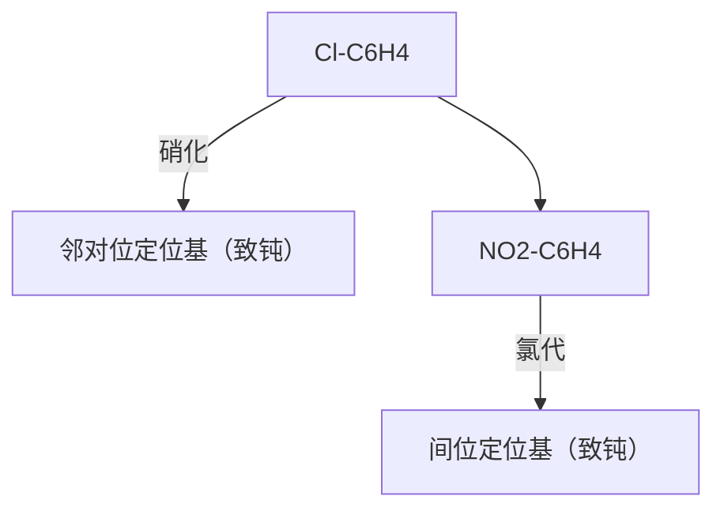

# 有机化学

# Organic Chemistry

# 第七章：芳香烃

主讲：王锋

华中科技大学化学与化工学院

School of Chemistry & Chemical Engineering, HUST

chemical

Molecular structure of ethylene (C6H4) showing carbon and hydrogen atoms in a ring system

## 苯 Benzene

石油化工基本原料

2018年中国：827.62万吨

## 苯的结构

text_image

鲸脂
19世纪伦敦街道照明

natural_image

Whale leaping out of the ocean with mountain range in background (no text or symbols visible)

text_image

Michael Faraday
(1791-1867)英国科学家

text_image

CRUDE
OIL
CRUDE
OIL
CRUDE
OIL
原油
苯的天然来源

1825年：M. Faraday （英国）

C:H = 1:1

1836年：C. F. Gerhardt （法国）

$C_{6}H_{6}$ ，分子量78

结构是什么样的？

## 苯的结构

natural_image

Portrait of an elderly man with a long white beard and mustache, wearing formal attire (no visible text or symbols)

August Kekulé

1825-1896 德国化学家

natural_image

Black-and-white photo of a man lying in bed, holding papers (no visible text or symbols)

1865年

chemical

Chemical structure of 1,3-dimethylbenzene showing a benzene ring with five hydrogen atoms and a central carbon atom

1,3,5-环己三烯
凯库勒提出的苯的结构

chemical

Simple hexagonal ring structure, likely benzene

苯 $C_{6}H_{6}$ benzene

## 苯的结构

难与 $Br_{2}$ 发生加成反应，而只有取代产物

chemical

Bromination reaction of benzene using bromine, showing two products with different conditions indicated by red and green circles.

## 苯的结构

chemical

Molecular geometry diagram of a carbon-oxygen bond with bond angles and distances labeled

1929年X射线晶体衍射确定苯的结构。

K. Lonsdale （爱尔兰）

chemical

Molecular structure diagram of benzene π bond showing hydrogen bonding and C-C bond formation in a hexagonal lattice

chemical

Molecular structure of a benzene ring with six carbon atoms and one hydrogen atom, labeled A

chemical

3D ball-and-stick model of a molecule with black and white spheres representing different atoms or functional groups

- 正六边形，通式： $C_{n}H_{2n-6}$ ，高度不饱和  
- 键角 $120^{\circ}$  
- 键长1.39 Å，介于单键（1.54 Å）和双键（1.33 Å）之间

## 苯的结构

chemical

Simple hexagonal ring structure with no labels or chemical formulas

凯库勒式

chemical

Simple hexagonal ring structure with one circle at center, likely representing a cyclohexane ring or cyclohexane ring system

现代表达式

苯 $\mathrm{C_6H_6}$

benzene

## 苯的结构

energy level diagram

| Species             | Substrate              | Energy (kJ/mol) |
|---------------------|------------------------|-----------------|
| 环己烷              | -                      | -               |
| 苯                 | -                      | -206            |
| 1,3-环己二烯         | -                      | -230            |
| 1,3,5-环己三烯       | +                      | -330            |
| 氨基化合物         | + H₂                   | -               |
| 环己烯              | -                      | -120            |

chemical

Two molecular structures: a polycyclic aromatic hydrocarbon and a hexagonal lattice with spherical atoms

$\mathrm{C_{42}H_{18}}$  
六苯并戊二烯
Hexabenzocoronene

text_image

Science
Vol 337, Issue 6100
14 September 2012
Science
14 September 2012 • EIA
AAAS

Noncontact Atomic Force Microscopy (NAFM) 非接触原子力显微镜

## 芳香性

- 分子中含有芳香性环状结构的烃类。最初因芳香气味而得名。  
- 芳香烃高度不饱和性，但其化学性质不同于脂肪族不饱和烃，有其特殊的“芳香性”。即芳环上的氢容易发生取代反应而不饱和的环难以进行加成反应和氧化反应，并具有特定的光谱吸收特征。这些性质取决于芳香环稳定的离域大π键共轭体系。

## 芳香性

natural_image

Portrait of a man in formal attire (no visible text or symbols)

Erich Hückel

德国化学家（1896-1980）

## 休克尔规则（经验规则）

## Hückel's rule

- 成环原子共平面或接近于平面  
- 有环状闭合的大π键共轭体系  
- 环上 $\pi$ 电子数为 $4 n + 2 (n = 0, 1, 2, 3 \ldots)$

## 芳香性

chemical

Simple hexagonal ring structure with one ring at the bottom, likely representing a cyclohexane ring or benzene ring system.

chemical

Simple hexagonal ring structure, likely benzene

chemical

Chemical structure of naphthalene, a polycyclic aromatic hydrocarbon with two fused benzene rings

萘 naphthalene

- 平面结构，稳定性  
- 不饱和度高，但难加成，难氧化  
- 可发生取代

chemical

Chemical structure of naphthalene, a polycyclic aromatic hydrocarbon with three fused benzene rings

蒽 anthracene

chemical

Molecular structure of naphthalene, a polycyclic aromatic hydrocarbon with three fused benzene rings

菲 phenanthrene

## 芳香性

环丁二烯 (4)

环戊二烯正离子(4)

环戊二烯负离子 (6)

chemical

Chemical structure of a benzene ring with a positive charge symbol

环庚三烯正离子 (6)

chemical

Chemical structure of cyclopentene with negative charge on nitrogen

环庚三烯负离子 (8)

chemical

Chemical structure of a fused bicyclic compound with two long alkyl chains

环辛四烯 (8)

## 芳香性

chemical

Simple molecular structure diagram with a negative charge inside a pentagon

环戊二烯负离子  

chemical

Reaction mechanism diagram showing electron movement and ring opening steps in a cyclic compound

共振式

chemical

3D ball-and-stick model of a molecule with black and white spheres representing different atoms, connected by dashed lines indicating bonds or interactions.

natural_image

Abstract 3D surface visualization with gradient colors and two black arrows pointing inward (no text or symbols)

natural_image

Simple line drawing of a symmetrical abstract shape with no text or symbols

负电荷在整个共轭体系平均分布

## 芳香性

natural_image

Simple geometric diagram with a hexagon and a circle containing a plus sign (no text or symbols)

chemical

Molecular structure of methane (CH₄) showing carbon ring with hydrogen atoms and a central charge

chemical

3D ball-and-stick molecular model of methane (CH₄) showing carbon and hydrogen atoms in a polyhedral geometry

环庚三烯正离子

## 苯的亲电取代反应

chemical

Molecular orbital diagram showing electron transfer from a disordered Higgs boson to a ring structure, with an excited state E⁺ shown in the image.

## 苯的亲电取代反应

卤代、硝化、磺化、烷基化、酰基化等

## 亲电取代机理

chemical

Electron transfer reaction mechanism of benzene showing electron delocalization and protonation steps

$\sigma$ -络合物

  
σ-络合物

## 亲电取代机理

text_image

Energy

chemical

Reaction mechanism diagram showing substitution with Br and HBr, forming a benzene ring with bromide groups and a hydrogen bond

Reaction progress

## 卤代反应

chemical

苯丙烯酸反应生成苯环戊酰ene的化学方程式，涉及Lewis酸和异裂反应

## 卤代反应

\+ Br $_{2}$

FeBr $_{3}$

\+ HBr

\+ $l_{2}$

$HNO_{3}$

\+ HI

87%

## 硝化反应

## 硝化反应

  
1,3-二硝基苯
间硝基苯  
1,3,5-三硝基苯邻间对三硝基苯

## 磺化反应

chemical

苯磺酸反应生成苯磺酸的化学方程式，涉及硝酸和水的热对作用

chemical

Chemical reaction mechanism showing electron transfer and protonation steps in sulfuric acid derivative

磺化反应中亲电试剂是： $SO_{3}$ 磺化反应是可逆反应

## 傅-克反应

傅-克烷基化反应

傅-克酰基化反应

## 傅-克烷基化反应

+  
$\mathbf{C}_{2}\mathbf{H}_{5}\mathbf{Cl}$  

chemical

Chemical reaction diagram showing addition of CH₃CH₂ to form a radical

AICI $_{3}$

chemical

Chemical structure of 1,3-benzenesulfonylbenzene showing benzene ring with methyl substituent

+

HCI

## 傅-克烷基化反应

chemical

Chemical reaction equation showing benzene reacting with CH3CH2CH2Cl under AlCl3 to form a substituted benzene derivative with 70% yield and 30% yield.

chemical

Chemical reaction equation showing the conversion of a tertiary amine to a tertiary alkene using an isocyanate intermediate

碳正离子重排：重排成更稳定的碳正离子

## 傅-克烷基化反应

chemical

Simple benzene molecular structure diagram

$$
+ \quad \begin{array}{c} \mathrm{CH} _ {3} \\ \mathrm{H} _ {3} \mathrm{C} - \stackrel {\mid} {\mathrm{C}} - \mathrm{CH} _ {2} \mathrm{Cl} \\ \mathrm{CH} _ {3} \end{array} \xrightarrow {\mathrm{AlCl} _ {3}}
$$

## 傅-克烷基化反应的特点

- 重排产物生成  
- 多取代产物生成  
- 可逆反应

## 傅-克酰基化反应

chemical

Chemical reaction scheme showing the synthesis of benzyl acetone from phenyl and acrylate, catalyzed by AlCl₃ and R-C⁺ reagents

## 亲核取代反应

chemical

Nitration reaction equation of benzene with chloroaniline under basic conditions

chemical

Nitration reaction equation of benzene with nitrobenzene under Na2CO3 at 100°C to form a hydroxybenzene derivative

chemical

Nitration reaction equation of benzene with nitrobenzene under Na2CO3 at 35°C, forming a hydroxyl radical

当卤代苯上有强吸电子基团时，卤代苯可发生亲核取代反应

## 亲电取代反应的定位规律

## 两类定位基团

  
G: 邻对位定位基
第一类定位基

chemical

Chemical structure of a benzene ring with a methyl group (G) attached to the benzene ring, with an arrow indicating electron movement.

chemical

Chemical structure of a benzene ring with substituents G and E

G: 间位定位基
第二类定位基

(i) 致活的邻对位定位基:

## 定位基团归类

- $NH_{2}$ , -NHR, $-NR_{2}$ , -NHCOR（强活化）  
-OH, -OR, -OCOR（中强活化）  
$-C_{6}H_{5},-CH_{3},-CR_{3}$ （弱活化）

(ii) 致钝的邻对位定位基: -F, -Cl, -Br, -I  
(iii) 致钝的间位定位基:

$$
- \mathbf {C O R}, - \mathbf {C H O}, - \mathbf {C O O R}, - \mathbf {C O N H} _ {2}, - \mathbf {C O O H},
$$

$$
- \mathrm{SO} _ {3} \mathrm{H}, - \mathrm{CN}, - \mathrm{NO} _ {2}
$$

$$
- \mathrm{CF} _ {3}, - \mathrm{CCl} _ {3}
$$

所有间位定位基均是致钝基团！

## 取代基的定位效应

chemical

Chemical reaction diagram showing reactivity of benzene with various deactivators and catalysts, including meta-directing and ortho- and para-directing deactivators.

## 反应实例

flowchart

chemical

Chemical structure of 1,3-dimethylbenzene showing a benzene ring with methyl substituent

chemical

Chemical reaction condition label showing concentrated sulfuric acid with temperature

chemical

Chemical structure of 2,4-dimethylbenzoic acid (isobutylsulfonyl)

53%  
+

chemical

Chemical structure of a substituted benzene ring with methyl and sulfonic acid groups

43%

chemical

Chemical structure of 1,3-dimethylbenzene showing a benzene ring with methyl substituent

chemical

Chemical reaction condition label showing concentrated sulfuric acid at 100 °C

chemical

Chemical structure of a substituted benzene ring with methyl and sulfonic acid groups

79%  
+

chemical

Chemical structure of a substituted benzene ring with methyl and sulfonic acid groups

13%

\+ Cl $_{2}$

$FeCl_{3}$ 50-60 °C

50 %

+

45 %

\+ Cl $_{2}$

$FeCl_{3}$ 30 °C

50 %

+

43 %

## 二取代苯的亲电取代

(1) 两个取代基的定位效应相同, 第三个取代基引入时由这两个取代基共同决定

chemical

苯环结构式示意图，标注邻对位定位基与间位定位基位置

chemical

Chemical structure of nitrobenzene showing benzene ring with NO₂ and carboxyl group

chemical

Chemical structure of 1,3-dimethylbenzene showing methyl groups at positions 3 and 4

chemical

Chemical structure of a benzene ring with hydroxyl and nitro groups, featuring a red dot at the bottom center.

## 二取代苯的亲电取代

(2) 两个取代基为同类, 第三个取代基引入时其位置主要取决于活化作用较强的基团

chemical

苯环结构式，标注NHCOCH₃与CH₃的位定位基，用于强活与弱活化

chemical

Chemical structure of 1-chloro-2,4-dimethylbenzene showing methyl and chlorine substituents on benzene ring

chemical

Chemical structure of a substituted benzene ring with hydroxyl and methyl groups

chemical

Chemical structure of a substituted benzene ring with NHCOCH₃ and CH₂CH₃ groups

## 二取代苯的亲电取代

(3) 两个取代基为不同类, 第三个取代基引入时其位置主要取决于邻对位定位基

chemical

苯环结构式，标注邻对位定位基和间位定位基位置

## 二取代苯的亲电取代

(4) 两个取代基处于1,3位, 第三个取代基进入2位的比例大幅降低

chemical

Chemical structure of 1-chloro-4-methylbenzene showing methyl, chlorine, and chlorine percentages

## 合成实例

合成：由甲苯合成间位和对位取代的硝基苯甲酸。

chemical

Chemical structure of 1,3-dimethylbenzene showing a benzene ring with methyl substituent

chemical

Chemical structure of a benzene ring with carboxyl and nitro groups

chemical

Chemical structure of a benzene ring with carboxyl and nitro groups

## 合成实例

合成：由苯合成邻、间、对硝基氯苯。

chemical

Chemical structure of 2-chloro-4-nitrobenzene showing benzene ring with chlorine and nitro substituents

chemical

Chemical structure of 2-chloro-4-nitrobenzene showing benzene ring with chlorine and nitro substituents

chemical

Chemical structure of a chlorinated benzene ring with nitro group

# 稠环芳烃的亲电取代反应

## 多苯芳烃和稠环芳烃

chemical

Simple hexagonal ring structure, likely benzene

苯

chemical

Chemical structure of 1,2-dimethylbenzene showing two benzene rings connected by a single bond

联二苯  
(联苯类)

chemical

Chemical structure of 2,4-dimethylbenzene showing two benzene rings connected by a CH₂ group

二苯甲烷  
(苯代脂肪烃)

chemical

Chemical structure of naphthalene, a polycyclic aromatic hydrocarbon with two fused benzene rings

蔡  
(稠环芳烃)

chemical

Chemical structure of a fused-ring compound with numbered positions and Chinese label '萘' below

chemical

Naphthalene molecular structure with numbered carbon atoms and Chinese label '蒽'

chemical

Naphthalene molecular structure with numbered carbon atoms and Chinese character '菲' below

## 萘的结构

chemical

Molecular structure diagram showing a hexagonal lattice with blue and black atoms connected by solid and dashed lines

chemical

Molecular geometry diagram of a fused aromatic compound with bond lengths and angle labeled

α位亲电取代反应活性相对高  

chemical

Naphthalene molecular structure with labeled carbon positions and alpha/β substituents

与苯相比，萘更容易发生亲电取代反应，一般发生在α-位

β位亲电取代反应活性相对低

## 萘的亲电取代反应

chemical

萘分子亲电取代反应的化学方程式，展示α-位取代与E+离子生成不同代际代际的过程

β-位取代  

chemical

Chemical reaction diagram showing electron transfer from naphthalene to E+ ion

chemical

Reaction mechanism diagram showing electron transfer between a naphthalene derivative and a polycyclic aromatic hydrocarbon with positive charges

## 萘的亲电取代反应

chemical

Bromination reaction of naphthalene with bromine under iron reflow

chemical

Chemical reaction equation showing naphthalene reacting with HNO₃ under sulfuric acid at 30–60°C to form a nitro-substituted naphthalene derivative

## 萘的亲电取代反应

$$
\begin{array}{c} \mathrm{H} _ {2} \mathrm{SO} _ {4} \\ 0 - 6 0 ^ {\circ} \mathrm{C} \end{array}
$$

chemical

Chemical structure of naphthalene with sulfonic acid group attached to the aromatic ring

α-萘磺酸

$$
\begin{array}{c} \mathrm{H} _ {2} \mathrm{SO} _ {4} \\ > 1 5 0 ^ {\circ} \mathrm{C} \end{array}
$$

chemical

Chemical structure of naphthalene sulfonic acid (SO₃H)

β-萘磺酸

$$
\begin{array}{c} \mathrm{CH} _ {3} \mathrm{COCl} / \mathrm{AlCl} _ {3} \\ \hline \mathrm{CS} _ {2} - 1 5 ^ {\circ} \mathrm{C} \end{array}
$$

chemical

Chemical structure of naphthalene with COCH₃ substituent and positive charge on the aromatic ring

75%

chemical

Chemical structure of 1,2-dimethoxyphenyl-3-carboxylic acid

25%

$$
\frac {\mathrm{CH} _ {3} \mathrm{COCl} / \mathrm{AlCl} _ {3}}{\mathrm{C} _ {6} \mathrm{H} _ {5} \mathrm{NO} _ {2} 2 5 ^ {\circ} \mathrm{C}}
$$

chemical

Chemical structure of naphthalene with carboxyl group attached to the benzene ring

## 萘的亲电取代反应

## 萘的亲电取代反应

chemical

Bromination reaction of naphthalene under卤化, showing Br and Br-Br coupling to yield brominated and nitro-substituted products

已有致钝的间位定位基，第二个基团优先进入定位基相邻苯环的5位或8位。

## 蒽的亲电取代反应

chemical

Naphthalene derivative synthesis reaction pathway showing卤化, 付克酰基化, and 硝化 steps

蒽和菲的亲电取代反应主要发生在9,10位上

## 菲的亲电取代反应

chemical

Chemical reaction showing bromination of a polycyclic aromatic hydrocarbon to form a brominated naphthalene derivative

蔥和菲的亲电取代反应主要发生在9, 10位上

## 第五节

## 加成反应

## 加成反应

chemical

Chemical reaction equation showing benzene reacting with 3H₂ under nickel catalyst in 150–250°, 2.5 Mpa to form cyclohexane

## 加成反应

chemical

Molecular structure of naphthalene, a polycyclic aromatic hydrocarbon

$$
\begin{array}{c} \mathrm {H_ {2} , Ni} \\ \hline 1 4 0 - 1 6 0 ^ {\circ} \mathrm{C} \\ 0 - 3 \mathrm{MPa} \end{array}
$$

chemical

Chemical structure of naphthalene, a polycyclic aromatic hydrocarbon with two fused cyclohexane rings

四氢化萘

$$
\begin{array}{c} \mathrm {H_ {2} , Ni} \\ \hline 2 0 0 ^ {\circ} \mathrm{C} \\ 1 0 - 3 0 \mathrm{MPa} \end{array}
$$

chemical

Molecular structure of polycyclic aromatic hydrocarbon, two fused cyclohexane rings

十氢化萘

$$
\xrightarrow [ \text {加热加压} ]{\mathrm{H} _ {2} , \mathrm{Pt/C}}
$$

chemical

Molecular structure of polycyclic aromatic hydrocarbon, two fused cyclohexane rings

十氢化萘

chemical

Chemical structure of naphthalene, a polycyclic aromatic hydrocarbon with three fused benzene rings

蔥

chemical

Chemical reaction condition label showing sodium and ethyl methyl acetic acid

chemical

Chemical structure of 1,2-dimethyl-1,3-benzenepine

9,10-二氢蒽

chemical

Molecular structure of naphthalene, a polycyclic aromatic hydrocarbon with three fused benzene rings

菲

chemical

Molecular structure of naphthalene, a polycyclic aromatic hydrocarbon with three fused benzene rings

9,10-二氢菲

## 第六节

## 氧化反应

## 氧化反应

顺丁烯二酸酐

邻苯二甲酸酐

chemical

Chemical structure of naphthalene, a polycyclic aromatic hydrocarbon with two fused benzene rings

$\mathrm{CrO}_{3} / \mathrm{CH}_{3}\mathrm{COOH}$

10 - 15°C

chemical

Molecular structure of 1,4-dimethoxyquinoline

1,4-萘醌

chemical

Chemical structure of naphthalene, a polycyclic aromatic hydrocarbon with three fused benzene rings

$K_{2}Cr_{2}O_{7}$

烯硫酸

chemical

Molecular structure of 1,4-dinitroquinone, a fused bicyclic aromatic compound with two carbonyl groups

9,10-蒽醌

## 第7章作业

7-1, 7-2, 7-5, 7-11