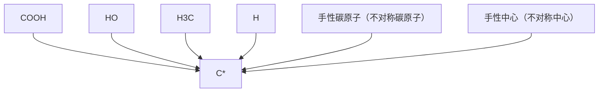
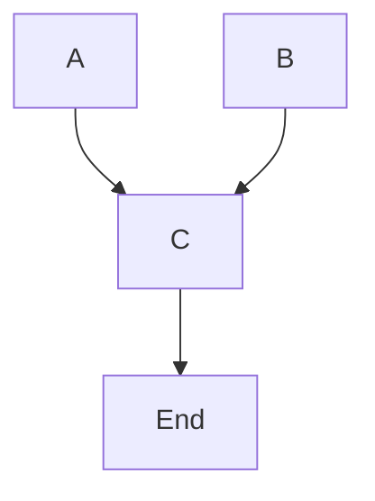
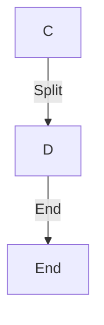
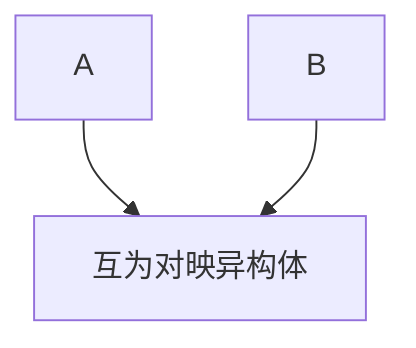
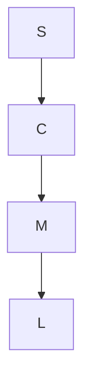
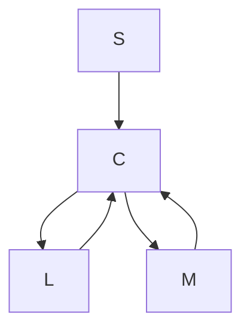

# 有机化学

# Organic Chemistry

# 第八章：对映异构

主讲: 王锋

华中科技大学化学与化工学院

School of Chemistry & Chemical Engineering, HUST

## 自然界充满了不对称性

chemical

3D molecular structure of DNA showing major and minor grooves with labeled positions 3', 5', and 3'

chemical

Chemical structure of a nucleotide with labeled sugar moieties (T, A, C, G) and phosphate groups (O-P, 5', 3')

natural_image

Beach scene with seashells and sailboats on sandy shore under blue sky (no text or symbols)

natural_image

Close-up of vibrant purple morning glory flowers climbing vines against a wooden window, with blurred cityscape in background (no text or symbols)

chemical

Chemical structure of a fused heterocyclic compound with amide and pyridine rings

natural_image

Cartoon illustration of a smiling boy wearing a T-shirt with a smiley face (no text or symbols)

右旋沙利度胺(R)-thalidomider

chemical

Chemical structure of a fused heterocyclic compound with indole and amide groups

natural_image

Cartoon illustration of a smiling boy wearing an orange shirt with a smiley face logo (no text or symbols)

左旋沙利度胺(S)-thalidomider  
双胞胎

chemical

Chemical structure of a fused heterocyclic compound with amide and pyridine rings, featuring a carbonyl group and a nitrogen atom

右旋沙利度胺（反应停）

(R)-thalidomider

镇静

natural_image

Stylized illustration of a pregnant woman with a pink belly and white heart symbol (no text or symbols)

chemical

Chemical structure of a fused heterocyclic compound with quinoline and amide groups

左旋沙利度胺

(S)-thalidomider

text_image

)=a·b+a
+33/11=102

text_image

海豚儿

text_image

CONTERGAN-
OPPER
KLAGEN
FAMILIE
WIRTZ
KARANTEN
• Société d'e 1986
• Société d'e 1987
• Société d'e 1988
• Société d'e 1989
• Société d'e 1990

致畸

！！！

## 手性物体

Mirror

natural_image

Simple line drawing of a human hand with no text or symbols

左手

natural_image

Simple line drawing of a human hand with five fingers (no text or symbols)

右手

natural_image

Illustration of a human hand with palm lines (no text or symbols)

不能重合

## 非手性物体

Mirror

natural_image

Simple illustration of a light green bottle with black outline (no text or symbols)

Left hand

natural_image

Simple illustration of a light green bottle with black outline (no text or symbols)

Right hand

natural_image

Simple illustration of a light green bottle with black outline (no text or symbols)

Can be superimposed

chemical

Chemical structure of a heterocyclic compound featuring carbonyl, amide, and pyridine groups

chemical

Chemical structure of a heterocyclic compound with benzene, carbonyl, and amide groups

chemical

Molecular structure diagram showing a central gray atom bonded to four surrounding atoms in red, green, blue, and white spheres.

chemical

Molecular structure diagram showing a central gray atom bonded to four surrounding atoms in blue, green, red, and white spheres

## 手性

chemical

Molecular structure diagrams of carboxylic acid and amino acid molecules in hand, showing R-C bond interactions

手性分子

chemical

Molecular structure of ethanol showing carbon, hydrogen, and carboxyl groups with stereochemistry indicated

L-(+)-乳酸

chemical

Molecular structure of 2-methylpropan-1,3-carboxylic acid showing carbon, hydrogen, and hydroxyl groups

D-(-)-乳酸

## 互为对映异构体

对映异构体：沸点、熔点、溶解度、极性、反 应活性相同

旋光性、生理活性不同

## 平面偏振光

natural_image

Circular diagram with eight arrows pointing outward from center, no text or symbols present

普通光线

natural_image

Circular diagram with radial arrows and central dashed line, no text or symbols present

尼可尔棱镜

natural_image

Simple geometric diagram showing a circle with a vertical red line and two downward arrows (no text or labels)

平面偏振光

平面偏振光光源

natural_image

Pure diagram of vertical arrows aligned horizontally with a horizontal line, no text or symbols present

样品管 $( \mathsf { H } _ { 2 } \mathsf { O } )$

观测点

平面偏振光光源

natural_image

Pure diagram of parallel arrows aligned horizontally with a light blue shaded region (no text or symbols)

样品管（手性分子溶液）

观测点

## 比旋光度

text_image

平面偏振光
光源
观测点

样品管（手性分子溶液）

如果偏正光向右偏转，用（+）标记如果偏正光向左偏转，用（-）标记

手性化合物的旋光度与分子的对称性、浓度、温度、旋光管长度、光波的波长、溶剂等有关，比旋光度定义了测试条件，因此在一定的条件下，化合物的比旋光度是一个常数。

$$
[ \alpha ] _ {\lambda} ^ {t} = \frac {\alpha_ {\lambda} ^ {t}}{l \times c} \xleftarrow {\text {测定的旋光度}}
$$

t: 温度

λ：平面偏振光波长

l：测试样品管长

c：待测化合物浓度

## 如何判断一个分子是否有手性

手性分子的判别依据：实体与镜像不能重叠。

分子产生手性的原因是分子内缺少对称因素。

如果分子没有对称面或对称中心，分子具有手性。

## 判别分子手性的依据—对称面

能把分子切割成实物和镜像两部分的平面称为分子的对称面，用σ表示。有对称面的分子都是非手性分子。

chemical

三氯化碳的化学结构式，标注三个对称面位置

## 判别分子手性的依据—对称中心

如果分子中有一个点，所有通过这个点画的直线都以等距离达到相同的基团，此点为分子的对称中心，用i表示。有对称中心的分子都是非手性分子。

text_image

H
Cl
H
H
H
H
H
Cl
对称中心

反-1,3-二氯环丁烷

chemical

Molecular structure of 2-butene showing carbon bonded to three hydrogen atoms and methyl group

## 手性碳原子和手性中心

flowchart

当一个碳原子上连有四个不同的原子或基团时，它的实物和镜像不能重合，产生了不对称中心，这个碳原子叫作不对称碳原子（asymmetric carbon）,也叫作手性碳原子（chiral carbon）

## 含有一个不对称碳原子的手性分子

chemical

Chemical structure of a disaccharide with methyl and hydroxyl groups

chemical

Molecular structure of 2-hydroxybutanoic acid showing carboxyl, hydroxyl, and hydrogen groups

L-(+)-乳酸

chemical

Molecular structure of ethanol showing carboxyl, hydroxyl, and methyl groups attached to a central carbon

D-(-)-乳酸

将一对对映异构体等量混合，得到外消旋体，其旋光度为零。外消旋体用（±）表示。

## 含有两个或以上不对称碳原子的手性分子

如果一个分子内含有两个不同的不对称碳原子，和碳原子连接的六个基团可以有四种不同的空间位置，因此就有四种光活异构体。

$M = \Re \downarrow \downarrow \downarrow \downarrow \downarrow \uparrow \uparrow \uparrow \uparrow \uparrow \uparrow \uparrow \uparrow \uparrow \uparrow \uparrow \uparrow \uparrow \uparrow \uparrow \uparrow \uparrow \uparrow \uparrow \uparrow \uparrow \uparrow \uparrow \uparrow \uparrow \uparrow \uparrow \uparrow \uparrow \uparrow \uparrow \uparrow \uparrow \uparrow \uparrow \downarrow \uparrow \uparrow \downarrow \uparrow \downarrow \uparrow \downarrow \downarrow \downarrow \downarrow \downarrow \downarrow \downarrow \downarrow \downarrow \downarrow \downarrow \downarrow \downarrow \downarrow \downarrow \downarrow = 2 ^ { n } { \boldsymbol { \uparrow } } { \boldsymbol { \uparrow } } { \boldsymbol { \uparrow } } { \boldsymbol { \downarrow } } { \boldsymbol { \downarrow } } { \boldsymbol { \downarrow } } | { \boldsymbol { \mp } } { \boldsymbol { \downarrow } } | { \boldsymbol { \mp } } { \boldsymbol { \downarrow } } | { \boldsymbol { \mp } } { \boldsymbol { \downarrow } } | { \boldsymbol { \mp } } { \boldsymbol { \downarrow } } | { \boldsymbol { \mp } } { \boldsymbol { \downarrow } } | { \boldsymbol { \mp } } { \boldsymbol { \downarrow } } | { \boldsymbol { \mp } } | { \boldsymbol { \mp } } { \boldsymbol { \downarrow } } | { \boldsymbol { \mp } } | { \boldsymbol { \mp } } | { \boldsymbol { \mp } } | { \boldsymbol { \mp } } | { \boldsymbol { \mp } } | { \boldsymbol { \mp } } | { \boldsymbol { \mp } } | { \boldsymbol { \mp } } | { \boldsymbol { \mp } } | { \boldsymbol { \mp } } | { \boldsymbol { \mp } } | { \boldsymbol { \mp } } | { \boldsymbol { \mp } } | { \boldsymbol { \mp } } | { \boldsymbol { \mp } } | { \boldsymbol { \mp } } | { \boldsymbol { \mp } } | { \boldsymbol { \mp } } | { \boldsymbol { \mp } } | { \boldsymbol { \mp } } | { \boldsymbol { \mp } } | { \boldsymbol { \mp } } | { \boldsymbol { \mp } } | { \boldsymbol { \mp } } | { \boldsymbol { \mp } } | { \boldsymbol { \mp } } | { \boldsymbol { \mp } } | { \boldsymbol { \mp } } | { \boldsymbol { \mp } } | { \boldsymbol { \mp } } | { \boldsymbol { \mp } } | { \boldsymbol { \mp } } | { \boldsymbol { \mp } } | { \boldsymbol { \mp } } | { \boldsymbol { \mp } } | { \boldsymbol { \mp } } | { \boldsymbol { \mp } } | { \boldsymbol { \mp } } | { \boldsymbol { \pm } } |  \boldsymbol  $

chemical

Molecular structure of 2-chloroethanol showing carbon, hydrogen, chlorine, hydroxyl, and methyl groups

flowchart

互为对映异构体

flowchart

互为对映异构体

3-氯二丁醇

## 含有两个或以上不对称碳原子的手性分子

含有两个相同的不对称碳原子：

chemical

Molecular structure of 2-hydroxybutanoic acid showing carbon, hydrogen, and carboxyl groups

D-(-)-酒石酸  

flowchart

  
内消旋体

## 对映异构体的性质

对映异构体：一般的物理性质（溶解度、熔点、沸点、折光率、极性等）相同；在手性环境下（偏正光照射、生理环境、手性化学环境、手性溶剂等），其理化性质会不同。

非对映异构体：物理性质完全不同，可以用重结晶、蒸馏等方式分开。

外消旋体：两个对映异构体的等量混合物，没有旋光性。其物理性质与单一的对映体不同。

内消旋体：单一化合物，非手性分子，无旋光性。其物理性质与对映体、非对映体及外消旋体均不同。

## 不含不对称碳原子的手性分子

## 联苯型

chemical

Chemical structure of a benzene derivative with carboxylic acid, nitro, and hydroxyl groups attached to a phenyl ring

chemical

Chemical structure of a nitro-substituted benzene derivative with carboxylic acid and nitro groups

${ \bf 6 , 6 ^ { \prime } } .$ -二硝基-2,2’-联苯二甲酸

chemical

Chemical structure of a nitro-substituted benzene derivative with carboxylic acid and nitro groups

非手性分子分子有对称面

## 不含不对称碳原子的手性分子

## 联苯型

chemical

Chemical structure of a polycyclic aromatic hydrocarbon with two phenyl rings and a hydroxyl group attached to the central carbon.

chemical

Chemical structure of a naphthalene derivative with hydroxyl groups at positions 1 and 2

1,1’-联二(2-萘酚)

## 不含不对称碳原子的手性分子

## 丙二烯型

chemical

Chemical structure of a symmetric organic molecule with two phenyl groups and a central carbon atom bonded to three naphthalene rings

chemical

Chemical structure of a symmetric organic molecule with two naphthalene rings linked by a central carbon atom

1,3-二苯基-1,3-二(1’-萘基)丙二烯

chemical

Chemical structure of a chiral amine compound with methyl and amino substituents

# 不含不对称碳原子的手性分子

## 其它类型

chemical

Chemical structure of a quaternary ammonium salt with ethyl and methyl substituents

季铵盐

chemical

Chemical structure of a phosphorus-containing compound with methyl and ethyl substituents

季鏻盐

chemical

Chemical structure of a sulfonamide compound with benzene ring and ethyl group

chemical

Molecular structure of a nitrogen-containing heterocyclic compound with substituents R1, R2, and R3

chemical

Chemical structure of a nitrogen-containing heterocyclic compound with substituents R1, R2, and R3

## Fischer投影式

（1）碳链尽量在垂直方向，氧化态高的基团在上，氧化态低的基团在下  
（2）垂直方向碳链应伸向纸面后方，水平方向基团伸向纸面前方  
（3）将分子结构投影到纸面上，用横线与竖线的交叉点表示手性碳原子

## Fischer投影式

chemical

Chemical reaction diagram showing conversion of carboxylic acid to hydroxyethyl alcohol with 180° rotation angle

Fischer投影式不能向纸面外旋转 $1 8 0 ^ { \circ }$ ，也不能在纸面上旋转 $9 0 ^ { \circ }$ °或 $9 0 ^ { \circ }$ °的奇数倍，否则得到的分子为原分子的对映异构体

chemical

Molecular structure of ethanol showing carbon, hydrogen, and carboxyl groups

## 请写出下列分子的Fischer投影式

chemical

Molecular structure of 2-hydroxybutyric acid showing carbon, hydroxyl, and hydrogen groups

甘油醛

## 对映异构体的构型—相对构型

chemical

Chemical structure of 2-methylpropan-1-ol (4-methoxyphenol)

D-(+)-甘油醛  
早期，未知绝对构型的情况下，人为规定将右旋(+)-甘油醛定为D构型，任意指定左图结构式为D型；那么，相应地，其对映异构体即为L构型。这是对映异构体的相对构型，用D-L来标记。其它化合物的命名参照D-(+)-甘油醛，通过化学反应关联。

chemical

Chemical structure of 2-methylpropan-1-ol (4-methoxyphenol)

D-(+)-甘油醛

[O]选择性氧化  

chemical

Chemical structure of 2-hydroxypropan-1,3-carboxylic acid showing COOH, OH, and CH₂OH groups in a cross-shaped arrangement

D-(-)-甘油酸

[H]选择性还原  

chemical

Chemical structure of 2-methylpropan-1-ol (4-methoxyphenol)

D-(-)-乳酸

## 对映异构体的构型—绝对构型

chemical

Chemical structure of 2-methylpropan-1-ol (4-methoxyphenol)

D-(+)-甘油醛 R-(+)-甘油醛

能真实反映空间排列情况的构型称为绝对构型。绝对构型是根据手性碳原子上四个不同原子或基团在“顺序规则”中的先后顺序在确定的，用R-S构型标记法来标记。

## R-S构型的确定法则

将于手性碳原子相连的四个基团按顺序规则排列大小，最小的基团放在离眼睛最远的地方，其它三个基团按由大到小的顺序旋转，若旋转方向是顺时针，则手性碳为R构型；若旋转方向是逆时针，则手性碳为S构型。

flowchart

顺时针R构型

flowchart

逆时针S构型

## 顺序规则

（1）单原子取代基按原子序数大小排列，原子序数大，顺序在 前；原子序数小，顺序在后。

$$
I > B r > C l > S > P > F > O > N > C > D > H
$$

（2）第一个原子相同，比较与它相连的其它原子——有大则先。  
（3）含双键、三键的基团，可认为连有两个或三个相同的原子。

$$
- \mathrm{C} \equiv \mathrm{CH} = - \underset {\mathrm{C}} {\overset {\mathrm{C}} {\mathrm{C}}} - \mathrm{C} - \underset {\mathrm{H}} {\overset {\mathrm{C}} {\mathrm{C}}} = - \underset {\mathrm{H}} {\overset {\mathrm{C}} {\mathrm{C}}} - \mathrm{CH} _ {2} = - \underset {\mathrm{H}} {\overset {\mathrm{C}} {\mathrm{C}}}
$$

（4）若参与原子的键不到四个，补充适量原子序数为0的假象 原子。

## R-S构型的确定法则

chemical

Chemical reaction pathway showing conversion of a hydroxyl group to a carboxylic acid and then to a fatty acid with labeled stereochemistry and structural change.

R-(+)-甘油醛

chemical

Chemical structure of a three-carbonate ester with CHO, HO, and CH₂OH groups

顺时针R构型

## R-S构型的确定法则

chemical

Chemical structure of a central atom bonded to four substituents: CH₃, NH₂, Ph, and H.

chemical

Molecular structure of a chiral molecule with methyl, amino, phenyl, and hydrogen substituents

chemical

Chemical structure of a molecule with methyl, phenyl, and amino groups, labeled with S, L, M substituents

S-(-)-苯基乙胺

## R-S构型的确定法则

chemical

Molecular structure of 2-hydroxybutanoic acid showing carbon, hydrogen, and hydroxyl groups

(2S,3S)-2,3-二羟基丁二酸

## 生物活性

chemical

Chemical structure diagram showing a benzene ring with ester and thioether substituents, labeled with 6R, 5R, and 2S groups.

青霉素

Penicillin

(2S, 5R, 6R) 活性

text_image

注射用青霉素
滴药率:100ml
滴药浓度:100ml
注射用青霉素
滴药率:100ml
滴药浓度:100ml
注射用青霉素
滴药率:100ml
滴药浓度:100ml
注射用青霉素
滴药率:100ml
滴药浓度:100ml

## 生物活性

chemical

Chemical structure of a substituted benzene derivative with hydroxyl, chlorine, and amide groups, labeled with 1R and 2R substituents

氯霉素  
chloramphenicol

text_image

华南镜
B
规格：0.25g
氯霉素片
Chloramphenicol Tablets
氯霉素类 抗感染药
100片
广东华南药业集团有限公司
Guangdong Huaxin Pharmaceutical Group Co.,Ltd.

## 同分异构体

## 同分异构体

构造异构体

碳架异构体

位置异构体

官能团异构体

互变异构体

chemical

Chemical structures of various organic molecules including hydroxyl, ketone, and alkene

立体异构体

构型异构体

顺反异构体

旋光异构体

构象异构体

交叉型构象（极限构象）

重叠型构象（极限构象）

重叠型构象（无数个）

## 本章作业

8-1：解释名词，并举出相应的例子

手性分子、对映异构体、内消旋体、外消旋体、手性中心

8-2：画出分子结构，在相应的手性碳原子上标注

R/S构型

8-3， 8-4