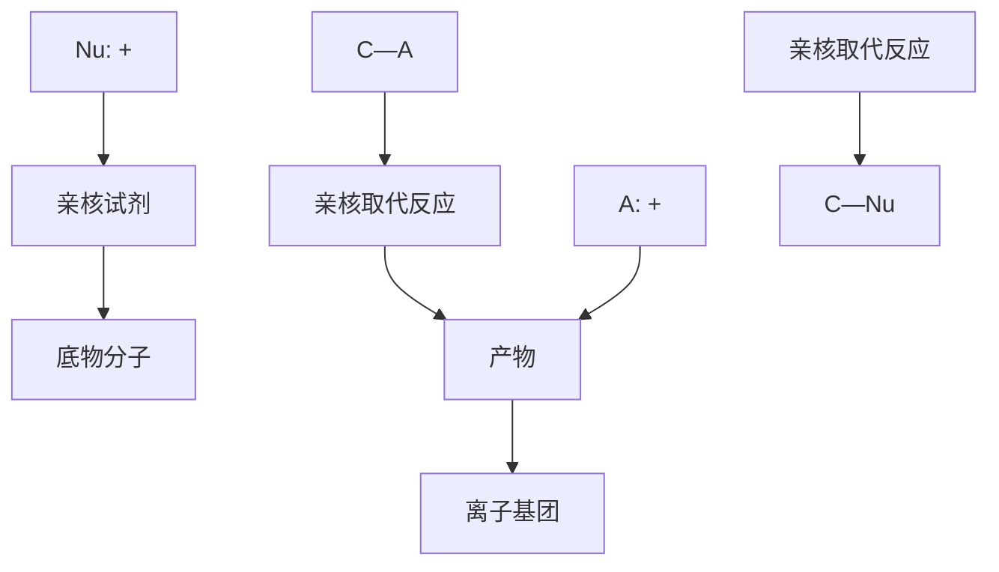
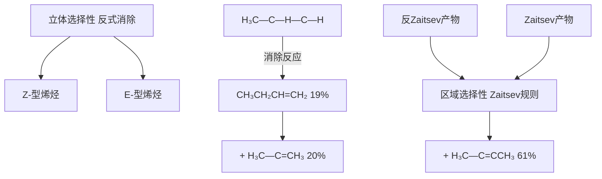

# 有机化学

# Organic Chemistry

# 第九章： 卤代烃

主讲: 王锋

华中科技大学化学与化工学院

School of Chemistry & Chemical Engineering, HUST

text_image

肾上腺素
ADRENALIN
(EPINEPHRINE)

chemical

亲核取代反应过程图，展示 nucleophilic substitution leading to a final product with hydroxyl and amine functional groups

去甲肾上腺素  
norepinephrine  
(S)-腺苷甲硫氨酸  
(S)-adenosyl methionine  
肾上腺素  
adrenaline

神经递质，动员大脑采取行动

肝脏中产生的甲基转移共底物

受激时发挥作用的神经递质

## 卤代烃

$$
\mathbf {R X} \quad (\mathrm{X=F,Cl,Br,I})
$$

溶 剂： $\mathsf { C H } _ { 2 } \mathsf { C l } _ { 2 } , \mathsf { C H C l } _ { 3 } , \mathsf { C C l } _ { 4 }$

制冷剂：氟利昂 ${ \mathsf { C H F } } _ { 2 } { \mathsf { C l } } , { \mathsf { C H } } _ { 3 } { \mathsf { C l } }$

麻醉剂： $C H C l _ { 3 }$

干洗剂： $C C l _ { 4 }$

## 卤代烃的分类

$$
\mathrm{CH} _ {3} \mathrm{CH} _ {2} \mathrm{X}
$$

饱和卤代烃

不饱和卤代烃

芳香卤代烃

## 卤代烃的分类

$$
\mathbf {C H} _ {2} \mathbf {X} _ {2}
$$

$$
\mathrm{XCH} _ {2} \mathrm{CH} _ {2} \mathrm{X}
$$

$$
\mathrm{CHX} _ {3}
$$

$$
\mathrm{XCH} _ {2} \mathrm{CHX} _ {2}
$$

一卤代烃

二卤代烃

三卤代烃

$$
(\mathrm{CH} _ {3}) _ {2} \mathrm{CHCH} _ {2} \mathrm{X}
$$

一级卤代烃伯卤代烷

$$
\begin{array}{c} \mathbf {X} \\ \mathbf {C H _ {3} C H _ {2} C H C H _ {3}} \end{array}
$$

二级卤代烃仲卤代烷

$$
(\mathrm{CH} _ {3}) _ {3} \mathrm{CX}
$$

三级卤代烃叔卤代烷

## 碳卤键的热稳定性

## $\mathrm { C H } _ { 3 } { \cdot } \mathrm { X }$

键长（Å）

F： 1.385

Cl: 1.784

Br: 1.929

I: 2.139

离解能（kJ/mol）

F： 451.9

Cl: 351.8

Br: 292.9

I: 221.8

稳定性

$$
\left(\mathrm{CH} _ {3}\right) \mathrm{C} - \mathrm{X} <   \left(\mathrm{CH} _ {2}\right) \mathrm{CH} - \mathrm{X} <   \mathrm{CH} _ {3} \mathrm{CH} _ {2} - \mathrm{X}
$$

## 碳卤键的反应性

$$
\begin{array}{l} \mathrm{H} _ {3} \stackrel {\delta +} {\mathrm{C}} - \stackrel {\delta -} {\mathrm{X}} \quad \text { 偶极矩 } \\ \mu = q d \quad \begin{array}{c c} F & 6. 0 7 \\ C l & 6. 4 7 \end{array} \\ \begin{array}{c c} \text {F} & 6. 0 7 \end{array} \\ \end{array}
$$

$$
\begin{array}{c c} \text {Cl} & 6. 4 7 \end{array}
$$

$$
\begin{array}{c c} \text {Br} & 5. 9 7 \\ \hline \end{array}
$$

$$
I \quad 5. 4 7
$$

碳卤键的反应活性主要取决于离解能：

$$
R F <   R C l <   R B r <   R I
$$

$$
\mathrm{H} _ {2} \mathrm{C} = \mathrm{CH} - \mathrm{CH} _ {2} - \mathrm{X} \quad \Longleftrightarrow \quad \mathrm{H} _ {2} \mathrm{C} = \mathrm{CH} - \stackrel {\oplus} {\mathrm{CH}} _ {2}
$$

烯丙位（活泼）

$$
\mathrm{CH} _ {2} \mathrm{X} \rightleftharpoons \mathrm{CH} _ {2}
$$

苄位（活泼）

$$
\mathrm{H} _ {2} \mathrm{C} = \mathrm{CH} - \ddot {\mathrm{X}}
$$

与双键直接相连（不活泼）

chemical

Chemical structure of a substituted benzene ring with an ẋ group and curved arrow indicating rotation or reaction direction

与苯环直接相连（不活泼）

## 卤代烃的化学反应

亲核取代反应  
消除反应  
与金属的反应  
不饱和卤代烃的亲核取代反应  
还原反应

## 饱和卤代烃的亲核取代反应

有机化合物分子中的原子（或基团）被亲核试剂取代的反应称为亲核取代反应(Nucleophilic Substitution reaction)，用 $\mathsf { \pmb { S } } _ { \mathsf { N } }$ 表示。如果受试剂进攻的原子是饱和碳原子，取代反应是在饱和碳原子上发生，则为饱和碳原子上的亲核取代反应。

flowchart

## 饱和卤代烃的亲核取代反应

chemical

Chemical reaction diagram showing the formation of a brominated amine and its radical, with reagents labeled for each step.

## 亲核取代反应机理

$$
\mathrm{CH} _ {3} \mathrm{Br} + \mathrm{H} _ {2} \mathrm{O} \xrightarrow [ 80 \% \text {EtOH} ]{\left[ \mathrm{OH} ^ {-} \right]} \mathrm{CH} _ {3} \mathrm{OH} + \mathrm{HBr}
$$

反应速度增加

$$
\mathbf {v} = \mathrm{k} [ \mathrm{RX} ] [ \mathrm{OH} ^ {-} ]
$$

text_image

慢

SN2

$$
\left(\mathrm{CH} _ {3}\right) _ {3} \mathrm{CBr} + \mathrm{H} _ {2} \mathrm{O} \xrightarrow [ 80 \% \text {EtOH} ]{\left[ \mathrm{OH} ^ {-} \right]} \left(\mathrm{CH} _ {3}\right) _ {3} \mathrm{COH} + \mathrm{HBr}
$$

text_image

快

SN1

反应速度无明显变化

$$
R = k [ R X ]
$$

## SN2反应机理

有两种分子参与了决速步的亲核取代反应称为双分子亲核取代反应，用 $S _ { \mathsf { N } } 2$ 表示， $S _ { \mathsf { N } } 2$ 反应是一步完成的协同反应。

chemical

化学反应示意图，展示亲核试剂与底物分子（Br-Br-）在逆变中生成产物的过程

chemical

Molecular structure of methane (CH₄) showing carbon, hydrogen, oxygen, and chlorine atoms with bonds

双分子参与、背面进攻、一步协同完成

## SN2反应机理特点

text_image

[Nu···R···X]≠
ΔEa
-Nu: + RX
ΔH
RNu + X:-

双分子反应，二级反应  
• 一步完成，协同进行（新键生成、旧键断裂)  
进攻位点在离去基团的背面——构型翻转

## Walden翻转

chemical

Reaction mechanism showing the formation of a brominated alkene from anions under Sn2 conditions, forming a hydroxyl radical and bromide ion.

(S)-二溴辛烷  
(R)-二辛硫醇  
(R)-octane-2-thiol

(S)-2-bromooctane  

natural_image

Portrait of a man with mustache and formal attire (no visible text or symbols)

Paul Walden 1863-1957  
invers

chemical

Molecular structure of methyl bromide (methyl bromide) with Chinese and English labels

ide

natural_image

Cartoon ant symbol crossed out by a red prohibition sign (no text or numbers present)

text_image

全球年产7.15万吨
97%用于土壤熏蒸
METHYL BROMIDE
GROSS WEIGHT: 68 KGS

亲核取代反应  
nucleophilic substitution  

chemical

Chemical reaction scheme showing the formation of a thioamide-containing compound from a sulfonamide and bromide, producing a hydroxy acid and HBr.

谷胱甘肽  
glutathione  
S-甲基谷胱甘肽  
S-glutathione

## SN1反应机理

只有一种分子参与了决速步的亲核取代反应称为单分子亲核取代反应，用 $\mathsf { S } _ { \mathsf { N } } \mathsf { 1 }$ 表示， $\mathsf { S } _ { \mathsf { N } } \mathsf { 1 }$ 反应是分步完成的。

## Step 1:

chemical

Chemical reaction diagram showing bromine (Br) reacting with hydrogen to form a carbon ion (C⁺) and Br⁻ ion (Br⁻)

## SN1反应机理

## Step 2:

chemical

氢氧化钡离子交换过程示意图，展示从正态中进入正态的转化过程及反应生成氢氧化合物的过程

chemical

3D ball-and-stick molecular model of a hydrocarbon with a red atom bonded to carbon and hydrogen atoms

## SN1反应机理特点

chemical

Chemical reaction pathway diagram showing [R3C⋯X]≠ and [R3C⋯Nu]≠ reactions leading to R3CX, R3C+ + X− + Nu:−, and R3CNu + X− species

• 单分子反应，一级反应  
• 分步完成，形成碳正离子— 决速步  
• 亲核试剂从碳正离子两边进攻— 外消旋化

## 小结

<table><tr><td>Sn2</td><td>Sn1</td></tr><tr><td>速率 = k[RX][Nu:]二级反应</td><td>速率 = k[RX]一级反应</td></tr><tr><td>一步完成</td><td>多步完成</td></tr><tr><td>进攻位点离去集团背面C</td><td>进攻位点C+两侧</td></tr><tr><td>立体化学:构型转化</td><td>立体化学:外消旋化</td></tr></table>

## 影响亲核取代反应的因素

烷基结构  
离去基团  
亲核试剂  
反应的溶剂

## 烷基结构的影响

$$
\begin{array}{l} \begin{array}{l l} & S _ {N} 1 \text {反应相对速率} \\ C H _ {3} B r & 1. 0 \end{array} \\ \begin{array}{c c c} \mathrm {CH_ {3} CH_ {2} Br} & & 1. 7 \\ & \xrightarrow [ 1 0 0 ^ {\circ} \mathrm{C} ]{\mathrm{HCOOH}} & \\ (\mathrm {CH_ {3}}) _ {2} \mathrm{CHBr} & & 4 5 \end{array} \\ \left(\mathrm{CH} _ {3}\right) _ {3} \mathrm{CBr} \quad 1 0 0 0 \\ \end{array}
$$

碳原子上烷基增加， $\mathsf { S } _ { \mathsf { N } } \mathbf { 1 }$ 反应速率增加

$$
\mathrm{CH} _ {3} ^ {+} <   \mathrm{CH} _ {3} \mathrm{CH} _ {2} ^ {+} <   (\mathrm{CH} _ {3}) _ {2} \mathrm{CH} ^ {+} <   (\mathrm{CH} _ {3}) _ {3} \mathrm{C} ^ {+}
$$

## 烷基结构的影响

$$
\mathrm{CH} _ {3} \mathrm{Br}
$$

$$
\mathrm{CH} _ {3} \mathrm{CH} _ {2} \mathrm{Br}
$$

$$
\left(\mathrm{CH} _ {3}\right) _ {2} \mathrm{CHBr}
$$

$$
\left(\mathrm{CH} _ {3}\right) _ {3} \mathrm{CBr}
$$

α碳原子上烷基增加，位阻越大，SN2反应速率下降

## 烷基结构的影响

β α

$$
\mathrm{CH} _ {3} \mathrm{CH} _ {2} \mathrm{Br}
$$

$S _ { \mathsf { N } } 2$ 反应相对速率

1

$C H _ { 3 } C H _ { 2 } C H _ { 2 } B r$

0.28

$( C H _ { 3 } ) _ { 2 } ^ { 3 } C H C H _ { 2 } B r$

0.03

$( C H _ { 3 } ) _ { 3 } ^ { B \bot } C C H _ { 2 } B r$

0.0000042

伯卤代烷β位上有侧链烷基时， $S _ { \mathsf { N } } 2$ 反应速率下降

chemical

Chemical structure diagram showing a chlorine atom bonded to three cyclopentadienyl rings

$$
\xrightarrow [ \text {30\% KOH} ]{\mathrm{AgNO} _ {3}}
$$

$$
\?
$$

无取代产物生成！！！

当卤原子连在桥环化合物的桥头碳上时，虽然也是叔卤代烷，但由于桥环体系的刚性，无法形成平面构型的碳正离子，故难以按 $S _ { \mathsf { N } } \mathbf { 1 }$ 历程反应；又由于C-X键的背后是环系，空间位阻大，瓦尔登反转不能进行，故$S _ { \mathsf { N } } 2$ 反应也难以实现。

## 烷基结构的影响

叔卤代烷容易按 $\mathsf { S } _ { \mathsf { N } } \mathbf { 1 }$ 历程进行反应  
• 伯卤代烷容易按 $S _ { \mathsf { N } } 2$ 历程进行反应  
• 仲卤代烷介于两者之间，即可按$\mathsf { S } _ { \mathsf { N } } \mathbf { 1 }$ 也可按 $S _ { \mathsf { N } } 2$ 反应，取决于具体条件

## 离去基团的影响

离去基团离去能力强，对 $\mathsf { S } _ { \mathsf { N } } \mathtt { 1 }$ 和 $S _ { \mathsf { N } } 2$ 反应均有利。

• 卤代烷中，I是好的离去基团  
• 卤素负离子作为离去基团的反应性：

$$
\mathrm{I} ^ {-} > \mathrm{Br} ^ {-} > \mathrm{Cl} ^ {-} > > \mathrm{F} ^ {-}
$$

## 离去基团的影响

• 硫酸酯和磺酸酯中的酸根也是好的离去基团：

chemical

硝酸二甲酯与甲磺酸根反应生成ROCH₃和SO₂OCH₃的化学方程式

chemical

化学反应方程式，展示对甲苯磺酸酯与RCN反应生成对甲苯磺酸根的步骤

## 亲核试剂的影响

在 $S _ { \mathsf { N } } \mathbb { 1 }$ 反应中，反应速率主要取决于C-X键的离解，与亲核试剂的亲核性大小基本无关。在 $S _ { N } 2$ 反应中，亲核试剂参与过渡态的形成，其亲核性大小对反应速率产生相当大的影响。亲核试剂的亲核性越强， $S _ { \mathsf { N } } 2$ 反应的趋势越大。

chemical

化学反应方程式，展示CH₃OH与CH₃OCH₃、CH₃O⁻之间的慢和快反应

## 亲核试剂的亲核性

## 试剂亲核性的大小与所带电荷的性质、体积、碱性、可极化性等有关。

• 电荷：带负电荷的亲核试剂比相应的中性分子的亲核性强

$$
\mathrm{RO} ^ {-} > \mathrm{ROH}, \quad \mathrm{HO} ^ {-} > \mathrm{H} _ {2} \mathrm{O}
$$

• 体积：体积大的亲核试剂位阻大，亲核性变弱。

$$
\left(\mathrm{CH} _ {3}\right) _ {3} \mathrm{CO} ^ {-} <   \left(\mathrm{CH} _ {3}\right) _ {2} \mathrm{CHO} ^ {-} <   \mathrm{CH} _ {3} \mathrm{CH} _ {2} \mathrm{O} ^ {-} <   \mathrm{CH} _ {3} \mathrm{O} ^ {-}
$$

## 亲核性与碱性

碱性：试剂与质子结合的能力  
亲核性：试剂与带正电的碳原子结合的能力  
• 试剂的亲核性主要由两个因素决定：一个是给电子能力即碱性；一个是可极化性。  
试剂的碱性和亲核性有时一致，有时不一致。

## 亲核试剂的亲核性

• 碱性：碱性越强，亲核性越强。

$$
\mathrm{R} _ {3} \mathrm{C} ^ {-} > \mathrm{R} _ {2} \mathrm{N} ^ {-} > \mathrm{RO} ^ {-} > \mathrm{F} ^ {-} (\text {同周期原子})
$$

$$
\mathrm{CH} _ {3} \mathrm{CH} _ {2} \mathrm{O} ^ {-} > \mathrm{HO} ^ {-} > \mathrm{C} _ {6} \mathrm{H} _ {5} \mathrm{O} ^ {-} > \mathrm{CH} _ {3} \mathrm{COO} ^ {-} (\text {不同基团中的同原子})
$$

• 可极化性：可极化性越强，亲核性越强。

$$
\mathrm{I} ^ {-} > \mathrm{Br} ^ {-} > \mathrm{Cl} ^ {-} > \mathrm{F} ^ {-}
$$

$$
\mathrm{CH} _ {3} \mathrm{S} ^ {-} > \mathrm{CH} _ {3} \mathrm{O} ^ {-}
$$

亲核试剂的可极化性是指其电子云在外界电场影响下变形的难易程度。易变形者可极化性大。

## 亲核性与碱性

亲核性：碱性和可极化性共同作用的结果，在多数情况下，试剂的亲核性和碱性强弱一致。

• 同一周期的原子，从左到右，碱性减小，可极化性减小，亲核性与碱性顺序一致：

$$
R _ {3} C ^ {-} > R _ {2} N ^ {-} > R O ^ {-} > F ^ {-}
$$

同一周期元素，从左到右，原子核对外层电子的吸引力增大，可极化性减少。  
同一族元素，从上到下，原子核对外层电子的约束力降低，可极化性增加大。

## 亲核性与碱性

同族元素，由上到下碱性减弱，可极化性增大，试剂的亲核性要作具体分析：

I -, HS-, SCN-等试剂可极化性很高，且碱性弱不易被溶剂质子化，在质子溶剂和偶极溶剂中均有很高的亲核性  
碱性强而可极化性较低的试剂（F-, Cl-, Br-）在质子溶剂中（如水、醇）与易与质子形成氢键，反应时需要去溶剂化的能量，反应活性降低；在偶极溶剂中（如DMF），这些试剂不易被溶剂化，以“裸露”状态存在 ，反应性高。

水、醇等质子溶剂中的亲核性： $\mathbf { I } ^ { - } > \mathbf { B } \mathbf { r } ^ { - } > \mathbf { C } \mathbf { I } ^ { - }$

丙酮中的亲核性： $\mathbf { I } ^ { - } \approx \mathbf { B } \mathbf { r } ^ { - } \approx \mathbf { C } \mathbf { I }$

DMF中的亲核性： $\mathbf { I } ^ { - } < \mathbf { B } \mathbf { r } ^ { - } < \mathbf { C } \mathbf { I }$

具体问题具体分析

## 亲核性

常见亲核试剂在质子溶剂中亲核性的大概顺序：

$$
R S ^ {-} \approx A r S ^ {-} > C N ^ {-} > I ^ {-} > N H _ {3} (R N H _ {2}) > R O ^ {-} \approx O H ^ {-}
$$

$$
> \mathrm{Br} ^ {-} > \mathrm{PhO} ^ {-} > \mathrm{Cl} ^ {-} > > \mathrm{H} _ {2} \mathrm{O} > \mathrm{F} ^ {-}
$$

## 溶剂的影响

chemical

Chemical reaction equation showing conversion of (CH₃)₃CBr to (CH₃)₃C⁺ + Br⁻ with water as reagent data

chemical

水解反应生成丙酮和水的化学方程式，含水与S_N2/S_N1

对于 $\mathsf { S } _ { \mathsf { N } } \mathtt { 1 }$ 反应，增加溶剂极性，使反应速率增加。

对于 $S _ { \mathrm { N } } 2$ 反应，增加溶剂极性，使反应速率降低，但影响不大。

## 不饱和卤代烃的亲核取代反应

卤原子直接与不饱和碳原子相连，称为卤代乙烯型分子，该卤原子不易发生亲核取代反应，但如有吸电子基团存在，可使亲核取代反应容易发生。

$$
\mathrm{H} _ {2} \mathrm{C} = \mathrm{CH} - \ddot {\mathrm{X}}
$$

与双键直接相连（不活泼）

$$
\text {   } \text {   } \text {   } \text {   } \text {   } \text {   } \text {   } \text {   } \text {   } \text {   } \text {   } \text {   } \text {   } \text {   } \text {   } \text {   } \text {   } \text {   } \text {   } \text {   } \text {   } x
$$

与苯环直接相连（不活泼）

卤代乙烯型

chemical

Chemical reaction equation showing chlorination of benzene under NaOH at 350°C

chemical

Chemical reaction equation showing nitrobenzene derivative reacting with NaOH at 160°C to form a phenol derivative

## 不饱和卤代烃的亲核取代反应

卤原子与不饱和碳原子间隔一个饱和碳原子，这类卤代烃称为卤代烯丙型分子，该卤原子活泼，易发生亲核取代反应。

$$
\mathrm{H} _ {2} \mathrm{C} = \mathrm{CH} - \mathrm{CH} _ {2} - \mathrm{X} \quad \rightleftharpoons \quad \mathrm{H} _ {2} \mathrm{C} = \mathrm{CH} - \stackrel {\oplus} {\mathrm{CH}} _ {2}
$$

烯丙位（活泼）

苄位（活泼）

卤代烯丙型

$$
\begin{array}{c} \mathrm{H} _ {2} \mathrm{C} = \mathrm{CH} - \mathrm{CH} _ {2} - \mathrm{X} \\ \mathrm{X} = \mathrm{Cl}, \mathrm{Br}, \mathrm{I} \end{array} \xrightarrow [ \text {醇} ]{\mathrm{AgNO} _ {3}} \quad \mathrm{AgX} \downarrow
$$

## 不饱和卤代烃的亲核取代反应

卤原子与不饱和碳原子间隔两个以上饱和碳原子，这类卤代烃称为孤立型卤代烯烃，该卤原子活性与饱和卤代烃相当。

不饱和卤代烃X原子活性：

烯丙型>孤立型>乙烯型

## 卤代烃的消除反应

## 卤代烃的消除反应

$$
\mathrm{CH} _ {3} \mathrm{CH} _ {2} \mathrm{CH} _ {2} \mathrm{Br} + \mathrm{C} _ {2} \mathrm{H} _ {5} \mathrm{O} ^ {-} \xrightarrow {\mathrm{C} _ {2} \mathrm{H} _ {5} \mathrm{OH}}
$$

$$
\mathrm{CH} _ {3} \mathrm{CH} _ {2} \mathrm{CH} _ {2} \mathrm{OCH} _ {2} \mathrm{CH} _ {3} + \mathrm{CH} _ {3} \mathrm{CH} = \mathrm{CH} _ {2}
$$

取代产物

消除产物

## 消除反应

chemical

Chemical reaction equation showing bromoethane reacting with sodium hydroxide to form ethyl acetate and hydrogen bromide

chemical

Chemical reaction equation showing hydrogenation of 2-丁醇 to form 2-丁烯 and water

chemical

苯乙烯的化学反应方程式，显示1,2-二溴乙基苯与NaNH₂生成苯乙炔

消除反应：在一个有机分子中消去两个原子或基团的反应称为消除反应(elimination reaction)，消除反应用E表示。

## 卤代烃的消除反应

chemical

苯环改性反应示意图，展示R₂C与α-β-γ-CH₂-CH(CH₃)基团的碱式转化及1,1-α-β-α-消除过程

1,3-消除，γ-消除

## 卤代烃的β-消除反应

chemical

Chemical reaction equation showing bromoalkane reacting with sodium hydroxide to form a CHCH₂CH=CHCH₃ and HBr

卤代烃的β-消除反应：卤素和β-碳上的氢失去一份子卤化氢而生成烯烃。

## 消除反应机理—单分子消除E1机理

$$
(\mathsf{CH}_3)_3\mathsf{CBr} \xrightarrow{\text{慢}} \left[ (\mathsf{CH}_3)_3\mathsf{C} - - - - \mathsf{Br} \right] \longrightarrow (\mathsf{CH}_3)_3\mathsf{C}^+ + \mathsf{Br}^-
$$

决速步  

chemical

甲烷化反应生成氢氧乙酯的化学反应式

E1消除分步进行，C-X键的异裂是反应的决速步。

## $\mathfrak { P }$ 1和E1反应中碳正离子的重排

## 消除反应机理—双分子消除E2机理

chemical

化学反应方程式，展示HO⁻与H-CH₂-CH₂-Br的转化过程及过渡态

$$
\longrightarrow \mathrm{CH} _ {2} = \mathrm{CH} _ {2} + \mathrm{H} _ {2} \mathrm{O} + \mathrm{Br} ^ {-}
$$

在E2消除中，试剂进攻β-H，并把β-H夺走。  
• 在 $S _ { \mathrm { N } } 2$ 反应中，试剂进攻α-C，然后与α-C结合。  
$S _ { \mathsf { N } } 2$ 和E2反应是竞争反应，同时发生。

## 卤代烃的β-消除反应—区域选择性

chemical

Chemical structure of a beta-hydroxy compound with methyl and bromine substituents

$$
\mathrm{CH} _ {3} \mathrm{CH} _ {2} \mathrm{CH} = \mathrm{CH} _ {2}
$$

chemical

Chemical structure showing a polymer chain with hydrogen atoms and bromine groups, labeled with β and α substituents

81%

Zaitsev产物更加稳定

般消除反应的主要产物是脱去含氢较少的β-碳原子上的氢，生成双键碳原子上连有最多烃基的烯烃（更稳定），这个规律称为）规则。

## 卤代烃的消除反应——立体选择性

chemical

Chemical reaction showing reduction of 2-methyl-1,3-butadiene to 2-methacrylate with 81% and 19% yield

20%

61%

natural_image

Solid red circular background with a white question mark symbol (no text or additional markings)

## E2消除反应机理—反式消除

chemical

Reaction mechanism showing the formation of a carbocation from a hydroxide and bromine, forming a hydrogen-bonded carboxylic acid derivative.

chemical

Chemical structure diagram showing Br and H atoms with a central atom bonded to three bonds

对位交叉式 空间位阻小，优势构象 反式消除

chemical

Molecular structure diagram showing hydrogen (H) and bromine (Br) atoms in a ring system

重叠式空间位阻大， 非优势构象顺式消除

## E2反应的特点：

• 双分子反应  
• 一步完成  
• 反式消除

## 消除反应机理—反式消除

chemical

Chemical structure of a brominated alkane with two methyl groups and a dashed box highlighting the bromine ring

chemical

Molecular structure diagram showing hydrogen bonding between carbon, bromine, and methyl groups

稳定性  

chemical

Structural formula of 2-methylcyclohexane showing carbon-carbon single bond and methyl group

(E)-2-丁烯  
主产物

chemical

Molecular structure diagram showing hydrogen bonding between bromine and hydrogen atoms, with H₃C and Br substituents

chemical

Structural formula of 2-methylcyclohexane showing carbon-carbon single bond and hydrogen atoms

(Z)-2-丁烯

## 消除反应的选择性

flowchart

## 小结

<table><tr><td>用途</td><td>卤代烃的β-消除反应生成相应的烯烃</td></tr><tr><td>E2机理</td><td>反式消除、双分子参与、一步完成</td></tr><tr><td>区域选择性</td><td>扎依采夫规则含H较少的β碳提供H原子</td></tr><tr><td>立体选择性</td><td>E-型烯烃为主产物生成大基团处于反位的烯烃</td></tr></table>

## 消除与取代反应的竞争性

chemical

核反应示意图，展示Nu-α-C原子与β-H-α-C原子在进攻α-C原子中的转化过程

卤代烷结构、试剂、溶剂、反应温度均对两种反应的活性有影响。

## 卤代烷结构的影响

$$
\mathrm{CH} _ {3} \mathrm{CH} _ {2} \mathrm{CH} _ {2} \mathrm{Br} + \mathrm{C} _ {2} \mathrm{H} _ {5} \mathrm{O} ^ {-} \xrightarrow {\mathrm{C} _ {2} \mathrm{H} _ {5} \mathrm{OH}}
$$

$$
\begin{array}{r l r} {\mathrm {CH_ {3} CH_ {2} CH_ {2} OC H_ {2} CH_ {3}}} & {+} & {\mathrm {CH_ {3} CH = CH_ {2}}} \\ {9 1 \%} & {} & {9 \%} \\ {\text {取代产物}} & {} & {\text {消除产物}} \end{array}
$$

伯卤代烷与强亲核试剂作用，主要是SN2反应

## 卤代烷结构的影响

$$
\begin{array}{c c c} \mathrm {CH_ {3} CHCH_ {2} Br} & + & \mathrm {C_ {2} H_ {5} O^ {-}} \\ \mid & & \\ \mathrm {CH_ {3}} & & \end{array} \xrightarrow {\mathrm {C_ {2} H_ {5} OH}}
$$

$$
\begin{array}{c} \mathrm{CH} _ {3} \\ \mathrm{CH} _ {3} \stackrel {!} {\mathrm{C}} = \mathrm{CH} _ {2} \end{array} + \begin{array}{c} \mathrm{CH} _ {3} \mathrm{CHCH} _ {2} \mathrm{OCH} _ {2} \mathrm{CH} _ {3} \\ \stackrel {!} {\mathrm{CH}} _ {3} \end{array}
$$

$$
\begin{array}{c c} 6 0 \% & 4 0 \% \\ \text {消除产物} & \text {取代产物} \end{array}
$$

仲卤代烷和β-碳原子上有支链的伯卤代烷由于位阻作用，削弱的 $\mathrm { { G H 2 } }$ 反应，增强了E2反应。

## 卤代烷结构的影响

$$
\begin{array}{l} \begin{array}{c c c} \mathrm {(CH_ {3}) _ {3} CBr} & + & \mathrm {C_ {2} H_ {5} OH} \\ & & \longrightarrow \\ & & 81 \% \\ & & 19 \% \end{array} \\ \left(\mathrm{CH} _ {3}\right) _ {3} \mathrm{CBr} + \mathrm{C} _ {2} \mathrm{H} _ {5} \mathrm{OH} \xrightarrow {\mathrm{C} _ {2} \mathrm{H} _ {5} \mathrm{O} ^ {-}} \left(\mathrm{CH} _ {3}\right) _ {3} \mathrm{COC} _ {2} \mathrm{H} _ {5} + \left(\mathrm{CH} _ {3}\right) _ {2} \mathrm{CH} _ {2} = \mathrm{CH} _ {2} 3 \% 97 \% \\ \end{array}
$$

叔卤代烷倾向于单分子反应，无强碱存在时，主要发生S 1反应。有强碱存在时，主要发生E2反应。

## 进攻试剂的影响

亲核性强、碱性弱的试剂对取代 $( S _ { \mathsf { N } } )$ ）反应有利；亲核性弱、碱性强的试剂对消除（E）反应有利。

• 伯卤代烷+ 强亲核试剂，主要发生 $S _ { \mathsf { N } } 2$ 反应  
• 叔卤代烷+ 强碱性试剂，主要发生E2反应  
• 仲卤代烷介于二者之间  
• 强碱存在时，卤代烷主要发生E2反应

## 溶剂的影响

RO-进攻β-H

HO-进攻α-C

增加极性，对单分子反应 $\mathbb { G } \mathbb { n }$ ，E1）有利（可稳定碳正离子中间体），对双分子反应（ $\mathrm { \textregistered }$ ，E2）不利，但影响不大（过渡态电荷分散，极性溶剂不利于电荷分散）

## 温度的影响

$$
\begin{array}{c c} \mathrm {(CH_ {3}) _ {3} CBr} & \xrightarrow {\mathrm {C_ {2} H_ {5} OH}} \\ & 2 5 ^ {\circ} \mathrm{C} \\ & 5 5 ^ {\circ} \mathrm{C} \end{array} \quad \begin{array}{c c} (\mathrm {CH_ {3}}) _ {2} \mathrm{C} = \mathrm {CH_ {2}} \\ & 1 9 \% \\ & 2 8 \% \end{array}
$$

提高反应温度，有利于消除反应进行

## 小结

$R { \mathrm { - } } \mathbb { C } \mathbb { H } _ { 2 } { \mathrm { - } } X$

$\mathsf { S } _ { \mathsf { N } } \mathsf { 1 }$ 单分子 取代反应  
$S _ { \mathsf { N } } 2$ 双分子 取代反应

E1 单分子 消除反应

E2 双分子 消除反应

## 小结

• 直链的一级卤代烷， $S _ { \mathrm { N } } 2$ 容易进行，消除反应很少，只有强碱存在时可发生消除反应；  
• 二级卤代烷及在β碳上有侧链的一级卤代烷，$S _ { \mathrm { N } } 2$ 反应速率较慢，低极性溶剂、强亲核试剂有利于 $S _ { \mathbb { N } ^ { 2 } }$ 反应；低极性溶剂、强碱试剂有利于E2反应；  
• 三级卤代烷 $S _ { \mathsf { N } } 2$ 反应很慢，存在高浓度强碱时，有利于E2反应；无强碱存在时，得到 $S _ { \mathsf { N } } \mathbb { 1 }$ 和E1的混合产物。

## 与金属的反应—有机镁化合物

卤代烷与还原性金属直接化合，生成一种由碳原子与金属原子直接相连的化合物，这类化合物称为金属有机化合物。

chemical

苯丙烯酸化反应方程式，涉及RX与Mg的中间体，通过无水乙醚和格利雅试剂生成MRgX和MgBr/MgCl

## 与金属的反应—有机镁化合物

chemical

Chemical reaction scheme showing the formation of RgMgX from H2O, HX, R'OH, and RC≡CH under different reagents (RH, MgX(OH), MgX₂, MgX(OR'))

格式试剂活性很高，可与多种含有活泼氢的化合物作用生成相应的烃。

## 与金属的反应—有机锂化合物

chemical

Chemical reaction diagram showing oxidation of RX and Li to RLi using an alkene, with a lithium reagent used in the reaction.

chemical

Chemical reaction equation showing catalytic hydrogenation of 2RLi and CuI under catalytic conditions to form R₂CuLi and LiI, with reagents labeled.

## 二烷基铜锂的烷基化反应

$$
\mathrm{CH} _ {3} \left(\mathrm{CH} _ {2}\right) _ {4} \mathrm{I} + \left(\mathrm{CH} _ {3}\right) _ {2} \mathrm{CuLi} \longrightarrow \mathrm{CH} _ {3} \left(\mathrm{CH} _ {2}\right) _ {4} \mathrm{CH} _ {3} + \mathrm{CH} _ {3} \mathrm{Cu} + \text {Lil}
$$

$$
\mathrm{Br} + \left(\mathrm{CH} _ {3}\right) _ {2} \mathrm{CuLi} \longrightarrow \mathrm{CH} _ {3}
$$

$$
\mathrm{R} \underset {\mathrm{H}} {\mathrm{C}} = \mathrm{C} \underset {\mathrm{X}} {\mathrm{H}} \xrightarrow {(\mathrm{R} ^ {\prime}) _ {2} \mathrm{CuLi}} \mathrm{R} \underset {\mathrm{H}} {\mathrm{C}} = \mathrm{C} \underset {\mathrm{R} ^ {\prime}} {\mathrm{H}}
$$

几何构型不变

## 还原反应

chemical

Chemical reaction pathway showing transformations of n-C₈H₁₇Br and n-C₈H₁₈ with intermediates and reagents like LiAlH₄, Zn, CH₃COOH, H₂, and catalyst RH

## 本章作业

9-2, 9-3, 9-4, 9-5, 9-7, 9-8, 9-12, 9-17

# 课堂练习题

用系统命名法命名

$$
\mathrm{CH} _ {3} \mathrm{CH} _ {2} - \underset {\mathrm{CH} _ {3}} {\overset {\mathrm{CH} _ {3}} {\mathrm{C}}} - \underset {\mathrm{CH} _ {3}} {\overset {\mathrm{Cl}} {\mathrm{C}}} - \mathrm{CH} _ {3}
$$

3,3-二甲基-2,2-二氯戊烷

$$
\mathrm{CH} _ {3} - \underset {\text {Br}} {\mathrm{CH}} - \mathrm{CH} = \mathrm{CH} - \mathrm{CH} _ {3}
$$

4-溴-2-戊烯

## 课堂练习题

写出主要反应产物

( $\boldsymbol { \mathsf { 1 ) } } \quad \mathsf { C H _ { 3 } C H _ { 2 } C H _ { 2 } C H _ { 2 } B r } \quad \frac { \mathrm { N a O H } } { \mathrm { H _ { 2 } O } } \underbrace { \mathsf { \Gamma } } _ { }$

$( 2 ) C H _ { 3 } C H _ { 2 } C H _ { 2 } C H _ { 2 } B r C H \atop C _ { 2 } H _ { 5 } O H \bigtriangleup$

级卤代烷在碱（NaOH,KOH）的水溶液中易发生取代反应，在碱（NaOH,KOH）的醇溶液中易发生消除反应。

## 课堂练习题

写出主要反应产物

chemical

Chemical reaction showing bromobenzene reacting with sodium hydroxide and water to form a hydrogenated product

二级卤代烷，由于位阻，取代反应速度慢，在强碱存在下容易发生消除反应

## 课堂练习题

写出主要反应产物

chemical

Chemical reaction scheme showing conversion of a brominated alkene to aniline using magnesium and aluminum catalyst

## 课堂练习题

写出主要反应产物

$$
\mathrm{C} _ {2} \mathrm{H} _ {5} \mathrm{MgBr} + \mathrm{CH} _ {3} \mathrm{C} \equiv \mathrm{CH} \longrightarrow
$$

$$
\mathrm{CH} _ {3} \mathrm{Br} \xrightarrow [ \mathrm{C} _ {2} \mathrm{H} _ {5} \mathrm{OH} ]{\mathrm{KOH}}
$$

## 课堂练习题

判断下列化合物进行 $S _ { \mathrm { N } } 2$ 反应的活性顺序

$$
(b) > (a) > (c)
$$

chemical

Chemical structure of cyclopentene with labeled carbon and iodine atoms

chemical

Chemical structure of a cyclopentene ring with chlorine substituent, labeled (b)

chemical

Chemical structure of a brominated cyclopentane ring with label (c)

$$
(a) > (c) > (b)
$$

## 课堂练习题

判断下列化合物在浓KOH的醇溶液中脱除HBr的反应速率大小

$$
\mathrm {CH_ {3} CH_ {2} CH_ {2} Br} \quad <   \quad \begin{array}{c} \mathrm{Br} \\ \mathrm {CH_ {3} CH_ {2} CHCH_ {3}} \end{array} \quad <   \quad \begin{array}{c} \mathrm{Br} \\ \mathrm {CH_ {3} CH_ {2} CCH_ {3}} \\ \mathrm {\dot {C} H _ {3}} \end{array}
$$

判断下列亲核取代反应的速率哪个快？

chemical

化学反应方程式，展示CH₃CH₂CH₂Br与NaSH/H₂O、NaOH/H₂O、CH₃CH₂CH₂SH和CH₃CH₂CH₂OH的转化过程

试剂的亲核性：SH- > OH-

判断下列亲核取代反应的速率哪个快？

chemical

Chemical reaction pathway showing conversion of aniline to benzoic acid and methoxybenzene, with Chinese labels for reactants and product.

试剂的亲核性： $\mathrm { C H } _ { 3 } { \bf O } ^ { - } > \mathsf { P h O } ^ { - }$