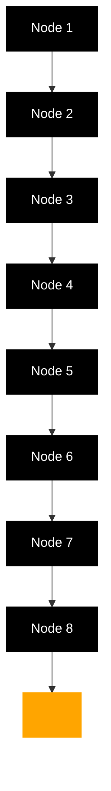
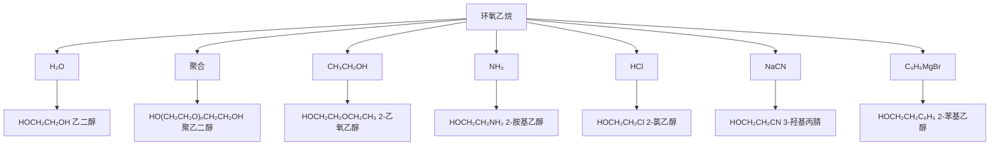

# 有机化学

# Organic Chemistry

## 第十一章：醇、酚、醚

主讲：王锋

华中科技大学化学与化工学院

School of Chemistry & Chemical Engineering, HUST

chemical

Complex organic molecule structure with multiple functional groups including amide, hydroxyl, and ketone moieties

## 紫杉醇

## Paclitaxel

天然产物，抗癌、抗白血病药物

太平洋紫衫中提取，1971年首次分离

natural_image

Close-up of green plant leaves with blurred red flowers in the background (no text or symbols)

natural_image

Close-up of red berries hanging on a tree branch with green leaves (no text or symbols visible)

## 全合成

## Total Synthesis

紫杉醇的全合成在1994年完成

- 美国Scripps研究所  
- 美国佛罗里达州立大学Robert Holton课题组  
• 150亿美元销售额

## 醇的结构和分类

ROH

chemical

Molecular orbital diagram showing electron density distribution around a carbon atom with 108.9° bond angle

RCH $_{2}$ OH

一级醇
伯醇

RCHR'
OH

二级醇
仲醇

R'
RCR"
OH

三级醇
叔醇

## 醇的结构和分类

$$
\mathrm{CH} _ {3} \mathrm{CH} _ {2} \mathrm{CH} _ {2} \mathrm{CH} _ {2} - \mathrm{OH}
$$

正丁醇
伯醇

$$
\begin{array}{c} \mathrm{CH} _ {3} \\ \mathrm{CH} _ {3} \mathrm{CHCH} _ {2} - \mathrm{OH} \end{array}
$$

异丁醇
伯醇

$$
\begin{array}{c} \mathrm{CH} _ {3} \\ \mathrm{CH} _ {3} \mathrm{CH} _ {2} \mathrm{CH} - \mathrm{OH} \end{array}
$$

仲丁醇
仲醇

$$
\begin{array}{c} \mathrm{CH} _ {3} \\ \mathrm{H} _ {3} \mathrm{C} - \mathrm{C} - \mathrm{OH} \\ \mathrm{CH} _ {3} \end{array}
$$

叔丁醇
叔醇

$$
\mathrm{CH} _ {3} \mathrm{CH} _ {2} \mathrm{OH}
$$

乙醇
一元醇

$$
\begin{array}{c} \mathrm{CH} _ {2} \mathrm{OH} \\ | \\ \mathrm{CH} _ {2} \mathrm{OH} \end{array}
$$

乙二醇
二元醇

$$
\begin{array}{c} \mathrm{CH} _ {2} \mathrm{OH} \\ | \\ \mathrm{CHOH} \\ | \\ \mathrm{CH} _ {2} \mathrm{OH} \end{array}
$$

丙三醇（甘油）
三元醇

## 醇的结构和命名（普通命名）

$$
\mathrm{CH} _ {3} \mathrm{CH} _ {2} \mathrm{CH} _ {2} \mathrm{CH} _ {2} \mathrm{OH}
$$

正丁醇

chemical

Chemical structure of cyclohexanol, showing a benzene ring with an OH group attached to the adjacent carbon.

环己醇

饱和醇

$$
\mathrm{CH} _ {2} = \mathrm{CH} - \mathrm{CH} _ {2} \mathrm{OH}
$$

烯丙醇

不饱和醇

chemical

Chemical structure of benzoic acid, showing a benzene ring with an OH group attached to the adjacent carbon.

苄醇

芳香醇

## 醇的化学性质—醇的酸性

chemical

Chemical reaction equation showing radical species R-O-δ⁻-H ⇌ RO⁻ + H⁺

- 醇的酸性小于水。  
- 生成的RO-越稳定，醇的酸性越强。  
- 由于烷基的给电子效应，烷基数目越多，给电子效应越强，烷氧基负离子越不稳定，酸性越弱。  
- 酸性：伯醇 > 仲醇 > 叔醇

## 醇的化学性质—醇的酸性

<table><tr><td>化合物</td><td>pKa</td><td>化合物</td><td>pKa</td></tr><tr><td>H2O</td><td>15.7</td><td>ClCH2CH2OH</td><td>14.3</td></tr><tr><td>CH3CH2OH</td><td>15.9</td><td>CCl3CH2OH</td><td>12.4</td></tr><tr><td>(CH3)2CHOH</td><td>18.0</td><td>CF3CH2OH</td><td>12.2</td></tr><tr><td>(CH3)3COH</td><td>19.2</td><td>CF3CH2CH2OH</td><td>14.6</td></tr></table>

## 醇的化学性质—醇的酸性

chemical

Chemical reaction equations showing ROH reacting with Na and then with different amine or magnesium salts, producing RONa and NH3.

醇可以与强碱（KH， $NaNH_{2}$ ），碱金属（Li，K，Na），以及强极性金属有机化合物（RLi，RMgX）等反应。

## 醇的化学性质—醇的碱性

$RCH_{2}OH$

氧上的孤对电子使醇表现出碱性

$$
\mathrm{CH} _ {3} \mathrm{CH} _ {2} \mathrm{OH} + \mathrm{HCl} \longrightarrow \mathrm{CH} _ {3} \mathrm{CH} _ {2} \stackrel {+} {\mathrm{OH}} _ {2} + \mathrm{Cl} ^ {-}
$$

## 醇的取代反应—与氢卤酸的反应

$$
\mathrm{ROH} + \mathrm{HX} \rightleftharpoons \stackrel {+} {\mathrm{ROH}} _ {2} + \mathrm{X} ^ {-} \longrightarrow \mathrm{RX} + \mathrm{H} _ {2} \mathrm{O}
$$

HX的反应活性：HI > HBr > HCl

醇的反应活性：苄型醇、烯丙型＞叔醇＞仲醇＞伯醇＞甲醇

$$
\mathrm{CH} _ {3} \mathrm{CH} _ {2} \mathrm{CH} _ {2} \mathrm{CH} _ {2} \mathrm{OH} \xrightarrow [ \text {加热} ]{\text {浓HCl}} \mathrm{CH} _ {3} \mathrm{CH} _ {2} \mathrm{CH} _ {2} \mathrm{CH} _ {2} \mathrm{Cl} + \mathrm{H} _ {2} \mathrm{O}
$$

$$
(\mathrm{CH} _ {3}) _ {3} \mathrm{COH} \xrightarrow [ \text {室温} ]{\text {浓HCl}} (\mathrm{CH} _ {3}) _ {3} \mathrm{CCl} + \mathrm{H} _ {2} \mathrm{O}
$$

## 醇的取代反应—与氢卤酸的反应

$$
\mathrm{RCH} _ {2} \mathrm{OH} + \mathrm{HX} \rightleftharpoons \mathrm{RCH} _ {2} \stackrel {+} {\mathrm{OH}} _ {2} + \mathrm{X} ^ {-}
$$

$$
\mathrm{RCH} _ {2} \xrightarrow {\text {   +   }} \mathrm{OH} _ {2} + \mathrm{X} ^ {-} \longrightarrow \mathrm{RCH} _ {2} \mathrm{X} + \mathrm{H} _ {2} \mathrm{O}
$$

伯醇与氢卤酸的反应一般按 $S_{N}2$ 机理进行。

## 醇的取代反应—与氢卤酸的反应

叔醇与氢卤酸的反应一般按 $S_{N}1$ 机理进行。

## 醇的取代反应—碳正离子重排

chemical

Chemical reaction pathway showing dehydration of a tertiary alcohol to form a hydroxyl radical, followed by acidification and water elimination

chemical

Structural formula of a branched alkane molecule with methyl and hydrogen substituents

## Lucas试剂与醇的鉴定

Lucas试剂：浓盐酸与无水 $\mathrm{ZnCl}_{2}$ 所配的试剂。在Lucas试剂中加入几滴醇混合，溶解的醇生成不溶的氯代烃。可根据浑浊出现的速度判定醇的类型。

- 叔醇、烯丙型醇、苄型醇——立即出现浑浊，放热  
- 仲醇——数分钟后出现浑浊，放热不明显  
- 伯醇——加热后出现浑浊

各类型醇与Lucas试剂的反应速率:

烯丙型醇
苄型醇 > 二级醇（仲醇）> 一级醇（伯醇）
三级醇（叔醇）

## 醇的取代反应—与无机卤化物的反应

无机卤化物（ $\mathrm{PCl}_3$ ， $\mathrm{PCl}_5$ ， $\mathrm{SOCl}_2$ ）可替代氢卤酸进行反应。

$$
\mathrm{ROH} \xrightarrow {\mathrm{PCI} _ {5}} \mathrm{RCI} + \mathrm{POCI} _ {3} + \mathrm{HCI}
$$

亚硫酰氯（氯化亚砜）

$$
\mathrm{ROH} \xrightarrow {\mathrm{SOCl} _ {2}} \mathrm{RCI} + \mathrm{SO} _ {2} \uparrow + \mathrm{HCI} \uparrow
$$

产物构型保持

## 醇的取代反应—形成磺酸酯后的亲核取代反应

chemical

有机化学反应方程式，展示苯磺酰氯与乙酸酯生成苯甲基的步骤

chemical

Chemical reaction equation showing sulfonation of a benzene derivative with lithium bromide to form a brominated aromatic compound and LiO sulfonate

## 醇的脱水反应

$$
\mathrm{CH} _ {3} \mathrm{CH} _ {2} \mathrm{CH} _ {2} \mathrm{OH} \xrightarrow {\text {浓硫酸}} \mathrm{CH} _ {3} \mathrm{CH} = \mathrm{CH} _ {2} + \mathrm{H} _ {2} \mathrm{O}
$$

$$
\begin{array}{c} \text {扎依采夫规则} \\ \begin{array}{c} - H _ {2} O \\ \text {CH} _ {3} C = C H C H _ {3} \\ \dot {C} H _ {3} \\ 8 0 \% \\ \text {CH} _ {3} \text {CHCH} = C H _ {2} \\ \dot {C} H _ {3} \\ 2 0 \% \end{array} \\ \text {OH} \\ \text {CH} _ {3} \text {CH} - \text {CHCH} _ {3} \\ \text {β} \\ \text {β} \\ \text {β} \\ \text {CH} _ {3} \text {CH} - \text {CHCH} _ {3} \\ \text {CH} _ {3} \text {OH} \end{array}
$$

## 醇的脱水反应

chemical

Reaction mechanism showing protonation and ring opening of a branched alcohol with methyl groups

负氢迁移

chemical

Chemical reaction mechanism showing protonation and rearrangement of a carbocation intermediate

主要产物

当连有醇羟基的碳原子与三级碳原子、二级碳原子相连时，在酸催化下的脱水反应中常常会有重排发生。

## 醇的酯化反应

chemical

Chemical reaction equation showing ethyl acetate reacting with ethyl acetate to form a carboxylic acid derivative

醇可以和酰氯、羧酸、酸酐生成酯，醇的O-H键断裂。

## 醇的酯化反应

醇可以和无机含氧酸生成无机酸酯。

$$
\begin{array}{l} \mathrm{CH} _ {3} \mathrm{CH} _ {2} \mathrm{OH} + \mathrm{H} _ {2} \mathrm{SO} _ {4} \longrightarrow \mathrm{CH} _ {3} \mathrm{CH} _ {2} \mathrm{OSO} _ {3} \mathrm{H} \\ \mathrm{CH} _ {3} \mathrm{CH} _ {2} \mathrm{OH} + \mathrm{H} _ {2} \mathrm{SO} _ {4} \longrightarrow (\mathrm{CH} _ {3} \mathrm{CH} _ {2} \mathrm{O}) _ {2} \mathrm{SO} _ {2} \text {   硫酸二乙酯   } \\ \end{array}
$$

$$
\mathrm{CH} _ {3} \mathrm{OH} + \mathrm{HNO} _ {3} \longrightarrow \mathrm{CH} _ {3} \mathrm{ONO} _ {2} \text {硝酸甲酯}
$$

$$
3 \mathrm{CH} _ {3} \mathrm{OH} + \quad \mathrm{POCl} _ {3} \longrightarrow (\mathrm{CH} _ {3} \mathrm{O}) _ {3} \mathrm{PO}   \text { 磷酸三甲酯 }
$$

$$
\begin{array}{c c c} \mathrm{CH} _ {2} \mathrm{OH} & & \\ \mid & & \\ \mathrm{CHOH} & + & 3 \mathrm{HNO} _ {3} \\ \mid & & \\ \mathrm{CH} _ {2} \mathrm{OH} & & \end{array} \longrightarrow \begin{array}{c c c} \mathrm{CH} _ {2} \mathrm{ONO} _ {2} & & \\ \mid & & \\ \mathrm{CHONO} _ {2} & + & 3 \mathrm{H} _ {2} \mathrm{O} \\ \mid & & \\ \mathrm{CH} _ {2} \mathrm{ONO} _ {2} & & \end{array}
$$

甘油三硝酸酯（烈性炸药）

## 醇的脱氢反应

$$
\mathrm{RCH} _ {2} \mathrm{OH} \xrightarrow [ 3 0 0 - 3 2 5 ^ {\circ} \mathrm{C} ]{\mathrm{Cu}} \mathrm{RCHO} + \mathrm{H} _ {2}
$$

$$
\begin{array}{c} \mathrm{RCHOH} \\ \mathrm {R^ {\prime}} \end{array} \xrightarrow [ 3 0 0 - 3 2 5 ^ {\circ} \mathrm{C} ]{\mathrm{Cu}} \begin{array}{c} \mathrm{RC=O} \\ \mathrm {R^ {\prime}} \end{array} + \begin{array}{c} \mathrm {H_ {2}} \end{array}
$$

伯醇脱氢生成相应的醛
仲醇脱氢生成相应的酮

## 醇的氧化反应

chemical

Chemical reaction pathway showing conversion of RCH₂OH to RCHO and then to RC=O with R' as a radical intermediate

伯醇氧化生成醛

仲醇氧化生成酮

叔醇不易氧化

## 醇的氧化反应

chemical

Chemical reaction equation showing oxidation of a hydroxyethyl ether to form a carboxylic acid and then to a carboxylic acid with H+ ion

伯醇在强氧化条件下（高锰酸钾的碱性溶液）直接被氧化为羧酸；二级醇在强氧化条件下被氧化为酮，并进一步氧化使碳碳键断裂；三级醇不易被氧化。

## 醇的氧化反应

$$
\mathrm{CH} _ {3} \mathrm{CH} _ {2} \mathrm{CH} _ {2} \mathrm{OH} \xrightarrow [ \mathrm{H} _ {2} \mathrm{SO} _ {4} ]{\mathrm{Na} _ {2} \mathrm{Cr} _ {2} \mathrm{O} _ {7}} \mathrm{CH} _ {3} \mathrm{CH} _ {2} \mathrm{COOH}
$$

$$
\begin{array}{c} \mathrm{R} _ {\mathrm{CHOH}} \\ \mathrm{R} \end{array} \xrightarrow {\mathrm{Na} _ {2} \mathrm{Cr} _ {2} \mathrm{O} _ {7} \text {or CrO} _ {3}} \begin{array}{c} \mathrm{R} _ {\mathrm{C}} \\ \mathrm{R} \end{array}
$$

## 醇的氧化反应

chemical

苯环改性与碱基反应的化学方程式，以CH=CHCH₂OH和COLL试剂为辅料

Collins试剂: $\mathrm{CrO}_{3}$ 与吡啶生成的配合物, 可选择性地氧化醇得到相应的醛或酮

$$
\mathrm{CH} _ {3} \left(\mathrm{CH} _ {2}\right) _ {4} \mathrm{C} \equiv \mathrm{CCH} _ {2} \mathrm{OH} \xrightarrow {\text {Collins试剂}} \mathrm{CH} _ {3} \left(\mathrm{CH} _ {2}\right) _ {4} \mathrm{C} \equiv \mathrm{CCHO}
$$

## 醇的氧化反应

chemical

Molecular structure of a hydroxy-substituted polycyclic ketone compound

$CrO_{3}$ ，稀 $H_{2}SO_{4}$

丙酮， $15 - 20^{\circ} \mathrm{C}$

Jones试剂

chemical

Molecular structure of a ketone compound with a hydroxyl group at the 2-position

## 二元醇的氧化反应

邻二醇分子中连接-OH的C-C键容易断裂，用高碘酸或四乙酸铅可以发生氧化断裂反应。

chemical

Chemical reaction equation showing aldehyde reacting with HIO4 to form RCHO and HCHO

chemical

Chemical reaction equation showing conversion of 3-methyl-1,2-dihydroxybenzaldehyde to 2-methoxyphenyl alcohol using Pb(OAc)4 catalyst

## 邻二醇的重排

邻二醇在酸的作用下邻位二叔醇发生碳骨架的重排，生成酮，称为频哪醇重排。

chemical

Chemical reaction showing protonation of a diol to form a carbonyl compound

chemical

Chemical reaction mechanism showing protonation and dehydration steps of a fatty acid with water, labeled as '重排' (reduction)

chemical

Chemical equilibrium reaction showing protonation of a carbocation to form a ketone

## 邻二醇的重排

chemical

Chemical reaction showing the formation of a phenol radical from a hydroxyethyl ether and methacrylic acid

邻二醇重排，倾向于优先生成更加稳定的碳正离子。

## 醇的实验室制法

## 卤代烃水解

$$
\begin{array}{l} \mathrm{CH} _ {2} = \mathrm{CHCH} _ {2} \mathrm{Cl} + \mathrm{NaOH} \longrightarrow \mathrm{CH} _ {2} = \mathrm{CHCH} _ {2} \mathrm{OH} + \mathrm{NaCl} \\ \mathrm{C} _ {5} \mathrm{H} _ {1 1} \mathrm{Cl} + \mathrm{NaOH} \longrightarrow \mathrm{C} _ {5} \mathrm{H} _ {1 1} \mathrm{OH} + \mathrm{NaCl} \\ \end{array}
$$

$$
\mathrm{Cl} \xrightarrow {\text {   +   }} \mathrm{NaOH} \longrightarrow \mathrm{OH} + \mathrm{NaCl}
$$

## 醇的实验室制法

烯烃水合

$$
\mathrm{H} _ {2} \mathrm{C} = \mathrm{CH} _ {2} + \mathrm{H} _ {2} \mathrm{O} \xrightarrow {\mathrm{H} ^ {+}} \mathrm{CH} _ {3} \mathrm{CH} _ {2} \mathrm{OH}
$$

烯烃硼氢化-氧化

$$
\mathrm{CH} _ {3} \mathrm{CH} = \mathrm{CH} _ {2} \quad \xrightarrow [ (2) \mathrm{H} _ {2} \mathrm{O} _ {2} , \mathrm{OH} ^ {-} ]{(1) \mathrm{B} _ {2} \mathrm{H} _ {6}} \quad \mathrm{CH} _ {3} \mathrm{CH} _ {2} \mathrm{CH} _ {2} \mathrm{OH}
$$

## 醇的实验室制法

## 格式试剂

chemical

Chemical reaction scheme showing the formation of a hydroxy radical from methanol and aldehyde under acidic conditions

## 酚的结构

羟基直接连接在苯环上的化合物称为酚。

flowchart

## 酚的化学性质—酸性

chemical

Chemical structure of phenol, showing a hydroxyl group attached to a benzene ring

chemical

Chemical structure of benzene with oxygen and electron shell notation

text_image

RCOOH H₂CO₃
pKₐ ∼5 ∼6.35

chemical

Chemical structure of phenol, showing a hydroxyl group attached to a benzene ring

10

  
15.7

  
16-19

酸性：羧酸 > 碳酸 > 酚 > 水 > 醇

## 酚的化学性质—酸性

$$
p K _ {a} = 9. 9 9
$$

$$
\mathrm{pK} _ {\mathrm{a}} = 1 0. 2 6
$$

$$
\mathrm{pK} _ {\mathrm{a}} = 9. 0 2
$$

$$
\mathrm{pK} _ {\mathrm{a}} = 7. 1 6
$$

$$
p K _ {a} = 4
$$

$$
\mathrm{pK} _ {\mathrm{a}} = 0. 7 1
$$

强酸

苯环上连有吸电子基团，酚羟基的酸性增强
苯环上连有给电子基团，酚羟基的酸性减弱

## 酚的化学性质—酸性

chemical

Chemical structure of phenol, showing a hydroxyl group attached to a benzene ring

$$
\mathsf {p K} _ {\mathsf {a}} = 9. 9 9
$$

chemical

Chemical structure of a substituted benzene ring with hydroxyl and chloro groups

$$
\mathrm{pK} _ {\mathrm{a}} = 9. 0 2
$$

chemical

Chemical structure of 1-chloro-4-methoxyphenol, showing hydroxyl and chlorophenyl groups on benzene ring

$$
\mathrm{pK} _ {\mathrm{a}} = 9. 3 8
$$

chemical

Chemical structure of a substituted benzene ring with hydroxyl and chloro groups

$$
\mathsf {p K} _ {\mathsf {a}} = 8. 4 8
$$

chemical

Chemical structure of phenol, showing a hydroxyl group attached to a benzene ring

$$
\mathsf {p K} _ {\mathsf {a}} = 9. 9 9
$$

chemical

Chemical structure of a benzene ring with hydroxyl and nitro groups

$$
\mathrm{pK} _ {\mathrm{a}} = 8. 4 0
$$

chemical

Chemical structure of a benzene ring with hydroxyl and nitro groups

$$
\mathrm{pK} _ {\mathrm{a}} = 7. 2 3
$$

chemical

Chemical structure of phenol, showing hydroxyl group and nitro group attached to benzene ring

$$
\mathrm{pK} _ {\mathrm{a}} = 7. 1 6
$$

## 酚的化学性质—烷基化

酚氧负离子作为亲核试剂，可与卤代烃、硫酸酯发生烷基化反应。

## 酚的化学性质—酯化反应

酚羟基不易酯化，需与强酰化试剂（酸酐、酰氯）反应生成酚酯。

chemical

乙酸酐与酚酯反应生成酚酯的化学方程式

chemical

水杨酸与乙酰水杨酸反应生成乙酰水杨酸的化学方程式

## 酚酯的重排——弗利斯重排

chemical

Friedel-Crafts acylation reaction of phenol to benzoic acid using AlCl₃ and Fries reagent

酚酯在 $\mathrm{AlCl}_{3}$ 的催化下重排得到酰基酚，这个反应可以用来酰基化苯酚。

## 芳环上的取代反应—卤化

由于羟基的给电子效应，酚的苯环上易发生亲电取代反应。

chemical

Chemical reaction equation showing hydroxyl radical reacting with chlorine to form a chlorinated phenol and another alcohol

## 芳环上的取代反应—卤化

chemical

Chemical structure of phenol, showing a hydroxyl group attached to a benzene ring

chemical

Chemical reaction condition label showing bromine and water as reactants

chemical

Chemical structure of a brominated aromatic compound with hydroxyl and bromine substituents

白色沉淀  
(可用于鉴定苯酚)

chemical

Chemical structure of phenol, showing a hydroxyl group attached to a benzene ring

chemical

Chemical reaction condition label showing bromine and cCl₄ at 0°C

chemical

Chemical structure of bromophenol, showing a benzene ring with hydroxyl and bromine substituents

+  

chemical

Chemical structure of a brominated aromatic compound with hydroxyl and bromine substituents

## 芳环上的取代反应—磺化

chemical

Chemical reaction equation showing phenol reacting with concentrated sulfuric acid to form a sulfonic acid and then hydroxyl sulfonic acid

20 °C

100°C

51%

90%

49%

10%

动力学控制

热力学控制

## 芳环上的取代反应—硝化

chemical

Chemical reaction equation showing phenol reacting with dilute HNO₃ to form a nitrobenzene derivative and another nitrobenzene

chemical

Nitration reaction equation of benzene with nitrobenzene under concentrated nitric acid and concentrated sulfuric acid at 100°C

2,4,6-三硝基苯酚
苦味酸

## 芳环上的取代反应—烷基化

在路易斯酸或质子酸的存在，酚能与卤代烷、烯烃、醇发生烷基化反应。

## 芳环上的取代反应—酰化

在路易斯酸或质子酸的存在，酚能与酰氯、酸酐、羧酸发生酰基化反应。

chemical

Chemical reaction equation showing phenol reacting with acetic acid under basic conditions to form two substituted benzene derivatives

chemical

Chemical reaction equation showing hydroxyl group reacting with methacrylate to form a biphenyl alcohol and then acetophenol

## 酚的化学性质—氧化反应

酚易被氧化，重铬酸钾的硫酸溶液、 $\mathrm{Ag_2O}$ 等可将酚氧化成苯醌；多元酚更容易被氧化。

chemical

苯醌与邻苯醌的化学反应方程式，涉及K₂Cr₂O₇和Ag₂O等中间产物

醌：含有共轭环己二酮结构的一类化合物，醌不属于芳香化合物（碳碳键长不均等）。

## 酚的化学性质—氧化反应

chemical

Hydrolysis reaction of phenol to benzoic acid and water, producing phenol and water

双氧水（ $\mathrm{H}_{2} \mathrm{O}_{2}$ ）可将苯酚氧化为对苯二酚和邻苯二酚。

## 酚的化学性质—显色反应

$$
6 \mathrm{C} _ {6} \mathrm{H} _ {5} \mathrm{OH} + \mathrm{FeCl} _ {3} \longrightarrow [ \mathrm{Fe} (\mathrm{OC} _ {6} \mathrm{H} _ {5}) _ {6} ] ^ {3 -} + 6 \mathrm{H} ^ {+} + 3 \mathrm{Cl} ^ {-} \text {蓝色}
$$

该反应用于鉴定酚类化合物

## 醚的结构与性质

## R-O-R'

R为烷基或芳基，R相同为对称醚，R不相同为混合醚。

醚的化学性质稳定，一般碱、氧化剂、还原剂都不能破坏醚的结构，所以常用于有机试剂。

## 醚的命名（普通命名）

$$
\mathrm{CH} _ {3} \mathrm{OCH} _ {3}
$$

## （二）甲醚

$$
\mathrm{CH} _ {3} \mathrm{CH} _ {2} \mathrm{OCH} _ {2} \mathrm{CH} _ {3}
$$

乙醚

chemical

Chemical structure of a bisphenol ether compound with two benzene rings connected by an oxygen bridge

苯醚

$$
\mathrm{CH} _ {3} \mathrm{OCH} _ {2} \mathrm{CH} _ {3}
$$

甲乙醚

$$
\mathrm{CH} _ {3} \mathrm{OC} (\mathrm{CH} _ {3}) _ {3}
$$

甲基叔丁醚

chemical

Chemical structure of 1,3-benzoquinone (methoxyphenyl ether)

苯甲醚（茴香醚）

## 醚的命名（系统命名）

结构较复杂的醚，用系统命名法时，将较大的烃基作为母体，将RO-基部分作为取代基（烷氧基）来命名。

$$
\begin{array}{c} \mathrm{CH} _ {3} \mathrm{CH} _ {2} \mathrm{CH} _ {2} \mathrm{CHCH} _ {3} \\ \mathrm{OCH} _ {3} \end{array}
$$

2-甲氧基戊烷

$$
\mathrm{CH} _ {3} \mathrm{O} - \mathrm{CH} _ {2} \mathrm{CH} _ {2} - \mathrm{OCH} _ {3}
$$

1,2-二甲氧基乙烷

$$
\mathrm{CH} _ {3} \mathrm{O} - \mathrm{CH} _ {2} \mathrm{CH} _ {2} \mathrm{OH}
$$

2-甲氧基乙醇

$$
\mathrm{Cl} - \mathrm {\bigcirc} - \mathrm{O} - \mathrm{C} _ {2} \mathrm{H} _ {5}
$$

1-氯-4-乙氧基苯

## 醚的命名（俗名）

脂肪族碳环内含有醚键（-O-）的化合物称为环醚，一般用俗名。

环氧乙烷

环氧丙烷

四氢呋喃 (THF)

chemical

Chemical structure of cyclohexane with oxygen atom labeled

四氢吡喃

chemical

Chemical structure of octahedron showing two oxygen atoms each bonded to a double bond

1,4-二氧六环

chemical

Chemical structure of a cyclic ether with four oxygen atoms and two cyclohexane rings

12-冠-4

(冠醚)

## 环醚—冠醚

12-Crown-4  

chemical

Chemical structure of a cyclic ether compound with four oxygen atoms and two cyclohexane rings

12-冠-4

15-Crown-5  

chemical

Chemical structure diagram of a cyclic ether compound with oxygen atoms and cyclohexane rings

15-冠-5

18-Crown-6  

chemical

Chemical structure diagram showing a symmetric organic molecule with oxygen atoms and double bonds

18-冠-6

21-Crown-7  

chemical

Chemical structure diagram of a symmetric organic molecule with oxygen atoms and conjugated bonds

21-冠-7

chemical

Chemical structure of a symmetric dimeric molecule with oxygen atoms and conjugated bonds

text_image

K⁺

chemical

Molecular structure of potassium ion (K⁺) showing a central K⁺ atom surrounded by six oxygen atoms in a symmetric octahedral geometry.

## 醚的化学性质—过氧化物的生成

chemical

Chemical reaction showing oxidation of a methacrylate ester to a hydroxyphenol derivative

与O相邻的碳上有氢时，醚在空气中会缓慢生成不稳定的过氧化物。

高浓度下，受热、撞击易发生爆炸。

注意：蒸馏乙醚时须先用淀粉-KI试纸测试有无过氧化物存在，如果有，先将其还原（还原剂： $\mathrm{FeSO_4}$ ， $\mathrm{Na_2SO_3}$ ）。

## 醚的化学性质—形成锌盐

## 醚键的断裂

chemical

Chemical reaction equation showing oxidation of a radical to hydroxyl radical and R'X radical

反应活性：HI > HBr > HCl

醚中的烷氧键不易断裂，但在浓强氢卤酸中形成锌盐后，使C-O键极性增大，在加热的条件下，X-离子作为亲核试剂进攻与氧相连的C原子，可使醚键断裂，生成醇和卤代烃。

## $C_{2}H_{4}O$

## 环氧乙烷

## ethylene oxide

沸点：10.4°C

无色气体，醚味

chemical

Molecular geometry diagram of a triatomic molecule with labeled bond angles and distances

chemical

3D ball-and-stick molecular model of ethane showing carbon, hydrogen, oxygen, and water atoms

环张力

## 环醚—三元环醚的开环反应

flowchart

碱催化或酸催化

## 环氧乙烷的开环反应

## 碱性条件

chemical

Chemical structure diagram showing hydrogen bonding between carbonyl groups and oxygen, with labeled bond numbers 1 and 2

chemical

Chemical reaction equation showing sodium benzoate reacting with hydroxymethylbenzene

chemical

Chemical structure diagram showing a molecule with hydroxyl (HO), carbon (C), and acetal groups (OC₂H₅) labeled with numbers 1 and 2.

## 酸性条件

chemical

Chemical structure diagram showing hydrogen bonding between carbonyl carbon and oxygen, with labeled bond numbers 1 and 2

chemical

Chemical reaction equation showing C₂H₅OH reacting with H⁺ to form an alkyl radical

chemical

Chemical structure diagram showing carbon and hydrogen atoms with labeled positions 1 and 2

区域选择性  
regioselectivity

## 环氧乙烷的开环反应

## 碱催化开环加成机理

chemical

碱催化开环加成机理示意图，展示从H3C和O反应生成C2H5O⁻的路径及位阻较小

chemical

Chemical reaction diagram showing the transformation of a cyclic acetal with methoxy and hydroxyl groups, forming a bridged bicyclic alcohol.

碱催化条件下，亲核试剂进攻位阻较小的C原子

## 环氧乙烷的开环反应

酸催化开环加成机理  

chemical

化学反应示意图，展示类似三级C+离子在不同分子结构中的转化过程

酸催化条件下，亲核试剂进攻取代基较多的C原子

## 环氧乙烷的开环反应

chemical

Chemical reaction diagram showing acetaldehyde (H₃CH₂C) reacting with CH₃OH to form an oxygen-containing intermediate, producing H⁺.

chemical

3D ball-and-stick model of a molecule with orange, red, and black atoms connected by bonds

chemical

Chemical structure of a phosphorus-containing compound with hydroxyl and methyl groups, showing stereochemistry and reaction arrow

chemical

Molecular structure diagram showing a curved peptide-like molecule with sulfur, hydrogen, and amide groups attached to a peptide-like chain

## 磷霉素

## Fosfomycin

抗生素，其作用机理是与细菌细胞壁合成酶相结合从而抑制细菌细胞壁的合成，起到杀菌的目的。

细胞壁合成酶

## 醚的制备

RONa + R'X → ROR' + NaX

威廉森（Williamson A W）合成法

## 硫醇、硫酚、硫醚

$CH_{3}OH$

甲醇

chemical

Chemical structure of phenol, showing a benzene ring with an OH group attached to the hydroxyl group

苯酚

$CH_{3}OCH_{3}$

甲醚

## 硫醇与硫酚的酸性

$$
\mathrm{CH} _ {3} \mathrm{CH} _ {2} \mathrm{OH}
$$

$$
\mathrm{pK} _ {\mathrm{a}} = 1 5. 9
$$

chemical

Chemical structure of phenol, showing a benzene ring with an OH group attached to the hydroxyl group

$$
\mathsf {p K _ {a}} = \mathbf {1 0}
$$

硫醇、硫酚中羟基氢的酸性比相应的醇、酚大

$$
\mathrm{CH} _ {3} \mathrm{CH} _ {2} \mathrm{SH}
$$

$$
\mathrm{pK} _ {\mathrm{a}} = 9. 0
$$

chemical

Chemical structure of 2,4-dimethylbenzene showing a benzene ring with a substituent SH attached to the adjacent carbon.

$$
\mathrm{pK} _ {\mathrm{a}} = 7. 8
$$

2RSH + HgO → (RS) $_{2}$ Hg↓ + H $_{2}$ O

## 硫醇、硫酚、硫醚的氧化

chemical

Chemical reaction equation showing 2RSH reacting with oxygen to form R-S-S-R, then reducing it to还原剂

硫醇、硫酚易被弱氧化剂氧化为二硫化物，二硫化物在还原剂存在下可被还原为硫醇或硫酚。

chemical

化学反应方程式，展示RSH与RSO₃H通过KMnO₄或HNO₃生成甲硫醚、二甲亚砜和二甲砜的转化过程

## 亲核取代反应

$$
\mathrm{CH} _ {3} \mathrm{CH} _ {2} \mathrm{CH} _ {2} \mathrm{SH} + \mathrm{CH} _ {3} \mathrm{CH} _ {2} \mathrm{Br} \xrightarrow {\text {NaOH}} \mathrm{CH} _ {3} \mathrm{CH} _ {2} \mathrm{CH} _ {2} \mathrm{SCH} _ {2} \mathrm{CH} _ {3}
$$

$$
\mathrm{SH} + \mathrm{CH} _ {3} \mathrm{CH} _ {2} \mathrm{Br} \xrightarrow {\mathrm{K} _ {2} \mathrm{CO} _ {3}} \mathrm{SCH} _ {2} \mathrm{CH} _ {3}
$$

硫原子比氧原子容易极化，因此RS-比RO-的亲和性强。

## 生成硫盐的反应

$$
\begin{array}{r l} \left(\mathrm{CH} _ {3} \mathrm{CH} _ {2} \mathrm{CH} _ {2} \mathrm{CH} _ {2}\right) _ {2} \mathrm{S} & + \quad \mathrm{CH} _ {3} \mathrm{CH} _ {2} \mathrm{CH} _ {2} \mathrm{CH} _ {2} \mathrm{Br} \\ & \longrightarrow \quad \left(\mathrm{CH} _ {3} \mathrm{CH} _ {2} \mathrm{CH} _ {2} \mathrm{CH} _ {2}\right) _ {3} \mathrm{S} ^ {+} \quad \mathrm{Br} ^ {-} \\ & \text {   铣盐   } \end{array}
$$

$$
\left(\mathrm{CH} _ {3} \mathrm{CH} _ {2} \mathrm{CH} _ {2} \mathrm{CH} _ {2}\right) _ {3} \mathrm{S} ^ {+} \quad \mathrm{Br} ^ {-} \xrightarrow {\text {AgOH}} \left(\mathrm{CH} _ {3} \mathrm{CH} _ {2} \mathrm{CH} _ {2} \mathrm{CH} _ {2}\right) _ {3} \mathrm{S} ^ {+} \mathrm{OH} ^ {-} + \quad \mathrm{AgBr}
$$

硫醚与卤代烃反应生成稳定的锍盐，锍盐与AgOH反应使氢氧根负离子取代卤负离子，得到氢氧化三烃基锍，它是一种能在有机溶剂中溶解的强碱。

## 本章作业

11-2, 11-3, 11-7, 11-9, 11-10, 11-11