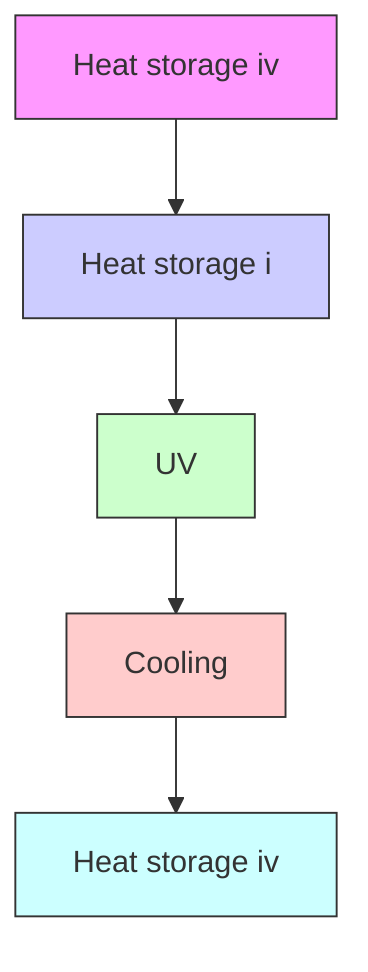
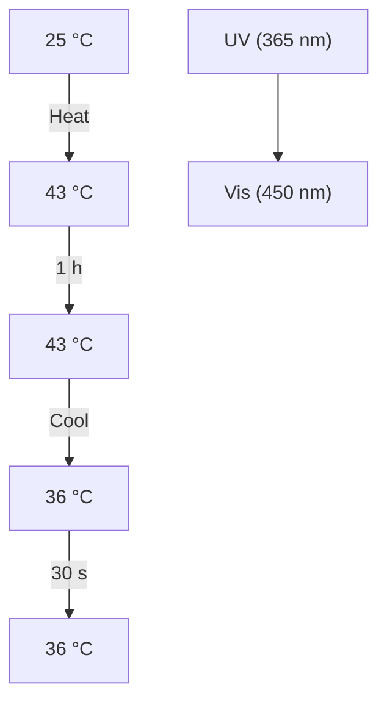
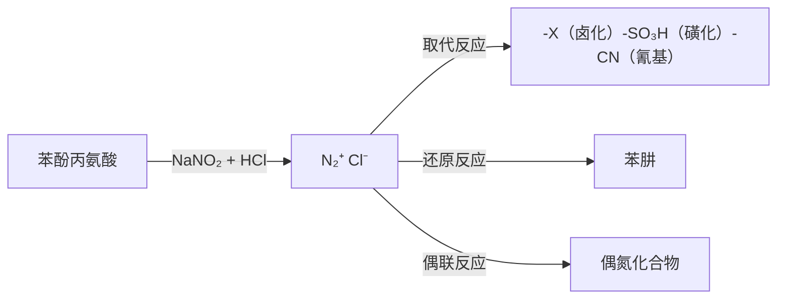

# 有机化学

# Organic Chemistry

# 第十五章：含氮有机化合物

主讲: 王锋

华中科技大学化学与化工学院

School of Chemistry & Chemical Engineering, HUST

## 含氮有机化合物

## 含氮有机化合物

腈类化合物（RCN）

硝基化合物（ $( \mathsf { R N O } _ { 2 } )$

胺类化合物 （ ${ \big [ } { \mathsf { R N H } } _ { 2 }$ $\mathbb { R } \mathbb { N } \mathbb { H } \mathbb { R } ^ { \prime }$ ${ \bf R N R } _ { 2 } ^ { \prime } )$

重氮和偶氮化合物 （ $( R N _ { 3 } R N = N R ^ { \prime } )$ ）

季铵盐和季铵碱

酰胺类化合物

其它（碳酰胺 胍 肼…）

## 硝基化合物

chemical

Molecular orbital diagram showing sp² bonding between nitrogen and oxygen atoms with R and O ligands

chemical

Chemical structure of a quaternary ammonium ion with R group and two oxygen atoms

chemical

Chemical structure of a quaternary ammonium ion with R group and oxygen substituents

$$
\mathrm{RCH} _ {2} \mathrm{NO} _ {2} \xrightarrow {\text { NaOH }} [ \mathrm{RCHNO} _ {2} ] ^ {-} \mathrm{Na} ^ {+} + \mathrm{H} _ {2} \mathrm{O}
$$

两个碳氧键的键长相等，为0.121nm，介于N-O和$\bf N = 0$ 双键之间。

硝基是强吸电子基团，与其相连的α碳原子上的氢显酸性，可与强碱反应生成盐。

## 硝基化合物的化学性质-还原反应

chemical

Chemical reaction equation showing R-NO₂ reacting with anhydrous iodide to form R-NH₂

chemical

Chemical reaction equation showing nitrobenzene reacting with Fe and HCl to form aniline

chemical

Nitration reaction equation of benzene

chemical

Nitration reaction equation of benzene with nitrobenzene under NaSH/CH3OH conditions

## 芳香族硝基化合物的化学性质-还原反应

偶氮苯

氢化偶氮苯

苯胲

亚硝基苯

## 芳香族硝基化合物的化学性质-取代反应

chemical

Bromination reaction of nitrobenzene using bromine and iron in 135–145 °C solvent

chemical

Nitration reaction equation of benzene with nitrobenzene under HNO3 and concentrated sulfuric acid at 95°C

chemical

Nitration reaction equation of benzene with nitrosoxymethyl sulfonate under concentrated sulfuric acid at 110°C

## 芳香族硝基化合物的化学性质-取代反应

氯苯难发生 $S _ { \mathsf { N } } 2$ 反应，但氯苯的邻对位引入硝基后，由于硝基的拉电子作用使与氯原子相连的碳原子电子云密度降低，有利于亲核试剂的进攻，从而容易发生双分子的亲核取代反应。

chemical

Chemical structure of a substituted benzene ring with chlorine, oxygen, and nitro groups

chemical

Chemical structure of a nitro-substituted benzene derivative with hydroxyl and nitro groups

## 胺类化合物

## $\mathsf { R } ^ { - } \mathsf { N H } _ { 2 }$

$$
R = H
$$

R=脂肪烃

R=芳香烃

$$
R = R ^ {\prime} C O -
$$

氨分子

脂肪族胺

芳香族胺

酰胺

chemical

Molecular structure diagram of sp³ with labeled atoms R, N, H and a lone pair

脂肪胺

chemical

Molecular structure diagram showing sp³-sp² hybridization with H-bonding interactions

芳香胺

chemical

Molecular structure diagram showing sp² bond between oxygen and nitrogen with hydrogen atoms and R group

酰胺

## 胺类化合物

${ \mathsf { R N H } } _ { 2 }$

伯胺

一级胺

${ \sf R } _ { 2 } { \sf N H }$

仲胺

二级胺

${ \boldsymbol { \mathrm { R } } } _ { 3 } { \boldsymbol { \mathrm { N } } }$

叔胺

三级胺

$[ R _ { 4 } N ] + X -$

季铵盐

$[ R _ { 4 } N ] + O H =$

季铵碱

## 胺类化合物的命名

## 简单的胺用它们所含的烃基命名

$\mathsf { C H } _ { 3 } \mathsf { N H } _ { 2 }$

甲胺

$( C H _ { 3 } ) _ { 2 } N H$

二甲胺

$( C H _ { 3 } ) _ { 3 } N$

三甲胺

$( \mathsf { C H } _ { 3 } ) _ { 2 } \mathsf { C H N H } _ { 2 }$

异丙胺

chemical

Chemical structure of 2-methylcyclohexane, showing a benzene ring with an amino group attached

环己胺

chemical

Chemical structure of an amino group (NH₂) attached to a benzene ring

苯胺

chemical

Chemical structure of 2-methylphenylmethylbenzene

N,N-二甲苯胺

chemical

Chemical structure of a hydrazone derivative with an amino group attached to a benzene ring

N-乙基-对甲苯胺

$H _ { 2 } N ( C H _ { 2 } ) _ { 6 } N H _ { 2 }$

己二胺

## 胺类化合物的命名

复杂的胺以烃基为母体，氨基作为取代基来命名

$$
\begin{array}{c} (\mathrm{CH} _ {3}) _ {2} \mathrm{CHCH-CH} _ {3} \\ \mathrm{NH} _ {2} \end{array}
$$

2-氨基-3甲基丁烷

$$
(\mathsf {C H} _ {3}) _ {4} \overset {+} {\mathsf {N C l}}
$$

氯化四甲铵

$$
\begin{array}{c} \mathrm {N(C_ {2} H_ {5}) _ {2}} \\ \mathrm {CH_ {3} CH_ {2} CH - \overset {\cdot} {C} HCH_ {3}} \\ \overset {\cdot} {C} H _ {3} \end{array}
$$

2-(N,N-二乙氨基)-3甲基戊烷

$$
[ (\mathbf {C H} _ {3}) _ {3} \overset {+} {\mathrm{NC}} _ {2} \mathrm{H} _ {5} ] \mathrm{OH} ^ {-}
$$

氢氧化三甲乙铵

## 胺的碱性

$$
\mathrm{RNH} _ {2} + \mathrm{H} _ {2} \mathrm{O} \rightleftharpoons \stackrel {+} {\mathrm{RNH}} _ {3} + \mathrm{OH} ^ {-}
$$

$$
K _ {b} = \frac {[ R N H _ {3} ^ {+} ] [ O H ^ {-} ]}{[ R N H _ {2} ]}
$$

$$
\mathsf {p K} _ {\mathsf {b}} = - \log \mathsf {K} _ {\mathsf {b}}
$$

${ \mathsf { p K } } _ { \mathsf { b } }$ 值越小，表示胺的碱性越强

## 胺的碱性

对于脂肪胺来说，随着氮原子上烷基的增多，氮原子上的电子云密度增加，碱性增强。在非水溶剂中，碱性的大小顺序通常是：

叔胺>仲胺>伯胺>氨 （非水溶剂中）

$$
\mathrm{CH} _ {3} \mathrm{CH} _ {2} \mathrm{NH} _ {2} \quad (\mathrm{CH} _ {3} \mathrm{CH} _ {2}) _ {2} \mathrm{NH} \quad (\mathrm{CH} _ {3} \mathrm{CH} _ {2}) _ {3} \mathrm{N} \quad \mathrm{NH} _ {3}
$$

水中的 ${ \mathsf { p K } } _ { \mathsf { b } }$ 值：

3.36

3.05

3.25

4.79

胺的碱性是三个因素的综合结果：

• 烃基的电子效应  
• 溶剂化效应  
• 空间效应（位阻）

## 胺的碱性

• 胺的氮上的氢越多，则与水形成的氢键越多，溶剂化程度越高，那么铵正离子就越稳定，相应的胺的碱性越强。  
• 从诱导效应看，胺的碱性：三级>二级>一级  
• 从溶剂化效应看，胺的碱性：一级>二级>三级  
• 同时考虑位阻效应后，低级胺在水中的碱性大小：

季铵碱 > 仲胺 > 伯胺、叔胺 > 氨 >> 苯胺

## 芳香胺的碱性

chemical

Chemical structure of 2-methyl-1,4-nitrophenylamine

${ \mathsf { p K } } _ { \mathsf { b } }$

9.4

chemical

Chemical structure of a diamine compound with two benzene rings connected by an NH group

13.8

chemical

Chemical structure of a triphenylamine derivative with two phenyl groups attached to a central nitrogen

中性

chemical

Chemical structure of 2-methylphenylamine, showing amino and hydroxyl groups

${ \mathsf { p K } } _ { \mathsf { b } }$

8.5

chemical

Chemical structure of 2-methyl-1,3-dimethyl-4-methylaniline

8.9

chemical

Chemical structure of an amino group (NH₂) attached to a benzene ring

9.4

chemical

Chemical structure of 2-chloro-4-methylphenylamine, showing benzene ring with NH₂ and chlorine substituents

10.0

chemical

Chemical structure of a nitro-substituted benzene ring with NH₂ and NO₂ substituents

13.0

含氮化合物的碱性：季铵碱> 脂肪胺>氨>芳香胺>酰胺

## 烷基化反应

脂肪胺氮原子上的孤对电子可以与缺电子的试剂反应，脂肪胺是中性亲核试剂

## 烷基化反应

芳香胺可与伯卤代烷、硫酸二甲酯、磺酸酯等烷基化试剂反应，使胺基烷基化。

chemical

Chemical reaction equation showing the conversion of aniline to a benzylamine using sodium hydroxide and sulfuric acid

## 酰化反应

flowchart

酰胺在酸或碱催化下能水解为胺，因此可用先后反应来保护胺基，以免被氧化剂破坏。

chemical

Chemical structure of an amino group (NH₂) attached to a benzene ring

chemical

Chemical structure of 2-nitrobenzene showing amino and nitro groups on benzene ring

## 酰化反应-兴斯堡反应

伯胺、仲胺能与磺酰化试剂反应生成难溶于水的本磺酰胺。

• 伯胺生成的苯磺酰胺可与NaOH溶液反应生成溶于水的盐  
• 仲胺生成的苯磺酰胺不能与NaOH溶液反应溶解，仍为沉淀  
• 叔胺不能发生磺酰化反应，但叔胺本身的碱性可以溶于强酸用以上方法可鉴别三类胺，称为兴斯堡反应。

chemical

Chemical reaction equation showing sulfonation of benzene with ammonium salt, followed by hydrolysis to sodium salt

溶于NaOH溶液

chemical

Chemical reaction equation showing sulfonation of benzene with R₂NH to form a sulfonamide derivative

不溶于NaOH溶液

## 酰化反应

本磺酰胺水解后可得到原来的胺：

chemical

Chemical reaction equation showing sulfonation of aniline to form a sulfonamide and sulfonamide

## 伯胺与亚硝酸反应

chemical

化学反应生成重氮盐的化学方程式，涉及R-N≡N-Cl和R+离子的化学反应步骤

chemical

氯化重氮苯的化学反应方程式，涉及硝酸甲烷和氯化氢氧的化学反应

## 仲胺与亚硝酸反应

仲胺与亚硝酸反应生成N-亚硝基胺（黄色油状或固体）

$$
\mathrm{R} _ {2} \mathrm{NH} + \mathrm{NaNO} _ {2} \xrightarrow {\mathrm{H} ^ {+}} \mathrm{R} _ {2} \mathrm{N} - \mathrm{N} = \mathrm{O} + \mathrm{H} _ {2} \mathrm{O}
$$

$$
\mathrm{NHR} \xrightarrow {\mathrm{NaNO} _ {2} + \mathrm{HCl}} \mathrm{N-亚硝基苯胺} + \mathrm{NaCl} + \mathrm{H} _ {2} \mathrm{O}
$$

## 叔胺与亚硝酸反应

脂肪叔胺与亚硝酸反应是酸碱反应，生成不稳定的亚硝酸盐。芳香叔胺与亚硝酸反应可发生芳环上的亲电取代，引入亚硝基。

chemical

Chemical reaction equation showing nucleophilic addition of HNO₂ to an amine and hydroxide ion

chemical

Chemical reaction equation showing conversion of a benzylamine derivative to an enone using HNO₂

chemical

Chemical reaction showing conversion of a benzene derivative to a nitro-substituted benzene derivative using HNO₂

chemical

Chemical reaction showing protonation of an enamine to form hydroxyl radical

chemical

Chemical structure of a diazo compound with hydroxyl and chloride counterions

## 氧化反应

胺容易被氧化，脂肪伯胺被氧化后产物复杂，无合成价值；脂肪仲胺可用过氧化物氧化为羟胺，但产率低。叔胺可用过氧化氢或过氧乙酸氧化成氧化叔胺。

$$
\mathrm{R} _ {3} \mathrm{N} \xrightarrow {\mathrm{H} _ {2} \mathrm{O} _ {2} \text {or CH} _ {3} \mathrm{COOOH}} \mathrm{R} _ {3} \stackrel {+} {\mathrm{N}} - \mathrm{O} ^ {-} + \mathrm{H} _ {2} \mathrm{O}
$$

$$
\mathrm{NH} _ {2} \xrightarrow {\mathrm{MnO} _ {2} \mathrm{H} _ {2} \mathrm{SO} _ {4}} \mathrm{C} _ {6} \mathrm{H} _ {5}
$$

## 芳胺环上的亲电取代反应-卤化

chemical

Bromination reaction of aniline with 3Br₂ to form a brominated product, followed by hydrogenation to yield 3HBr

白色固体可用于鉴别苯胺

需要一元取代的溴代苯胺，需先将胺基做成酰胺基团：

chemical

Chemical structure of aniline, showing a benzene ring with an amino group attached to the nitrogen.

chemical

Chemical structure of 2-bromobenzene, showing amino and bromine substituents on benzene ring

## 芳胺环上的亲电取代反应-硝化

chemical

Chemical reaction pathway showing the synthesis of a nitro-substituted benzene derivative from aniline and acetone under acidic conditions

邻对位引入

chemical

Chemical structure of a nitro-substituted benzene ring with NH2 and NO2 substituents

间位引入

## 芳胺环上的亲电取代反应-磺化

chemical

化学反应方程式，展示丙氨酸与硝酸钠的生成及中间产物的转化过程

## 重氮和偶氮化合物

重氮正离子 $\left( - \mathsf { N } _ { 2 } { } ^ { + } \right)$ ）是线性结构，氮原子为sp杂化轨道成键。重氮盐是无色晶体，干燥情况下易发生爆炸。重氮盐易溶于水而难溶于有机溶剂。芳香族重氮盐比脂肪族稳定。因芳环可分散正电荷。

chemical

Chemical equilibrium reaction showing the formation of a diazonium complex from benzene and nitrogen atoms

## 重氮基的取代反应

重氮盐在酸性条件下不稳定，会缓慢水解生成酚并释放出氮气，这是一个芳香亲核取代反应。通过胺基在苯环上引入羟基的方法。芳环上有强吸电子和给电子基，均使反应变慢。

## 重氮基的取代反应-桑德迈尔反应

芳香族重氮盐的酸性溶液分别与CuCl、CuBr、CuCN等共热，重氮基可被Cl、Br、CN取代，该反应称为桑德迈尔（Sandmeyer）反应。

## 重氮基的取代反应

chemical

Two-step organic reaction scheme involving naphthalene and iodophenol under KI and HBF4 conditions to produce fluorinated benzene and naphthyl groups

希曼（Schiemann）反应

## 重氮基的取代反应

chemical

Chemical reaction equation showing diazotization of aniline with potassium counterion under basic conditions

chemical

Chemical structure of a brominated benzene ring with three bromine substituents

chemical

Chemical structure of a brominated benzene ring with three bromine substituents

## 重氮基的还原反应

重氮盐可以被亚硫酸钠、亚硫酸氢钠等还原为苯肼的盐，用碱处理后得到苯肼。用更强的还原剂可得到苯胺。

chemical

Chemical reaction pathway showing diazotization of aniline using sodium sulfate and acid chloride, followed by hydrolysis to yield benzoquinone

## 重氮基的偶联反应

在一定条件下，重氮盐与芳胺、酚等富电子芳烃作用，生成偶氮化合物，称为偶联反应。重氮盐与酚偶联在弱碱性条件下进行，般发生在酚羟基的对位，如对位有取代基，则在邻位取代。

chemical

Chemical reaction equation showing diazotization of aniline with hydroxyl group under NaOH/H2O conditions

重氮组分

偶合组分

亲电取代反应，重氮盐是亲电试剂。重氮盐芳环上连有吸电子基团有利于反应进行。

## 重氮基的偶联反应

chemical

Chemical reaction equation showing the synthesis of a naphthalene derivative from aniline and phenol under NaOH/H2O conditions

重氮盐与芳胺或酚的偶合，由于重氮基的体积较大，一般发生在酚羟基或胺基的对位，如对位被占据，则发生在邻位。

## 重氮基的偶联反应

chemical

化学反应方程式，展示两个不同位置的结构式，标注了4位和1位方向

chemical

Chemical structure of a naphthalene derivative with two sulfonic acid groups and one hydroxyl group

chemical

Chemical reaction equation showing diazotization of a chlorinated aromatic amine with sodium hydroxide to form a bisphenol derivative

迎春红（染料）

## 重氮基的偶联反应

重氮盐与三级芳胺的偶合反应一般在弱酸性或中性条件下进行。

chemical

Chemical reaction equation showing diazotization of aniline derivative with dimethylamine under HOAc conditions

对-N,N-二甲氨基偶氮苯

## 偶氮化合物

偶氮化合物分子中含有（-N=N-）单元，两个氮原子分别与烃基以共价键相连。

chemical

Chemical structure of a symmetric azo compound with two benzene rings connected by an N=N bond

chemical

Chemical structure of a diazo compound with dimethylamino and sulfonic acid groups

甲基橙

chemical

Chemical structure of a diazo compound with dimethylamino and hydroxycarbonyl substituents

甲基红

chemical

Chemical structure of a naphthalene derivative with nitro and hydroxyl substituents, labeled '对位红' (nitration red)

chemical

Chemical structure of 苏丹红 III, a biphenyl derivative with phenyl and hydroxyl substituents

## 偶氮化合物

chemical

Chemical structure of a bisphenol derivative with dimethylamino and sulfonic acid groups

text_image

pH < 3.1
pH > 4.4

natural_image

Pile of red powdery substance on white background (no text or symbols)

甲基橙Methyl orange酸碱指示剂

## 偶氮化合物

natural_image

Two KNOOD-style coffee cups and fried chicken wings on a red background (no text or symbols visible)

text_image

工社田
苏丹红
K
食品

chemical

Chemical structure of a bisphenol derivative with hydroxyl group and N=N substituent

苏丹 I

Sudan I

工业染料,非食品添加剂

natural_image

Pile of red powdered substance on white background (no text or symbols visible)

## 偶氮化合物

chemical

Chemical structure of a bisphenylamine derivative with two benzene rings and a nitrogen bridge

chemical

Chemical structure of a diphenyl group with nitrogen atoms labeled N=N

顺式偶氮苯 cis-azobenzene  
可见光紫外光

chemical

Chemical structure of a diazo compound with two benzene rings connected by a nitrogen bridge

反式偶氮苯 trans-azobenzene

## 偶氮化合物

text_image

nature
COMMUNICATIONS

ARTICLE

DOI:10.1038/s41467-017-01608-y

Optically-controlled long-term storage and release of thermal energy in phase-change materials

Grace G.D.Hanl, Huashan Li@1&Jeffey C.Grossman

flowchart

chemical

Chemical structures of Trans-Azo and cis-Azo compounds with labeled functional groups

反式偶氮苯 trans-azobenzene  
顺式偶氮苯 cis-azobenzene

flowchart

## 芳香族重氮盐

flowchart

## 季铵盐和季铵碱

季铵盐通常由叔胺和卤代烷进行加热反应制备。季铵盐是阳离子型表面活性剂，用作杀菌剂、乳化剂、染色剂等。

$$
\left(\mathrm{CH} _ {3}\right) _ {3} \mathrm{N} + \mathrm{n-C} _ {1 6} \mathrm{H} _ {3 3} \mathrm{Br} \xrightarrow [ \text {加热} ]{} \mathrm{n-C} _ {1 6} \mathrm{H} _ {3 3} \stackrel {+} {\mathrm{N}} (\mathrm{CH} _ {3}) _ {3} \stackrel {-} {\mathrm{Br}}
$$

季铵盐与强碱作用形成季铵碱与季铵盐的平衡：

$$
\mathrm{R} _ {4} ^ {+ -} \mathrm{NX} + \mathrm{KOH} \rightleftharpoons \mathrm{R} _ {4} ^ {+ -} \mathrm{NOH} + \mathrm{KX}
$$

生成季铵碱的反应在醇中进行由于KX沉淀，可使反应进行完全。

## 霍夫曼消除

季铵碱是强碱，加热易分解：

$$
\left(\mathrm{CH} _ {3}\right) _ {4} \stackrel {+ -} {\mathrm{NOH}} \xrightarrow [ \text {加热} ]{\mathrm{S} _ {\mathrm{N}} 2} \left(\mathrm{CH} _ {3}\right) _ {3} \mathrm{N} + \mathrm{CH} _ {3} \mathrm{OH}
$$

如果将具有烷基β-H的季铵碱加热分解，则生成烯烃和叔胺，这个反应称为霍夫曼消除。霍夫曼消除大多按E2机理进行。消除反应的方向取决于β氢的酸性，酸性强的氢易被碱进攻消去。当消除反应有生成多个烯烃的选择时，主要生成双键上烷基最少的烯烃——霍夫曼规则（区别于扎依采夫规则）

$$
\mathrm{OH} ^ {-} + \mathrm{H} - \mathrm{C} - \mathrm{C} - \mathrm{NR} _ {3} \longrightarrow \mathrm{C} = \mathrm{C} + \mathrm{R} _ {3} \mathrm{N} + \mathrm{H} _ {2} \mathrm{O}
$$

## 霍夫曼消除

chemical

Chemical reaction equation showing nucleophilic addition of hydroxide to aniline, yielding 5% and 95% products

当β碳上有苯基、乙烯基、羰基等不饱和基团时，由于共轭效应使β氢的酸性增强，因而这个氢原子更容易被消去。

chemical

化学反应方程式，展示苯甲酸与乙酰丙基取代的主产物生成CH₂=CH₂

## 霍夫曼消除

chemical

化学反应示意图，展示 Hofmann 消除与 Zaitsev 消除的两个过程及其生成的产物

• 四级铵碱的E2消除  
碱进攻β碳上烷基取代基较少的H（H多的β碳）  
酸性强，反应速度快，动力学控制

• 卤代烷的E2消除  
碱进攻β碳上烷基取代基较多的H（H少的β碳）  
酸性弱，产物稳定，热力学控制

## 酰胺氮上氢原子的反应-霍夫曼降解反应

酰胺与溴或氯在碱性水溶液中反应，生成比原料少一个碳原子的伯胺，该反应称为霍夫曼降解反应，在反应过程中发生了重排，又称霍夫曼重排反应。

$$
\begin{array}{l} \mathrm {RCONH_ {2}} + \mathrm {Br_ {2}} + 4 \mathrm{NaOH} \longrightarrow \mathrm {RNH_ {2}} + 2 \mathrm{NaBr} + \mathrm {Na_ {2} CO_ {3}} + 2 \mathrm {H_ {2} O} \\ \mathrm {RCONH_ {2}} + \mathrm{NaOX} + 2 \mathrm{NaOH} \longrightarrow \mathrm {RNH_ {2}} + \mathrm{NaX} + \mathrm {Na_ {2} CO_ {3}} + \mathrm {H_ {2} O} \end{array}
$$

## 酰胺氮上氢原子的反应-霍夫曼降解反应

chemical

Chemical reaction showing conversion of CONH₂ to NH₂ using NaOX and NaOH

chemical

Chemical reaction showing conversion of a phenyl alcohol with CONH₂ to an amino group under NaOX and NaOH conditions

chemical

Chemical reaction showing conversion of a benzyl compound with CONH₂ to aniline using NaOX and NaOH

chemical

Chemical reaction showing conversion of a ketone to an amino group using NaOX and NaOH

构型保持

## 本章作业

15-1 （1）（2）（3）

15-2

15-5 请写出实验现象

15-6

15-9

## 比较下列化合物的碱性

chemical

Chemical structures of amino acids including amine, benzylamine, and nitroaniline derivatives with labeled positions A–E

$\begin{array} { r l r l r l r l r } { \mathsf { E } } & { { } > } & { \mathsf { B } } & { { } > } & { \mathsf { A } } & { { } > } & { \mathsf { C } } & { { } > } & { \mathsf { D } } \end{array}$

## 完成下列反应

CH3CH2CH2Br CH3CH2CH2CH2NH2

COOH NH2

## 推断下列化合物结构

有一个化合物A的分子式为 $\mathsf { C } _ { 7 } \mathsf { H } _ { 1 5 } \mathsf { N }$ ，与 $2 \mathsf { m o l } \mathsf { C } \mathsf { H } _ { 3 } \mathsf { I }$ 作用形成季铵盐，后用AgOH处理得季铵碱，加热得到分子式为 ${ \sf C } _ { 9 } { \sf H } _ { 1 9 } { \sf N }$ 的化合物B，B分别与 $1 \mathsf { m o l } \mathsf { C } \mathsf { H } _ { 3 } |$ 和AgOH作用，加热得到分子式为 $\mathsf { C } _ { 7 } \mathsf { H } _ { 1 2 }$ 的化合物C和 ${ \sf N } ( { \sf C H } _ { 3 } ) _ { 3 }$ ，C用 ${ \mathsf { K M n O } } _ { 4 }$ 氧化可得到化合物D，D的结构式为$( { \mathsf { C H } } _ { 3 } ) _ { 3 } { \mathsf { C } } ( { \mathsf { C O O H } } ) _ { 2 }$ ，请推断A-D的结构式并写出相应的反应。

chemical

Chemical reaction pathway showing iodination and subsequent oxidation of a chiral amine compound, involving intermediates A, B, C, and D.

