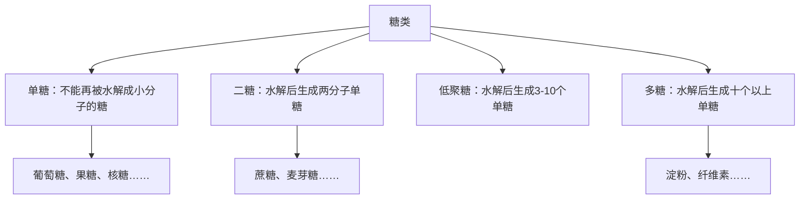
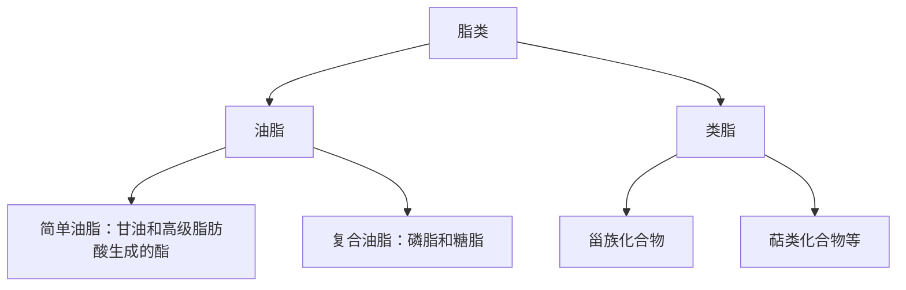
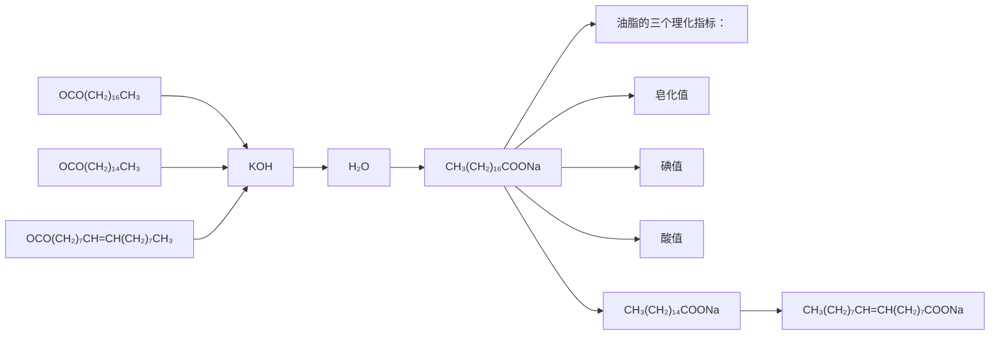
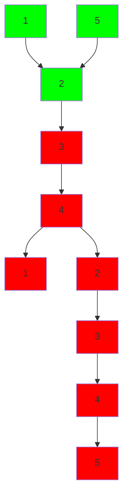

# 有机化学

# Organic Chemistry

# 第十七章：糖类与脂类化合物

主讲: 王锋

华中科技大学化学与化工学院

School of Chemistry & Chemical Engineering, HUST

## 糖类化合物

## Photosynthesis

Intheprocess of photosynthesis,plants convert radiantenergyfromthesunintochemicalenergy intheform of glucose(or sugar).

$$
\begin{array}{l} \text {water + carbon dioxide + sunlight \longrightarrow glucose + oxygen} \\ 6 \mathrm{H} _ {2} \mathrm{O+6CO} _ {2} + \text {radiant energy \longrightarrow C} _ {6} \mathrm{H} _ {1 2} \mathrm{O} _ {6} + 6 \mathrm{O} _ {2} \end{array}
$$

text_image

RADIANT ENERGY
OXYGEN
WATER
GLUCOSE
CARBON DIOXIDE

text_image

RADIANT ENERGY
CARBON DIOXIDE
OXYGEN
WATER

糖类：地球上最丰富的有机化合物，生物量干重的50%以上由葡萄糖的多聚体构成。

## 糖类化合物

糖类又称碳水化合物，是多羟基醛、酮或多羟基醛、酮的脱水聚合物。

flowchart

## 单糖

单糖根据分子中含有醛基或酮基分别称为醛糖或酮糖；又可根据分子中碳的数目多少称为丙糖、丁糖、戊糖、己糖…；根据构型分为D型糖和L型糖。最常见的单糖含有五个或六个碳原子。

chemical

Chemical structure of a carbohydrate molecule with CHO, OH, and CH2OH groups

D-甘油醛 丙醛糖

chemical

Chemical structure of a carbohydrate molecule with CHO, OH, and CH2OH groups

D-核糖 戊醛糖

chemical

Chemical structure of a carbohydrate molecule with CHO, OH, and CH2OH groups labeled on the carbon chain

D-葡萄糖己醛糖

chemical

Chemical structure of a dicarboxylic acid with hydroxyl and carbonyl groups

D-果糖 已酮糖

费歇尔投影式：糖中的羰基必须写在投影式上端，碳原子的编号从靠近羰基的一端开始。单糖的构型是根据结构式中位号最大的一个手性碳原子的构型与甘油醛比较而得到的，-OH在右为D型糖。

## 葡萄糖的变旋现象

chemical

Structural formula of a carbohydrate molecule showing CHO, OH, and CH2OH groups with hydroxyl groups

？

• 从乙醇中结晶，熔点为 $1 4 6 ^ { \circ } C$ ，比旋光度为 $+ 1 1 2 . 2 ^ { \circ }$  
• 从吡啶中结晶，熔点为 $1 5 0 ^ { \circ } C$ ，比旋光度为 $+ 1 8 . 7 ^ { \circ }$  
• 两种晶体在水中溶解，比旋光度最终为 $+ 5 2 . 7 ^ { \circ }$

• 难与 $N a H S O _ { 3 }$ 发生加成  
• 只与一分子醇发生反应生成稳定的缩醛  
IR鉴定没有明显的羰基吸收峰

## 葡萄糖的变旋现象

chemical

Structural formula of a carbohydrate molecule with CHO, OH, and CH2OH groups

D-葡萄糖

0.01%

## 互为非对映异构体

新形成的半缩醛羟基与C5上的羟基处于费歇尔投影式同侧，为α型；反之为β型。产生变旋现象的原因：α型和β型葡萄糖溶于水后，可通过开链式结构互变，最后达到α型、β型、开链式三种结构的平衡，平衡混合物的比旋光度为+52.7°

## 哈瓦斯透视式

$- \mathrm { C H } _ { 2 } \mathrm { O H }$ 端向纸面后弯曲

chemical

Structural formula of a carbohydrate molecule with CHO, OH, and CH2OH groups

chemical

Chemical structure of a carbohydrate molecule with hydroxyl, carboxyl, and hydroxyl groups

chemical

Chemical structure of a carbohydrate molecule with hydroxyl groups and a CHO group

右倒水平放置

chemical

Chemical structure of a cyclic carbohydrate with hydroxyl groups and CHO group, showing stereochemistry indicated by double-headed arrow

chemical

Chemical structure of a five-membered sugar with hydroxyl groups at positions 5 and 1, and methyl groups at the vertices.

chemical

Chemical structure of a five-membered sugar with hydroxyl groups and numbered carbon positions

chemical

Chemical structure of a carbohydrate molecule with multiple hydroxyl groups and a cyclic ether linkage

36%

chemical

Chemical structure of a carbohydrate molecule with multiple hydroxyl groups and a cyclic ether linkage

64%

α-D-吡喃葡萄糖

β-D-吡喃葡萄糖

C-1上的羟基与C-5上的羟甲基在环异侧，α型；反之，β型。β-型为稳定构象。

## 果糖的变旋现象

chemical

Chemical structure of a five-membered sugar with hydroxyl and methyl substituents

α-D- 吡喃果糖

chemical

Chemical structure of a five-membered sugar with hydroxyl and methyl groups

β-D-吡喃果糖

natural_image

Two parallel diagonal arrows pointing in opposite directions (no text or symbols)

chemical

Chemical structure of a dicarboxylic acid with hydroxyl and carbonyl groups

natural_image

Pure diagram of two arrows pointing in opposite directions against a vertical yellow background (no text or symbols)

chemical

Chemical structure of a sugar molecule with multiple hydroxyl groups and a central carbon backbone

α-D-呋喃果糖

chemical

Chemical structure of a sugar molecule with multiple hydroxyl groups and a central carbon backbone

β-D-呋喃果糖

天然的D-果糖主要以五元环呋喃型结构存在。

## 单糖的化学性质-糖苷的生成

醛可以与两分子醇在酸作用下形成缩醛，但糖只能与一分子醇形成缩醛，称为糖苷。这是因为糖的醛基与分子内的一个羟基已形成环状半缩醛结构。

糖苷是一种缩醛或缩酮，在碱中稳定，在稀酸中水解又产生糖。

chemical

葡萄糖甲苷合成反应方程式，涉及苷羟基与无水HCl的化学关系

能与醇、酚、-SH、-NH2脱水，形成缩醛型结构。

形成糖苷后，无变旋现象，碱性条件下稳定，在烯酸、酶的条件下可水解为原来的糖和醇。

## 单糖的化学性质-氧化反应

chemical

Structural formula of a carbohydrate molecule with CHO, OH, and CH2OH groups

chemical

Chemical reaction equation showing Ag(NH₃)₂OH reacting with 托伦试剂

chemical

Chemical structure of a carboxylic acid with hydroxyl groups and methyl substituents

chemical

Structural formula of a carbohydrate molecule with CHO, OH, and CH2OH groups

chemical

Chemical reaction equation showing Cu(OH)₂ reacting with 班乃德或菲林试剂

chemical

Chemical structure of a carboxylic acid with hydroxyl groups and methyl substituents

## 单糖的化学性质-氧化反应

酮糖能在弱碱条件下异构化为醛糖，因此也能被弱氧化剂氧化。

D-果糖

烯二醇

D-甘露糖

差向异构体

D-葡萄糖

差向异构体：含有多个手性碳原子的旋光异构体中，若只有一个手性碳原子的构型不同，其它的构型完全相同，这样的旋光异构体被称为差向异构体。

## 单糖的化学性质-氧化反应

凡是能被托伦试剂、班乃德试剂、斐林试剂氧化的糖称为还原糖，反之称为非还原糖。所有的单糖，无论醛糖，还是酮糖，都是还原糖。

## 单糖的化学性质-氧化反应

chemical

Chemical reaction showing conversion of a carbohydrate to a glycerol with D-glucopyranose, using Br₂ and H₂O as reagents

酮糖不被溴水氧化，以此区别醛糖和酮糖

chemical

Chemical reaction showing conversion of a carbohydrate to a glycerol using dilute HNO3 at 100°C, with D-glucopyranose as the final product.

酮糖在烯 ${ \mathsf { H N O } } _ { 3 }$ 下发生断链

chemical

D-葡萄糖醛酸分子结构式，展示从CHO和HO键键生成D-葡萄糖醛酸的酶反应过程

## 单糖的化学性质-还原反应

chemical

Structural formula of a carbohydrate molecule with CHO, OH, and CH2OH groups

chemical

Chemical reaction condition label showing H₂, lanium niol with heating step

chemical

Structural formula of a branched hydrocarbon molecule with multiple hydroxyl groups and methyl substituents

L-山梨糖醇

## 单糖的化学性质-成脎反应

chemical

Chemical structure of a carbohydrate molecule showing CHO, OH, and CH2OH groups with hydroxyl groups

D-葡萄糖

chemical

Chemical structure of a carbohydrate molecule with CHO, HO, H, OH, and CH2OH groups

D-甘露糖

chemical

Structural formula of a branched hydrocarbon molecule with hydroxyl groups and carbonyl groups

D-果糖

## 单糖的化学性质-脱水反应

在弱酸条件下，β-羟基的羰基化合物易发生β-羟基与α-氢的脱水反应，生成 $\alpha , \beta \cdot$ -不饱和羰基化合物。糖类化合物有上述结构，可在酸性条件下脱水生成二羰基化合物。

## 单糖的化学性质-成酯和成醚反应

## 单糖的化学性质-成酯和成醚反应

## 成酯反应

$$
5 (\mathrm{CH} _ {3} \mathrm{CO}) _ {2} \mathrm{O}
$$

## 成醚反应

  
糖苷

## 单糖的化学性质-显色反应

## 莫力许反应：

糖的水溶液中加入α-萘酚的乙醇溶液，再沿管壁小心加入浓硫酸，在两层液面间形成紫色环。所有糖均反应，鉴别糖的常用方法。

## 西列凡诺夫反应：

酮糖在浓HCl存在下与间苯二酚反应生成红色物质；醛糖同样条件下两分钟内不显色，用于鉴别酮糖和醛糖。

皮阿耳反应：戊糖在浓HCl下与5-甲基间苯酚反应，生成绿色物质，用于鉴别戊糖和己糖。

狄斯克反应：脱氧核糖在乙酸和硫酸混合液中与二苯胺共热，生成蓝色物质，鉴别脱氧核糖和其它糖。

## 双糖

双糖广泛存在于自然界，是由两个糖单元构成的，是一个糖分子中的半缩醛羟基和另一个单糖分子中的羟基失水得到的糖；两个单糖可以相同，也可以不同。

脱水形式：

(I) 两个单糖分子都以苷羟基脱水（非还原糖，无变旋现象）  
(II) 一个糖分子贡献苷羟基，另一个糖分子贡献醇羟基（还原糖，有变旋现象）

## 典型双糖：

还原糖：麦芽糖、纤维二糖、乳糖 非还原糖：蔗糖

chemical

α-1,4苷键分子结构示意图，标注了多个HO、OH和HOH₂C等碳原子位置

麦芽糖

$$
\mathbf {C} _ {1 2} \mathbf {H} _ {2 2} \mathbf {O} _ {1 1}
$$

麦芽糖酸水解得两分子D-葡萄糖  
• 还原糖，有变旋现象，能被托伦、斐林试剂氧化

chemical

β-1,4苷键分子结构示意图，标注了多个HO、OH、C等碳原子位置

纤维二糖

$$
\mathsf {C} _ {1 2} \mathsf {H} _ {2 2} \mathsf {O} _ {1 1}
$$

水解得两分子葡萄糖  
还原糖，有变旋现象，能被托伦、斐林试剂氧化

chemical

β-1,4苷键分子结构示意图，显示其通过脂肪链和侧链连接形成二元环结构

乳糖

$$
\mathsf {C} _ {1 2} \mathsf {H} _ {2 2} \mathsf {O} _ {1 1}
$$

• 水解得一分子半乳糖和一分子葡萄糖  
还原糖，有变旋现象

chemical

Chemical structure of a polysaccharide with multiple hydroxyl groups and a cyclic sugar moiety

蔗糖

$$
\mathsf {C} _ {1 2} \mathsf {H} _ {2 2} \mathsf {O} _ {1 1}
$$

• 水解得一分子葡萄糖和一分子果糖  
非还原糖，无变旋现象

## 多糖

多个单糖或单糖的衍生物通过α-或β-苷键连接起来的高分子化合物称为多糖。多糖是食物的主要成分，广泛存在于自然界。

均多糖：水解产物只有一种单糖（淀粉、纤维素、糖元）

杂多糖：水解产物为一种以上的单糖或单糖衍生物（半纤维素、果胶质、黏多糖）

多糖没有变旋现象，不是还原糖，也不能形成糖脎。

## 淀粉

chemical

Chemical structure of a three-carbon glycoside with hydroxyl groups and a 300–600 distance label

直链淀粉：遇碘变蓝色

α-1,4-苷键连接成直链

chemical

Chemical structure of a polysaccharide with multiple glucose units and hydroxyl groups

支链淀粉：遇碘变紫色

α-1,4-苷键连接成直链 α-1,6-苷键连接成支链

## 纤维素

chemical

Chemical structure of a polysaccharide repeating unit with multiple glucose units linked by glycerol backbone

纤维素

以β-1,4-苷键连接

不溶于水和有机溶剂

## 脂类化合物

## 脂类化合物

flowchart

## 油脂

油脂是油和脂肪的总称，是由三分子高级脂肪酸和甘油形成甘油三酯。在室温下呈液态的称为油（菜油、蓖麻油）；呈半固态或固态的称为脂肪（猪油、牛油等）。油脂不溶于水，易溶于有机溶剂。

<table><tr><td>饱和脂肪酸 $CH_3(CH_2)_{10}COOH$ 月桂酸</td><td> $CH_3(CH_2)_{12}COOH$ 肉豆蔻</td><td> $CH_3(CH_2)_{14}COOH$ 棕榈酸(软脂酸)</td><td> $CH_3(CH_2)_{16}COOH$ 硬脂酸</td></tr></table>

<table><tr><td>不饱和脂肪酸</td><td></td></tr><tr><td> $CH_3(CH_2)_5CH=CH(CH_2)_7COOH$ </td><td> $CH_3(CH_2)_7CH=CH(CH_2)_7COOH$ </td></tr><tr><td>棕榈油酸</td><td>油酸</td></tr></table>

chemical

双链式单甘油酯与混甘油酯的分子结构式及其组成

三硬脂酰甘油

α-硬脂酰-β-软脂酰-α’-油酰甘油

## 油脂的水解和皂化

油脂在碱性水溶液中的水解称为皂化。1g油脂完全皂化所需的KOH的质量称为皂化值。

flowchart

油脂的硬化：天然油脂中不饱和键催化加氢变为饱和键，这个过程称为油脂的硬化；得到的油脂称为氢化油。

碘值：100g油脂所吸收碘的质量；碘值越大，说明油脂的不饱和程度越高。

酸值：中和1g油脂中的游离脂肪酸所需的KOH的质量称为油脂的酸酯。

## 甾族和萜类化合物

## 甾族化合物

chemical

Molecular structure of a steroid compound with hydroxyl and alkene functional groups

胆固醇  
cholesterol

chemical

Molecular structure of a steroid compound with ketone and hydroxyl functional groups

睾丸酮激素

雄性激素  
testosterone  

natural_image

Male gender symbol icon on blue background (no text or numbers)

chemical

Molecular structure of a steroid derivative with carboxylic acid group and methyl substituent

黄体酮激素

雌性激素  
progesterone  

natural_image

Female gender symbol on pink background (no text or labels)

## 甾族化合物

chemical

Diagram of a fused ring system with labeled positions A, B, C, and D

环戊烷并氢化菲

radar chart

| Position | Label |
|---|---|
| 1 | 1 |
| 2 | 2 |
| 3 | 3 |
| 4 | 4 |
| 5 | 5 |
| 6 | 6 |
| 7 | 7 |
| 8 | 8 |
| 9 | 9 |
| 10 | 10 |
| 11 | 11 |
| 12 | 12 |
| 13 | 13 |
| 14 | 14 |
| 15 | 15 |
| 16 | 16 |
| 17 | 17 |
R (right end) |

甾体化合物基本骨架

C10, C13位连有角甲基C17位连有较长的碳链或取代基

## 萜类化合物

flowchart

䓝烷

chemical

Chemical structure of a hydroxyl-substituted cyclohexane derivative with stereochemistry indicated

薄荷醇

萜类化合物在结构上有一个共同点：可以看做是两个或两个以上的异戊二烯分子以头尾相连的方式结合。根据分子中异戊二烯单元（5个碳）的数目可分为半萜（5个碳，1个异戊二烯单元）、单萜（10个碳、2个异戊二烯单元）、倍半萜（15个碳、3个异戊二烯单元）、二萜（20个碳、4个异戊二烯单元）等等。

## 本章作业

17-7

17-8

## 名词解释：

变旋现象、苷羟基、糖苷、糖脎、还原糖、皂化、皂化值、碘值、酸值