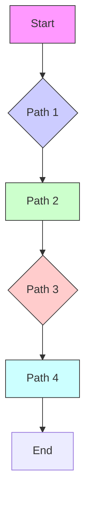
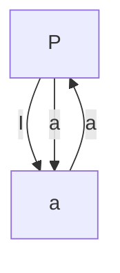

# 第八章 恒定电流的磁场 生物磁效应

## 一、本章内容提要

1. 电流密度

$$
J = \lim _ {\Delta S \rightarrow 0} \frac {\Delta I}{\Delta S} = \frac {\mathrm{d} I}{\mathrm{dS}} \tag {8-1}
$$

单位为 $A \cdot m^{-2}$ ，电流密度 J 是矢量，其方向与该点场强 E 的方向一致。金属导体中的电流密度

$$
J = \lim _ {\Delta S \rightarrow 0} \frac {\Delta I}{\Delta S} = Z e n \bar {v} = \rho_ {e} \bar {v} \quad \frac {1 - 3 R _ {0} u}{c _ {0}} = 8, r = 0, \text { 回 } R <   r \tag {8-2}
$$

式中 n 为电子密度, $\rho_{e}=Zen$ 表示导体中自由电荷的体密度, $\bar{v}$ 为电子漂移的平均速度,沿着场强 E 的反方向。

2. 欧姆定律的微分形式

$$
J = \frac {E}{\rho} = \gamma E \tag {8-3}
$$

$\gamma=\frac{1}{\rho}$ 为电导率,单位为西门子每米 $(S\cdot m^{-1})$

3. 磁感应强度 描述磁场强弱和方向的物理量, 它可由运动电荷在磁场中某点所受到的磁场力来定义, $B = \frac{F_{m}}{q_{0} v}$ , 磁感应强度的单位是特斯拉(T)。

B 是矢量, 方向由右手螺旋法则来确定。右手拇指与其余四指垂直, 先将四指的指向与 $F_{m}$ 方向相同, 再使其向 v 的方向弯曲, 这时拇指的指向就是磁感应强度 B 的方向。

4. 磁通量 通过磁场中某一曲面的磁感应线数, 称为通过该曲面的磁通量, 用 $\Phi$ 表示,

$$
\Phi = \iint_ {S} \mathrm{d} \Phi = \iint_ {S} B \cdot \mathrm{d} S = \iint_ {S} B \cos \theta \mathrm{d} S \tag {8-4}
$$

磁通量单位为韦伯(Wb)。

磁场中的高斯定理:由于磁感应线是一些无头无尾的闭合曲线,故此,穿入任一闭合曲面的磁感应线数(规定为负的磁通量)必等于穿出该曲面的磁感应线数(规定为正的磁通量)。所以,通过磁场中任一闭合曲面的总磁通量为零。

$$
\oiint_ {S} \boldsymbol {B} \cdot \mathrm{d} \boldsymbol {S} = \oiint_ {S} B \cos \theta \mathrm{d} S = 0 \tag {8-5}
$$

它反映了磁场是无源场、涡旋场。

5. 毕奥-萨伐尔定律 电流元 Idl 在空间某点处产生的磁感应强度 dB 为

矢量式： $\mathrm{d}B=\frac{\mu_{0}}{4\pi}\frac{I\mathrm{d}l\times e_{r}}{r^{2}}$ (8-6)

标量式：

$$
\mathrm{d} B = \frac {\mu_ {0}}{4 \pi} \frac {I \mathrm{d} l \sin \theta}{r ^ {2}} \tag {8-7}
$$

dB 的方向垂直于 Idl 和 r 所在的平面, 由右手螺旋法则确定, 即右手弯曲的四指由 Idl 的方向沿小于 $\pi$ 的 $\theta$ 角转向 r 的方向, 则拇指的指向就是 dB 的方向。 $e_{r}$ 表示 r 方向上的单位矢量。

(1) 载流长直导线外任一点 P 的磁场

$$
B = \frac {\mu_ {0}}{4 \pi} \int_ {\theta_ {1}} ^ {\theta_ {2}} \frac {I \sin \theta \mathrm{d} \theta}{r _ {0}} = \frac {\mu_ {0} I}{4 \pi r _ {0}} (\cos \theta_ {1} - \cos \theta_ {2}) \tag {8-8}
$$

若导线为无限长 $B=\frac{\mu_{0}I}{2\pi r_{0}}$

(2) 载流圆线圈轴线上任意点 P 的磁场

$$
B = \frac {\mu_ {0} I R ^ {2}}{2 r ^ {3}} = \frac {\mu_ {0}}{2} \frac {R ^ {2} I}{\left(R ^ {2} + r _ {0} ^ {2}\right) ^ {3 / 2}} \tag {8-9}
$$

在圆心处 $B=\frac{\mu_{0}I}{2R}$

当 $r \gg R$ 时 $r_0 \approx r, B = \frac{\mu_0 R^2 I}{2r^3}$

(3) 载流直螺线管内部的磁场

$$
B = \int_ {\beta_ {1}} ^ {\beta_ {2}} - \frac {\mu_ {0}}{2} n I \sin \beta \mathrm{d} \beta = \frac {\mu_ {0}}{2} n I (\cos \beta_ {2} - \cos \beta_ {1}) \tag {8-10}
$$

若螺线管为无限长

$$
B = \mu_ {0} n I
$$

6. 安培环路定理 在真空的恒定磁场中, 磁感应强度 B 沿任意闭合路径的线积分等于此闭合路径所包围的电流的代数和与真空磁导率的乘积, 即

$$
\oint_ {L} \boldsymbol {B} \cdot \mathrm{d} \boldsymbol {l} = \oint_ {L} B \cos \theta \mathrm{d} l = \mu_ {0} \sum I \tag {8-11}
$$

电流的方向与积分回路的绕行方向符合右手螺旋关系时电流为正,反之为负。

7. 洛伦兹力 运动电荷在磁场中会受到磁场力的作用称为洛伦兹力

$$
\boldsymbol {F} = q \boldsymbol {v} \times \boldsymbol {B} \tag {8-12}
$$

洛伦兹力的方向可以由右手螺旋法则来判定,即将右手四指的指向由 v 的方向沿着小于 $\pi$ 的一侧向 B 的方向弯曲,则拇指的指向就是 F 的方向。若 $\theta$ 为电荷速度方向与磁感应强度的夹角,洛伦兹力的大小为

$$
F = q v B \sin \theta \tag {8-13}
$$

8. 安培力 磁场 B 电流元 Idl 的作用力

$$
\mathrm{d} \boldsymbol {F} = I \mathrm{d} l \times \boldsymbol {B} \tag {8-14}
$$

方向由右手螺旋法则确定,即右手的四指由电流强度 I 的方向沿着小于 $\pi$ 的角度转向磁感应强度 B 的方向,这时拇指的指向就是安培力 dF 的方向。若 $\theta$ 为电流方向与磁感应强度的夹角,电流元 Idl 在磁场中受到的安培力为

$$
\mathrm{d} F = I B \sin \theta \mathrm{d} l \tag {8-15}
$$

9. $N$ 匝线圈的磁矩

$$
\boldsymbol {p} _ {\mathrm{m}} = N I S \tag {8-16}
$$

磁矩单位为 $A \cdot m^{2}$ 。线圈磁矩是矢量，它的方向与电流方向满足右手螺旋关系，即右手四指为电流的方向则右手拇指的方向则为磁矩的方向，该方向定义为线圈面积 S 的法线方向。

10. 载流线圈所受磁力矩

$$
\boldsymbol {M} = \boldsymbol {p} _ {\mathrm{m}} \times \boldsymbol {B} \tag {8-17}
$$

若磁矩方向与磁感应强度夹角为 $\varphi, N$ 匝线圈受的磁力矩大小为

$$
M = N I B S \sin \varphi \tag {8-18}
$$

或边长为 $l_{1},l_{2}$ 的N匝矩形线圈受的磁力矩大小为

$$
M = N I B l _ {1} l _ {2} \sin \varphi \tag {8-19}
$$

11. 霍尔效应 在均匀磁场 B 中放入通有电流 I 的导体或半导体薄片, 使薄片平面垂直于磁场方向, 这时在薄片的两侧产生一个电势差, 这种现象称为霍尔效应 (Hall effect), 产生的电势差称为霍尔电势差。

霍尔电势差为

$$
U _ {a b} = K \frac {I B}{d} = \left(\frac {8 - 1}{c} - 1\right) \frac {1 + a}{8 + c} = 3 \tag {8-20}
$$

$K=\frac{1}{nq}$ 称为霍尔系数。

12. 生物磁现象和磁场的生物效应

(1) 生物磁现象:生物电现象的同时必然有生物磁现象的产生。在外界因素的刺激下,生物机体的某些部位可产生一定的诱发电位,同时产生一定的诱发磁场,这种诱发的磁信号也是生物磁场。生物磁场图有心磁图、脑磁图、肺磁图等。

(2) 磁场的生物效应: 磁场对生命机体的活动及其生理、生化过程有一定影响。

## 二、解题指导——典型例题

[例 8-1] 氢原子处于基态时, 它的电子可看作是在半径 $a=5.2\times10^{-11}$ m 的轨道上作匀速圆周运动的质点, 速率 $v=2.2\times10^{6}m\cdot s^{-1}$ 。求电子在轨道中心所产生的磁感应强度和电子磁矩的值。

解:电子绕行一周,等效电流的大小为 $I=\frac{e}{T}=\frac{e}{2\pi a/v}$ 。

如图 8-1 所示, 假设电子沿逆时针方向运动, 因而电流的方向为顺时针方向, 则电子轨道中心产生的磁感应强度为

$$
B = \frac {\mu_ {0} I}{2 a} = \frac {\mu_ {0} e v}{4 \pi a ^ {2}} = 1 3. 0 \mathrm{T}
$$

方向垂直纸面向里。电子磁矩的大小为

$$
p _ {m} = I S = \frac {e}{T} \pi a ^ {2} = \frac {e v a}{2} = 9. 2 \times 1 0 ^ {- 2 4} \mathrm{A} \cdot \mathrm{m} ^ {2}
$$

text_image

e
v
a
B
O

图8-1 例8-1

方向也是垂直纸面向里。

[例 8-2] 一根无限长的直导线, 如图 8-2 所示, 通有电流 I, 中部一段弯成圆弧形, 求图中点磁感应强度的大小。

解: 圆弧形 BC 在 P 点产生的磁感应强度 $B_{1}$ 的大小为

$B_{1} = \frac{\mu_{0}}{4\pi}\int \frac{I\mathrm{d}l}{r^{2}} = \frac{\mu_{0}}{4\pi}\int_{0}^{\frac{2\pi}{3}}\frac{IR\mathrm{d}\theta}{R^{2}} = \frac{\mu_{0}I}{6R}$ 方向垂直纸面向里。

载流长直导线 AB 在 P 点产生的磁感应强度 $B_{2}$ 的大小

$$
B _ {2} = \frac {\mu_ {0} I}{4 \pi d} (\cos \theta_ {1} - \cos \theta_ {2}) = \frac {\mu_ {0} I}{4 \pi d} \left(\cos 0 - \cos \frac {\pi}{6}\right)
$$

$$
d = R \cos 6 0 ^ {\circ} = \frac {R}{2}
$$

text_image

I
A → B → C → D
R d 60°
P

图8-2 例8-2

∴ $B_{2}=\frac{\mu_{0}I}{2\pi R}\left(1-\frac{\sqrt{3}}{2}\right)$ 方向垂直纸面向里。

载流长直导线 CD 在 P 点产生的磁感应强度 $B_{3}$ 的大小

$$
B _ {3} = \frac {\mu_ {0} I}{4 \pi d} (\cos \theta_ {1} - \cos \theta_ {2}) = \frac {\mu_ {0} I}{4 \pi d} (\cos \frac {5 \pi}{6} - \cos \pi)
$$

∴ $B_{3}=\frac{\mu_{0}I}{2\pi R}\left(1-\frac{\sqrt{3}}{2}\right)=\frac{\mu_{0}I}{2\pi R}\left(1-\frac{\sqrt{3}}{2}\right)$ 方向垂直纸面向里。

P 点产生的磁感应强度为: $B = B_{1} + B_{2} + B_{3} = 0.21 \frac{\mu_{0} I}{R}$ 方向垂直纸面向里。

[例 8-3] 一段导线弯成如图 8-3 所示的形状, 它的质量 m=10g, 上面水平一段长 l=20cm, 处在 B=0.1T 方向垂直纸面向里的匀强磁场中, 导线下面两端分别插在两个浅水银槽中, 使这段导线、电源和电键组成回路。当电键 K 接通, 导线从水银槽中跳出, 跳起的高度 h=5.0cm, 求通过导线的电量。

解:设导线中瞬间电流为 i, 此时导线受力 F=Bil, 在电键接通瞬间, 安培力的冲量为

$$
\int_ {0} ^ {t} F \mathrm{d} t = \int_ {0} ^ {t} B i l \mathrm{d} t = B l \int_ {0} ^ {t} i \mathrm{d} t = B l q \tag {1}
$$

text_image

B
l
K

图8-3 例8-3

由于 t 极短,重力的冲量可忽略,由动量定理

$$
\int_ {0} ^ {t} F \mathrm{d} t = m v - 0 \tag {2}
$$

由式(1)和(2)得

$$
B l q = m v \tag {3}
$$

根据机械能守恒得

$$
v = \sqrt {2 g h} \mathrm{d} \cdot \mathrm{d} \Gamma = \frac {\mathrm{d}}{\mathrm{d} \pi \mathrm{d}} = \frac {\mathrm{d}}{\mathrm{d} \Omega} = \mathrm{d} \tag {4}
$$

将式(4)代入式(3)得

$$
q = \frac {m}{l B} \sqrt {2 g h} = 0. 5 (\mathrm{C})
$$

通过导线的电量为 0.5(C)

[例 8-4] 一长直导线载有电流 50A, 离导线 5.0cm 处有一电子以 $1.0 \times 10^{7} ~m \cdot s^{-1}$ 运动, 求下列情况作用于电子上的洛伦兹力:

(1) 电子的速度方向平行于导线。  
(2) 电子的速度方向垂直于导线并指向导线。  
(3) 设电子的速度方向垂直于导线和电子所构成的平面。

解:由洛伦兹力 $F=qv\times B=-ev\times B$

(1) 电子的速度方向平行于导线

$$
\begin{array}{l} F = q v B \sin \frac {\pi}{2} = \frac {\mu_ {0} e v I}{2 \pi r} = \frac {4 \pi \times 1 0 ^ {- 7} \times 1 . 6 \times 1 0 ^ {- 1 9} \times 1 . 0 \times 1 0 ^ {7} \times 5 0}{2 \pi \times 5 . 0 \times 1 0 ^ {- 2}} \\ = 3. 2 \times 1 0 ^ {- 1 6} (\mathrm{N}) \\ \end{array}
$$

F 方向垂直背向导线或垂直指向导线。

(2) v 与 B 垂直时, 洛伦兹力大小同上, 方向平行于直导线, 指向与电流相同。  
(3) v 与 B 平行时, 洛伦兹力为零。

## 三、思考题与习题解答

8-1 北京正负电子对撞机的储存环是周长为 240m 的近似圆形轨道, 当环中电子流强度为 8mA 时, 在整个环中有多少电子在运行? 已知电子的速率接近光速。

解: $I=\frac{Ne}{l/c}=\frac{Nec}{l}$ ，有 $N=\frac{Il}{ec}=4\times10^{10}$ 个电子在运行。

8-2 电流元在它周围任意一点都产生磁场吗?

答:毕奥-萨伐尔定律给出任一电流元在空间任意一点所产生的磁感应强度大小为

$$
\mathrm{d} B = \frac {\mu_ {0}}{4 \pi} \frac {I \mathrm{d} l \sin \theta}{r ^ {2}}
$$

在电流元轴线上各点, $\theta=0$ 或 $\pi$ ,磁感应强度为零。故电流元在其轴线上各点不产生磁场。

8-3 一个半径为 $0.2 \mathrm{~m}$ , 阻值 $200 \Omega$ 的圆形电流回路连着 $12 \mathrm{~V}$ 的电压, 回路中心的磁感应强度是多少?

解:回路中心即圆心处的磁感应强度是

$$
B = \frac {\mu_ {0} I}{2 R} = \frac {4 \pi \times 1 0 ^ {- 7} \times \frac {1 2}{2 0 0}}{2 \times 0 . 2} = 1. 9 \times 1 0 ^ {- 7} (\mathrm{T})
$$

回路中心的磁感应强度 $B=1.9\times10^{-7}(T)$

8-4 一无限长直导线通有 I=15A 的电流, 把它放在 B=0.05T 的外磁场中, 并使导线与外磁场正交, 试求合磁场为零的点至导线的距离。

解:设 $r_{x}$ 处长直导线电流产生的磁场:

$B_{1}=\frac{\mu_{0}I}{2\pi r_{x}}$ 方向与外磁场 $B_{2}$ 相反

依题意： $\sum B = B_{1} + B_{2} = 0$

$$
\begin{array}{l} \frac {\mu_ {0} I}{2 \pi r _ {x}} - 0. 0 5 = 0 \\ \frac {4 \pi \times 1 0 ^ {- 7} \times 1 5}{2 \pi \times r _ {x}} - 0. 0 5 = 0 \\ r _ {x} = 6. 0 \times 1 0 ^ {- 5} (\mathrm{m}) \\ \end{array}
$$

合磁场为零的点至导线的距离为 $6.0 \times 10^{-5}$ m

8-5 在图 8-4 中求：

(1) 如图(a)所示, 半圆 C 处的磁感应强度是多少?  
(2) 如图(b)所示, 总电流分成两个相等的分电流时, 圆心 C 处的磁感应强度是多少?

解:(1) 在图 8-4(a) 中 C 处的磁感强度由三部分组成,两直线和半圆的磁感应之和。

两直线的延长线过圆心 C, 所以 $B_{1}=B_{2}=0$ , 半圆在 C 处的磁场设为 $B_{3}$

$$
B _ {3} = \frac {1}{2} \cdot \frac {\mu_ {0} I}{2 a} = \frac {\mu_ {0} I}{4 a}
$$

  
(a)

text_image

I
a
C
I/2

(b)  
图8-4 习题8-5

(2) 两个半圆产生的磁感应强度方向相反

$$
B _ {1} = \frac {1}{2} \cdot \frac {\mu_ {0} I}{2 a} B _ {2} = - \frac {1}{2} \cdot \frac {\mu_ {0} I}{2 a}
$$

两直线的延长线过 C 点 $B_{3}=0$

$$
\therefore \sum B = B _ {1} + B _ {2} + B _ {3} = 0
$$

8-6 一根载有电流 I 的导线由三部分组成, AB 部分为四分之一圆周, 圆心为 0, 半径为 a, 导线其余部分伸向无限远。如图 8-5 所示, 求 0 点的磁感应强度。

解: 四分之一圆与两直线在 O 点产生的磁感应强度的方向均相同, 大小各为:

text_image

I
A
O
a
B

图8-5 习题8-6

$$
B _ {1} = \frac {1}{4} \cdot \frac {\mu_ {0} I}{2 a}
$$

$$
B _ {2} = B _ {3} = \frac {\mu_ {0} I}{4 \pi a} (\cos \theta_ {1} - \cos \theta_ {2}) = \frac {\mu_ {0} I}{4 \pi a} \left(\cos \frac {\pi}{2} - \cos \pi\right) = \frac {\mu_ {0} I}{4 \pi a}
$$

$$
\therefore \sum B = B _ {1} + B _ {2} + B _ {3} = \frac {1}{4} \cdot \frac {\mu_ {0} I}{2 a} + \frac {\mu_ {0} I}{4 \pi a} + \frac {\mu_ {0} I}{4 \pi a} = \frac {\mu_ {0} I}{2 \pi a} \left(1 + \frac {\pi}{4}\right)
$$

O 点的磁感应强度为 $B=\frac{\mu_{0}I}{2\pi a}\left(1+\frac{\pi}{4}\right)$

8-7 如图 8-6 所示, 环绕两根通过电流为 I 的导线有四种环路, 问每种情况下 $\oint B\cos\theta dl$ 等于多少?

解: 安培环路定理: $\oint B\cos\theta dl=\mu_{0}\sum I$ , 如果电流的方向与积分回路的绕行方向符合右手螺旋法则, 电流取正值, 反之为负。

（1）对于第一种环绕方式，右侧电流符合右手螺旋法则，取正值，左侧电流取负值

$$
\oint B \cos \theta \mathrm{d} l = - \mu_ {0} I + \mu_ {0} I = 0
$$

(2) 对于第二种环绕方式, 右侧电流取正值, 左侧电流取正值

flowchart

图8-6 习题8-7

$$
\oint B \cos \theta \mathrm{d} l = \mu_ {0} I + \mu_ {0} I = 2 \mu_ {0} I
$$

(3) 对于第三种环绕方式

$$
\begin{array}{l} \oint B \cos \theta \mathrm{d} l = \mu_ {0} I \\ \oint B \cos \theta \mathrm{d} l = - \mu_ {0} I \end{array}
$$

(4) 对于第四种环绕方式

8-8 如图 8-7(a) 所示, 一载流长直导线的电流为 I, 试求通过附近一矩形平面的磁通量。

解:由于矩形平面上各点的磁感应强度不同,故计算磁通量时不能采用均匀磁场的公式 $\Phi=B\cdot S$ 。为此可在矩形平面上取一矩形面元 dS=ldx,如图 8-7(b) 所示,载流长直导线的磁场通过该面元的磁通量为

$$
\mathrm{d} \Phi = B \cdot \mathrm{d} S = \frac {\mu_ {0} I}{2 \pi x} l \mathrm{d} x
$$

通过矩形平面的总磁通量为

$$
\Phi = \int \mathrm{d} \Phi = \int_ {d _ {1}} ^ {d _ {2}} \frac {\mu_ {0} I}{2 \pi x} l \mathrm{d} x = \frac {\mu_ {0} I l}{2 \pi} \ln \frac {d _ {2}}{d _ {1}}
$$

text_image

I
l
d₁
d₂

(a)

text_image

I
O dx x
0 = (1-1) θ = π - 2

(b)  
图8-7 习题8-8

8-9 有一根很长的同轴电缆由一圆柱形导体和一同轴圆筒状导体组成, 圆柱的半径为 $R_{1}$ , 圆筒的内外半径分别为 $R_{2}$ 和 $R_{3}$ , 如图 8-8(a) 所示。在这两个导体中, 载有大小相等而方向相反的电流 $I$ , 电流均匀分布在各导体的截面上。试求以下各处的磁感应强度: (1) $r < R_{1}$ ; (2) $R_{1} < r < R_{2}$ ; (3) $R_{2} < r < R_{3}$ ; (4) $r > R_{3}$ 。画出 $B - r$ 曲线。

解:同轴电缆导体内的电流均匀分布,其磁场呈轴对称分布,取半径为 r 的同心圆为积分路径, $\oint_{L}B\cdot dl=B\cdot2\pi r$ ,利用安培环路定理 $\oint_{L}B\cdot dl=\mu_{0}\sum I$ ,可解各区域的磁感应强度。

(1) $r < R_{1}$ 时, 有 $B_{1} \cdot 2\pi r = \mu_{0} \frac{I}{\pi R_{1}^{2}} \pi r^{2}$ 所以

$$
B _ {1} = \frac {\mu_ {0}}{2 \pi} \frac {I}{R _ {1} ^ {2}} r
$$

(2) $R_{1}<r<R_{2}$ 时, 有 $B_{2}\cdot2\pi r=\mu_{0}I$ 则

$$
B _ {2} = \frac {\mu_ {0}}{2 \pi} \frac {I}{r}
$$

text_image

I
I
R₁
R₂
R₃
(a)

(a)

line chart

| r    | B     |
| ---- | ----- |
| O    | 0     |
| R₁   | Peak  |
| R₂   | Decreasing |
| R₃   | 0     |

(b)  
图8-8 习题8-9

(3) $R_{2} < r < R_{3}$ 时，有 $B_{3} \cdot 2\pi r = \mu_{0}\left[I - \frac{\pi(r^{2} - R_{2}^{2})}{\pi(R_{3}^{2} - R_{2}^{2})} I\right]$

则

$$
B _ {3} = \frac {\mu_ {0} I}{2 \pi r} \cdot \frac {R _ {3} ^ {2} - r ^ {2}}{R _ {3} ^ {2} - R _ {2} ^ {2}}
$$

(4) $r>R_{3}$ 时,有 $B_{4}\cdot2\pi r=\mu_{0}(I-I)=0$

所以

$$
B _ {4} = 0
$$

磁感应强度 B-r 的分布曲线如图 8-8(b) 所示。

8-10 无限长直线电流 $I_{1}$ 与直线电流 $I_{2}$ 共面, 几何位置如图 8-9 所示, 试求电流 $I_{2}$ 受到电流 $I_{1}$ 的作用力。

解: 在直线电流 $I_{2}$ 上取一电流元 $I_{2}dl$ ，此电流元到无限长直线电流 $I_{1}$ 的距离为 x，无限长直线电流 $I_{1}$ 在电流元处产生的磁感应强度为

$$
B = \frac {\mu_ {0}}{2 \pi} \frac {I _ {1}}{x}
$$

电流元 $I_{2}dl$ 受到的安培力为

$$
\mathrm{d} F = \frac {\mu_ {0}}{2 \pi} \frac {I _ {1}}{x} I _ {2} \mathrm{d} l = \frac {\mu_ {0}}{2 \pi} \frac {I _ {1}}{x} I _ {2} \frac {\mathrm{d} x}{\cos 6 0 ^ {\circ}}
$$

直线电流 $I_{2}$ 受到的安培力为

$$
F = \int \mathrm{d} F = \int_ {a} ^ {b} \frac {\mu_ {0}}{2 \pi} \frac {I _ {1}}{x} I _ {2} \frac {\mathrm{d} x}{\cos 6 0 ^ {\circ}} = \frac {\mu_ {0} I _ {1} I _ {2}}{\pi} \ln \frac {b}{a}
$$

text_image

b
I₁
a
I₂
60°

图8-9 习题8-10

8-11 磁力可以用来输送导电液体,如液态金属、血液等,而不需要机械活动组件。如图 8-10 所示,是输送液态钠的管道,在管道上取长为 $l=2.0\text{cm}$ 的部分加一横向磁场,其磁感应强度为 $B=1.5\text{T}$ ,同时在垂直于磁场方向与管道方向加一电流,电流密度为 $j$ 。(1)证明在管道内 $l$ 段液体两端产生的压强差为 $\Delta p=jlB$ ,此压强差将驱动液体沿管道运动;(2)要在 $l$ 段液体两端产生 $1.0\text{atm}$ ( $1\text{atm}=101325\text{Pa}$ ) 的压强差,电流密度需多大?

解:(1) 沿磁场方向的管道宽度为 a, 管道内 l 段内垂直流过管道内导电液体的电流 I=jal, 磁场中导电液体受到沿管道纵向的安培力为 F=BIb。在管道纵向 l 段内产生的压强差

$$
\Delta p = \frac {F}{S} = \frac {B I b}{a b} = \frac {B j a l b}{a b} = j l B
$$

(2) 欲在 l 段两端产生 1.0atm 压强差, 电流密度为

$$
j = \frac {\Delta p}{B l} = 3. 3 8 \times 1 0 ^ {6} \mathrm{A} \cdot \mathrm{m} ^ {- 2}
$$

8-12 一铜片厚度 d=2.0mm，放在 B=3.0T 的匀强磁场中，已知磁场方向与铜片表面垂直，铜的载流子密度 $n=8.4\times10^{22}cm^{-3}$ ，当铜片中通有与磁场方向垂直的电流 I=200A 时，铜片两端的霍尔电势为多少？

text_image

导电液体
a
b
l
J
B

图8-10 习题8-11

解:铜片两端的霍尔电势:

$$
U = \frac {1}{n q} \cdot \frac {I B}{d} = \frac {1}{8 . 4 \times 1 0 ^ {2 2} \times 1 0 ^ {6} \times 1 . 6 \times 1 0 ^ {- 1 9}} \times \frac {2 \times 1 0 ^ {2} \times 3}{2 \times 1 0 ^ {- 3}} = 2. 2 \times 1 0 ^ {- 5} (\mathrm{V})
$$

霍尔电势为 $2.2 \times 10^{-5} \mathrm{~V}$

8-13 霍尔效应可用来测量血液的速度。其原理如图 8-11 所示, 在动脉血管两侧分别安装电极并加以磁场。设血管直径是 2.0mm, 磁场为 0.080T, 毫伏表测出的电压为 0.10mV, 血流的速度多大?

text_image

N
v
S
mV

图8-11 习题8-13

解:血流稳定时,有

$$
q v B = q E
$$

血流的速度为

$$
v = \frac {E}{B} = \frac {U}{\mathrm{d} B} = 0. 6 3 \mathrm{m} \cdot \mathrm{s} ^ {- 1}
$$

8-14 心磁图、脑磁图、肺磁图记录的都是什么信号？在医学诊断上有哪些应用，具有什么优点？

答:心磁图、脑磁图、肺磁图记录的都是磁场随时间变化的曲线。

心磁图方法的诊断在灵敏度和准确度方面都优于心电图,主要用于检测心脏疾病,如心肌梗死、心室动脉痛和心绞痛等;脑磁图的诊断比脑电图更准确,目前主要仍利用脑电图来确定癫痫病人的病变部位;肺磁图在诊断肺部受磁粉感染的职业病人时,它可比X射线发现更早。近年来肺磁学的发展又开拓了一个新领域,通过对细胞磁性的测量,可以了解细胞游动的力学情况。

## 四、自我评估题

8-1 如图 8-12 所示, 边长为 a 的正方形线圈中通有电流 I, 此线圈在 P 点产生的磁感应强度的大小为

A. 0

B. $\frac{\sqrt{2}\mu_0I}{4\pi a}$

C. $\frac{\sqrt{2}\mu_0I}{2\pi a}$

D. $\frac{\sqrt{2}\mu_{0}I}{\pi a}$

E. $\frac{\mu_{0}I}{4\pi a}$

(B)

8-2 如图 8-13 所示, 在磁感应强度为 B 均匀磁场中作一半径为 R 的半球面 S, S 边线所在的

平面的法线方向单位矢量 n 与 B 的夹角为 $\alpha$ ，则通过此半球面 S 的磁通量为

A. $\pi R^{2}B$

B. 0

C. $\pi R^2 B\cos \alpha$

D. $-\pi R^{2} B \cos \alpha$

E. $\pi R^{2}B\sin\alpha$ (D)

8-3 如图 8-14 所示, 一宽度为 a 的无限长铜片, 厚度不计, 通有电流 I, 电流在铜片上均匀分布。在与铜片共面且距铜片右边缘为 b 处的 P 点的磁感应强度的大小为

A. $\frac{\mu_0I}{2\pi a} ln\frac{a+b}{b}$

B. $\frac{\mu_0I}{2\pi b} ln \frac{a + b}{b}$

C. $\frac{\mu_0I}{2\pi(a + b)}$

D. $\frac{\mu_0I}{2\pi\left(\frac{a}{2}+b\right)}$

E. $\frac{\mu_{0}I}{4\pi a}\ln\frac{a+b}{b}$ (A)

flowchart

图8-12 自我评估题8-1

text_image

S
α
n B

图8-13 自我评估题8-2

text_image

I
↑
I
01×S.5
b
P
a

图8-14 自我评估题8-3

8-4 如图 8-15 所示, 在一圆形电流 I 所在的平面内, 选取一个同心圆形闭合回路 L, 则由安培回路定理可知

A. $\oint_{L} B \cdot dl = 0$ , 且环路上任意一点 B = 0  
B. $\oint_{L} \mathbf{B} \cdot \mathrm{d}l = 0$ ，且环路上任意一点 $B \neq 0$  
C. $\oint_{L} B \cdot dl \neq 0$ ，且环路上任意一点 $B \neq 0$  
D. $\oint_{L} \mathbf{B} \cdot \mathrm{d}l \neq 0$ ，且环路上任意一点 $\mathbf{B} =$ 常量  
E. $\oint_{L} \mathbf{B} \cdot \mathrm{d}l = \mu_{0} I$ ，且环路上任意一点 $B \neq 0$

text_image

L
O
I

图8-15 自我评估题8-4

8-5 一电子以速度 v 在半径为 R 的圆周上作匀速圆周运动, 它的磁矩为

A. 0

B. $\frac{1}{2} ev^{2}$

C. $\frac{1}{2} evR$

D. $\frac{1}{2} evR^{2}$

E. $\frac{1}{4} evR$

(C)

8-6 一载流导线弯成如图 8-16 所示形状, 其中 AB 为一段四分之一圆弧, AC 和 BD 为直线并延伸到无限远, 导线中通有恒定电流 I。则圆心 O 点的磁感应强度 B=\_\_\_\_, 其方向\_\_\_\_。

$\left[\frac{\mu_{0}I}{4R}\left(\frac{1}{\pi}+\frac{1}{2}\right),垂直纸面向里\right]$

8-7 如图 8-17 所示, 在一根通有电流 I 的直导线旁, 与之共面地放着一个长、宽各为 a 和 b 的矩形线框, 线框的长边与载流长直导线平行, 在此情形中, 求线框内的磁通量 $\Phi=$ \_\_\_\_。

$$
\left(\frac {\mu_ {0} I a}{2 \pi} l n 2\right)
$$

text_image

C
A
I
R
O
B
D

图8-16 自我评估题8-6

text_image

I
a
b b

图8-17 自我评估题8-7

8-8 如图 8-18 所示, 半径为 R 的半圆形线圈中通有电流 I, 线圈处在与线圈平面平行向右的均匀磁场 B 中, 线圈所受磁力矩的大小为 \_\_\_\_ , 方向为 \_\_\_\_ 。

$\left(\frac{\pi R^{2}IB}{2},\text{图面中向上}\right)$

8-9 氢原子中, 电子绕原子核在半径为 r 的圆周上运动, 如果外加一个磁感应强度为 B 的磁场 (B 的方向与圆轨道平面平行), 那么, 氢原子受到磁场作用的磁力矩的大小 M= \_\_\_\_。(设电子质量为 $m_{e}$ , 电子电荷为 e)。

$$
\left(\frac {B e ^ {2}}{4} \sqrt {\frac {r}{\pi \varepsilon_ {0} m _ {e}}}\right)
$$

8-10 如图 8-19 所示,电流 I=20A,流过半径 R=0.050m 的金属薄圆筒,再经由圆筒轴线外的细导线流回来,细导线的半径为 $1.0 \times 10^{-3}$ m,筒的长度为 l=20m,求:

(1) 筒中离轴线 0.020m 处 P 点的 B 值。 $(2.0 \times 10^{-4} T)$  
(2) 筒外离轴线 0.10m 处 Q 点的 B 值。 (B=0)

text_image

O
B
R
I
O'

图8-18 自我评估题8-8

text_image

I
R
L'
L
P
Q
I
I

图8-19 自我评估题8-10

8-11 一根载有电流 I 的无限长直导线，在一处弯成半径为 R 的圆形，由于导线外有绝缘层，因此在弯曲处两导线不会短路，如图 8-20 所示。试求圆心点 O 处的磁感应强度的大小和方向。

$$
\left[ B = \frac {\mu_ {0} I}{2 R} \left(1 - \frac {1}{\pi}\right), \text {垂直纸面向里} \right]
$$

8-12 两根长直导线沿铜环的半径方向引到环上 a、b 两点, 如图 8-21 所示, 并且与很远的电源相连, 电源电流为 I, 求环心 O 点的磁感应强度。

(0)

text_image

I
R
O

图8-20 自我评估题8-11

text_image

I
b
l₁
O
I₂
a
I₁
I₂
I

图8-21 自我评估题8-12

8-13 如图 8-22 所示的空心柱形导体, 半径为 $R_{1}$ 和 $R_{2}$ , 导体内载有电流 I, 设电流均匀分布在导体的横截面上。求导体内部各点 ( $R_{1}<r<R_{2}$ ) 的磁感应强度。

$$
\left[ \frac {\mu_ {0} I}{2 \pi \left(R _ {2} ^ {2} - R _ {1} ^ {2}\right)} \cdot \frac {r ^ {2} - R _ {1} ^ {2}}{r} \right]
$$

8-14 如图 8-23 所示, 载流导线段 ab 与长直导线 $I_{1}$ 共面, ab 段长为 l, 通有电流 $I_{2}$ , 方向与 $I_{1}$ 立直。a 端与 $I_{1}$ 的距离为 d。求导线 ab 所受磁场的作用力。

$$
\left(F = \frac {\mu_ {0} I _ {1} I _ {2}}{2 \pi} \ln \frac {d + l}{d}\right)
$$

text_image

R₂
r
R₁

图 8-22 自我评估题 8-13

text_image

I₁
a
I₂
b
d
l

图 8-23 自我评估题 8-14

(刘东华)