# 生物化学与分子生物学 · 第9-10节 · RNA结构功能续讲与维生素

> **课程信息**
> - 课程：生物化学与分子生物学（BIO0501）
> - 节次：第9-10节（课程内累计）
> - 日期：2026年9月15日（周二，第3周）
> - 授课老师：郭雨松（教授，生命科学与技术学院）
> - 上课地点：东九教学楼B栋203
> - 课表标注主题：维生素、酶（实际授课内容为RNA空间结构与功能续讲+核酸理化性质+维生素（至B2），酶尚未开始，以实际内容为准）
> - 学时：2学时（10:10-11:50）

---

## 一、知识结构

```mermaid
flowchart TD
    A[第9-10节内容] --> B[RNA空间结构与功能续讲]
    A --> C[核酸理化性质]
    A --> D[维生素]
    
    B --> B1[tRNA三叶草结构]
    B --> B2[rRNA与核糖体]
    B --> B3[组成型非编码RNA]
    B --> B4[调控型非编码RNA]
    
    B1 --> B1a[反密码子环/CCA末端]
    B1 --> B1b[倒L型三级结构]
    B1 --> B1c[稀有碱基]
    B1 --> B1d[氨酰tRNA合成酶]
    
    B2 --> B2a[80S=60S+40S]
    B2 --> B2b[沉降系数S不可加和]
    B2 --> B2c[茎环二级结构]
    
    B3 --> B3a[核酶ribozyme]
    B3 --> B3b[snoRNA核仁小RNA]
    B3 --> B3c[snRNA核小RNA]
    B3 --> B3d[scRNA胞质小RNA/SRP]
    
    B4 --> B4a[miRNA/siRNA/piRNA]
    B4 --> B4b[lncRNA长非编码RNA]
    B4b --> B4b1[读作link RNA]
    B4 --> B4c[circRNA环状RNA]
    
    C --> C1[紫外吸收260nm]
    C --> C2[A260/A280纯度判断]
    C --> C3[变性与增色效应]
    C --> C4[解链温度Tm]
    C --> C5[复性/退火]
    C --> C6[分子杂交/杂化双链]
    
    D --> D1[维生素概念与分类]
    D --> D2[脂溶性维生素ADEK]
    D --> D3[水溶性维生素B族+C]
    
    D2 --> D2a[维生素D]
    D2 --> D2b[维生素A]
    D2 --> D2c[维生素E]
    D2 --> D2d[维生素K]
    
    D3 --> D3a[维生素B1硫胺素/TPP]
    D3 --> D3b[维生素B2核黄素/FMN/FAD]
```



---

## 二、RNA空间结构与功能（续讲）

### 2.1 tRNA的结构与功能（复习+深化）

#### 三叶草二级结构

tRNA的二级结构呈三叶草形，核心区别在于**茎**和**环**：

- **茎（stem）**：形成双链的部分，碱基之间通过氢键配对（图中小横杠代表氢键）
- **环（loop）**：未形成双链的部分

这种茎环结构（stem loop）也叫**发夹结构（hairpin）**，是RNA常见的局部结构形式。

#### 三个关键功能区域

1. **反密码子环（anticodon loop）**：三叶草下方的一片叶子，含有3个碱基，可与mRNA上的密码子直接互补配对。这是tRNA识别密码子的关键结构。

2. **CCA末端（氨基酸臂）**：tRNA顶端的3'端，序列为CCA，末端的A（腺嘌呤）通过共价键连接一个氨基酸。

3. **氨基酸臂**：连接氨基酸的茎部，有双链结构。

#### 倒L型三级结构

tRNA进一步折叠形成**倒L型（inverted L）**三维结构：
- 一端是反密码子环（识别密码子）
- 另一端是CCA末端（连接氨基酸）
- 二级结构与三级结构的颜色完全对应，可以直观看到折叠关系

#### 稀有碱基

tRNA中含有大量**稀有碱基**（如ψ假尿嘧啶、各种甲基化碱基等），这些稀有碱基是由常见碱基经过衍生修饰而来。具体修饰机制将在RNA合成部分讲解。

#### 氨酰tRNA合成酶（关键酶）

老师提出了一个关键问题：**谁来保证特定的tRNA接上对应的氨基酸？**

答案是**氨酰tRNA合成酶（aminoacyl-tRNA synthetase）**，它负责在对应的tRNA上接上对应的氨基酸。如果接错了，后续所有翻译都会出错。这个酶是蛋白质翻译准确性的重要前提，将在翻译章节详细讲解。

> **老师强调**：tRNA的两个关键功能部分——氨基酸臂（连接氨基酸）和反密码子环（识别密码子），臂有双链，环没有双链。

### 2.2 rRNA与核糖体

#### 基本特征

- **rRNA（ribosomal RNA）**：核糖体的主要成分
- 与mRNA对比：mRNA丰度最低但种类最多；rRNA种类不多但**丰度最高**，占RNA总量的**80%以上**

#### 真核细胞核糖体的组成

| 亚基 | 沉降系数 | rRNA种类 | 蛋白质种类 |
|---|---|---|---|
| 完整核糖体 | 80S | — | — |
| 大亚基 | 60S | 3种 | 49种 |
| 小亚基 | 40S | 1种 | 33种 |

#### 沉降系数S（Svedberg unit）

- S是**沉降系数**，表示颗粒在离心场中的沉降速度
- **S不能简单加和**：60S + 40S ≠ 100S，而是80S（因为沉降速度与颗粒大小、形状、密度都有关，不是线性关系）
- 但两个亚基加起来肯定比单个大，所以变成了80S

#### rRNA的二级结构

rRNA也存在茎环二级结构，但比tRNA复杂得多：
- 不是简单的三叶草，而是多片叶子的复杂茎环结构
- 一个茎上可以接多个环
- RNA不能稳定形成长双链双螺旋，任何一小段只要能互补配对就可以局部形成茎，旁边不能配对的就成为环
- 因此仅给一条序列，可以组合成多种不同的二级结构形式

#### RNA结构预测的困难

老师指出：蛋白质结构预测已经比较准确，但**RNA的结构预测目前还比较困难**——有一条序列，但它到底二级结构长什么样、三级结构长什么样，相关信息还比较少，需要更多实验数据积累。

#### rRNA的三级结构

rRNA的三级结构非常复杂，不是倒L型，很难简单描述。但可以分出一些局部的双螺旋区域——当能形成双链的段有足够长度时，也会比较像双螺旋，但不像DNA那样能稳定形成长双螺旋。核糖体中还有很多蛋白质共同组成复合体。

> **关联蛋白质功能**：核糖体是蛋白质与核酸相互作用的重要例子。蛋白质发挥功能的三种方式——与小分子、核酸、蛋白质相互作用，核糖体就是蛋白质与核酸相互作用的关键途径，位于中心法则中核酸信息→蛋白质信息的传递环节。

### 2.3 组成型非编码RNA

> 老师说明：接下来介绍很多RNA名字，前面都带小写字母，有些还很像。今天主要留个印象，之后分子生物学部分还会一个个讲到。

组成型非编码RNA的共同特点：不翻译为蛋白质，但在整个蛋白质翻译过程中发挥重要作用，主要参与**RNA修饰**和**蛋白质转运**。

#### 核酶（ribozyme）

- **定义**：具有催化功能的RNA
- 词源：ribo（核）+ enzyme（酶）的后半截 = ribozyme
- **主要功能**：在tRNA或rRNA的**剪切和剪接**中发挥催化功能
- 剪切（cleavage）vs 剪接（splicing）：剪接是剪完之后还要再接起来

#### 核仁小RNA（snoRNA, small nucleolar RNA）

- 注意带**O**（nucleolar的o）
- 位于**核仁**中（核仁是rRNA/rDNA主要存在的位置）
- **主要功能**：核糖体RNA的加工

#### 核小RNA（snRNA, small nuclear RNA）

- **不带O**（nuclear，没有o），与snoRNA区分
- 位于细胞核中，但不在核仁内
- **主要功能**：信使RNA的**剪接**
- 剪接通过非常大的复合体——**剪接体（spliceosome）**完成，剪接体由6种不同的snRNA及其相关蛋白质组成

#### 胞质小RNA（scRNA, small cytoplasmic RNA）

- 位于**胞质**中
- **主要功能**：蛋白质转运
- 是**信号识别颗粒（SRP, signal recognition particle）**的组成部分
- 蛋白质翻译过程中，很多蛋白不在胞质中发挥功能，而要进入不同细胞器，需要SRP介导的转运过程

> **记忆技巧**：除了核酶（催化功能命名），其余组成型非编码RNA都按所在区域命名——核仁(sno)、细胞核(sn)、胞质(sc)。

### 2.4 调控型非编码RNA

调控型非编码RNA的特点：不是时刻等量存在，会随环境变化而变化，使细胞能针对不同环境因素进行调节，**主要功能是调控基因表达**。

#### 小非编码RNA（sncRNA, small non-coding RNA）

长度一般二三十nt，分三类：

| 类型 | 全称 | 说明 |
|---|---|---|
| **miRNA** | microRNA | 微RNA，与mRNA不同 |
| **siRNA** | small interfering RNA | 干扰小RNA |
| **piRNA** | piwi-interacting RNA | 与Piwi蛋白复合体互作的RNA |

- miRNA和siRNA的研究曾获诺贝尔生理学和医学奖（通过线虫研究）
- 这些内容将在基因表达调控章节详细讲解

#### 长非编码RNA（lncRNA, long non-coding RNA）

- "long"放在前面（英文中长度修饰词都在前面）
- **注意发音**：三个辅音字母连在一起，英语口语中常连读拼成一个词，读作**"link RNA"**
- 将来听学术报告时听到"link RNA"要知道指的就是lncRNA

#### 环状RNA（circRNA, circular RNA）

- 用"环状"这种特殊形式描述
- **特点**：3'端和5'端再次形成磷酸二酯键，**没有游离的末端**
- 变成一个环状结构，比较特别

> 老师指出：非编码调控RNA是当前研究热点，很多信息还不完全清楚，同学们将来也可以参与相关研究。

---

## 三、核酸的理化性质

### 3.1 紫外吸收性质

#### 原理

- 核酸有紫外吸收特性，原因与蛋白质类似——都来自**共轭双键**
- 蛋白质的共轭双键来自芳香族氨基酸（苯丙氨酸、色氨酸、酪氨酸，其中苯丙氨酸较少）
- 核酸的共轭双键来自**含氮杂环的碱基**（嘧啶、嘌呤都属于这类）
- 核酸比蛋白质有**更强的紫外吸收**——蛋白质20种氨基酸中只有少数几个能吸收紫外，而核酸每一对碱基对都有相当强的紫外吸收

#### 最大吸收波长

- **核酸：260 nm**（必须记住）
- **蛋白质：280 nm**（必须记住）
- 不同的嘧啶和嘌呤具体吸收光谱有所不同，但综合起来最强吸收峰约在260nm

#### A260与学术写作规范

- A260 = Absorbance at 260 nm（260nm处的吸光度）
- 规范学术写作中：**A用斜体**（表示变量），260为下标
- 不同期刊要求可能不同（有的不标斜体），但建议自己的毕业论文/学术写作中按斜体规范书写

#### A260/A280比值——核酸纯度判断

| 样品 | A260/A280理想范围 | 说明 |
|---|---|---|
| 纯DNA | ~1.8 | 标准值 |
| 纯RNA | ~2.0 | 标准值 |

- 如果比值**小于1.8**，可能意味着有蛋白质杂质（蛋白质在280nm吸收多，A280升高→比值变小）
- 这个检测在分子生物学实验课程中会经常用到（提取DNA后测A260和A280判断纯度）

### 3.2 核酸的变性

#### 与蛋白质变性的类比

| 比较项 | 蛋白质变性 | 核酸变性 |
|---|---|---|
| 诱发条件 | 强酸、强碱、高温、某些溶剂 | 高温等 |
| 本质 | 空间结构破坏，次级键（氢键、离子键、二硫键）断裂 | 双螺旋结构解开，碱基间氢键断裂 |
| 一级结构 | 不破坏 | 不破坏 |
| 复性 | 可能，但条件苛刻 | 可能，条件相对宽容 |

#### 增色效应（hyperchromic effect）

核酸变性过程中一个独特的现象：
- 随着温度升高，DNA双链逐渐解开为单链
- **A260吸光度增加**
- 这个过程叫做**增色效应**

> 对比：蛋白质变性不会出现这种吸光度变化（除非最后沉淀测不到了）。核酸的增色效应是因为双链状态下碱基堆积力使紫外吸收被部分遮蔽，解链后碱基暴露，吸收增强。

#### 解链温度（Tm, melting temperature）

- **定义**：DNA变性进行到一半时的温度
- 当50%的双链变成单链时对应的温度
- 学术写作规范：**T用斜体，m为小写下标**

#### 影响Tm的因素

Tm越高，意味着双链越难解开（氢键越难打破）。主要因素：

1. **GC含量**：G-C之间有3个氢键，A-T之间只有2个氢键，GC含量越高→氢键越多→Tm越高
2. **DNA长度**：长度越长→总氢键数越多→Tm越高
3. **离子浓度**：氢键本质上是电荷性质的键，溶液中的离子浓度会影响氢键稳定性，从而影响Tm

> 老师强调：Tm会影响将来实验室中各类分子生物学操作的实验条件选择，现在知道决定因素和大概原则就好。

### 3.3 核酸的复性与分子杂交

#### 复性（renaturation）

- 高温使双链变成两条单链后，如果**逐渐降低温度**，两条链可以恢复到原来的双链状态
- 核酸复性的条件比蛋白质**更宽容**
- 因为实验室中通常通过降低温度来完成复性，所以也叫**退火（annealing）**

#### 复性的条件

- 必须**受控地逐渐降温**，不能剧烈降温
- 两条单链需要足够的机会去碰撞、尝试找到互补配对的对象
- 如果温度剧烈降低，单链可能来不及找到合适的匹配对象，复性就不一定发生

#### 杂化双链（heteroduplex）与分子杂交

- 碱基互补配对是复性的本质原因
- 不仅原来的一对双链可以复性，**不同来源的两条单链**只要碱基序列互补配对，也可以结合形成双链
- 这种来源不同的双链叫做**杂化双链（heteroduplex）**
  - hetero = 杂合/杂化（来源不同）
  - duplex = 双链

- **分子杂交的原理**：只要两条单链的碱基能（哪怕是局部的）互补配对，就可以在这一段形成DNA双链，形成后除非再升温，否则比较稳定
- 这是体内分子生物学过程和实验室各种分子生物学技术的基础原理

> 老师特别说明：这个过程不是随便可以发生的，需要受控的温度条件。

---

## 四、核酸结构与功能总结

### 4.1 DNA的意义

老师以"为什么50多年前人类把DNA信息发送到外太空"引入总结：

1. **遗传物质基础**：所有遗传信息储存在DNA中，中心法则本质上就是围绕核酸结构进行一系列操作

2. **储存信息的结构基础**：
   - 所有碱基都在双螺旋内部
   - 不管碱基是什么（ATCG任意排列），都能保持双螺旋结构
   - 都能进一步折叠成为染色体
   - 可以一代一代传下来
   - 对比：其他小分子如果信息本身会改变其结构，就会对储存造成很大影响

3. **半保留复制**：双螺旋可以分成两半，分别作为模板进行复制，使信息稳定传递

4. **RNA的功能多样性**：RNA性质比较活泼，结构更复杂，进行信息传递（信使）、转运（tRNA）、核糖体组成等，都由其结构决定

5. **稳定性与变化的辩证关系**：几十亿年地球生命发展至今，不仅能把信息一点点传递下来，还允许信息发生一点点变化，才有了丰富多彩的生命形式

### 4.2 诺贝尔奖与DNA双螺旋

- 1962年诺贝尔奖授予DNA双螺旋结构的发现
- 此后有非常多诺贝尔奖都基于双螺旋结构
- 所有这些内容都会在之后的分子生物学课程中介绍

### 4.3 DNA折纸术（DNA origami）——拓展应用

老师展示了一个扫描电镜下的DNA笑脸结构，介绍了DNA纳米技术：

#### 原理

- 利用DNA单链碱基互补配对的特性
- 设计**脚手架DNA单链**（长链，图中灰色部分）
- 设计**订书针DNA单链**（短链，图中蓝色部分）
- 在合适温度下退火，单链自动配对组装
- 设计得当就可以形成特定的纳米结构

#### 应用

1. **纳米材料制造**：通过其他方式很难高精度设计纳米材料结构，但通过DNA可以做到
2. **药物递送**：
   - 设计nano sheet（纸片状DNA结构），一面附加药物（如蛋白抗体）
   - 用DNA设计的"系绳"将其卷起来
   - **pH响应**：低pH下展开，高pH下保持卷筒状态
   - 血液pH 7.35-7.45（保持卷筒，药物包在里面）
   - 病变部位（如发炎关节腔）pH较低→展开→暴露药物配体→结合过度活跃的免疫细胞→降低炎症反应
   - 可作为关节炎治疗方案，可推广到多种疾病场景
3. **生物传感器**
4. 甚至有科学家用DNA折纸做出了**中国地图**

> 老师总结：DNA不仅是遗传物质基础和世代传递的物质基础，由于其性质，还可以应用于很多现代生物技术和工程当中。

---

## 五、课堂小测（4道题回顾）

老师通过"天天快答"进行了4道课堂测试题，以下是要点回顾：

### 第1题：核酸的化学组成

- A、B错误：主要区别是核糖与脱氧核糖
- B选项：构成DNA的嘧啶是胞嘧啶和胸腺嘧啶
- 正确选项涉及糖苷键
- cAMP（环腺苷酸，重要第二信使）由ATP环化而成（不是GMP），cGMP由GTP环化而成
- 反应需要脱去焦磷酸供能

### 第2题：DNA的空间结构

- A-T之间**2对氢键**，G-C之间**3对氢键**
- 换成全称也要认识：腺嘌呤-胸腺嘧啶（2对），胞嘧啶-鸟嘌呤（3对）
- 维持双螺旋的力除了氢键还有**碱基堆积力**

### 第3题：RNA的结构和功能

- mRNA加工三步骤：
  1. 5'端加帽（修饰过的鸟嘌呤）
  2. 3'端加PolyA尾（多聚腺苷酸）
  3. 内含子剪切、外显子连接（剪接）
- hnRNA = 核不均一RNA（heterogeneous nuclear RNA），是mRNA前体
- **易错点**：成熟mRNA的5'和3'端有非翻译区（UTR），参与翻译调控，但**非翻译区不是编码区**。编码区=开放阅读框（ORF），不包括两端的非翻译区

### 第4题：核酸的变性与复性

- 变性时一级结构不发生变化（与蛋白质相同）
- **错误选项**：迅速冷却可以复性——错误！必须受控逐渐冷却
- 变性过程中A260吸光度增加（增色效应）——正确
- 分子杂交依赖变复性特性，不同来源DNA单链只要部分序列互补配对即可杂交

---

## 六、维生素

### 6.1 维生素的概念

维生素（vitamin）的词源：**vital**（维持生命）+ amine（胺，最初发现的维生素都是胺类）

- **vital sign** = 生命体征（血压、心跳等），vital = 维持生命
- "维生素"这个翻译非常到位

#### 三个核心要点（概念）

1. **低分子量有机营养素**
   - 低分子量：与核酸、蛋白质、多糖、脂质不同，是小分子
   - 有机营养素：与矿物质不同

2. **重要生理功能，但非组成机体、非供能**
   - 不参与组成机体（与蛋白质不同）
   - 不供给能量（与糖、脂质不同）
   - 但生理作用非常重要

3. **长期不足会导致疾病**

#### 学习要点（每一种维生素）

1. **化学本质**（特别是活性形式）
2. **生理功能**（特别是生化功能——在生化水平参与什么反应）
3. **缺乏症**（特征性缺乏症，能迅速关联）

> 老师说明：课堂会介绍更多衍生内容，但需要特别掌握的就是以上三点，考试也会围绕这些信息。教材把关键信息都写在标题里了，复习时可以关注标题。

### 6.2 维生素的分类

| 分类 | 英文 | 包含 |
|---|---|---|
| **脂溶性维生素** | fat soluble | A、D、E、K（共4种，必须记住） |
| **水溶性维生素** | water soluble | B族 + C |

B族维生素有很多种（B1、B2、B6、B12等），也有一些不是以"B数字"命名的（如烟酸、泛酸、叶酸、生物素等），但都属于B族。

### 6.3 维生素D

#### 引入：过度防晒与骨质疏松

老师以"过度防晒导致骨质疏松"的热搜引入：
- 这个联系背后就是维生素D
- 中国维生素D缺乏分布图显示缺乏率仍然较高
- 维生素D缺乏是全球范围的重大公共卫生问题

#### 化学本质

- **环戊烷多氢菲类化合物**（类固醇衍生物的共同母体）
  - 一个环戊烷 + 三个六元环（多氢菲）= 四环结构
- 直接从**胆固醇**衍生而来
- 高度脂溶性：结构中只有一个羟基，绝大部分是疏水的碳氢骨架
- 溶于脂肪和有机溶剂

#### 两种天然形式

| 形式 | 名称 | 来源 |
|---|---|---|
| 维生素D2 | 麦角钙化醇 | 植物 |
| 维生素D3 | 胆钙化醇 | 动物（重点） |

两者结构高度一致，差别很小，整体都是疏水物质。

#### 维生素D3的合成与活化路径

```
胆固醇（皮肤中）
    ↓ 脱氢（B环打开，电子重排）
7-脱氢胆固醇
    ↓ 紫外线照射（皮肤中）
维生素D3（胆钙化醇）
    ↓ 维生素D结合蛋白运输（血液中）
肝脏（微粒体中）
    ↓ 25-羟化酶（25位加羟基）
25-羟维生素D3
    ↓ 血液循环
肾脏（肾小管上皮细胞）
    ↓ 1α-羟化酶（1位加羟基）
1,25-二羟维生素D3 ← 活性形式！
```

**关键步骤说明**：

1. **皮肤中合成**：胆固醇→脱氢→7-脱氢胆固醇→紫外线照射→维生素D3
   - 脱氢导致B环（第二个环）电子重排，环被打破
   - 所以维生素D3看起来不像典型的四环类固醇（环已经打开了）
   - **紫外线是关键**：阻隔紫外线→此过程不能正常发生→维生素D缺乏

2. **血液运输**：维生素D3高度疏水，不能独立在血液（水相）中运输
   - 需要**维生素D结合蛋白**帮助
   - 结合蛋白将维生素D3包裹在疏水凹陷中，外表面亲水，从而可以在血液中流动

3. **肝脏第一步羟化**：
   - 部位：肝脏微粒体
   - 酶：25-羟化酶
   - 产物：**25-羟维生素D3**
   - 这是**血浆中维生素D3的主要存在形式**，也是**肝脏中的主要储存形式**

4. **肾脏第二步羟化**：
   - 部位：肾脏肾小管上皮细胞
   - 酶：1α-羟化酶
   - 产物：**1,25-二羟维生素D3**
   - 这是维生素D3的**活性形式**（直接发挥生理功能的状态）

#### 生理功能

1,25-二羟维生素D3是脂溶性物质，可以直接穿过细胞膜进入靶细胞，进入细胞核与**核受体**结合，直接调控靶基因表达。

- 主要靶基因：与**钙磷代谢**相关的基因（钙结合蛋白、骨钙蛋白等）
- **主要功能**：促进钙的吸收，以及钙在骨骼、牙齿等关键部位的钙化

> 这是脂溶性信号分子的共同特征：直接跨过细胞膜，很多能直接与核受体结合，调控基因表达。学完细胞信号转导后再回来看会更清楚。

#### 缺乏症

- 紫外线暴露过少→维生素D3产生过少→钙磷代谢相关基因不能正常调节→**骨质疏松风险**
- 儿童缺乏：**佝偻病**
- 成人缺乏：**骨软化症/骨质疏松**

#### 拓展：维生素D与肿瘤

- 观察：全球结直肠癌发病率地图 vs 全球平均日照时数地图→似乎日照越多癌症越少
- 假设：日照时间长→维生素D供给充足→肿瘤发生率低
- 验证：科学家发现肿瘤组织中维生素D代谢通常失调；更多维生素D摄入对多种肿瘤有保护性效果
- 具体机制仍在研究中

> 这是科研思维的示例：观察现象→提出假设→实验验证。

#### 紫外线的双重角色

| 坏处 | 好处 |
|---|---|
| 皮肤癌（紫外线导致DNA损伤→基因突变→肿瘤） | 维生素D合成必需 |
| 皮肤损伤老化 | （适当晒太阳对心理状况也有帮助，促进"快乐激素"） |
| 色素沉着 | |

**应对**：继续防晒，但可以在紫外线不强的时候适当晒太阳；也可以从食物中补充，或使用维生素补充剂。

> 老师提到：血液中检测的维生素D形式是25-羟维生素D3（血浆主要存在形式）。

### 6.4 维生素A

#### 化学本质

- **不饱和一元醇**
  - 一元醇：末端有一个羟基（-OH）
  - 不饱和：分子中有丰富的双键
- **视黄醇（retinol）**是维生素A1的化学名称
- A2 = 3-脱氢视黄醇（3号位脱氢）

#### 双键的结构特征与功能意义

- 双键**不能自由旋转**（与单键不同），因此存在**顺反式**区别
- 固定一种形式后不能随意变成另一种形式，需要特定条件刺激
- 这是维生素A发挥重要功能的结构基础

#### 维生素A原——β-胡萝卜素

- 胡萝卜素结构与视黄醇很像
- 如果从中间劈开，两端分别就是维生素A的基本结构
- 因此β-胡萝卜素被称为**维生素A原**，在体内可以代谢成为维生素A
- 这就是"多吃胡萝卜可以补充维生素A"的原因

#### 血液运输

- 维生素A也是脂溶性的，不能直接在血液中运输
- 需要**视黄醇结合蛋白**和**甲状腺素视黄质运载蛋白**帮助
- 名字难记，只要知道脂溶性维生素在体内运输需要蛋白质协助即可

#### 活性形式（三种）

| 活性形式 | 生成 | 主要功能 |
|---|---|---|
| **视黄醇**（retinol） | 直接从食物来 | 基础形式 |
| **视黄醛**（retinal） | 视黄醇氧化（醇→醛） | 参与视循环 |
| **视黄酸**（retinoic acid） | 视黄醛进一步氧化（醛→酸） | 调控基因表达 |

三种都可以直接发挥生理功能，都是维生素A的活性形式。

#### 视循环（核心功能）

```
11-顺视黄醛 + 视蛋白(opsin)
    ↓ 结合
视紫红质(rhodopsin)
    ↓ 接受光线(light)
11-顺视黄醛 → 全反式视黄醛（光诱导的顺反转换）
    ↓ 视紫红质构象变化
细胞信号转导（光信号→电化学信号）
    ↓ 视网膜产生电冲动→大脑感知光线
全反式视黄醛与视蛋白分离
    ↓ 视网膜上皮细胞中异构化
重新变回11-顺视黄醛 → 回到循环
```

**关键点**：
- 光使11-顺视黄醛变成全反式视黄醛→诱导视紫红质构象变化→启动细胞信号转导
- 全反式视黄醛与视蛋白分离后，在视网膜上皮细胞中经异构化重新变回11-顺视黄醛
- 视黄醛还可以在肝脏中还原回视黄醇（涉及NADH等还原剂）
- **本质**：11号位双键的顺反式变化，由光线诱导

#### 视黄酸的功能

- 视黄酸也是脂溶性信号分子
- 进入靶细胞核，与核受体结合，**调控基因表达**

#### 缺乏症

1. **夜盲症**（最典型）：
   - 维生素A缺乏→11-顺视黄醛补充不足→视紫红质合成减少
   - →对弱光敏感性降低→在弱光下看不清
   - 这个关联必须非常熟悉

2. **眼干燥症**：
   - 维生素A缺乏→眼结膜中黏液分泌减少
   - →眼干燥症
   - 两个缺乏症都跟眼相关，比较好记

#### 过量

- 长期过度摄入也可能导致中毒
- 中毒症状特异性不强，有印象即可
- 维生素不仅可能缺乏，也可能过量导致疾病

### 6.5 维生素E

#### 化学本质

- **生育酚（tocopherol）**（通用名，记住这个）
- 是苯并二氢吡喃的衍生物（结构复杂，不用细记）
- 还有三烯生育酚形式
- 高度脂溶性：除了一个羟基外，R基团也是疏水结构

#### 生理功能

1. **抗氧化**（核心生化功能）：
   - 维生素E是**脂溶性抗氧化剂**
   - 主要在**细胞膜**中发挥功能（磷脂双分子层中）
   - 这与之前讲的水溶性抗氧化剂（在细胞质中）不同
   - 维生素E在还原态和氧化态之间转化

2. **抗氧化串联系统**：
   ```
   维生素E（氧化态）← 维生素C还原
   维生素C（氧化态）← 谷胱甘肽(GSH)还原
   GSSG（氧化型谷胱甘肽）← NADPH还原
   ```
   - 谷胱甘肽：还原型GSH（有巯基-SH），氧化型GSSG（两个谷胱甘肽通过二硫键连接）
   - NADPH是最终的还原力来源（将在糖代谢中详细讲解）

3. **保护细胞膜**：主要生理功能
4. **调控基因表达**：作为脂溶性分子也可以进入核中直接调节基因表达（脂溶性维生素的共同特征）

#### 缺乏症

1. **溶血性贫血**：
   - 维生素E缺乏→红细胞细胞膜抗氧化保护障碍→红细胞膜受损→溶血
   - 与之后糖代谢中要学的**蚕豆病**本质相似（都是红细胞膜被过度氧化导致溶血）

2. **生育相关问题**：
   - 维生素E最早被发现时与生育障碍相关
   - 临床上用维生素E治疗**先兆流产或习惯性流产**
   - 这也是"生育酚"名称的由来

#### 缺乏的条件

- 一般**不容易缺乏**（来源充足）
- 主要在**脂质吸收本身发生障碍**时（如肝胆功能障碍）才会缺乏
- 只要脂质吸收正常，维生素E就可以随日常吸收的脂质一起被摄入

### 6.6 维生素K

#### 化学本质

- **二甲基异萘醌衍生物**（甲萘醌为核心）
- 三种形式：

| 形式 | 名称 | 来源 | 特点 |
|---|---|---|---|
| K1 | 叶绿醌 | 深绿色蔬菜 | 长疏水尾巴，脂溶性 |
| K2 | 甲基萘醌 | 大肠埃希菌（肠道菌群） | 长疏水尾巴，脂溶性 |
| K3 | 人工合成 | 人工合成 | 只有甲萘醌部分，**水溶性** |

- 维生素K的脂溶性来自后面的长疏水尾巴；如果切掉尾巴，剩下的活性形式（甲萘醌部分）实际上是水溶性的
- 这是与其他脂溶性维生素略有不同的地方

- **活性形式**：甲萘醌部分（核心结构）

#### 生理功能——凝血（核心关联）

> 老师要求：看到维生素K要能**条件反射般想到凝血**。

- 生化机制：维生素K是**γ-谷氨酸羧化酶**的**辅因子**
- 凝血因子（和抗凝血因子）需要在其谷氨酸残基上发生**额外羧化**（γ位羧化）才能发挥功能
- 羧化后的谷氨酸可以螯合钙离子，从而使凝血因子活化
- 这个羧化过程需要维生素K作为羧化酶的辅因子，**无可取代**

```
凝血因子中的谷氨酸
    ↓ γ-谷氨酸羧化酶（需维生素K作为辅因子）
γ-羧基谷氨酸（Gla）
    ↓ 螯合Ca²⁺
凝血因子活化 → 凝血级联反应
```

#### 缺乏症

- **容易出血**（凝血功能障碍）
- 因为维生素K是谷氨酸羧化酶的关键辅酶，缺乏则凝血因子不能正常活化

#### 缺乏的高危人群/情况

1. **新生儿**：
   - 肠道菌群尚未建立→不能由肠道细菌合成维生素K2
   - 出生后维生素K容易缺乏
   - **新生儿出生后需及时注射维生素K**（保证凝血功能尽快建立）
   - 在母体中有来自母体的维生素K，但出生后就会产生缺乏

2. **长期应用抗生素者**：
   - 抗生素破坏肠道菌群→维生素K2合成减少
   - 尽管抗生素针对的是致病菌，但肠道正常菌群也会受影响

3. **脂质吸收障碍者**：
   - 与维生素E类似，K1/K2是脂溶性的，脂质吸收障碍则不能正常吸收

4. **深绿色蔬菜摄入不足者**：K1来源不足

> 一般情况下，只要吃足够的绿色蔬菜+肠道大肠杆菌正常工作，维生素K**不易缺乏**。

### 6.7 脂溶性维生素总结

四种脂溶性维生素：**A、D、E、K**（必须记住）

| 维生素 | 化学本质 | 活性形式 | 核心生化功能 | 典型缺乏症 |
|---|---|---|---|---|
| **A** | 不饱和一元醇（视黄醇） | 视黄醇、视黄醛、视黄酸 | 视循环（11-顺视黄醛↔全反式）、基因表达调控 | 夜盲症、眼干燥症 |
| **D** | 环戊烷多氢菲衍生物 | 1,25-二羟维生素D3 | 钙磷代谢调控（核受体）、促进钙吸收和钙化 | 佝偻病、骨质疏松 |
| **E** | 生育酚 | 生育酚 | 脂溶性抗氧化剂、保护细胞膜 | 溶血性贫血、生育障碍 |
| **K** | 甲萘醌衍生物 | 甲萘醌 | γ-谷氨酸羧化酶辅因子、凝血因子活化 | 出血（凝血障碍） |

共同特征：
- 都是脂溶性的，血液运输需要结合蛋白
- 都可以（直接或经活化后）作为脂溶性信号分子进入细胞核调控基因表达
- 过量摄入都可能导致中毒

### 6.8 维生素B1（硫胺素）

#### 化学本质

- **硫胺素（thiamine）**
- 结构含**硫**（噻唑环）和**氨**（嘧啶环上的氨基），故名硫胺素
- 在第一节课中已经介绍过

#### 活性形式

- **焦磷酸硫胺素（TPP, thiamine pyrophosphate）**
- 在硫胺素基础上加两个磷酸（焦磷酸）
- 看到TPP要想到就是维生素B1的活性形式

#### B族维生素的共同特征——辅酶功能

老师特别强调：B族维生素的生化功能要特别注意**作为辅酶的功能**。

- TPP不是只针对某一种酶，而是对**一系列酶**都是辅酶
- 因此当B族维生素缺乏时，会导致全身不同系统、不同器官都出现问题（因为一系列酶都不能正常发挥功能）
- 这与脂溶性维生素缺乏症相对特异（如A→眼、K→凝血）不同

#### 生化功能

1. **能量代谢**（核心）：
   - 作为**脱羧酶的辅酶**，参与α-酮酸的脱羧反应
   - 关键步骤：**丙酮酸→乙酰辅酶A**（丙酮酸脱氢酶复合体的辅酶就是TPP）
   - 这一步是糖代谢中非常关键的步骤，不能完成则全身细胞能量代谢都会出问题

2. **转酮醇反应**：
   - 在酮和醇之间进行转化
   - 也需要TPP参与
   - 整体上也属于能量代谢

3. **神经传导**：
   - 参与乙酰胆碱代谢等过程

#### 缺乏症——脚气病（Beriberi）

- **Beriberi**的词源：当地语言中"beri"是疼痛的意思，beriberi就是病人始终觉得疼痛、在喊疼痛的状态
- 与通常理解的"脚气"（真菌感染）完全无关
- 症状复杂，涉及全身各处：
  - 神经系统受累（神经系统耗能多，更容易体现受累状态）
  - 严重时导致**水肿**（典型症状：摁下去一个坑，不能回弹，与正常组织摁下去会回弹不同）
  - **心力衰竭**
- 原因：TPP缺乏→全身能量代谢障碍→多系统多器官受累

> 老师在第一节课讲过一个硫胺素转运蛋白缺乏的小朋友病例，症状非常复杂，看起来关联不明显，正是因为B族维生素作为一系列酶的辅酶，缺乏时影响广泛。

### 6.9 维生素B2（核黄素）

#### 化学本质

- **核黄素（riboflavin）**
- ribo = 核（出现过很多次了）
- 是**核醇**与一个具有颜色的化合物的缩合物
- 核醇部分（图中黑色）+ 带颜色的缩合物（橙色碱基）
- 实际上真的是**黄色**的

#### 活性形式（两种）

1. **黄素单核苷酸（FMN, flavin mononucleotide）**：
   - 核苷酸三要素：含氮杂环（碱基）+ 五碳糖（核醇，与核糖相似）+ 磷酸
   - 颜色是黄色的（碱基为橙色）
   - 简称FMN

2. **黄素腺嘌呤二核苷酸（FAD, flavin adenine dinucleotide）**：
   - 在FMN基础上多了一个腺苷一磷酸（AMP）
   - 通过磷酸二酯键连接
   - 是二核苷酸

> 本节课讲到维生素B2为止，下节课继续讲完剩余的水溶性维生素。

---

## 七、老师强调重点汇总

### RNA部分
1. tRNA三叶草结构：茎（双链+氢键）vs 环（单链）；反密码子环识别密码子；CCA末端连接氨基酸
2. tRNA三级结构：倒L型
3. 氨酰tRNA合成酶保证tRNA与氨基酸的正确对应（翻译准确性前提）
4. rRNA丰度最高（>80%），种类少；80S=60S+40S，S不可加和
5. 组成型非编码RNA：核酶（催化）、snoRNA（rRNA加工）、snRNA（mRNA剪接）、scRNA（蛋白质转运/SRP）
6. 调控型非编码RNA：miRNA/siRNA/piRNA（小）、lncRNA（长，读作link RNA）、circRNA（环状，无游离末端）
7. RNA结构预测比蛋白质困难

### 核酸理化性质
1. 核酸紫外吸收260nm，蛋白质280nm（必须记住）
2. A260/A280判断纯度（DNA~1.8，RNA~2.0）
3. 变性：氢键断裂，双链→单链，一级结构不变
4. 增色效应：变性时A260增加
5. Tm（解链温度）：50%变性时的温度；影响因素：GC含量、长度、离子浓度
6. 复性/退火：受控逐渐降温；杂化双链/分子杂交原理

### 维生素部分
1. 维生素概念三要点：低分子量有机营养素、非组成非供能但功能重要、长期不足致病
2. 分类：脂溶性ADEK（必须记住），水溶性B族+C
3. 维生素D：皮肤紫外线合成→肝25羟化→肾1α羟化→活性形式1,25-(OH)2-D3；功能钙磷代谢；缺乏佝偻病/骨质疏松
4. 维生素A：活性形式视黄醇/视黄醛/视黄酸；视循环核心是11-顺视黄醛↔全反式视黄醛的光诱导转换；缺乏夜盲症/眼干燥症
5. 维生素E：生育酚；脂溶性抗氧化剂保护细胞膜；缺乏溶血性贫血
6. 维生素K：甲萘醌；γ-谷氨酸羧化酶辅因子→凝血；新生儿需注射；缺乏出血
7. 维生素B1：硫胺素→TPP；脱羧酶辅酶/能量代谢；缺乏脚气病（Beriberi，与真菌感染无关）
8. 维生素B2：核黄素→FMN和FAD
9. B族维生素共同特征：作为一系列酶的辅酶，缺乏时影响全身多系统

---

## 八、课程间关联

| 关联课程 | 关联内容 |
|---|---|
| 有机化学 | 维生素A的顺反异构、维生素D的类固醇结构、氧化还原反应（醇→醛→酸） |
| 分子生物学 | 各类非编码RNA功能、RNA剪接、分子杂交技术、基因表达调控 |
| 细胞生物学 | 核受体信号通路、蛋白质转运（SRP）、溶酶体/过氧化物酶体 |
| 生理学 | 钙磷代谢、凝血级联反应、视觉传导通路 |
| 病理学 | 佝偻病、骨质疏松、夜盲症、溶血性贫血、水肿 |
| 分析化学 | 核酸紫外吸收定量（A260）、蛋白质定量（A280）、纯度判断 |

---

## 九、复习清单

### RNA结构与功能
- [ ] 能画出tRNA三叶草结构，标注反密码子环和CCA末端
- [ ] 理解tRNA倒L型三级结构与功能的关系
- [ ] 知道氨酰tRNA合成酶的作用（保证tRNA-氨基酸对应准确性）
- [ ] 掌握真核核糖体80S=60S+40S的组成，理解S不可加和
- [ ] 区分snoRNA（核仁，rRNA加工）和snRNA（核质，mRNA剪接）
- [ ] 知道scRNA是SRP的组成部分，参与蛋白质转运
- [ ] 了解miRNA/siRNA/piRNA/lncRNA/circRNA的基本概念和分类
- [ ] 知道lncRNA常读作"link RNA"
- [ ] 理解环状RNA没有游离末端的特点

### 核酸理化性质
- [ ] 记住核酸260nm、蛋白质280nm的最大吸收波长
- [ ] 理解A260/A280比值判断核酸纯度的原理（DNA~1.8，RNA~2.0）
- [ ] 理解核酸变性的本质（氢键断裂，一级结构不变）
- [ ] 掌握增色效应的概念
- [ ] 理解Tm的定义和三个影响因素（GC含量、长度、离子浓度）
- [ ] 理解复性/退火需要受控逐渐降温
- [ ] 掌握分子杂交和杂化双链的原理

### 维生素
- [ ] 掌握维生素概念的三个要点
- [ ] 记住脂溶性维生素是ADEK四种
- [ ] 维生素D：掌握皮肤→肝→肾的两步羟化活化路径，记住活性形式1,25-(OH)2-D3
- [ ] 维生素D：理解紫外线在皮肤合成中的关键作用，掌握钙磷代谢功能和缺乏症
- [ ] 维生素A：记住三种活性形式（视黄醇/视黄醛/视黄酸）
- [ ] 维生素A：掌握视循环中11-顺视黄醛↔全反式视黄醛的光诱导转换
- [ ] 维生素A：记住缺乏症（夜盲症、眼干燥症）
- [ ] 维生素E：记住生育酚，理解脂溶性抗氧化剂保护细胞膜的功能
- [ ] 维生素E：记住缺乏症（溶血性贫血）
- [ ] 维生素K：记住甲萘醌，理解γ-谷氨酸羧化酶辅因子→凝血因子活化的机制
- [ ] 维生素K：记住新生儿需注射维生素K，缺乏导致出血
- [ ] 维生素B1：记住硫胺素→TPP，理解脱羧酶辅酶/能量代谢功能
- [ ] 维生素B1：记住脚气病（Beriberi），知道与真菌感染的脚气无关
- [ ] 维生素B2：记住核黄素→FMN和FAD两种活性形式
- [ ] 理解B族维生素作为辅酶影响全身多系统的共同特征

---

## 十、主动回忆题

### 题目1
为什么tRNA的二级结构呈三叶草形？茎和环的核心区别是什么？tRNA的哪两个结构域分别执行识别密码子和连接氨基酸的功能？

<details>
<summary>点击查看答案</summary>

tRNA二级结构呈三叶草形是因为RNA不能稳定形成长双链双螺旋，任何一小段只要能互补配对就局部形成茎（双链），旁边不能配对的就成为环（单链）。

- **茎（stem）**：碱基之间通过氢键配对形成双链的部分
- **环（loop）**：未形成双链的单链部分

两个关键功能结构域：
1. **反密码子环**（三叶草下方）：含3个碱基，与mRNA密码子互补配对，执行识别密码子功能
2. **CCA末端/氨基酸臂**（顶端）：3'端CCA序列，末端A通过共价键连接氨基酸，执行连接氨基酸功能

tRNA进一步折叠为倒L型三级结构，使这两个功能端位于分子的两端。
</details>

### 题目2
真核细胞核糖体的完整沉降系数是80S，由60S大亚基和40S小亚基组成。为什么60S+40S不等于100S而是80S？这说明沉降系数S具有什么特性？

<details>
<summary>点击查看答案</summary>

沉降系数S（Svedberg unit）表示颗粒在离心场中的沉降速度，它与颗粒的大小、形状、密度都有关系，**不是线性可加的物理量**。

当两个亚基结合成完整核糖体时，整体的形状、密度发生了变化，沉降速度并不等于两个亚基沉降速度的简单加和。因此60S+40S≠100S，而是80S。

这说明沉降系数S具有**不可加和性**——不能像质量、体积那样直接相加。但两个亚基加起来肯定比单个亚基大，所以80S大于60S和40S中的任何一个。
</details>

### 题目3
核酸变性时为什么会出现增色效应？影响解链温度Tm的因素有哪些？请从分子层面解释。

<details>
<summary>点击查看答案</summary>

**增色效应的原因**：
DNA在双链状态下，碱基之间存在碱基堆积力，碱基的π电子系统相互作用，使紫外吸收被部分遮蔽（减色效应）。当温度升高、双链解开为单链后，碱基暴露出来，不再受堆积力的遮蔽，对260nm紫外光的吸收增强，因此A260升高，这就是增色效应。

**影响Tm的因素**：
1. **GC含量**：G-C之间有3个氢键，A-T之间只有2个氢键。GC含量越高，总氢键数越多，打开双链需要更高温度→Tm越高。
2. **DNA长度**：长度越长，总氢键数越多→Tm越高。
3. **离子浓度**：氢键本质上是电荷性质的相互作用，溶液中的离子（如Na⁺）可以中和DNA磷酸骨架的负电荷，减少链间排斥，稳定双螺旋→离子浓度影响Tm。

Tm是50%双链变性时对应的温度，是分子生物学实验中重要的参数。
</details>

### 题目4
请详细叙述维生素D3从合成到活化的完整路径，包括每一步的部位、酶和产物，并说明为什么过度防晒可能导致骨质疏松。

<details>
<summary>点击查看答案</summary>

**维生素D3的合成与活化路径**：

1. **皮肤中合成维生素D3**：
   - 皮肤中的胆固醇→脱氢→7-脱氢胆固醇（B环打开）
   - 7-脱氢胆固醇在**紫外线**照射下→维生素D3（胆钙化醇）
   - 部位：皮肤

2. **血液运输**：
   - 维生素D3高度疏水，与**维生素D结合蛋白**结合后在血液中运输

3. **肝脏第一步羟化**：
   - 部位：肝脏微粒体
   - 酶：**25-羟化酶**
   - 产物：**25-羟维生素D3**（血浆中主要存在形式，也是肝脏主要储存形式）

4. **肾脏第二步羟化**：
   - 部位：肾脏肾小管上皮细胞
   - 酶：**1α-羟化酶**
   - 产物：**1,25-二羟维生素D3**（活性形式）

5. **发挥功能**：
   - 1,25-二羟维生素D3是脂溶性的，直接穿过细胞膜进入靶细胞核
   - 与核受体结合，调控与钙磷代谢相关的靶基因（如钙结合蛋白、骨钙蛋白等）
   - 功能：促进肠道钙吸收，促进钙在骨骼和牙齿中的钙化

**过度防晒与骨质疏松的关系**：
过度防晒→紫外线暴露不足→皮肤中7-脱氢胆固醇不能正常转化为维生素D3→体内维生素D3缺乏→经肝肾两步羟化后的活性形式1,25-二羟维生素D3不足→钙磷代谢相关基因表达异常→肠道钙吸收减少、骨骼钙化不足→骨密度下降→骨质疏松风险增加。

儿童维生素D缺乏导致佝偻病，成人缺乏导致骨软化症/骨质疏松。
</details>

### 题目5
维生素A是如何参与视循环的？请从分子结构和光化学反应的角度解释为什么维生素A缺乏会导致夜盲症。

<details>
<summary>点击查看答案</summary>

**维生素A参与视循环的机制**：

1. 维生素A的活性形式之一是**视黄醛**（由视黄醇氧化而来）。
2. 视黄醛分子中有丰富的双键，双键不能自由旋转，因此存在顺反异构体。
3. **11-顺视黄醛**与视蛋白（opsin）结合，形成**视紫红质（rhodopsin）**。
4. 当光线照射视网膜时，光诱导11-顺视黄醛发生顺反转换，变为**全反式视黄醛**。
5. 这一转换导致视紫红质发生构象变化，启动细胞内信号转导级联，将光信号转化为电化学信号。
6. 视网膜产生电冲动，传递到大脑，产生视觉。
7. 全反式视黄醛与视蛋白分离后，在视网膜色素上皮细胞中经异构化重新变回11-顺视黄醛，回到循环中。

**维生素A缺乏导致夜盲症的原因**：
维生素A缺乏→11-顺视黄醛合成不足→视紫红质合成减少→视网膜对弱光的敏感性降低→在弱光环境下（如夜晚）看不清物体→夜盲症。

因为视循环是感受弱光（暗视觉）的关键途径，所以维生素A缺乏首先表现为暗适应能力下降，即夜盲症。此外，维生素A缺乏还会导致眼结膜黏液分泌减少，引起眼干燥症。
</details>

### 题目6
B族维生素与脂溶性维生素在缺乏症的表现上有什么不同？为什么？以维生素B1为例说明。

<details>
<summary>点击查看答案</summary>

**不同点**：
- 脂溶性维生素缺乏症通常**比较特异**：如维生素A→眼（夜盲症/眼干燥症），维生素D→骨（佝偻病/骨质疏松），维生素K→凝血（出血），维生素E→红细胞（溶血性贫血）。
- B族维生素缺乏症通常**影响全身多系统、多器官**，症状复杂广泛。

**原因**：
- 脂溶性维生素（活化后）多作为信号分子，调控特定的靶基因或参与特定的生化通路，功能相对集中。
- B族维生素的核心生化功能是**作为一系列酶的辅酶**，不是只针对某一种酶，而是对多种酶都起辅酶作用。因此当某种B族维生素缺乏时，依赖它的所有酶都会功能障碍，涉及多个代谢通路，导致全身不同系统、不同器官都出现问题。

**以维生素B1为例**：
- 维生素B1的活性形式是**焦磷酸硫胺素（TPP）**，是多种脱羧酶的辅酶。
- 关键酶包括丙酮酸脱氢酶（糖代谢关键步骤：丙酮酸→乙酰辅酶A）、α-酮戊二酸脱氢酶（三羧酸循环）、转酮醇酶（磷酸戊糖途径）等。
- TPP缺乏→这些酶都不能正常工作→全身能量代谢障碍→神经系统（耗能最多）首先受累→心脏功能受损→水肿、心力衰竭→全身疼痛。
- 这就是脚气病（Beriberi），症状涉及神经、心血管、消化等多个系统，与真菌感染的"脚气"完全无关。
</details>

---

> **笔记说明**：本笔记基于2026年9月15日生物化学与分子生物学课堂完整逐字稿整理，涵盖老师讲授的全部知识点、举例、强调点和课堂互动。课表标注主题为"维生素、酶"，但实际授课内容为RNA空间结构与功能续讲+核酸理化性质+维生素（至B2），酶尚未开始讲授，命名以实际内容为准。课堂小测4道题的要点已纳入第七节。
