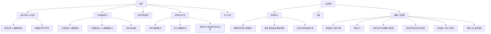

# 人体组织学 · 第1-2节 · 绪论与上皮组织

> 课程：人体组织学 | 日期：2026-08-31 | 教师：李和教授 | 课程内节次：第1-2节

## 一、知识结构

## 二、核心知识点

### （一）组织学定义

- **组织学（Histology）**：研究正常人体**微细结构**及其相关功能的科学。
- 词源：希腊语 `histos`（组织）+ `logos`（学问）。
- 两个关键词：**正常**、**结构**。

### （二）人体结构的两个层次

| 层次 | 观察方式 | 别称 | 度量单位 |
|------|---------|------|---------|
| 大体结构 | 肉眼 | 大体解剖学（Gross Anatomy） | — |
| 微细结构 | 显微镜 | 显微解剖学 | 微米(μm)/纳米(nm) |

- **光镜结构**：普通光学显微镜下可见（细胞核、细胞质、细胞器等），度量单位**微米(μm)**。
- **超微结构（电镜结构）**：电子显微镜下可见（染色质、细胞器如线粒体/内质网/溶酶体等），度量单位**纳米(nm)**。
- 组织学属于解剖学范畴（显微解剖学）。

### （三）组织的定义与四大基本组织

- **组织**：由形态和功能相同/相近的**细胞**及细胞产生的**细胞外基质**构成。
- **细胞外基质（Extracellular Matrix, ECM）**：包括纤维、基质和组织液。注意区分"基质"（ground substance）与"细胞外基质"（ECM），中文易混，ECM也称细胞间质。
- **四大基本组织**：上皮组织、结缔组织、肌组织、神经组织。
- **人体结构层次（微观→宏观）**：原子→分子→细胞器→细胞→组织→器官→系统→个体（九大系统）。

### （四）组织学在医学中的地位

1. **基础医学骨干学科**：形态学学科，为功能学提供结构基础。
2. **形态与功能的桥梁**：结构是功能的基础（如粗面内质网丰富→嗜碱性→蛋白质合成功能旺盛）。
3. **基础通向临床的桥梁**：
   - 疾病最早的病理改变在细胞层面（微观），严重时才出现宏观改变。
   - **病理诊断以正常组织学结构为标准/参照**（正常 vs 异常比较）。
4. **承上启下**：连接宏观解剖、微观结构、生理机能、疾病病理与诊断治疗。

### （五）组织学发展史（四阶段）

1. **显微镜发明**：
   - Janssen（16世纪末，荷兰眼镜商）：最早的透镜组合（放大镜思路）。
   - **Hooke（虎克）**：改进显微镜，观察软木塞薄片，发现蜂窝状小室，命名为 **cell（细胞）**（实际是植物细胞壁，细胞质已干缩）。
   - **Leeuwenhoek（列文虎克）**：发明可调焦距的显微镜，**首次看到活细胞**（精子、红细胞），并绘制精子图。
2. **19世纪技术突破**：切片机（1856年，英国）、包埋、染色方法发明 → 推动**细胞学说**确立 → 组织学成为独立学科。
3. **20世纪电镜时代**：电子显微镜 + 超薄切片机（50-60nm）→ 进入**超微结构**水平；随后细胞培养、活细胞工作站、流式细胞术、三维重建等技术。
4. **分子水平**：组织化学（1950s）、免疫组织化学、原位杂交 → 深入分子水平。

**中国科学家贡献**：
- 马文昭：中国组织学奠基人，研究线粒体/高尔基复合体与分泌功能关系。
- 鲍鑑清：率先开展组织细胞培养和电镜研究；发明蜂蜡包埋法替代冰箱冷藏（抗美援朝时期）。
- 骆清明院士：发明**显微光学切片断层成像技术（MOST/fMOST）**，全脑神经元完整展示，全球十大科学进展之一。

### （六）研究技术方法

#### 1. 光学显微镜技术

**标本制备：**
- **石蜡切片法**：取材→固定→脱水→透明→包埋（石蜡）→切片→脱蜡→染色。最常用，结构保存好，但流程繁琐、耗时。
- **冰冻切片法**：低温冷冻组织变硬后直接切片，**快速**（数十分钟），不需脱水透明包埋。适用于：①临床手术中快速病理诊断；②科研中保存化学成分（避免高温/化学试剂破坏）。
- **非切片法**：涂片（血液/培养细胞）、铺片（疏松结缔组织）、磨片（骨/牙等硬组织）。

**染色：**
- **HE染色**（最常用）：
  - **苏木精（Hematoxylin）**：碱性染料，将酸性物质（核酸、核糖体等）染成**蓝紫色** → 该物质称**嗜碱性（basophilia）**。
  - **伊红（Eosin）**：酸性染料，将碱性物质（细胞质、红细胞等）染成**红色** → 该物质称**嗜酸性（acidophilia）**。
  - 对两种染料均无亲和力 → **中性**。
  - HE = Hematoxylin + Eosin 首字母。
- **特殊染色**：
  - 甲苯胺蓝染肥大细胞颗粒 → 呈紫红色（染料本身蓝色）→ **异染性（metachromasia）**。
  - 镀银法（亲银/嗜银反应）：神经纤维、网状纤维，棕黑色。

**显微镜参数：**
- 普通光镜**分辨率**：0.2μm（能区分两点的最小距离）。
- 放大倍数：1000~1500倍。
- 特殊光镜：荧光显微镜、相差显微镜、倒置显微镜（观察活细胞）、共聚焦、超分辨显微镜。

#### 2. 电子显微镜技术

- 以**电子束**代替可见光，**电磁场**代替透镜。
- 分辨率：0.1~0.2nm（比光镜高约1000倍），放大数十万倍。
- **透射电镜（TEM）**：电子束穿过超薄切片（约60nm），不同结构电子密度不同 → 黑白图像。**电子密度高**（质量大）→ 黑；电子密度低 → 亮。
- **扫描电镜（SEM）**：电子束在组织表面扫描，产生二次电子 → 观察**表面立体结构**（如气管纤毛、红细胞双凹圆盘状）。

#### 3. 组织化学与细胞化学

- **PAS反应（过碘酸-希夫反应）**：检测多糖。
  - 原理：过碘酸氧化多糖的乙二醇基→醛基→与Schiff试剂（无色品红亚硫酸）结合→紫红色沉淀。
  - 应用：显示肝细胞糖原等。
- **免疫组织化学**：抗原-抗体反应，特异性显示组织中化学成分（可用荧光素或酶标记抗体）。
- **免疫电镜**：在超微结构水平定位抗原（胶体金颗粒标记）。
- **原位杂交**：碱基互补配对，检测组织中核酸（DNA/RNA）。

### （七）学习方法

1. **抓重点**：组织→细胞→细胞器层次，不过多关注大体或分子。
2. **理论与实践结合**：重视切片观察、实习。
3. **结构与功能联系**：如嗜碱性强→粗面内质网多→蛋白质合成功能旺盛。
4. **动态变化观念**：结构随功能状态变化（如肝糖原饥饿时减少、子宫内膜周期性变化）。
5. **立体概念**：二维切片→三维结构（如小肠绒毛不同切面）。
6. **总结归纳**：共性与个性（如小肠4层结构是共性，十二指肠/空肠/回肠差异是个性）。

### （八）上皮组织

#### 1. 基本特点

- **细胞排列紧密**，细胞外基质**极少**（光镜下几乎不可见）。
- **分层排列**：单层 / 复层。
- **极性明显**：细胞分**游离面**（朝向体表或腔面）、**基底面**（与基膜相连）、**侧面**（细胞间连接），各面结构功能不同。
- **无血管**：营养由深层结缔组织血管透过基膜供应。
- **神经末梢丰富**：感觉灵敏（如体表、手指）。

#### 2. 分类

- **被覆上皮**：覆盖体表或有腔器官腔面（最主要，本节重点）。
- **腺上皮**：以分泌功能为主（外分泌腺/内分泌腺）。
- 其他：肌上皮（收缩）、感觉上皮（感觉）、生殖上皮（生殖）。

#### 3. 被覆上皮命名原则

两个原则：
1. **细胞层数**：单层（一层）/ 复层（多层）。
2. **表层细胞形态**：扁平 / 立方 / 柱状。

#### 4. 各类型要点

| 类型 | 结构特点 | 分布 | 备注 |
|------|---------|------|------|
| 单层扁平上皮 | 一层扁平细胞，表面观多边形，侧面观薄 | **内皮**：心血管/淋巴管腔面；**间皮**：内脏器官外表面 | 表面光滑，利于血液流动/器官滑动 |
| 单层立方上皮 | 一层立方形细胞 | 肾小管、甲状腺滤泡等 | — |
| 单层柱状上皮 | 一层长柱状细胞 | 胃、肠、子宫等 | 小肠有**纹状缘**（微绒毛）和**杯状细胞**（分泌黏液，HE染色空泡状，PAS阳性） |
| 假复层纤毛柱状上皮 | 所有细胞附于基膜，但高矮不一，核位置不同，看似多层实为单层；游离面有纤毛 | 呼吸道（气管、支气管）腔面 | — |
| 复层扁平上皮 | 多层，表层扁平，基底层矮柱状，中间多边形 | **角化型**：皮肤表皮；**非角化型**：口腔、食管、阴道 | 基底面起伏不平（思考意义：扩大连接面积、加固） |
| 变移上皮 | 细胞层次和形状随器官充盈状态变化 | 泌尿系统（肾盏、肾盂、输尿管、膀胱） | 充盈时变薄、细胞拉长；排空时变厚、细胞变短 |

## 三、教师强调与易错点

- **嗜碱性 vs 嗜酸性**：物质本身是酸性的（如核酸），对碱性染料（苏木精）亲和力强 → 嗜碱性，染蓝紫色。物质本身是碱性的，对酸性染料（伊红）亲和力强 → 嗜酸性，染红色。**不要搞反染料性质和物质性质的对应关系。**
- **细胞外基质 vs 基质**：ECM（细胞外基质/细胞间质）包含纤维、基质、组织液；"基质"（ground substance）是ECM的组成部分之一。
- **内皮 vs 间皮**：都是单层扁平上皮，内皮在心血管/淋巴管腔面，间皮在胸膜/腹膜/心包膜（内脏外表面）。
- **杯状细胞**：是腺细胞，分泌黏液；HE染色呈空泡状（黏液被酒精溶解），PAS反应阳性。
- **复层扁平上皮基底面起伏不平**：扩大与结缔组织的连接面积，增加牢固性，同时扩大营养交换面积。

## 四、复习清单（10-15分钟）

- [ ] 组织学定义、光镜/超微结构的度量单位
- [ ] 四大基本组织名称
- [ ] Hooke和Leeuwenhoek的贡献区别
- [ ] HE染色原理：嗜碱性/嗜酸性/中性
- [ ] 石蜡切片 vs 冰冻切片的区别与适用场景
- [ ] TEM vs SEM 的区别
- [ ] PAS反应原理
- [ ] 上皮组织五大基本特点
- [ ] 被覆上皮命名原则
- [ ] 内皮/间皮、杯状细胞、纹状缘、变移上皮的概念

## 五、主动回忆题

**1. 为什么说组织学是病理诊断的基础？**
> 病理诊断通过与正常组织学结构比较来判断异常。疾病最早的改变发生在细胞/微观层面，只有掌握正常微细结构，才能识别早期病理改变。

**2. 光镜下看到一个细胞胞质呈强嗜碱性，推测它可能具有什么功能？为什么？**
> 蛋白质合成功能旺盛。嗜碱性意味着胞质含大量酸性物质（主要是核糖体/粗面内质网），而粗面内质网和核糖体是蛋白质合成的场所。

**3. 单层扁平上皮的内皮和间皮有何区别？**
> 内皮分布在心血管和淋巴管的腔面，间皮分布在胸膜、腹膜、心包膜（内脏器官外表面）。两者都是单层扁平上皮，表面光滑。

**4. 变移上皮如何适应膀胱的充盈和排空？**
> 充盈时上皮变薄、细胞层次减少、表层细胞拉长变扁；排空时上皮变厚、细胞层次增多、细胞变矮。这种变化使上皮既能保护膀胱壁，又能适应容积变化。

**5. 冰冻切片相比石蜡切片有什么优势？适用于什么场景？**
> 优势：快速（无需脱水透明包埋）、能较好保存化学成分（避免高温和化学试剂破坏）。适用于：①临床手术中快速病理诊断；②科研中需保存酶活性或小分子化学成分的检测。
