# 分析化学 · 第9-10节 · 紫外可见分光光度法（续）与朗伯比尔定律

> **课程信息**
> - 课程：分析化学（CHE0523）
> - 节次：第9-10节（课程内累计）
> - 日期：2026年9月15日（周二，第3周）
> - 授课老师：刘敏（副教授，化学与化工学院）
> - 上课地点：PBL教学楼6中(3层)
> - 课表标注主题：电位分析法1（实际授课内容为紫外可见分光光度法续讲+朗伯比尔定律+仪器构造，以实际内容为准）
> - 学时：2学时（08:00-09:40）

---

## 一、知识结构

```mermaid
flowchart TD
    A[紫外可见分光光度法] --> B[基本概念回顾]
    A --> C[有机化合物紫外吸收]
    A --> D[无机化合物紫外吸收]
    A --> E[应用实例：防晒霜]
    A --> F[朗伯比尔定律]
    A --> G[定律偏离因素]
    A --> H[仪器构造]
    
    B --> B1[分子光谱/吸收光谱]
    B --> B2[波长范围200-400nm/400-780nm]
    B --> B3[分子能级图：转动/振动/电子跃迁]
    B --> B4[吸收光谱定性三要素：峰位置/峰个数/峰相对高低]
    B --> B5[定量选λmax]
    
    C --> C1[跃迁类型：σ→σ*/n→σ*/π→π*/n→π*]
    C --> C2[允许跃迁vs禁阻跃迁]
    C --> C3[共轭体系：红移+增色]
    C --> C4[生色团与助色团]
    C --> C5[甲醛检测：乙酰丙酮衍生化]
    C --> C6[溶剂极性影响：π→π*红移/n→π*蓝移]
    
    D --> D1[d-d/f-f跃迁：配位场跃迁]
    D --> D2[电荷转移跃迁]
    
    E --> E1[对甲氧基肉桂酸酯类共轭结构]
    E --> E2[酯基侧链调节亲肤性]
    E --> E3[广谱防晒需多种成分]
    
    F --> F1[透射比T=It/I0]
    F --> F2[吸光度A=-logT]
    F --> F3[A=Kbc]
    F --> F4[吸光系数K与灵敏度]
    F --> F5[桑德尔灵敏度]
    F --> F6[吸光度加和性]
    F --> F7[标准曲线法]
    F --> F8[直接比较法]
    
    G --> G1[光学因素：非单色光/杂散光]
    G --> G2[物理化学因素：介质不均/浓度过高/化学反应]
    
    H --> H1[光源：卤钨灯350-2000nm/氘灯150-400nm]
    H --> H2[单色器：狭缝/准直镜/色散装置/聚焦镜]
    H --> H3[样品池：比色皿]
    H --> H4[检测器]
    H --> H5[数据处理/显示]
```



---

## 二、课前测试安排

老师在课程开始时宣布了课前测试安排：

- **测试时间**：下一次上课前占用约10分钟
- **题型**：单选题与判断题
- **测试范围**：完全覆盖第一章已讲授的全部内容（绪论、数据处理、样品相关），无超纲知识点
- 老师提前告知是为了避免学生产生突兀感

---

## 三、紫外可见分光光度法基本概念回顾

### 3.1 光学分析法与非光学分析法

- **光学分析法**：电磁辐射与分子或原子发生作用，有能量变化
- **非光学分析法**：如折射（能量无损失，仅角度变化）、完全弹性碰撞的散射（无能量变化）
- 本书主要介绍光学分析法，因为非光学分析法不好定量、定性也不好做

### 3.2 紫外可见分光光度法的分类归属

老师通过引导提问的方式回顾了关键分类：

1. **原子光谱还是分子光谱？** → **分子光谱**
   - 老师引导：三种运动状态决定能级——原子中电子的运动、原子之间的振动、整个分子的转动
   - 如果只有原子，只有一种运动状态（电子运动）
   - 有三种运动状态说明研究的是**分子**

2. **吸收光谱还是发射光谱？** → **吸收光谱**
   - 紫外、红外都是分子吸收能量后发生能级跃迁
   - 吸收了才跃迁，所以属于吸收光谱

> **⚠️ 必须掌握**：紫外可见分光光度法 = 分子光谱 + 吸收光谱

### 3.3 波长范围（必须背诵）

- **紫外波段**：200 ~ 400 nm（必须背）
- **可见波段**：400 ~ 780 nm（按教材）

老师强调："有个别东西还是要背的，200到400不能说按照刻度不想背。"

### 3.4 分子能级图与跃迁类型

| 跃迁类型 | 对应波段 | 是否本课研究对象 |
|---|---|---|
| 纯转动跃迁 | 远红外 | ❌ |
| 纯振动跃迁 | 红外 | ❌ |
| 电子跃迁 | 紫外可见 | ✅ |

- 电子跃迁的能级差足够大，对应的光波长恰好落在紫外可见范围内
- 不同分子结构对应不同的能级结构，因此吸收的光也不同

### 3.5 吸收光谱的应用

#### 定性分析

定性的三个依据：
1. **峰的位置**
2. **峰的个数**
3. **峰的相对高低**

如果多条曲线的峰个数、峰位置、峰相对高低都一样，可以判断基本是同一种物质，只是浓度不同。

#### 定量分析

- 定量时选择**最大吸收波长（λmax）**作为固定检测波长
- 选择λmax的原因：灵敏度最高（峰值处吸收最强）
- 这样做实验时不需要每次都扫一条完整曲线，只需找一个波长测量即可

### 3.6 分光光度计 vs 光度计

| 仪器 | 特点 | 功能 |
|---|---|---|
| **分光光度计** | 将一束光全部分开，每个波长都能测 | 可以做完整吸收光谱曲线 |
| **光度计** | 只有一个或少数几个波长的光，不连续 | 不能做吸收光谱，但可以选固定波长检测 |

- 便携式检测仪通常使用光度计（固定波长，仪器可以做得很小）
- 选波长时选最大吸收波长最合适

---

## 四、有机化合物的紫外吸收

### 4.1 生色团与助色团

#### 生色团（Chromophore）

- **定义**：含有不饱和化学键、可产生紫外可见吸收的结构基团
- 共轭程度越高，吸收特性越显著
- 可以产生颜色的基团

#### 助色团（Auxochrome）

- **定义**：自身没有共轭双键的π键结构，但带有孤对电子
- 作用：与生色团的双键或共轭体系发生进一步共轭，使颜色变深（红移+增色）
- 老师强调："助色团是有孤对电子的，知道这就可以了"

> **不需要背**：具体红移了多少nm不需要背，只要知道有这个现象即可

### 4.2 电子跃迁类型

#### σ→σ* 跃迁

- 能级差极大
- 对应**真空紫外**波段
- **为什么叫真空紫外**：空气中有很多含σ键的分子，会干扰检测，所以需要抽真空
- 含σ键的物质在做紫外可见时可以当做**溶剂**使用

#### n→σ* 跃迁

- 属于**禁阻跃迁**
- 检测灵敏度较低

#### π→π* 跃迁

- 属于**允许跃迁**
- 灵敏度高
- 波长有可能落在紫外附近

#### n→π* 跃迁

- 属于禁阻跃迁
- 后面在溶剂极性影响中会详细讨论

### 4.3 允许跃迁与禁阻跃迁

| 类型 | 跃迁概率 | 检测灵敏度 | 例子 |
|---|---|---|---|
| **允许跃迁** | 几率非常大 | 高 | σ→σ*、π→π*（名字相同的跃迁） |
| **禁阻跃迁**（forbidden） | 几率非常小 | 差 | n→σ*、n→π* |

- "允许"不是人为允许，而是规律性总结出来的——名字相同的跃迁（如σ→σ*、π→π*）几率非常大
- 跃迁几率大 = 发生跃迁的分子多 = 检测灵敏度高

### 4.4 共轭体系的影响

#### 共轭增大 → 红移 + 增色

- **红移**：吸收波长向长波方向移动（"红"只是形容词，形容很长，不一定真到红色波段）
- **增色**：吸光能力增强（颜色变深）
- 例子：番茄红素（共轭体系大，有颜色）

#### 分子轨道理论解释

- 共轭时，电子不再局限于某个原子所有，而是属于整个共轭体系
- 电子受到的束缚变少，流动性增大
- 发生跃迁的几率变大 → 灵敏度升高
- 这就是共轭体系增大时吸光能力上升的原因

### 4.5 甲醛的检测——衍生化的应用

#### 甲醛本身有没有紫外可见吸收？

- 甲醛有双键（C=O），但是一个**孤立的双键**
- 氧可以提供孤对电子，但没有大的共轭体系
- 结论：**甲醛本身没有紫外可见吸收**（没有颜色）

#### 国标检测方法

- 国标方法：**可见分光光度法**（不是紫外，是可见）
- 原理：甲醛本身无色，需要通过**衍生化**反应生成有大共轭体系的有色产物

#### 乙酰丙酮法（最常用的国标方法之一）

- 试剂：乙酰丙酮 + 氨
- 条件：沸水浴加热（不用沸水反应很慢）
- 反应：甲醛与乙酰丙酮在氨存在下发生反应，**成环**
- 产物特点：
  - 成环后含有氮（提供孤对电子 → 助色团）
  - 有双键（生色团）
  - 同时有生色团和助色团 → 有颜色
  - 产物颜色：**黄色**

> **启示**：即使本来没有紫外可见吸收的物质，也可以通过特异性反应（衍生化）使其产生紫外可见吸收。这就是分光光度法应用非常广泛的原因。

### 4.6 溶剂极性对紫外可见吸收的影响

> 老师特别说明：这个知识点书上在后面，但因为后面讲荧光还要用一次，所以提前在这里讲。

#### 基本原理

将物质放入不同极性的溶剂中（如非极性的己烷 vs 极性的醇），吸收波长会发生变化。

极性溶剂通过**偶极-偶极作用力**或**氢键**与溶质分子发生作用，使分子更稳定 → 能量降低。

#### π→π* 跃迁

- 在极性溶剂中，π*轨道降低的幅度比π轨道更大
- → 能级差**变小**
- → 波长**变长**
- → **红移**

#### n→π* 跃迁

- n轨道（孤对电子）在极性溶剂中容易形成**氢键**
- 氢键作用力大于其他分子间作用力
- → n轨道能量降低的幅度**更大**
- → 能级差**变大**
- → 波长**变短**
- → **蓝移**（又称紫移）

> **⚠️ 必须掌握**：π→π* 在极性溶剂中红移；n→π* 在极性溶剂中蓝移

#### 应用实例

某物质在己烷中λmax=305 nm，在乙醇中λmax=307 nm，问是n→π*还是π→π*？

- 波长从305→307，变长了 → 红移
- → **π→π* 跃迁**

这个规律可以帮助解析未知分子的结构特征。

---

## 五、无机化合物的紫外吸收

### 5.1 d-d / f-f 跃迁（配位场跃迁）

#### 原理

- d轨道有5个简并轨道（能量相同，光谱学上叫"简并"=简单合并）
- 当有**配位场**存在时，d轨道发生**能级分裂**（如3个轨道能量低，2个轨道能量高）
- 分裂后产生能级差 → 电子可以在分裂后的轨道间跃迁 → 吸收能量
- f轨道同理（7个简并轨道）

#### 关键前提

- **必须有d/f轨道上的电子**
- 例子：
  - Cu²⁺有d电子 → 有颜色
  - Cu⁺没有d电子 → 无论什么情况下都没有颜色
  - Na⁺没有d电子 → 没有颜色

#### 配位场的影响

- 配位分子不同（如水 vs 氨），能级分裂程度不同
- → 吸收波长不同
- 例子：
  - 无水CuSO₄固体：白色/无色（无可见光吸收）
  - CuSO₄·5H₂O / CuSO₄水溶液：蓝色（水配位）
  - 加氨水后：深蓝色（氨配位，分裂程度不同）
  - 注意：深蓝和蓝不是颜色深浅的区别，而是波长变了

#### 灵敏度特点

- d-d跃迁的**吸光系数不大**（约几百的样子）
- 硫酸铜溶液看起来颜色很深，是因为**溶解度大、浓度高**，不是因为吸光能力强
- 低浓度的硫酸铜不好测

### 5.2 电荷转移跃迁

#### 原理

- 分子内部不同组分之间发生电子转移
- 从一个轨道到另一个轨道的电子转移 = 能级跃迁
- 吸光能力**非常强**，检测灵敏度高
- 是无机物吸光的**主要类型**

#### 实例1：卤化银

| 化合物 | 颜色 | 原因 |
|---|---|---|
| AgCl | 白色（无颜色） | Cl电负性大，电子不易转移 |
| AgBr | 浅黄色 | Br电负性较小，较易转移 |
| AgI | 颜色更深 | I电负性最小，最易转移 |

- 银有空轨道，卤素离子有孤对电子（电子多）
- 电负性越小的卤素越容易给出电子 → 越容易发生电荷转移 → 颜色越深

#### 实例2：硫氰化铁

- 颜色：**血红色**
- 对应电荷转移跃迁
- 可用于**三价铁离子的高灵敏检测**（因为吸光能力强，只要一点点就能测出来）

> **需要知道的**：有机化合物也可能发生电荷转移跃迁（大的有机分子中电子从一个基团跑到另一个基团）。不需要背具体波长和吸光系数，但要知道这两个名字（配位场跃迁、电荷转移跃迁）。

---

## 六、应用实例：防晒霜的成分分析

### 6.1 防晒的基本原理

- 防晒 = 防紫外线（不是防可见光，防可见光涂黑色就行）
- 两种防晒渠道：
  1. **全反射**：涂得很白很厚，把光全反掉（不实用）
  2. **吸收紫外**：防晒霜本身透明无色，只吸收紫外光

### 6.2 防晒霜的核心活性成分

老师对比了多个品牌（百雀羚、资生堂、美国品牌、日本品牌、德国品牌等）的成分表：

**共同的核心防晒基团**：对甲氧基肉桂酸酯类

- 对甲氧基肉桂酸辛酯
- 四甲氧基肉桂酸二乙基己酯

> 老师指出："对甲氧基"和"四甲氧基"其实是一样的，学过化学就不会被厂家宣传糊弄。

### 6.3 结构分析

- **防晒活性部分**：对甲氧基肉桂酸的共轭双键结构（所有品牌完全一样）
- **酯基侧链**：
  - 辛酯（8个碳，直链）
  - 二乙基己基酯（也是8个碳，带支链）
  - 属于同分异构体
- 酯基侧链**不起防晒作用**（连孤对电子都没提供）
- → 对紫外吸收曲线**没有影响**
- → 不同品牌的防晒功能**基本一样**

### 6.4 酯基侧链的真正作用

- 调节**亲肤性**和**脂溶性**
- 影响使用感受：
  - 涂脸的产品感觉不油
  - 涂手/胳膊的产品感觉油光光的
  - 有的容易推匀，有的黏糊糊推不匀
- 所以不能说厂家完全是骗人的——化妆品需要考虑方方面面

### 6.5 广谱防晒

- 紫外波段200-400nm
- 单一防晒成分只覆盖其中一段（对人伤害最大的那一段）
- 要**广谱防晒**需要添加多种成分
- 看防晒霜成分表会发现不止一个防晒成分
- 标准检测方法：涂在石英板上（厚度按国标规定），测紫外吸收

> **判断能否用紫外可见检测的方法**：先找双键、找共轭。没双键没共轭就不能直接用；有双键还可以像甲醛那样做衍生化。

---

## 七、光的吸收定律——朗伯比尔定律

### 7.1 基本概念

#### 光的入射与出射

- I₀ = 入射光强度
- Iₐ = 被吸收的光强度
- Iₜ = 透射光强度
- Iᵣ = 反射光强度（通过使用同一个比色皿可以消除）

当使用同一个比色皿（表面一致）时：
**I₀ = Iₐ + Iₜ**

#### 比色皿的使用注意事项

- 出厂时配套的四个比色皿表面基本一致（做过实验）
- 但经过很多同学使用后，可能东拿西拿，就不配套了
- 建议：做实验时尽量用同一个比色皿
- 检查配套性的方法：装一样的东西测，看信号是否一样
- 研究生/毕业设计可以自己有一套配套的

### 7.2 透射比（Transmittance, T）

- **定义**：T = Iₜ / I₀
- 透射比与浓度**不成正比**（没有线性关系）
- 但有相关性，可以拟合

### 7.3 吸光度（Absorbance, A）

- **定义**：A = -log T = -log(Iₜ/I₀) = log(I₀/Iₜ)
- 为什么要定义吸光度？因为**-logT与浓度成正比**
- 每次写-logT太费劲，所以命名为"吸光度"

### 7.4 朗伯比尔定律（Lambert-Beer Law）

**A = Kbc**

- A = 吸光度（无单位）
- K = 吸光系数（有单位，随浓度单位变化）
- b = 液层厚度/光程长度（通常单位cm）
- c = 吸光物质的浓度

#### 定律的完整表述

> 当一定强度的**单色光**通过含有吸光物质的**透明、均一**的溶液时，溶液的吸光度与吸光物质的浓度和液层厚度成正比。

#### 朗伯 vs 比尔

- **朗伯**：A ∝ b（吸光度与液层厚度成正比）
- **比尔**：A ∝ c（吸光度与浓度成正比）
- 有时候别人叫"比尔定律"，其实也是同一个东西

#### 限制条件（必须掌握）

1. **单色光**——不是所有的光，必须是单色光
2. **透明均一溶液**——排除散射光（如果有颗粒会发生散射，I₀ ≠ Iₐ+Iₜ，还需加散射光Iₛ）

> 老师强调："不要看简单的一句话，里边每个限制词都有它的意义。"

### 7.5 吸光系数K与灵敏度

#### K的物理意义

- K反映了吸光物质的**灵敏度**
- A = Kbc中，K和b就是标准曲线的**斜率**
- 灵敏度 = 斜率

#### K的影响因素

1. **吸光物质本身的性质**（有的物质吸光，有的不吸光）
2. **入射光的波长**（吸收曲线中有的波长吸收强，有的弱）
3. **溶液的性质**（溶剂极性，会发生红移/蓝移）
4. 温度（也有关系，但主要强调前三个）

#### 灵敏度的判断标准

- K > 10⁴ → 灵敏度高
- 硫酸铜的K约 < 10² → 比较小
- 高锰酸钾的K约 10³ → 比硫酸铜好，可以用紫外方法

#### K的单位

- A无单位（T是比值，取对数后无单位）
- b有单位（通常cm）
- c有单位（mol/L、g/L、百分浓度等）
- → K必须有单位，且单位随浓度单位变化而变化
- 当c用mol/L时，K常写作ε（摩尔吸光系数）

> **考试注意**：填空题算K值时一定要带单位！不带单位会扣分（如2分题给1分，3分题给1分）。

### 7.6 桑德尔灵敏度（Sandell Sensitivity）

- 了解即可，不需要背
- 历史背景：1982年IUPAC统一规定"灵敏度=标准曲线斜率"之前，各领域权威人士各自规定灵敏度
- 桑德尔灵敏度定义：当A=0.01时，单位截面积光程所能检出的吸光物质的最低含量
- **桑德尔灵敏度越小越好**（注意：与常规灵敏度越大越好相反！）
- 看到"灵敏度"要先看有没有前缀

### 7.7 吸光度的加和性

- 如果溶液中有多种吸光物质，且彼此之间**没有相互作用**（不反应，已平衡）
- → 总吸光度 = 各物质吸光度之和
- **A总 = A₁ + A₂ + A₃ + ...**

#### 对选择性的影响

- 仪器不知道是谁吸收的，只知道某个波长处有吸收
- → 紫外可见分光光度法的**选择性不好**
- 干扰的根本来源就是吸光度的加和性

#### 实例：锰的检测

- 测Mn²⁺时，将其氧化为MnO₄⁻（紫色，K≈10³）
- 但Co²⁺也有类似颜色（粉红色），可能产生干扰
- 干燥剂中的硅胶加了Co²⁺作为指示剂：无水时蓝色，吸水后变红色（配位场变化）

---

## 八、定量分析方法

### 8.1 标准曲线法（校准曲线法）

1. 配制一系列不同浓度的标准溶液
2. 测每个浓度对应的A值
3. 打点、拟合一条直线 → A = Kbc
4. 未知溶液测Aₓ，代入求cₓ

- 优点：含的点多，拟合好，比较靠谱
- 标准曲线至少**5个点**才比较靠谱
- 应用最广泛

### 8.2 直接比较法（Calculation Method）

- 英文叫"calculation"（直接算一算），中文翻译为"直接比较法"（老师认为中文翻译得好）
- 原理：
  - A标 = Kb c标
  - A样 = Kb c样
  - 两式相比，K消掉 → c样 = c标 × (A样/A标)
- 优点：快，便携式仪器常用
- 注意事项：**标样浓度与待测溶液浓度要接近**（因为标准曲线有线性范围，不知道范围在哪就只能让浓度接近以减小误差）
- 现在仪器计算能力强了，便携式仪器也多用标准曲线法

---

## 九、朗伯比尔定律的偏离

### 9.1 概述

- 朗伯比尔定律是本章最重要的定律，希望一直能用，不要有偏离
- 偏离 = 不成线性了
- 需要研究哪些因素会造成偏离

### 9.2 光学因素

#### 非单色光的影响

**影响1：灵敏度降低**

- 如果光源不是单色光（谱带宽度大），会把λmax附近灵敏度低的区域也包进去
- 测出来的整体值偏小 → 灵敏度降低
- 实例：高锰酸钾溶液在525nm处，谱带宽度越宽，测出来的吸光度越低

**影响2：对高浓度影响更大**

- 高浓度时，非单色光造成的相对误差更大
- 推导：真实值在λmax处，观测值是谱带宽度内的平均值；高浓度时峰更陡，平均值偏离更多

> **⚠️ 必须掌握**：朗伯比尔定律**不适合高浓度**（只适合低浓度），原因之一就是非单色光的影响。

**谱带宽度（Δλ）**

- 用大的Δλ表示宽度（不是波长）
- 越窄 → 灵敏度越高
- 这很反常识：有人觉得谱带宽度越大吸收越多，但我们看的是**吸光程度**，不是绝对吸收量

#### 杂散光的影响

**散射光**

- 溶液中有灰尘等颗粒时产生散射
- 散射光无方向性，朝各个方向散
- → Iₜ变小（部分光被散掉没到达检测器）
- → A变大（A = log(I₀/Iₜ)）

**仪器杂散光（Stray Light）**

- 仪器内部的反射镜、镜头等落灰
- 阻碍光路，导致数据偏离
- 杂散光是造成朗伯比尔定律偏离的**主要因素**
- 偏离方向：朝下（高浓度区域弯曲）
- 杂散光越多 → 线性范围越窄 → 高浓度越不能用
- 新仪器比旧仪器好用（干净）
- 仪器一般不自己拆开擦（过了保质期可以）

### 9.3 物理化学因素

1. **介质不均匀**：有小颗粒 → 反射、散射
2. **浓度过高**：高浓度受非单色光影响大，且分子间碰撞等相互作用增强
3. **化学反应**：发生反应生成另一种物质 → 完全变了

> 这一页PPT需要知道：有哪些光学因素、哪些物理化学因素。

---

## 十、紫外可见分光光度计的构造

### 10.1 五大部件（必须会画排布图）

整本书中任何一个仪器都要求会画部件排布图：

```
光源 → 单色器 → 样品池 → 检测器 → 数据处理/显示
```

- 可以是线性布局，也可以拐弯
- 不一定要画图标，直接写字即可（光源、单色器、样品池、检测器、数据处理）
- 前面四个是核心

### 10.2 光源

#### 对光源的基本要求

- 强度大
- 连续
- 稳定性好
- 能提供200~780nm的波长范围

#### 钨灯/卤钨灯（可见光源）

- **原理**：钨是良导体，加电压后电流大→发热→热致发光（跟太阳一样）
- **波长范围**：350 ~ 2000 nm
  - 可见（400-780nm）完全够用
  - 还包含红外（红外治疗仪的原理）
  - 350-400nm有少量紫外
- **卤钨灯的改进**：
  - 纯钨灯缺点：钨会升华→钨丝变细→灯泡发黑→寿命短
  - 卤钨灯：加入卤素（碘/溴），钨升华后与卤素反应生成碘化钨/溴化钨（气态）
  - 气态化合物跑到钨丝附近（高温）→分解→钨又回到钨丝上→循环使用
  - → 寿命长
  - 汽车远光灯就是卤钨灯（"高强度卤素灯"）
- **光强与电压的关系**：I ∝ V⁴（四次方关系）
  - → 电压必须非常稳定，需要**稳压电源**
  - 微小的电压波动会造成很大的光强变化
  - 如果实验中光强非常不稳，怀疑稳压电源坏了
- **工作温度**：2000~3000K，非常烫，开机时不要碰

#### 氘灯（紫外光源）

- 属于放电灯
- **波长范围**：150 ~ 400 nm
- 常用范围：200 ~ 350 nm
- 比氙灯强度更大，所以用氘灯
- 价格较贵（大几百块钱），体积很小（笔尖大小）

#### 双光源切换

- 紫外可见仪器通常配两个灯：卤钨灯（可见）+ 氘灯（紫外）
- 紫外仪器一般多配一个钨灯就可以做可见；但可见仪器不一定配氘灯
- 切换点通常在350nm附近（也可以自己设360nm等）
- 扫描200~800nm时，在350nm附近会听到轻微的"咔嗒"声（换灯）
- 老式仪器需要手动拨反光镜切换，现在仪器自动切换

### 10.3 单色器

- 作用：把复色光变成单色光
- 是一个黑匣子（不能敞开）
- 构造（了解即可，不用背）：
  1. **入射狭缝**（slit）
  2. **准直镜**（collimating mirror）：把光变成平行光
  3. **色散装置**（dispersion）：把光分成不同颜色（棱镜或光栅）
  4. **聚焦镜**（focusing mirror）：把选中的波长聚到出射狭缝
  5. **出射狭缝**
- 转动色散装置可以选择不同的出射波长

### 10.4 样品池

- 即比色皿
- 四面透光
- 注意使用同一个比色皿以消除反射光影响

### 10.5 检测器与数据处理

- 检测器：检测透过光Iₜ
- 数据处理/显示：读出吸光度数值

---

## 十一、老师强调重点汇总

1. **紫外可见分光光度法 = 分子光谱 + 吸收光谱**（必须会判断）
2. **波长范围**：紫外200-400nm，可见400-780nm（必须背）
3. **吸收光谱定性三要素**：峰位置、峰个数、峰相对高低
4. **定量选λmax**（最大吸收波长）
5. **允许跃迁vs禁阻跃迁**：σ→σ*、π→π*是允许跃迁（灵敏度高）；n→σ*、n→π*是禁阻跃迁（灵敏度低）
6. **共轭增大→红移+增色**
7. **生色团**（含不饱和键）vs **助色团**（含孤对电子）
8. **甲醛检测**：乙酰丙酮+氨衍生化，产物黄色
9. **溶剂极性影响**：π→π*红移，n→π*蓝移（必须掌握）
10. **无机化合物两种跃迁**：d-d/f-f配位场跃迁（需有d/f电子，灵敏度低）、电荷转移跃迁（灵敏度高，主要类型）
11. **防晒霜核心成分**：对甲氧基肉桂酸酯类共轭结构；酯基侧链调节亲肤性
12. **朗伯比尔定律**：A = Kbc，单色光+透明均一溶液
13. **吸光度**：A = -logT，无单位
14. **K有单位**，考试必须带单位
15. **K>10⁴为高灵敏度**
16. **吸光度加和性**：A总 = A₁+A₂+...（选择性不好的根源）
17. **标准曲线法**至少5个点；**直接比较法**标样与试样浓度要接近
18. **朗伯比尔定律不适合高浓度**（非单色光对高浓度影响大）
19. **非单色光→灵敏度降低**；**杂散光→主要偏离因素**
20. **仪器五大部件**：光源→单色器→样品池→检测器→数据处理（会画排布图）
21. **卤钨灯**：350-2000nm，热致发光，I∝V⁴需稳压
22. **氘灯**：150-400nm，放电灯，紫外光源
23. **下次课前测试**：10分钟，单选+判断，覆盖第一章全部内容

---

## 十二、课程间关联

| 关联课程 | 关联内容 |
|---|---|
| 有机化学 | 共轭体系、电子跃迁类型、生色团/助色团、甲醛与乙酰丙酮反应 |
| 物理化学/无机化学 | 配位场理论、d轨道分裂、电荷转移 |
| 仪器分析 | 朗伯比尔定律是所有光学分析法的基础 |
| 生物化学 | 蛋白质/核酸的紫外定量（280nm/260nm）基于本定律 |
| 医学研究规范 | 实验数据处理中的标准曲线法应用 |

---

## 十三、复习清单

### 基本概念
- [ ] 能判断紫外可见分光光度法属于分子光谱+吸收光谱
- [ ] 背诵紫外(200-400nm)和可见(400-780nm)波长范围
- [ ] 理解分子能级图中转动/振动/电子跃迁对应的波段
- [ ] 掌握吸收光谱定性三要素（峰位置/峰个数/峰相对高低）
- [ ] 理解定量选择λmax的原因
- [ ] 区分分光光度计与光度计

### 有机化合物紫外吸收
- [ ] 掌握四种电子跃迁类型（σ→σ*、n→σ*、π→π*、n→π*）及其波段
- [ ] 区分允许跃迁与禁阻跃迁，理解与灵敏度的关系
- [ ] 理解共轭体系增大导致红移+增色的分子轨道理论解释
- [ ] 掌握生色团与助色团的定义和区别
- [ ] 理解甲醛检测的衍生化原理（乙酰丙酮法）
- [ ] **重点掌握**溶剂极性对π→π*（红移）和n→π*（蓝移）的不同影响

### 无机化合物紫外吸收
- [ ] 理解d-d/f-f跃迁（配位场跃迁）的原理和前提（需有d/f电子）
- [ ] 掌握硫酸铜不同配位环境的颜色变化实例
- [ ] 理解电荷转移跃迁的原理和高灵敏度特点
- [ ] 掌握卤化银颜色递变和硫氰化铁的实例

### 应用与实例
- [ ] 理解防晒霜的核心活性结构（对甲氧基肉桂酸酯类）
- [ ] 理解酯基侧链的作用（亲肤性，不影响防晒）
- [ ] 理解广谱防晒需要多种成分

### 朗伯比尔定律
- [ ] 掌握透射比T和吸光度A的定义和关系
- [ ] **重点掌握**朗伯比尔定律A=Kbc及其限制条件（单色光、透明均一）
- [ ] 理解吸光系数K的物理意义和影响因素
- [ ] 掌握K的单位（考试必须带单位）
- [ ] 了解桑德尔灵敏度（越小越好）
- [ ] 理解吸光度加和性及其对选择性的影响
- [ ] 掌握标准曲线法（至少5点）和直接比较法（浓度接近）

### 定律偏离
- [ ] 理解非单色光导致灵敏度降低的原理
- [ ] 理解非单色光对高浓度影响更大
- [ ] **掌握**朗伯比尔定律不适合高浓度
- [ ] 理解杂散光是主要偏离因素
- [ ] 了解物理化学因素（介质不均/浓度过高/化学反应）

### 仪器构造
- [ ] **会画**紫外可见分光光度计五大部件的排布图
- [ ] 掌握卤钨灯的原理、波长范围、I∝V⁴需稳压
- [ ] 掌握氘灯的波长范围和用途
- [ ] 理解双光源切换机制
- [ ] 了解单色器的基本构造

---

## 十四、主动回忆题

### 题目1
为什么紫外可见分光光度法属于分子光谱而不是原子光谱？请从分子运动状态的角度解释。

<details>
<summary>点击查看答案</summary>

分子有三种运动状态决定其能级：①原子中电子的运动；②原子之间的振动；③整个分子的转动。如果只有原子，只有电子运动一种状态。紫外可见分光光度法研究的是包含这三种运动状态的体系，因此属于分子光谱。具体来说，紫外可见对应的是分子外层电子的跃迁（能级差足够大，对应紫外可见波段），而纯转动跃迁对应远红外，纯振动跃迁对应红外。
</details>

### 题目2
将某物质从非极性溶剂己烷移到极性溶剂乙醇中，发现其λmax从305nm变为307nm。请判断该跃迁类型并解释原因。

<details>
<summary>点击查看答案</summary>

波长从305nm变长到307nm → 红移 → **π→π*跃迁**。

原因：在极性溶剂中，π*轨道（反键轨道）的能量降低幅度比π轨道更大，导致π→π*的能级差变小。根据E=hc/λ，能级差变小对应波长变长，即红移。

对比：如果是n→π*跃迁，n轨道（孤对电子）在极性溶剂中容易形成氢键，能量降低幅度更大，导致能级差变大，波长变短（蓝移/紫移）。
</details>

### 题目3
为什么无水硫酸铜是白色的，而五水硫酸铜和硫酸铜水溶液是蓝色的，加氨水后变成深蓝色？请用配位场跃迁理论解释。

<details>
<summary>点击查看答案</summary>

Cu²⁺有d电子，在配位场作用下d轨道发生能级分裂，产生能级差，电子在分裂后的d轨道间跃迁（d-d跃迁），吸收可见光，从而显示颜色。

- 无水CuSO₄：没有配位水分子，d轨道不发生分裂（简并），无能级差，不吸收可见光 → 白色/无色
- CuSO₄·5H₂O/水溶液：H₂O作为配体与Cu²⁺配位，d轨道分裂 → 吸收特定波长可见光 → 蓝色
- 加氨水后：NH₃取代H₂O成为配体，NH₃的配位场强度与H₂O不同，d轨道分裂程度不同 → 吸收波长改变 → 深蓝色（注意深蓝和蓝是波长不同，不是深浅不同）

d-d跃迁的前提是必须有d轨道电子。Cu⁺没有d电子，因此无论什么配位环境都没有颜色。
</details>

### 题目4
朗伯比尔定律A=Kbc中，为什么吸光系数K必须有单位？K的大小与哪些因素有关？

<details>
<summary>点击查看答案</summary>

**K必须有单位的原因**：
- 吸光度A = -logT，T是Iₜ/I₀的比值（无单位），取对数后仍无单位
- b（光程）有单位（通常cm）
- c（浓度）有单位（mol/L、g/L等）
- 由A=Kbc可知，K的单位必须使Kbc的乘积无单位，因此K = A/(bc) 必有单位
- K的单位随浓度单位的变化而变化（c用mol/L时K写作ε，单位L·mol⁻¹·cm⁻¹）

**K的影响因素**：
1. 吸光物质本身的性质（内因）
2. 入射光的波长（不同波长吸收能力不同，λmax处K最大）
3. 溶液的性质/溶剂（极性不同会导致红移/蓝移，影响K）
4. 温度

K反映了检测灵敏度：K>10⁴为高灵敏度；K越大，标准曲线斜率越大，灵敏度越高。
</details>

### 题目5
为什么朗伯比尔定律只适用于低浓度溶液，而不适用于高浓度？请从非单色光的角度解释。

<details>
<summary>点击查看答案</summary>

**非单色光导致灵敏度降低**：
实际光源不可能是绝对单色光，总有一定的谱带宽度Δλ。如果Δλ较大，会把λmax附近灵敏度较低的区域也包进去，测出来的吸光度是谱带宽度内的平均值，比真实值（λmax处）偏小，导致灵敏度降低。

**对高浓度影响更大**：
高浓度时吸收曲线更陡峭（峰更尖），谱带宽度内不同波长的吸光度差异更大，平均值偏离真实值更多；而低浓度时曲线较平缓，平均值偏离较小。因此非单色光对高浓度的相对误差更大。

此外，高浓度时分子间距离小，碰撞等相互作用增强，也会导致偏离朗伯比尔定律。因此朗伯比尔定律有线性范围，只适用于低浓度。
</details>

### 题目6
请画出紫外可见分光光度计的结构示意图，并说明卤钨灯和氘灯各自的作用和波长范围。

<details>
<summary>点击查看答案</summary>

**结构示意图**：
```
光源 → 单色器 → 样品池 → 检测器 → 数据处理/显示
```

**卤钨灯**：
- 可见光源（也覆盖近红外和少量紫外）
- 波长范围：350 ~ 2000 nm
- 原理：钨丝通电发热→热致发光；加入卤素（碘/溴）形成卤钨循环，延长寿命
- 特点：光强I∝V⁴，需要稳压电源；工作温度高（2000-3000K）

**氘灯**：
- 紫外光源
- 波长范围：150 ~ 400 nm（常用200~350nm）
- 原理：放电灯
- 特点：比氙灯强度大，价格较贵，体积小

双光源仪器通常在350nm附近自动切换（老式仪器需手动拨反光镜），扫描全波段时会听到轻微的"咔嗒"换灯声。
</details>

---

> **笔记说明**：本笔记基于2026年9月15日分析化学课堂完整逐字稿整理，涵盖老师讲授的全部知识点、举例、强调点和课堂互动。课表标注主题为"电位分析法1"，但实际授课内容为紫外可见分光光度法续讲+朗伯比尔定律+仪器构造，命名以实际内容为准。
