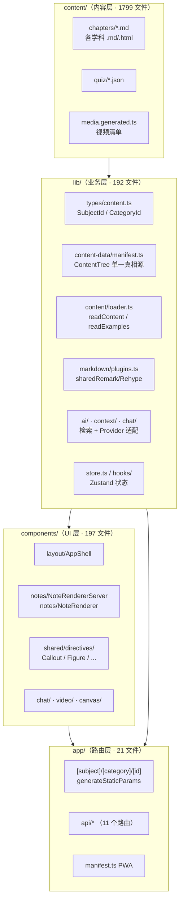
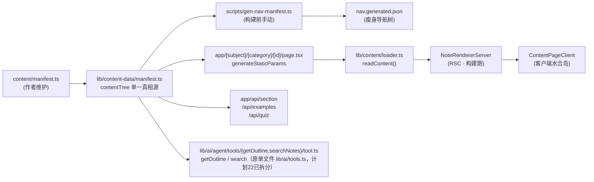
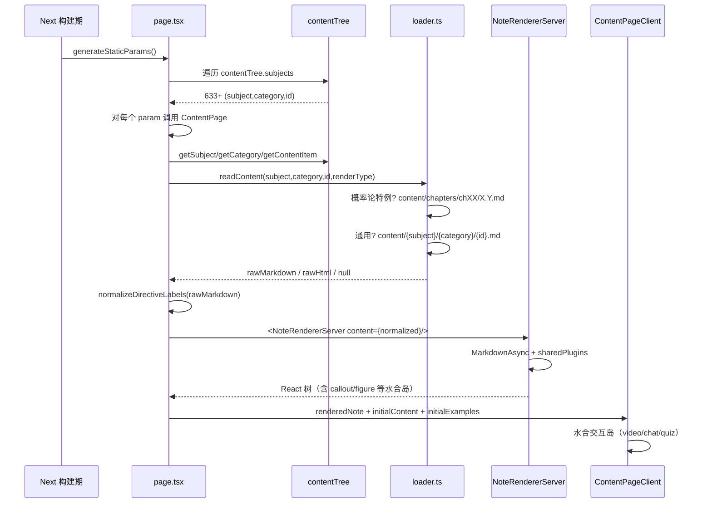

# 维度 01：项目总览与架构哲学 深度调研报告

> **调研人**：Agent-A（架构与渲染调研员）
> **调研日期**：2026-07-05
> **项目版本**：gailvlun v0.3.1（package.json 标 0.4.0，CHANGELOG 已记录 v0.4.0 发版）
> **关联文档**：`docs/refer/rendering-architecture.md`、`docs/refer/storage-architecture.md`、`docs/refer/performance-audit-report.md`、`docs/sop/subject-onboarding.md`、`README.md`、`CHANGELOG.md`
>
> **2026-09 校对说明**（计划 `25`）：正文两处 `directiveComponents` / `noteComponents.tsx` 路径引用已更新为现网位置（`components/shared/directives/registry.ts` / `components/notes/noteComponents.tsx`，计划 `23` 从 `lib/markdown/` 搬出）；其余架构性结论（学科无关设计、SubjectId/CategoryId、概率论特例路径等）未变，未逐条重新核实。

## 1. 执行摘要

gailvlun 是一个由课堂录音逐字稿驱动的多学科辅助学习应用，以「期末复习工作站」为产品形态，覆盖概率论、大学物理、有机化学、中国近现代史纲要、毛概、大学英语 CET-4 六大异构学科。其架构核心是**学科无关的内容树（ContentTree）+ 共享渲染核心（sharedRemarkPlugins/sharedRehypePlugins）+ 服务端预渲染（NoteRendererServer）** 三层模型。

项目采用 Next.js 16 App Router + React 19 RSC 体系，将内容（`content/`，1799 文件）与代码（`lib/`、`components/`）严格分离，通过 `lib/content-data/manifest.ts` 这一**单一真相源**驱动导航、路由、SSG 预渲染、AI 工具、搜索等所有消费方。架构哲学可概括为「**学科无关设计 + 共享渲染核心 + SSR/CSR 边界前移**」：6 个学科共享同一条数据流（manifest → loader → NoteRendererServer → ContentPageClient），新增学科的边际成本被压缩到「类型字面量 + manifest 条目 + 内容文件 + 可选交互组件注册」四步。

技术选型整体偏激进（Next 16 + React 19 + Tailwind 4 + RSC），但通过 `dynamic(ssr:false)` 把重型客户端依赖（视频、聊天、画布、交互组件）隔离为水合岛，避免了 RSC 体系的常见陷阱。从 v0.0 到 v0.3.1 的演进呈现清晰的「单科 → 多科 → 性能重构 → 桌面端」四阶段路径，关键转折点在 v0.3.0 的统一窗口管理与 v0.3.1 的 Storage v2 + RSC 化。

## 2. 架构总览

### 2.1 整体分层



### 2.2 数据流总览



### 2.3 SSR/CSR 边界

项目把 RSC 边界前移到 `page.tsx` 一层：服务端在构建期就完成 Markdown → HTML（含 KaTeX、highlight.js）的完整渲染，浏览器只接收渲染好的 React 树。所有交互岛（视频播放器、聊天面板、画布、`callout` 内的可折叠组件）通过 `"use client"` 与 `dynamic(ssr:false)` 成为水合岛，保留客户端能力。

## 3. 核心机制详解

### 3.1 学科无关设计（SubjectId + CategoryId）

**类型定义**（`lib/types/content.ts:3-15`）：

```typescript
export type SubjectId = 'probability' | 'physics' | 'chemistry' | 'modern-history' | 'maogai' | 'other';
export type CategoryId = string;  // 彻底解耦，不再为联合类型
export const SUBJECT_IDS: readonly SubjectId[] = [...];
export function isSubjectId(value: string | undefined | null): value is SubjectId {...}
```

关键设计：`SubjectId` 是固定的 6 个字面量联合类型（运行时与编译期双重校验），而 `CategoryId` 被刻意降级为 `string`——`subject-onboarding.md` 注释「彻底解耦后 CategoryId 不再是固定联合类型」表明这是从联合类型回归 string 的有意决策，目的是让新学科可以自由定义分类（如 `english`、`kaoqian-moni`、`shizhan-yanlian`）而无需改类型。

### 3.2 共享渲染核心

`lib/markdown/plugins.ts:12-49` 导出 `sharedRemarkPlugins` 与 `sharedRehypePlugins` 两个数组，是笔记侧（`NoteRendererServer` / `NoteRenderer`）与聊天侧（`MessageContent`）**唯一**的插件来源：

- **remark 链**：`remarkGfm` → `remarkMath` → `remarkDirective` → 自定义 `remarkDirectives`（指令归一）→ `remarkCalloutSoftBreaks`（callout 内软换行）
- **rehype 链**：`rehypeRaw` → `rehypeKatex`（throwOnError:false）→ `rehypeHighlight`（detect:false + subset 白名单）

`rendering-architecture.md` 明确「禁止在 NoteRenderer 或 MessageContent 中直接内联插件配置」，这一约束通过 `noteComponents.tsx`（2026-09 现网路径 `components/notes/noteComponents.tsx`，计划 `23` 从 `lib/markdown/` 搬出）的纯对象映射保证。

### 3.3 6 学科共存机制

所有学科共享同一条数据流（`manifest.ts` → `loader.ts` → `page.tsx` → `NoteRendererServer`），差异仅体现在：

| 维度 | 概率论（特例） | 其他学科（通用） |
|---|---|---|
| Markdown 路径 | `content/chapters/chXX/X.Y.md` | `content/{subject}/{category}/{itemId}.md` |
| 视频清单 | `media.generated.ts` | `media.{subject}.generated.ts` |
| 交互组件 | `components/interactives/{subject}/` | 同左 |
| 主题色 | `SUBJECT_COLORS` 统一表 | 同左 |
| 学科图标 | `SUBJECT_ICONS` 统一表 | 同左 |

`lib/content/loader.ts:54-86` 的 `readContentMarkdown` 通过 `if (subjectId === "probability" && categoryId === "detail")` 分支保留概率论的旧路径约定，其他学科走通用路径。这是「历史包袱」与「通用性」的妥协。

### 3.4 学科扩展成本模型

按 `docs/sop/subject-onboarding.md` 的 5 步接入法，新增一个学科的边际成本：

| 步骤 | 改动点 | 是否必选 | 工作量 |
|---|---|---|---|
| 1 | `lib/types/content.ts` 添加 `SubjectId` 字面量 + `SUBJECT_IDS` | 必选 | 1 行 |
| 2 | `lib/content-data/manifest.ts` 添加 subject 对象 | 必选 | ~30 行 |
| 3 | 创建 `content/{subject}/{category}/*.md` | 必选 | 内容规模 |
| 4 | `lib/constants/subjects.ts` 注册 SUBJECTS/SUBJECT_ICONS/SUBJECT_COLORS | 必选 | 3 行 |
| 5 | `components/interactives/registry.ts` 注册交互组件 | 可选 | 视组件数 |

类型系统会自动校验：未在 `SUBJECT_IDS` 中的字面量在 `isSubjectId()` 运行时守卫中被拒绝，路由层 `app/[subject]/[category]/[id]/page.tsx:41-43` 调用 `notFound()` 兜底。

### 3.5 技术选型决策

| 选型 | 版本 | 决策理由（基于代码与文档） | 评级 |
|---|---|---|---|
| Next.js | 16.2.9 | App Router + RSC + SSG，`generateStaticParams` 全量预渲染 633+ 内容项 | 超前（最新稳定） |
| React | 19.2.7 | RSC + `use()` + `MarkdownAsync`（异步 Markdown）依赖 19 | 超前 |
| TypeScript | 5.7.3 strict | `tsconfig.json` strict 模式，类型守卫保障学科扩展安全 | 保守（已稳定） |
| Tailwind | 4.0 | `@import "tailwindcss"` 必须为 globals.css 第一行 | 超前（主版本） |
| Zustand | 5.0.3 | 轻量、SSR 安全、与 `idb-keyval` 配合做 Storage v2 | 保守 |
| KaTeX | 0.16.21 | mhchem 副作用补丁（见 §3.6） | 保守 |
| react-markdown | 9.0.3 | 支持 RSC 的 `MarkdownAsync`，配合 sharedRemark/Rehype | 保守 |
| framer-motion | 11.x | `optimizePackageImports` 按需导入 | 保守 |
| Electron | 42.5.0 | 桌面端打包（v0.3.1 起为可选产物） | 保守 |

### 3.6 KaTeX mhchem 单例陷阱

`next.config.mjs:20-26` 注释明确禁止将 `katex` 加入 `optimizePackageImports`：

> katex 不可加入——它靠 `import "katex/contrib/mhchem"` 的副作用给 katex 单例打补丁，barrel 优化的深层导入改写会破坏该单例关系，导致 SSR 包里 mhchem 的气体箭头 `^`、三键 `#` 等惰性特性失效。

`lib/markdown/plugins.ts:7` 通过裸 `import "katex/contrib/mhchem"` 注入化学方程式支持。这是 barrel 优化与副作用模块冲突的典型坑位，项目通过注释固化这一约束。

## 4. 数据流与调用链路

### 4.1 内容加载主链路（SSG）



### 4.2 客户端路由切换

虽然 `dynamicParams = false` + `revalidate = false` 意味着所有页面在构建期已预渲染，但客户端导航仍会触发 `page.tsx` 重新执行（在 Node Function 中读取内容）。`ContentPageClient.tsx:96-97` 注释强调「客户端切换路由时 page.tsx 会重新做服务端渲染并以新 prop 下发，无需再 fetch /api/section，消除瀑布与骨架闪烁」。

## 5. 关键代码路径

### 5.1 单一真相源

- `lib/types/content.ts:1-50` — 类型定义
- `lib/content-data/manifest.ts:119-498` — `contentTree` 对象（6 学科完整树）
- `lib/content-data/manifest.ts:504-521` — 兼容旧概率论 manifest（`@deprecated`）
- `lib/content-data/index.ts:21-76` — `getSubject/getCategory/getContentItem/getSiblings` 查询函数

### 5.2 内容加载

- `lib/content/loader.ts:54-86` — `readContentMarkdown`（概率论特例 + 通用路径）
- `lib/content/loader.ts:92-109` — `readContentHtml`（HTML 类型）
- `lib/content/loader.ts:115-128` — `readContent`（按 renderType 分发）
- `lib/content/loader.ts:139-155` — `deriveExampleKey`（例题路径推导）

### 5.3 渲染入口

- `app/[subject]/[category]/[id]/page.tsx:16-30` — `generateStaticParams`
- `app/[subject]/[category]/[id]/page.tsx:37-96` — `ContentPage`（SSR 入口）
- `components/notes/NoteRendererServer.tsx:15-25` — RSC 渲染器
- `components/notes/NoteRenderer.tsx:12-24` — 客户端渲染器（流式场景）

### 5.4 学科配置

- `lib/constants/subjects.ts:3-46` — SUBJECTS / SUBJECT_ICONS / SUBJECT_COLORS / subjectColor()
- `app/page.tsx:13-24` — 首页 BookCard 通过 `subjectColor` 渲染学科主色

## 6. 设计决策与取舍分析

### 6.1 为什么用 RSC + SSG 而非 CSR SPA

- **取舍**：牺牲构建时间（633+ 页面预渲染）换首屏性能与 SEO
- **理由**：学习类内容长尾、低更新频率，SSG 一次构建多次复用收益高；KaTeX/highlight 在客户端解析会阻塞主线程 200-500ms，构建期烘焙可消除
- **代价**：构建慢、内容更新需重新部署（`revalidate = false` 关闭了 ISR）

### 6.2 为什么 CategoryId 是 string 而非联合类型

- **取舍**：失去编译期类型检查，换学科扩展灵活性
- **理由**：不同学科分类差异大（`detail`/`recording`/`summary`/`textbook`/`kaoqian-moni`/`shizhan-yanlian`/`english`/`misc`/`gongshi`/`guihua`），硬编码联合类型会随学科扩张不断改类型
- **代价**：运行时校验依赖 `getCategory()` 查 manifest，类型安全降级

### 6.3 为什么概率论走特例路径

- **取舍**：保留历史 `content/chapters/` 路径，避免迁移成本
- **理由**：概率论是最早的学科（v0.0 起就有），1799 个内容文件中概率论占大头，迁移成本与回归风险高于收益
- **代价**：`loader.ts` 出现 `if (subjectId === "probability" && categoryId === "detail")` 分支，新学科不会复用此路径

### 6.4 为什么用 `optimizePackageImports` 但排除 katex

- **取舍**：lucide-react/framer-motion 体积下降 vs katex 单例破坏
- **理由**：lucide-react 18 处具名导入通过 barrel 优化改写为深层导入，显著减小 bundle；katex 靠 `mhchem` 副作用给单例打补丁，barrel 改写会破坏单例
- **代价**：katex 必须全量打包，但 mhchem 是化学方程式必需

### 6.5 为什么 manifest.ts 同时有 contentTree 和 deprecated manifest

- `lib/content-data/manifest.ts:504-521` 的 `manifest` 对象仅覆盖概率论 detail，注释 `@deprecated 仅覆盖概率论 detail 分类。新代码应直接使用 contentTree`
- 这是 v0.0 → v0.3 多科化重构的过渡产物，保留是为了兼容旧消费方（如 `loader.ts:15-17` 的 `findChapter`）

## 7. 问题清单

| # | 问题描述 | 严重程度 | 涉及文件 | 建议修复方向 |
|---|----------|----------|----------|--------------|
| 1 | `package.json` 版本号 `0.4.0` 与 README/任务描述的 `v0.3.1` 不一致，CHANGELOG 已记录 0.4.0 发版，但调研任务声明版本为 v0.3.1 | P2 | `package.json:3`、`README.md`、`CHANGELOG.md:5` | 统一版本口径，确认调研基准 |
| 2 | `loader.ts:54-86` 概率论走 `content/chapters/` 特例路径，与通用路径分裂；新增学科不会复用，存在历史包袱 | P2 | `lib/content/loader.ts:59-72` | 长期可将概率论迁移到 `content/probability/detail/`，但需同步 1799 文件移动 |
| 3 | `manifest.ts:504-521` 的 deprecated `manifest` 对象仍被 `loader.ts` 的 `findChapter/locateSection/getOutlineText/searchNotes` 使用，未彻底清理 | P2 | `lib/content-data/manifest.ts:504-521`、`lib/content/loader.ts:11-31,513-559` | 多科化版本（`getMultiSubjectOutline`/`searchAllContent`）已存在，旧函数可在确认无外部消费方后下线 |
| 4 | `app/[subject]/layout.tsx`、`app/[subject]/[category]/layout.tsx`、`app/[subject]/[category]/[id]/layout.tsx` 三个 layout 文件均为空 `<>{children}</>`，未承担任何职责 | P3 | `app/[subject]/layout.tsx` 等 | 可移除以简化路由树，或承载学科级 metadata/边界 |
| 5 | `nav.generated.json`（633 id）由 `scripts/gen-nav-manifest.ts` 手动生成，未挂入 `prebuild` 钩子，存在内容树更新后忘记重新生成导致导航与内容不同步的风险 | P1 | `package.json:12`、`scripts/gen-nav-manifest.ts` | 把 `gen-nav` 加入 `prebuild` 钩子（与 `gen:script-ids` 并列） |
| 6 | `next.config.mjs` 的 `outputFileTracingExcludes` 排除 `content/_raw` 与 `content/examples`，但 `outputFileTracingIncludes` 又包含 `content/**/*`，规则有冲突风险 | P3 | `next.config.mjs:13-18` | 显式细化 include 规则，避免 _raw/examples 被重复计算 |
| 7 | `lib/content-data/manifest.ts` 单文件 524 行，含 6 学科所有分类与条目，可读性下降 | P3 | `lib/content-data/manifest.ts` | 已部分拆分到 `probability-detail.ts` 等子文件，可继续将录音/纪要/考前模拟抽到子文件 |
| 8 | `app/layout.tsx:10` 的 `bootstrapScript` 是单行 4KB+ 内联脚本，可读性差且未压缩 | P3 | `app/layout.tsx:10` | 抽到独立 `.ts` 文件并经 build 优化，或保留但加分段注释 |

## 8. 改进建议

### P0（高收益 · 低风险）

无 P0 问题。当前架构在「单科 → 多科」转型上已基本完成，性能与扩展性达到个人项目平均水平之上。

### P1（中收益 · 低风险）

- **把 `gen-nav` 加入 prebuild**：与 `gen:script-ids` 并列，确保 `nav.generated.json` 与 `manifest.ts` 永远同步（见问题 #5）
- **下线 deprecated manifest 旧 API**：`getOutlineText` / `searchNotes` / `findChapter` 在多科化版本稳定后清理（见问题 #3）

### P2（中收益 · 中风险）

- **统一内容路径约定**：将概率论 `content/chapters/` 迁移到 `content/probability/detail/`，消除 loader 特例分支（见问题 #2）。需配合 1799 文件移动与 manifest id 更新，建议在 v0.5.0 大版本执行
- **拆分 `manifest.ts`**：按学科拆到子文件，主文件只做聚合（见问题 #7）

### P3（低优先）

- 清理空 layout 文件（#4）
- 压缩或拆分 `bootstrapScript`（#8）
- 细化 `outputFileTracingIncludes` 规则（#6）

## 9. 与全自动化平台改造的关系

本维度对平台化改造的影响：

1. **学科无关设计已具备平台化基础**：`SubjectId` + `CategoryId` + `contentTree` 三件套是平台化的核心抽象，新增学科成本可控（5 步接入法）。平台化时可在此基础上做「学科插件包」机制（每个学科一个独立 npm 包或目录，自动注册到 contentTree）。
2. **共享渲染核心是平台化的关键资产**：`sharedRemarkPlugins` + `directiveComponents`（2026-09 现网路径 `components/shared/directives/registry.ts`）让任何学科的内容都能复用同一渲染管线，平台化时应保留这一约束，避免新学科自带渲染器导致渲染分裂。
3. **manifest 单一真相源是平台化的核心契约**：所有消费方（导航、路由、AI、搜索）都从 `contentTree` 取数，平台化时应将 manifest 升级为「平台 API」，支持运行时注册（而非仅构建期静态导入）。
4. **概率论特例路径是平台化的债务**：迁移到通用路径（#2）应作为平台化前置任务。
5. **deprecated manifest 残留是平台化的清理项**：旧 API 下线（#3）应作为平台化前的代码清理。
6. **SSG 全量预渲染在内容规模扩张后会成为构建瓶颈**：633 页面尚可，但若平台化后接入 10+ 学科、5000+ 页面，需评估改用 ISR（`revalidate: 3600`）或按需渲染。
7. **nav.generated.json 手动生成是平台化的运维风险**：平台化后应由平台自动维护，不能依赖开发者手动跑 `pnpm gen-nav`。

## 10. 参考资料

### 项目内文档

- `README.md` — 项目总览、技术栈、目录结构
- `CHANGELOG.md` — v0.0 → v0.4.0 演进时间线
- `docs/refer/rendering-architecture.md` — 共享渲染架构规范
- `docs/refer/storage-architecture.md` — 存储架构规范
- `docs/refer/performance-audit-report.md` — 性能审查报告（2026-06-28）
- `docs/sop/subject-onboarding.md` — 多学科接入 SOP

### 关键源码

- `lib/types/content.ts` — 类型定义
- `lib/content-data/manifest.ts` — 内容树单一真相源
- `lib/content-data/index.ts` — 查询函数
- `lib/content/loader.ts` — 内容加载器
- `lib/markdown/plugins.ts` — 共享渲染插件链
- `app/[subject]/[category]/[id]/page.tsx` — SSG 入口
- `next.config.mjs` — 构建配置与 barrel 优化约束
- `package.json` — 依赖与脚本

### 外部文档

- [Next.js 16 App Router](https://nextjs.org/docs/app)
- [React 19 RSC](https://react.dev/reference/rsc/server-components)
- [remark-directive](https://github.com/remarkjs/remark-directive)
- [KaTeX mhchem](https://github.com/KaTeX/KaTeX/tree/main/contrib/mhchem)
