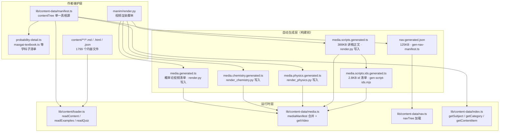
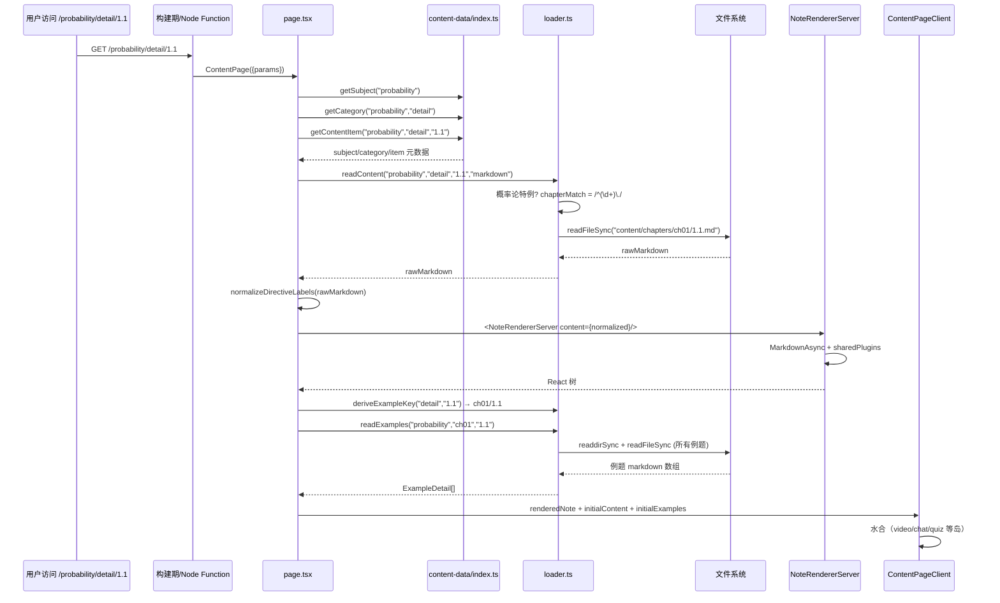

# 维度 02：内容管理系统 深度调研报告

> **调研人**：Agent-A（架构与渲染调研员）
> **调研日期**：2026-07-05
> **项目版本**：gailvlun v0.3.1
> **关联文档**：`docs/sop/subject-onboarding.md`、`docs/refer/rendering-architecture.md`、`docs/refer/performance-audit-report.md`

## 1. 执行摘要

gailvlun 的内容管理系统是一个**双层 manifest 驱动 + 文件系统直读 + 自动生成清单辅助**的混合架构。核心契约是 `lib/content-data/manifest.ts` 中的 `contentTree` 对象，它以 `Subject → Category → ContentItem` 三层树描述全部 6 学科、~633 个内容项的元数据；实际正文（Markdown/HTML/JSON）则散落在 `content/` 下 1799 个文件中，由 `lib/content/loader.ts` 按 `(subjectId, categoryId, itemId)` 三元组定位。

系统采用**学科无关的路径约定**：除概率论走 `content/chapters/` 历史特例外，其他学科一律 `content/{subjectId}/{categoryId}/{itemId}.md`。三种 `renderType`（markdown/html/component）通过 `readContent` 分发到不同加载器：markdown/html 走文件系统，component 走客户端 `componentRegistry` 套表。

媒体清单系统由三份自动生成文件组成：`media.generated.ts`（概率论视频，155 条）+ `media.chemistry.generated.ts` + `media.physics.generated.ts` 合并为 `mediaManifest.videos`；`media.scripts.generated.ts`（388KB 讲稿正文）+ `media.scripts.ids.generated.ts`（2.8KB id 清单）形成「id 索引 + 按需加载正文」的二级懒加载机制。`nav.generated.json` 是 `manifest.ts` 的瘦身快照（仅 id/title/status，125KB），专供侧边栏等纯导航 UI 使用。

## 2. 架构总览



## 3. 核心机制详解

### 3.1 内容树数据结构（ContentTree）

完整数据结构定义于 `lib/types/content.ts:1-50`：

```typescript
interface ContentTree {
  subjects: Subject[];  // 6 个学科
}
interface Subject {
  id: SubjectId;        // 'probability' | 'physics' | ...
  name: string;
  icon: string;         // lucide 图标名
  categories: Category[];
}
interface Category {
  id: string;           // 'detail' | 'recording' | ...
  name: string;
  items: ContentItem[];
}
interface ContentItem {
  id: string;           // '1.1' / 'rec-01' / 'ch01' / ...
  title: string;
  type: 'section' | 'document';
  status?: 'done' | 'draft' | 'stub';
  summary?: string;
  videoIds?: string[];
  interactiveIds?: string[];
  children?: ContentItem[];  // 章节嵌套（如概率论 ch01 → 1.1/1.2/...）
  renderType?: RenderType;   // 'markdown' | 'html' | 'component'
}
```

**关键设计**：
- `children` 字段支持任意深度嵌套，概率论 `detail` 用它表达「章 → 节」二级结构（如 `ch01 → 1.1, 1.2, ...`）
- `renderType` 默认为 `markdown`，仅在 `other` 学科下的特殊条目（`exam-source`/`gongshi`/`schedule`）显式声明 `html`
- `status` 三态：`done`（已写正文）/ `draft`（草稿）/ `stub`（占位）。`page.tsx:55` 中 `item?.status ?? "stub"` 兜底
- `type: 'section'` 与 `type: 'document'` 在路由层面无差异（都走 `generateStaticParams`），仅在 UI 文案上区分

### 3.2 manifest.ts 与 content/manifest.ts 的关系

项目根 `content/` 目录下**没有** `manifest.ts`——所有内容元数据集中在 `lib/content-data/manifest.ts`。这是一个**纯 TypeScript 模块**（非 JSON），允许：

1. 直接 import 子清单（`probability-detail.ts`、`maogai-textbook.ts` 等 7 个子文件）
2. 在文件内组装复合条目（如 `examPlaceholderCategories`、`physicsKaoqianMoniItems` 等局部变量）
3. 类型系统在编译期校验 `contentTree` 符合 `ContentTree` 接口

### 3.3 SubjectId + CategoryId 学科无关设计

**`SubjectId`**（`lib/types/content.ts:3-11`）：

```typescript
export type SubjectId = 'probability' | 'physics' | 'chemistry'
                      | 'modern-history' | 'maogai' | 'other';
export const SUBJECT_IDS: readonly SubjectId[] = [...];
export function isSubjectId(value: string | undefined | null): value is SubjectId {
  return value != null && (SUBJECT_IDS as readonly string[]).includes(value);
}
```

`isSubjectId` 是运行时类型守卫，被 `app/[subject]/[category]/[id]/page.tsx:41`、`app/[subject]/review/page.tsx:38`、`components/layout/AppShell.tsx:52` 等所有路由入口消费。

**`CategoryId`** 被刻意降级为 `string`（`lib/types/content.ts:4`），不再为联合类型。理由（来自 `subject-onboarding.md` 注释）：「彻底解耦后 CategoryId 不再是固定联合类型」。当前已使用的 CategoryId：

| CategoryId | 中文名 | 使用学科 |
|---|---|---|
| `textbook` | 教材 | modern-history、maogai、probability(physics/chemistry 占位) |
| `detail` | 详解 | 全部 6 学科 |
| `recording` | 课上录音 | 5 学科（other 除外） |
| `summary` | 课堂纪要 | 5 学科 |
| `kaoqian-moni` | 考前模拟 | 5 学科 |
| `shizhan-yanlian` | 实战演练 | probability、modern-history、maogai |
| `english` | 英语练习 | other 专用 |
| `misc` | 工具 | other 专用 |
| `gongshi` | 公式 | other 专用 |
| `guihua` | 规划 | other 专用 |

### 3.4 新增学科的完整步骤

按 `docs/sop/subject-onboarding.md`：

1. **类型注册**：在 `lib/types/content.ts:3` 的 `SubjectId` 联合类型追加字面量，同步 `SUBJECT_IDS` 数组（`lib/types/content.ts:9`）
2. **学科配置**：在 `lib/constants/subjects.ts:3-37` 的三张表（`SUBJECTS`/`SUBJECT_ICONS`/`SUBJECT_COLORS`）追加条目
3. **manifest 注册**：在 `lib/content-data/manifest.ts:119-498` 的 `contentTree.subjects` 数组追加 subject 对象（含 categories 与 items）
4. **内容文件**：创建 `content/{subjectId}/{categoryId}/{itemId}.md`（推荐）或 `content/{subjectId}/{categoryId}/{itemId}.html`
5. **可选：交互组件**：在 `components/interactives/registry.ts`（或 `lib/content/componentRegistry.tsx`）注册 `::interactive{id=...}` 引用的组件
6. **可选：视频清单**：通过 manim 渲染脚本写入 `media.{subject}.generated.ts`

类型系统会自动校验：未注册的 SubjectId 在 `isSubjectId()` 运行时被拒绝；未在 manifest 中的 categoryId/itemId 在 `getCategory()`/`getContentItem()` 查询时返回 undefined，触发 `notFound()`。

### 3.5 内容加载机制（loader.ts）

`lib/content/loader.ts:115-128` 的 `readContent` 是统一入口：

```typescript
export function readContent(subjectId, categoryId, itemId, renderType?): string | null {
  if (renderType === "html") return readContentHtml(subjectId, categoryId, itemId);
  if (renderType === "component") return null;  // 客户端处理
  return readContentMarkdown(subjectId, categoryId, itemId);
}
```

**Markdown 路径分流**（`lib/content/loader.ts:54-86`）：

| 学科 / 分类 | 路径模板 | 示例 |
|---|---|---|
| probability / detail | `content/chapters/ch{NN}/{itemId}.md` | `1.1` → `content/chapters/ch01/1.1.md` |
| probability / detail（章级） | `content/chapters/{itemId}/index.md` | `ch01` → `content/chapters/ch01/index.md` |
| 其他学科 | `content/{subjectId}/{categoryId}/{itemId}.md` | `physics/detail/1.1.md` |

**HTML 路径**（`lib/content/loader.ts:92-109`）：统一 `content/{subjectId}/{categoryId}/{itemId}.html`，无特例。

**component 类型**：不走文件系统，返回 null。客户端通过 `lib/content/componentRegistry.tsx:28-49` 的 `ComponentRenderer` 按 `(subjectId, categoryId, itemId)` 查表渲染。

### 3.6 例题系统（examples）

例题独立于正文，存放在 `content/examples/{subjectId?}/{chapterId}/{sectionId}/*.md`。路径推导逻辑（`lib/content/loader.ts:139-155`）：

```typescript
export function deriveExampleKey(categoryId, itemId): { chapterId, sectionId } {
  if (categoryId === "english") return { chapterId: itemId, sectionId: itemId };
  if (categoryId === "recording" && /^rec-\d{2}$/.test(itemId))
    return { chapterId: "recording", sectionId: itemId };
  if (categoryId === "textbook") { ... }
  if (categoryId !== "detail") return { chapterId: "", sectionId: "" };
  const n = parseInt(itemId.split(".")[0], 10);
  return { chapterId: `ch${String(n).padStart(2, "0")}`, sectionId: itemId };
}
```

`page.tsx:70-76` 在 SSR 阶段预读全部例题（含正文），通过 `initialExamples` prop 下发，避免客户端切换时再 fetch。`EXAMPLE_CATEGORIES = new Set(["detail", "recording", "textbook", "english"])` 限定只有这四类才尝试加载例题。

### 3.7 题库系统（quiz）

题库存放在 `content/quiz/{subjectId}/{chapterId}.json`，由 `readQuiz`（`lib/content/loader.ts:265-277`）读取：

```typescript
const QUIZ_ROOT = path.join(process.cwd(), "content", "quiz");
export function readQuiz(subjectId, chapterId): unknown | null {
  if (!/^[a-zA-Z0-9_-]+$/.test(subjectId) || !/^[a-zA-Z0-9_-]+$/.test(chapterId)) return null;
  const file = path.join(QUIZ_ROOT, subjectId, `${chapterId}.json`);
  try { return JSON.parse(fs.readFileSync(file, "utf8")); } catch { return null; }
}
```

正则校验 `^[a-zA-Z0-9_-]+$` 防路径穿越。`/api/quiz` 路由（`app/api/quiz/route.ts:14-25`）仅做透传：命中返回 200 + JSON，未命中返回 404 + `{ quiz: null }`。

### 3.8 媒体清单系统

**视频清单合并**（`lib/content-data/media.ts:13-27`）：

```typescript
export const mediaManifest: MediaManifest = {
  videos: [...generatedVideos, ...chemistryVideos, ...physicsVideos],
};
// 防御：视频 id 必须全局唯一
(() => {
  const seen = new Set<string>();
  for (const v of mediaManifest.videos) {
    if (seen.has(v.id)) throw new Error(`[media] 重复的视频 id: "${v.id}"`);
    seen.add(v.id);
  }
})();
```

IIFE 守卫在模块加载时立即抛错，避免跨学科视频 id 冲突导致 `getVideo(id)` 静默返回错视频。

**VideoEntry 结构**（`lib/content/types.ts:42-56`）：

```typescript
interface VideoEntry {
  id: string;             // 全局唯一，如 "ch01-1.4-classical"
  subjectId: SubjectId;
  chapterId: string;      // "ch01"
  sectionId: string;      // "1.4"
  title: string;
  src: string;            // "/media/videos/ch01/ch01-1.4-classical.mp4"
  poster?: string;
  duration?: number;
  description?: string;
  scriptMd?: string;      // 视频配套讲稿原文
}
```

**讲稿二级懒加载**（`scripts/gen-script-ids.mjs:6-9`）：

- `media.scripts.generated.ts`（388KB）：完整的 `id → markdown` 大对象，由 manim 渲染脚本生成
- `media.scripts.ids.generated.ts`（2.8KB）：仅含 id 数组，由 `gen-script-ids.mjs` 在 prebuild 阶段从前者抽取

VideoTab 用 id 清单判断「是否显示配套讲稿按钮」，仅当用户首次展开时才 `dynamic import` 加载 388KB 本体。这是性能优化报告（`performance-audit-report.md` P2 项）提到的「例题 SSR meta-only + 按需 fetch」模式的同类设计。

**生成时机**：
- `media.generated.ts` / `media.scripts.generated.ts`：manim 渲染脚本运行时写入（`pnpm render`）
- `media.scripts.ids.generated.ts`：prebuild 阶段（`package.json:12` 的 `gen:script-ids`）
- `nav.generated.json`：手动运行 `pnpm gen-nav`

### 3.9 nav.generated.json 导航生成

**生成器**（`scripts/gen-nav-manifest.ts:1-34`）：

```typescript
function slimItem(item: ContentItem): ContentItem {
  const out = { id: item.id, title: item.title, type: item.type, status: item.status };
  if (item.children?.length) out.children = item.children.map(slimItem);
  return out;  // 仅保留 id/title/type/status/children，丢弃 summary/videoIds/interactiveIds/renderType
}
const nav = { subjects: contentTree.subjects.map(...) };
fs.writeFileSync('lib/content-data/nav.generated.json', JSON.stringify(nav, null, 2));
```

**消费方**（`lib/content-data/nav.ts:1-5`）：

```typescript
import nav from './nav.generated.json';
export const navTree = nav as ContentTree;  // 类型断言为完整 ContentTree
```

`navTree` 被 `components/layout/SubjectSidebar.tsx`、`MobileChapterPicker.tsx` 等侧边栏组件消费。瘦身后的 JSON 仅 125KB（vs 完整 manifest.ts 的 ~20KB 源码 + 子文件，但 manifest 含函数与类型注解不能直接 JSON 化）。

### 3.10 多科内容查找与搜索

`lib/content/loader.ts:293-316` 的 `findContentItem` 是 AI 工具与搜索的基础：

```typescript
export function findContentItem(subjectId, categoryId, itemId) {
  for (const subject of contentTree.subjects) {
    if (subject.id !== subjectId) continue;
    for (const cat of subject.categories) {
      if (cat.id !== categoryId) continue;
      for (const item of cat.items) {
        if (item.id === itemId) return { subjectName, categoryName, item };
        if (item.children) {
          const child = item.children.find(c => c.id === itemId);
          if (child) return { ..., parentTitle: item.title, item: child };
        }
      }
    }
  }
}
```

`SEARCHABLE_CATEGORIES = new Set(["detail", "recording", "summary", "textbook"])`（`loader.ts:290`）限定搜索范围，排除 `kaoqian-moni`/`shizhan-yanlian` 等试卷类。

`searchAllContent`（`loader.ts:485-499`）走「hybridSearch（BM25 + 向量）→ fallback 子串匹配」两级检索；生产环境未构建索引时**禁用**子串全扫（`loader.ts:501-507`），避免 O(N) 扫描 1799 文件。

## 4. 数据流与调用链路

### 4.1 内容加载时序



### 4.2 媒体消费链路

```mermaid
flowchart LR
    subgraph Build["构建期"]
        Render["manim/render.py"]
    end

    subgraph Auto["自动生成"]
        MG["media.generated.ts"]
        MS["media.scripts.generated.ts<br/>388KB"]
        MSI["media.scripts.ids.generated.ts<br/>2.8KB · prebuild"]
    end

    subgraph Runtime["运行时"]
        Media["lib/content-data/media.ts<br/>mediaManifest 合并 + getVideo"]
        VideoTab["components/video/VideoTab"]
    end

    Build -->|写入| MG
    Build -->|写入| MS
    MS -->|抽取| MSI

    MG --> Media
    MS --> Media
    MSI --> VideoTab
    Media --> VideoTab

    VideoTab->|首次展开讲稿| MS
```

## 5. 关键代码路径

### 5.1 类型与契约

- `lib/types/content.ts:1-50` — `SubjectId`/`CategoryId`/`ContentItem`/`ContentTree` 类型定义
- `lib/content/types.ts:1-60` — `SectionRef`/`ChapterRef`/`Manifest`/`VideoEntry`/`MediaManifest` 旧契约（部分已 deprecated）

### 5.2 单一真相源

- `lib/content-data/manifest.ts:119-498` — `contentTree` 完整树
- `lib/content-data/manifest.ts:504-521` — 兼容旧概率论 `manifest`（`@deprecated`）
- `lib/content-data/index.ts:21-76` — `getSubject`/`getCategory`/`getContentItem`/`getSiblings` 查询函数

### 5.3 内容加载

- `lib/content/loader.ts:54-86` — `readContentMarkdown`（含概率论特例）
- `lib/content/loader.ts:92-109` — `readContentHtml`
- `lib/content/loader.ts:115-128` — `readContent`（按 renderType 分发）
- `lib/content/loader.ts:139-155` — `deriveExampleKey`（例题路径推导）
- `lib/content/loader.ts:194-237` — `readExamplesMeta`/`readExampleById`（例题读取）
- `lib/content/loader.ts:265-277` — `readQuiz`（题库读取）

### 5.4 媒体清单

- `lib/content-data/media.ts:13-27` — `mediaManifest` 合并与去重守卫
- `lib/content-data/media.ts:29-45` — `getVideo`/`getVideosForSection`
- `lib/content-data/media.generated.ts:1-` — 概率论视频清单（155 条，render.py 写入）
- `lib/content-data/media.scripts.ids.generated.ts:1-` — 讲稿 id 清单（prebuild 生成）
- `scripts/gen-script-ids.mjs:1-43` — id 清单生成器

### 5.5 导航生成

- `scripts/gen-nav-manifest.ts:1-34` — nav 生成器
- `lib/content-data/nav.ts:1-5` — `navTree` 加载入口
- `lib/content-data/nav.generated.json:1-` — 瘦身导航 JSON（125KB，633 id）

### 5.6 组件注册

- `lib/content/componentRegistry.tsx:11-26` — `registerComponent`/`getComponent` 套表
- `lib/content/componentRegistry.tsx:28-49` — `ComponentRenderer` 渲染兜底

### 5.7 AI 工具与搜索

- `lib/content/loader.ts:293-316` — `findContentItem`（多科查找）
- `lib/content/loader.ts:319-350` — `getMultiSubjectOutline`（大纲生成）
- `lib/content/loader.ts:361-382` — `resolveContentPath`（路径解析）
- `lib/content/loader.ts:411-499` — `substringSearch`/`searchAllContent`（混合检索）

## 6. 设计决策与取舍分析

### 6.1 为什么 manifest 是 TS 模块而非 JSON/YAML

- **取舍**：放弃 JSON 的运行时可解析性，换类型安全与可组合性
- **理由**：TS 模块允许 import 子清单（`probability-detail.ts` 等）、内联组装复合条目（`examPlaceholderCategories`）、编译期类型校验
- **代价**：内容更新必须重新构建（无法运行时热加载）；`nav.generated.json` 是为侧边栏做的瘦身快照，存在 manifest 与 nav 双源同步风险

### 6.2 为什么 nav.generated.json 手动生成而非 prebuild

- **取舍**：少一个 prebuild 步骤 vs 内容不同步风险
- **理由**：`gen-nav-manifest.ts` 依赖 `contentTree`，而 `contentTree` 是 TS 模块，需 `tsx` 执行；prebuild 已有 6 个检查脚本，再加一个增加构建时间
- **代价**：开发者改 manifest 后必须手动 `pnpm gen-nav`，否则侧边栏与内容不同步（见问题清单 #1）

### 6.3 为什么讲稿拆分 ids 与正文两份文件

- **取舍**：多一份生成文件 vs 首屏 bundle 体积
- **理由**：`media.scripts.generated.ts` 388KB 若打进首屏 chunk 会显著拖慢加载；拆出 ids 清单（2.8KB）后，VideoTab 只需用 ids 判断「是否显示讲稿按钮」，正文按需 dynamic import
- **代价**：prebuild 多一步 `gen:script-ids`（已挂入），生成器需维护

### 6.4 为什么概率论走 content/chapters/ 特例

- **取舍**：保留历史路径 vs 迁移成本
- **理由**：概率论是最早学科（v0.0 起就有），1799 文件中概率论占大头；迁移到 `content/probability/detail/` 需移动大量文件并更新所有 `::video{id=...}` 引用
- **代价**：loader 出现分支特例，新学科无法复用此路径

### 6.5 为什么 video id 全局唯一而非学科命名空间

- **取舍**：跨学科 id 冲突风险 vs 引用简洁性
- **理由**：`::video{id=ch01-1.4-classical}` 在 markdown 中按裸 id 引用，无需指定学科；`getVideo(id)` 直接全表查找
- **代价**：必须 IIFE 守卫（`media.ts:19-27`）防冲突；新增视频需确保 id 不与现有 155 条重复

### 6.6 为什么 examples 与正文分离

- **取舍**：例题独立目录 vs 与正文同目录
- **理由**：例题可按小节聚合（`examples/ch01/1.1/EX01.md`），切换小节时整组加载；正文是单文件，两者生命周期不同
- **代价**：路径推导需 `deriveExampleKey`（`loader.ts:139-155`），存在 `english`/`recording`/`textbook`/`detail` 四种特例

### 6.7 为什么 renderType 默认 markdown 而非显式声明

- **取舍**：少写一个字段 vs 显式优于隐式
- **理由**：~95% 内容是 markdown，HTML 与 component 是少数特例（仅 `other` 学科下 4 个条目）
- **代价**：`page.tsx:55` 中 `item?.renderType ?? 'markdown'` 兜底，类型安全依赖运行时判断

## 7. 问题清单

| # | 问题描述 | 严重程度 | 涉及文件 | 建议修复方向 |
|---|----------|----------|----------|--------------|
| 1 | `nav.generated.json` 由 `pnpm gen-nav` 手动生成，未挂入 prebuild；开发者改 manifest 后忘记重新生成会导致侧边栏与内容不同步 | P1 | `package.json:12`、`scripts/gen-nav-manifest.ts` | 把 `gen-nav` 加入 prebuild（与 `gen:script-ids` 并列），或改为运行时从 contentTree 派生 |
| 2 | `manifest.ts:504-521` 的 deprecated `manifest` 对象仍被 `loader.ts:15-31` 的 `findChapter`/`locateSection` 与 `loader.ts:513-559` 的 `getOutlineText`/`searchNotes` 使用，未彻底清理 | P2 | `lib/content-data/manifest.ts:504`、`lib/content/loader.ts:15-31,513-559` | 多科化版本已稳定，旧 API 在确认无外部消费方后下线 |
| 3 | `loader.ts:54-72` 概率论走 `content/chapters/` 特例路径，与通用路径分裂；新增学科不会复用 | P2 | `lib/content/loader.ts:59-72` | 长期将概率论迁移到 `content/probability/detail/`，需同步 1799 文件移动与 manifest id 更新 |
| 4 | `media.scripts.generated.ts` 388KB 单文件，由 manim 渲染脚本一次性写入；若脚本中断可能产生半截文件 | P2 | `lib/content-data/media.scripts.generated.ts` | 渲染脚本应先写临时文件再原子 rename，或加 schema 校验 |
| 5 | `loader.ts:268-270` 的 `readQuiz` 路径正则 `^[a-zA-Z0-9_-]+$` 拒绝中文 chapterId（如 `tb-ch00`）；毛概教材题库用 `tb-chXX` 命名可被通过，但若未来出现中文 id 会静默返回 null | P3 | `lib/content/loader.ts:268` | 显式声明 chapterId 命名约定，或放宽正则到 `^[\w-]+$`（含 unicode） |
| 6 | `content/` 下 `probability/shizyan-yanlian/` 目录名疑似拼写错误（应为 `shizhan-yanlian`），与 manifest 中 `shizhan-yanlian` 不一致 | P2 | `content/probability/shizyan-yanlian/`、`lib/content-data/manifest.ts:186` | 校对目录名，迁移到 `shizhan-yanlian` |
| 7 | `componentRegistry.tsx:5` 的 `registry` 是模块级 `Record<string, ComponentType>`，未做 SSOT 校验；同 key 重复注册会静默覆盖 | P3 | `lib/content/componentRegistry.tsx:11-18` | `registerComponent` 加重名校验（类似 media.ts 的 IIFE 守卫） |
| 8 | `deriveExampleKey`（`loader.ts:139-155`）对 `english`/`recording`/`textbook`/`detail` 四类各有特例，新增分类需手动追加分支 | P3 | `lib/content/loader.ts:139-155` | 可考虑在 manifest 的 ContentItem 中显式声明 `exampleKey` 字段，消除推导 |
| 9 | `content/examples/` 下既有 `ch01`（概率论特例）又有 `chemistry`/`maogai` 等学科目录，路径约定不一致 | P3 | `content/examples/` | 统一为 `examples/{subjectId}/{chapterId}/{sectionId}/` |
| 10 | `manifest.ts:10-25` 的 `examPlaceholderCategories` 数组被 `physics`/`chemistry` 共用 `examPlaceholderCategories[1]`（实战演练占位），但 `modern-history` 又显式重写，逻辑分散 | P3 | `lib/content-data/manifest.ts:10-25,266,336` | 抽出 `makeStubCategory(name)` 工厂函数统一生成占位 |

## 8. 改进建议

### P1（高收益 · 低风险）

- **把 `gen-nav` 加入 prebuild**（#1）：在 `package.json` 的 `prebuild` 脚本中追加 `node scripts/gen-nav-manifest.ts`（需用 `tsx` 执行 TS）。这是最低成本的同步保障

### P2（中收益 · 中风险）

- **下线 deprecated manifest 旧 API**（#2）：`getOutlineText`/`searchNotes`/`findChapter` 在多科化版本（`getMultiSubjectOutline`/`searchAllContent`/`findContentItem`）稳定后清理。需先 grep 全仓确认无外部消费方
- **修复 `shizyan-yanlian` 拼写**（#6）：迁移目录并更新 manifest 引用
- **media.scripts 原子写入**（#4）：manim 渲染脚本改为 `tmp → rename` 模式

### P3（低优先）

- **统一 examples 路径**（#9）：长期将 `content/examples/ch01/` 迁移到 `content/examples/probability/ch01/`
- **显式 exampleKey 字段**（#8）：在 `ContentItem` 增加 `exampleKey?: { chapterId, sectionId }`，消除 `deriveExampleKey` 推导
- **componentRegistry 重名校验**（#7）
- **readQuiz 正则放宽**（#5）

## 9. 与全自动化平台改造的关系

本维度对平台化改造的影响：

1. **manifest 单一真相源是平台化的核心契约**：平台化时应将 `contentTree` 升级为「平台 API」，支持运行时注册（每个学科作为插件包 `register(subject)`），而非仅构建期静态 import。当前 `contentTree` 是硬编码 TS 模块，无法运行时扩展。

2. **学科无关设计已具备平台化基础**：`SubjectId` + `CategoryId` + `renderType` 三元组是平台化的核心抽象，新增学科成本可控。平台化时可在此基础上做「学科插件包」机制，每个插件包含 manifest 片段 + 内容文件 + 交互组件，自动注册到全局 contentTree。

3. **概率论特例路径是平台化的债务**：平台化前必须迁移到通用路径（#3），否则平台无法统一处理内容加载。

4. **nav.generated.json 手动生成是平台化的运维风险**：平台化后应由平台自动维护（运行时从 contentTree 派生，或构建期自动生成），不能依赖开发者手动跑脚本。

5. **媒体清单的二级懒加载模式可复用**：id 清单 + 按需加载正文的模式是平台化时处理大体量附属内容（讲稿、字幕、附件）的良好范式。

6. **renderType 三态分发是平台化的扩展点**：平台化时可扩展更多 renderType（如 `pdf`、`iframe`、`3d-model`），每种类型对应独立的加载器与渲染器。

7. **deprecated manifest 残留是平台化的清理项**：旧 API 下线（#2）应作为平台化前的代码清理。

8. **content/ 目录的物理布局**（`chapters/` + `{subject}/` + `examples/` + `quiz/` + `_raw/`）目前是混合约定，平台化时应统一为 `{subject}/{category}/{itemId}.{ext}` 模板。

## 10. 参考资料

### 项目内文档

- `docs/sop/subject-onboarding.md` — 多学科接入 SOP
- `docs/refer/rendering-architecture.md` — 共享渲染架构（含媒体指令）
- `docs/refer/performance-audit-report.md` — 性能审查报告（讲稿懒加载、nav 瘦身）
- `docs/sop/01-textbook-processing.md` — 教材处理 SOP
- `docs/sop/02-detail-generation.md` — 详解生成 SOP
- `docs/sop/04-quiz-generation.md` — 题库生成 SOP

### 关键源码

- `lib/types/content.ts` — 类型定义
- `lib/content-data/manifest.ts` — contentTree 单一真相源
- `lib/content-data/index.ts` — 查询函数
- `lib/content-data/media.ts` — 媒体清单合并
- `lib/content-data/nav.ts` — 导航树加载
- `lib/content/loader.ts` — 内容加载器
- `lib/content/componentRegistry.tsx` — 组件注册表
- `scripts/gen-nav-manifest.ts` — 导航生成器
- `scripts/gen-script-ids.mjs` — 讲稿 id 清单生成器

### 数据文件

- `lib/content-data/nav.generated.json` — 瘦身导航 JSON（125KB）
- `lib/content-data/media.generated.ts` — 概率论视频清单（155 条）
- `lib/content-data/media.scripts.generated.ts` — 讲稿正文（388KB）
- `lib/content-data/media.scripts.ids.generated.ts` — 讲稿 id 清单（2.8KB）
