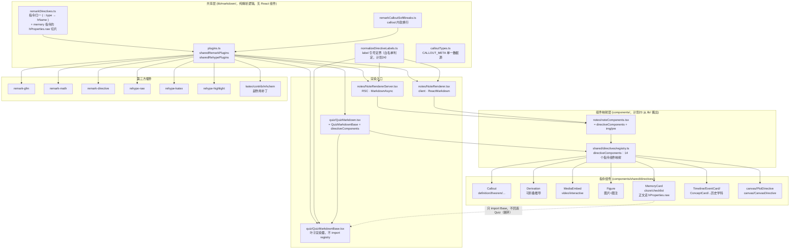
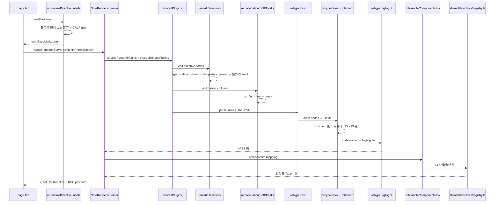
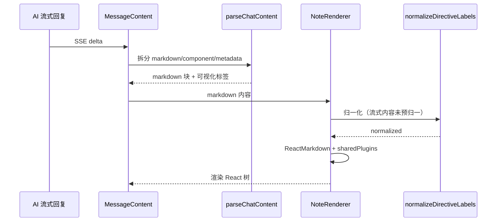

# 维度 03：共享渲染架构 深度调研报告

> **调研人**：Agent-A（架构与渲染调研员）
> **调研日期**：2026-07-05（正文机制描述）；**2026-09 全量校对重写**（计划 `25`，随计划 `23` 的 UI 层归位同步）
> **项目版本**：gailvlun v0.3.1 → v0.4.x
> **关联文档**：`docs/refer/rendering-architecture.md`、`docs/refer/performance-audit-report.md`、`docs/sop/subject-onboarding.md`、`docs/plans/00-execution-contract.md` 第六节「"右侧 Agent 里那个可视化 HTML"的唯一入口」与「指令注册表的环已断」
>
> **本次重写说明**：2026-07 初版基于 `lib/markdown/directiveComponents.ts` 与 `lib/markdown/noteComponents.tsx` 撰写，两个文件当时都在 `lib/markdown/` 下。计划 `23`（UI 层归位）把它们**移出了 `lib/`**：指令组件映射表现在是 `components/shared/directives/registry.ts`（导出名仍叫 `directiveComponents`），笔记侧组件映射表现在是 `components/notes/noteComponents.tsx`。原因是 `lib/**` 不得 import `components/**`（ESLint `no-restricted-imports` 已是 error），而这两个映射表本质是「引用一堆 React 组件的纯对象」，不该留在 `lib/` 里。搬家过程中还**顺带断开了一个真实存在的循环依赖**（`QuizMarkdown → registry.ts → MemoryCard → 回 QuizMarkdown`），以及**修复了两个既存 P0**（`normalizeDirectiveLabels` 的属性边界改用白名单判定；`MemoryCard` 正文改用 `hProperties.raw` 而非从已解析 React 树回抽）。本篇已按现网结构重写，插件链本身（`lib/markdown/plugins.ts`）与指令归一逻辑（`remarkDirectives.ts`）的文件位置未变。

## 0. 目录结构速查（2026-09 现网）

```
lib/markdown/                          # 只剩纯解析逻辑，不含任何 React 组件
  plugins.ts                           # sharedRemarkPlugins / sharedRehypePlugins（未搬家）
  remarkDirectives.ts                  # 指令归一（未搬家）
  remarkCalloutSoftBreaks.ts           # callout 内软换行（未搬家）
  remarkSoftBreaks.ts                  # 通用软换行插件（未在 sharedRemarkPlugins 中启用）
  normalizeDirectiveLabels.ts          # label/title 属性定界（计划 24 改为白名单判定，未搬家）
  calloutTypes.ts                      # CALLOUT_META 单一数据源（未搬家）
  # directiveComponents.ts、noteComponents.tsx 已不在这里 —— 见下方 components/

components/shared/directives/          # 14 个指令组件 + 组件映射表
  registry.ts                          # export const directiveComponents = {...}（原 lib/markdown/directiveComponents.ts）
  Callout.tsx / Derivation.tsx / MediaEmbed.tsx / Figure.tsx / MemoryCard.tsx
  Timeline.tsx / EventCard.tsx / ConceptCard.tsx / CompareTable.tsx
  CauseEffect.tsx / KeyPoint.tsx / HistoryMap.tsx
  registry.evaluation-order.test.tsx   # 断环回归测试（四种求值顺序 × 14 个指令键齐全且是函数）
  MemoryCard.test.tsx

components/notes/
  noteComponents.tsx                   # 笔记侧组件映射（原 lib/markdown/noteComponents.tsx）
                                        # = { ...directiveComponents, img: ContentImage, pre: CodeBlock }
  NoteRendererServer.tsx                # RSC，import noteComponents
  NoteRenderer.tsx                      # client，import noteComponents

components/quiz/
  QuizMarkdownBase.tsx                  # 叶子渲染器：KaTeX + table/img/p，永不 import 指令 registry
  QuizMarkdown.tsx                      # = QuizMarkdownBase + directiveComponents（题目/测验专用）

components/canvas/                      # 未搬家，独立子系统
  PlotDirective.tsx / CanvasDirective.tsx（单函数绘图 / 多函数共享坐标系，由 registry.ts import）
  HtmlRenderer.tsx                      # 消息内联 iframe，与指令系统无关，不要与"可视化 HTML"入口混淆

components/interactives/                # 与指令系统无关的另一套（右侧"可交互" tab 手写 React 组件）
  registry.ts                           # 供 MediaEmbed 的 InteractiveEmbed 查表（::interactive{id=...}）
```

**红线（`docs/plans/00-execution-contract.md` 第六节）**：`QuizMarkdownBase.tsx` 不得 import `components/shared/directives/registry`（直接或间接均不可）；`MemoryCard.tsx` 不得改回 import `QuizMarkdown.tsx`（只能 import `QuizMarkdownBase`）。这两条红线断开的正是 2026-07 时代真实存在过的环：`QuizMarkdown → registry.ts → MemoryCard → 回 QuizMarkdown`，历史上曾以「先求值 `registry.ts` 时 14 个指令组件被静默丢弃」与「`Cannot access 'directiveComponents' before initialization` 崩溃」两种形态出现过。

## 1. 执行摘要

gailvlun 的共享渲染架构是一个**「中间复用、两端独立」**的设计：笔记侧（`NoteRendererServer` / `NoteRenderer`）与题目/测验侧（`QuizMarkdown`）共享同一份 remark/rehype 插件链（`lib/markdown/plugins.ts`）与同一份指令组件映射（`components/shared/directives/registry.ts` 导出的 `directiveComponents`），但各自维护独立的 React 组件入口与外层 CSS 容器。

核心契约是 `sharedRemarkPlugins` 与 `sharedRehypePlugins` 两个数组——所有渲染入口**必须**从此处导入插件，禁止内联配置。插件链顺序敏感：remark 链按 `Gfm → Math → Directive → remarkDirectives(自定义) → remarkCalloutSoftBreaks` 处理；rehype 链按 `Raw → Katex → Highlight` 处理，rehype-raw 必须在 rehype-katex 之前以支持内联 HTML/SVG。这一层（`lib/markdown/`）在计划 `23` 的搬家中完全没动，仍是纯解析逻辑，不含任何 React 组件——这正是它能继续留在 `lib/` 下的原因。

自定义指令系统通过 `remarkDirectives.ts` 把 `:::type{label=...}` 与 `::type{id=...}` 语法归一为自定义 HAST 元素（`callout`/`derivation`/`mediaembed`/`figuremedia`/`functionplot`/`svgcanvas`/`memorycard`/`timeline`/`eventcard`/`conceptcard`/`comparetable`/`causeeffect`/`keypoint`/`historymap` 共 14 种），再由 `components/shared/directives/registry.ts` 映射到具体 React 组件——**这一步映射表已经是「组件」而不是「解析逻辑」，因此计划 `23` 把它搬出了 `lib/`**。所有指令组件均为 `"use client"`，作为水合岛在 RSC 树中保留交互能力。

`NoteRendererServer`（RSC）使用 `MarkdownAsync` 在构建期完成 Markdown → HTML 渲染（含 KaTeX/highlight），浏览器只接收渲染好的 React 树；`NoteRenderer`（client）使用同步 `ReactMarkdown`，用于流式内容（AI 回复、视频讲稿、例题）等「内容在客户端才确定」的场景。两者复用同一份 `noteComponents` 映射（现在在 `components/notes/noteComponents.tsx`），消除重复。

KaTeX mhchem 补丁问题是项目最特殊的工程坑位：`katex` 不可加入 `optimizePackageImports`，因为 `import "katex/contrib/mhchem"` 靠副作用给 katex 单例打补丁，barrel 优化会破坏单例关系导致化学方程式语法失效。这条约束自 2026-07 至今未变。

**2026-09 新增的两条关键事实**（2026-07 初版没有，是本次重写的重点）：
1. **指令注册表的环已断**：`QuizMarkdown.tsx` 现在拆成 `QuizMarkdownBase.tsx`（叶子渲染器）+ `QuizMarkdown.tsx`（= Base + directiveComponents），`MemoryCard` 只 import Base，彻底切断了曾经存在的循环依赖。
2. **`MemoryCard` 正文来源换了**：不再从已解析的 React children 回抽文本（该做法按构造有损：`<strong>` 丢 `**`、checkbox 丢 `- [ ]`、KaTeX 回抽为空），改为优先读取 `remarkDirectives.ts` 写入 `hProperties.raw` 的**源文件原文切片**；`extractText`/`extract()` 一类的 children 回抽逻辑降级为「没有 position 的树（如部分 AI 流式节点）」时的兜底。

## 2. 架构总览



## 3. 核心机制详解

### 3.1 完整插件链（`lib/markdown/plugins.ts`，未搬家）

导出两个数组：

**`sharedRemarkPlugins`**（顺序敏感）：

| 序号 | 插件 | 作用 | 顺序敏感性 |
|---|---|---|---|
| 1 | `remarkGfm` | GitHub Flavored Markdown（表格、删除线、任务列表、自动链接） | 必须最先，扩展基础语法 |
| 2 | `remarkMath` | 解析 `$...$` / `$$...$$` 为 math 节点 | 必须在 directive 前，避免指令语法吞掉公式 |
| 3 | `remarkDirective` | 解析 `:::type` / `::type` / `:type` 为 directive 节点 | 必须在自定义 remarkDirectives 前 |
| 4 | `remarkDirectives`（自定义） | 把 directive 节点归一为自定义 HAST 元素（`callout`/`mediaembed` 等） | 必须在 remarkDirective 后 |
| 5 | `remarkCalloutSoftBreaks`（自定义） | 在 callout 容器子树内把单换行转为 break 节点 | 必须在 remarkDirectives 后，依赖 `name === "callout"` |

**`sharedRehypePlugins`**（顺序敏感）：

| 序号 | 插件 | 配置 | 顺序敏感性 |
|---|---|---|---|
| 1 | `rehypeRaw` | 默认 | **必须**在 rehype-katex 前，把内联 HTML/SVG 解析为 HAST 节点 |
| 2 | `rehypeKatex` | `{ throwOnError: false, strict: false }` | 必须在 rehype-raw 后，处理 math 节点 |
| 3 | `rehypeHighlight` | `{ detect: false, ignoreMissing: true, subset: [9 种语言] }` | 顺序不敏感，但放最后避免干扰 |

**subset 白名单**：`python`、`javascript`、`typescript`、`bash`、`shell`、`json`、`html`、`css`、`markdown`。避免对每篇 KaTeX 重的内容做无谓的自动语言识别。

**`lib/markdown/remarkSoftBreaks.ts`**：这是一个存在但**未被启用**的通用软换行插件（不在 `sharedRemarkPlugins` 数组里），全局启用会破坏笔记正文段落排版；只有限定作用域的 `remarkCalloutSoftBreaks` 被实际使用。文档层面容易把两者搞混，读代码前先确认看的是哪一个文件。

### 3.2 自定义指令系统

**指令语法**（基于 `remark-directive`）：

| 语法 | 类型 | 示例 |
|---|---|---|
| `:::type{label="..."}` ... `:::` | 容器指令（containerDirective） | `:::definition{label="正态分布"}` |
| `::type{id="..."}` | 叶子指令（leafDirective） | `::video{id=ch01-1.4-classical}` |
| `:type` | 文本指令（textDirective） | 项目不使用，但需兜底 |

**归一流程**（`lib/markdown/remarkDirectives.ts`）：

1. `visit()` 遍历 mdast 树，筛选 `containerDirective`/`leafDirective`/`textDirective` 节点
2. 按 `node.name` 匹配处理器，设置 `data.hName`（HAST 标签名）与 `data.hProperties`（属性对象）
3. `memory` 指令额外调用 `extractMemoryRaw(source, node)`：按子节点/自身的 `position.offset` 从**源文件原文**里切出容器内部原文，写入 `hProperties.raw`；超过 `MEMORY_RAW_MAX_CHARS`（8KB）时不写 `raw`，交给 `MemoryCard` 的 `extract()` 兜底
4. 未识别的 `textDirective`（如散文中的 `Nd:YAG`、`3:X`）被还原为字面文本 `":name"`，避免被 `mdast-util-to-hast` 静默丢弃

**14 种指令组件**（映射表现在在 `components/shared/directives/registry.ts`，导出名仍是 `directiveComponents`）：

| hName | 指令名 | 类型 | 组件 | 用途 |
|---|---|---|---|---|
| `callout` | `:::definition/theorem/example/insight/pitfall/note/tip` | 容器 | `Callout` | 7 种语义卡片 |
| `callout` | `:::callout{kind=...}` | 容器 | `Callout` | SOP 08 试卷统一写法 |
| `memorycard` | `:::memory` | 容器 | `MemoryCard` | 记忆卡（cloze/checklist），**优先匹配**（在 CALLOUTS 判断之前，因为 `memory` 同时也在 `CALLOUT_TYPES` 里用作样式元数据） |
| `derivation` | `:::derivation` | 容器 | `Derivation` | 可折叠推导 |
| `mediaembed` | `::video` / `::interactive` | 叶子 | `MediaEmbed` | 视频/交互组件嵌入 |
| `figuremedia` | `::figure` | 叶子 | `Figure` | 图片+图注 |
| `functionplot` | `::plot` | 叶子 | `PlotDirective`（`components/canvas/`） | 单函数绘图 |
| `svgcanvas` | `:::canvas` | 容器 | `CanvasDirective`（`components/canvas/`） | 多函数共享坐标系 |
| `timeline` | `:::timeline` | 容器 | `Timeline` | 时间轴（历史学科） |
| `eventcard` | `:::event` | 容器 | `EventCard` | 事件卡（历史学科） |
| `conceptcard` | `:::concept` | 容器 | `ConceptCard` | 概念卡（历史学科） |
| `comparetable` | `:::compare` | 容器 | `CompareTable` | 对比表（历史学科） |
| `causeeffect` | `:::cause-effect` | 容器 | `CauseEffect` | 因果关系（历史学科） |
| `keypoint` | `:::keypoint` | 容器 | `KeyPoint` | 核心要点（历史学科） |
| `historymap` | `::map` | 叶子 | `HistoryMap` | 历史地图（历史学科） |

`CALLOUT_TYPES`（`lib/markdown/calloutTypes.ts`）目前是 8 个字面量（含 `memory`），但 `memory` 在渲染时被 `remarkDirectives.ts` 优先分流到独立的 `memorycard` hName，不会真的渲染成 `Callout`——它留在 `CALLOUT_TYPES` 里只是复用「有效指令名集合」这一份数据源，2026-07 报告称其为「8 种」的表述准确，无需改动。

### 3.3 指令组件实现细节

#### Callout（`components/shared/directives/Callout.tsx`）

- 从 `node.properties.kind` 读取类型（默认 `note`），从 `CALLOUT_META` 取样式类名与中文标签
- 渲染为 `<div className="callout {meta.cls}">` + `<div className="callout-label">`
- 支持 7 种展示类型：`definition`/`theorem`/`example`/`insight`/`pitfall`/`note`/`tip`（`memory` 类型走独立的 `MemoryCard` 组件，见上表）

#### Derivation（`components/shared/directives/Derivation.tsx`）

- 原生 `<details>` + `<summary>`，无 JS 状态管理（浏览器原生折叠）
- `label` 默认「推导过程」

#### MediaEmbed（`components/shared/directives/MediaEmbed.tsx`）

- 分流 `kind: "video" | "interactive"`
- **VideoEmbed**：从 `getVideo(id)` 查 `mediaManifest`，未命中显示「即将生成」占位；命中显示播放按钮（`LazyVisible` 包裹），点击后挂载 `InlinePlayer`（dynamic ssr:false）；与 PiP 状态联动（经 `@/lib/store` 转发壳订阅 `openPip`/`pipReturnTime`/`closePip`，真身在 `lib/stores/ui.ts`）
- **InteractiveEmbed**：从 `getInteractive(id)` 查 `components/interactives/registry.ts`，未命中显示占位；命中渲染 `<C />`（`LazyVisible` 包裹）
- **不要与「可视化 HTML」入口混淆**：`MediaEmbed` 的 `InteractiveEmbed` 走的是右侧「可交互」tab 的手写 React 组件（`components/interactives/**`），与 AI 生成的可视化 HTML（`renderInteractive` 工具 → `ArtifactViewer` 浮窗）是完全不同的两条链路，详见契约「"右侧 Agent 里那个可视化 HTML"的唯一入口」一节。

#### Figure（`components/shared/directives/Figure.tsx`）

- `src`/`alt`/`caption` 三属性
- `onError` 切换到 `ImageOff` 兜底
- `loading="lazy"` + `decoding="async"` 优化加载

#### MemoryCard（`components/shared/directives/MemoryCard.tsx`，2026-09 机制已变）

- 两模式：`mode="cloze"`（挖空）与默认（清单 checklist）
- **正文来源优先级**（这是与 2026-07 版本的核心差异）：
  1. 优先用 `node.properties.raw`——`remarkDirectives.ts` 在归一阶段从源文件原文切出的容器内部原文，完整保留 `**粗体**`、`- [ ]`、`$公式$` 等 Markdown 语法
  2. 只有 `raw` 为空（没有 `position` 的树，如部分 AI 流式/程序化生成的节点）才走 `extract()`：递归遍历 React children 拼字符串，按构造有损（`<strong>` 丢 `**`、checkbox 丢 `- [ ]`、KaTeX 在 `dangerouslySetInnerHTML` 里回抽为空），仅作聊天侧兜底保留，**不要删**
- **cloze**：把 `rawText` 中 `**...**`/`<u>...</u>`/`_..._` 遮蔽为可点击挖空，点击后用 `QuizMarkdownBase`（不是 `QuizMarkdown`）内联渲染
- **checklist**：把 `- [ ] ...` 渲染为可逐项点击的背诵条目，同样用 `QuizMarkdownBase` 渲染每一项
- 使用 framer-motion `AnimatePresence` 做展开/收起动画
- **断环红线**：本组件顶部注释明确写着「叶子渲染器，不经过 QuizMarkdown → registry，避免与本文件成环」，只 import `@/components/quiz/QuizMarkdownBase`

#### 历史学科指令（Timeline/EventCard/ConceptCard/CompareTable/CauseEffect/KeyPoint/HistoryMap）

- 全部为 `"use client"` 组件，专为历史学科设计，均在 `components/shared/directives/`
- `Timeline` 从 children 提取文本，按 `- **year** title — desc` 格式解析为时间轴项
- `HistoryMap` 从 `points` 属性解析 `name:x:y` 格式（如 `北京:50:30,上海:60:70`）
- `EventCard` 支持 `year/title/location/people/result/impact` 多字段，可折叠详情

### 3.4 NoteRendererServer vs NoteRenderer vs QuizMarkdown 三方边界

| 维度 | NoteRendererServer | NoteRenderer | QuizMarkdown / QuizMarkdownBase |
|---|---|---|---|
| 文件 | `components/notes/NoteRendererServer.tsx` | `components/notes/NoteRenderer.tsx` | `components/quiz/QuizMarkdown.tsx` + `QuizMarkdownBase.tsx` |
| 类型 | RSC（无 `"use client"`） | Client Component（`"use client"`） | Client Component |
| 核心 API | `MarkdownAsync`（react-markdown 9 RSC 异步版） | `ReactMarkdown`（同步） | `ReactMarkdown`（同步，经 Base 封装） |
| 组件映射 | `components/notes/noteComponents.tsx`（= 14 个指令组件 + img/pre） | 同左 | `QuizMarkdown` 用 `directiveComponents` 全量；`QuizMarkdownBase` 只用 `table`/`img`/`p`，**不含任何指令组件** |
| normalizeDirectiveLabels | **不调用**（由 page.tsx 预先归一） | **调用**（流式内容未预归一） | **调用**（在 `QuizMarkdownBase` 内部调用） |
| 使用场景 | 静态笔记正文 SSR | AI 流式回复、视频讲稿、例题 | 题目/测验渲染；`QuizMarkdownBase` 单独被 `MemoryCard` 复用做叶子渲染 |
| 性能特征 | 构建期烘焙，浏览器只接收 React 树 | 客户端实时解析，主线程开销 | 客户端实时解析 |

**约束**（`NoteRendererServer.tsx` 注释）：「`content` 必须由调用方（page.tsx）预先经 normalizeDirectiveLabels 归一一次，本组件不再重复归一」。这是性能优化：避免在构建期对每篇笔记重复跑正则。

### 3.5 noteComponents 共享映射（`components/notes/noteComponents.tsx`，原 `lib/markdown/noteComponents.tsx`）

```typescript
export const noteComponents = {
  ...directiveComponents,      // 来自 components/shared/directives/registry.ts，14 个指令组件
  img: ContentImage,           // 统一图片（错误兜底 + figure 包裹）
  pre: ({ node, ...props }) => <CodeBlock {...props} />,  // 代码块（复制 + 语言标签）
} as unknown as Components;
```

注释强调：「本文件不加 `"use client"`：它只是一组组件引用的纯对象，可被服务端与客户端组件同时 import；其中的指令组件 / CodeBlock / ContentImage 自身已是 `"use client"`，从服务端渲染时自动成为水合岛」。这是 RSC 体系的关键设计，且 2026-07 到 2026-09 未变——唯一变化是这份「纯对象」现在物理上放在 `components/notes/` 而不是 `lib/markdown/`，因为它 import 的是 `components/shared/directives/registry`，若继续留在 `lib/` 就会直接违反「`lib/**` 不得 import `components/**`」的分层规则。

### 3.6 QuizMarkdown / QuizMarkdownBase 拆分与断环（2026-09 新增机制，2026-07 报告没有覆盖）

计划 `23` 把原来单一的 `QuizMarkdown.tsx` 拆成两层：

```typescript
// components/quiz/QuizMarkdownBase.tsx —— 叶子渲染器
// 永不 import 指令 registry；components 默认只有 table/img（块级）或 p/img（行内）
export default function QuizMarkdownBase({ children, inline, className, components }: Props) { /* ... */ }

// components/quiz/QuizMarkdown.tsx —— 组合层
import { directiveComponents } from "@/components/shared/directives/registry";
import QuizMarkdownBase, { composeQuizMarkdownComponents } from "@/components/quiz/QuizMarkdownBase";
export const blockComponents = composeQuizMarkdownComponents(directiveComponents, false);
export const inlineComponents = composeQuizMarkdownComponents(directiveComponents, true);
export default function QuizMarkdown({ children, inline, className }: Props) {
  return <QuizMarkdownBase components={inline ? inlineComponents : blockComponents} ...>{children}</QuizMarkdownBase>;
}
```

**为什么要拆**：`MemoryCard.tsx` 需要一个「不含指令组件」的轻量渲染器来渲染挖空/清单里的行内 Markdown（`**粗体**`、`$公式$`）。2026-07 之前 `MemoryCard` 直接 import `QuizMarkdown`，而 `QuizMarkdown` 又 import 了包含 `MemoryCard` 自己的 `directiveComponents` —— 这就是环的成因。拆出一个不 import registry 的 `QuizMarkdownBase` 作为公共叶子层，`MemoryCard` 改为只 import `QuizMarkdownBase`，环被物理断开。

**护栏**：`components/shared/directives/registry.evaluation-order.test.tsx` 按四种模块求值顺序断言 14 个指令键齐全且每个值都是函数——这个测试同时能抓住「崩溃」与「静默空映射」两种历史上真实出现过的失败形态，**不要削弱它**（尤其不要只断言键存在而不断言是函数）。

### 3.7 KaTeX mhchem 补丁问题（未变）

**根因**（`next.config.mjs` 注释）：

> katex 不可加入 `optimizePackageImports`——它靠 `import "katex/contrib/mhchem"` 的副作用给 katex 单例打补丁，barrel 优化的深层导入改写会破坏该单例关系，导致 SSR 包里 mhchem 的气体箭头 `^`、三键 `#` 等惰性特性失效（`\ce{N2 ^}`、`\ce{-C#CH}` 渲染成红字错误），而 node 直跑无此改写故正常。

**机制**：
1. `lib/markdown/plugins.ts` 通过 `import "katex/contrib/mhchem"` 注入化学方程式支持
2. mhchem 模块在加载时给 `katex` 单例挂载 `\ce` 命令处理器
3. Next.js 的 `optimizePackageImports` 会把 `import "katex/contrib/mhchem"` 改写为深层路径导入，破坏模块副作用
4. 单例被破坏后，`\ce{N2 ^}` 中的 `^` 不被识别为气体箭头，渲染成红色错误字符

**解决方案**：`next.config.mjs` 的 `experimental.optimizePackageImports` 中**只**加入 `framer-motion` 与 `lucide-react`，**显式排除** `katex`。

### 3.8 normalizeDirectiveLabels 归一化（2026-09 机制已变：形状匹配 → 白名单判定）

**问题**（`lib/markdown/normalizeDirectiveLabels.ts` 注释）：remark-directive 的属性语法 `:::type{label=值}` 中，**未加引号的属性值不能包含空格或 ASCII 直引号**。中文标题如 `:::definition{label=σ-p 超共轭}`（含空格）或 `:::insight{label=从"衣食住行"讲起}`（含直引号）会导致属性解析失败 → 整个指令被丢弃 → callout 框消失、围栏裸露。

**2026-07 时代的处理策略**（已废弃）：用形状匹配正则 `/\s+[\w-]+=/` 判定「下一个属性」的边界。

**计划 24 修复的既存 P0**：形状匹配与标题正文里的公式/数值同形——`mode=cloze` 与 `k=0`、`y=10sin(10πt−x/100)`、`A260=1.0` 结构完全一样，形状匹配会把公式误切成属性、把标题截断（正文实测 2 处），也让标题内嵌 ASCII 引号的写法（正文实测 21 处，如 `{label="熵"的本质}`）退回解析不了的形状。

**现行策略**（白名单判定）：
1. 跟踪围栏代码块状态，块内不做任何替换
2. 仅匹配指令起始行 `^\s*:{1,4}[A-Za-z][\w-]*\{[^}\n]*\}`
3. 「下一个属性」的边界只认 `KNOWN_ATTRS` 白名单（`lib/markdown/normalizeDirectiveLabels.ts` 里硬编码的 29 个属性名，必须与 `remarkDirectives.ts` 里读取的 `attrs.*` 保持同步）
4. 带引号的值，边界搜索从**闭合引号之后**开始，避免标题里含白名单词（如 `{label="用 width=3 画图" mode=cloze}`）被切进引号内部
5. 把 `label=值` 中的成对 ASCII 引号转为中文弯引号（`"` → `“”`）
6. 用 ASCII 双引号给整个值定界（`{label="σ-p 超共轭"}`）

**幂等性**：已包裹的值不会被重复包裹（`fixBraces` 先去一层引号再包裹）。

**CRLF 适配**：正则用 `[^\n]*` 而非 `.*`，因为 `.` 不匹配 `\r`，CRLF 文件按 `\n` 切行后行尾留有 `\r` 会导致匹配失败。

**护栏**：`lib/markdown/normalizeDirectiveLabels.test.ts` 有 4 例专钉这条（未加引号含公式 ×2、标题内嵌引号、引号内含白名单词）。**判据一旦退回形状匹配它们立刻变红**，不要在「优化正则」时无意中改回去。

**两侧入口约束**：`NoteRendererServer`（由 page.tsx 预归一）与 `NoteRenderer`（自身归一）都必须经此函数，`QuizMarkdownBase` 同理。

### 3.9 remarkCalloutSoftBreaks 软换行（未变）

**问题**：标准 Markdown 语义下，段内单换行被折叠为空格。这导致题目卡片内用单换行分隔的 ABCD 选项堆在一行。全局启用 `remarkSoftBreaks` 会破坏笔记正文段落排版。

**解决方案**：只在 `containerDirective` 且 `name === "callout"` 的子树内，把 text 节点的单换行拆为 `text + break`。精准修复题目/解析/知识延伸等卡片的换行，零回归。

**安全性**：只改写 text 节点，行内公式（inlineMath）、代码（code/inlineCode）、数学块（math）在 mdast 里是独立节点类型，不会被波及。

### 3.10 CALLOUT_META 单一数据源（未变）

`lib/markdown/calloutTypes.ts`：

```typescript
export const CALLOUT_TYPES = ["definition","theorem","example","insight","pitfall","note","tip","memory"] as const;
export const CALLOUTS = new Set<string>(CALLOUT_TYPES);
export const CALLOUT_META: Record<string, { label: string; cls: string }> = {
  definition: { label: "定义", cls: "callout-definition" },
  theorem: { label: "定理", cls: "callout-theorem" },
  example: { label: "例", cls: "callout-example" },
  insight: { label: "直觉", cls: "callout-insight" },
  pitfall: { label: "易错点", cls: "callout-pitfall" },
  note: { label: "注", cls: "callout-note" },
  tip: { label: "提示", cls: "callout-tip" },
  memory: { label: "记忆卡", cls: "callout-memory" },
};
```

`Callout.tsx` 自动从 `CALLOUT_META` 读取，新增 callout 类型只需改这一处 + CSS（`callouts.css`），无需改组件代码。

## 4. 数据流与调用链路

### 4.1 笔记渲染主链路



### 4.2 客户端流式渲染链路



### 4.3 记忆卡渲染链路（2026-09 新增，替代旧的「二次渲染」描述）

```mermaid
sequenceDiagram
    participant Note as 笔记正文 :::memory{...}
    participant RemarkDir as remarkDirectives.ts
    participant Card as MemoryCard.tsx
    participant Base as QuizMarkdownBase.tsx

    Note->>RemarkDir: containerDirective name="memory"
    RemarkDir->>RemarkDir: extractMemoryRaw(source, node) 按 position.offset 切源文件原文
    RemarkDir-->>Card: hProperties = {kind, label, mode, raw}
    Card->>Card: rawFromNode = properties.raw（优先）
    alt raw 为空（无 position 的树）
        Card->>Card: extract(children) 递归兜底
    end
    Card->>Base: ClozeText/ChecklistMarkdown 内联渲染 rawText 片段
    Base-->>Card: 渲染好的行内 React 树（不经过 registry）
```

## 5. 关键代码路径（已按 2026-09 现网路径核对）

### 5.1 共享插件链（未搬家）

- `lib/markdown/plugins.ts` — `sharedRemarkPlugins` 与 `sharedRehypePlugins` 完整定义
- `lib/markdown/plugins.ts` — `import "katex/contrib/mhchem"` 副作用导入

### 5.2 指令归一（未搬家）

- `lib/markdown/remarkDirectives.ts` — 主 visit 函数
- `lib/markdown/remarkDirectives.ts` — `memory` 指令优先匹配 + `extractMemoryRaw`
- `lib/markdown/remarkDirectives.ts` — `callout` 指令 kind 属性处理
- `lib/markdown/remarkDirectives.ts` — 8 种 CALLOUTS 类型匹配
- `lib/markdown/remarkDirectives.ts` — textDirective 兜底还原

### 5.3 软换行与归一化（未搬家）

- `lib/markdown/remarkCalloutSoftBreaks.ts` — callout 子树内 text 节点拆分
- `lib/markdown/normalizeDirectiveLabels.ts` — 主归一函数 + `KNOWN_ATTRS` 白名单
- `lib/markdown/normalizeDirectiveLabels.ts` — `fixBraces` / `splitLabelValue` 引号定界

### 5.4 组件映射（**已搬出 `lib/`，现在在 `components/`**）

- `components/shared/directives/registry.ts` — 14 个指令组件映射表（导出名 `directiveComponents`）
- `components/notes/noteComponents.tsx` — 笔记侧组件映射（含 img/pre）
- `lib/markdown/calloutTypes.ts` — CALLOUT_META 单一数据源（这一份数据表未搬家，因为不含组件引用）

### 5.5 渲染入口

- `components/notes/NoteRendererServer.tsx` — RSC 异步渲染
- `components/notes/NoteRenderer.tsx` — 客户端同步渲染
- `components/quiz/QuizMarkdownBase.tsx` — 叶子渲染器（不 import registry）
- `components/quiz/QuizMarkdown.tsx` — 组合层（Base + directiveComponents）
- `app/[subject]/[category]/[id]/page.tsx` — `normalizeDirectiveLabels` + `NoteRendererServer` 调用

### 5.6 指令组件实现

- `components/shared/directives/Callout.tsx` — Callout 组件
- `components/shared/directives/MediaEmbed.tsx` — MediaEmbed 分流 + VideoEmbed（PiP 联动）+ InteractiveEmbed
- `components/shared/directives/MemoryCard.tsx` — MemoryCard 主组件（`hProperties.raw` 优先 + `extract()` 兜底）+ `ClozeText` + `ChecklistMarkdown`
- `components/shared/directives/Derivation.tsx` — Derivation 折叠
- `components/shared/directives/Figure.tsx` — Figure 图片
- `components/shared/directives/Timeline.tsx` — Timeline 时间轴
- `components/shared/directives/HistoryMap.tsx` — HistoryMap 历史地图
- `components/shared/directives/registry.evaluation-order.test.tsx` — 断环回归测试
- `components/shared/directives/MemoryCard.test.tsx` — MemoryCard 单测

### 5.7 共享基础组件

- `components/shared/CodeBlock.tsx` — 代码块（复制 + 语言标签）
- `components/shared/ContentImage.tsx` — 统一图片（错误兜底 + figure 包裹）

### 5.8 构建配置

- `next.config.mjs` — `optimizePackageImports` 配置（含 katex 排除约束）
- `next.config.mjs` — `outputFileTracingIncludes/Excludes` 内容打包规则

## 6. 设计决策与取舍分析

### 6.1 为什么用「中间复用、两端独立」而非完全统一

- **取舍**：共享插件链 vs 独立组件入口
- **理由**：笔记与题目/测验的渲染需求高度相似（都需 KaTeX、指令、代码高亮），但外层排版令牌不同，且各自有额外需求（笔记侧的图片/代码块映射、题目侧的行内/块级双模式）
- **代价**：需维护 `noteComponents` 与 `QuizMarkdown` 两套组件映射，但 `directiveComponents`（registry.ts）是共享的

### 6.2 为什么 NoteRendererServer 不调用 normalizeDirectiveLabels

- **取舍**：性能 vs 职责单一
- **理由**：构建期对每篇笔记跑正则有开销；page.tsx 已在 SSR 入口统一归一一次，NoteRendererServer 重复归一是浪费
- **代价**：约束依赖注释固化，无运行时校验；若调用方忘记归一会导致 callout 围栏裸露

### 6.3 为什么把 registry.ts / noteComponents.tsx 搬出 `lib/`（2026-09 新增分析）

- **取舍**：目录整洁的历史惯性 vs 分层规则的强制力
- **理由**：`eslint.config.mjs` 的 `no-restricted-imports` 规则要求 `lib/**` 不得 import `components/**`，且已是 **error 且零例外**；`directiveComponents.ts` / `noteComponents.tsx` 本质是「一堆 React 组件的映射表」，天然要 import `components/shared/directives/*`，继续留在 `lib/markdown/` 就是在结构上鼓励违反这条规则
- **代价**：几乎为零——两个文件都是纯数据对象，搬家不涉及任何逻辑改动，只是移了物理位置并更新 import 路径

### 6.4 为什么要拆 QuizMarkdown / QuizMarkdownBase（2026-09 新增分析）

- **取舍**：多一层文件 vs 消除真实存在的循环依赖
- **理由**：`MemoryCard` 需要渲染指令内部的行内 Markdown，但它自己就是 `directiveComponents` 里的一员；若它 import 完整的 `QuizMarkdown`（= Base + registry），就会形成 `registry → MemoryCard → QuizMarkdown → registry` 的环。JS 模块环在某些求值顺序下会静默丢弃后声明的绑定而不报错，是比运行时崩溃更危险的故障模式
- **代价**：多了一层公共叶子组件，需要维护者记住「MemoryCard 只能 import Base」这条红线，靠 `registry.evaluation-order.test.tsx` 做护栏

### 6.5 为什么 MemoryCard 改用 hProperties.raw 而非 children 回抽（2026-09 新增分析）

- **取舍**：多一步源文件切片 vs 渲染结果有损
- **理由**：从已解析的 React 树回抽文本按构造有损——`<strong>` 标签丢失 `**`、checkbox 输入框丢失 `- [ ]`、KaTeX 渲染进 `dangerouslySetInnerHTML` 后完全无法回抽公式源码。这个既存 P0 导致全站 711 张 `:::memory` 记忆卡里所有 `mode=cloze` 的挖空功能实际上从未正确工作过（挖空内容里的公式全部丢失）
- **代价**：需要在 remark 阶段就拿到 unist 节点的 `position.offset`，从原始文件字符串里切片；对没有 position 的树（部分 AI 流式/程序化生成节点）仍需 `extract()` 兜底，两套逻辑并存增加了少量复杂度
- **上限**：`raw` 超过 8KB 会放弃切片退回 `extract()`；现网实测最大单卡 4168 字符，阈值从未触发

### 6.6 为什么 remarkCalloutSoftBreaks 只在 callout 内生效

- **取舍**：精准修复 vs 全局软换行
- **理由**：全局启用 `remarkSoftBreaks` 会破坏笔记正文段落排版（单换行被保留为 `<br>`，段落无法正确折叠）；只在 callout 子树内生效，精准修复题目卡片的 ABCD 选项换行
- **代价**：需自定义插件，但代码量小，复杂度低

### 6.7 为什么 rehype-highlight 用 detect:false + subset 白名单

- **取舍**：自动语言识别 vs 性能
- **理由**：`detect:true` 会让 highlight.js 对每个未标语言的 fence 遍历所有 grammar 做自动识别——对概率论/物理这种「整卷 KaTeX 但几乎无代码块」的内容是纯浪费
- **代价**：未标语言的 fence 不高亮（保持原样），但作者显式写 ` ```lang ` 时仍高亮

### 6.8 为什么指令组件全部是 "use client"

- **取舍**：SSR 友好 vs 交互能力
- **理由**：Callout/Derivation 等看似可 SSR，但 MemoryCard（状态）、MediaEmbed（PiP 联动）、EventCard（折叠）等需交互；统一 `"use client"` 简化心智模型，且 RSC 会自动把它们作为水合岛保留
- **代价**：每个指令组件都是一个水合岛，但体积小，影响可控

### 6.9 为什么 textDirective 需要兜底还原

- **取舍**：严格丢弃 vs 字面还原
- **理由**：remark-directive 会把散文中的 `词:Word`（如 `Nd:YAG`、比值 `3:X`）误解析为 textDirective；未识别的 textDirective 会被 `mdast-util-to-hast` 静默丢弃 → 吞掉冒号后的文字
- **代价**：需在 `remarkDirectives.ts` 显式还原为 `":name"` 文本

## 7. 问题清单（2026-07 识别；标注是否已被后续计划修复或仍适用于 2026-09 现网）

| # | 问题描述 | 严重程度 | 涉及文件（现网路径） | 2026-09 状态 |
|---|----------|----------|----------|--------------|
| 1 | `noteComponents.tsx` 中 `pre` 组件用类型断言，丢失类型安全 | P3 | `components/notes/noteComponents.tsx` | 仍适用（搬家未改类型签名） |
| 2 | 指令组件映射用 `as unknown as Partial<Components>` 双重断言绕过类型检查 | P2 | `components/shared/directives/registry.ts` | 仍适用 |
| 3 | `Callout.tsx` 依赖运行时 `String(... ?? "note")` 兜底，类型不安全 | P3 | `components/shared/directives/Callout.tsx` | 仍适用 |
| 4 | **MemoryCard 二次渲染导致挖空内容丢失公式/格式** | P0（既存，非本轮回归） | `components/shared/directives/MemoryCard.tsx` | **已由计划 24 修复**：改用 `hProperties.raw`，`extract()` 降级为兜底路径，见 §6.5 |
| 5 | MediaEmbed 两层占位组件可能造成视觉跳变 | P3 | `components/shared/directives/MediaEmbed.tsx` | 需要重新核实，未在本次文档清洗中验证 |
| 6 | textDirective 兜底的 `SKIP` import 需确认正确 | P3 | `lib/markdown/remarkDirectives.ts` | 已确认 `import { SKIP } from "unist-util-visit"` 正确 |
| 7 | **`normalizeDirectiveLabels` 形状匹配正则误切公式/截断标题** | P0（既存，非本轮回归） | `lib/markdown/normalizeDirectiveLabels.ts` | **已由计划 24 修复**：改用 29 属性白名单判定，见 §3.8 |
| 8 | `mhchem` 裸副作用导入无类型声明 | P3 | `lib/markdown/plugins.ts` | 仍适用 |
| 9 | Callout 不支持嵌套 | P3 | `components/shared/directives/Callout.tsx` | 仍适用；已量化全站 711 个 `:::memory` 块内零处嵌套指令，实际影响面为零 |
| 10 | 文档提到「7 种 callout 类型」与实际 8 种（含 memory）不一致 | P3 | 本文档 | 本次重写已在 §3.2 澄清：8 个字面量、7 种展示类型 + memory 独立分流 |
| 11 | `HistoryMap` 的 `points` 属性遇引号可能解析失败 | P2 | `components/shared/directives/HistoryMap.tsx` | 需要重新核实 |
| 12 | `PlotDirective`/`CanvasDirective` 来自 `components/canvas/`，与其他指令组件路径不一致 | P3 | `components/shared/directives/registry.ts` | 仍适用（canvas 子系统有意独立，见契约「唯一入口」一节的排除清单） |
| 13（新增） | `QuizMarkdown`/`registry.ts`/`MemoryCard` 曾存在循环依赖，静默丢弃 14 个指令组件 | P0（既存，非本轮回归） | 见 §3.6、§6.4 | **已由计划 23 修复**：拆出 `QuizMarkdownBase` 断环，并有 `registry.evaluation-order.test.tsx` 护栏 |

> 除已标注「已修复」的三项 P0 外，其余问题清单未在本次文档清洗中逐条重新验证代码行为（清洗任务只改 `.md`），仅更新了文件路径。若要作为验收依据，请重新读代码确认。

## 8. 改进建议

### P1（高收益 · 低风险）

无新增 P1 问题。三项既存 P0（MemoryCard 回抽、normalizeDirectiveLabels 形状匹配、指令注册表循环依赖）均已在计划 `23`/`24` 修复完毕。

### P2（中收益 · 中风险）

- **统一指令组件类型签名**（#2、#3）：定义 `DirectiveComponentProps` 接口，所有指令组件实现统一签名，消除双重断言
- **HistoryMap 引号兼容测试**（#11）：确认 `normalizeDirectiveLabels` 包裹引号后 `points` 属性解析正常

### P3（低优先）

- **类型安全**（#1、#8）：补全 `pre` 组件与 mhchem 导入的类型声明
- **占位统一**（#5）：MediaEmbed 两层占位组件统一
- **指令组件组织**（#12）：`PlotDirective`/`CanvasDirective` 是否要挪进 `components/shared/directives/` 或维持 canvas 子系统独立，需要产品/架构决策
- **嵌套 callout 支持**（#9）：影响面为零，暂不处理

## 9. 与全自动化平台改造的关系

本维度对平台化改造的影响：

1. **共享渲染核心是平台化的关键资产**：`sharedRemarkPlugins` + `directiveComponents`（现在的 `components/shared/directives/registry.ts`）让任何学科的内容都复用同一渲染管线。平台化时**必须保留**这一约束，避免新学科自带渲染器导致渲染分裂。

2. **指令系统是平台化的扩展点**：14 种指令组件覆盖了通用学科（callout/derivation/figure/mediaembed）与历史学科（timeline/eventcard/conceptcard/comparetable/causeeffect/keypoint/historymap）两大类。平台化时可：
   - 把指令组件注册改为插件式（每个学科插件包自带指令组件）
   - 保持 `remarkDirectives.ts` 的归一逻辑不变，只扩展 `registry.ts` 的映射

3. **RSC 预渲染是平台化的性能保障**：`NoteRendererServer` 在构建期完成 Markdown → HTML 渲染，平台化后内容规模可能扩张 5-10 倍，RSC 预渲染的价值更显著。

4. **mhchem 单例陷阱是平台化的约束**：平台化时若引入更多副作用模块，需同样注意 `optimizePackageImports` 的限制。

5. **normalizeDirectiveLabels 白名单判定是平台化的内容质量保障**：AI 生成内容与作者笔误都可能导致 callout 围栏裸露，归一化是兜底防线；白名单判定比形状匹配更适合平台化场景（AI 生成的内容更可能出现结构相似但语义不同的文本）。

6. **CALLOUT_META 单一数据源是平台化的扩展范式**：新增 callout 类型只需改一处 + CSS，无需改组件代码。这一范式应推广到其他指令类型。

7. **`lib/**` 不 import `components/**` 的分层规则是平台化的架构护栏**：本次搬家证明了这条规则不是形式主义——它逼着「解析逻辑」与「UI 组件」物理分离，为将来把 `lib/markdown/` 独立发布成学科无关的解析包留了余地。

8. **指令组件全部 "use client" 是平台化的心智模型简化**：统一为水合岛虽有小开销，但简化了 RSC/CSR 边界判断。平台化时应保留这一约定。

## 10. 参考资料

### 项目内文档

- `docs/refer/rendering-architecture.md` — 共享渲染架构规范（权威文档）
- `docs/refer/performance-audit-report.md` — 性能审查报告（RSC 预渲染、懒加载）
- `docs/sop/subject-onboarding.md` — 学科接入 SOP（指令组件注册）
- `docs/plans/00-execution-contract.md` 第六节 — 「指令注册表的环已断」「"右侧 Agent 里那个可视化 HTML"的唯一入口」

### 关键源码

- `lib/markdown/plugins.ts` — 共享插件链
- `lib/markdown/remarkDirectives.ts` — 指令归一
- `lib/markdown/remarkCalloutSoftBreaks.ts` — 软换行
- `lib/markdown/normalizeDirectiveLabels.ts` — 标签归一化（白名单判定）
- `lib/markdown/calloutTypes.ts` — CALLOUT_META 单一数据源
- `components/shared/directives/registry.ts` — 指令组件映射（原 `lib/markdown/directiveComponents.ts`）
- `components/notes/noteComponents.tsx` — 笔记侧组件映射（原 `lib/markdown/noteComponents.tsx`）
- `components/notes/NoteRendererServer.tsx` — RSC 渲染入口
- `components/notes/NoteRenderer.tsx` — 客户端渲染入口
- `components/quiz/QuizMarkdownBase.tsx` / `QuizMarkdown.tsx` — 题目/测验渲染 + 记忆卡叶子渲染器
- `components/shared/directives/*` — 14 个指令组件
- `components/shared/CodeBlock.tsx` — 代码块
- `components/shared/ContentImage.tsx` — 统一图片
- `next.config.mjs` — barrel 优化与 mhchem 约束

### 外部文档

- [react-markdown 9 RSC](https://github.com/remarkjs/react-markdown)
- [remark-directive](https://github.com/remarkjs/remark-directive)
- [rehype-katex](https://github.com/remarkjs/remark-rehype/tree/main/packages/rehype-katex)
- [KaTeX mhchem](https://github.com/KaTeX/KaTeX/tree/main/contrib/mhchem)
- [Next.js optimizePackageImports](https://nextjs.org/docs/app/api-reference/config/next-config-js/optimizePackageImports)
