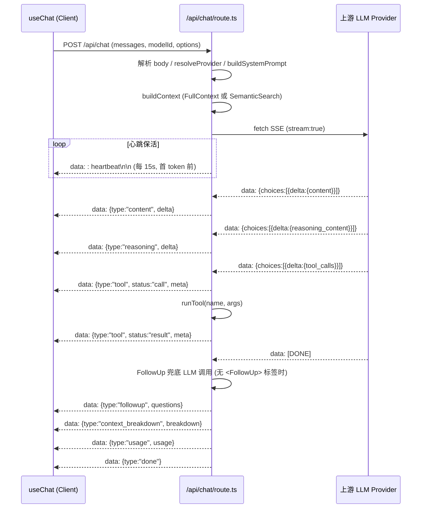
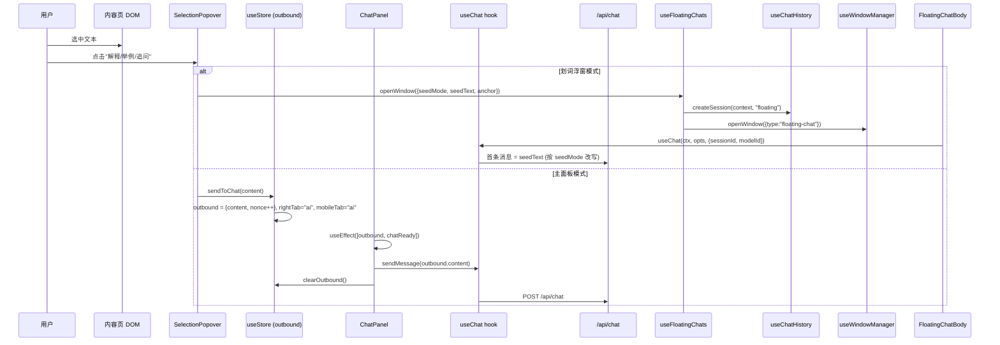
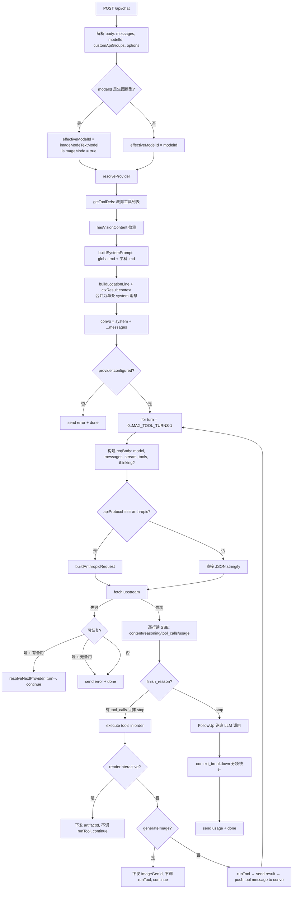
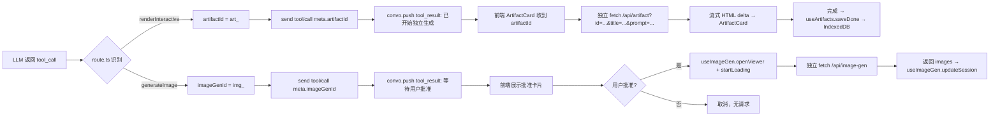

# AI 对话系统 深度调研报告

> **调研人**：Agent-B（AI与存储调研员）
> **调研日期**：2026-07-05
> **项目版本**：gailvlun v0.3.1
> **关联文档**：[存储架构规范](../../docs/refer/storage-architecture.md)、[性能审查报告](../../docs/refer/performance-audit-report.md)、[渲染架构](../../docs/refer/rendering-architecture.md)
>
> **⚠ 过时快照。** §1 与 §3–§9 是 2026-07 调研（734 行 `route.ts`、`anthropicAdapter`、9 个工具、`MAX_TOOL_TURNS`）——这些在现网**都不存在**。不要按那些段落改代码。
>
> 权威入口：[`docs/plans/Agent-refactor/00-loop-map.md`](../../plans/Agent-refactor/00-loop-map.md)（本轮 Agent 整改）· [`docs/analysis/Agent/00-agent-issues-consolidated.md`](../Agent/00-agent-issues-consolidated.md)（问题事实）。当前工具目录以本节「2.0」与 `docs/refer/adding-an-agent-tool.md` 为准。
>
> **目录校准（2026-09，计划 22/23，计划 `25` 复核并修正 §2.0）**：下文是 2026-07 的调研快照（行号、9 工具、`lib/ai/tools.ts`、`useChat` 543 行均已过时）。本次复核发现 §2.0 之前把结果卡片注册表误写成 `lib/ai/agent/tools/catalog.ts`（该文件不存在），已修正为真实位置 `components/chat/toolCards/registry.tsx`。

## 2.0 当前目录结构（2026-09）

Agent 工具不再集中在 `lib/ai/tools.ts` / `lib/ai/agent/tools.ts`。每个工具一个目录：

```
lib/ai/agent/tools/
  index.ts            # 同构入口：只导出类型 + StudyToolName + TOOL_PRESENTATION/getToolPresentation
                       # （@public 兼容旧 import），禁止 re-export tool.ts / server.ts
  server.ts           # 仅服务端：buildStudyTools
  names.ts            # StudyTools / StudyToolName / STUDY_TOOL_NAMES
  registry.ts         # 类型定义：ToolModule / ResultCardProps / ToolPresentation 等（不含实际注册表数据）
  presentations.ts    # TOOL_PRESENTATION：思考链步骤标题/设置面板文案/图标
  <name>/types.ts + presentation.ts + tool.ts

components/chat/toolCards/
  registry.tsx         # TOOL_REGISTRY（各工具 ResultCard 绑定）+ RESULT_CARD_ORDER + TOOL_RESULT_CARDS
                        # ——真正承载「哪个工具配哪张结果卡片、按什么顺序显示」的数据在这里，不在 lib/ 下
  <name>Card.tsx        # 7 个工具的结果卡片组件（原 lib/ai/agent/tools/<name>/ResultCard.tsx，计划 23 搬出 lib/）
```

13 个工具：`getCurrentPage`、`getOutline`、`getSection`、`searchNotes`、`searchNoteImages`、`webSearch`、`imageSearch`、`renderInteractive`、`drawDiagram`、`generateImage`、`createQuiz`、`writeDocument`、`useSkill`。其中七个有结果卡片（searchNotes / webSearch / renderInteractive / generateImage / createQuiz / searchNoteImages / writeDocument），卡片组件在 `components/chat/toolCards/`，显示顺序由该目录 `registry.tsx` 的 `RESULT_CARD_ORDER` 决定。`ChatMessage.tsx` 经这份 registry 渲染，无工具名字面量。

`useChat.ts` 只剩编排（≤120 行）。`sendMessage` 拆到 `lib/chat/`：`canSendNow`、`resolveRequestSettings`、`estimateContextBudget`、`buildChatRequestBody`、`createStallWatchdog`、`kickoffSessionTitle`、`resolveFollowUps`、`classifySendError`、`hydrateForRequest`、`executeChatRequest`。

`ChatSettings` 壳在 `components/chat/settings/ChatSettings.tsx`（≤150 行），旧路径 `components/chat/ChatSettings.tsx` 是 re-export。

## 1. 执行摘要

> **本节为 2026-07 快照，已过时。** 当时的 734 行 `route.ts`、`anthropicAdapter`、9 个工具、`MAX_TOOL_TURNS` 均已不存在。现网是 `ToolLoopAgent` + 唯一一条 system + 14 个工具目录（含 `getArtifact`），权威见 `docs/plans/Agent-refactor/00-loop-map.md`。

gailvlun 的 AI 对话系统是一个**自建的多协议、多模型、工具调用 + 流式 SSE 中转层**，核心入口 `app/api/chat/route.ts`（734 行）以 OpenAI Chat Completions 为「内部中立协议」，在出口处通过 `anthropicAdapter.ts` 双向翻译 Anthropic Messages 协议，对内统一了工具调用、reasoning 增量、usage 累加、FollowUp 兜底等逻辑。系统提供 9 个工具（getCurrentPage / getOutline / getSection / searchNotes / webSearch / renderInteractive / imageSearch / drawDiagram / generateImage / useSkill），通过 `MAX_TOOL_TURNS=6` 循环 + `loadedContextKeys` 去重防止重复展开。

前端 `useChat` hook（543 行）实现 60ms UI 节流 + 60s stall 超时 + 划词浮窗 overrides 复用 + 计费记录 + FollowUp 兜底链路。混合检索采用 BM25 + vector（top-K min-heap）+ RRF 合并 + rerank 精排（含智谱容灾）。系统通过稳定系统前缀（global.md + 学科 .md + 全局上下文 + 固定技能）+ 易变上下文（定位行 + 参考材料）的拆分命中上游 prefix cache，并通过心跳保活、端点容灾降级链、生图模式文本模型 fallback 等机制保障可用性。整体设计在「单文件、零外部 SDK 依赖、协议中立」方向上做得相当纯粹，但 `route.ts` 单文件 734 行承载所有逻辑（含 FollowUp 兜底 LLM 调用、上下文分项统计、容灾降级）也带来了一定维护负担。

## 2. 架构总览

```mermaid
flowchart TB
    subgraph Client["客户端 (浏览器 / Electron)"]
        UI[ChatPanel / FloatingChatBody]
        useChat[useChat hook]
        useChatHistory[(useChatHistory store)]
        useTokenTracker[(useTokenTracker / useFloatingTokenTracker)]
        useBilling[(useBillingStore)]
    end

    subgraph NextAPI["Next.js API Routes (Node.js runtime)"]
        chatRoute["/api/chat/route.ts<br/>(主 SSE 流 + 工具循环)"]
        artifactRoute["/api/artifact/route.ts<br/>(独立 HTML 流式生成)"]
        imageGenRoute["/api/image-gen/route.ts<br/>(生图)"]
        canvasRevise["/api/canvas-revise/route.ts<br/>(Canvas 修订)"]
        chatTitle["/api/chat-title/route.ts<br/>(会话标题)"]
        followUps["/api/follow-ups/route.ts<br/>(追问)"]
    end

    subgraph LibAI["lib/ai/ 中立协议层"]
        provider[provider.ts<br/>resolveProvider / 端点链]
        models[models.ts<br/>模型注册表]
        tools[tools/server.ts<br/>13 工具 buildStudyTools]
        anthropic[anthropicAdapter.ts<br/>双向翻译]
        upstream[upstream.ts<br/>错误解析 + 容灾判定]
        artifact[artifact.ts<br/>streamInteractiveArtifact]
        prompts[prompts/index.ts<br/>稳定前缀]
        webSearch[webSearch.ts<br/>智谱 Web Search]
        imageSearch[imageSearch.ts<br/>Unsplash]
        embedding[embedding.ts<br/>BAAI/bge-m3]
    end

    subgraph Search["lib/ai/search/ 混合检索"]
        hybrid[hybridSearch.ts<br/>RRF + rerank]
        bm25[bm25Store.ts<br/>BM25 + bigram 分词]
        vector[vectorStore.ts<br/>余弦相似度 + top-K min-heap]
    end

    subgraph Context["lib/context/"]
        factory[factory.ts]
        fullCtx[fullContext.ts<br/>课程目录 + 当前页]
        semCtx[semanticSearch.ts<br/>当前页 + 语义检索]
        estimate[estimateTokens.ts<br/>纯函数 token 估算]
    end

    subgraph Upstream["上游 LLM Provider"]
        SF[硅基流动 SiliconFlow]
        MIMO[小米 MiMo]
        ZHIPU[智谱 GLM]
        Anthropic[Anthropic / Claude 中转]
        Custom[用户自定义 API]
    end

    UI --> useChat
    useChat --> useChatHistory
    useChat --> useTokenTracker
    useChat --> useBilling
    useChat -->|fetch SSE| chatRoute
    chatRoute --> provider
    chatRoute --> models
    chatRoute --> tools
    chatRoute --> anthropic
    chatRoute --> upstream
    chatRoute --> prompts
    chatRoute --> factory
    chatRoute --> hybrid
    chatRoute --> webSearch
    chatRoute --> imageSearch
    tools --> hybrid
    factory --> fullCtx
    factory --> semCtx
    semCtx --> hybrid
    hybrid --> bm25
    hybrid --> vector
    vector --> embedding

    provider --> SF
    provider --> MIMO
    provider --> ZHIPU
    provider --> Anthropic
    provider --> Custom

    useChat -->|独立 SSE| artifactRoute
    useChat -->|独立 POST| imageGenRoute
    useChat -->|独立 POST| canvasRevise
    useChat -->|独立 POST| chatTitle
    useChat -->|独立 POST| followUps

    artifactRoute --> artifact
    artifactRoute --> provider
    imageGenRoute --> provider
    canvasRevise --> provider
```



**核心设计原则**：
1. **OpenAI Chat Completions 作为内部中立协议** — `route.ts` 主循环只处理 `data:` SSE + `choices[0].delta` 形状；Anthropic 协议在 fetch 前后通过 adapter 双向翻译，主循环零改动。
2. **稳定前缀 + 易变上下文分离** — 系统提示词由 `buildSystemPrompt` (global.md + 学科 .md) + 全局上下文 + 固定技能构成稳定前缀；定位行 + 参考材料作为易变部分合并入单条 system 消息（部分模型如 Qwen3 不允许第二条 system）。
3. **工具产物异步分离** — `renderInteractive` / `generateImage` 在工具调用阶段只下发 ID 与元数据，前端拿到后独立请求 `/api/artifact` 与 `/api/image-gen`，**不阻塞主聊天 SSE**。
4. **服务端为真相源** — token 用量、上下文分项统计、FollowUp 兜底、容灾切换全部在服务端决策，前端只负责渲染与本地状态。

## 3. 核心机制详解

> **§3–§9 为 2026-07 快照，已过时，未按现网逐条重写。** 行号、文件名、协议适配器与工具循环都可能对不上。需要改代码时以仓库现状和 `docs/plans/Agent-refactor/` 为准。

### 3.1 OpenAI 兼容端点适配（`lib/ai/provider.ts`）

`resolveProvider(modelId, custom, endpointIndex)` 是 provider 解析的唯一入口，返回 `ResolvedProvider`（含 `registryId` / `apiModelId` / `baseUrl` / `apiKey` / `reasoningField` / `thinkingRequestStyle` / `apiProtocol` / `endpointIndex` / `timeoutMs`）。

**关键设计**：
- **registryId 与 apiModelId 分离**（`provider.ts:67-83`）— 注册 id（菜单/设置/计费）与发给上游的 model 字段解耦，支持同一注册模型在不同端点使用不同 apiModelId。
- **endpoints 链支持容灾降级**（`models.ts:29-30`、`provider.ts:304-314`）— 每个模型声明 `endpoints: ModelEndpoint[]`，`resolveNextProvider` 在 5xx/可恢复错误时切换到下一端点（如 GLM-5.2 的硅基流动 → 智谱官方）。
- **三协议自动装配**（`provider.ts:35-50`）— 用户在 UI 只选 `apiProtocol`（openai/anthropic/siliconflow），`autoConfigFromProtocol` 自动推导 `thinkingRequestStyle` 与 `reasoningField`，旧字段 `thinkingRequestStyle` 通过 `inferProtocolFromLegacy` 反向迁移。
- **多凭证池**（`provider.ts:179-192`）— `credentialsFor(provider)` 按 ProviderKind 分发到 `MIMO_BASE_URL/ZHIPU_BASE_URL` 或默认 `AI_BASE_URL`，互不污染。
- **可恢复错误白名单**（`upstream.ts:30-37`）— 仅 502/503/504 + 智谱 1211/20012/1210 触发端点切换；401/403/429 不降级（换 key 无效）。

### 3.2 Anthropic Adapter（`lib/ai/anthropicAdapter.ts`）

双向翻译层，让 `route.ts` 主循环对 Anthropic 协议零感知。

**请求方向（OpenAI → Anthropic）**：
- `system` 消息抽到顶层 `system` 字段（多段拼接）（`anthropicAdapter.ts:172-184`、`257-301`）
- `image_url`（http/data URL）→ `image` block（`source.type = url/base64`）（`anthropicAdapter.ts:59-79`）
- `assistant.tool_calls` ↔ `tool_use` blocks（id 直通，保留 `toolu_xxx`）（`anthropicAdapter.ts:218-244`）
- `role:"tool"` ↔ `role:"user" + tool_result block`（`anthropicAdapter.ts:186-208`）
- `tools[].function.parameters` ↔ `tools[].input_schema`（`anthropicAdapter.ts:126-144`）
- `tool_choice` 三态映射：`auto→auto`、`none→none`、`required→any`、`{function:{name}}→tool`（`anthropicAdapter.ts:109-124`）
- thinking 模式强制 `max_tokens > budget_tokens + 4096` 且 `temperature=1`（Anthropic 硬约束）（`anthropicAdapter.ts:280-293`）
- 同角色相邻消息合并（Anthropic 要求）（`anthropicAdapter.ts:156-165`）

**响应方向（Anthropic SSE → OpenAI SSE）**：
- `message_start` 累加 input/output_tokens（`anthropicAdapter.ts:407-415`）
- `content_block_start` 标记 block 角色（text/thinking/tool_use）（`anthropicAdapter.ts:417-462`）
- `text_delta` → `delta.content`、`thinking_delta` → `delta.reasoning`、`input_json_delta` → `delta.tool_calls[].function.arguments`（`anthropicAdapter.ts:464-512`）
- `message_delta` 映射 `stop_reason` → `finish_reason`（`end_turn→stop`、`tool_use→tool_calls`、`max_tokens→length`）（`anthropicAdapter.ts:358-370`、`519-533`）
- `message_stop` 输出最终 usage + `[DONE]`（`anthropicAdapter.ts:535-545`）
- 兼容 One-API 与官方两种鉴权：同时下发 `x-api-key` 与 `Authorization: Bearer`（`anthropicAdapter.ts:312-318`）

### 3.3 工具调用系统（2026-07 快照；现网见 §2.0）

> 2026-07 时 9 个工具集中在 `lib/ai/tools.ts`。2026-09 已迁到 `lib/ai/agent/tools/<name>/`，由 `server.ts` 的 `buildStudyTools` 组装。下面清单仍反映当时的调度语义，路径以 §2.0 为准。

**工具清单**：

| 工具 | 用途 | contextKey | 是否阻塞主 SSE |
|------|------|-----------|----------------|
| `getCurrentPage` | 取当前阅读页正文 | `page:{subject}/{cat}/{item}` | 阻塞 |
| `getOutline` | 取全科目课程目录 | `outline:all` | 阻塞 |
| `getSection` | 按路径取任意页正文 | `section:{...}` | 阻塞 |
| `searchNotes` | 全文检索 + 路径返回 | `search:{normalizedQuery}` | 阻塞 |
| `webSearch` | 智谱 Web Search + 内存 LRU 缓存 | `web:{normalizedQuery}` | 阻塞 |
| `imageSearch` | Unsplash 图片搜索（限 20 张/对话） | `image:{normalizedQuery}` | 阻塞 |
| `renderInteractive` | 触发独立 `/api/artifact` 流式生成 HTML | 无（仅下发 artifactId） | **不阻塞** |
| `drawDiagram` | 返回 SVG 编写指南（不生成图） | 无 | 不阻塞 |
| `generateImage` | 触发独立 `/api/image-gen` 生图（用户批准后） | 无 | **不阻塞** |
| `useSkill` | 加载用户技能全文到上下文 | `skill:{id}` | 阻塞 |

**调度逻辑**：
- `getToolDefs`（`tools.ts:213-246`）按 `enableSearch` / `disabled` / `skillNames` 动态裁剪 tool 列表；`useSkill` 的 `name` 参数 enum 注入技能名清单（提升选名准确度 + 利于 prefix cache）。
- 工具调用循环上限 `MAX_TOOL_TURNS = 6`（`route.ts:33`），超过即发送已累加 usage 后结束。
- `loadedContextKeys` 去重（`route.ts:269`、`572-575`）— 同一 contextKey 工具结果再次被请求时，注入「上下文已加载，请引用前文」提示，避免重复展开全文。
- `imageSearchFetchedCount` 跨轮累计（`route.ts:309`、`tools.ts:316-353`）— 达到 `IMAGE_SEARCH_MAX_TOTAL = 20` 后从 `effectiveToolDefs` 中滤掉 `imageSearch`，防止 AI 反复调用。
- 工具结果归类统计（`route.ts:646-672`）— 按工具名把 token 计入 `tools/skills/conversation/pages/webSearch` 分项，供前端 `TokenDashboard` 展示。

### 3.4 流式响应（SSE）链路



**服务端 SSE 编码**（`route.ts:35-37`、`166-188`）：
- `sse(obj)` 工具函数统一 `data: ${JSON}\n\n` 格式
- `ReadableStream<Uint8Array>` + `TextEncoder` 流式写入
- 心跳保活：`startHeartbeat` 在首 content token 之前每 15s 发送 `: heartbeat\n\n`（SSE 注释行），防止 EdgeOne 边缘节点 idle timeout 断连
- 首 content token 到达后 `stopHeartbeat`

**前端 SSE 解析**（`useChat.ts:301-465`）：
- `response.body.getReader()` + `TextDecoder` + `parseSseJsonEvents` 增量解析
- `stallChecker` setInterval 5s 检查，60s 无事件即 `abortController.abort()`（`useChat.ts:307-313`）
- 事件类型处理：`content` / `reasoning` / `tool` (call/result) / `context_breakdown` / `usage` / `followup` / `error` / `done`

**UI 节流**（`useChat.ts:236-254`、`streamUiThrottle.ts`）：
- `createStreamUiThrottle()` 60ms 尾随节流（`STREAM_UI_THROTTLE_MS = 60`）
- 每次 `content` / `reasoning` / `tool` 事件 → `scheduleUi(writeUi)` 只保留最新 pending write
- `flushUiNow()` 在流结束 / 错误 / 卸载时强制刷新，避免丢字
- `writeUi` 内部重新调用 `splitThinkContent` 拆分 `<think >...</think >` 闭合标签，让内嵌思考也能实时进思考面板

### 3.5 上下文管理（`lib/context/`）

**两种 ContextManager**（`factory.ts:5-7`）：
- `FullContextManager`（`fullContext.ts`）— 课程目录摘要 + 当前页全文，模块级 `_contextCache` 用 md5 hash 检测 cacheHit
- `SemanticSearchManager`（`semanticSearch.ts`）— 当前页全文 + `hybridSearch(userMessage, 5)` 检索结果

**Token 估算**（`estimateTokens.ts`）— 纯函数，无 Node.js 依赖：
- CJK 字符（0x4dff~0x9fff）→ 2 token
- ASCII 字母 → 0.325 token
- 空白 → 0.2 token
- 其他 → 1 token

**模型 token 上限**（`types.ts:19-30`）— 硬编码表 `MODEL_TOKEN_LIMITS`：DeepSeek/MiMo Pro = 1M，MiMo Flash = 256K，default = 128K。

**滑动窗口**（`buildRequestMessages.ts`）：
- `DEFAULT_MAX_TURNS = Number.MAX_SAFE_INTEGER`（默认全量）
- `SOFT_LIMIT_MAX_TURNS = 16`（上下文达 80% 软上限时启用）
- 含附件的 user 消息始终保留（`preserveAttachmentHistory` 默认 true）
- `useChat.ts:259-265` 在 `contextSoftLimitReached` 时切换到 `SOFT_LIMIT_MAX_TURNS` + `preserveAttachmentHistory: false`

**软上限触发**（`useChat.ts:196-219`、`route.ts:221-226`）：
- 客户端估算：`estimatedContextTokens / fixedContextLimit >= 0.8`
- 服务端复算：`ctxResult.tokenCount / contextBudget >= 0.8` 或 `ctxResult.overflow`
- 触发后：客户端发 `contextTruncated: true` + 切换滑动窗口；服务端在系统消息中追加「上下文策略」说明，省略完整参考材料

### 3.6 划词问 AI 流程



**核心类型**（`lib/stores/ui.ts`，2026-09 现网路径；原 `lib/store.ts` 现为转发壳）：
```typescript
interface OutboundMessage {
  content: string;  // 完整内容（可能含划词引用）
  nonce: number;    // 递增序号，驱动 useEffect
}
```

**触发点**（`lib/stores/ui.ts` 的 `sendToChat`）：
```typescript
sendToChat: (content) => set((s) => ({
  rightTab: "ai",
  mobileTab: "ai",
  outbound: { content, nonce: (s.outbound?.nonce ?? 0) + 1 },
})),
```

**消费点**（`ChatPanel.tsx:67-72`）：
```typescript
useEffect(() => {
  if (chatReady && outbound && outbound.content) {
    sendMessage(outbound.content);
    clearOutbound();
  }
}, [outbound, sendMessage, clearOutbound, chatReady]);
```

`chatReady` 来自 `useChatReady()`，确保 manifest 已加载且 active 会话消息就绪后才响应 outbound，**避免水合前抢跑导致历史丢失**。

### 3.7 Canvas 修订机制（`app/api/canvas-revise/route.ts`）

独立 POST 路由（非流式），用于 AI 修订 CanvasBlock。

**流程**（`canvas-revise/route.ts:23-99`）：
1. 接收 `{block, instruction, topic, modelId, customApiGroups}`
2. 校验：`block.kind` 必须是 string、`instruction` 非空、`modelId` 非空且非生图模型
3. `resolveProvider(modelId, customApiGroups)` → 上游 chat/completions（非流式）
4. `buildCanvasRevisionMessages`（`revisionPrompt.ts:9-50`）构造系统提示词（列出 5 种 kind：raw-svg/plot/multi-plot/molecule/html 的输出契约）+ user 消息（JSON.stringify 当前 block + 指令 + 期望输出形状）
5. `extractCanvasRevisionBlock`（`revisionOutput.ts:124-154`）解析输出：优先匹配完整 `<svg>...</svg>` → 否则尝试 `<SvgDiagram>` 旧标签 → 否则 `parseJsonObject` 提取 JSON
6. `diagnoseCanvasBlock`（`revisionOutput.ts:156-206`）按 kind 校验：raw-svg 完整性、plot 表达式可采样、multi-plot 全部 plot 可采样
7. 返回 `{block, diagnostics}` 或 `{error, rawOutput, diagnostics}` (422)

**设计要点**：
- 非流式 + `temperature: 0.2` + `max_tokens: 6000`，追求稳定结构化输出
- 系统提示词强制「只输出一个 JSON 对象，无 markdown 围栏」，但仍兼容围栏（`stripFence`）
- 允许 AI 在修订时**切换 kind**（如从 plot 改为 raw-svg），「仅在当前 kind 仍是最佳表示时保留」
- 诊断信息回传前端，便于失败时给用户精确报错

## 4. 数据流与调用链路

### 4.1 完整请求处理流程（`route.ts:72-733`）



### 4.2 工具调用产物 ID 流转



## 5. 关键代码路径

| 模块 | 文件:行号 | 说明 |
|------|----------|------|
| 主路由 | `app/api/chat/route.ts:72-733` | POST handler 完整实现 |
| SSE 编码 | `app/api/chat/route.ts:35-37` | `sse()` 工具函数 |
| 心跳保活 | `app/api/chat/route.ts:172-188` | `startHeartbeat`/`stopHeartbeat` |
| 工具循环 | `app/api/chat/route.ts:311-597` | `for turn` + tool_calls 聚合 |
| 容灾降级 | `app/api/chat/route.ts:284-298`、`389-416` | `tryFailover` + 生图 fallback |
| 上下文分项统计 | `app/api/chat/route.ts:646-680` | `ContextBreakdown` 计算 |
| Provider 解析 | `lib/ai/provider.ts:223-302` | `resolveProvider` |
| 端点链切换 | `lib/ai/provider.ts:305-314` | `resolveNextProvider` |
| Anthropic 请求翻译 | `lib/ai/anthropicAdapter.ts:257-328` | `buildAnthropicRequest` |
| Anthropic 流翻译 | `lib/ai/anthropicAdapter.ts:377-601` | `anthropicStreamToOpenAI` |
| 工具定义 | `lib/ai/agent/tools/<name>/tool.ts` | 每工具 `createXxxTool` |
| 工具组装 | `lib/ai/agent/tools/server.ts` | `buildStudyTools` |
| 工具展示 / 卡片 | `components/chat/toolCards/registry.tsx`（原设想的 `lib/ai/agent/tools/catalog.ts` 并不存在，2026-09 现网数据在 `components/`） | `TOOL_REGISTRY` / `RESULT_CARD_ORDER` |
| useChat 入口 | `lib/hooks/useChat.ts` | 编排；纯函数在 `lib/chat/` |
| 水合门控 | `lib/hooks/useChat.ts:100-105` | `_hasHydrated` + `sessionLoadState` |
| 模型选择 | `lib/hooks/useChat.ts:108-117` | `effectiveModelId` + thinking 能力约束 |
| 上下文预算 | `lib/hooks/useChat.ts:191-219` | `fixedContextLimit` + 软上限 |
| UI 节流 | `lib/hooks/useChat.ts:236-254` | `createStreamUiThrottle` |
| SSE 读取 | `lib/hooks/useChat.ts:301-465` | 事件分发 switch |
| FollowUp 兜底 | `lib/hooks/useChat.ts:482-519` | 三层兜底：流内 → 正文提取 → 规则生成 |
| 混合检索 | `lib/ai/search/hybridSearch.ts:102-182` | BM25+vector+RRF+rerank |
| 向量 top-K | `lib/ai/search/vectorStore.ts:141-208` | `TopKMinHeap` + `vectorSearch` |
| BM25 | `lib/ai/search/bm25Store.ts:196-239` | `bm25Search` + bigram 分词 |
| Artifact 流式 | `lib/ai/artifact.ts:123-210` | `streamInteractiveArtifact` |
| Canvas 修订 | `app/api/canvas-revise/route.ts:23-99` | 非流式 + 诊断 |
| 划词触发 | `lib/stores/ui.ts`（原 `lib/store.ts` 现为转发壳） | `sendToChat` |
| 划词消费 | `components/chat/ChatPanel.tsx:67-72` | outbound useEffect |

## 6. 设计决策与取舍分析

### 6.1 单文件 route.ts vs 拆分

**决策**：`route.ts` 单文件 734 行承载请求解析、provider 解析、工具循环、SSE 编码、FollowUp 兜底、上下文统计、容灾降级。

**取舍**：
- ✅ 优点：所有边界条件在一处可见，工具调用循环与 usage 累加共享同一作用域；无跨文件状态传递
- ❌ 缺点：单文件超长，FollowUp 兜底（`route.ts:582-644`）独立 LLM 调用、上下文分项统计（`route.ts:646-680`）本可独立模块
- **现状评估**：长度合理（性能审查也指出「性能问题在订阅模式而非行数」），不建议机械拆分

### 6.2 协议中立 vs 原生 SDK

**决策**：不使用 `openai` / `@anthropic-ai/sdk` 官方 SDK，自建 `fetch + SSE 解析`。

**取舍**：
- ✅ 优点：零依赖、bundle 体积小、EdgeOne 部署友好、可精确控制 SSE 编码与心跳
- ✅ 优点：Anthropic adapter 复用主循环所有逻辑（工具、reasoning、usage）
- ❌ 缺点：需自己维护 SSE 解析、错误码映射、token usage 字段名兼容（`reasoning_content` / `reasoning` / `thinking` 多别名）
- **现状评估**：自建正确性已通过 1228 个测试验证，且 `extractReasoningDelta`（`provider.ts:126-140`）已处理结构化对象场景

### 6.3 工具产物异步分离

**决策**：`renderInteractive` / `generateImage` 在 tool_call 阶段只下发 ID，前端独立请求。

**取舍**：
- ✅ 优点：主聊天 SSE 不阻塞（HTML 生成可能 30s+，生图 2-3 分钟）
- ✅ 优点：用户可在生图前批准/取消，避免无谓计费
- ✅ 优点：失败可独立重试，不影响主对话上下文
- ❌ 缺点：前端需维护两套状态机（ArtifactCard / ImageGenCard）
- **现状评估**：正确取舍，复杂度被局限在前端组件层

### 6.4 稳定前缀 + prefix cache 优化

**决策**：系统消息由 `buildSystemPrompt`（global.md + 学科 .md，生产环境缓存）+ 全局上下文 + 固定技能 + 技能菜单构成，多轮间逐字节一致；易变上下文（定位行 + 参考材料）合并入同一 system 消息。

**取舍**：
- ✅ 优点：命中上游 prefix cache（DeepSeek 0.03/M、MiMo 0.02/M cached input 价）
- ✅ 优点：技能按 `createdAt` 稳定排序（`route.ts:120-121`）保证拼装逐字节一致
- ❌ 缺点：单条 system 消息体积大（含课程目录 + 当前页全文），首次未命中 cache 时成本高
- **缓解**：`fullContext.ts` 模块级 `_contextCache` 用 md5 hash 检测重复请求，标记 `cacheHit` 给前端展示

### 6.5 划词浮窗 overrides 复用

**决策**：`useChat(ctx, opts, overrides?: {sessionId, modelId})` 支持划词浮窗复用同一流式引擎（`useChat.ts:60-84`）。

**取舍**：
- ✅ 优点：浮窗与主面板共享 60ms 节流、stall 检测、FollowUp 兜底、计费记录逻辑
- ✅ 优点：`ovSessionId` 时不写全局 token 看板，避免多窗互相污染
- ❌ 缺点：浮窗关闭时需手动清理 `useFloatingTokenTracker.resetSession`（当前 `closeWindow` 未调用，存在轻微内存泄漏）

## 7. 问题清单

| # | 问题描述 | 严重程度 | 涉及文件 | 建议修复方向 |
|---|----------|----------|----------|--------------|
| 1 | `useFloatingChats.closeWindow` 关闭浮窗时未调用 `useFloatingTokenTracker.resetSession(sessionId)`，导致 `sessions` Record 持续累积已关闭会话的 token 统计 | P2 | `lib/stores/floatingChats.ts`、`lib/stores/floatingTokenTracker.ts`（2026-09 现网路径；原 `lib/hooks/useFloatingChats.ts` / `useFloatingTokenTracker.ts` 现为转发壳，行号未重新核对） | 在 `closeWindow` 删除 sessionId 前 `useFloatingTokenTracker.getState().resetSession(sessionId)` |
| 2 | `route.ts:582-644` 的 FollowUp 兜底 LLM 调用直接在主循环内嵌套 fetch，未走 provider 解析层，使用 `provider.baseUrl` 而非 `activeProvider.baseUrl`，端点切换后仍走原端点 | P2 | `app/api/chat/route.ts:590-617` | 改用 `chatCompletionsUrl(activeProvider.baseUrl)` + `activeProvider.apiKey`，或抽离为独立模块 |
| 3 | `extractReasoningDelta` 字段优先级 `[preferredField, "reasoning_content", "reasoning", "reasoning_text", "thinking"]`（`provider.ts:130-131`）未去重 `preferredField`（若它等于 "reasoning"，会先匹配一次再匹配 "reasoning_content"） | P3 | `lib/ai/provider.ts:130-131` | `filter((field, index, arr) => field && arr.indexOf(field) === index)` 已存在但应确保 `preferredField` 空字符串也被过滤 |
| 4 | `MAX_TOOL_TURNS = 6` 达到上限后只发 usage + done，未发送 `info` 事件告知用户「工具调用次数已达上限，可能未完成」 | P3 | `app/api/chat/route.ts:699-713` | 在循环结束后 `send({type:"info", message:"工具调用次数已达上限..."})` |
| 5 | `estimateTokens`（`estimateTokens.ts`）的 CJK 范围 `0x4dff < code < 0x9fff` 漏了 CJK Ext A（0x3400~0x4dbf）与扩展区；且 `0x4dff` 与 `0x9fff` 边界使用 `<` 而非 `<=` 导致 0x4e00 起始被正确包含但 0x9fff 被排除 | P3 | `lib/context/estimateTokens.ts:7` | 改为 `code >= 0x3400 && code <= 0x9fff` 或用 Unicode property escape `/^\p{Script=Han}$/u` |
| 6 | `imageSearchFetchedCount` 仅在 `route.ts` 单次请求内累计，跨请求（多轮对话）不持久化，AI 可在新请求中再次调用达上限 | P3 | `app/api/chat/route.ts:309` | 设计如此（每次请求独立），但应在系统提示中告知 AI「本次对话累计」语义仅限单次请求 |
| 7 | `canvas-revise/route.ts` 使用 `AbortSignal.timeout(provider.timeoutMs)`（`route.ts:70`），Node.js 17.3+ 才支持；若部署到更低版本会运行时报错 | P3 | `app/api/canvas-revise/route.ts:70` | 改用 `AbortController + setTimeout` 模式（与 `route.ts:346-347` 一致） |
| 8 | `artifactRegistry.ts` 是空文件（`export {}`）但仍在代码库中，注释说明已废弃 | P3 | `lib/ai/artifactRegistry.ts` | **已修复**（2026-09 核实：该文件已被删除，不再存在） |
| 9 | `follow-ups/route.ts` 与 `route.ts:582-644` 内的 FollowUp 兜底逻辑重复（两处都调用 LLM 生成追问），但前者似乎未被前端调用 | P3 | `app/api/follow-ups/route.ts`、`lib/hooks/useChat.ts:482-519` | 确认是否仍需要 `/api/follow-ups`；若不需要则删除；若需要则统一逻辑 |
| 10 | `useChat.ts:498-509` 的前端 FollowUp 兜底使用硬编码正则分类（解释/出题/推导/比较），未考虑学科差异 | P3 | `lib/hooks/useChat.ts:498-509` | 抽离到 `lib/chat/fallbackFollowUps.ts`，支持学科定制 |

## 8. 改进建议

### P0（高收益，立即）
- 无 P0 项。当前 AI 对话系统功能完整、容灾完善，无阻塞性问题。

### P1（中收益，近期）
1. **抽离 FollowUp 兜底逻辑**：`route.ts:582-644` 的内嵌 LLM 调用抽离为 `lib/ai/followUpFallback.ts`，复用 provider 解析层；同时评估 `/api/follow-ups` 路由是否仍需要。
2. **浮窗 token tracker 清理**：`useFloatingChats.closeWindow` 调用 `useFloatingTokenTracker.resetSession`，避免长期使用后 `sessions` Record 膨胀。

### P2（中收益，中期）
3. **工具调用次数达上限提示**：`route.ts:699-713` 发送 `info` 事件，前端在 `ToolCallDashboard` 展示「已达上限」徽标。
4. **estimateTokens 精度提升**：用 `\p{Script=Han}` Unicode property escape 替代手动码位判断；考虑引入 `gpt-tokenizer`（纯 JS、无 wasm）用于关键路径精算。
5. **工具调用并发执行**：当前 `for (const c of calls)` 串行执行工具（`route.ts:501-577`），可对无依赖工具（如多个 `imageSearch`）用 `Promise.all` 并发。

### P3（低紧迫，可选）
6. **删除废弃文件**：`lib/ai/artifactRegistry.ts` 已空，可删除。
7. **工具描述国际化**：`ALL_TOOLS` 内 description 全中文硬编码，未来国际化需抽离。
8. **Canvas 修订流式化**：当前 `canvas-revise` 非流式 + `max_tokens: 6000`，复杂 SVG 可能被截断；可改为 SSE 流式 + 前端实时预览。

## 9. 与全自动化平台改造的关系

### 9.1 已具备的平台化基础
- **协议中立层**：OpenAI/Anthropic/SiliconFlow 三协议自动装配，新增 provider 只需在 `models.ts` 注册 endpoints 链，无需改 route.ts。
- **工具系统可扩展**：`ALL_TOOLS` 字典 + `getToolDefs` 动态裁剪，新增工具只需添加定义 + `runTool` case。
- **多模型菜单**：`MODELS` 注册表 + `CustomApiGroup` 多组架构，支持用户自带 API。
- **独立产物路由**：`/api/artifact`、`/api/image-gen`、`/api/canvas-revise` 已独立，可被外部编排系统直接调用。
- **计费与 token tracking**：`useBillingStore` 已按 provider/model 分类记录，CSV 导出就绪。

### 9.2 平台化改造建议
1. **抽离 chat engine 为独立 service**：`route.ts` 的工具循环 + SSE 编码可抽离为 `lib/ai/chatEngine.ts`，供 CLI / API / 测试复用，而非绑定 Next.js Route Handler。
2. **工具注册去中心化**：当前 `ALL_TOOLS` 集中在 `tools.ts`，平台化后应支持插件式注册（如 `registerTool(def, handler)`），便于第三方扩展。
3. **Provider 配置热更新**：当前 `process.env.*` 启动时读取，平台化多租户场景需支持运行时配置（已有 `customApiGroups` 走请求 body，可扩展到服务端）。
4. **工具调用审计日志**：`runTool` 当前无结构化日志，平台化需记录工具调用链（tool name / args / duration / contextKey hit）用于调试与成本归因。
5. **混合检索作为独立微服务**：`hybridSearch` 加载 307MB 索引常驻内存，多实例部署时重复占用；可拆为独立 search service，通过 HTTP/gRPC 调用。
6. **Canvas 修订泛化**：当前仅支持 5 种 kind，平台化可抽象为「结构化文档修订」通用能力（支持 Mermaid / Flowchart / Math 等更多 kind）。

## 10. 参考资料

- [OpenAI Chat Completions API](https://platform.openai.com/docs/api-reference/chat/streaming)
- [Anthropic Messages API](https://docs.anthropic.com/en/api/messages)
- [Anthropic Extended Thinking](https://docs.anthropic.com/en/docs/build-with-claude/extended-thinking)
- [SiliconFlow Rerank API](https://docs.siliconflow.cn/api-reference/rerank/create-rerank)
- [Zustand persist middleware](https://zustand.docs.pmnd.rs/reference/integrations/persisting-store-data)
- [项目内：存储架构规范](../../docs/refer/storage-architecture.md)
- [项目内：性能审查报告 §5.1 AI 对话与历史](../../docs/refer/performance-audit-report.md)
- [项目内：渲染架构](../../docs/refer/rendering-architecture.md)
