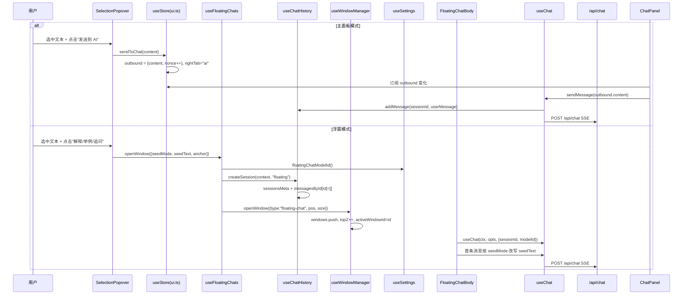
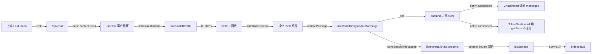
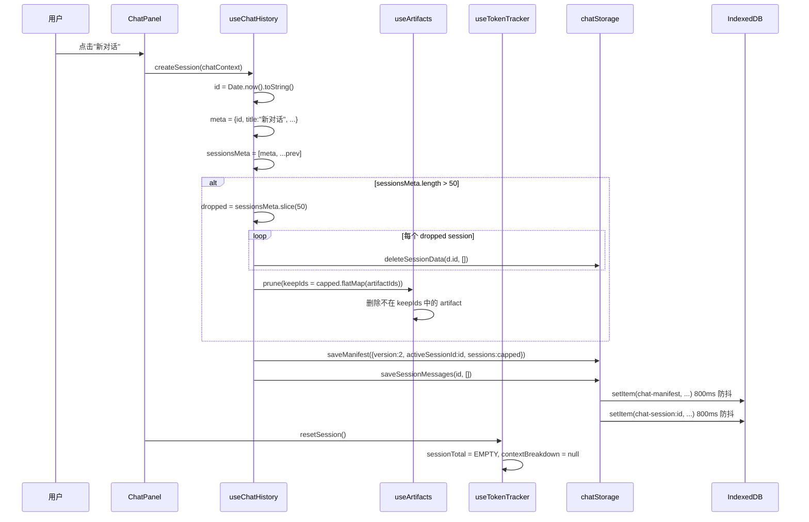

# 状态管理 深度调研报告

> **调研人**：Agent-B（AI与存储调研员）
> **调研日期**：2026-07-05（正文机制描述）；**2026-09 全量校对重写**（计划 `25`，随计划 `22` 的 store 搬家同步）
> **项目版本**：gailvlun v0.3.1 → v0.4.x
> **关联文档**：[存储架构规范](../refer/storage-architecture.md)、[性能审查报告](../refer/performance-audit-report.md)、`lib/stores/README.md`（store 清点的权威来源）、`docs/plans/00-execution-contract.md` 第六节
>
> **本次重写说明**：2026-07 初版基于当时的 `lib/store.ts`（全局 store 真身）+ `lib/hooks/useXxx.ts`（17 个 store 散落各处）快照撰写。计划 `22` 把全部 store 收进 `lib/stores/`（现网 **28** 个），`lib/store.ts` 与原 `lib/hooks/useXxx.ts` 只留 `@public @deprecated` 的一行转发壳（`export * from "@/lib/stores/xxx"`）。**本篇已按现网结构整篇重写**，机制性结论（订阅优化、持久化模式、跨 store 调用）在搬家后逐一核对仍然成立，仅路径与数量更新；历史决策分析（§6）保留 2026-07 视角作为演进记录。

## 0. 目录结构速查（2026-09 现网）

```
lib/stores/                      # 唯一真相源，28 个文件（不含测试、_persist.ts）
  _persist.ts                    # createPersistedStore：套 zustand persist + idb 的公共封装
  ui.ts                          # useStore（原 lib/store.ts 的真身，全局导航/布局/outbound/PiP/TOC）
  chatHistory.ts                 # useChatHistory
  quiz.ts                        # useQuizStore（原 lib/quiz-store.ts）
  artifacts.ts / documents.ts / imageGen.ts / skills.ts / reviewCards.ts / billing.ts
                                  # 6 个走 createPersistedStore 包装（idb persist）
  settings.ts / theme.ts / browser.ts / academicYear.ts
                                  # 手动 localStorage 读写（非 zustand persist 中间件）
  windowManager.ts / floatingChats.ts / chatUI.ts / contextMenu.ts
  tokenTracker.ts / floatingTokenTracker.ts
  noteCitations.ts / noteLocator.ts / recordPreviews.ts / lightbox.ts
  keyboard/                      # 子目录，4 个：keyboardSettings / reviewKeyboard / shortcutHelp / globalSearch
  README.md                      # 28 个 store 的 hook 名 + persist name 权威清单

lib/hooks/                       # 只剩真正的 React hook，不再 create( ) 任何 store
  useChat.ts / useChatReady.ts / useHydrated.ts / useToc.ts
  useAutoHideChatHeader.ts / useImageAttachments.ts / useIsMobile.ts / useIsClient.ts
  useCanvasFullscreen.ts / useFullscreenTrack.ts / useProcessingDisclosure.ts
  useStickToBottom.ts / useDraggable.ts / useResizable.ts
  useCitationLocator.ts / useEmbeddable.ts / useManagedWindowChrome.ts
  useXxx.ts（原 store 同名文件）  # 全部是 1 行 `@deprecated` 转发壳，指回 lib/stores/xxx
```

**清点口径**（与 `lib/stores/README.md` 一致）：28 个文件 = `from "zustand"` 的 `create(` **22** 个 + `createPersistedStore` 包装 **6** 个（`artifacts` / `documents` / `imageGen` / `skills` / `reviewCards` / `billing`）。只 grep `from "zustand"` 会漏掉 `chatHistory` / `chatUI` / `tokenTracker` / `floatingTokenTracker` 这 4 个（它们的 `create` 调用写法不统一，但仍是普通 zustand store）。

**`useDraggable` / `useResizable` 现状**：两个 hook 本体仍在 `lib/hooks/`，但契约上新浮窗禁止再手写这套组合——浮窗外壳统一实现是 `components/window/ManagedWindow.tsx` + `lib/hooks/useManagedWindowChrome.ts`。目前 `useResizable` 唯一存活消费方是 `components/chat/BillingDashboard.tsx`（有意未迁移的 `absolute` + 自定义拖拽窗口，非 portal 浮窗），扫死代码或读文档时不要误判为遗留垂死代码，也不要把它当作新浮窗的参考实现。

**persist name 冻结**：所有搬家均逐个核对过 key 未变（第一批端测实测无数据丢失），后续任何人都不得因为「文件挪了位置」而顺手改 persist name。

---

## 1. 执行摘要

gailvlun 的状态管理采用 **Zustand 5.0** 单一库方案，无 Redux/Recoil/Jotai 等替代品。全项目共 **28 个独立 Zustand store**（现网口径，见 §0；2026-07 初版调研时为 17 个，此后计划 `22` 完成了搬家 + 新增），按职责分为四大类：**全局 UI store**（`useStore`，`lib/stores/ui.ts`）、**功能 feature store**（`useChatHistory` / `useArtifacts` / `useDocuments` / `useQuizStore` / `useBrowser` / `useSettings` / `useTheme` / `useSkills` / `useReviewCards` / `useImageGen` / `useBillingStore` / `useAcademicYear`）、**临时 UI 态 store**（`useChatUI` / `useContextMenu` / `useWindowManager` / `useFloatingChats` / `useTokenTracker` / `useFloatingTokenTracker` / `useNoteCitations` / `useNoteLocator` / `useRecordPreviews` / `useLightbox`）、**键盘子系统 store**（`keyboard/` 下 4 个）。

核心设计模式（自 2026-07 初版沿用至今，逐一在新路径下核对仍然成立）：
1. **store 即 feature 边界** — 每个 store 对应一个功能域，`useStore` 是唯一全局 store（路由 + 布局 + outbound + PiP + TOC），其余 store 互不依赖（除少量跨 store 调用，见 §3.7）。
2. **持久化分两路** — IDB 路用 `createPersistedStore`（`lib/stores/_persist.ts`，本质是 `persist + createJSONStorage(() => idbStorage)` 的公共封装，6 个 store），LS 路用手动 `load()/persist(get)` 或就地读写模式（4 个 store：`settings` / `theme` / `browser` / `academicYear`），另有 `keyboard/keyboardSettings.ts` 走同样的手动 LS 模式。其余不持久化。
3. **引用相等订阅优化** — `useChatHistory.updateMessage` 显式保留未修改 session 的引用（性能契约），`useChat` 通过 `useChatHistory((s) => s.messagesById[sid])` 精确订阅单会话消息，避免多浮窗时全量重渲染。
4. **`getState()` 反订阅模式** — 高频更新场景用 `useChatHistory.getState()` 而非订阅，避免重渲染风暴（`performance-audit-report.md` 推荐模板）。
5. **`useSyncExternalStore` 用于水合门控** — `useHydrated` / `useChatReady`（`lib/hooks/`）用 React 18 的 `useSyncExternalStore` 订阅 zustand store，避免 tearing。

主要性能观察点（2026-07 识别，搬家未改变结论）：`useChat` 仍订阅 `useChatHistory((s) => s.activeSessionId)`（浮窗模式下存在冗余订阅可能性）；`useStore` 是承载路由 + 布局 + outbound + PiP + TOC 的较大 store（计划 `21` 又给它加了 `layoutProfile` / `rightTabs` / `rightCollapsedByProfile`，体量进一步增长）。

## 2. 架构总览

```mermaid
flowchart TB
    subgraph Global["全局 UI store"]
        useStore["useStore (lib/stores/ui.ts)<br/>路由 / 布局 / layoutProfile / outbound / PiP / TOC / mobileTab"]
    end

    subgraph Feature["Feature stores"]
        direction LR
        useChatHistory["useChatHistory<br/>lib/stores/chatHistory.ts<br/>(无 persist, 手动 IDB via chatStorage)"]
        useArtifacts["useArtifacts<br/>lib/stores/artifacts.ts<br/>(createPersistedStore · idb)"]
        useDocuments["useDocuments<br/>lib/stores/documents.ts<br/>(createPersistedStore · idb)"]
        useSkills["useSkills<br/>lib/stores/skills.ts<br/>(createPersistedStore · idb)"]
        useReviewCards["useReviewCards<br/>lib/stores/reviewCards.ts<br/>(createPersistedStore · idb)"]
        useImageGen["useImageGen<br/>lib/stores/imageGen.ts<br/>(createPersistedStore · idb)"]
        useBilling["useBillingStore<br/>lib/stores/billing.ts<br/>(createPersistedStore · idb)"]
        useSettings["useSettings<br/>lib/stores/settings.ts<br/>(手动 LS)"]
        useTheme["useTheme<br/>lib/stores/theme.ts<br/>(手动 LS + DOM)"]
        useBrowser["useBrowser<br/>lib/stores/browser.ts<br/>(手动 LS)"]
        useAcademicYear["useAcademicYear<br/>lib/stores/academicYear.ts<br/>(手动 LS)"]
        useQuiz["useQuizStore<br/>lib/stores/quiz.ts<br/>(经 lib/quiz-progress.ts 落 LS)"]
    end

    subgraph Transient["临时 UI 态 stores (无持久化)"]
        direction LR
        useChatUI["useChatUI<br/>(quotedText)"]
        useContextMenu["useContextMenu<br/>(右键菜单)"]
        useWindowMgr["useWindowManager<br/>(浮窗几何 + z-index)"]
        useFloatingChats["useFloatingChats<br/>(划词浮窗业务态；尺寸走 LS quickExplainWindowSize)"]
        useTokenTracker["useTokenTracker<br/>(主对话 token)"]
        useFloatingTokenTracker["useFloatingTokenTracker<br/>(浮窗 token per-session)"]
        useNoteCitations["useNoteCitations<br/>(引用笔记浮窗)"]
        useNoteLocator["useNoteLocator<br/>(定位到笔记正文)"]
        useRecordPreviews["useRecordPreviews<br/>(复习卡原文浮窗)"]
        useLightbox["useLightbox<br/>(图片灯箱)"]
    end

    subgraph Keyboard["键盘子系统 (lib/stores/keyboard/)"]
        direction LR
        useKeyboardSettings["useKeyboardSettings<br/>(手动 LS: gailvlun-disabled-shortcuts)"]
        useReviewKeyboard["useReviewKeyboard"]
        useShortcutHelp["useShortcutHelp"]
        useGlobalSearch["useGlobalSearch"]
    end

    subgraph Hooks["派生 hooks (lib/hooks/，无 store)"]
        direction LR
        useChat["useChat<br/>(流式引擎)"]
        useChatReady["useChatReady<br/>(水合门控)"]
        useHydrated["useHydrated<br/>(通用 persist 门控)"]
        useToc["useToc<br/>(DOM 标题扫描)"]
        useManagedWindowChrome["useManagedWindowChrome<br/>(浮窗外壳，配 ManagedWindow.tsx)"]
        useDraggableR["useDraggable / useResizable<br/>(仅 BillingDashboard 仍用)"]
    end

    subgraph Cross["跨 store 调用（举例）"]
        C1[useFloatingChats → useChatHistory.createSession]
        C2[useFloatingChats → useWindowManager.openWindow]
        C3[useFloatingChats → useSettings.floatingChatModelId]
        C4[useChatHistory.deleteSession → useArtifacts.prune]
        C5[useChat → useChatHistory / useSettings / useSkills / useTokenTracker / useBillingStore / useFloatingTokenTracker / useAcademicYear]
        C6[useDocuments.openViewer / useNoteCitations.openViewer / useRecordPreviews.open → useWindowManager.openWindow]
    end

    useFloatingChats --> C1
    useFloatingChats --> C2
    useFloatingChats --> C3
    useChatHistory --> C4
    useChat --> C5
    useDocuments --> C6
```



### 核心设计原则

- **store 即 feature 边界**：每个 store 对应一个功能域，不强行合并
- **selector 收窄订阅**：所有消费方用 `useXxx((s) => s.field)` 精确订阅，避免全量重渲染
- **`getState()` 反订阅**：流式期间高频更新组件用 `getState()` 而非订阅
- **`useSyncExternalStore` 水合门控**：避免 tearing，SSR 与客户端首帧一致
- **跨 store 调用走 `getState()`**：避免循环 import 与订阅耦合
- **持久化封装下沉**：6 个 idb-persist store 统一走 `_persist.ts` 的 `createPersistedStore`，新增一个持久化 store 不必重写 `partialize`/`onRehydrateStorage` 样板

## 3. 核心机制详解

### 3.1 全局 store：`useStore`（`lib/stores/ui.ts`，原真身 `lib/store.ts` 现为 2 行转发壳）

**职责**：路由导航态 + 布局折叠态 + 布局档位（`layoutProfile`，计划 `21` 新增）+ 右侧面板 tab + AI outbound + 移动端 tab + PiP 视频 + TOC 目录。

**状态结构**（`lib/stores/ui.ts`）：

| 字段类别 | 字段 | 类型 | 持久化 |
|---------|------|------|--------|
| 导航 | `activeSubjectId` / `activeCategoryId` / `activeItemId` / `activeChapterId` / `activeSectionId` | `string` | 否（由路由驱动） |
| 布局 | `sidebarCollapsed` / `topBarCollapsed` | `boolean` | LS `gailvlun-sidebar-collapsed` / `gailvlun-topbar-collapsed` |
| 展开 | `expandedIds` | `Set<string>` | 否（默认展开概率论） |
| 布局档位 | `layoutProfile` | `LayoutProfile`（`full`\|`article`\|`reference`，类型真相源在 `lib/content/layoutProfile.ts`） | 否（由 `setActiveRoute` 派生） |
| 右侧 | `rightTab` / `rightTabs` | `RightTab`（= `LayoutRightTab`，派生自 `layoutProfile.ts`，不在此重复声明字面量）/ `RightTab[]` | 否 |
| 右侧折叠 | `rightCollapsedByProfile` | `Record<LayoutProfile, boolean>` | LS `gailvlun-right-collapsed-by-profile` |
| AI 对话 | `outbound` | `OutboundMessage \| null` | 否 |
| 移动端 | `mobileTab` / `mobileChapterPickerOpen` | `MobileTab` / `boolean` | 否 |
| PiP | `pipVideo` / `pipStartTime` / `pipReturnTime` / `pipGeometry` | `VideoEntry \| null` / `number` / `number \| null` / `{x,y,w,h} \| null` | 否 |
| TOC | `tocMode` / `tocItems` / `activeTocId` | `boolean` / `TocItem[]` / `string \| null` | 否 |

**核心类型驱动 UI**：

```typescript
// lib/stores/ui.ts
export interface OutboundMessage {
  content: string;   // 完整内容（可能含划词引用）
  nonce: number;      // 递增序号，驱动 useEffect
}
```

`nonce` 模式是关键：用户连续点击「划词解释」同一文本时，`nonce` 递增触发 `useEffect([outbound])` 重新执行；若用对象引用相等，相同 content 不会触发。

**布局同步到 DOM**：
- `setLayoutAttr(name, value)` 把 `data-sidebar-collapsed` / `data-topbar-collapsed` 写到 `<html>` 上
- `app/layout.tsx` 内联脚本在 paint 前读取 LS 并应用 `data-*` 属性，避免首屏闪烁
- `hydrateLayout()` 在客户端 mount 后从 DOM 回填 store（双重保险）

**路由驱动导航**（`setActiveRoute`）：
```typescript
setActiveRoute: (subjectId, categoryId, itemId) =>
  set((s) => {
    const cat = getCategory(subjectId, categoryId);
    const item = getContentItem(subjectId, categoryId, itemId);
    const profile = resolveLayoutProfile(cat, item);
    const flags = layoutFlags(profile, cat, item);
    const rightTabs = flags.rightTabs;
    const rightTab = rightTabs.includes(s.rightTab) ? s.rightTab : (rightTabs[0] ?? "ai");
    return {
      activeSubjectId: subjectId,
      activeCategoryId: categoryId,
      activeItemId: itemId,
      ...deriveActiveKeys(cat, itemId),   // Quiz / 视频 / 交互 Tab 查找 key，由板块 capabilities + keyStrategy 决定
      layoutProfile: profile,
      rightTabs,
      rightTab,
    };
  }),
```

这是与 2026-07 初版最大的机制性差异：`setActiveRoute` 现在还要解析 `layoutProfile`（见契约「布局档位契约」），`RightTab` 类型不再在本文件独立声明，而是 `type RightTab = LayoutRightTab`（派生自 `lib/content/layoutProfile.ts`，避免两处各写一份同形字面量导致新增 tab 时静默漂移）。

### 3.2 `useChatHistory` store（`lib/stores/chatHistory.ts`，原路径 `lib/hooks/useChatHistory.ts` 现为转发壳）

**职责**：对话会话元数据 + 当前加载的消息体 + LRU 冷卸载 + 跨 store 孤儿清理。

**状态结构**：

| 字段 | 类型 | 说明 |
|------|------|------|
| `sessionsMeta` | `SessionMeta[]` | 全部会话元数据（含 messageCount / preview / artifactIds） |
| `messagesById` | `Record<string, ChatMessage[]>` | 已加载会话的消息体（LRU ≤ `MAX_LOADED_SESSIONS = 3`） |
| `activeSessionId` | `string \| null` | 当前 active 会话 |
| `sessionLoadState` | `Record<string, 'idle'\|'loading'\|'loaded'\|'error'>` | 每会话加载状态 |
| `loadedSessionIds` | `string[]` | 已加载会话 id 顺序（LRU 驱逐用） |
| `pinnedSessionIds` | `string[]` | pinned 会话（不参与 LRU 驱逐） |
| `_hasHydrated` | `boolean` | 水合完成标志 |
| `_activeMessagesReady` | `boolean` | active 会话消息就绪 |

**关键 actions**（均在 `lib/stores/chatHistory.ts`）：

- `createSession(context, kind)` — 创建 meta + 空消息数组，主面板会话 claim active；超过 `MAX_SESSIONS = 50` 时删除最老 + `pruneArtifactsFromMetas`
- `deleteSession(id)` — 删 meta + messages + 联动 `useArtifacts.getState().prune(keepIds)` + 异步删 blob + 若删的是 active 则切到下一个会话
- `switchSession(id)` — set activeId + `_activeMessagesReady=false` + `ensureSessionLoaded` + 完成后置 ready
- `ensureSessionLoaded(sessionId)` — 若 `messagesById` 已有则标记 loaded；否则从 IDB（`lib/storage/chatStorage.ts`）加载 + LRU 驱逐超出上限的旧会话
- `addMessage(sessionId, message)` — `persistInlineAttachments` 拆附件 + 更新 messagesById + sessionsMeta（updatedAt / messageCount / preview / artifactIds）+ `saveSessionMessages` + `saveManifest`
- `updateMessage(sessionId, messageId, updates)` — **性能契约仍然成立**：`prev.map(m => m.id === id ? {...m, ...updates} : m)` 保持未修改 message 引用；session 级别也保留未修改 session 引用（供 `useChat` 引用相等订阅）

**LRU 冷卸载逻辑**（`evictLoadedSessions`）：
```typescript
function evictLoadedSessions(state: ChatHistoryState, keepIds: Set<string>): Record<string, ChatMessage[]> {
  const next = { ...state.messagesById };
  for (const id of state.loadedSessionIds) {
    if (keepIds.has(id)) continue;
    delete next[id];
  }
  return next;
}
```

`keepIds` = active + pinned + 刚加载的 sessionId。驱逐时只删 `messagesById`，不删 `sessionsMeta`（历史列表仍可见，切换时重新加载）。

**注意**：`chatHistory.ts` 内部仍通过 `@/lib/hooks/useArtifacts`（转发壳，指向 `@/lib/stores/artifacts`）引用 `useArtifacts`——这是搬家过程中允许存在的**过渡态**，不是必须立刻清理的债务（转发壳按契约要保留一个发布周期），但新代码应直接 import `@/lib/stores/*`，不要再往 `lib/hooks/` 的旧路径写新引用。

**`getSessions()` 派生方法** — 合并 `sessionsMeta` + `messagesById` 为 `ChatSession[]`，供历史面板等使用。**注意**：这是方法而非派生 selector，每次调用都新建数组，不应在 `useMemo` 外直接用作 React 组件 props。

### 3.3 `useQuizStore`（`lib/stores/quiz.ts`，原路径 `lib/quiz-store.ts`）

**职责**：测验数据加载 + 做题状态 + 评分 + 持久化（经 `lib/quiz-progress.ts` 落 LS，key `gailvlun-quiz-progress-v1`）。

**状态结构**：

| 字段类别 | 字段 | 类型 |
|---------|------|------|
| 数据加载 | `status` / `data` / `subjectId` / `chapterId` / `loadedKey` / `errorMessage` | `QuizStatus` / `QuizData \| null` / `string` / `string` / `string \| null` / `string \| null` |
| 做题 | `phase` / `currentIndex` / `answers` / `hintsUsed` / `results` | `QuizPhase`（`'answering'\|'scoring'\|'summary'`）/ `number` / `Record<string, UserAnswer>` / `string[]` / `QuestionResult[]` |

**做题流程**：
1. `load(subjectId, chapterId)` — fetch `/api/quiz` + 恢复上次 session（`getSession`）+ 重建 results
2. `setAnswer` / `useHint` / `goTo` — 更新局部态 + `persistSession` 落 LS
3. `submit` — 自动判分客观题 + 主观题初始化 0 分 + `saveAttempt(stage:'submitted')` + `persistSession`
4. `setSelfScore` — 主观题自评 + `persistSession`
5. `finishScoring` — 进 summary + `saveAttempt(stage:'final')` + `persistSession`
6. `restart` — `clearSession` + 重置默认态

**Quiz 进度追踪**：
- `loadedKey = ${subjectId}/${chapterId}` 防重复加载
- `persistSession` 每次 action 后调用，覆盖式写 LS（仅保留最新一份）
- `rebuildResults` 从 saved session 重建评分状态（客观题重新判分，主观题用 saved selfScores）
- session 匹配率 ≥ 0.5 才恢复，避免题目变更后错误恢复

### 3.4 Hooks 如何封装 store 订阅（`lib/hooks/`）

#### 3.4.1 `useChat`（`lib/hooks/useChat.ts`）

**封装模式**：组合多个 store 订阅 + 局部 `useState` + `useRef` + `useCallback`。内部 import 的全部是 `lib/stores/*`（`useChatHistory` / `useSettings` / `useSkills` / `useTokenTracker` / `useFloatingTokenTracker` / `useBillingStore` / `useAcademicYear`），不再有任何 `lib/hooks/useXxxStore` 式的旧路径 import。

```typescript
// lib/hooks/useChat.ts
const resolvedSessionId = useChatHistory((s) => ovSessionId ?? s.activeSessionId);
const messages = useChatHistory((s) => {
  const sid = ovSessionId ?? s.activeSessionId;
  return sid ? s.messagesById[sid] ?? EMPTY_MESSAGES : EMPTY_MESSAGES;
});
```

**订阅优化**：
- `messages` selector 精确到 `s.messagesById[sid]`，仅当该 session 消息数组引用变化时重渲染
- `updateMessage` 性能契约保证未修改 session 的 `messagesById[sid]` 引用不变
- 结果：会话 A 流式更新时，会话 B 的 `messages` selector 返回值引用不变，B 的 `useChat` 不重渲染

**发送逻辑要点**：`sendMessage` 内部用 `useChatHistory.getState()` / `useSettings.getState()` / `useSkills.getState()` / `useAcademicYear.getState()` 等 `getState()` 一次性读取，不额外订阅；`ovSessionId` 存在时（浮窗模式）走 `useFloatingTokenTracker`，否则走 `useTokenTracker`；usage 回来后统一记一笔 `useBillingStore.getState().addRecord(...)`。

#### 3.4.2 `useChatReady`（`lib/hooks/useChatReady.ts`）

```typescript
export function useChatReady(sessionId?: string | null): boolean {
  return useSyncExternalStore(
    (onChange) => useChatHistory.subscribe(onChange),
    () => {
      const s = useChatHistory.getState();
      if (!s._hasHydrated) return false;
      if (sessionId !== undefined) {
        if (!sessionId) return true;
        return !!s.messagesById[sessionId] || s.sessionLoadState[sessionId] === 'loaded';
      }
      if (!s.activeSessionId) return true;
      return s._activeMessagesReady;
    },
    () => false,
  );
}
```

**设计要点**：
- 用 `useSyncExternalStore` 而非 `useChatHistory((s) => ...)` selector，避免 selector 返回 boolean 时引用变化导致的重渲染
- SSR 快照 `() => false` 与客户端首帧一致（IDB 未水合）
- 支持传入 `sessionId` 检查特定会话是否就绪（浮窗用）

#### 3.4.3 `useHydrated`（`lib/hooks/useHydrated.ts`）

通用 persist store 水合门控，订阅 `persist.onHydrate` + `persist.onFinishHydration` 事件，可套在任何走 `createPersistedStore` 的 store 上。

#### 3.4.4 `useToc`（`lib/hooks/useToc.ts`）

**职责**：扫描 DOM h1-h4 → 构建 TocItem 树 → IntersectionObserver 跟踪 active heading → 写入 `useStore.tocItems` / `activeTocId`。

**设计要点**：
- 不订阅 store，只写入（`setTocData` / `setActiveTocId` 通过 `useStore((s) => s.setXxx)` 获取 action 引用；当前实现里仍写作 `import { useStore } from "@/lib/store"`，即经由那道转发壳，效果等价于直接 import `@/lib/stores/ui`）
- `requestIdleCallback` 让路给正文 paint，`timeout: 200` 兜底
- `IntersectionObserver` + `requestAnimationFrame` 节流，避免滚动时高频回调
- `setTocData(items, activeId)` 合并单次 set，减少订阅者重渲染
- 清理时不清空 TOC（保留旧目录直到新页面 hook 重建，避免闪烁）

### 3.5 持久化模式全景

#### 3.5.1 `createPersistedStore` 封装（6 个 store）

计划 `22` 把「标准 persist 模板」下沉为 `lib/stores/_persist.ts` 的公共函数，取代 2026-07 版本里每个 store 各自手写 `persist(...)` + `createJSONStorage(() => idbStorage)` 的重复样板：

```typescript
// lib/stores/_persist.ts（简化）
export function createPersistedStore<T>(
  initializer: StateCreator<T>,
  opts: { name: string; storage: "idb" | "local"; version?: number; migrate?; partialize?; onRehydrateStorage? },
) {
  const storage = opts.storage === "idb"
    ? createJSONStorage(() => idbStorage)
    : createJSONStorage(() => localStorage);
  return create<T>()(persist(initializer, { name: opts.name, storage, ...opts }));
}
```

**使用 `createPersistedStore` 的 store 清单**（均为 `storage: "idb"`）：

| Store | 文件 | persist name |
|-------|------|---------------|
| `useArtifacts` | `lib/stores/artifacts.ts` | `artifacts` |
| `useDocuments` | `lib/stores/documents.ts` | `documents` |
| `useImageGen` | `lib/stores/imageGen.ts` | `image-gen` |
| `useSkills` | `lib/stores/skills.ts` | `skills` |
| `useReviewCards` | `lib/stores/reviewCards.ts` | `review-cards` |
| `useBillingStore` | `lib/stores/billing.ts` | `billing-history` |

**关键模式**（沿用 2026-07 版本结论，机制未变）：
- `partialize` 排除临时 UI 态（如 `viewerId`）与 `_hasHydrated` 标志
- `onRehydrateStorage` 在水合完成后置 `_hasHydrated = true`，触发 `useHydrated` 返回 true
- `useReviewCards` 在水合时把未完成的 processing/parsing 卡改为 error（原文仍在，可重试）
- `useDocuments` 是 2026-07 报告没有的新 store（AI 「生成文档」工具的持久化产物，随计划 `22` 一起进场）

#### 3.5.2 手动 LS 持久化模式（4 个 store，均在 `lib/stores/`）

```typescript
// 代表：useSettings (lib/stores/settings.ts)
export const useSettings = create<SettingsState>((set, get) => ({
  ...load(),  // 模块加载时同步读 LS
  setSelectedModelId: (id) => {
    set({ selectedModelId: id });
    persist(get);  // 手动写 LS
  },
  // ...其余 action 同样调 persist(get)
}));
```

**手动 LS 持久化的 store 清单**：

| Store | LS key | load 时机 | persist 时机 |
|-------|--------|----------|--------------|
| `useSettings` | `gailvlun-settings-v1` | 模块加载 | 每个 action 后 |
| `useTheme` | `gailvlun-theme` + `gailvlun-appearance-v1` | `hydrate()` 调用 | `setTheme` / `setAppearanceMode` 等 |
| `useBrowser` | `gailvlun-browser-v1` | 模块加载 `loadPersist()` | `navigate` / `addBookmark` 等 |
| `useAcademicYear` | `gailvlun-academic-year` | `hydrate()` 调用（也可模块级读一次） | `setYear` |

`useQuizStore` 严格说走的是第三种：不直接读写 `localStorage`，而是经 `lib/quiz-progress.ts`（`saveSession`/`getSession`/`saveAttempt`/`clearSession`）落 LS key `gailvlun-quiz-progress-v1`，本质仍是手动持久化，只是多了一层封装。

`lib/stores/keyboard/keyboardSettings.ts` 也是手动 LS 模式（key `gailvlun-disabled-shortcuts`），与上面 4 个同构，因为在独立子目录，单列在 §3.6。

#### 3.5.3 不持久化的 store（其余约 18 个）

| Store | 原因 |
|-------|------|
| `useStore` | 路由态由 URL 驱动；布局态 / 右栏折叠单独走 LS；其余为临时 UI |
| `useChatHistory` | 见 §6.3，改为内存态 + 手动 IDB IO，不套 zustand persist |
| `useChatUI` | quotedText 是临时选区 |
| `useContextMenu` | 右键菜单临时态 |
| `useWindowManager` | 浮窗几何仅在 `useFloatingChats` 中持久化尺寸 |
| `useFloatingChats` | windows 列表会话级重建；尺寸走 LS `quickExplainWindowSize` |
| `useTokenTracker` / `useFloatingTokenTracker` | token 统计会话级重置 |
| `useNoteCitations` / `useNoteLocator` / `useRecordPreviews` / `useLightbox` | 均为「打开即用、关闭即弃」的浮层/定位请求态 |

### 3.6 键盘子系统 store（`lib/stores/keyboard/`）

这是 2026-07 报告没有覆盖的目录，计划 `22`/`23` 前后新增，专门收纳全站快捷键相关的四个 store：

| Store | 文件 | 职责 | 持久化 |
|-------|------|------|--------|
| `useKeyboardSettings` | `keyboard/keyboardSettings.ts` | 记录被用户关闭的快捷键 id 列表 | LS `gailvlun-disabled-shortcuts` |
| `useReviewKeyboard` | `keyboard/reviewKeyboard.ts` | 复习板的键盘导航态 | 否 |
| `useShortcutHelp` | `keyboard/shortcutHelp.ts` | 快捷键帮助浮层开关 | 否 |
| `useGlobalSearch` | `keyboard/globalSearch.ts` | 全局搜索面板开关 + 查询词 | 否 |

`useKeyboardSettings` 从 `lib/keyboard/shortcuts.ts` 读取 `SHORTCUTS` 静态表，`isEnabled(id)` 按 `disabledShortcuts` 数组判定，是全站唯一「快捷键可关闭」的状态来源。

### 3.7 订阅模式与性能优化（机制结论沿用 2026-07 版本，路径已更新）

#### 3.7.1 `useChat` 引用相等订阅

**问题**：多浮窗场景下，任一会话流式更新触发 `useChatHistory.sessionsMeta` 或对应 `messagesById[sid]` 变化，理论上可能波及无关订阅方。

**优化**：
```typescript
const messages = useChatHistory((s) => {
  const sid = ovSessionId ?? s.activeSessionId;
  return sid ? s.messagesById[sid] ?? EMPTY_MESSAGES : EMPTY_MESSAGES;
});
```
- selector 只返回当前会话的 `messagesById[sid]` 数组引用
- `updateMessage` 性能契约：`messagesById` 浅拷贝 + 目标 session 的 messages 浅拷贝，**未修改 session 的引用保持不变**
- 结果：会话 A 流式更新时，会话 B 的 `messages` selector 返回值引用不变，B 的 `useChat` 不重渲染

**遗留观察点**：`useChat.ts` 内 `resolvedSessionId = useChatHistory((s) => ovSessionId ?? s.activeSessionId)` 这类订阅在浮窗模式（`ovSessionId` 已给定）下其实不需要跟着 `activeSessionId` 变化重渲染，但因为 selector 返回的是 string（引用稳定于内容），实际不会造成误触发，可读性层面仍可优化为不订阅 `activeSessionId`。

#### 3.7.2 高频组件的 `getState()` 反订阅模式

**模式**（`performance-audit-report.md` 推荐）：流式期间高频更新、组件本身不需要响应式重渲染的场景，读 `useChatHistory.getState()` / `useTokenTracker.getState()` 而非订阅。

**适用场景**：
- 流式期间高频更新（每 token）
- 组件本身不需要响应式（只在特定事件时读取）
- 避免订阅导致的重渲染风暴

#### 3.7.3 `useStore` selector 收窄

```typescript
const outbound = useStore((s) => s.outbound);
const clearOutbound = useStore((s) => s.clearOutbound);
```

- 每个消费方只订阅需要的字段，不订阅整个 store
- `outbound` 变化时只重渲染订阅它的组件，不波及其他
- `clearOutbound` 是 action，引用稳定

## 4. 数据流与调用链路

### 4.1 划词问答的完整状态流



### 4.2 流式 token 的状态更新链路



### 4.3 创建会话的跨 store 调用



## 5. 关键代码路径（已按 2026-09 现网路径核对）

| 模块 | 文件 | 说明 |
|------|------|------|
| 全局 store | `lib/stores/ui.ts` | `useStore` 完整定义（原真身 `lib/store.ts` 现为 2 行转发壳） |
| 路由驱动 | `lib/stores/ui.ts` `setActiveRoute` | 派生 `layoutProfile` / `rightTabs` / `rightTab` |
| outbound 模式 | `lib/stores/ui.ts` `sendToChat` | nonce 递增 |
| 布局同步 DOM | `lib/stores/ui.ts` `setLayoutAttr` / `domBoolean` | — |
| useChatHistory store | `lib/stores/chatHistory.ts` | 完整定义 |
| 性能契约 | `lib/stores/chatHistory.ts` `updateMessage` | 保留引用 |
| LRU 冷卸载 | `lib/stores/chatHistory.ts` `evictLoadedSessions` | `MAX_LOADED_SESSIONS=3` |
| 跨 store 孤儿清理 | `lib/stores/chatHistory.ts` `pruneArtifactsFromMetas` | — |
| useQuizStore | `lib/stores/quiz.ts` | 完整定义（原 `lib/quiz-store.ts`） |
| Quiz 进度持久化 | `lib/quiz-progress.ts` | `saveSession` / `getSession` / `saveAttempt` / `clearSession` |
| useChat 引用订阅 | `lib/hooks/useChat.ts` | selector 精确到 `messagesById[sid]` |
| useChatReady | `lib/hooks/useChatReady.ts` | `useSyncExternalStore` 双重门控 |
| useHydrated | `lib/hooks/useHydrated.ts` | 通用 persist 门控 |
| useToc | `lib/hooks/useToc.ts` | DOM 扫描 + IntersectionObserver |
| 6 个 idb-persist store | `lib/stores/{artifacts,documents,imageGen,skills,reviewCards,billing}.ts` | 均经 `lib/stores/_persist.ts` 的 `createPersistedStore` |
| 手动 LS store | `lib/stores/{settings,theme,browser,academicYear}.ts` | `load()` + `persist(get)` / 就地读写模式 |
| useFloatingChats | `lib/stores/floatingChats.ts` | 划词浮窗业务态 |
| useWindowManager | `lib/stores/windowManager.ts` | 浮窗几何 + z-index |
| useTokenTracker / useFloatingTokenTracker | `lib/stores/tokenTracker.ts` / `lib/stores/floatingTokenTracker.ts` | 主对话 / 浮窗 per-session token |
| 键盘子系统 | `lib/stores/keyboard/*.ts` | 见 §3.6 |
| 浮窗外壳（消费方） | `components/window/ManagedWindow.tsx` + `lib/hooks/useManagedWindowChrome.ts` | 新浮窗统一入口，不再手写 `useDraggable`+`useResizable` 组合 |

## 6. 设计决策与取舍分析（2026-07 视角，作为演进记录保留；括号内标注 2026-09 现状）

### 6.1 多 store vs 单 store

**决策**：现网 28 个独立 store（2026-07 时为 17 个），按 feature 边界拆分。

**取舍**：
- ✅ 优点：每个 store 职责单一，可独立测试；selector 收窄自然；新增 feature 不影响现有 store
- ✅ 优点：无 Redux 的 reducer/saga/action 类型膨胀
- ❌ 缺点：跨 store 调用需 `getState()`，存在运行时耦合（如 `useChatHistory.deleteSession → useArtifacts.prune`）
- ❌ 缺点：`useStore` 单体持续膨胀，计划 `21` 又加了 `layoutProfile`/`rightTabs`/`rightCollapsedByProfile` 三个字段
- **现状评估**（2026-09）：store 数量从 17 涨到 28 主要是「集中收纳」而非「无序增长」——计划 `22` 把散落在 `lib/hooks/` 的 store 全部搬进 `lib/stores/`，同时也确实新增了 `useDocuments`、`useAcademicYear`、`useNoteCitations`、`useNoteLocator`、`useRecordPreviews`、`useLightbox`、键盘子系统 4 个。性能审查一贯的建议「不建议为大重构而合并 store；性能优化应收窄 selector」依然适用。

### 6.2 persist 中间件 vs 手动 LS

**决策**：IDB 用 `persist` 中间件（现网下沉为 `createPersistedStore` 公共封装），LS 用手动 `load()/persist(get)`。

**取舍**：
- ✅ 优点：IDB persist 自动处理水合 / partialize / onRehydrateStorage，且 2026-09 起模板化程度更高（`_persist.ts` 一次封装，6 个 store 复用）
- ✅ 优点：LS 手动模式更灵活（如 `useSettings` 的 `load()` 中可做向后兼容迁移）
- ❌ 缺点：两种持久化风格并存，文档易漂移（这正是本篇之所以要重写的原因之一）
- ❌ 缺点：`useSettings.persist(get)` 在每个 action 后同步调，高频 action 可能卡顿
- **现状评估**（2026-09）：`createPersistedStore` 的引入部分回应了 2026-07 报告 P2 建议「统一持久化风格」，但只统一了 idb 一侧；4 个手动 LS store（`settings`/`theme`/`browser`/`academicYear`）+ 1 个键盘 store 仍是手写模式，尚未迁移。

### 6.3 `useChatHistory` 不用 persist

**决策**：内存态 + 手动 IO（`lib/storage/chatStorage.ts`），挂 persist shim 兼容 `useHydrated`。此设计在搬家到 `lib/stores/chatHistory.ts` 后原样保留。

**取舍**：
- ✅ 优点：精确控制写入时机 + LRU 冷卸载 + 引用相等订阅
- ❌ 缺点：每个 action 都要记得调 `saveSessionMessages` / `saveManifest`，易遗漏
- ❌ 缺点：persist shim 是技术债，未来消费方应迁移到 `useChatReady` / `_hasHydrated` 直接订阅
- **现状评估**：性能收益远大于维护成本，未变

### 6.4 `useStore` 单体 vs 拆分

**决策**：`useStore` 承载路由 + 布局 + `layoutProfile` + outbound + PiP + TOC 等多个不相关域。

**取舍**：
- ✅ 优点：单 store 易理解，无跨 store 调用
- ❌ 缺点：文件持续膨胀风险（计划 `21` 又加了三个布局档位字段）
- ❌ 缺点：selector 收窄虽缓解，但 `set({rightTab, mobileTab, outbound})` 这种合并 set 会同时通知所有订阅者
- **现状评估**（2026-09）：契约明确「`RightTab` 类型真相源在 `layoutProfile.ts`」是为了防止 `useStore` 继续野蛮生长同形字面量；若 TOC / PiP 继续膨胀，仍应考虑拆为 `useLayout` / `useTocStore` / `usePipStore`，但目前尚未拆分。

### 6.5 `getState()` 反订阅 vs selector 订阅

**决策**：高频组件用 `getState()` 而非订阅。

**取舍**：
- ✅ 优点：流式期间不触发重渲染，性能最优
- ❌ 缺点：组件不响应式，需手动触发更新
- ❌ 缺点：易用错（在 render 中调 `getState()` 不触发重渲染）
- **现状评估**：仅用于特定高频场景，不应推广为默认模式，未变

## 7. 问题清单（2026-07 识别；标注是否仍适用于 2026-09 现网）

| # | 问题描述 | 严重程度 | 涉及文件（现网路径） | 2026-09 状态 |
|---|----------|----------|----------|--------------|
| 1 | `useChat` 仍订阅 `activeSessionId`，多浮窗场景下主面板切换 active 会触发所有浮窗的 `useChat` 重执行 | P2 | `lib/hooks/useChat.ts` | 仍适用（selector 逻辑未变，只是文件仍在 `lib/hooks/`） |
| 2 | `useStore` 的 `setActiveTocId` 单次 set，可能触发 TOC 组件高频重渲染 | P2 | `lib/stores/ui.ts`、`lib/hooks/useToc.ts` | 仍适用 |
| 3 | `useFloatingChats.closeWindow` 关闭浮窗时未清理 `useFloatingTokenTracker` 对应 session 的统计 | P2 | `lib/stores/floatingChats.ts` | 需要重新核实，未在本次文档清洗范围内验证代码 |
| 4 | `useChatHistory.getSessions()` 是方法而非派生 selector，每次调用新建数组 | P3 | `lib/stores/chatHistory.ts` | 仍适用 |
| 5 | `useStore.expandedIds` 用 `Set`，消费方若整体订阅会导致任一 toggle 都重渲染 | P3 | `lib/stores/ui.ts` | 仍适用 |
| 6 | `useSettings.persist(get)` 同步写 LS，高频 action 可能卡顿 | P3 | `lib/stores/settings.ts` | 仍适用 |
| 7 | `useQuizStore.load` 恢复 session 时 matchRate < 0.5 直接丢弃 saved 整份 | P3 | `lib/stores/quiz.ts` | 仍适用 |
| 8 | `useTokenTracker` 与 `useFloatingTokenTracker` 是两套同构逻辑，未合并 | P3 | `lib/stores/tokenTracker.ts`、`lib/stores/floatingTokenTracker.ts` | 仍适用 |
| 9 | `useBrowser.loadPersist` 模块加载时同步执行，SSR/客户端首帧可能不一致 | P3 | `lib/stores/browser.ts` | 需要重新核实 |

> 以上问题清单未在本次文档清洗中逐条重新验证代码行为（清洗任务只改 `.md`），仅更新了文件路径。若要作为验收依据，请重新读代码确认。

## 8. 改进建议（沿用 2026-07 结论，路径已更新，供后续代码改造参考）

### P1（中收益，近期）
1. **浮窗 useChat 订阅优化**：`ovSessionId` 存在时不订阅 `activeSessionId`，改为 `getState()`。
2. **合并 Token Tracker**：`useTokenTracker` 与 `useFloatingTokenTracker`（均在 `lib/stores/`）合并为单一 store，主对话用固定 key。
3. **浮窗关闭清理 token tracker**：`useFloatingChats.closeWindow` 调用 `useFloatingTokenTracker.getState().resetSession`。

### P2（中收益，中期）
4. **手动 LS store 迁移到 `createPersistedStore`**：`settings`/`theme`/`browser`/`academicYear` 四个手动 LS store 可考虑迁到 `storage: "local"` 的 `createPersistedStore`，统一持久化风格。
5. **`getSessions` 派生 hook**：提供 `useSessions()` hook 封装 `useMemo(() => useChatHistory.getState().getSessions(), [...])`。

### P3（低紧迫，可选）
6. **`useStore` 拆分**：若 TOC / PiP / layoutProfile 继续膨胀，拆为 `useLayout` / `useTocStore` / `usePipStore`。
7. **Quiz 部分恢复**：matchRate < 0.5 时仍保留匹配的题目答案。
8. **createSession ID 唯一性**：用 `crypto.randomUUID()` 替代 `Date.now().toString()`。

## 9. 与全自动化平台改造的关系

### 9.1 已具备的平台化基础
- **store 即 feature 边界**：每个 store 可独立打包为微前端 / 微模块
- **selector 收窄**：消费方订阅精确，便于做 store 拆分 / 合并重构
- **`getState()` 跨 store 调用**：无循环 import 风险，适合插件式扩展
- **`createPersistedStore` 模板化**：新增 idb 持久化 store 只需传 `{ name, storage: "idb" }`，比 2026-07 时代进一步降低了接入成本
- **水合门控可复用**：`useHydrated` / `useChatReady` 模式可推广到任何异步持久化 store
- **`lib/stores/README.md` 是现成的 store 注册中心**：已集中列出 hook 名 + persist name，平台化时可直接作为「store 目录」的起点，不必再另建

### 9.2 平台化改造建议
1. **store 生命周期管理**：当前 store 是模块级单例，平台化多实例场景（如多租户）需支持 store 工厂（`createChatStore(tenantId)`）。
2. **跨 store 通信总线**：当前 `getState()` 直接调用，平台化可引入事件总线，解耦跨 store 依赖。
3. **状态时间旅行调试**：当前无 redux-devtools 集成，平台化需支持状态历史回溯（zustand 已内置 `devtools` 中间件，可直接启用）。
4. **状态快照与恢复**：`useQuizStore` 已有 session 恢复机制，可推广为通用 `useStateSnapshot` hook。
5. **状态分片加载**：当前所有 store 在主 bundle，平台化可按路由分片加载 store（如 `useQuizStore` 只在测验页加载）。
6. **状态同步层**：当前纯本地，平台化多端同步需引入 CRDT 或 OT 层（`chat-manifest` 可作为同步起点）。
7. **Token Tracker 统一**：合并 `useTokenTracker` 与 `useFloatingTokenTracker` 为单一 store。

## 10. 参考资料

- [Zustand 官方文档](https://zustand.docs.pmnd.rs/)
- [Zustand persist middleware](https://zustand.docs.pmnd.rs/reference/integrations/persisting-store-data)
- [Zustand SSR / hydration](https://zustand.docs.pmnd.rs/guides/nextjs)
- [useSyncExternalStore](https://react.dev/reference/react/useSyncExternalStore)
- 项目内：[存储架构规范](../refer/storage-architecture.md)
- 项目内：[性能审查报告](../refer/performance-audit-report.md)
- 项目内：`lib/stores/README.md`（store 清点权威来源）
- 项目内：`docs/plans/00-execution-contract.md` 第六节「Agent 与状态契约」「布局档位契约」
