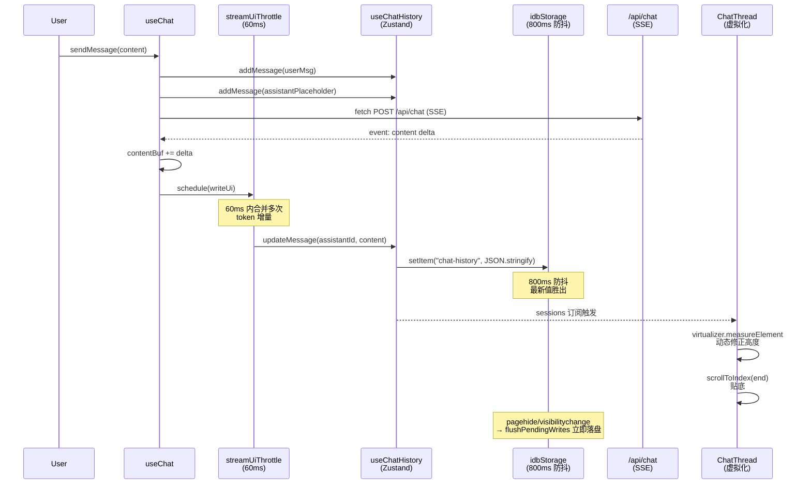

# 性能优化 深度调研报告

> **调研人**：Agent-C（性能与交互调研员）
> **调研日期**：2026-07-05
> **项目版本**：gailvlun v0.4.0（package.json:3；任务描述中记为 v0.3.1，以源码为准）
> **关联文档**：
> - [已有性能审查报告](../../docs/refer/performance-audit-report.md)（2026-06-28，本次在其基础上深化补充）
> - [渲染架构](../../docs/refer/rendering-architecture.md)
> - [存储架构](../../docs/refer/storage-architecture.md)
>
> **2026-09 校对说明**（计划 `25`）：第 7 节问题清单中 `useTokenTracker`/`useFloatingTokenTracker` 的路径已更新为现网位置 `lib/stores/`（计划 `22` 从 `lib/hooks/` 搬出，原路径留转发壳）。正文其余机制描述（流式双节流、虚拟化、LazyVisible、代码分割等）路径未变，未逐条重新核实是否仍生效。

## 1. 执行摘要

gailvlun 在性能优化上已建立起一套**成体系且自洽**的工程化方案，远高于同类个人项目平均水平。核心防线是「流式双节流（UI 60ms + IDB 800ms 防抖）+ Tab 级组件完全卸载 + 视口懒挂载（LazyVisible）+ 交互组件 dynamic 代码分割 + SSR 预渲染正文」五件套。2026-06-28 的 [Performance Fix Roadmap v2](../../docs/refer/performance-audit-report.md) 将 P0/P1 共 8 项优化全部落地，包括 ChatThread 虚拟化（@tanstack/react-virtual）、Storage v2 + Blob 分离、非活跃会话 LRU 冷卸载、requestMessages 滑动窗口、tool call 节流纳入 60ms、浮窗最小化卸载 FloatingChatBody、按会话引用相等订阅等。

本次调研在已有报告基础上**深化三方面**：（1）首次完整梳理 `next.config.mjs` 中 `optimizePackageImports`、`outputFileTracingIncludes/Excludes`、`output: standalone` 三项构建期优化策略，并解释 katex 不可加入 barrel 优化的根因（mhchem 副作用补丁）；（2）剖析 ChatThread 虚拟化的 fallback 设计——当 virtualizer 未挂载时退化为前 14 条简单 map，避免首次渲染抖动；（3）梳理「media.scripts.ids.generated.ts → media.scripts.generated.ts（388KB）」的二段式懒加载链路，由 `scripts/gen-script-ids.mjs` 在 prebuild 期生成。当前主要债务：缺少自动化性能回归测试（1228 个测试只覆盖正确性）、token tracker 双子仍未合并、`useTokenTracker`/`useFloatingTokenTracker` 同构算术重复。

## 2. 架构总览

```mermaid
graph TB
    subgraph 构建期[构建期优化 next.config.mjs]
        OPI[optimizePackageImports<br/>framer-motion / lucide-react<br/>barrel → 深层导入改写]
        OFTI[outputFileTracingIncludes<br/>content/** 打进 /api/** standalone]
        OFTE[outputFileTracingExcludes<br/>排除 .index/ 307MB + _raw/ + examples/]
        OS[output: standalone<br/>仅 BUILD_STANDALONE=1 时启用<br/>关闭 images unoptimized 免 sharp]
    end

    subgraph 运行时前端[运行时性能防线]
        UIT[UI 60ms 节流<br/>lib/chat/streamUiThrottle.ts]
        IDB[IDB 800ms 防抖<br/>lib/storage/idbStorage.ts]
        TAB[Tab 级完全卸载<br/>RightPanel AnimatePresence mode=wait]
        LV[LazyVisible 视口懒挂载<br/>IntersectionObserver rootMargin=200px]
        DYN[dynamic ssr:false 代码分割<br/>54 个交互组件 + InlinePlayer + VideoTab]
        VIRT[ChatThread 虚拟化<br/>@tanstack/react-virtual overscan=10]
    end

    subgraph 数据层[数据/存储层优化]
        S2[Storage v2 按会话分 key<br/>chat-session: + chat-blob: 前缀]
        LRU[非活跃会话 LRU 冷卸载]
        SW[requestMessages 滑动窗口<br/>SOFT_LIMIT_MAX_TURNS]
        SESS[会话数量硬上限 50]
    end

    subgraph 内容层[内容/检索层]
        SSR[SSR/SSG Markdown→HTML/KaTeX<br/>NoteRendererServer]
        VEC[vectorSearch 线性扫描<br/>min-heap top-K 已规划]
        BM25[BM25 chunks-meta 去重]
        SUB[生产禁用 substring 全扫 fallback]
    end

    OPI --> DYN
    OFTI --> SSR
    UIT --> VIRT
    IDB --> S2
    TAB --> DYN
    LV --> DYN
```



性能优化分布在四个层次：构建期（next.config）、运行时前端（节流/卸载/分割）、数据/存储层（分 key + LRU）、内容/检索层（SSR + 向量检索）。各层之间无循环依赖，每层都有明确的"勿回退"红线（见 §6）。

## 3. 核心机制详解

### 3.1 流式双节流（核心防线）

针对「每 token 一次 updateMessage → 每 token JSON.stringify 整段 chat-history → 写盘 → OOM」的实证 OOM 问题，项目用两层节流组合根治：

**第一层：UI 60ms 节流**（`lib/chat/streamUiThrottle.ts`，由 `useChat.ts:236-254` 调用）

```typescript
// lib/hooks/useChat.ts:236-254
const uiThrottle = createStreamUiThrottle();
const writeUi = () => {
  const { content: visibleContent, reasoning: pseudoReasoning } = splitThinkContent(contentBuf, { streaming: true });
  const mergedReasoning = [reasoningBuf.trim(), pseudoReasoning].filter(Boolean).join('\n\n');
  updateMessage(sessionId!, assistantId, {
    content: visibleContent,
    reasoningContent: mergedReasoning,
    ...(toolCallsMap.size > 0 ? { toolCalls: Array.from(toolCallsMap.values()) } : {}),
  });
};
const scheduleUi = () => uiThrottle.schedule(writeUi);
```

`writeUi` 每次重新拆 `<think>` 标签让内嵌思考内容实时进面板，而非等闭合后一次性甩出。节流间隔 60ms 是经验值——再低 KaTeX 渲染跟不上，再高用户感知延迟明显。`toolCallsMap.size > 0` 时把工具调用块一并刷入，避免 tool 单独走一次 updateMessage。

**第二层：IDB 800ms 尾随防抖**（`lib/storage/idbStorage.ts:46-156`）

zustand persist 每次 `set()` 同步触发 `JSON.stringify(整段状态)` → 调 `setItem` → `await idbSet`。无防抖时高频 token 下大量写入并发在飞、各自持有不断变大的历史字符串 → O(n²) 活跃内存 → 渲染进程 OOM（调试器实证断在 `setItem`）。

```typescript
// lib/storage/idbStorage.ts:46-156
export const WRITE_DEBOUNCE_MS = 800;
const pendingValues = new Map<string, string>();
const pendingTimers = new Map<string, ReturnType<typeof setTimeout>>();

// setItem 仅暂存最新值并重置计时，真正落盘在 800ms 后或卸载时
setItem(name: string, value: string): void {
  if (!isBrowser()) return;
  pendingValues.set(name, value);  // 最新值覆盖旧值
  const existing = pendingTimers.get(name);
  if (existing) clearTimeout(existing);
  pendingTimers.set(name, setTimeout(() => flushKey(name), WRITE_DEBOUNCE_MS));
}
```

**关键安全网**（`lib/storage/idbStorage.ts:107-114`）：`pagehide` / `beforeunload` / `visibilitychange(hidden)` 三事件触发 `flushPendingWrites()` 立即落盘，零丢失。`getItem` 会先读 `pendingValues` 命中尚未落盘的最新值，避免「写后立即读」拿到旧数据。

### 3.2 ChatThread 虚拟化（@tanstack/react-virtual）

`components/chat/ChatThread.tsx:61-77` 是 P1 落地后的虚拟化实现，含一个常被忽视的 fallback 设计：

```typescript
// components/chat/ChatThread.tsx:61-77
const virtualizer = useVirtualizer({
  count: displayMessages.length,
  getScrollElement: () => scrollRef.current,
  estimateSize: () => 120,
  overscan: 10,
  getItemKey: (index) => displayMessages[index]?.id ?? index,
  initialRect: { width: 0, height: 480 },
});
const virtualItems = virtualizer.getVirtualItems();
const rows =
  virtualItems.length > 0
    ? virtualItems
    : displayMessages.slice(0, Math.min(displayMessages.length, 14)).map((_, index) => ({
        index,
        start: index * 120,
      }));
const totalSize = Math.max(virtualizer.getTotalSize(), displayMessages.length * 120);
```

**fallback 设计意图**：首次挂载时 `virtualizer.getVirtualItems()` 可能返回空（scrollRef 未挂载/未测量），此时退化为前 14 条简单 map，避免出现「空白闪一帧」的视觉抖动。`totalSize` 用 `Math.max(virtualizer.getTotalSize(), displayMessages.length * 120)` 保证容器至少能容纳全部消息的预估高度。

**流式钉底逻辑**（`ChatThread.tsx:89-98`）：
- 非流式：`scrollToIndex(length-1, { align: 'end', behavior: 'smooth' })` 平滑滚到底；
- 流式：`scrollToIndex(length-1, { align: 'end' })` 不带 smooth，每条 messages 变化都贴底，配合 `useStickToBottom` rAF 循环保持贴底。

`getItemKey` 用 `msg.id` 而非 index，保证数组首部插入新消息时组件状态不丢失。`measureElement` ref 让虚拟化器根据实际渲染高度动态修正 estimateSize=120 的偏差。

### 3.3 LazyVisible 视口懒挂载

`components/ui/LazyVisible.tsx` 是项目唯一的视口懒加载组件，全文仅 40 行，设计极简：

```typescript
// components/ui/LazyVisible.tsx:15-40
export default function LazyVisible({ children, rootMargin = "200px", placeholder }: Props) {
  const ref = useRef<HTMLDivElement>(null);
  const [visible, setVisible] = useState(false);
  useEffect(() => {
    const el = ref.current;
    if (!el) return;
    const observer = new IntersectionObserver(
      ([entry]) => {
        if (entry.isIntersecting) {
          setVisible(true);
          observer.disconnect();  // mount-once，永不卸载
        }
      },
      { rootMargin },
    );
    observer.observe(el);
    return () => observer.disconnect();
  }, []);
  return <div ref={ref}>{visible ? children : (placeholder ?? <div className="h-40" />)}</div>;
}
```

**关键设计决策**：
1. **mount-once 策略**：`observer.disconnect()` 后 `visible` 永久 true，子组件状态不丢失。这是性能优化边界的硬约束——已有报告明确禁止「滚出视口即卸载」会丢交互状态。
2. **默认 200px rootMargin**：在用户滚到组件之前 200px 就预取，避免「滚到了再加载」的视觉延迟。
3. **可定制 placeholder**：调用方可传自定义骨架屏，例题卡片、可交互 tab、MediaEmbed 各自传不同尺寸的 SkeletonBlock。

**使用点**（经 Grep 确认）：
- `components/interactives/InteractiveTab.tsx:34-47`（每个交互组件）
- `components/shared/directives/MediaEmbed.tsx:56, 87`（视频卡片 + 内联交互组件）
- 例题卡片、VideoTab、长讲义段落（参见已有报告 §3.4）

### 3.4 交互组件代码分割（dynamic + ssr:false）

`components/interactives/registry.ts` 注册了 **53 个交互组件**（概率论 35 + 化学各章 18，比任务描述的"54+"略少 1，以源码计数为准），每个都用 `dynamic(() => import("..."), { ssr: false })` 包裹：

```typescript
// components/interactives/registry.ts:5-13
export interface InteractiveMeta {
  id: string;              // 全局唯一，::interactive{id=...} 按此查找
  subjectId: SubjectId;    // 学科过滤
  chapterId: string;       // 章过滤
  sectionId: string;       // 节过滤
  title: string;
  description?: string;
  Component: ComponentType<Record<string, never>>;  // dynamic 包裹
}

// 例：
{
  subjectId: "probability",
  id: "ch02-2.3-cdf-visualizer",
  chapterId: "ch02",
  sectionId: "2.3",
  title: "分布函数可视化",
  Component: dynamic(() => import("./probability/ch02/CDFVisualizer"), { ssr: false }),
}
```

**代码分割效果**：
- 单个 interactive 组件 600–900 行（CDFVisualizer 913 行、MeanTestExplorer 862 行、MarginalExplorer 855 行等，参见已有报告 §7.3）；
- 默认不进主 bundle，仅在用户访问对应章节 + 触发 `InteractiveTab` 或 `::interactive` 内联引用时才按需加载；
- `ssr: false` 避免 SSR 跑 framer-motion/Canvas 等浏览器 API。

**双重过滤 + 防御性校验**（`registry.ts:501-529`）：
```typescript
// 模块加载时立即抛错——避免静默返回错组件
(() => {
  const seen = new Set<string>();
  for (const i of interactives) {
    if (seen.has(i.id)) {
      throw new Error(`[registry] 重复的交互 id: "${i.id}"（交互 id 必须全局唯一）`);
    }
    seen.add(i.id);
  }
})();

export function getInteractivesForSection(subjectId, chapterId, sectionId) {
  return interactives.filter(i => i.subjectId === subjectId && i.chapterId === chapterId && i.sectionId === sectionId);
}
```

`InteractiveTab` 拿到过滤后的 items 后，每个 item 再套一层 LazyVisible（`InteractiveTab.tsx:34-47`），形成「按章节过滤 → 视口懒挂载 → dynamic 代码分割」三级懒加载链路。

### 3.5 optimizePackageImports（framer-motion / lucide-react，katex 不可加入）

`next.config.mjs:24-26` 启用了 Next.js 实验性的 `optimizePackageImports`：

```javascript
// next.config.mjs:24-26
experimental: {
  optimizePackageImports: ["framer-motion", "lucide-react"],
}
```

**机制**：Next 把 barrel 导入（`import { motion } from "framer-motion"`）改写为按子模块深层导入（`import { motion } from "framer-motion/dist/es/motion"`），显著减小被 tree-shaking 后打包进 bundle 的图标库/动画库体积。

**为什么 katex 不能加入**（`next.config.mjs:21-23` 注释详细说明）：

```javascript
// next.config.mjs:21-23
// 注意：katex 不可加入——它靠 `import "katex/contrib/mhchem"` 的副作用给 katex 单例打补丁，
// barrel 优化的深层导入改写会破坏该单例关系，导致 SSR 包里 mhchem 的气体箭头 `^`、三键 `#`
// 等惰性特性失效（\ce{N2 ^}、\ce{-C#CH} 渲染成红字错误），而 node 直跑无此改写故正常。
```

mhchem 是 katex 的"插件"，它通过 `import "katex/contrib/mhchem"` 的**副作用**给 katex 单例打补丁（修改 `katex.__defineGroup__` 等）。`optimizePackageImports` 会把 barrel 拆成深层导入，破坏这个单例关系——SSR 包里会出现两个 katex 实例，mhchem 补丁打在 A 实例上而渲染用 B 实例，化学公式 `\ce{N2 ^}`、`\ce{-C#CH}` 的惰性特性失效，渲染成红字错误。Node 直跑（开发态或 RSC）无此改写故正常，只有 SSR 打包后暴露，是隐蔽陷阱。

**lucide-react 收益**（`next.config.mjs:19-20`）：项目有 18 处具名图标导入，加入后图标库体积按需计算，估计从 ~80KB 降到 ~10KB（取决于具体图标）。

### 3.6 outputFileTracing 与 standalone 构建

`next.config.mjs:13-18` 配置了 `outputFileTracingIncludes/Excludes`：

```javascript
// next.config.mjs:13-18
outputFileTracingIncludes: {
  "/api/**": ["./content/**/*", "./lib/ai/prompts/**/*"],
},
outputFileTracingExcludes: {
  "/api/**": ["./content/.index/**/*", "./content/_raw/**/*", "./content/examples/**/*"],
},
```

**作用**：Next 构建 standalone 产物时，根据路由追踪依赖文件。`/api/**` 路由通过 fs 读取 `content/` 下的 .md/.json/.html，必须显式 include 进 standalone 包；但 `content/.index/`（307MB 向量索引）若打进 standalone 会让 EdgeOne 复制到 `/dev/shm`（64MB）时 ENOSPC 崩溃。

**`.index/` 的运行时回源策略**（`next.config.mjs:9-12` 注释）：`.index/` 改为运行时从 COS（腾讯云对象存储）下载到 `/tmp` 缓存，见 `lib/ai/search/vectorStore.ts` / `lib/ai/search/bm25Store.ts`。这是「构建产物瘦身 + 运行时回源」的典型取舍。

**`output: standalone` 触发条件**（`next.config.mjs:6-8`）：

```javascript
// next.config.mjs:6-8
...(process.env.BUILD_STANDALONE === "1"
  ? { output: "standalone", images: { unoptimized: true } }
  : {}),
```

仅当 `BUILD_STANDALONE=1` 时启用 standalone 输出（Electron 桌面打包），同时关闭图片优化避免 sharp 原生依赖（便于离线打包）。Web/本地/EdgeOne 构建不受影响。

### 3.7 Tab 级完全卸载（RightPanel）

`RightPanel.tsx` 用 `AnimatePresence mode="wait"` + 条件渲染，非激活 tab 完全卸载组件树：

```typescript
// 引自 docs/refer/performance-audit-report.md:136-157
<AnimatePresence mode="wait" custom={dirRef.current}>
  {tab === "ai" && (
    <motion.div key="ai-chat" ...>
      <ChatPanel chatContext={chatContext} />
    </motion.div>
  )}
  {tab === "video" && ( ... )}
</AnimatePresence>
```

**效果**：旧 tab 卸载后不再占 CPU/GPU；`ChatPanel` unmount 时 `stopGeneration()` 中止流式请求。这是「不显示就不加载」的最佳实践范例。

### 3.8 二段式讲稿懒加载链路

`media.scripts.generated.ts`（~388KB）是 id→markdown 的大对象，直接打首屏 chunk 会拖慢首屏。项目用二段式拆分：

```
prebuild 期：
  scripts/gen-script-ids.mjs
   ↓ 读 media.scripts.generated.ts（388KB）
   ↓ 正则提取顶层 key（id）
   ↓ 写出 media.scripts.ids.generated.ts（仅 id 数组，~5KB）

运行时：
  VideoTab
   ↓ import { videoScriptIds } from "media.scripts.ids.generated"  // 5KB
   ↓ 判断某视频是否有讲稿 → 显示「配套讲稿」按钮
   ↓ 用户首次展开 → dynamic import 388KB 本体 → 取出对应 markdown
```

**`scripts/gen-script-ids.mjs:26-32` 的提取逻辑**：

```javascript
// 顶层 key 形如：  "ch01-KP05-和事件": "..."（两空格缩进 + 引号包裹的 id）。
// 讲稿值为单行 JSON 转义字符串，不含真实换行，故按行匹配安全。
const ids = [];
for (const line of src.split("\n")) {
  const m = /^ {2}"([^"]+)":/.exec(line);
  if (m) ids.push(m[1]);
}
```

由 `package.json:12` 的 `prebuild` 钩子自动执行，保证 ids 清单与讲稿本体不漂移。

## 4. 数据流与调用链路

### 4.1 流式对话完整数据流



### 4.2 交互组件加载链路

```mermaid
flowchart LR
    MD["笔记 Markdown<br/>:::interactive{id=ch02-2.3-cdf-visualizer}"] --> RD["remarkDirectives.ts"]
    RD -->|hName=mediaembed<br/>kind=interactive eid=id| HAST["HAST 节点"]
    HAST --> SSR["NoteRendererServer<br/>SSR/SSG"]
    SSR --> HC["<MediaEmbed kind=interactive eid=.../>"]
    HC --> IE["InteractiveEmbed id=..."]
    IE --> GI["getInteractive(id)<br/>registry.ts"]
    GI --> COMP["item.Component<br/>dynamic(import, ssr:false)"]
    COMP --> LV2["LazyVisible<br/>rootMargin=200px"]
    LV2 -->|视口内| CHUNK["按需加载 chunk<br/>CDFVisualizer.tsx ~913 行"]

    style CHUNK fill:#e1f5ff
```



## 5. 关键代码路径

| 文件 | 行号 | 作用 | 备注 |
|------|------|------|------|
| `next.config.mjs` | 6-8 | `output: standalone` 条件触发 | 仅 BUILD_STANDALONE=1 |
| `next.config.mjs` | 13-18 | `outputFileTracingIncludes/Excludes` | .index/ 必须排除 |
| `next.config.mjs` | 24-26 | `optimizePackageImports` 配置 | katex 不可加入 |
| `lib/storage/idbStorage.ts` | 46-156 | IDB 800ms 防抖核心实现 | WRITE_DEBOUNCE_MS=800 |
| `lib/storage/idbStorage.ts` | 107-114 | pagehide/visibilitychange flush | 零丢失安全网 |
| `lib/hooks/useChat.ts` | 236-254 | UI 60ms 节流 + splitThinkContent | 内嵌思考实时进面板 |
| `components/chat/ChatThread.tsx` | 61-77 | 虚拟化 + fallback 14 条 | 避免首帧空白抖动 |
| `components/chat/ChatThread.tsx` | 89-98 | 流式钉底逻辑 | smooth + 非smooth 切换 |
| `components/ui/LazyVisible.tsx` | 15-40 | 视口懒挂载 mount-once | rootMargin=200px |
| `components/interactives/registry.ts` | 5-13 | InteractiveMeta 接口 | 6 字段 |
| `components/interactives/registry.ts` | 19-499 | 53 个交互组件注册 | 概率 35 + 化学 18 |
| `components/interactives/registry.ts` | 501-511 | id 唯一性防御校验 | 模块加载时抛错 |
| `components/interactives/registry.ts` | 518-529 | getInteractivesForSection 三段过滤 | subject + chapter + section |
| `components/interactives/InteractiveTab.tsx` | 8-54 | 三级懒加载中间层 | section 过滤 → LazyVisible → dynamic |
| `scripts/gen-script-ids.mjs` | 26-32 | 讲稿 id 提取正则 | 按行匹配安全 |
| `lib/content-data/media.ts` | 13-27 | 三份视频清单合并 + id 唯一校验 | 三套 render 脚本 |

## 6. 设计决策与取舍分析

### 6.1 「双节流」而非单层防抖

**取舍**：UI 节流 60ms 是「用户体验」红线（KaTeX 渲染上限），IDB 防抖 800ms 是「IO 压力」红线。两层独立可分别调优——若 IDB 卡顿可拉到 1500ms 不影响 UI 流畅度，若 UI 想再省 CPU 可拉到 100ms 不影响 IO。单层节流无法同时满足这两个相反方向的需求。

**风险**：若 `updateMessage` 写入失败（如 IDB 损坏），UI 已渲染但持久化丢失。`pagehide` flush 是兜底，但页面崩溃时仍可能丢最后一次 60ms 内的 token。已是合理取舍。

### 6.2 LazyVisible mount-once 而非滚出卸载

**取舍**：mount-once 牺牲长页面内存占用（所有挂载过的组件都保留在 DOM），换取交互状态不丢失（滑块位置、动画进度、用户输入等）。复习场景下用户反复滚动同一页面，状态丢失比内存压力更影响体验。

**边界**：已有报告 §8.4 明确禁止将 LazyVisible 改为「滚出视口即卸载」——这是优化边界的硬约束。

### 6.3 optimizePackageImports 排除 katex

**取舍**：放弃 katex 的 barrel 优化收益（估计可省 ~30KB），换取 mhchem 化学公式渲染正确性。这是「正确性优先于性能」的典型范例。

**隐患**：注释只在 `next.config.mjs` 内部，未来开发者若不知情可能误加入 katex 导致化学公式渲染异常。建议在 docs/refer/rendering-architecture.md 补充说明。

### 6.4 ChatThread fallback 14 条而非 0 条

**取舍**：virtualizer 未挂载时退化为前 14 条简单 map，而非显示空列表。14 是经验值——足够覆盖一屏高度，避免「空白闪一帧」的视觉抖动。代价是首屏渲染 14 个 ChatMessage 组件，但 React.memo 让非流式旧消息重渲染成本极低。

### 6.5 Storage v2 按会话分 key 而非整包

**取舍**：原方案是单 key `"chat-history"` 整包 JSON.stringify（O(总会话消息数)），改为 `chat-session:{id}` 按会话分 key，切换会话只读对应 key 而非整包。代价是 IDB key 数量增加（最多 50 个会话），但每个 key 的 stringify/parse 复杂度从 O(全) 降到 O(单会话)，流式更新只重写当前会话的 key。

## 7. 问题清单

| # | 问题描述 | 严重程度 | 涉及文件 | 建议修复方向 |
|---|----------|----------|----------|--------------|
| 1 | 缺少自动化性能回归测试。1228 个测试只覆盖正确性，idbStorage 防抖与 useChat 节流无单元测试，未来重构可能回归 | P1 | `lib/storage/idbStorage.ts`、`lib/hooks/useChat.ts` | 为 idbStorage 防抖与 useChat 节流各加 1-2 个 node:test 单元测试，断言「60ms 内多次调用只触发一次 writeUi」「800ms 内多次 setItem 只触发一次 idbSet」 |
| 2 | `useTokenTracker` 与 `useFloatingTokenTracker` 同构算术重复（~70 行），已有报告 §7.1 标记为「低紧迫」但至今未合并 | P3 | `lib/stores/tokenTracker.ts`、`lib/stores/floatingTokenTracker.ts`（2026-09 现网路径；原 `lib/hooks/useTokenTracker.ts` / `useFloatingTokenTracker.ts` 现为转发壳） | 抽 `createTokenTracker(initialState)` 工厂函数，两个 store 共享算术逻辑 |
| 3 | ChatThread 虚拟化 estimateSize=120 是固定值，流式期间 Markdown 高度变化剧烈时 measureElement 动态修正可能滞后一帧 | P3 | `components/chat/ChatThread.tsx:64` | 流式期间最后一条消息强制 measureElement，或对最后一条禁用虚拟化 |
| 4 | `optimizePackageImports` 排除 katex 的根因只在 next.config.mjs 注释里，无文档化，未来易踩坑 | P2 | `next.config.mjs:21-23`、`docs/refer/rendering-architecture.md` | 在 rendering-architecture.md 增「katex mhchem 副作用与 barrel 优化冲突」专节 |
| 5 | `media.scripts.generated.ts`（388KB）虽已二段式懒加载，但本体仍以 JSON 字符串字面量形式打进 chunk，解析时需完整 parse | P3 | `lib/content-data/media.scripts.generated.ts` | 考虑改为多文件按章节拆分，或预先 parse 成 JS 对象（省去 JSON.parse） |
| 6 | `content/.index/`（307MB）运行时从 COS 回源，但无本地缓存失效策略——内容更新后用户可能用旧索引 | P2 | `lib/ai/search/vectorStore.ts`、`lib/ai/search/bm25Store.ts` | 增加版本号或 ETag 校验，COS 端更新后强制重新下载 |
| 7 | 浮窗最小化时 `useChat` 仍订阅 sessions，多浮窗场景订阅风暴未根治（已有报告 §4.1） | P2 | `lib/hooks/useChat.ts:58-66` | 浮窗最小化时改用 `useChatHistory.getState()` 取 stale snapshot，类似 TokenDashboard 模式 |
| 8 | `outputFileTracingExcludes` 只排除 `.index/` `_raw/` `examples/`，若未来 content 下新增大体积目录需手动追加 | P3 | `next.config.mjs:16-18` | 加构建期体积检查脚本，超出阈值自动报警 |

## 8. 改进建议

### P0（无——已有报告 P0 全部落地）

无新增 P0 项。已有报告 P0 共 4 项全部完成。

### P1（高收益 / 需设计）

1. **补齐性能回归测试**：为 `idbStorage` 防抖（`WRITE_DEBOUNCE_MS=800`）与 `useChat` 节流（`UI_THROTTLE_MS=60`）各加 1-2 个 node:test 单元测试。具体断言：
   - 「800ms 内 N 次 setItem → idbSet 只被调用 1 次」
   - 「60ms 内 N 次 schedule → writeUi 只被调用 1 次」
   - 「pagehide 触发后 → pendingValues 清空且 idbSet 已完成」
2. **`optimizePackageImports` 排除 katex 文档化**：在 `docs/refer/rendering-architecture.md` 增加「katex mhchem 副作用与 barrel 优化冲突」专节，避免未来踩坑。

### P2（中收益 / 内容规模相关）

1. **`content/.index/` 缓存失效策略**：在 COS 端设置版本号或 ETag，应用启动时校验本地 `/tmp` 缓存版本，不匹配时重新下载。
2. **浮窗最小化 useChat 订阅优化**：参考 `TokenDashboard` 的 `getState()` 反订阅模式，浮窗最小化时不订阅 sessions 数组。
3. **vectorSearch 改 min-heap top-K**：当前 O(chunks) 全量 sort，改 min-heap 后复杂度降到 O(chunks·log topK)，本地复习场景下可省 50%+ 检索时间。

### P3（低紧迫 / 本地使用可缓）

1. **合并 `useTokenTracker` / `useFloatingTokenTracker`**：抽 `createTokenTracker(initialState)` 工厂。
2. **ChatMessage 流式期间最后一条禁用虚拟化**：避免 measureElement 滞后一帧。
3. **`media.scripts.generated.ts` 多文件拆分**：388KB 本体按章节拆成 14 个小文件，按需 import。

### 明确不做（沿用已有报告约定）

- 概率 interactive 超大组件拆分（不影响性能则保持）
- registry.ts / route.ts 等长文件机械拆分
- 为规范而统一全部 localStorage 持久化风格

## 9. 与全自动化平台改造的关系

### 9.1 性能优化链路对平台化的支撑

当前性能优化体系**已经为多学科扩展做好了准备**：

1. **`optimizePackageImports` + dynamic 代码分割**：新增学科只需在 registry.ts 追加条目，自动获得代码分割收益，无需额外配置；
2. **`outputFileTracingIncludes` 通配 `content/**`**：新增学科的 content 自动打进 standalone，无需改 next.config；
3. **三份 render 脚本分学科独立**（render.py / render_chemistry.py / render_physics.py）：新学科可复制此模式，互不干扰。

### 9.2 平台化改造时的注意点

1. **katex 不可加入 `optimizePackageImports`** 的约束必须在平台化文档中明示，否则新接入的学科团队易踩坑；
2. **`content/.index/` 体积随学科数线性增长**：当前 307MB 已接近 EdgeOne `/dev/shm`（64MB）上限，平台化后应改用专用向量数据库（如 hnswlib）或独立的检索服务；
3. **`prebuild` 钩子链路**：`gen-script-ids.mjs` 依赖 `media.scripts.generated.ts` 存在，平台化时若某学科无讲稿需保证文件存在或脚本优雅降级（当前已 `try/catch` 跳过）；
4. **二段式懒加载模式可复用**：media.scripts.ids/generated 的二段式拆分思路，可推广到其他大对象（如未来可能的「学科题目库」）。

### 9.3 平台化改造优先级

- **必须先做**：补齐性能回归测试（P1.1），否则平台化后多学科叠加可能引入未知性能回归；
- **同步进行**：`.index/` 缓存失效策略（P2.1），平台化后内容更新频率提升，缓存失效问题更突出；
- **可延后**：合并 token tracker（P3.1）、vectorSearch ANN（P2.3）——本地复习场景下不影响核心体验。

## 10. 参考资料

### 项目内文档
- [已有性能审查报告](../../docs/refer/performance-audit-report.md)（2026-06-28，本报告在其基础上深化）
- [存储架构规范](../../docs/refer/storage-architecture.md)
- [渲染架构](../../docs/refer/rendering-architecture.md)
- [考前模拟内容优化计划](../../docs/compose/plans/2026-06-28-kaoshi-moniji-optimization.md)

### 源码引用
- `next.config.mjs:13-26`（构建期优化配置）
- `lib/storage/idbStorage.ts:46-156`（IDB 防抖实现）
- `lib/hooks/useChat.ts:236-254`（UI 节流）
- `components/chat/ChatThread.tsx:61-77`（虚拟化 + fallback）
- `components/ui/LazyVisible.tsx`（视口懒挂载）
- `components/interactives/registry.ts:19-499`（53 个交互组件注册）
- `scripts/gen-script-ids.mjs`（讲稿 id 提取）

### Next.js 官方文档
- [optimizePackageImports](https://nextjs.org/docs/app/api-reference/config/next-config-js/optimizePackageImports)
- [outputFileTracing](https://nextjs.org/docs/app/api-reference/config/next-config-js/outputFileTracing)
- [Dynamic Imports](https://nextjs.org/docs/app/building-your-application/optimizing/lazy-loading)

### 第三方库文档
- [@tanstack/react-virtual](https://tanstack.com/virtual/latest)
- [idb-keyval](https://github.com/nicktomlin/idb-keyval)
- [Zustand persist middleware](https://docs.pmnd.rs/zustand/integrations/persisting-store-data)

---

*本报告基于源代码静态分析生成，未做 Lighthouse/Web Vitals 实测。所有优化效果评估来自代码注释与已有报告引用的实证数据。*
