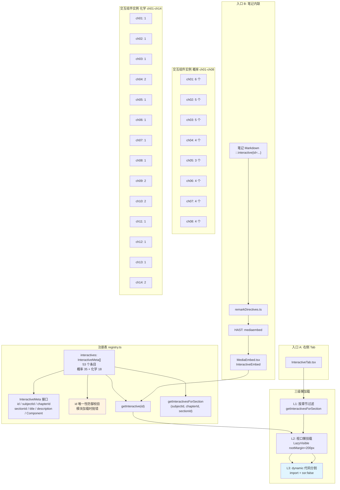
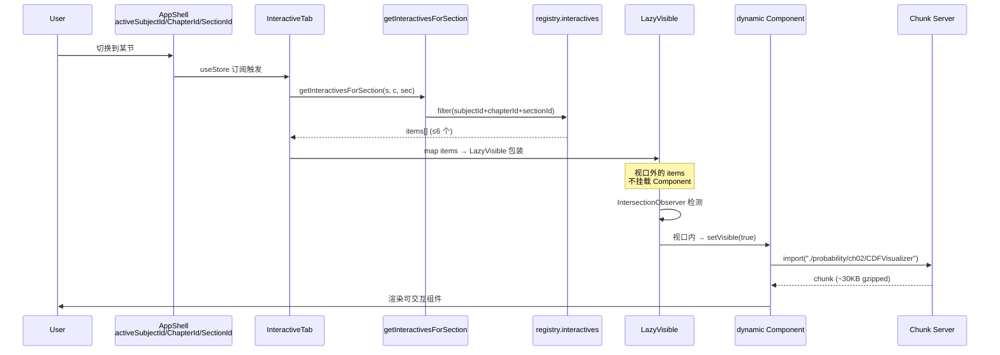

# 交互组件系统 深度调研报告

> **调研人**：Agent-C（性能与交互调研员）
> **调研日期**：2026-07-05
> **项目版本**：gailvlun v0.4.0（package.json:3）
> **关联文档**：
> - [性能优化报告](./07-performance-optimization.md)（代码分割机制）
> - [渲染架构](../../docs/refer/rendering-architecture.md)
> - [已有性能审查报告](../../docs/refer/performance-audit-report.md) §3.5、§7.3
>
> **2026-09 校对说明**（计划 `25`）：正文里 `directiveComponents` 的文件路径已更新为现网位置 `components/shared/directives/registry.ts`（计划 `23` 从 `lib/markdown/` 搬出）；`components/interactives/registry.ts`（右侧「可交互」tab，53 个组件）与 `:::interactive` 指令走的 `MediaEmbed` 链路本身未变，仍是本报告的准确描述。

## 1. 执行摘要

gailvlun 的交互组件系统是一套**「注册表 + dynamic 代码分割 + 三级懒加载」**的工程化方案，共注册 **53 个交互组件**（概率论 35 + 有机化学 18，比任务描述的「54+」少 1，以源码 `registry.ts` 实际计数为准）。系统核心是 `components/interactives/registry.ts`（530 行），通过 `InteractiveMeta` 接口的 6 个字段（id / subjectId / chapterId / sectionId / title / description / Component）实现「按学科×章×节」三段过滤定位。每个 Component 用 `dynamic(() => import("..."), { ssr: false })` 包裹，单组件 600–900 行独立 chunk，配合 `InteractiveTab` 的 LazyVisible 视口懒挂载，形成「按章节过滤 → 视口懒挂载 → dynamic 代码分割」三级懒加载链路，单个 913 行的 CDFVisualizer 也不进首屏 bundle。

`:::interactive{id=...}` 指令通过 `remarkDirectives.ts` 转换为 `<mediaembed kind="interactive" eid="...">` HAST 节点，由 `MediaEmbed.tsx` 的 `InteractiveEmbed` 子组件渲染——复用 `getInteractive(id)` 同一注册表，实现「笔记正文内联引用」与「右侧可交互 Tab」共用一套组件源。交互组件系统与 CanvasBlock 系统是**两条独立的可视化路径**：前者是预定义的、可拖动探索的 React 组件（数学/化学实验台），后者是 AI 驱动的、可修订的画布（raw-svg/plot/multi-plot/molecule/html 五类）。两者不重叠，互为补充。

## 2. 架构总览



## 3. 核心机制详解

### 3.1 InteractiveMeta 接口与注册表结构

`components/interactives/registry.ts:5-13` 定义接口：

```typescript
export interface InteractiveMeta {
  id: string;              // 全局唯一，::interactive{id=...} 按此查找
  subjectId: SubjectId;    // 学科过滤（"probability" | "chemistry" | "physics" | ...）
  chapterId: string;       // 章过滤，如 "ch01"
  sectionId: string;       // 节过滤，如 "1.1"
  title: string;           // 展示标题
  description?: string;    // 可选副标题
  Component: ComponentType<Record<string, never>>;  // dynamic 包裹的组件
}
```

**字段含义详解**：

| 字段 | 类型 | 用途 | 示例 |
|------|------|------|------|
| `id` | string | 全局唯一标识，按裸 id 查找；命名约定 `{chapterId}-{sectionId}-{slug}` | `"ch02-2.3-cdf-visualizer"` |
| `subjectId` | SubjectId | 学科过滤，控制 InteractiveTab 显示哪些组件 | `"probability"` |
| `chapterId` | string | 章过滤，与 `activeChapterId` 比对 | `"ch02"` |
| `sectionId` | string | 节过滤，与 `activeSectionId` 比对 | `"2.3"` |
| `title` | string | 卡片标题 | `"分布函数可视化"` |
| `description` | string? | 卡片副标题（可选） | `"切换离散/连续分布..."` |
| `Component` | ComponentType | dynamic 包裹的 React 组件，props 为空对象 | `dynamic(() => import("./probability/ch02/CDFVisualizer"), { ssr: false })` |

**id 命名约定**：`{chapterId}-{sectionId}-{slug}`，如 `ch02-2.3-cdf-visualizer`。slug 是语义化短名（cdf-visualizer / mean-test-explorer），与文件名一一对应。化学的 id 不带学科前缀（如 `ch01-1.2-bond-polarity`），因为 chapterId 在跨学科间可能重复但 id 全局唯一已足够。

### 3.2 注册表条目结构示例

`registry.ts:19-28` 注册条目示例：

```typescript
export const interactives: InteractiveMeta[] = [
  {
    subjectId: "probability",
    id: "ch01-1.1-events",
    chapterId: "ch01",
    sectionId: "1.1",
    title: "样本空间构造器",
    description: "点击骰子结果归入事件 A / B，实时显示集合表示与并交差补，直观体会「事件=子集」。",
    Component: dynamic(() => import("./probability/ch01/SampleSpaceBuilder"), { ssr: false }),
  },
  // ... 52 more entries
];
```

注册表是**线性的**，所有学科混在一起按章节顺序排列，靠 `subjectId` 字段做过滤。注释（`registry.ts:17-18`）明确说明「后续 SOP 子智能体在此追加条目」，表明这是一个**人工维护的中央注册表**模式，而非自动扫描目录。

### 3.3 id 唯一性防御校验

`registry.ts:501-511` 在模块加载时立即执行防御性校验：

```typescript
// 防御：交互 id 必须全局唯一。getInteractive 及内联 ::interactive{id=...} 均按裸 id
// 查找；若未来跨学科复用同一 id，这里在模块加载时立即抛错，避免静默返回错组件。
(() => {
  const seen = new Set<string>();
  for (const i of interactives) {
    if (seen.has(i.id)) {
      throw new Error(`[registry] 重复的交互 id: "${i.id}"（交互 id 必须全局唯一）`);
    }
    seen.add(i.id);
  }
})();
```

**设计意图**：`getInteractive(id)` 按 id 线性查找（`registry.ts:513-516`），若 id 重复会静默返回第一个匹配，导致用户看到的组件与预期不符——这是隐蔽 bug。立即抛错让 CI/本地启动时第一时间暴露，符合「fail-fast」原则。

### 3.4 三段过滤：getInteractivesForSection

`registry.ts:518-529` 提供按章节维度的批量查询：

```typescript
export function getInteractivesForSection(
  subjectId: SubjectId,
  chapterId: string,
  sectionId: string,
): InteractiveMeta[] {
  return interactives.filter(
    (i) =>
      i.subjectId === subjectId &&
      i.chapterId === chapterId &&
      i.sectionId === sectionId,
  );
}
```

`InteractiveTab.tsx:9-12` 调用：

```typescript
const activeSubjectId = useStore((s) => s.activeSubjectId);
const chapterId = useStore((s) => s.activeChapterId);
const sectionId = useStore((s) => s.activeSectionId);
const items = getInteractivesForSection(activeSubjectId, chapterId, sectionId);
```

三段过滤是「学科 × 章 × 节」的笛卡尔积定位，确保当前节只展示对应组件，不会出现「概率 ch02 的组件出现在化学 ch02」的错位。

### 3.5 dynamic(..., { ssr: false }) 代码分割机制

每个 `Component` 字段都用 `next/dynamic` 包裹：

```typescript
Component: dynamic(() => import("./probability/ch02/CDFVisualizer"), { ssr: false }),
```

**机制**：Next.js 的 `dynamic` 基于 React.lazy + Suspense，在客户端首次渲染该组件时才发起 chunk 请求。`ssr: false` 让组件**仅在客户端渲染**，避免 SSR 跑 framer-motion/Canvas/SVG 等浏览器 API 报错。

**chunk 大小估算**（基于已有报告 §7.3）：
- CDFVisualizer: 913 行
- MeanTestExplorer: 862 行
- MarginalExplorer: 855 行
- QuizQuestion: 854 行（虽不在 registry，但同类）
- VarianceTestExplorer: 851 行
- SamplingDistExplorer: 844 行
- MomentEstimator: 814 行

按经验每行 ~30-50 字节估算，单 chunk 大约 25-45KB（未压缩），gzip 后 8-15KB。53 个组件总代码量 ~40K 行，但**默认全部不进主 bundle**，符合「复习工具按需打开」场景。

### 3.6 LazyVisible 视口懒挂载（二级）

`InteractiveTab.tsx:31-49` 对每个 item 再套一层 LazyVisible：

```typescript
{items.map((item) => {
  const C = item.Component;
  return (
    <LazyVisible
      key={item.id}
      placeholder={<div className="h-48 rounded-xl border border-[var(--line)] bg-[var(--bg-muted)] animate-shimmer" />}
    >
      <div className="animate-scale-in">
        <h3 className="text-[14px] font-semibold text-[var(--ink)]">{item.title}</h3>
        {item.description && (
          <p className="mb-2 mt-0.5 text-[12.5px] leading-relaxed text-[var(--ink-faint)]">
            {item.description}
          </p>
        )}
        <C />
      </div>
    </LazyVisible>
  );
})}
```

**三级懒加载链路**：
1. **L1 按章节过滤**：`getInteractivesForSection` 只返回当前节的组件（最多 6 个）；
2. **L2 视口懒挂载**：每个组件套 LazyVisible，视口外不挂载；
3. **L3 dynamic 代码分割**：组件挂载时才发起 chunk 请求。

**placeholder** 用 `animate-shimmer` 骨架屏（h-48），给用户「即将加载」的视觉反馈。

### 3.7 :::interactive 内联指令处理链路

笔记 Markdown 中的 `:::interactive{id=...}` 指令经过以下链路渲染：

**Step 1：Markdown 解析**（`lib/markdown/remarkDirectives.ts:74-78`）

```typescript
if (name === "video" || name === "interactive") {
  data.hName = "mediaembed";
  data.hProperties = { kind: name, eid: attrs.id ?? "" };
  return;
}
```

`:::interactive{id=ch02-2.3-cdf-visualizer}` 被 remark-directive 解析为 containerDirective，`remarkDirectives` 把它转换为 HAST 节点 `<mediaembed kind="interactive" eid="ch02-2.3-cdf-visualizer">`。注意 `interactive` 与 `video` 共享同一个 `mediaembed` HAST 节点类型，靠 `kind` 属性区分。

**Step 2：react-markdown 渲染**（`components/shared/directives/registry.ts`，2026-09 现网路径；原路径 `lib/markdown/directiveComponents.ts` 已随计划 `23` 搬出 `lib/`）

```typescript
export const directiveComponents = {
  // ...
  mediaembed: MediaEmbed,
  // ...
} as unknown as Partial<Components>;
```

react-markdown 看到 `<mediaembed>` 标签，用 `MediaEmbed` 组件渲染。

**Step 3：MediaEmbed 分发**（`components/shared/directives/MediaEmbed.tsx:101-107`）

```typescript
export function MediaEmbed({ node }: NodeProps) {
  const kind = String(node?.properties?.kind ?? "");
  const eid = String(node?.properties?.eid ?? "");
  if (kind === "video") return <VideoEmbed id={eid} />;
  if (kind === "interactive") return <InteractiveEmbed id={eid} />;
  return null;
}
```

`kind` 区分视频/交互，`eid` 是裸 id。

**Step 4：InteractiveEmbed 渲染**（`MediaEmbed.tsx:76-99`）

```typescript
function InteractiveEmbed({ id }: { id: string }) {
  const item = getInteractive(id);
  if (!item) {
    return (
      <div className="my-4 rounded-xl border border-dashed border-[var(--line)] bg-[var(--bg-muted)] px-4 py-3 text-[13px] text-[var(--ink-faint)]">
        交互组件「{id}」即将生成。
      </div>
    );
  }
  const C = item.Component;
  return (
    <LazyVisible placeholder={<SkeletonBlock height={192} className="my-5" />}>
      <div className="my-5">
        <div className="mb-2 flex items-center gap-2 text-[13px] font-semibold text-[var(--ink-soft)]">
          <span className="grid h-5 w-5 place-items-center rounded bg-[var(--accent-weak)] text-[var(--accent-ink)]">
            <svg width="12" height="12" viewBox="0 0 24 24" fill="none" stroke="currentColor" strokeWidth="2" strokeLinecap="round"><rect x="3" y="3" width="7" height="7" /><rect x="14" y="3" width="7" height="7" /><rect x="3" y="14" width="7" height="7" /><rect x="14" y="14" width="7" height="7" /></svg>
          </span>
          {item.title}
        </div>
        <C />
      </div>
    </LazyVisible>
  );
}
```

**关键设计**：
1. **id 找不到时优雅降级**：显示「交互组件『xxx』即将生成」的占位提示，不报错；
2. **复用 LazyVisible**：与 InteractiveTab 一致的视口懒挂载策略；
3. **复用 getInteractive(id)**：与右侧 Tab 共用同一注册表，确保两个入口渲染的是同一组件。

### 3.8 53 个交互组件的章节覆盖

#### 概率论 35 个（subjectId="probability"）

| 章 | 数量 | 覆盖节 | 知识点 |
|----|------|--------|--------|
| ch01 | 6 | 1.1-1.6 | 样本空间、事件运算、频率收敛、古典概型、贝叶斯推断、串并联可靠度 |
| ch02 | 5 | 2.1-2.5 | 随机变量映射、二项/泊松分布、CDF 可视化、连续 PDF、函数分布 |
| ch03 | 5 | 3.1-3.5 | 联合分布、边缘分布、条件分布、独立性检验、卷积 |
| ch04 | 4 | 4.1-4.4 | 期望、方差、相关系数、协方差矩阵 |
| ch05 | 3 | 5.1-5.3 | 切比雪夫不等式、大数定律、中心极限定理 |
| ch06 | 4 | 6.1-6.4 | 统计量计算、三大抽样分布、正态抽样仿真、Q-Q 图 |
| ch07 | 4 | 7.1-7.4 | 矩估计、MLE、估计量性质比较、置信区间 |
| ch08 | 4 | 8.1-8.4 | 假设检验直觉、均值检验、方差检验、两类错误 |

#### 有机化学 18 个（subjectId="chemistry"）

| 章 | 数量 | 覆盖节 | 知识点 |
|----|------|--------|--------|
| ch01 | 1 | 1.2 | 电负性与键极性 |
| ch02 | 1 | 2.2 | IUPAC 命名练习 |
| ch03 | 1 | 3.1 | 分子间作用力与沸点 |
| ch04 | 2 | 4.1, 4.2 | 纽曼投影、环己烷椅式翻转 |
| ch05 | 1 | 5.3 | 碳正离子稳定性 |
| ch06 | 1 | 6.2 | 马氏规则加成 |
| ch07 | 1 | 7.3 | 共轭二烯 1,2/1,4 加成 |
| ch08 | 1 | 8.3 | 芳环定位效应 |
| ch09 | 2 | 9.1, 9.3 | 手性镜像、R/S 构型 |
| ch10 | 2 | 10.1, 10.2 | SN1/SN2 对比、E1/E2 消除 |
| ch11 | 1 | 11.3 | 环氧乙烷开环 |
| ch12 | 1 | 12.1 | 羰基亲核加成 |
| ch13 | 1 | 13.2 | 羧酸衍生物活性 |
| ch14 | 2 | 14.1, 14.2 | 重氮盐转化、胺碱性 |

**覆盖率分析**：
- 概率论 8 章全覆盖（ch01-ch08），每章 3-6 个交互组件，节级覆盖密集；
- 化学 14 章中只有 11 章有交互组件（ch01-03、ch04 各 2 个，其余 1 个），ch04-14 全覆盖但密度较低；化学 ch01 缺 1.1、ch02 缺 2.1、ch03 缺 3.2/3.3 等；
- 大学物理、中国近现代史纲要、毛泽东思想概论、大学英语 CET-4 在 registry 中**无任何交互组件**——这 4 个学科当前仅有 Manim 视频/笔记内容，交互组件系统尚未扩展。

### 3.9 交互组件与 CanvasBlock 系统的关系

经源码确认，**两者是独立的可视化路径，不存在重叠**：

| 维度 | 交互组件系统 | CanvasBlock 系统 |
|------|--------------|------------------|
| 入口 | registry.ts + InteractiveTab/MediaEmbed | CanvasBlockRenderer + CanvasRevisionPanel |
| 组件来源 | **预定义** React 组件（人工编写，固化在 components/interactives/） | **AI 动态生成**的 block（raw-svg/plot/multi-plot/molecule/html 五类） |
| 数据结构 | InteractiveMeta（id/subjectId/chapterId/sectionId/...） | CanvasBlock（kind/title/width/height + source/fn/attrs/plots） |
| 触发方式 | 用户点击 Tab / 笔记 `:::interactive{id=...}` 内联引用 | AI 输出 `<svgcanvas>` 指令或 CanvasRevisionPanel 修订请求 |
| 可修订性 | **不可修订**（组件代码固定） | **可修订**（CanvasRevisionPanel 让用户用自然语言让 AI 重画） |
| 类型种类 | 数学/化学实验台（CDFVisualizer、BayesExplorer 等） | 通用画布（函数图、SVG、分子、HTML） |
| 代码分割 | dynamic + ssr:false 按需加载 | CanvasBlockRenderer 静态导入 |
| 渲染器 | 各组件自带 SVG/Canvas | RawSvgRenderer/PlotRenderer/MultiPlotRenderer/MoleculeRenderer/HtmlRenderer |

**两者关系**：
- **互不替代**：交互组件是「精心设计的可拖动探索工具」，CanvasBlock 是「AI 即时绘制的可修订画布」；
- **共享基础设施**：都基于 SVG，都可用 LazyVisible 视口懒挂载（但 CanvasBlock 当前未用 LazyVisible）；
- **未来可能整合**：CanvasBlock 的 `raw-svg` kind 理论上可以渲染交互组件的 SVG 输出，但当前无此集成。

**CanvasBlock 类型**（`lib/canvas/types.ts:71-76`）：

```typescript
export type CanvasBlock =
  | RawSvgCanvasBlock    // 原始 SVG 字符串
  | PlotCanvasBlock      // 单函数图 fn + attrs
  | MultiPlotCanvasBlock // 多函数图 plots[]
  | MoleculeCanvasBlock  // 分子（SMILES/RDKit）
  | HtmlCanvasBlock;     // 嵌入 HTML
```

`CanvasDirective.tsx` 是 `:::canvas` 容器指令的渲染器，包裹多个 `::plot` 子指令在共享 SvgCanvas 中绘制——这是另一种「人工写笔记时直接画图」的方式，与交互组件的「探索性实验台」定位不同。

## 4. 数据流与调用链路

### 4.1 InteractiveTab 加载流程



### 4.2 :::interactive 内联引用流程

```mermaid
flowchart LR
    MD["笔记 1.1.md<br/>:::interactive{id=ch01-1.1-events}"] --> RD[remarkDirectives]
    RD -->|"hName=mediaembed<br/>kind=interactive eid=id"| HAST[HAST 节点]
    HAST --> SSR[NoteRendererServer<br/>SSR/SSG 预渲染]
    SSR --> RC[react-markdown]
    RC --> DC["registry.ts<br/>directiveComponents.mediaembed"]
    DC --> ME[MediaEmbed]
    ME -->|"kind=interactive"| IE[InteractiveEmbed]
    IE --> GI[getInteractive id]
    GI -->|命中| ITEM[InteractiveMeta]
    GI -->|未命中| FALL["占位：「交互组件『id』即将生成」"]
    ITEM --> LV[LazyVisible]
    LV -->|视口内| C[item.Component]
    C --> DYN[dynamic import chunk]

    style FALL fill:#fff4e1
    style DYN fill:#e1f5ff
```



### 4.3 id 命名约定与查找链路

```
id 命名：{chapterId}-{sectionId}-{slug}
        ch02     -2.3      -cdf-visualizer

查找路径：
  :::interactive{id=ch02-2.3-cdf-visualizer}
       ↓
  getInteractive("ch02-2.3-cdf-visualizer")
       ↓
  interactives.find(i => i.id === "ch02-2.3-cdf-visualizer")
       ↓
  返回 InteractiveMeta
       ↓
  item.Component = dynamic(() => import("./probability/ch02/CDFVisualizer"), {ssr:false})
       ↓
  文件路径：components/interactives/probability/ch02/CDFVisualizer.tsx
```

**命名约定**：id 的 slug 部分与文件名一一对应（kebab-case），文件路径遵循 `components/interactives/{subjectId}/{chapterId}/{SlugInPascal}.tsx`。例如：
- id `ch02-2.3-cdf-visualizer` → `components/interactives/probability/ch02/CDFVisualizer.tsx`
- id `ch04-4.1-newman` → `components/interactives/chemistry/ch04/NewmanProjection.tsx`

## 5. 关键代码路径

| 文件 | 行号 | 作用 | 备注 |
|------|------|------|------|
| `components/interactives/registry.ts` | 5-13 | InteractiveMeta 接口定义 | 6 字段 |
| `components/interactives/registry.ts` | 19-499 | 53 个交互组件注册 | 概率 35 + 化学 18 |
| `components/interactives/registry.ts` | 501-511 | id 唯一性防御校验 | 模块加载时立即抛错 |
| `components/interactives/registry.ts` | 513-516 | getInteractive(id) | 线性查找 |
| `components/interactives/registry.ts` | 518-529 | getInteractivesForSection | 三段过滤 |
| `components/interactives/InteractiveTab.tsx` | 8-54 | Tab 入口 + LazyVisible 包装 | 二级懒加载 |
| `components/interactives/InteractiveTab.tsx` | 9-12 | useStore 订阅三 id | 学科×章×节 |
| `lib/markdown/remarkDirectives.ts` | 74-78 | :::interactive 转 mediaembed | 与 ::video 共用 |
| `components/shared/directives/registry.ts`（原 `lib/markdown/directiveComponents.ts`，计划 `23` 搬出 `lib/`） | — | mediaembed → MediaEmbed 组件 | react-markdown 映射 |
| `components/shared/directives/MediaEmbed.tsx` | 76-99 | InteractiveEmbed 子组件 | 复用 getInteractive |
| `components/shared/directives/MediaEmbed.tsx` | 101-107 | MediaEmbed 分发 | kind 区分 video/interactive |
| `components/ui/LazyVisible.tsx` | 15-40 | 视口懒挂载 mount-once | rootMargin=200px |
| `lib/canvas/types.ts` | 1-96 | CanvasBlock 类型系统 | 独立路径 |
| `components/canvas/CanvasBlockRenderer.tsx` | 17-30 | CanvasBlock 5 类分发 | raw-svg/plot/multi-plot/molecule/html |
| `components/canvas/CanvasDirective.tsx` | 19-137 | :::canvas 容器指令 | 包裹 ::plot 子指令 |

## 6. 设计决策与取舍分析

### 6.1 中央注册表 vs 自动扫描目录

**取舍**：项目选择**人工维护的中央注册表**（registry.ts），而非自动扫描 `components/interactives/` 目录。每个条目需手动写 6-10 行代码（含 title/description 等元数据）。

**优势**：
1. **title/description 是产品文案**，需人工打磨，自动扫描无法生成；
2. **id 唯一性可强制校验**，自动扫描需额外的元数据文件约定；
3. **筛选条目**：可主动决定哪些组件进 registry（开发中未上线的组件可不注册）；
4. **构建期静态分析**：bundle 分析、tree-shaking 友好。

**代价**：每新增一个交互组件需改 registry.ts，存在「组件文件已写但忘注册」的风险（但 id 校验和占位提示「即将生成」可让错误暴露）。

### 6.2 id 不带学科前缀

**取舍**：化学的 id 是 `ch01-1.2-bond-polarity` 而非 `chem-ch01-1.2-bond-polarity`，依靠 chapterId 在跨学科间的「隐式不重复」简化 id。

**风险**：概率 ch01 和化学 ch01 的 chapterId 都是 `ch01`，但 id 完整串 `ch01-1.1-events` vs `ch01-1.2-bond-polarity` 在 sectionId 上已区分。若未来两学科在同 chapterId+sectionId 下都注册组件，slug 必须保证全局唯一——id 防御校验可暴露此问题。

### 6.3 :::interactive 与 ::video 共用 mediaembed HAST 节点

**取舍**：`remarkDirectives.ts:74-78` 把 `interactive` 和 `video` 都转为 `<mediaembed kind=... eid=...>`，共用一个 HAST 节点类型。MediaEmbed 内部按 kind 分发到 VideoEmbed/InteractiveEmbed。

**优势**：
1. 笔记作者只需记一个指令名前缀（:::video / :::interactive），后接 `{id=...}` 一致；
2. HAST 节点类型减少，react-markdown 的 components 映射更简洁；
3. 未来若新增第三种媒体类型（如 ::audio），只需扩展 kind 而非新增 HAST 类型。

**代价**：MediaEmbed 组件需承担分发职责，逻辑略复杂；但相比「HAST 节点类型爆炸」是更小的代价。

### 6.4 CanvasBlock 系统与交互组件系统并行

**取舍**：项目同时维护两套可视化系统，而非统一为一种。

**理由**：
1. **定位不同**：交互组件是「精心设计的可拖动探索工具」（开发成本高，用户体验深），CanvasBlock 是「AI 即时绘制的可修订画布」（开发成本低，覆盖广）；
2. **修订能力不同**：交互组件的代码固定，CanvasBlock 可让用户用自然语言让 AI 重画；
3. **目标用户不同**：交互组件面向「想深入探索的学生」，CanvasBlock 面向「想快速看到图示的学生」。

**风险**：两套系统的 SvgCanvas、FunctionPlot 等基础设施未共享，存在重复代码。未来若想统一，可让 CanvasBlock 的 raw-svg kind 渲染交互组件的 SVG 输出，但当前无此需求。

### 6.5 description 字段可选

**取舍**：`description?` 是可选字段，部分条目可能省略。InteractiveTab 在 description 为空时不渲染 `<p>` 标签（`InteractiveTab.tsx:40-43`），布局自动收紧。

**风险**：description 缺失的条目用户体验略差（只有标题没有解释），但比强制必填更友好（开发中可先注册后补描述）。当前 53 个条目都有 description。

## 7. 问题清单

| # | 问题描述 | 严重程度 | 涉及文件 | 建议修复方向 |
|---|----------|----------|----------|--------------|
| 1 | 4 个学科（物理/历史/毛概/英语 CET-4）在 registry 中无交互组件，交互组件系统覆盖不全 | P2 | `components/interactives/registry.ts` | 按学科优先级补全（物理可参考 `manim/physics/` 已有的 80+ 场景列表，先做 ch07 电磁学等核心章节） |
| 2 | 化学 14 章中只有 11 章有交互组件，ch01 缺 1.1、ch02 缺 2.1、ch03 缺 3.2/3.3 等，节级覆盖稀疏 | P3 | `components/interactives/chemistry/` | 优先补全 ch01-ch03 的核心节，杂化、烷烃命名细节、氢键已部分覆盖但仍有空缺 |
| 3 | registry.ts 530 行单文件，53 个条目线性排列，新增学科时会进一步膨胀 | P3 | `components/interactives/registry.ts` | 可按学科拆为 `registry.probability.ts` / `registry.chemistry.ts`，主 registry.ts 仅做合并；但已有报告 §8.4 明确不机械拆分，维持现状亦可 |
| 4 | getInteractive 是 O(n) 线性查找，53 个条目下尚可，若扩展到 200+ 会变慢 | P3 | `components/interactives/registry.ts:513-516` | 改为 `Map<string, InteractiveMeta>` 一次构建 O(1) 查找；当前规模非必要 |
| 5 | InteractiveTab 的 items 列表无数量上限，单节最多 6 个尚可，若某节有 20+ 个组件会一次性渲染很多 LazyVisible | P3 | `components/interactives/InteractiveTab.tsx:30-49` | 单节超过 10 个时改虚拟列表，或限制显示前 N 个+「展开更多」 |
| 6 | CanvasBlock 系统未用 LazyVisible 视口懒挂载，AI 生成多张图时全部立即渲染 | P3 | `components/canvas/CanvasBlockRenderer.tsx` | 给 CanvasBlock 渲染处套 LazyVisible，与交互组件系统对齐 |
| 7 | :::interactive 指令找不到 id 时只显示占位，无开发期警告 | P3 | `components/shared/directives/MediaEmbed.tsx:78-84` | 开发态（NODE_ENV=development）console.warn 提示「registry 未注册 id xxx」 |
| 8 | registry 中组件文件路径硬编码（如 `"./probability/ch02/CDFVisualizer"`），重构目录时易遗漏 | P3 | `components/interactives/registry.ts:27` 等 | 由 IDE 重构辅助；或加 lint 规则检查路径与 id 一致性 |
| 9 | 化学交互组件的 id 不带学科前缀，跨学科同 chapterId+sectionId 时存在冲突风险 | P3 | `components/interactives/registry.ts` | id 防御校验已能暴露，但建议命名约定加学科前缀（如 `chem-ch01-1.2-...`） |

## 8. 改进建议

### P0 / P1（无）

当前系统设计已较为完善，无 P0/P1 紧迫问题。

### P2（中收益 / 内容扩展相关）

1. **补全其他学科交互组件**：按学科优先级补全物理、历史等。物理已有 80+ Manim 场景（manim/physics/），可参考其知识点列表先做 ch07 电磁学、ch04 振动波动等核心章节。每个学科首批 5-10 个即可；
2. **加开发期 console.warn**：`:::interactive` 找不到 id 时，开发态 console.warn 提示「registry 未注册 id xxx」，便于开发期发现问题。

### P3（低紧迫 / 体验优化）

1. **化学节级覆盖补全**：ch01 缺 1.1 杂化轨道（已有 manim 场景 `scene_1_2_hybridization.py`，可参考实现交互组件）、ch03 缺 3.2/3.3 等；
2. **getInteractive 改 Map 查找**：当 registry 扩展到 200+ 条目时再考虑，当前 53 个 O(n) 线性查找性能足够；
3. **CanvasBlock 套 LazyVisible**：与交互组件系统对齐视口懒挂载策略；
4. **registry 按学科拆分文件**：当 registry.ts 超过 1000 行时再考虑拆分，当前 530 行可读性尚可；
5. **化学 id 加学科前缀**：未来扩展时若发现冲突风险上升，可在命名约定中加 `chem-` 前缀。

### 明确不做

- 拆分 registry.ts 为按节/按章的多个小文件（已有报告 §8.4 明确不机械拆分）；
- 改自动扫描目录（人工维护的元数据更可控）；
- 合并交互组件与 CanvasBlock 系统（定位不同，应并行）。

## 9. 与全自动化平台改造的关系

### 9.1 交互组件系统的平台化基础

当前系统**已具备平台化基础**，扩展新学科只需三步：
1. 在 `components/interactives/{新学科}/chXX/` 创建组件文件；
2. 在 `registry.ts` 追加条目（id 含 chapterId+sectionId+slug）；
3. （可选）在笔记 Markdown 中用 `:::interactive{id=...}` 内联引用。

三级懒加载链路（章节过滤 → 视口懒挂载 → dynamic 代码分割）自动为新学科工作，无需额外配置。

### 9.2 平台化改造的注意点

1. **id 全局唯一约束**：多学科团队协作时，id 命名约定需文档化（建议加学科前缀避免冲突）；
2. **registry.ts 合并冲突**：多团队同时追加条目时易冲突，可改为按学科拆分文件后合并；
3. **目录结构约定**：`components/interactives/{subjectId}/{chapterId}/{SlugInPascal}.tsx` 需在 SOP 中明示；
4. **组件依赖审查**：新学科组件可能引入新依赖（如化学用 RDKit），需审查 bundle 体积影响；
5. **CanvasBlock 系统扩展**：若新学科需要 AI 即时绘图能力，可扩展 CanvasBlock 的 kind 类型（如 `kind: 'molecule-3d'`）。

### 9.3 平台化改造优先级

- **必须先做**：补全其他学科交互组件（P2.1），平台化不能只有 2 个学科覆盖；
- **同步进行**：id 命名约定文档化、registry 拆分策略评估；
- **可延后**：性能优化（getInteractive 改 Map 查找、CanvasBlock 套 LazyVisible）。

### 9.4 与 Manim 动画系统的协同

交互组件系统与 Manim 动画系统（见 09-manim-animation.md）是**互补关系**：
- Manim 是「AI/脚本生成的预渲染视频」，单向播放；
- 交互组件是「用户主动探索的实验台」，双向交互。

平台化时建议为每个核心知识点同时提供：
1. 一个 Manim 视频（被动观看，理解概念）；
2. 一个交互组件（主动探索，巩固直觉）。

参考已有实现：概率论 ch01-ch08 已基本实现「每节一个 Manim + 一个交互组件」的双覆盖模式。

## 10. 参考资料

### 项目内文档
- [性能优化报告](./07-performance-optimization.md)（代码分割机制）
- [渲染架构](../../docs/refer/rendering-architecture.md)
- [已有性能审查报告](../../docs/refer/performance-audit-report.md) §3.5、§7.3
- [SOP 02 详情生成](../../docs/sop/02-detail-generation.md)
- [SOP 学科接入](../../docs/sop/subject-onboarding.md)

### 源码引用
- `components/interactives/registry.ts:5-13`（InteractiveMeta 接口）
- `components/interactives/registry.ts:19-499`（53 个交互组件注册）
- `components/interactives/registry.ts:501-511`（id 唯一性校验）
- `components/interactives/registry.ts:513-529`（getInteractive / getInteractivesForSection）
- `components/interactives/InteractiveTab.tsx:8-54`（Tab 入口 + LazyVisible）
- `lib/markdown/remarkDirectives.ts:74-78`（:::interactive 转 mediaembed）
- `components/shared/directives/MediaEmbed.tsx:76-107`（InteractiveEmbed + MediaEmbed 分发）
- `lib/canvas/types.ts:71-76`（CanvasBlock 类型系统）
- `components/canvas/CanvasBlockRenderer.tsx:17-30`（CanvasBlock 5 类分发）
- `components/canvas/CanvasDirective.tsx:19-137`（:::canvas 容器指令）

### Next.js 官方文档
- [Dynamic Imports](https://nextjs.org/docs/app/building-your-application/optimizing/lazy-loading)
- [optimizePackageImports](https://nextjs.org/docs/app/api-reference/config/next-config-js/optimizePackageImports)

### 第三方库文档
- [react-markdown Components](https://github.com/remarkjs/react-markdown#components)
- [remark-directive](https://github.com/remarkjs/remark-directive)
- [IntersectionObserver API](https://developer.mozilla.org/en-US/docs/Web/API/IntersectionObserver)

---

*本报告基于源代码静态分析，已实际阅读 registry.ts 全部 530 行、InteractiveTab.tsx、MediaEmbed.tsx、remarkDirectives.ts、CanvasBlockRenderer.tsx、CanvasDirective.tsx、PlotDirective.tsx、lib/canvas/types.ts 等核心文件。53 个交互组件的具体实现仅抽样阅读 CDFVisualizer（913 行）等代表性文件。*
