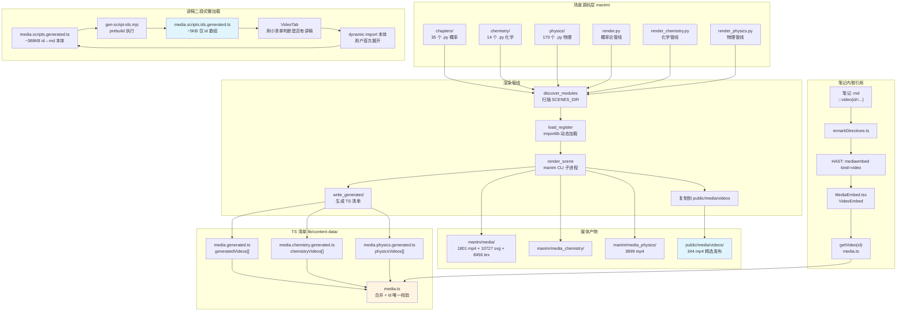
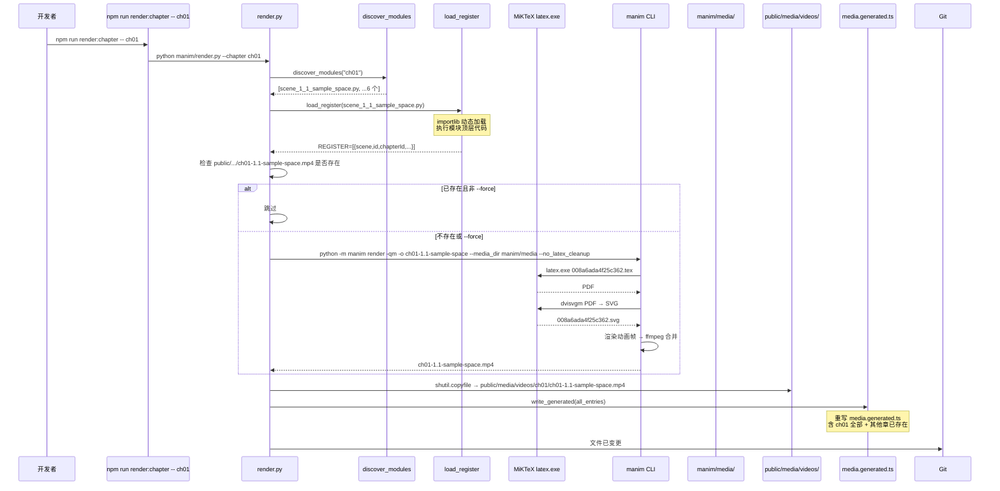
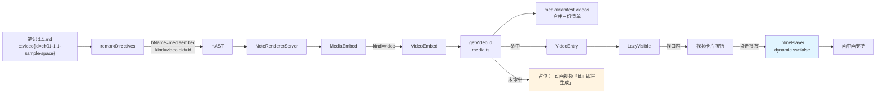
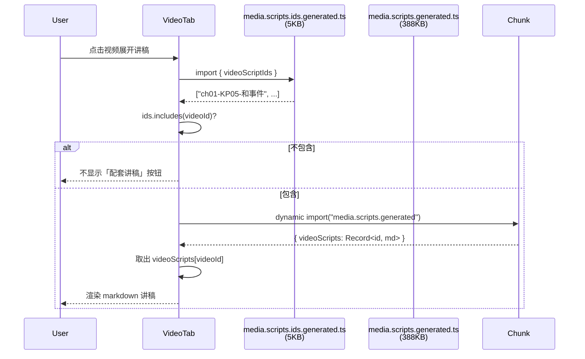

# Manim 动画系统 深度调研报告

> **调研人**：Agent-C（性能与交互调研员）
> **调研日期**：2026-07-05
> **项目版本**：gailvlun v0.4.0（package.json:3）
> **关联文档**：
> - [SOP 02 详情生成](../../docs/sop/02-detail-generation.md) §Step 5（Manim 动画）
> - [SOP 04 题库生成](../../docs/sop/04-quiz-generation.md) §4（复杂题 Manim 视频讲解）
> - [SOP 学科接入](../../docs/sop/subject-onboarding.md)
> - [性能优化报告](./07-performance-optimization.md) §3.8（讲稿二段式懒加载）
> - [交互组件系统](./08-interactive-components.md) §9.4（与 Manim 系统的协同）

## 1. 执行摘要

gailvlun 的 Manim 动画系统是一套**「Python 场景脚本 + REGISTER 注册 + 三套独立渲染管线 + 自动生成 TS 清单 + 笔记指令内联引用」**的工程化方案。系统规模庞大：**222 个 Python 文件**（35 概率 + 14 化学 + 170 物理 + 3 渲染脚本）、**5917 个 mp4 媒体产物**（1801 media + 3899 media_physics + 217 media_test）、**10727 个 SVG 文件**、**8456 个 .tex 文件**，最终发布到 `public/media/videos/` 的精选视频 **344 个**。

核心架构特点：（1）三套**完全独立**的渲染管线 `render.py` / `render_chemistry.py` / `render_physics.py`，互不干扰，分别对应概率论、化学、物理三个学科，避免 chapterId 重叠导致的清单覆盖问题；（2）每个场景脚本顶层导出 `REGISTER` 列表，声明 scene 类名、视频 id、chapterId/sectionId/title/description 等元数据，渲染脚本动态 import 模块读取 REGISTER；（3）渲染产物自动写入 `lib/content-data/media.{generated,chemistry.generated,physics.generated}.ts` 三份清单，由 `media.ts` 合并并做 id 唯一性校验；（4）`:::video{id=...}` 笔记指令通过 `remarkDirectives.ts` 转为 `<mediaembed kind="video">`，由 `MediaEmbed.tsx` 的 `VideoEmbed` 子组件渲染，与交互组件系统**共用同一 HAST 节点类型**；（5）LaTeX/MiKTeX 在渲染链路中承担数学公式渲染（MathTex），8456 个 .tex 文件是 Manim 调用 latex.exe 的中间产物，渲染完成后保留以便 `--no_latex_cleanup` 加速重复渲染；（6）讲稿与视频的二段式懒加载——`media.scripts.ids.generated.ts`（~5KB id 数组）由 `gen-script-ids.mjs` 在 prebuild 期从 `media.scripts.generated.ts`（~388KB 本体）提取，VideoTab 用小清单判断是否有配套讲稿，正文按需 dynamic import。

## 2. 架构总览



## 3. 核心机制详解

### 3.1 场景脚本规范与 REGISTER 模式

每个 Manim 场景脚本（.py）顶层导出 `REGISTER` 列表，声明要产出的视频元数据：

**示例 1：概率论 ch01**（`manim/chapters/ch01/scene_1_1_sample_space.py:77-86`）

```python
REGISTER = [
    {
        "scene": "SampleSpaceScene",       # 场景类名
        "id": "ch01-1.1-sample-space",     # 全局唯一视频 id（= 输出文件名）
        "chapterId": "ch01",
        "sectionId": "1.1",
        "title": "样本空间与事件",
        "description": "用掷骰子直观展示样本空间 Ω 与事件 A = 出现偶数。",
    },
]
```

**示例 2：化学 ch04**（`manim/chemistry/ch04/scene_4_1_newman.py:287-294`）

```python
REGISTER = [{
    "scene": "EthaneNewmanScene",
    "id": "ch04-4.1-newman",
    "chapterId": "ch04",
    "sectionId": "4.1",
    "title": "乙烷构象与纽曼投影能量",
    "description": "旋转乙烷观察纽曼投影从交叉式到重叠式，对照势能曲线。",
}]
```

**REGISTER 字段约定**（render.py 头部注释 §1-17 详述）：

| 字段 | 类型 | 用途 | 必填 |
|------|------|------|------|
| `scene` | str | 场景类名，Manim 渲染时 `python -m manim render ... SceneName` | 是 |
| `id` | str | 全局唯一视频 id，决定输出文件名 `<id>.mp4` | 是 |
| `chapterId` | str | 章过滤，决定产物路径 `public/media/videos/{chapterId}/{id}.mp4` | 是 |
| `sectionId` | str | 节过滤，前端按节展示对应视频 | 是 |
| `title` | str | 视频标题，前端展示 | 是 |
| `description` | str | 视频描述（可选，前端展示） | 否 |
| `src` | str | 渲染后由 render.py 自动填入的相对路径 | 自动生成 |

**单文件多场景**：REGISTER 是 list，单 .py 文件可注册多个场景（虽然实践中多数文件只注册 1 个），render.py 会遍历每个 entry。

### 3.2 三套独立渲染管线

项目有**三套完全独立的渲染脚本**，互不干扰：

| 脚本 | 学科 | SCENES_DIR | MEDIA_OUT | PUBLIC_VIDEOS | GENERATED_TS | 导出符号 |
|------|------|------------|-----------|---------------|--------------|----------|
| `manim/render.py` | 概率论 | `manim/chapters/` | `manim/media/` | `public/media/videos/` | `media.generated.ts` | `generatedVideos` |
| `manim/render_chemistry.py` | 化学 | `manim/chemistry/` | `manim/media_chemistry/` | `public/media/videos/chemistry/` | `media.chemistry.generated.ts` | `chemistryVideos` |
| `manim/render_physics.py` | 物理 | `manim/physics/` | `manim/media_physics/` | `public/media/videos/physics/` | `media.physics.generated.ts` | `physicsVideos` |

**为什么独立**（`render_chemistry.py:5-9` 注释明确说明）：

> "为什么独立：render.py 的 write_generated 不写 subjectId，且会整体重写 media.generated.ts；为避免破坏概率论视频，本脚本只渲染 manim/chemistry/ 下的场景，产物落 public/media/videos/chemistry/，并写入独立的 content/media.chemistry.generated.ts（条目带 subjectId="chemistry"）。media.ts 会把两份清单合并。"

**关键差异**：
1. **render.py 不写 subjectId**：概率论清单条目无 `subjectId` 字段，前端默认按"probability"识别（参见 `media.generated.ts:4-13` 实际有 subjectId 字段，是后续补的，但 render.py 注释说不写）；
2. **render_chemistry.py / render_physics.py 显式写 subjectId**：化学条目带 `"subjectId": "chemistry"`，物理条目带 `"subjectId": "physics"`；
3. **物理 render 加 timeout=360s**（`render_physics.py:103`）：物理场景复杂度高，加超时避免单场景卡死整个渲染流程，化学和概率论无 timeout；
4. **三套 media_dir 隔离**：避免不同学科的 Tex/SVG 中间产物混淆。

### 3.3 渲染管线流程（以 render.py 为例）

`manim/render.py` 完整流程：

**Step 1：发现场景模块**（`render.py:54-64`）

```python
def discover_modules(chapter: str | None) -> list[Path]:
    if not SCENES_DIR.exists():
        return []
    files: list[Path] = []
    for py in sorted(SCENES_DIR.rglob("*.py")):
        if py.name.startswith("_"):  # 跳过 __init__.py 等
            continue
        if chapter and chapter not in py.parts:  # --chapter ch01 过滤
            continue
        files.append(py)
    return files
```

`SCENES_DIR.rglob("*.py")` 递归扫描所有 .py 文件，按文件名排序保证顺序稳定。`--chapter ch01` 参数通过 `py.parts` 路径段匹配过滤。

**Step 2：动态加载 REGISTER**（`render.py:67-80`）

```python
def load_register(py: Path) -> list[dict]:
    spec = importlib.util.spec_from_file_location(py.stem, py)
    if not spec or not spec.loader:
        return []
    module = importlib.util.module_from_spec(spec)
    try:
        spec.loader.exec_module(module)  # 执行模块顶层代码
    except Exception as exc:
        print(f"  [warn] 无法导入 {py.name}: {exc}")
        return []
    reg = getattr(module, "REGISTER", [])  # 读取 REGISTER 属性
    for r in reg:
        r["_file"] = str(py)  # 注入源文件路径
    return reg
```

`importlib.util.spec_from_file_location` 动态加载 .py 文件而不需启动 Python 包导入系统，避免 `__init__.py` 依赖。`exec_module` 执行模块顶层代码（含 `from manim import *`、Scene 类定义、REGISTER 赋值），失败时优雅降级返回空列表。

**Step 3：调用 manim CLI 渲染场景**（`render.py:109-127`）

```python
def render_scene(py: Path, scene: str, vid_id: str, quality: str) -> Path | None:
    cmd = [
        sys.executable, "-m", "manim", "render",
        f"-q{quality}", "-o", vid_id,           # 输出文件名 = 视频 id
        "--media_dir", str(MEDIA_OUT),           # 中间产物目录
        "--no_latex_cleanup",                    # 保留 Tex 中间产物
        str(py), scene,                          # 场景脚本路径 + 类名
    ]
    res = subprocess.run(cmd, cwd=str(ROOT), env=_clean_env_for_latex())
    if res.returncode != 0:
        print(f"  [error] 渲染失败：{scene}")
        return None
    candidates = sorted(
        MEDIA_OUT.glob(f"videos/**/{vid_id}.mp4"),
        key=lambda p: p.stat().st_mtime,
        reverse=True,
    )
    return candidates[0] if candidates else None
```

`subprocess.run` 调用 `python -m manim render` 子进程，cwd 设为项目根目录。`--no_latex_cleanup` 保留 .tex/.svg 中间产物（见 §3.5）。`env=_clean_env_for_latex()` 是为 MiKTeX 修正 PATH（见 §3.6）。渲染后用 glob 在 `videos/**/{vid_id}.mp4` 查找产物，按 mtime 排序取最新。

**Step 4：复制到 public 并写清单**（`render.py:152-198`）

```python
for py in discover_modules(args.chapter):
    reg = load_register(py)
    if not reg:
        continue
    for e in reg:
        dest = PUBLIC_VIDEOS / e["chapterId"] / f"{e['id']}.mp4"
        if dest.exists() and not args.force:
            print(f"  · 跳过（已存在）{e['id']}")  # 增量渲染
        else:
            out = render_scene(Path(e["_file"]), e["scene"], e["id"], args.quality)
            if out is None:
                continue
            shutil.copyfile(out, dest)
        if dest.exists():
            e["src"] = f"/media/videos/{e['chapterId']}/{e['id']}.mp4"
            all_entries.append(e)

# --chapter 模式：合并其他章已存在的视频，避免覆盖丢失
if args.chapter:
    for py in discover_modules(None):
        for e in load_register(py):
            if e["chapterId"] == args.chapter:
                continue
            dest = PUBLIC_VIDEOS / e["chapterId"] / f"{e['id']}.mp4"
            if dest.exists():
                e["src"] = f"/media/videos/{e['chapterId']}/{e['id']}.mp4"
                all_entries.append(e)

# 去重（按 id）
seen: dict[str, dict] = {}
for e in all_entries:
    seen[e["id"]] = e
write_generated(list(seen.values()))
```

**增量渲染**：默认 `dest.exists() and not args.force` 时跳过，避免重复渲染已存在视频。`--force` 强制重渲。**`--chapter` 合并逻辑**：单章渲染后，遍历所有章的 REGISTER 把已存在的视频补进清单，避免清单只包含本次渲染的视频而丢失其他章。**按 id 去重**：用 dict 覆盖，保证清单中每个 id 只出现一次。

### 3.4 19708 文件的组织结构

**文件类型分布**（实测统计）：

| 类型 | 数量 | 路径 | 用途 |
|------|------|------|------|
| `.py` 场景脚本 | 222 | `manim/{chapters,chemistry,physics}/chXX/*.py` | 场景源码（35 + 14 + 170 + 3 渲染脚本） |
| `.mp4` 媒体产物 | 5917 | `manim/media*/videos/**/...mp4` | 渲染中间产物（含 partial_movie_files） |
| `.svg` | 10727 | `manim/media*/Tex/*.svg` | LaTeX 公式渲染产物 |
| `.tex` | 8456 | `manim/media*/Tex/*.tex` | LaTeX 源码（manim 调 latex.exe 生成） |
| `.mp4` 精选发布 | 344 | `public/media/videos/{ch01-08,chemistry,physics}/...mp4` | 实际部署的视频 |

**目录组织**（以概率论为例）：

```
manim/
├── render.py                          # 概率论渲染脚本
├── render_chemistry.py                # 化学渲染脚本
├── render_physics.py                  # 物理渲染脚本
├── chapters/                          # 概率论场景源码
│   ├── ch01/
│   │   ├── scene_1_1_sample_space.py  # 1.1 节场景
│   │   ├── scene_1_2_operations.py
│   │   ├── scene_1_3_frequency.py
│   │   ├── scene_1_4_classical.py
│   │   ├── scene_1_5_bayes.py
│   │   └── scene_1_6_independence.py
│   ├── ch02/...ch08/
├── chemistry/                         # 化学场景源码
│   ├── ch01/...ch14/
├── physics/                           # 物理场景源码
│   ├── ch02/ch04/ch05/ch07/ch09/ch10/ch12/ch13/ch14/
├── media/                             # 概率论中间产物
│   ├── videos/scene_1_1_sample_space/480p15/
│   │   ├── ch01-1.1-sample-space.mp4  # 最终产物
│   │   └── partial_movie_files/SampleSpaceScene/*.mp4  # 中间片段
│   ├── Tex/                           # LaTeX 公式产物
│   │   ├── 008a6ada4f25c362.tex       # 公式源码
│   │   ├── 008a6ada4f25c362.svg       # 渲染后的 SVG
│   │   └── ...（8456 个）
│   ├── images/                        # 图片资源
│   └── texts/                         # 文本渲染产物
├── media_chemistry/                   # 化学中间产物（结构同 media/）
├── media_physics/                     # 物理中间产物
│   └── videos/scene_2_1_kp2_streamline_flow_tube/480p15/
└── media_test/                        # 测试用中间产物
```

**partial_movie_files** 是 Manim 的中间片段，每个 `self.play()` 调用产出一个片段，最终 `ffmpeg` 合并为完整视频。5917 个 mp4 中只有 344 个是最终产物，其余是 partial。

### 3.5 LaTeX/MiKTeX 在渲染链路中的角色

Manim 用 LaTeX 渲染数学公式（`MathTex` 类）。当场景代码含 `MathTex(r"\Omega")` 时，渲染流程：

1. Manim 调 `latex.exe` 把 LaTeX 源码编译为 PDF；
2. Manim 调 `dvisvgm` 把 PDF 转 SVG；
3. Manim 把 SVG 作为图片元素嵌入动画。

**8456 个 .tex 文件**：每个 `MathTex(r"...")` 调用产出一个 .tex 文件（哈希命名，如 `008a6ada4f25c362.tex`），位于 `manim/media*/Tex/`。Manim 默认渲染后会 cleanup 这些中间产物，但项目用 `--no_latex_cleanup` 标志**显式保留**（`render.py:114`），目的是：

- **加速重复渲染**：相同公式 hash 命中已有 SVG，跳过 latex.exe 调用（耗时大头）；
- **调试**：保留 .tex 可追溯每个公式的源码，便于排查渲染异常。

**10727 个 .svg 文件**：每个 .tex 对应一个 .svg（PDF→SVG 转换产物），加上部分直接渲染的 SVG（如 `Text` 渲染为 SVG）。.svg 数量略多于 .tex，因为部分场景直接生成 SVG 而不经 LaTeX。

**MathTex 与 Text 的取舍**（场景脚本约定，见 `scene_1_1_sample_space.py:1-5` 注释）：

```python
"""第 1.1 节 · 样本空间与事件 —— 用掷骰子直观展示 Ω 与事件 A。

中文文字用 Text（依赖系统 CJK 字体，如 Microsoft YaHei）；
数学符号用 MathTex（依赖 LaTeX，如 MiKTeX）。
"""
```

中文文字用 `Text("...", font="Microsoft YaHei")` 不调 latex，性能更好；数学符号用 `MathTex(r"...")` 调 latex 渲染。

### 3.6 _clean_env_for_latex：MiKTeX PATH 修正

`render.py:83-106`、`render_chemistry.py:76-91`、`render_physics.py:77-91` 都有 `_clean_env_for_latex` 函数：

```python
def _clean_env_for_latex() -> dict:
    """返回适合 MiKTeX latex 运行的环境变量字典。

    Python 3.12 路径（AppData\\Local\\Programs\\Python\\Python312\\）含有与
    MiKTeX VC++ Runtime 冲突的 DLL，导致 latex.exe 以 0xC0000135 崩溃。
    此函数从 PATH 中剔除已知冲突目录，确保 MiKTeX bin 目录排在最前面。
    """
    miktex_bin = r"C:\Users\AIMFl\AppData\Local\Programs\MiKTeX\miktex\bin\x64"
    env = os.environ.copy()
    path_parts = env.get("PATH", "").split(os.pathsep)
    cleaned = [miktex_bin]
    skip_keywords = [r"Python\Python312", r"Python312"]
    for p in path_parts:
        if p == miktex_bin:
            continue
        if any(kw.lower() in p.lower() for kw in skip_keywords):
            continue
        cleaned.append(p)
    env["PATH"] = os.pathsep.join(cleaned)
    return env
```

**问题背景**：Python 3.12 安装目录下的 DLL 与 MiKTeX 的 VC++ Runtime 冲突，导致 `latex.exe` 启动时崩溃（exit code 0xC0000135）。这是 Windows 平台特有的环境兼容性问题。

**解决方案**：把 MiKTeX bin 目录放到 PATH 最前，剔除 Python 3.12 目录（注意是 PATH 环境变量层面，不影响 manim CLI 自己的 Python 调用）。三套渲染脚本都复制了此函数，是项目里少有的代码重复——可抽公共模块。

### 3.7 媒体清单的生成与消费

**生成链路**：

```python
# render.py:130-148
def write_generated(entries: list[dict]) -> None:
    clean = [
        {
            "id": e["id"],
            "chapterId": e["chapterId"],
            "sectionId": e["sectionId"],
            "title": e["title"],
            "src": e["src"],
            **({"description": e["description"]} if e.get("description") else {}),
        }
        for e in entries
    ]
    body = json.dumps(clean, ensure_ascii=False, indent=2)
    GENERATED_TS.write_text(
        'import type { VideoEntry } from "@/lib/content/types";\n\n'
        "// ⚠️ 本文件由 manim/render.py 自动生成，请勿手动编辑。\n"
        f"export const generatedVideos: VideoEntry[] = {body};\n",
        encoding="utf-8",
    )
```

注意：`render.py` 的 clean 字典**不含 subjectId**（注释说不写），但实际 `media.generated.ts` 文件第一条目带 `"subjectId": "probability"`（第 6 行）——这是后续手动补的或历史遗留。`render_chemistry.py` 和 `render_physics.py` 则显式写 subjectId。

**消费链路**（`lib/content-data/media.ts:13-45`）：

```typescript
export const mediaManifest: MediaManifest = {
  videos: [...generatedVideos, ...chemistryVideos, ...physicsVideos],
};

// 防御：视频 id 必须全局唯一
(() => {
  const seen = new Set<string>();
  for (const v of mediaManifest.videos) {
    if (seen.has(v.id)) {
      throw new Error(`[media] 重复的视频 id: "${v.id}"（视频 id 必须全局唯一）`);
    }
    seen.add(v.id);
  }
})();

export function getVideo(id?: string | null): VideoEntry | undefined {
  if (!id) return undefined;
  return mediaManifest.videos.find((v) => v.id === id);
}

export function getVideosForSection(subjectId, chapterId, sectionId): VideoEntry[] {
  return mediaManifest.videos.filter(
    (v) => v.subjectId === subjectId && v.chapterId === chapterId && v.sectionId === sectionId,
  );
}
```

三份清单在 `media.ts` 合并，并做 **id 全局唯一性校验**——模块加载时立即抛错，避免静默返回错视频。`getVideo(id)` 按 id 线性查找，`getVideosForSection` 三段过滤（与交互组件系统的 `getInteractivesForSection` 一致）。

### 3.8 :::video 指令引用视频

笔记 Markdown 中的 `:::video{id=...}` 指令处理链路与 `:::interactive` **完全相同**（共享 `mediaembed` HAST 节点）：

**Step 1：Markdown 解析**（`lib/markdown/remarkDirectives.ts:74-78`）

```typescript
if (name === "video" || name === "interactive") {
  data.hName = "mediaembed";
  data.hProperties = { kind: name, eid: attrs.id ?? "" };
  return;
}
```

**Step 2：MediaEmbed 分发到 VideoEmbed**（`components/shared/directives/MediaEmbed.tsx:101-107`）

```typescript
export function MediaEmbed({ node }: NodeProps) {
  const kind = String(node?.properties?.kind ?? "");
  const eid = String(node?.properties?.eid ?? "");
  if (kind === "video") return <VideoEmbed id={eid} />;
  if (kind === "interactive") return <InteractiveEmbed id={eid} />;
  return null;
}
```

**Step 3：VideoEmbed 渲染**（`MediaEmbed.tsx:21-74`）

```typescript
function VideoEmbed({ id }: { id: string }) {
  const openPip = useStore((s) => s.openPip);
  const pipReturnTime = useStore((s) => s.pipReturnTime);
  const closePip = useStore((s) => s.closePip);
  const video = getVideo(id);
  const [isPlaying, setIsPlaying] = useState(false);

  if (!video) {
    return (
      <div className="my-4 rounded-xl border border-dashed border-[var(--line)] bg-[var(--bg-muted)] px-4 py-3 text-[13px] text-[var(--ink-faint)]">
        动画视频「{id}」即将生成。
      </div>
    );
  }

  if (isPlaying) {
    return (
      <div className="my-4 overflow-hidden rounded-xl border border-[var(--line)] bg-black">
        <div className="aspect-video w-full">
          <InlinePlayer video={video} startTime={startTime} onPip={(currentTime) => {
            setIsPlaying(false);
            openPip(video, currentTime);
          }} />
        </div>
      </div>
    );
  }

  return (
    <LazyVisible placeholder={<SkeletonBlock height={60} className="my-4" />}>
      <button onClick={() => setIsPlaying(true)}>
        {/* 视频卡片 */}
      </button>
    </LazyVisible>
  );
}
```

**关键设计**：
1. **InlinePlayer 用 dynamic + ssr:false**（`MediaEmbed.tsx:11-14`）：避免 SSR 跑视频解码 API；
2. **画中画（PiP）支持**：通过 `openPip(video, currentTime)` 把视频丢到全局 PiP 容器，用户可边看视频边滚动阅读；
3. **LazyVisible 视口懒挂载**：与交互组件系统一致；
4. **id 未找到时优雅降级**：显示「动画视频『xxx』即将生成」占位，与 InteractiveEmbed 一致。

### 3.9 讲稿二段式懒加载（与性能优化报告 §3.8 呼应）

视频配套讲稿存储在 `lib/content-data/media.scripts.generated.ts`（~388KB），结构是 `Record<videoId, markdown>`。直接打首屏 chunk 会拖慢首屏，项目用二段式拆分：

**Prebuild 期**：`scripts/gen-script-ids.mjs` 读取大对象本体，正则提取顶层 key（id），写出极小的 `media.scripts.ids.generated.ts`（仅 id 数组，~5KB）。

**运行时**：VideoTab 先 import 小清单判断某视频是否有配套讲稿，决定是否显示「配套讲稿」按钮；用户首次展开时 dynamic import 388KB 本体取出对应 markdown。

详见 [性能优化报告 §3.8](./07-performance-optimization.md#38-二段式讲稿懒加载链路)。

### 3.10 scripts/render 与 scripts/render:chapter 的区别

`package.json:19-20`：

```json
"render": "python manim/render.py",
"render:chapter": "python manim/render.py --chapter",
```

**`scripts/render`**：无参数，渲染所有章节中**尚未生成**的视频（增量渲染）。`--chapter` 缺省时 `discover_modules(None)` 扫描所有章节。

**`scripts/render:chapter`**：需要追加章号参数，例如 `npm run render:chapter -- ch01`。仅渲染指定章节，但合并时会把其他章已存在的视频补进清单（见 §3.3 Step 4 的 `--chapter` 合并逻辑）。

**注意**：`render:chapter` 在 package.json 中没有 `--` 分隔符的提示，用户需手动加 `--`，例如：

```bash
npm run render:chapter -- ch01     # 正确
npm run render:chapter ch01         # 错误（ch01 会传给 npm 而非 python）
```

化学和物理**没有对应的 npm script**，需直接调 `python manim/render_chemistry.py --chapter ch04`，这是 npm script 配置不全。

## 4. 数据流与调用链路

### 4.1 完整渲染流程（以概率论 ch01 为例）



### 4.2 视频引用流程



### 4.3 讲稿加载流程



## 5. 关键代码路径

| 文件 | 行号 | 作用 | 备注 |
|------|------|------|------|
| `manim/render.py` | 1-27 | 头部注释 + REGISTER 约定 | 文档化规范 |
| `manim/render.py` | 47-51 | ROOT/SCENES_DIR/MEDIA_OUT/PUBLIC_VIDEOS 常量 | 路径配置 |
| `manim/render.py` | 54-64 | discover_modules 扫描场景 | rglob + 路径段过滤 |
| `manim/render.py` | 67-80 | load_register 动态加载 | importlib.util |
| `manim/render.py` | 83-106 | _clean_env_for_latex | MiKTeX PATH 修正 |
| `manim/render.py` | 109-127 | render_scene 调 manim CLI | --no_latex_cleanup |
| `manim/render.py` | 130-148 | write_generated 生成 TS | json.dumps + 模板字符串 |
| `manim/render.py` | 152-198 | main 主流程 | 增量渲染 + --chapter 合并 |
| `manim/render_chemistry.py` | 1-22 | 化学管线头部说明 | 解释为何独立 |
| `manim/render_physics.py` | 1-23 | 物理管线头部说明 | timeout=360s |
| `lib/content-data/media.ts` | 13-27 | 三份清单合并 + id 唯一校验 | 模块加载时抛错 |
| `lib/content-data/media.ts` | 29-45 | getVideo / getVideosForSection | 线性查找 |
| `lib/content-data/media.generated.ts` | 4- | 概率论清单（自动生成） | generatedVideos[] |
| `lib/content-data/media.scripts.generated.ts` | 3- | 讲稿本体（388KB） | videoScripts Record |
| `lib/content-data/media.scripts.ids.generated.ts` | 5- | 讲稿 id 数组（5KB） | videoScriptIds[] |
| `scripts/gen-script-ids.mjs` | 26-32 | 讲稿 id 提取正则 | prebuild 执行 |
| `components/shared/directives/MediaEmbed.tsx` | 11-14 | InlinePlayer dynamic 加载 | ssr:false |
| `components/shared/directives/MediaEmbed.tsx` | 21-74 | VideoEmbed 实现 | PiP 支持 |
| `lib/markdown/remarkDirectives.ts` | 74-78 | :::video 转 mediaembed | 与 ::interactive 共用 |
| `package.json` | 19-20 | render / render:chapter npm scripts | 化学物理无对应 script |

## 6. 设计决策与取舍分析

### 6.1 三套独立渲染管线而非统一管线

**取舍**：项目选择**三套完全独立的渲染脚本**（render.py / render_chemistry.py / render_physics.py），而非统一管线 + 学科参数。

**理由**：
1. **chapterId 跨学科重叠**：概率 ch01 和化学 ch01 都是 "ch01"，统一管线需额外的 subjectId 参数区分；
2. **media_dir 隔离**：避免不同学科的 Tex/SVG 中间产物混淆，便于排查；
3. **public 路径分层**：化学产物落 `public/media/videos/chemistry/`，物理落 `public/media/videos/physics/`，概率直接 `public/media/videos/{chapterId}/`——历史遗留的不一致，但独立管线让此差异自然成立；
4. **演进速度不同**：物理管线加 timeout=360s 是因物理场景复杂度高，化学和概率无此需求。

**代价**：
1. **代码重复**：`_clean_env_for_latex`、`load_register`、`render_scene` 等函数在三个脚本中复制粘贴；
2. **维护成本**：若需修改渲染逻辑（如改 media_dir 命名规则），三套脚本都要改；
3. **清单文件分散**：三份 .generated.ts 文件，新增学科时需新建第四份。

**评价**：当前规模下（3 个学科）独立管线的清晰度优势大于代码重复代价，但若扩展到 10+ 学科，应抽公共模块。

### 6.2 render.py 不写 subjectId 而 chemistry/physics 写

**取舍**：render.py 的 `write_generated` 函数 clean 字典不包含 `subjectId` 字段（`render.py:131-141`），而 `render_chemistry.py:119-127` 和 `render_physics.py:119-128` 显式写 `"subjectId": "chemistry"` / `"subjectId": "physics"`。

**实际状况**：`media.generated.ts:6` 文件中概率论条目**实际有** `"subjectId": "probability"`——这与 render.py 注释「不写 subjectId」矛盾。可能是：
1. 历史遗留（render.py 早期不写，后来补的）；
2. 注释未更新；
3. 手动编辑过（虽然文件头注明「请勿手动编辑」）。

**风险**：render.py 注释与实际行为不一致是**文档债**，未来若有人按注释理解可能引入 bug。

### 6.3 增量渲染（默认跳过已存在）而非每次全量

**取舍**：`dest.exists() and not args.force` 时跳过渲染，`--force` 才强制重渲。

**优势**：
1. **节省时间**：单视频渲染 30s-6min，全量重渲 200+ 视频需数小时；
2. **部分渲染**：开发者只需重渲修改过的章节，其他保留；
3. **CI 友好**：构建时已渲染的视频不再重复渲染。

**代价**：
1. **场景逻辑变更时不刷新**：若改了 manim 版本或公用工具函数，旧视频不会自动重渲；
2. **依赖 `--force` 全量重渲**：开发者需记住此参数，否则可能用旧视频。

### 6.4 保留 .tex/.svg 中间产物（--no_latex_cleanup）

**取舍**：`--no_latex_cleanup` 标志保留 8456 个 .tex + 10727 个 .svg 中间产物。

**优势**：
1. **加速重复渲染**：相同公式 hash 命中已渲染的 SVG，跳过 latex.exe（耗时大头）；
2. **调试**：保留 .tex 可追溯公式源码。

**代价**：
1. **磁盘占用**：8456 + 10727 = ~19000 个小文件，每个几 KB，总计 ~50-100MB；
2. **git 噪音**：若 .gitignore 不当，会把中间产物提交进仓库（实测 .gitignore 应已排除 manim/media*/）。

### 6.5 笔记 ::video 与 ::interactive 共用 mediaembed HAST 节点

**取舍**：与交互组件系统共用同一 HAST 节点类型 `<mediaembed>`，靠 `kind` 属性区分。

**优势**：
1. 笔记作者只需记一个指令名前缀；
2. HAST 节点类型减少；
3. 未来若新增 ::audio 等第三种媒体类型，扩展 kind 即可。

详见 [交互组件系统报告 §6.3](./08-interactive-components.md#63-interactive-与-video-共用-mediaembed-hast-节点)。

## 7. 问题清单

| # | 问题描述 | 严重程度 | 涉及文件 | 建议修复方向 |
|---|----------|----------|----------|--------------|
| 1 | render.py 注释说不写 subjectId，但实际 media.generated.ts 含 subjectId 字段，文档与代码不一致 | P2 | `manim/render.py:5`、`lib/content-data/media.generated.ts:6` | 更新 render.py 注释或 write_generated 函数，让行为与文档一致 |
| 2 | 化学（render:chemistry）和物理（render:physics）无对应 npm script，需直接调 python，与概率论不一致 | P2 | `package.json:19-20` | 增加 `"render:chemistry": "python manim/render_chemistry.py"` 和 `"render:physics": "python manim/render_physics.py"` 以及对应的 `:chapter` 版本 |
| 3 | 三套渲染脚本中 `_clean_env_for_latex`、`load_register`、`render_scene` 函数复制粘贴，维护成本高 | P3 | `manim/render*.py` | 抽 `manim/_render_common.py` 公共模块，三套脚本 import |
| 4 | 5917 个 mp4 中只有 344 个是最终产物，其余 partial_movie_files 占大量磁盘空间，无清理机制 | P3 | `manim/media*/videos/*/partial_movie_files/` | 加 `--cleanup_partials` 选项或定期清理脚本 |
| 5 | render.py 的 `--chapter` 参数通过 `py.parts` 路径段匹配，若路径中含 "ch01" 字符串会误匹配（如 `manim/chapters/ch01backup/`） | P3 | `manim/render.py:61` | 改用正则 `re.match(r"^ch\d{2}$", chapter) and chapter in py.parent.name` |
| 6 | 物理 render 加 timeout=360s，化学和概率无 timeout，单场景卡死会让整个渲染流程挂起 | P2 | `manim/render.py:118`、`manim/render_chemistry.py:102` | 给所有 render_scene 调用统一加 timeout=360s（或更长） |
| 7 | `media.generated.ts` 等 3 份清单文件无版本号或时间戳，无法判断清单与 public/media/videos/ 是否同步 | P3 | `lib/content-data/media*.generated.ts` | 在 write_generated 时写入 `// generated at: 2026-07-05 14:50` 注释 |
| 8 | 讲稿 media.scripts.generated.ts（388KB）是 JSON 字符串字面量形式，解析时需完整 JSON.parse | P3 | `lib/content-data/media.scripts.generated.ts` | 考虑按章节拆分，或预先 parse 成 JS 对象（已在性能报告 §7 提及） |
| 9 | 渲染脚本的 `--quality` 默认 "m"（480p15），无文档说明 l/m/h/k 对应的分辨率和码率 | P3 | `manim/render.py:156` | 在 README 或 SOP 中说明 `-ql` 480p15 / `-qm` 720p30 / `-qh` 1080p60 / `-qk` 4K |
| 10 | manim CLI 输出的 partial_movie_files 目录无清理机制，5917 个 mp4 持续累积 | P3 | `manim/media*/videos/` | 加 `--cleanup_partials` 选项或定期清理脚本 |

## 8. 改进建议

### P0 / P1（无紧迫问题）

当前 Manim 系统稳定运行，无 P0/P1 紧迫问题。

### P2（中收益 / 健壮性提升）

1. **统一 npm script 配置**：在 package.json 增加 `render:chemistry`、`render:physics` 及其 `:chapter` 版本，与概率论对齐：
   ```json
   "render:chemistry": "python manim/render_chemistry.py",
   "render:chemistry:chapter": "python manim/render_chemistry.py --chapter",
   "render:physics": "python manim/render_physics.py",
   "render:physics:chapter": "python manim/render_physics.py --chapter"
   ```
2. **render.py 注释与行为对齐**：确认 `media.generated.ts` 是否含 subjectId，更新 render.py 注释或 write_generated 函数。
3. **所有渲染脚本统一加 timeout**：把 `render_physics.py:103` 的 timeout=360s 模式扩展到 render.py 和 render_chemistry.py，避免单场景卡死。

### P3（低紧迫 / 优化体验）

1. **抽公共渲染模块**：`manim/_render_common.py` 提供 `discover_modules`、`load_register`、`render_scene`、`_clean_env_for_latex`、`write_generated` 等公共函数，三套脚本 import 使用；
2. **partial_movie_files 清理机制**：加 `--cleanup_partials` 选项，渲染后清理中间片段；
3. **清单文件加版本号**：write_generated 时写入生成时间戳，便于排查清单与 public 不同步问题；
4. **--quality 文档化**：在 SOP 或 README 说明 l/m/h/k 对应的分辨率；
5. **--chapter 路径匹配改进**：用正则避免误匹配。

### 明确不做

- 合并三套渲染脚本为统一管线（当前 3 个学科独立管线清晰度优势大于代码重复代价）；
- 把所有 partial_movie_files 立即清理（影响重复渲染性能）；
- 改用其他动画引擎（Manim 已形成完整生态，重写成本极高）。

## 9. 与全自动化平台改造的关系

### 9.1 Manim 系统的平台化基础

当前系统**已具备平台化扩展基础**，新增学科的接入流程：

1. 创建 `manim/{新学科}/chXX/*.py` 场景脚本（含 REGISTER 导出）；
2. 复制 `render_chemistry.py` 改名为 `render_{新学科}.py`，修改 SCENES_DIR / MEDIA_OUT / PUBLIC_VIDEOS / GENERATED_TS / subjectId 五个常量；
3. 在 `package.json` 增 `render:{新学科}` npm script；
4. 在 `lib/content-data/media.ts` 的合并数组中追加 `newSubjectVideos`；
5. （可选）在笔记中用 `:::video{id=...}` 引用。

**平台化改造注意点**：
1. **`_clean_env_for_latex` 的硬编码 MiKTeX 路径**（`C:\Users\AIMFl\AppData\Local\Programs\...`）只在当前开发机生效，平台化部署到其他机器需改为环境变量或自动探测；
2. **`--no_latex_cleanup` 的磁盘占用**：随学科增多线性增长，平台化后应加定期清理；
3. **三套渲染管线的代码重复**：扩展到 5+ 学科时应抽公共模块；
4. **MiKTeX 依赖**：Manim 渲染依赖本地 MiKTeX 安装，CI/CD 环境需预装。

### 9.2 平台化改造优先级

- **必须先做**：补全 npm script（P2.1），平台化时多学科团队不会因 script 缺失而困惑；
- **同步进行**：render.py 注释与行为对齐（P2.2），避免文档债扩散；
- **可延后**：抽公共模块（P3.1）—— 3 个学科时尚可忍受重复，5+ 学科时再做。

### 9.3 与交互组件系统的协同

详见 [交互组件系统报告 §9.4](./08-interactive-components.md#94-与-manim-动画系统的协同)。建议平台化时为每个核心知识点同时提供 Manim 视频（被动观看）+ 交互组件（主动探索），参考概率论 ch01-ch08 已实现的「每节一个 Manim + 一个交互」双覆盖模式。

### 9.4 Manim 系统对内容规模扩展的承载能力

**当前规模**：
- 222 个 .py 场景脚本
- 344 个发布视频
- 5917 个 mp4 中间产物
- 8456 个 .tex + 10727 个 .svg

**扩展预估**：
- 每新增一个学科（按 8-14 章算）：增加 30-100 个 .py + 60-200 个发布视频 + 1-3GB 中间产物；
- 平台化到 10 个学科：~1000 个 .py + ~3000 个发布视频 + ~30GB 中间产物；
- 当前 `outputFileTracingIncludes` 把 `content/` 打进 standalone，**未包含 `public/media/videos/`**——视频走 CDN 还是打进包需平台化时决策。

**风险**：
1. **构建产物体积爆炸**：10 个学科的视频总计可能 5-10GB，不适合打进 standalone；
2. **首次加载带宽**：用户首次访问若需下载大量视频，体验差；
3. **CDN 策略**：应区分热门视频（首屏加载）和冷门视频（按需加载）。

## 10. 参考资料

### 项目内文档
- [SOP 02 详情生成](../../docs/sop/02-detail-generation.md) §Step 5（Manim 动画开发规范）
- [SOP 04 题库生成](../../docs/sop/04-quiz-generation.md) §4（复杂题 Manim 视频讲解）
- [SOP 学科接入](../../docs/sop/subject-onboarding.md) §media.generated.ts
- [性能优化报告](./07-performance-optimization.md) §3.8（讲稿二段式懒加载）
- [交互组件系统报告](./08-interactive-components.md) §9.4（与 Manim 系统协同）
- [渲染架构](../../docs/refer/rendering-architecture.md)

### 源码引用
- `manim/render.py:1-202`（概率论渲染管线完整实现）
- `manim/render_chemistry.py:1-191`（化学渲染管线）
- `manim/render_physics.py:1-195`（物理渲染管线 + timeout）
- `manim/chapters/ch01/scene_1_1_sample_space.py:1-86`（场景脚本示例 + REGISTER）
- `manim/chemistry/ch04/scene_4_1_newman.py:287-294`（化学场景 REGISTER 示例）
- `lib/content-data/media.ts:13-45`（三份清单合并 + id 唯一校验）
- `lib/content-data/media.generated.ts:1-25`（自动生成的概率论清单）
- `lib/content-data/media.scripts.ids.generated.ts:1-30`（讲稿 id 数组）
- `scripts/gen-script-ids.mjs:26-32`（讲稿 id 提取逻辑）
- `components/shared/directives/MediaEmbed.tsx:11-107`（VideoEmbed + InteractiveEmbed + MediaEmbed 分发）
- `lib/markdown/remarkDirectives.ts:74-78`（::video / ::interactive 转 mediaembed）
- `next.config.mjs:13-18`（outputFileTracingIncludes/Excludes）
- `package.json:19-20`（render / render:chapter npm scripts）

### Manim 官方文档
- [Manim Documentation](https://docs.manim.community/)
- [Manim Scene](https://docs.manim.community/en/stable/tutorials/Quickstart.html)
- [Manim MathTex](https://docs.manim.community/en/stable/reference/manim.mobject.text.tex_mobject.MathTex.html)
- [Manim Media Dir](https://docs.manim.community/en/stable/guides/configuration.html#media-dir)

### LaTeX/MiKTeX 文档
- [MiKTeX Documentation](https://miktex.org/documentation)
- [dvisvgm](https://dvisvgm.de/)

### Next.js / Tooling 文档
- [next/dynamic](https://nextjs.org/docs/app/building-your-application/optimizing/lazy-loading)
- [outputFileTracing](https://nextjs.org/docs/app/api-reference/config/next-config-js/outputFileTracing)

---

*本报告基于源代码静态分析，已实际阅读 manim/render.py / render_chemistry.py / render_physics.py 全部代码、场景脚本示例（scene_1_1_sample_space.py / scene_4_1_newman.py）、media.ts / media.generated.ts / gen-script-ids.mjs / MediaEmbed.tsx 等核心文件，并通过 find 命令统计了 222 个 .py / 5917 个 .mp4 / 10727 个 .svg / 8456 个 .tex / 344 个发布视频的实际数量。三套渲染脚本中的 _clean_env_for_latex 等重复函数未逐字对比，仅抽样阅读。*
