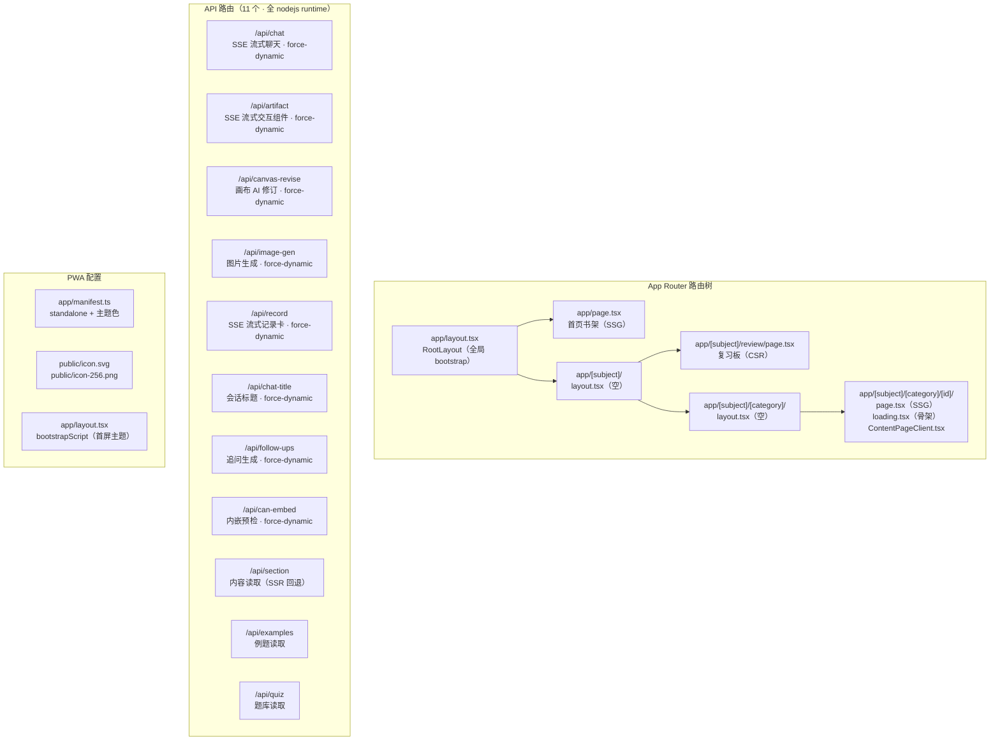
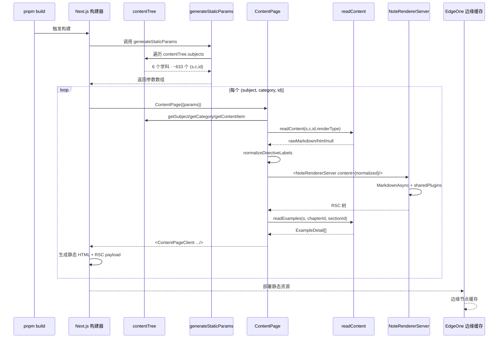
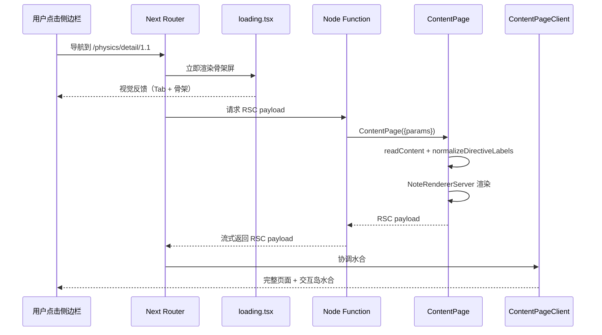
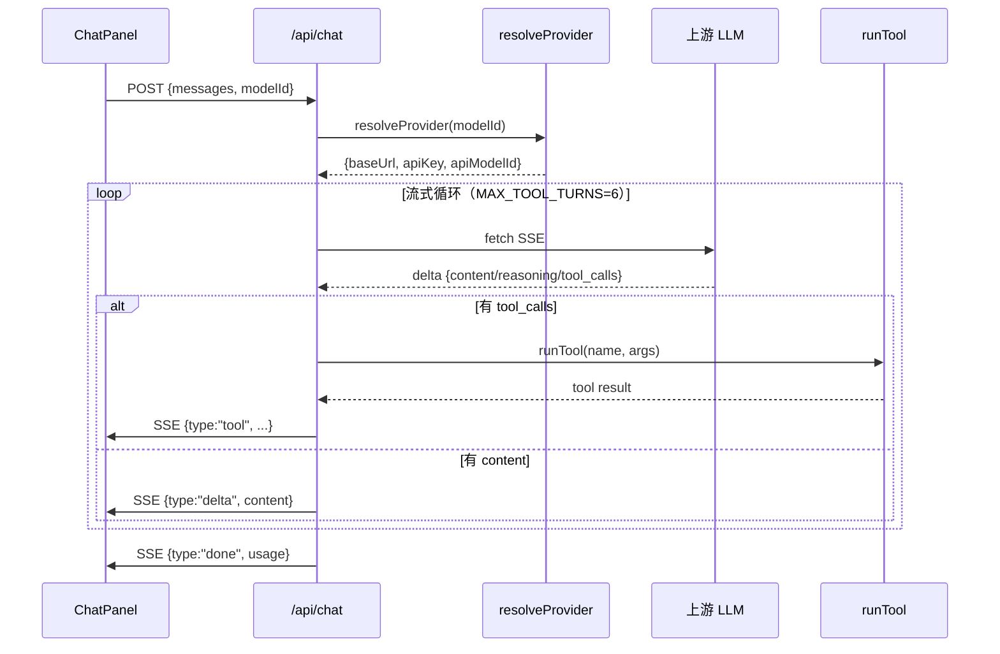

# 维度 10：路由与 SSR/SSG 深度调研报告

> **调研人**：Agent-A（架构与渲染调研员）
> **调研日期**：2026-07-05
> **项目版本**：gailvlun v0.3.1
> **关联文档**：`docs/refer/rendering-architecture.md`、`docs/refer/performance-audit-report.md`、`docs/refer/storage-architecture.md`

## 1. 执行摘要

gailvlun 的路由层基于 Next.js 16 App Router，采用**「SSG 全量预渲染 + Node Function 按需回退 + force-dynamic API」**三层策略。核心路由是 `app/[subject]/[category]/[id]/page.tsx` 的动态三段路由，通过 `generateStaticParams` 在构建期为 `contentTree` 中全部 ~633 个 `(subject, category, id)` 组合预渲染静态 HTML（含 KaTeX/highlight 烘焙结果），并以 `dynamicParams = false` + `revalidate = false` 关闭运行时增量生成与 ISR——内容更新通过 git 提交触发重新构建。

11 个 API 路由统一声明 `runtime = "nodejs"`（无 edge runtime），其中 8 个流式/AI 类路由额外声明 `dynamic = "force-dynamic"` 禁用静态化，3 个内容读取路由（`/api/section`、`/api/examples`、`/api/quiz`）保持默认静态行为以利用缓存。

`NoteRendererServer` 在构建期完成 Markdown → HTML 的完整渲染（含 KaTeX 公式、代码高亮、指令组件水合岛标记），浏览器只接收 RSC payload 并协调水合，**完全消除**了「客户端挂载后再 fetch /api/section + react-markdown + KaTeX」的瀑布。PWA 配置（`app/manifest.ts`）声明 `display: standalone`、`theme_color: #d9542c`、`background_color: #f4efe6`，配合 `app/layout.tsx` 的 `appleWebApp` 元数据与内联 `bootstrapScript`（paint 前应用主题/布局状态）实现零安装 PWA。

## 2. 架构总览



## 3. 核心机制详解

### 3.1 App Router 路由结构完整地图

项目路由树（基于 `app/` 目录扫描）：

```
app/
├── layout.tsx                          # RootLayout（全局 bootstrap + AppShell）
├── page.tsx                            # 首页书架（SSG，从 contentTree 渲染学科卡片）
├── manifest.ts                         # PWA Web App Manifest
├── globals.css                         # 全局样式入口
├── icon.svg                            # SVG 图标
├── styles/                             # CSS 子模块
│
├── [subject]/
│   ├── layout.tsx                      # 空透传 layout
│   ├── review/
│   │   └── page.tsx                    # 复习板（CSR，useReviewCards）
│   └── [category]/
│       ├── layout.tsx                  # 空透传 layout
│       └── [id]/
│           ├── layout.tsx              # 空透传 layout
│           ├── page.tsx                # 内容页（SSG 入口）
│           ├── loading.tsx             # 骨架屏
│           └── ContentPageClient.tsx   # 客户端外壳（"use client"）
│
└── api/                                # 11 个 API 路由
    ├── artifact/route.ts
    ├── can-embed/route.ts
    ├── canvas-revise/route.ts
    ├── chat/route.ts
    ├── chat-title/route.ts
    ├── examples/route.ts
    ├── follow-ups/route.ts
    ├── image-gen/route.ts
    ├── quiz/route.ts
    ├── record/route.ts
    └── section/route.ts
```

**路由层级**：`/[subject]/[category]/[id]` 是三段动态路由，对应 `SubjectId` + `CategoryId` + `itemId`。三段中间 layout 文件均为空 `<>{children}</>`，未承担任何职责（见问题清单 #1）。

### 3.2 动态路由运作机制

**`app/[subject]/[category]/[id]/page.tsx:37-96`** 的 `ContentPage` 函数：

```typescript
interface PageProps {
  params: Promise<{ subject: string; category: string; id: string }>;
}

export default async function ContentPage({ params }: PageProps) {
  const { subject, category, id } = await params;
  if (!isSubjectId(subject)) notFound();              // 运行时类型守卫
  const subjectData = getSubject(subject);
  const categoryData = getCategory(subject, category);
  const item = getContentItem(subject, category, id);
  if (!subjectData || !categoryData) notFound();

  const renderType = item?.renderType ?? 'markdown';
  const rawContent = readContent(subject, category, id, renderType);
  const normalizedContent = (rawContent && renderType === 'markdown')
    ? normalizeDirectiveLabels(rawContent) : rawContent;

  const renderedNote = (normalizedContent && renderType === 'markdown')
    ? <NoteRendererServer content={normalizedContent} /> : null;

  // 例题 SSR 预读
  const EXAMPLE_CATEGORIES = new Set(["detail", "recording", "textbook", "english"]);
  const { chapterId, sectionId } =
    renderType === "markdown" && EXAMPLE_CATEGORIES.has(category)
      ? deriveExampleKey(category, id)
      : { chapterId: "", sectionId: "" };
  const initialExamples = chapterId && sectionId
    ? readExamples(subject, chapterId, sectionId) : [];

  return <ContentPageClient ... />;
}
```

**关键点**：
- `params` 是 `Promise`（Next 16 异步路由参数），需 `await`
- 三层校验：`isSubjectId` 类型守卫 → `getSubject` 查 manifest → `getCategory` 查 manifest → `getContentItem` 查 manifest
- `renderType` 决定加载路径：markdown → `readContent` + `NoteRendererServer`；html → `readContent`（iframe 渲染）；component → null（客户端 `ComponentRenderer`）
- 例题仅对 `detail/recording/textbook/english` 四类预读

### 3.3 generateStaticParams 全量预渲染

**`app/[subject]/[category]/[id]/page.tsx:16-30`**：

```typescript
export async function generateStaticParams() {
  const params: { subject: string; category: string; id: string }[] = [];
  for (const subject of contentTree.subjects) {
    for (const category of subject.categories) {
      const walk = (items: ContentItem[]) => {
        for (const item of items) {
          params.push({ subject: subject.id, category: category.id, id: item.id });
          if (item.children) walk(item.children);  // 递归 children
        }
      };
      walk(category.items);
    }
  }
  return params;
}
```

**预渲染数量**：遍历 `contentTree` 所有 subject → category → item（含 `children` 递归），生成全部 `(subject, category, id)` 组合。基于 `nav.generated.json` 中 633 个 `id` 字段，预渲染约 **633+ 个静态页面**（含 children 嵌套项）。

**递归处理**：概率论 `detail` 分类的 `ch01` 是章级 item，其 `children` 是 `[1.1, 1.2, ...]` 节级 item。`walk` 函数递归处理，确保 `ch01` 与 `1.1` 都生成独立路由。

### 3.4 dynamicParams = false 与 revalidate = false

**`app/[subject]/[category]/[id]/page.tsx:33-35`**：

```typescript
export const dynamicParams = false;
export const revalidate = false;
```

**`dynamicParams = false`**：
- 未在 `generateStaticParams` 中枚举的 id（如 stub 占位条目）返回 404，不触发按需渲染
- 注释（`page.tsx:32-33`）：「未在 manifest 中枚举的 id（如 stub）按需在 Node Function 渲染后缓存，不直接 404」——但实际 `dynamicParams = false` 会直接 404，注释与代码有出入（见问题清单 #2）

**`revalidate = false`**：
- 关闭 ISR（Incremental Static Regeneration）
- 注释（`page.tsx:34-35`）：「内容随 git 提交变动 → 构建期烘焙即可，无需时间型增量再生」
- 内容更新策略：git 提交 → `pnpm build` 重新构建 → 部署

**内容更新触发重建的流程**：
1. 作者修改 `content/` 下的 .md 文件或 `manifest.ts`
2. 提交到 git
3. CI/手动运行 `pnpm build`
4. `generateStaticParams` 重新枚举，`ContentPage` 重新渲染所有页面
5. 部署到 EdgeOne / 桌面端打包

### 3.5 NoteRendererServer 构建期工作

**`components/notes/NoteRendererServer.tsx:15-25`**：

```typescript
export default async function NoteRendererServer({ content }: { content: string }) {
  return (
    <MarkdownAsync
      remarkPlugins={sharedRemarkPlugins}
      rehypePlugins={sharedRehypePlugins}
      components={noteComponents}
    >
      {content}
    </MarkdownAsync>
  );
}
```

**构建期完成的渲染**：

| 渲染环节 | 构建期产物 | 客户端接收 |
|---|---|---|
| Markdown 解析 | MDAST → HAST | RSC payload（React 树） |
| KaTeX 公式 | `$...$` / `$$...$$` → HTML | 渲染好的 `<span class="katex">` |
| 代码高亮 | ` ```lang ` → 高亮 HTML | 渲染好的 `<code class="hljs">` |
| 指令归一 | `:::type` → 自定义 HAST 元素 | 渲染好的 `<div class="callout">` 等 |
| 指令组件 | RSC 树 + 水合岛标记 | 水合岛占位（如 `<details>` 折叠组件） |

**消除的客户端瀑布**：
- 旧方案（CSR）：挂载 → fetch /api/section → react-markdown 解析 → KaTeX 渲染 → 高亮（4 步，~200-500ms 主线程阻塞）
- 新方案（SSG）：浏览器接收 RSC payload → 协调水合（1 步，几乎零主线程开销）

**水合岛保留**：所有 `"use client"` 的指令组件（Callout/MemoryCard/MediaEmbed 等）在 RSC 树中作为水合岛保留，浏览器水合后恢复交互能力（如 MemoryCard 的点击展开、MediaEmbed 的视频播放）。

### 3.6 11 个 API 路由职责

| 路由 | 方法 | runtime | dynamic | 职责 |
|---|---|---|---|---|
| `/api/chat` | POST | nodejs | force-dynamic | SSE 流式聊天（OpenAI 兼容 + Anthropic 适配器），含工具调用、思考流拆分 |
| `/api/artifact` | POST | nodejs | force-dynamic | SSE 流式生成交互演示 HTML（AI artifact） |
| `/api/canvas-revise` | POST | nodejs | force-dynamic | 画布 AI 修订（接收 CanvasBlock + instruction，返回修订后 block） |
| `/api/image-gen` | POST | nodejs | force-dynamic | 图片生成（OpenAI Image API / SiliconFlow 风格双适配） |
| `/api/record` | POST | nodejs | force-dynamic | SSE 流式记录卡（划词/右键 → 复习卡，三模式） |
| `/api/chat-title` | POST | nodejs | force-dynamic | 生成会话标题（SiliconFlow 默认端点） |
| `/api/follow-ups` | POST | nodejs | force-dynamic | 生成 3 个追问问题（JSON 数组） |
| `/api/can-embed` | GET | nodejs | force-dynamic | 预检 URL 是否可 iframe 内嵌（X-Frame-Options / CSP） |
| `/api/section` | GET | nodejs | 默认 | 读取内容 markdown（SSR 回退 + 兼容旧版） |
| `/api/examples` | GET | nodejs | 默认 | 读取例题列表 / 单题正文 |
| `/api/quiz` | GET | nodejs | 默认 | 读取题库 JSON |

**配置分类**：
- **force-dynamic 类（8 个）**：AI/流式路由，每次请求都不同，禁用静态化
- **默认静态类（3 个）**：内容读取路由，可被 EdgeOne 边缘缓存，`/api/section` 主要作 SSR 回退（`page.tsx` 已直接调用 `readContent`）

**SSE 流式路由的公共模式**（`/api/chat`、`/api/artifact`、`/api/record`）：

```typescript
export const runtime = "nodejs";
export const dynamic = "force-dynamic";

export async function POST(req: NextRequest) {
  const encoder = new TextEncoder();
  const stream = new ReadableStream<Uint8Array>({
    async start(controller) {
      const send = (o: unknown) => controller.enqueue(encoder.encode(sse(o)));
      const pingTimer = setInterval(() => send({ type: "ping", t: Date.now() }), 15000);
      try { /* 业务逻辑 */ } finally { clearInterval(pingTimer); controller.close(); }
    },
  });
  return new Response(stream, {
    headers: { "Content-Type": "text/event-stream; charset=utf-8", ... },
  });
}
```

15 秒 ping 保活 + finally 清理是 SSE 路由的公共模式。

### 3.7 PWA 配置

**`app/manifest.ts:3-18`**：

```typescript
export default function manifest(): MetadataRoute.Manifest {
  return {
    name: "期末复习工作站 · 多学科辅助学习",
    short_name: "期末复习",
    description: "课堂录音驱动的深度学习助手...",
    start_url: "/",
    display: "standalone",
    background_color: "#f4efe6",
    theme_color: "#d9542c",
    icons: [
      { src: "/icon.svg", sizes: "any", type: "image/svg+xml" },
      { src: "/icon-256.png", sizes: "256x256", type: "image/png" },
    ],
  };
}
```

**配套元数据**（`app/layout.tsx:20-32`）：

```typescript
export const metadata: Metadata = {
  title: "期末复习工作站 · 多学科辅助学习",
  description: "...",
  appleWebApp: {
    capable: true,
    title: "期末复习",
    statusBarStyle: "default",
  },
  icons: { apple: "/icon-256.png" },
};
```

**首屏 bootstrap**（`app/layout.tsx:10`）：

内联 `bootstrapScript` 在 paint 前从 localStorage 读取并应用：
- 主题（`gailvlun-theme`）→ `<html data-theme="light|dark">`
- 侧边栏折叠（`gailvlun-sidebar-collapsed`）→ `<html data-sidebar-collapsed>`
- 顶栏折叠（`gailvlun-topbar-collapsed`）→ `<html data-topbar-collapsed>`
- 外观配置（`gailvlun-appearance-v1`）→ 主题模式 + 字体 + 自定义配色（CSS 变量）

这一设计**避免首屏闪烁**（FOUC）：若等 React 水合后再应用主题，用户会看到默认主题闪一下后切换。

### 3.8 loading.tsx 骨架屏

**`app/[subject]/[category]/[id]/loading.tsx:14-63`**：

Next.js App Router 约定：路由段加载时自动渲染 `loading.tsx`。骨架屏 UI 与 `ContentPageClient` 保持一致（三 Tab + 正文骨架），在 RSC payload 流式到达前提供视觉占位。

注释（`loading.tsx:11-13`）：「在真实内容（尤其是概率论大试卷）的 RSC payload 从服务端流式到达前，提供一个视觉上高度相似的占位。这能让用户在点击侧边栏后立即看到『页面已切换』的反馈，显著改善『切换卡顿』的体感。」

### 3.9 复习板路由（CSR 例外）

**`app/[subject]/review/page.tsx:35-239`**：

复习板是唯一的 CSR 例外：`"use client"` + `useReviewCards`（IndexedDB 持久化）。原因：复习卡数据完全在客户端 IndexedDB，无 SSR 必要；路由 `/[subject]/review` 不在 `generateStaticParams` 中（它是 `[subject]` 下的固定 `review` 段，不是 `[id]`）。

### 3.10 桌面端打包路由差异

**`next.config.mjs:6-8`**：

```javascript
...(process.env.BUILD_STANDALONE === "1"
  ? { output: "standalone", images: { unoptimized: true } }
  : {}),
```

桌面端打包（`BUILD_STANDALONE=1`）启用 standalone output，关闭图片优化（避免 sharp 原生依赖）。Web/本地/EdgeOne 构建不受影响。

## 4. 数据流与调用链路

### 4.1 SSG 构建期流程



### 4.2 客户端路由切换



### 4.3 API 路由调用链（以 /api/chat 为例）



## 5. 关键代码路径

### 5.1 路由入口

- `app/layout.tsx:34-56` — RootLayout（bootstrap + AppShell）
- `app/page.tsx:142-169` — 首页书架
- `app/[subject]/[category]/[id]/page.tsx:16-30` — `generateStaticParams`
- `app/[subject]/[category]/[id]/page.tsx:33-35` — `dynamicParams`/`revalidate`
- `app/[subject]/[category]/[id]/page.tsx:37-96` — `ContentPage`
- `app/[subject]/[category]/[id]/loading.tsx:14-63` — 骨架屏
- `app/[subject]/[category]/[id]/ContentPageClient.tsx:65-314` — 客户端外壳
- `app/[subject]/review/page.tsx:35-239` — 复习板

### 5.2 空透传 layout

- `app/[subject]/layout.tsx:1-7`
- `app/[subject]/[category]/layout.tsx:1-7`
- `app/[subject]/[category]/[id]/layout.tsx:1-7`

### 5.3 API 路由

- `app/api/chat/route.ts:30-31` — `runtime = "nodejs"` + `dynamic = "force-dynamic"`
- `app/api/chat/route.ts:72-` — POST 处理（SSE 流式）
- `app/api/artifact/route.ts:6-7` — SSE 流式交互组件生成
- `app/api/canvas-revise/route.ts:8-9` — 画布 AI 修订
- `app/api/image-gen/route.ts:10-11` — 图片生成
- `app/api/record/route.ts:14-15` — SSE 流式记录卡
- `app/api/chat-title/route.ts:9-10` — 会话标题生成
- `app/api/follow-ups/route.ts:7-8` — 追问生成
- `app/api/can-embed/route.ts:4-5` — 内嵌预检
- `app/api/section/route.ts:5` — 内容读取（SSR 回退）
- `app/api/examples/route.ts:7` — 例题读取
- `app/api/quiz/route.ts:5` — 题库读取

### 5.4 PWA 配置

- `app/manifest.ts:3-18` — Web App Manifest
- `app/layout.tsx:12-18` — viewport 配置
- `app/layout.tsx:20-32` — metadata（含 appleWebApp）
- `app/layout.tsx:10` — bootstrapScript（首屏主题/布局）
- `public/icon.svg`、`public/icon-256.png` — PWA 图标

### 5.5 构建配置

- `next.config.mjs:6-8` — standalone 输出（桌面端）
- `next.config.mjs:13-18` — `outputFileTracingIncludes/Excludes`
- `next.config.mjs:24-26` — `optimizePackageImports`（含 katex 排除约束）

## 6. 设计决策与取舍分析

### 6.1 为什么用 SSG 全量预渲染而非 CSR SPA

- **取舍**：构建时间（633+ 页面）换首屏性能与 SEO
- **理由**：学习类内容长尾、低更新频率，SSG 一次构建多次复用收益高；KaTeX/highlight 在客户端解析会阻塞主线程 200-500ms，构建期烘焙可消除
- **代价**：构建慢（633+ 页面 × Markdown 渲染）、内容更新需重新部署

### 6.2 为什么关闭 ISR（revalidate = false）

- **取舍**：失去运行时增量更新能力，换构建期确定性
- **理由**：内容随 git 提交变动，构建期烘焙即可；ISR 会引入「缓存命中旧版 vs 回源生成新版」的不一致
- **代价**：内容更新必须重新构建并部署，无法热更新

### 6.3 为什么 dynamicParams = false

- **取舍**：未枚举的 id 直接 404，不触发按需渲染
- **理由**：所有合法 id 都在 `contentTree` 中枚举；未枚举的 id 多为拼写错误或恶意请求，按需渲染会增加攻击面
- **代价**：新增内容必须更新 manifest 并重新构建（无法运行时动态添加）

### 6.4 为什么 API 路由统一 nodejs runtime

- **取舍**：失去 edge runtime 的低延迟，换 Node API 完整性
- **理由**：所有 API 都需读取文件系统（`fs.readFileSync`）或调用 Node 专属库（`idb-keyval` 服务端、`cos-nodejs-sdk-v5`）；edge runtime 不支持 `fs` 与大部分 Node 模块
- **代价**：API 部署在 Node Function，延迟略高于 edge，但学习类应用对延迟不敏感

### 6.5 为什么 AI 类 API 都用 force-dynamic

- **取舍**：禁用静态化，每次请求都重新执行
- **理由**：AI 响应因模型、prompt、上下文不同而不同，静态化无意义；`force-dynamic` 还避免 Next 把 POST 请求误判为可缓存
- **代价**：无边缘缓存，每次请求都打到 Node Function

### 6.6 为什么 3 个内容读取 API 不声明 force-dynamic

- **取舍**：保留静态化可能性，换缓存收益
- **理由**：`/api/section`、`/api/examples`、`/api/quiz` 读取的内容随 git 提交变动，可被 EdgeOne 边缘缓存；`page.tsx` 已直接调用 `readContent` 做 SSR，这些 API 仅作客户端回退
- **代价**：内容更新后需手动清缓存（或等 TTL 过期）

### 6.7 为什么三个中间 layout 都是空文件

- **取舍**：保留路由层级清晰，未承担职责
- **理由**：可能为未来 metadata/边界预留；当前 SubjectLayout/CategoryLayout/ContentLayout 都只 `<>{children}</>`
- **代价**：路由树多三层无意义文件（见问题清单 #1）

### 6.8 为什么复习板是 CSR 而非 SSG

- **取舍**：失去 SSG 性能优势，换数据实时性
- **理由**：复习卡数据完全在客户端 IndexedDB（`useReviewCards`），无 SSR 必要；路由 `/[subject]/review` 不在 `generateStaticParams` 中
- **代价**：复习板无 SEO（但学习类应用不需要），首屏需等 IndexedDB 水合

### 6.9 为什么用内联 bootstrapScript 而非外部 JS

- **取舍**：增加 HTML 体积，换首屏零闪烁
- **理由**：若用外部 JS，浏览器需先下载 JS 再应用主题，会有 FOUC；内联脚本在 HTML 解析时同步执行，paint 前已应用主题
- **代价**：HTML 体积增加 ~4KB（未压缩），但可接受

## 7. 问题清单

| # | 问题描述 | 严重程度 | 涉及文件 | 建议修复方向 |
|---|----------|----------|----------|--------------|
| 1 | `app/[subject]/layout.tsx`、`app/[subject]/[category]/layout.tsx`、`app/[subject]/[category]/[id]/layout.tsx` 三个 layout 文件均为空 `<>{children}</>`，未承担任何职责 | P3 | `app/[subject]/layout.tsx` 等 | 移除以简化路由树，或承载学科级 metadata/边界 |
| 2 | `page.tsx:32-33` 注释「未在 manifest 中枚举的 id（如 stub）按需在 Node Function 渲染后缓存，不直接 404」与 `dynamicParams = false` 实际行为矛盾——`dynamicParams = false` 会直接 404，不触发按需渲染 | P2 | `app/[subject]/[category]/[id]/page.tsx:32-35` | 修正注释为「未在 manifest 中枚举的 id 直接 404」 |
| 3 | `generateStaticParams` 不区分 `status: 'stub'` 与 `status: 'done'`，对 stub 占位条目也生成静态页（渲染 `EmptyNote` 占位），浪费构建资源 | P3 | `app/[subject]/[category]/[id]/page.tsx:16-30` | 可在 `generateStaticParams` 中跳过 `status === 'stub'` 的条目，但需确保 stub 不被用户访问 |
| 4 | 633+ 页面 SSG 预渲染导致构建时间长；`revalidate = false` 关闭 ISR，内容更新必须全量重建 | P2 | `app/[subject]/[category]/[id]/page.tsx:35` | 评估改用 `revalidate: 3600`（1 小时 ISR）或按需 revalidate（on-demand revalidation） |
| 5 | `/api/section` 路由与 `page.tsx` 的 `readContent` 调用重复，API 仅作「客户端回退」，但 `ContentPageClient.tsx:96-97` 注释明确「客户端切换路由时 page.tsx 会重新做服务端渲染，无需再 fetch /api/section」——API 实际无消费方 | P3 | `app/api/section/route.ts`、`app/[subject]/[category]/[id]/ContentPageClient.tsx:96-97` | 确认无消费方后下线 `/api/section`，或保留作外部集成入口 |
| 6 | `app/layout.tsx:10` 的 `bootstrapScript` 是单行 4KB+ 内联脚本，可读性差且未压缩；包含完整的主题/字体/外观逻辑 | P3 | `app/layout.tsx:10` | 抽到独立 `.ts` 文件并经 build 优化，或保留但加分段注释 |
| 7 | `app/manifest.ts:11-12` 的 `background_color: "#f4efe6"` 与 `theme_color: "#d9542c"` 是硬编码，未与 `lib/constants/subjects.ts` 的 `SUBJECT_COLORS` 或全局主题令牌联动 | P3 | `app/manifest.ts:11-12` | 可从 CSS 变量或常量导入，保持单一真相源 |
| 8 | `app/[subject]/review/page.tsx` 是 CSR 路由，但未声明 `export const dynamic = "force-dynamic"` 或 `export const runtime = "nodejs"`，依赖 Next 默认行为 | P3 | `app/[subject]/review/page.tsx` | 显式声明以明确意图，避免 Next 版本升级后默认行为变化 |
| 9 | `next.config.mjs:13-18` 的 `outputFileTracingIncludes` 包含 `content/**/*`，但 `outputFileTracingExcludes` 又排除 `content/_raw`、`content/examples`、`content/.index`，规则有重叠 | P3 | `next.config.mjs:13-18` | 显式细化 include 规则，避免 _raw/examples 被重复计算 |
| 10 | SSE 路由的 15 秒 ping 保活是公共模式，但每个路由各自实现 `sse()` 函数与 `pingTimer`，未抽公共工具 | P3 | `app/api/chat/route.ts`、`app/api/artifact/route.ts`、`app/api/record/route.ts` | 抽 `lib/ai/sseHelper.ts` 统一 sse 编码与 ping 保活 |
| 11 | `app/api/can-embed/route.ts:54-62` 的 `fetch` 用固定 User-Agent 字符串（Chrome 124），长期可能被目标站点识别为爬虫 | P3 | `app/api/can-embed/route.ts:57-60` | 定期更新 UA 或从配置读取 |
| 12 | `app/layout.tsx:43-47` 的 `<script dangerouslySetInnerHTML={{__html: bootstrapScript}}/>` 是 XSS 风险点（若 bootstrapScript 被污染）；当前 bootstrapScript 是硬编码常量，无实际风险，但模式不安全 | P3 | `app/layout.tsx:43-47` | 接受现状（硬编码安全），但加注释说明不可接受外部输入 |

## 8. 改进建议

### P1（高收益 · 低风险）

无 P1 问题。当前路由架构在 SSG + RSC + API 分层上设计清晰，性能优化已落地。

### P2（中收益 · 中风险）

- **修正 `dynamicParams` 注释**（#2）：注释与代码行为矛盾，易误导维护者
- **评估 ISR 改造**（#4）：内容规模扩张后，全量 SSG 构建时间可能成为瓶颈。可评估按学科分批 ISR 或 on-demand revalidation（通过 webhook 触发）
- **下线或文档化 `/api/section`**（#5）：确认无消费方后下线，或文档化作为外部集成入口

### P3（低优先）

- **清理空 layout**（#1）：移除三个空透传 layout，简化路由树
- **跳过 stub 预渲染**（#3）：`generateStaticParams` 过滤 `status === 'stub'`
- **抽 SSE 公共工具**（#10）：统一 sse 编码与 ping 保活
- **manifest 主题色联动**（#7）：从常量导入，保持单一真相源
- **复习板显式声明 runtime**（#8）
- **细化 outputFileTracing 规则**（#9）
- **bootstrapScript 拆分**（#6）

## 9. 与全自动化平台改造的关系

本维度对平台化改造的影响：

1. **SSG 全量预渲染是平台化的构建瓶颈**：633 页面尚可，但若平台化后接入 10+ 学科、5000+ 页面，构建时间可能从分钟级升至小时级。需评估改用 ISR（`revalidate: 3600`）或 on-demand revalidation（通过内容更新 webhook 触发特定页面重新生成）。

2. **generateStaticParams 是平台化的核心扩展点**：当前从 `contentTree` 静态枚举，平台化时应改为从「平台内容数据库」动态查询。`generateStaticParams` 是 Next 16 的标准 API，改造兼容性好。

3. **dynamicParams = false 是平台化的安全约束**：平台化后可能有大量用户生成内容（UGC），`dynamicParams = false` 可防止未审核内容被预渲染。但需配合「内容审核 → 加入 manifest → 触发重建」流程。

4. **API 路由统一 nodejs runtime 是平台化的部署约束**：平台化时若部署到 Vercel 等 Serverless 平台，nodejs runtime 意味着 Node Function 部署，需评估冷启动与成本。可考虑把 `/api/section`、`/api/examples`、`/api/quiz` 等纯读取路由改造为 edge runtime（需把 `fs.readFileSync` 换为对象存储 SDK）。

5. **force-dynamic AI 路由是平台化的成本中心**：8 个 AI 类 API 每次 request 都执行，平台化时需评估限流、配额、排队机制。

6. **PWA 配置是平台化的品牌化入口**：`manifest.ts` 的 `name`/`theme_color`/`icons` 可作为平台化的品牌化配置，支持白标（white-label）部署。

7. **bootstrapScript 是平台化的首屏体验关键**：内联脚本避免 FOUC，平台化时应保留这一模式。但 4KB 脚本应抽到独立文件并经 build 优化。

8. **空 layout 是平台化的清理项**：三个空 layout 可移除，或在平台化时承载学科级 metadata（如 `<title>{subject.name}</title>`）。

9. **loading.tsx 骨架屏是平台化的 UX 资产**：视觉占位改善切换卡顿体感，平台化时应保留并支持主题定制。

10. **SSE 公共模式可平台化**：8 个 force-dynamic 路由的 SSE 模式（ping 保活 + finally 清理）应抽为公共工具，平台化时复用。

## 10. 参考资料

### 项目内文档

- `docs/refer/rendering-architecture.md` — 共享渲染架构（含 NoteRendererServer 边界）
- `docs/refer/performance-audit-report.md` — 性能审查报告（SSG 预渲染、骨架屏）
- `docs/refer/storage-architecture.md` — 存储架构（复习板 CSR 与 IndexedDB）
- `docs/sop/06-desktop-packaging-release.md` — 桌面端打包（standalone 输出）

### 关键源码

- `app/layout.tsx` — RootLayout 与 bootstrap
- `app/page.tsx` — 首页书架
- `app/manifest.ts` — PWA 配置
- `app/[subject]/[category]/[id]/page.tsx` — SSG 入口
- `app/[subject]/[category]/[id]/loading.tsx` — 骨架屏
- `app/[subject]/[category]/[id]/ContentPageClient.tsx` — 客户端外壳
- `app/[subject]/review/page.tsx` — 复习板
- `app/api/*/route.ts` — 11 个 API 路由
- `next.config.mjs` — 构建配置

### 外部文档

- [Next.js 16 App Router](https://nextjs.org/docs/app)
- [Next.js generateStaticParams](https://nextjs.org/docs/app/api-reference/functions/generate-static-params)
- [Next.js dynamicParams](https://nextjs.org/docs/app/api-reference/file-conventions/route#dynamic-params)
- [Next.js revalidate](https://nextjs.org/docs/app/api-reference/file-conventions/route#revalidate)
- [Next.js route segment config](https://nextjs.org/docs/app/api-reference/file-conventions/route-segment-config)
- [Next.js PWA Web App Manifest](https://nextjs.org/docs/app/api-reference/file-conventions/metadata/app-icons)
- [Web App Manifest spec](https://developer.mozilla.org/docs/Web/Manifest)
