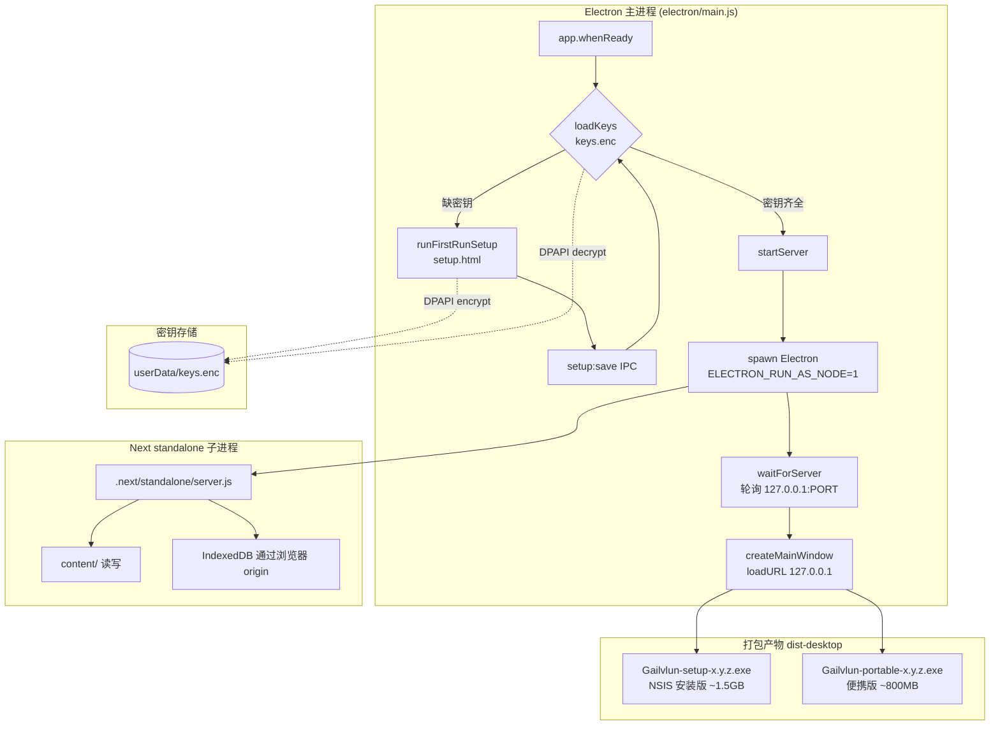
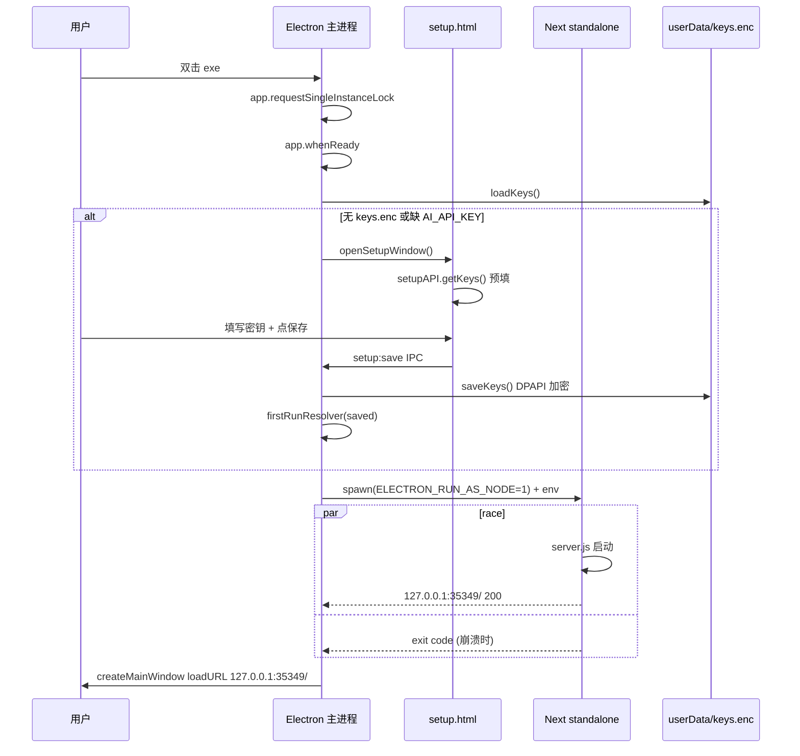
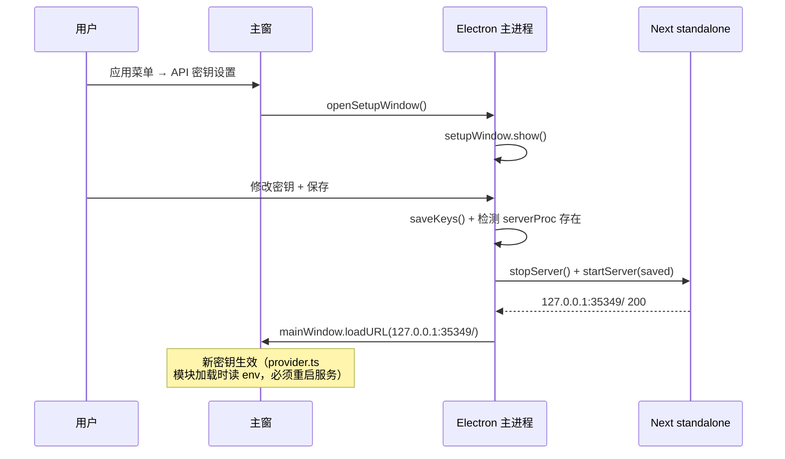

# 桌面端 Electron 深度调研报告

> **调研人**：Agent-D（工程与测试调研员）
> **调研日期**：2026-07-05
> **项目版本**：gailvlun v0.3.1（package.json 标注 0.4.0，桌面版本对齐 README 的 v0.3.1 描述）
> **关联文档**：`electron/README.md`、`docs/sop/06-desktop-packaging-release.md`、`docs/sop/00-infrastructure.md`、`docs/refer/rendering-architecture.md`

## 1. 执行摘要

gailvlun 桌面端采用 **Route A：环境变量注入** 架构——Electron 主进程以 `ELECTRON_RUN_AS_NODE=1` 方式 spawn Next.js standalone server 作为子进程，并注入用户首启填写的 4 个 API 密钥（DPAPI 加密存于 `userData/keys.enc`）。Next.js 应用代码零改动，仅通过 `process.env.*` 读取配置。整个桌面壳仅 5 个文件（`main.js` / `preload.js` / `setup-preload.js` / `setup.html` / `config.js`），核心逻辑集中在 `electron/main.js:1-411`。

构建链路在 `scripts/build-desktop.mjs` 中精心编排：standalone 构建 → robocopy 资源 → 段缓存裁剪 → **pnpm symlink 农场 hoist 为真实文件** → 冒烟测试 → electron-builder 打包 → 打包后断言。两道护栏（`smokeTestStandalone` + `assertPackagedDeps`）和两条 extraResources 是历史血泪教训的固化，**绝不可移除**。

端口固定为 `35349`（`electron/config.js:14`），origin 恒为 `http://127.0.0.1:35349`，是为了保证 IndexedDB / localStorage 在重启后可读——这是"重启后数据全没"问题的根因修复。Electron 42 + Next.js 16 standalone 组合在本项目中实测可用，但有 pnpm symlink、NFT trace 污染、`*.segments` 段缓存膨胀等多个已知坑位需在构建脚本中专门处理。

## 2. 架构总览



桌面端是 **Next.js 应用 + Electron 壳**的组合：

- **主进程**（`electron/main.js`）：负责密钥收集、子进程编排、窗口管理、IPC。
- **子进程**（Next standalone `server.js`）：完整 Next.js 应用，通过 `ELECTRON_RUN_AS_NODE=1` 用 Electron 自带的 Node 运行。
- **preload**（`electron/preload.js`）：仅暴露 `window.desktop = { isElectron, platform }` 只读标记。
- **setup preload**（`electron/setup-preload.js`）：暴露 `setupAPI.getKeys/save/test` 三个 IPC。
- **配置烘焙**（`electron/config.js`）：非密配置（URL、模型名、端口）直接打入 exe。

## 3. 核心机制详解

### 3.1 密钥收集与 DPAPI 加密存储

**核心位置**：`electron/main.js:27-65`

```javascript
const REQUIRED_KEYS = ["AI_API_KEY"];
const KEY_NAMES = ["AI_API_KEY", "MIMO_API_KEY", "ZHIPU_API_KEY", "UNSPLASH_ACCESS_KEY"];
const KEYS_FILE = path.join(app.getPath("userData"), "keys.enc");

function saveKeys(keys) {
  const clean = {};
  for (const k of KEY_NAMES) clean[k] = typeof keys[k] === "string" ? keys[k].trim() : "";
  const json = JSON.stringify(clean);
  const data = safeStorage.isEncryptionAvailable()
    ? safeStorage.encryptString(json)
    : Buffer.from(json, "utf8");
  fs.writeFileSync(KEYS_FILE, data);
  return clean;
}
```

**设计要点**：
1. **4 个密钥，1 个必填**：`AI_API_KEY`（硅基流动）必填，其余 3 个（MiMo / 智谱 / Unsplash）可选——这是"升级补填"故事的基础。
2. **OS DPAPI 加密**：Windows 上用 `safeStorage` API（底层 DPAPI），密钥文件 `keys.enc` 不可手改、不可跨机迁移。
3. **绝不进包**：`keys.enc` 存放于 `userData` 目录（运行时生成），打包产物中绝不存在。
4. **首启阻塞门**：`runFirstRunSetup()`（`main.js:253-269`）在 `app.whenReady` 中 await，未填必填密钥则不开主窗、不启服务。

### 3.2 standalone server 编排

**核心位置**：`electron/main.js:120-183`

```javascript
async function startServer(keys) {
  stopServer();
  serverPort = APP_PORT;
  if (!(await waitPortFree(APP_PORT))) {
    throw new Error(`本地端口 ${APP_PORT} 被其它程序占用...`);
  }
  const dir = standaloneDir();
  const serverJs = path.join(dir, "server.js");
  if (!fs.existsSync(serverJs)) {
    throw new Error(`未找到 standalone server.js：${serverJs}\n请先运行桌面构建。`);
  }
  const env = {
    ...process.env,
    ...BAKED,
    AI_API_KEY: keys.AI_API_KEY || "",
    MIMO_API_KEY: keys.MIMO_API_KEY || "",
    ZHIPU_API_KEY: keys.ZHIPU_API_KEY || "",
    UNSPLASH_ACCESS_KEY: keys.UNSPLASH_ACCESS_KEY || "",
    PORT: String(serverPort),
    HOSTNAME: "127.0.0.1",
    NODE_ENV: "production",
    ELECTRON_RUN_AS_NODE: "1",
  };
  const proc = spawn(process.execPath, [serverJs], { cwd: dir, env, stdio: ["ignore", "pipe", "pipe"] });
  // ... race waitForServer vs earlyExit
}
```

**关键技术决策**：
1. **`ELECTRON_RUN_AS_NODE=1`**：用 Electron 自带 Node 跑 `server.js`，无需额外安装 Node.js——用户机器零依赖。
2. **固定端口 35349**（`config.js:14`）：origin 恒为 `http://127.0.0.1:35349`，IndexedDB / localStorage 可跨重启读回。**注释明确警示：端口一旦发布不可更改**（`main.js:69-72`），否则旧数据被永久孤立。
3. **Racing 启动检测**：`Promise.race([waitForServer(serverPort), earlyExit])`（`main.js:175`）——服务器启动与子进程早退赛跑，崩溃立即暴露 stderr 而非等满 60s 超时。
4. **stderr tail**：保留最后 4000 字符，启动失败时拼接到错误消息，便于诊断（如 `Cannot find module 'next'` 的真实原因）。

### 3.3 IPC 边界与 preload 设计

**主进程 IPC handlers**（`main.js:302-357`）：

| IPC channel | 触发者 | 功能 | 返回 |
|------------|--------|------|------|
| `setup:get-keys` | setup-preload | 读取已存密钥 | `keysObj` |
| `setup:save` | setup-preload | 保存密钥 + 重启服务 + reload 主窗 | `{ ok: true }` 或 `{ ok: false, error }` |
| `setup:test` | setup-preload | 测试密钥连通性（SiliconFlow/MiMo/Unsplash API ping） | `{ AI_API_KEY: { label, status }, ... }` |

**双 preload 设计**：
- **`preload.js`**（主窗，`electron/preload.js:1-11`）：仅暴露 `window.desktop = { isElectron: true, platform }`——主窗是普通 web 页，**无需任何特权桥**，渲染进程通过 fetch 调本机 `127.0.0.1:PORT/api/*` 即可。
- **`setup-preload.js`**（设置窗，`electron/setup-preload.js:1-9`）：暴露 `setupAPI` 三个方法，仅用于密钥管理。

**安全基线**：
- `contextIsolation: true`（`main.js:205, 241`）— 主世界与隔离世界分离。
- `webviewTag: true`（`main.js:207`）— 启用 `<webview>` 标签用于内置浏览器。
- `will-attach-webview` 钩子（`main.js:211-215`）— 强制 webview 禁 node 集成、保持上下文隔离，**嵌入任意站点的安全基线**。
- 外链拦截（`main.js:218-222`）：`http://127.0.0.1` 开头的放行，其余 `shell.openExternal` 走系统浏览器。

### 3.4 BUILD_STANDALONE 开关与 next.config

**核心位置**：`next.config.mjs:6-8`

```javascript
...(process.env.BUILD_STANDALONE === "1"
  ? { output: "standalone", images: { unoptimized: true } }
  : {}),
```

**设计取舍**：
1. **环境变量切换**：仅当 `BUILD_STANDALONE=1` 时启用 standalone 输出 + 关闭图片优化（免 sharp 原生依赖，便于离线打包）。Web/EdgeOne 构建不受影响。
2. **outputFileTracingIncludes**（`next.config.mjs:13-15`）：把 `content/**` 和 `lib/ai/prompts/**` 打进 standalone，让 serverless 运行时读取。
3. **outputFileTracingExcludes**（`next.config.mjs:16-18`）：**307MB 的 `content/.index/` 必须排除**——否则 EdgeOne 复制 standalone 到 `/dev/shm`（64MB）会 ENOSPC。
4. **katex 不可加入 optimizePackageImports**（`next.config.mjs:23` 注释）：因为 `import "katex/contrib/mhchem"` 的副作用依赖单例关系，barrel 优化的深层导入改写会破坏 mhchem 气体箭头等特性。

### 3.5 双护栏构建链路

**核心位置**：`scripts/build-desktop.mjs`

构建脚本按顺序执行 7 个阶段：

```mermaid
flowchart LR
    A[0. 重新生成 script-ids + icon] --> B[0a. 清空 dist-desktop<br/>防 NFT trace 污染]
    B --> C[1. next build<br/>BUILD_STANDALONE=1]
    C --> D[2. robocopy<br/>static + public + content]
    D --> E[2a. 剪除 dist-desktop/.git/manim]
    E --> F[2b. stripSegmentCaches<br/>删除 *.segments/ 段缓存]
    F --> G[2c. materializeNodeModules<br/>pnpm symlink → 真实文件]
    G --> H[2d. smokeTestStandalone<br/>系统 node 起 server 轮询 /]
    H --> I[3. electron-builder --win<br/>portable + nsis]
    I --> J[3b. assertPackagedDeps<br/>验证 node_modules/next 存在]
```



**两道护栏**：
1. **打包前冒烟测试** `smokeTestStandalone()`（`build-desktop.mjs:153-191`）：用系统 `node server.js` 启服并轮询 `/` 期望 HTTP 200，失败即 `exit 1`。能复现"缺/坏 node_modules"问题。
2. **打包后断言** `assertPackagedDeps()`（`build-desktop.mjs:194-201`）：断言 `dist-desktop/win-unpacked/resources/standalone/node_modules/next/package.json` 存在——正是它抓出了 electron-builder 默认剔除 node_modules 这层坑。

### 3.6 pnpm symlink 农场 hoist

**核心位置**：`scripts/build-desktop.mjs:97-126`

这是项目最复杂的修复之一，**不可改回 deref**。

**问题双层**（`build-desktop.mjs:85-96` 注释）：
1. **electron-builder 默认 ignore `!**/node_modules/**`**：会把 `extraResources` 里的 `node_modules` 整个剔除。修复方法：`electron-builder.yml` 加第二条 extraResources，以 `node_modules` 目录自身为 `from`（其相对路径不含 `node_modules` 段，故绕过忽略）。
2. **pnpm 的 standalone node_modules 是符号链接农场**：顶层 `next`/`react` 是指向仓库 `.pnpm` 的绝对 symlink，Windows 复制不可靠。`cpSync(dereference)` 拍平会破坏 pnpm 解析（包依赖在 `.pnpm/<pkg>/node_modules/` 下是兄弟非嵌套，拍平顶层 `next` 后找不到兄弟 `@swc/helpers` → `Cannot find module '@swc/helpers'`）。

**修复方案** `materializeNodeModules()`：
1. 删除顶层 symlink（`next` / `react` / `react-dom` 等）
2. 遍历 `.pnpm/` 下每个包目录，从 `<pkg>/node_modules/<name>` 复制到顶层 `node_modules/<name>` 作为真实文件
3. 删除 `.pnpm/` 整个目录（已扁平化，不再需要）
4. 断言 `node_modules/next/package.json` 存在

最终 node_modules 约 18MB，扁平、可重定位、无 symlink。

## 4. 数据流与调用链路

### 4.1 首次启动时序



### 4.2 设置变更（运行时）时序



## 5. 关键代码路径

| 关注点 | 文件:行号 | 说明 |
|--------|----------|------|
| 密钥加密存储 | `electron/main.js:39-61` | DPAPI 加密，不可手改 |
| 必填密钥检查 | `electron/main.js:63-65` | `hasRequiredKeys()` |
| 端口固定 35349 | `electron/main.js:73` + `electron/config.js:14` | origin 恒定，IndexedDB 可读 |
| standalone 路径 | `electron/main.js:96-100` | 打包/未打包路径不同 |
| 启动 race | `electron/main.js:174-182` | waitForServer vs earlyExit |
| 外链拦截 | `electron/main.js:218-222` | `http://127.0.0.1` 放行，其余系统浏览器 |
| webview 安全钩子 | `electron/main.js:211-215` | 禁 node 集成、保持上下文隔离 |
| 第二实例处理 | `electron/main.js:360-369` | `requestSingleInstanceLock` + `second-instance` 聚焦主窗 |
| 首启阻塞门 | `electron/main.js:253-269` | `firstRunResolver` + 轮询 check |
| 密钥连通性测试 | `electron/main.js:325-357` | 4 个 API 各自 ping /models |
| 双 extraResources | `electron-builder.yml:18-21` | 关键第二条，缺它包内 node_modules 为空 |
| BUILD_STANDALONE 开关 | `next.config.mjs:6-8` | 切到 standalone + 关图片优化 |
| pnpm symlink hoist | `scripts/build-desktop.mjs:97-126` | **不可改回 deref** |
| 冒烟测试 | `scripts/build-desktop.mjs:153-191` | 打包前 server 自启 + HTTP 200 |
| 打包后断言 | `scripts/build-desktop.mjs:194-201` | `node_modules/next/package.json` 存在 |
| 段缓存裁剪 | `scripts/build-desktop.mjs:21-43` | 删除 `*.segments/` 减重 ~278MB |
| NFT trace 污染防护 | `scripts/build-desktop.mjs:232-272` | 清 dist-desktop + 剪 .git/manim |
| 自签名代码签名 | `scripts/build-desktop.mjs:208-219` | 读 `%LOCALAPPDATA%\Gailvlun\codesign.pfx` |
| 镜像加速 | `scripts/build-desktop.mjs:290-295` | `ELECTRON_BUILDER_BINARIES_MIRROR=npmmirror` |

## 6. 设计决策与取舍分析

### 6.1 Route A：环境变量注入 vs. 协议层桥接

**选择**：Electron 主进程在 spawn server 之前注入 env，Next 代码零改动。

**取舍理由**：
- ✅ **Next 应用代码完全无感知**：同一个 standalone 包既可被 Electron spawn，也可被 EdgeOne 调用，也可被 `pnpm start` 直接跑。
- ✅ **密钥不进 Next 构建产物**：避免 webpack/turbopack 把密钥 inline 进 chunk。
- ✅ **运行时改密钥即重启服务**：因 `provider.ts` 在模块加载时读 env（`main.js:54` 注释），无法热替换——重启服务是最简单的方案。
- ❌ **服务进程崩溃即应用死**：比纯静态托管脆弱，但通过 stderr tail + race 检测已能即时反馈。

### 6.2 固定端口 35349 vs. 随机端口

**选择**：固定端口（`config.js:14` 注释明确禁止更改）。

**取舍理由**：
- ✅ **IndexedDB / localStorage 跨重启读回**：随机端口每次 origin 变化，浏览器按新 origin 给一份空存储——这是"重启后对话历史全没"问题的根因。
- ✅ **开发态同源**：`pnpm dev` 也用 `next dev -p 35349`，桌面与网页同 origin。
- ❌ **端口冲突风险**：本机其他程序占用则启动失败——通过 `waitPortFree` + 明确错误消息（`main.js:124-128`）规避，**绝不静默换端口**。

### 6.3 webview 标签 vs. iframe

**选择**：主窗启用 `<webview>` 标签（`main.js:207`），渲染进程通过 `window.desktop.isElectron` 切换内置浏览器从 iframe 到真 webview。

**取舍理由**：
- ✅ **真·全站浏览器**：iframe 受 X-Frame-Options/CSP 限制，webview 是真实 Chromium 视图，可访问几乎任何站点。
- ✅ **OAuth 弹窗正常工作**：`app.on("web-contents-created")` 钩子（`main.js:373-379`）放行 webview 弹出的真实窗口。
- ❌ **安全基线需收紧**：通过 `will-attach-webview` 钩子禁 node 集成 + 删 preload（`main.js:211-215`）。

### 6.4 electron-builder 默认 ignore 与双 extraResources

**选择**：`electron-builder.yml` 用两条 extraResources（standalone + standalone/node_modules）。

**取舍理由**（`electron-builder.yml:13-21` 注释）：
- electron-builder 默认 ignore 含 `!**/node_modules/**`，会把 standalone 自带的 node_modules 整个剔除。
- **第一条**复制 standalone（其内的 node_modules 被默认忽略掉）。
- **第二条**以 `node_modules` 目录自身为 from，相对路径不含 `node_modules` 段，故绕过该忽略，把依赖真实文件复制进去。
- **两条缺一不可**。

### 6.5 不做代码签名（默认）+ 可选自签名

**选择**：默认 unsigned，可选读 `%LOCALAPPDATA%\Gailvlun\codesign.pfx` 自签名。

**取舍理由**（`build-desktop.mjs:203-219`）：
- ✅ 证书与密码不进仓库，避免泄露。
- ✅ 有证书则签，无证书则 unsigned，行为对开发者透明。
- ❌ SmartScreen 拦截 → 用户须点"仍要运行"（README 已说明）。

## 7. 问题清单

| # | 问题描述 | 严重程度 | 涉及文件 | 建议修复方向 |
|---|----------|----------|----------|--------------|
| 1 | 代码签名缺失，SmartScreen 默认拦截 | P1 | `scripts/build-desktop.mjs:208-219` | 接入正式代码签名证书（EV cert 可立即获得 SmartScreen 信誉） |
| 2 | 便携版每次启动解压到 `%TEMP%`，启动慢且脆 | P2 | `electron-builder.yml:30-31` | 推荐安装版（NSIS），便携版仅作离线分发兜底 |
| 3 | macOS / Linux 桌面端未支持 | P2 | `electron-builder.yml:23-29` | electron-builder `target` 仅 win；若要跨平台需扩展 mac/dmg + linux/AppImage + notarization |
| 4 | 主进程 `serverProc.kill()` 未递归杀子进程 | P2 | `electron/main.js:185-192` | Next standalone 内若 spawn 子进程（如 worker），kill 不传播；需 `tree-kill` 或 spawn options `detached: false` |
| 5 | setup.html 是字符串硬编码，未用 React | P3 | `electron/setup.html:1-109` | 维护尚可，但若密钥数增多建议改用 React + 独立 preload 包 |
| 6 | 端口 35349 无 registry，可能与未来其他应用冲突 | P3 | `electron/config.js:14` | 当前通过 `waitPortFree` + 明确错误消息兜底；可考虑 IANA 注册 |
| 7 | `electron/main.js` 是 CommonJS（`require`），与项目 TS 主体不一致 | P3 | `electron/main.js:1-20` | Electron 42 支持 ESM 主进程，但改造成本较高，当前可接受 |
| 8 | `webview` 标签已废弃（Chromium 计划移除） | P3 | `electron/main.js:207` | 长期需迁移到 `BrowserView` 或 `WebContentsView`；中期可保留 |
| 9 | `dist-desktop/win-unpacked/` 体积 ~2GB+，GitHub Release 单文件上限 2GB | P2 | `scripts/build-desktop.mjs:232-272` | 通过 NFT trace 清理 + 段缓存裁剪缓解；超过时需分卷或外部 CDN |
| 10 | Electron 42 + Next.js 16 兼容性：NFT trace 把 dist-desktop 旧产物污染进 standalone | P1 | `scripts/build-desktop.mjs:226-235` | 已通过"构建前清空 dist-desktop"修复，但需在文档中警示未来添加任何 `dist*` 目录的同名风险 |

## 8. 改进建议

### P0 紧急
- 无（核心链路稳定，两道护栏已固化历史教训）

### P1 高优先级
1. **代码签名接入**：申请 OV/EV 代码签名证书，配置 `electron-builder.yml` 的 `win.signtoolOptions`，消除 SmartScreen 拦截。
2. **macOS / Linux 支持**：若要扩大用户群，添加 `mac` / `linux` target，处理 notarization（mac）和 AppImage（linux）。

### P2 中优先级
1. **`serverProc` 树形 kill**：改用 `tree-kill` 包确保子进程组全部退出。
2. **便携版优化**：考虑用 7z 自解压 + 启动器，而非 electron-builder 默认 portable 单文件。
3. **GitHub Release 体积监控**：构建后自动报告 `dist-desktop/*.exe` 大小，超 1.9GB 警示。

### P3 长期改进
1. **主进程迁 ESM**：与项目主体保持一致，便于未来引入 TS 主进程（`electron/main.ts`）。
2. **webview 迁移**：评估迁移到 `WebContentsView`（Electron 22+），避免 Chromium 未来移除 webview 时的破坏。
3. **setup.html 改 React**：若密钥数量增多或要支持 OAuth 流程，考虑用 Vite 单独打包 setup 页。

## 9. 与全自动化平台改造的关系

桌面端是 **gailvlun 全自动化平台的关键交付载体**——所有用户最终通过桌面 exe 使用产品。对平台改造的影响：

### 9.1 内容更新无需重打包

- **content/ 资源可热替换**：桌面端通过 standalone server 读取 `content/`，用户可直接覆盖 `resources/standalone/content/` 更新内容，无需重打包 exe。
- **307MB 向量索引可单独更新**：从 COS 下载到 `content/.index/` 即可，不影响 exe。
- **改进建议**：可增加"内容更新检查"机制，启动时比对 COS 上的 `manifest.version.json`，提示用户更新内容包。

### 9.2 密钥管理已具备用户友好性

- **DPAPI 加密 + 首启设置窗**：用户无需手改 `.env` 文件，已是平台化产品级体验。
- **升级补填**：老用户升级后打开"应用 → API 密钥设置"即可补填新密钥，无需重装。
- **改进建议**：可增加"密钥分享"功能（导入/导出加密 blob，需用户密码解锁），便于多机迁移。

### 9.3 构建链路已高度自动化

- **`pnpm run desktop:build` 一键端到端**：从 next build 到 electron-builder 全自动，两道护栏保证质量。
- **CI 集成**：可在 GitHub Actions 中跑 `desktop:build`，但需注意 Windows runner 体积上限。
- **改进建议**：将 `build-desktop.mjs` 拆分为独立步骤（build / hoist / smoke / package），便于 CI 中缓存中间产物。

### 9.4 跨平台扩展是平台化的瓶颈

- 当前仅 Windows，若要拓展 macOS / Linux 用户群，需投入跨平台适配。
- Electron 42 已支持跨平台，主要工作量在 notarization（mac）和 AppImage（linux）。

### 9.5 与 SOP 06 的对应关系

- 本维度的实现细节已完整记录在 `docs/sop/06-desktop-packaging-release.md` 中，三条不变量（node_modules 双层坑、两道护栏、密钥不进包）是 SOP 06 的核心。
- 平台化改造时，SOP 06 应作为发布流程的强制执行清单，不可跳过任何一步。

## 10. 参考资料

### 项目内文档
- `electron/README.md` — 桌面架构与本地构建/使用说明
- `docs/sop/06-desktop-packaging-release.md` — 桌面打包与 Release 发布 SOP
- `docs/sop/00-infrastructure.md` — 环境变量规范
- `docs/refer/rendering-architecture.md` — 渲染架构（影响 standalone 配置）

### 实现源码
- `electron/main.js` — 主进程（411 行）
- `electron/preload.js` — 主窗 preload（11 行）
- `electron/setup-preload.js` — 设置窗 preload（9 行）
- `electron/setup.html` — 设置页（109 行）
- `electron/config.js` — 烘焙非密配置（30 行）
- `electron-builder.yml` — 打包配置（42 行）
- `scripts/build-desktop.mjs` — 端到端构建（301 行）
- `next.config.mjs` — BUILD_STANDALONE 开关（30 行）

### 外部官方文档
- [Electron safeStorage API](https://www.electronjs.org/docs/latest/api/safe-storage) — DPAPI 加密
- [Electron webviewTag](https://www.electronjs.org/docs/latest/api/webview-tag) — webview 标签
- [electron-builder extraResources](https://www.electronjs.org/docs/latest/tutorial/quick-start) — 打包配置
- [Next.js standalone output](https://nextjs.org/docs/app/api-reference/next-config-js/output) — standalone 模式
