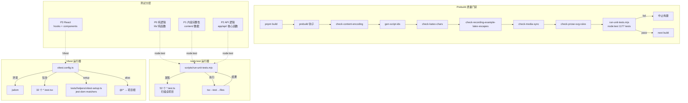
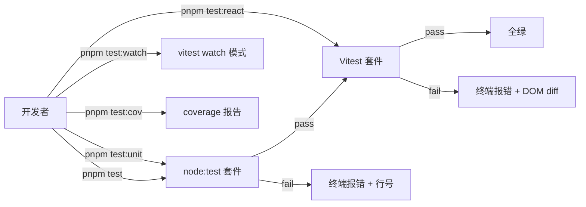
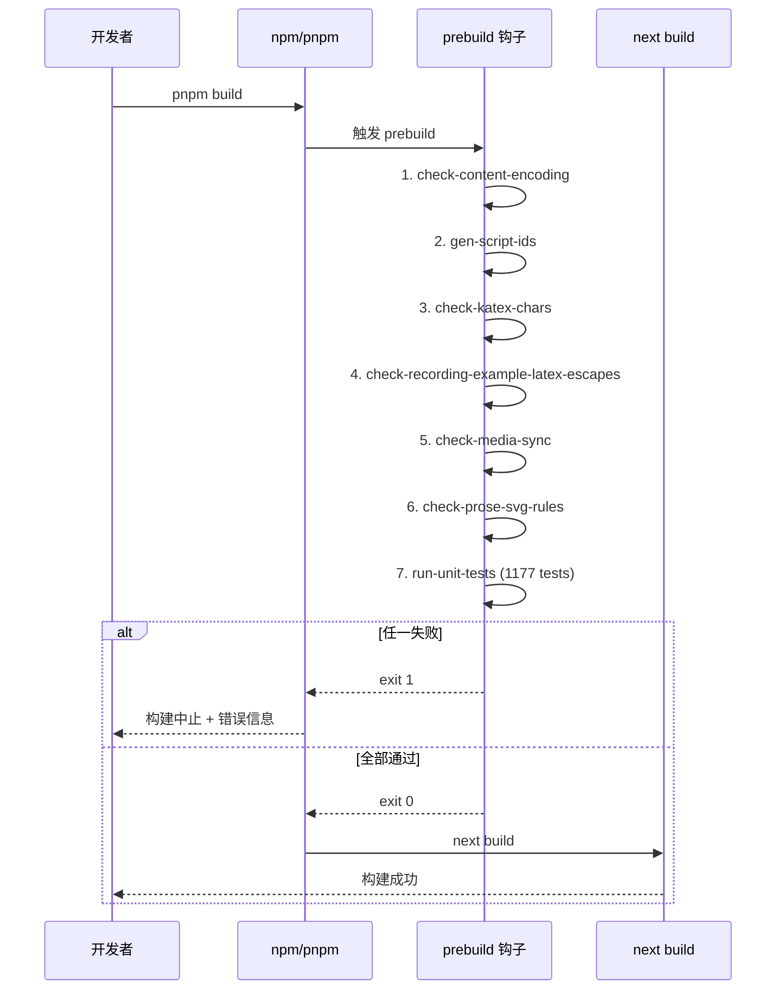

# 测试体系深度调研报告

> **调研人**：Agent-D（工程与测试调研员）
> **调研日期**：2026-07-05
> **项目版本**：gailvlun v0.3.1
> **关联文档**：`docs/sop/07-testing.md`、`docs/refer/rendering-architecture.md`、`vitest.config.ts`、`scripts/run-unit-tests.mjs`
>
> **2026-09 校对说明**（计划 `25`）：第 5 节「未导出函数」表格中 `lib/store.ts`/`lib/quiz-store.ts` 的引用已更新为现网真身路径（`lib/stores/ui.ts`/`lib/stores/quiz.ts`）；`deriveChapterId` 函数已不存在，被 `lib/content/categoryKeys.ts` 的 `deriveActiveKeys` 取代。测试文件数量、目录分布统计（第 3 节等）为 2026-07 快照，未重新统计，如需最新数字请重新跑 `scripts/run-unit-tests.mjs` 与 `pnpm test:react`。

## 1. 执行摘要

gailvlun 项目采用 **node:test + Vitest 双运行器**架构，按"是否需要 DOM"分层：不需要 DOM 的纯逻辑/内容/API 测试用 `node:test`（零依赖、~1s）、需要 DOM/React 的组件测试用 Vitest（jsdom 环境、~2s）。截至本次调研，全项目共 **84 个测试文件**（52 个 `*.test.ts` 走 node:test，32 个 `*.test.tsx` 走 Vitest），分布特点：测试文件与源码同目录（`x.ts` ↔ `x.test.ts`），内容/API 集成测试集中在 `tests/` 目录（16 个文件）。

`prebuild` 钩子（`package.json:12`）链式调用 7 个守卫脚本，最后一步是 `run-unit-tests.mjs`——这意味着任何提交前的 `pnpm build` 都会先跑完整 node:test 套件作为质量门禁，失败即中止构建。Vitest 不在 prebuild 中（jsdom 启动较慢，且 React 组件测试回归在开发阶段更易发现）。

测试设计哲学是**"测行为不测实现、内容测试用真实数据、搜索模块用内存夹具"**——禁止加载真实 307MB 索引或触网/COS。但仍有覆盖盲点：`app/api/` 路由仅有 2 个测试（`can-embed` + `loader`），其余 19 个 API 路由无单元测试；`electron/` 目录完全无测试；`scripts/` 目录的 303 个文件几乎无测试覆盖（仅 `runUnitTestsScript.test.ts` 验证运行器自身的排除规则）。

## 2. 架构总览



## 3. 核心机制详解

### 3.1 双运行器架构与分工

**核心配置**：

| 运行器 | 配置文件 | 测试模式 | 环境 | 用途 |
|--------|---------|---------|------|------|
| node:test | `scripts/run-unit-tests.mjs` | `*.test.ts` | Node 原生 | 纯逻辑/内容/API（P0-P2） |
| Vitest | `vitest.config.ts` | `*.test.tsx` | jsdom | React 组件/hooks（P3） |

**分工铁律**（`docs/sop/07-testing.md:38-42`）：
- 不需要 DOM 的测试 → `node:test`（零依赖、快）
- 需要 DOM/React 的测试 → Vitest（jsdom 环境）
- `*.test.ts` → node:test；`*.test.tsx` → Vitest
- 测试描述用中文，便于定位

### 3.2 node:test 跨平台运行器

**核心位置**：`scripts/run-unit-tests.mjs:1-69`

```javascript
const SKIP_DIRS = new Set([
  "node_modules", ".next", ".git", "build", "dist", "dist-desktop",
  ".codex", ".agents", "manim",
]);
const SKIP_PATH_PREFIXES = ["docs/refer/dist"];

function findTestFiles(dir, out = []) {
  // 递归扫描，跳过 SKIP_DIRS，匹配 *.test.ts 但不匹配 *.test.tsx
  for (const entry of entries) {
    if (entry.isDirectory()) {
      if (shouldSkipDir(next)) continue;
      findTestFiles(next, out);
    } else if (
      entry.name.endsWith(".test.ts") &&
      !entry.name.endsWith(".test.tsx")
    ) {
      out.push(...);
    }
  }
}

const result = spawnSync(
  process.execPath,
  ["--import", "tsx", "--test", ...files],
  { stdio: "inherit", cwd: process.cwd() },
);
process.exit(result.status ?? 1);
```

**设计要点**：
1. **跨平台**：用 Node 内置 `node:test` runner，无需 jest/mocha 依赖。
2. **tsx 处理 TS + 别名**：`--import tsx` 让 TS 文件可直接运行，`tsconfig.json` 的 `@/*` 别名在 node:test 中同样生效。
3. **跳过构建产物**：`SKIP_DIRS` 含 `dist-desktop` / `dist` / `.next` 等，防止扫描打包产物中的重复测试。
4. **`.test.tsx` 排除**：通过 `!entry.name.endsWith(".test.tsx")` 排除 React 测试，避免 node:test 误加载 jsdom 依赖。

### 3.3 Vitest 配置与 jsdom 集成

**核心位置**：`vitest.config.ts:1-18`

```typescript
export default defineConfig({
  resolve: {
    alias: {
      "@": path.resolve(path.dirname(fileURLToPath(import.meta.url))),
    },
  },
  test: {
    environment: "jsdom",
    include: ["**/*.test.tsx"],
    exclude: ["node_modules/**", ".next/**", "build/**", "dist/**", "dist-desktop/**"],
    setupFiles: ["./tests/helpers/vitest-setup.ts"],
    globals: true,
  },
});
```

**设计要点**：
1. **`environment: "jsdom"`**：所有 `*.test.tsx` 自动获得 `document` / `window` 等 DOM API。
2. **`globals: true`**：`describe` / `it` / `expect` / `vi` 全局可用，无需 import。
3. **`setupFiles`**：`tests/helpers/vitest-setup.ts` 仅一行 `import "@testing-library/jest-dom/vitest"`——注入 `toBeInTheDocument()` 等 jest-dom matchers。
4. **`@/*` 别名**：与 `tsconfig.json` 一致，tsx 与 Vitest 共用。
5. **排除构建产物**：与 `run-unit-tests.mjs` 的 `SKIP_DIRS` 对齐，防止扫描 dist-desktop 中的测试。

### 3.4 React Testing Library 集成

**典型用法**（参考 `components/chat/MessageContent.test.tsx` 等）：

```typescript
import { describe, it, expect, vi } from "vitest";
import { render, screen } from "@testing-library/react";
import userEvent from "@testing-library/user-event";

vi.mock("@/components/ComplexChild", () => ({
  default: ({ children }) => <span>{children}</span>,
}));

describe("MyComponent", () => {
  it("渲染", () => {
    render(<MyComponent />);
    expect(screen.getByText("Hello")).toBeInTheDocument();
  });
});
```

**最佳实践**（`docs/sop/07-testing.md:80-87`）：
- `vi.mock` 隔离复杂子组件（如 QuizMarkdown 拉入 react-markdown/katex 链）
- 状态变更需包在 `act()` 中
- `userEvent.setup()` 模拟真实用户交互（推荐优于 `fireEvent`）
- `@testing-library/jest-dom` 提供 `toBeInTheDocument()` 等 matchers

### 3.5 测试覆盖范围分析

**84 个测试文件分布**（去除 node_modules / .next / dist-desktop）：

| 目录 | .test.ts | .test.tsx | 总计 | 主要内容 |
|------|----------|-----------|------|----------|
| `tests/` | 9 | 0 | 9 | 顶层集成测试（context/globalSearch/sessionTitle/window 等） |
| `tests/api/` | 2 | 0 | 2 | can-embed iframe 判定 + content loader 路径 |
| `tests/content/` | 4 | 0 | 4 | manifest 结构 + quiz JSON 完整性 + 录音例题 LaTeX |
| `tests/helpers/` | 0 | 0 | 0 | 仅 vitest-setup.ts（非测试） |
| `lib/ai/` | 8 | 0 | 8 | artifact/models/provider/tools/imageSearch/imageUtils/upstream + search/3 个 |
| `lib/chat/` | 2 | 2 | 4 | buildRequestMessages + streamUiThrottle + canvasBlockPatch + parseChatContent |
| `lib/markdown/` | 4 | 0 | 4 | remarkDirectives + remarkSoftBreaks + normalizeDirectiveLabels + calloutTypes |
| `lib/hooks/` | 1 | 8 | 9 | useChatHistory.lifecycle + 8 个 .tsx（useChatUI/useTheme 等） |
| `lib/canvas/` | 0 | 3 | 3 | normalize + plot + revisionOutput |
| `lib/storage/` | 2 | 0 | 2 | idbStorage + chatStorage.migrate |
| `lib/quiz/` | 1 | 0 | 1 | types |
| `lib/utils/` | 2 | 1 | 3 | skillFrontmatter + sseEvents + xmlParser |
| `lib/keyboard/` | 3 | 0 | 3 | match + useKeyboardSettings + windowActions |
| `lib/constants/` | 2 | 0 | 2 | prompts + subjects |
| `lib/chemistry/` | 1 | 0 | 1 | svgTemplates |
| `lib/content/` | 1 | 0 | 1 | poster |
| `lib/context/` | 1 | 0 | 1 | estimateTokens |
| `lib/svg/` | 0 | 1 | 1 | svgHealth |
| `lib/` (根) | 4 | 0 | 4 | motion + quiz-progress + quiz-store + store（2026-09：`quiz-store.ts`/`store.ts` 物理文件仍存在，但内容已收缩为 1 行 `@deprecated` 转发壳，真身分别在 `lib/stores/quiz.ts` / `lib/stores/ui.ts`；测试文件数量为 2026-07 快照，未重新统计） |
| `lib/review/` | 1 | 0 | 1 | startRecord |
| `lib/theme/` | 1 | 0 | 1 | appearance |
| `components/chat/` | 0 | 7 | 7 | FollowUpQuestions + ChatEmptyState + ProcessingSteps + MessageContent + MessageContent.think + ThinkingMenu + ChatInput.thinking + ChatThread.virtual |
| `components/canvas/` | 0 | 5 | 5 | CanvasBlockRenderer + CanvasFrame + CanvasRevisionPanel + FunctionPlot + RawSvgViewer |
| `components/layout/` | 0 | 1 | 1 | GlobalSettings |
| `components/quiz/` | 0 | 1 | 1 | QuizMarkdown |
| `components/visualizations/primitives/` | 0 | 1 | 1 | FormulaSteps |
| `components/window/` | 0 | 1 | 1 | WindowChrome |
| **合计** | **52** | **32** | **84** | |

### 3.6 prebuild 钩子作为质量门禁

**核心位置**：`package.json:12`

```json
"prebuild": "node scripts/check-content-encoding.mjs && node scripts/gen-script-ids.mjs && node scripts/check-katex-chars.mjs && node scripts/check-recording-example-latex-escapes.mjs && node scripts/check-media-sync.mjs && node scripts/check-prose-svg-rules.mjs && node scripts/run-unit-tests.mjs"
```

**执行顺序与职责**：

| 顺序 | 脚本 | 职责 | 失败条件 |
|------|------|------|----------|
| 1 | `check-content-encoding.mjs` | 校验 content/ 与 lib/ai/prompts/ 的 .md 文件均为合法 UTF-8 | 发现非法 UTF-8 字节 |
| 2 | `gen-script-ids.mjs` | 从 media.scripts.generated.ts 提取讲稿 id 清单 | 找不到源文件（仅警告，不失败） |
| 3 | `check-katex-chars.mjs` | 检查 \text{} 内是否有 KaTeX 不支持的字符（emoji/Unicode 上下标） | 发现违规字符 |
| 4 | `check-recording-example-latex-escapes.mjs` | 检查录音例题 LaTeX 转义是否损坏（裸宏、控制字符） | 发现转义问题 |
| 5 | `check-media-sync.mjs` | 校验 media.*.generated.ts 中视频 src 在 public/ 下存在 | 发现 stale 条目（仅本地有视频时） |
| 6 | `check-prose-svg-rules.mjs` | 拦截会压坏 KaTeX svg 的危险 CSS 规则 | 发现 `.prose-notes svg { height/margin }` 类规则 |
| 7 | `run-unit-tests.mjs` | 跑完整 node:test 套件（52 个文件 / 1177 个测试） | 任意测试失败 |

**失败处理**：`&&` 链式调用，任一脚本退出码非 0 即中止后续步骤与 `next build`。

## 4. 数据流与调用链路

### 4.1 测试执行流（开发态）



### 4.2 测试执行流（构建态）



## 5. 关键代码路径

### 5.1 测试运行器配置

| 关注点 | 文件:行号 | 说明 |
|--------|----------|------|
| node:test 跳过目录 | `scripts/run-unit-tests.mjs:10-20` | 含 dist-desktop 防止扫描打包产物 |
| node:test 测试发现 | `scripts/run-unit-tests.mjs:32-52` | 递归扫描，匹配 `*.test.ts` 排除 `*.test.tsx` |
| node:test 执行 | `scripts/run-unit-tests.mjs:62-67` | `spawnSync(node, [--import, tsx, --test, ...files])` |
| Vitest 环境 | `vitest.config.ts:12` | `environment: "jsdom"` |
| Vitest 包含模式 | `vitest.config.ts:13` | `include: ["**/*.test.tsx"]` |
| Vitest 排除 | `vitest.config.ts:14` | 排除 node_modules/.next/build/dist/dist-desktop |
| Vitest setup | `vitest.config.ts:15` + `tests/helpers/vitest-setup.ts:1` | 注入 jest-dom matchers |
| Vitest globals | `vitest.config.ts:16` | `describe`/`it`/`expect`/`vi` 全局可用 |
| 别名 `@/*` | `vitest.config.ts:7-9` + `tsconfig.json` | tsx 与 Vitest 共用 |

### 5.2 典型测试范式

**纯逻辑测试**（`lib/ai/search/bm25Store.test.ts`）：

```typescript
import assert from "node:assert/strict";
import { test } from "node:test";
import { tokenize } from "@/lib/ai/search/bm25Store";

test("tokenize 中文 bigram + 英文小写", () => {
  assert.deepEqual(tokenize("Hello 世界"), ["hello", "世", "世界", "界"]);
});
```

**内容完整性测试**（`tests/content/quiz.test.ts:33-146`）：

```typescript
const quizFiles = findQuizFiles(QUIZ_ROOT);

test("quiz 目录下存在 JSON 文件", () => {
  assert.ok(quizFiles.length > 0);
});

for (const file of quizFiles) {
  test(`${rel}：每题字段合法`, () => {
    const data = JSON.parse(readFileSync(file, "utf8")) as QuizData;
    // ... 校验 id/type/points/stem 等
  });
}
```

**API 逻辑测试**（`tests/api/can-embed.test.ts`）：

```typescript
import { judge } from "@/app/api/can-embed/route";

test("judge：X-Frame-Options DENY 不可嵌入", () => {
  const h = new Headers({ "x-frame-options": "DENY" });
  assert.equal(judge(h).embeddable, false);
});
```

**React 组件测试**（`components/chat/FollowUpQuestions.test.tsx`）：

```typescript
import { describe, it, expect, vi } from "vitest";
import { render, screen } from "@testing-library/react";
import FollowUpQuestions from "./FollowUpQuestions";

describe("FollowUpQuestions", () => {
  it("渲染追问按钮", () => {
    render(<FollowUpQuestions questions={["q1", "q2"]} />);
    expect(screen.getByText("q1")).toBeInTheDocument();
  });
});
```

**源码静态分析测试**（`tests/contextTruncationPolicy.test.ts:58-86`）：

```typescript
test("chat route uses last user message, selected model context manager", () => {
  const source = readWorkspaceFile("app/api/chat/route.ts");
  assert.match(source, /reverse\(\)\.find\(\(m\) => m\.role === "user"\)/);
  assert.match(source, /getContextManager\(options\.contextMode \?\? "full", effectiveModelId\)/);
});
```

### 5.3 可测性改造

部分源码内部函数未导出，需添加 `export` 才能单测（`docs/sop/07-testing.md:184-194`）：

| 文件 | 导出的函数 | 原因 |
|------|-----------|------|
| `lib/ai/artifact.ts` | `stripFences`、`extractHtml`、`finalizeHtml` | HTML 修复逻辑 |
| `lib/ai/search/bm25Store.ts` | `tokenize` | 分词逻辑 |
| `lib/ai/search/vectorStore.ts` | `cosineSimilarity` | 相似度计算 |
| `lib/ai/search/hybridSearch.ts` | `rrfMerge` | RRF 合并 |
| `app/api/can-embed/route.ts` | `judge` | iframe 嵌入判定 |
| `lib/content/categoryKeys.ts`（2026-09 现网；原 `lib/store.ts` 的内部函数 `deriveChapterId` 已不存在，被 `deriveActiveKeys` 取代，由 `lib/stores/ui.ts` 的 `setActiveRoute` 调用） | `deriveActiveKeys` | quiz / 视频 / 交互 tab 的查找 key 推导（按板块 capabilities + keyStrategy） |
| `lib/stores/quiz.ts`（原 `lib/quiz-store.ts`） | `buildAttempt` | 作答记录构造 |

## 6. 设计决策与取舍分析

### 6.1 双运行器 vs. 单一 Vitest

**选择**：node:test + Vitest 并存。

**取舍理由**：
- ✅ **node:test 零依赖、启动快**：~1s 跑完 1177 个测试，适合 prebuild 高频触发。
- ✅ **Vitest 生态成熟**：jsdom + RTL + jest-dom 一站式 React 测试。
- ✅ **职责清晰**：纯逻辑走 node:test，DOM 走 Vitest，按文件后缀自动分发。
- ❌ **两套配置维护**：需保证 `SKIP_DIRS` 与 Vitest `exclude` 对齐（已有 `runUnitTestsScript.test.ts` 守卫）。
- ❌ **TS 别名需双重配置**：tsx 与 Vitest 各自解析 `@/*`。

### 6.2 测试文件同目录 vs. 集中

**选择**：单元测试与源码同目录（`x.ts` ↔ `x.test.ts`），内容/API 集成测试集中在 `tests/`。

**取舍理由**：
- ✅ **就近修改**：改源码时相邻的测试文件提醒同步更新。
- ✅ **内容测试隔离**：`tests/content/` 集中扫描真实数据，不污染源码目录。
- ❌ **`tests/` 与 `lib/` 双轨**：开发者需记住两类测试的位置约定。

### 6.3 prebuild 跑 node:test 不跑 Vitest

**选择**：prebuild 仅 `run-unit-tests.mjs`，不跑 Vitest。

**取舍理由**（`docs/sop/07-testing.md:103`）：
- ✅ **Vitest 启动较慢**：jsdom 初始化 ~2s，prebuild 高频触发时影响体验。
- ✅ **React 组件测试回归在开发阶段更易发现**：开发者写组件时会手动跑 `pnpm test:react`。
- ❌ **构建前不验证 React**：极端情况下组件测试失败但构建仍成功——通过文档提示开发者手动跑 `pnpm test` 弥补。

### 6.4 内容测试用真实数据 vs. mock

**选择**：quiz/manifest 测试扫描 `content/` 真实文件。

**取舍理由**（`docs/sop/07-testing.md:225`）：
- ✅ **防内容回归**：真实数据能抓到 JSON schema 漂移、字段缺失等问题。
- ✅ **零夹具维护**：无需手动维护 mock 数据。
- ❌ **测试随内容增长变慢**：当前 quiz 文件数尚可接受；若超 1000 个文件需考虑分片。
- ❌ **测试依赖内容存在**：CI 中需保证 `content/` 完整。

### 6.5 搜索模块用内存夹具

**选择**：禁止加载真实 307MB 索引或触网/COS。

**取舍理由**（`docs/sop/07-testing.md:226`）：
- ✅ **测试速度快**：内存夹具 < 100ms。
- ✅ **无外部依赖**：CI 无需 COS 凭证，无网络波动。
- ❌ **夹具可能与真实索引漂移**：需定期用真实数据跑回归（手动）。

## 7. 问题清单

| # | 问题描述 | 严重程度 | 涉及文件 | 建议修复方向 |
|---|----------|----------|----------|--------------|
| 1 | `app/api/` 仅 2 个测试（can-embed + loader），其余 19 个 API 路由无单测 | P1 | `app/api/` 全部路由 | 优先补 `chat/route.ts`、`artifact/route.ts`、`image-gen/route.ts`、`quiz/route.ts` 的核心逻辑测试 |
| 2 | `electron/` 目录完全无测试，桌面端关键逻辑（密钥加密、端口检测、IPC）无回归保障 | P1 | `electron/main.js` 等 | 用 Vitest 隔离测试纯函数（如 `hasRequiredKeys`、`pkgNameFromPnpmDir`） |
| 3 | `scripts/` 303 个文件几乎无测试覆盖 | P2 | `scripts/` 全部 | 优先补 `build-desktop.mjs` 的 `materializeNodeModules` / `smokeTestStandalone` / `assertPackagedDeps` 单测 |
| 4 | `tests/performance/` 目录为空（仅占位） | P2 | `tests/performance/` | 按 SOP 07 §性能冒烟实现自动化性能测试 |
| 5 | `pnpm test:cov` 配置存在但覆盖率阈值未设定 | P2 | `package.json:27` | 添加 `vitest.config.ts` 的 `coverage.thresholds`，CI 中强制 |
| 6 | Vitest 不在 prebuild 中，React 回归可能漏过构建 | P2 | `package.json:12` | 评估在 CI 中跑全量 `pnpm test`，prebuild 保持现状 |
| 7 | `tests/helpers/vitest-setup.ts` 仅一行 jest-dom import | P3 | `tests/helpers/vitest-setup.ts` | 可扩展：全局 mock `window.matchMedia`、`IntersectionObserver` 等 |
| 8 | 测试描述用中文，但部分源码静态分析测试（如 `customProviderCompatibility.test.ts`）依赖正则匹配源码字符串，脆弱 | P2 | `tests/customProviderCompatibility.test.ts` 等 | 重构为调用导出函数测试行为，而非源码字符串匹配 |
| 9 | 无 E2E 测试（Playwright/Cypress） | P2 | 全项目 | 关键用户流（启动 → 填密钥 → 内容浏览 → AI 对话 → 题库）应补 E2E |
| 10 | `node:test` 的 `spawnSync` 一次性跑所有文件，无法增量 | P3 | `scripts/run-unit-tests.mjs:62-67` | 可用 `--test-only` + 文件参数支持增量，或迁移到 `node --test --watch` |

## 8. 改进建议

### P0 紧急
- 无（当前测试体系已覆盖核心逻辑，prebuild 门禁有效）

### P1 高优先级
1. **补 API 路由测试**：`app/api/chat/route.ts` 是 AI 对话核心，应有完整单测覆盖模型选择、工具调用、流式响应。
2. **补 Electron 测试**：`electron/main.js` 的 `hasRequiredKeys`、`pkgNameFromPnpmDir`、`standaloneDir` 等纯函数应可单测。
3. **设定覆盖率阈值**：`vitest.config.ts` 添加 `coverage: { thresholds: { lines: 70, branches: 60 } }`，CI 中强制。

### P2 中优先级
1. **补 `scripts/build-desktop.mjs` 测试**：`materializeNodeModules` / `smokeTestStandalone` 是关键护栏，应有单测。
2. **E2E 测试框架接入**：Playwright + Electron，覆盖首启填密钥 → 内容浏览 → AI 对话关键流。
3. **源码静态分析测试重构**：将 `tests/customProviderCompatibility.test.ts` 等改为行为测试。
4. **`tests/performance/` 落地**：按 SOP 07 §性能冒烟实现自动化。

### P3 长期改进
1. **增量测试**：支持 `pnpm test:unit --filter` 仅跑变更文件相关的测试。
2. **vitest-setup 扩展**：全局 mock `matchMedia` / `IntersectionObserver` / `ResizeObserver` 等。
3. **测试报告可视化**：CI 中生成 HTML 报告，便于追踪覆盖率趋势。

## 9. 与全自动化平台改造的关系

测试体系是 **全自动化平台改造的质量保障基石**——任何自动化改动都必须通过 prebuild 门禁。

### 9.1 内容生产自动化的测试保障

- **`tests/content/quiz.test.ts`** 自动扫描所有 quiz JSON，是 SOP 04 题目生成的质量门禁。
- **`tests/content/manifest.test.ts`** 校验 contentTree 结构，是 SOP 05 集成的质量门禁。
- **`tests/api/loader.test.ts`** 校验路径解析，保障 AI 工具 `getCurrentPage` 数据源。

### 9.2 平台化改造的测试扩展建议

1. **CI 集成**：将 `pnpm test` 纳入 GitHub Actions，PR 合并前必须全绿。
2. **覆盖率监控**：Codecov / Coveralls 集成，追踪覆盖率趋势。
3. **内容回归测试**：每个 SOP 自动化产出后自动跑 `tests/content/` 套件。
4. **E2E 冒烟**：桌面 exe 构建后自动跑 Playwright 冒烟测试（首启 → 填密钥 → 主窗加载）。

### 9.3 SOP 07 的对应关系

- 本维度已完整记录在 `docs/sop/07-testing.md` 中，定义了 P0-P3 测试分层与命名约定。
- 平台化改造时，SOP 07 应作为新功能开发的强制执行清单：每个新模块必须伴随 `.test.ts` 或 `.test.tsx`。

## 10. 参考资料

### 项目内文档
- `docs/sop/07-testing.md` — 测试体系 SOP
- `docs/refer/rendering-architecture.md` — Markdown 渲染架构（影响内容测试）
- `vitest.config.ts` — Vitest 配置
- `scripts/run-unit-tests.mjs` — node:test 运行器
- `tsconfig.json` — 路径别名 `@/*`
- `package.json` — test 脚本

### 实现源码
- `scripts/run-unit-tests.mjs` — node:test 跨平台运行器（69 行）
- `vitest.config.ts` — Vitest 配置（18 行）
- `tests/helpers/vitest-setup.ts` — Vitest setup（1 行）
- `tests/runUnitTestsScript.test.ts` — 运行器自身守卫
- `tests/api/can-embed.test.ts` — API 判定逻辑测试范例
- `tests/content/quiz.test.ts` — 内容完整性测试范例
- `tests/contextTruncationPolicy.test.ts` — 源码静态分析测试范例
- `components/chat/FollowUpQuestions.test.tsx` — React 组件测试范例

### 外部官方文档
- [node:test](https://nodejs.org/api/test.html) — Node.js 内置测试运行器
- [Vitest](https://vitest.dev/) — Vue/Vite 生态测试框架
- [React Testing Library](https://testing-library.com/docs/react-testing-library/intro/) — React 组件测试
- [jest-dom matchers](https://github.com/testing-library/jest-dom) — DOM 断言扩展
- [jsdom](https://github.com/jsdom/jsdom) — Node.js 中的 DOM 实现
