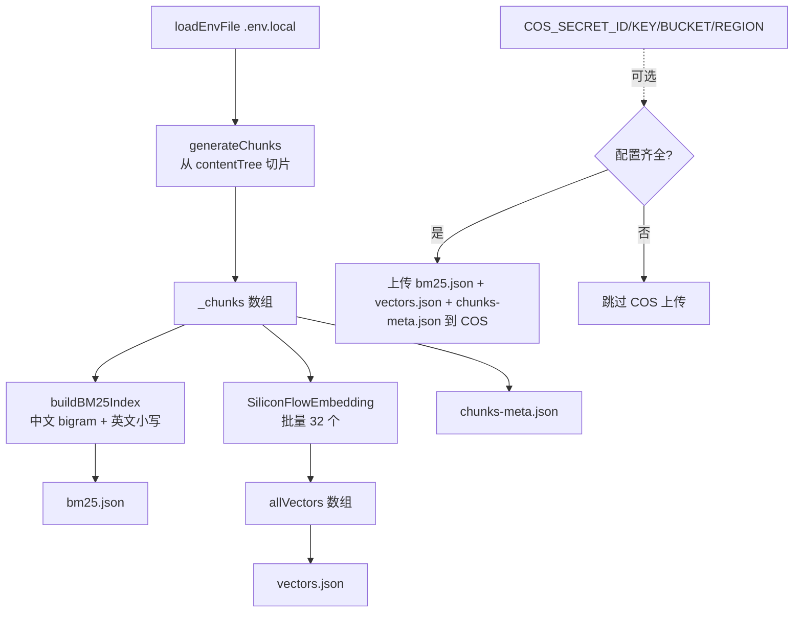
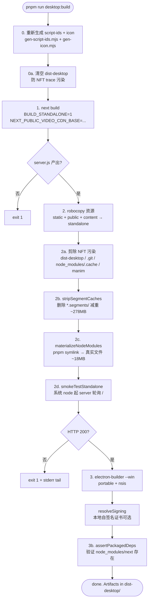
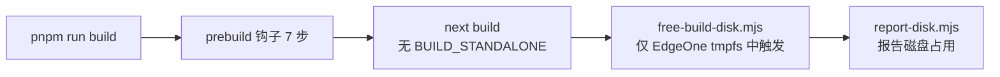

# 构建与脚本体系深度调研报告

> **调研人**：Agent-D（工程与测试调研员）
> **调研日期**：2026-07-05
> **项目版本**：gailvlun v0.3.1
> **关联文档**：`docs/sop/06-desktop-packaging-release.md`、`docs/sop/00-infrastructure.md`、`docs/refer/rendering-architecture.md`、`next.config.mjs`、`package.json`

## 1. 执行摘要

gailvlun 项目根目录的 `scripts/` 目录共 **298 个文件**（不含 `__pycache__`），按扩展名分布：64 个 jpg / 48 个 png / 44 个 md / 29 个 mjs / 28 个 py / 22 个 txt / 19 个 ts / 15 个 pdf / 14 个 log / 8 个 js / 4 个 json / 2 个 html / 1 个 ps1。其中可执行脚本（mjs + ts + py + js）约 **84 个**，按用途分为 6 大类：**守卫（check-*）、生成（gen-*）、构建（build-*）、修复（fix-*）、内容处理（process/convert/split/rewrite）、容灾降级（fallback-*）**。

构建体系的核心是 **prebuild 钩子链**（`package.json:12`），串行调用 7 个脚本作为质量门禁：`check-content-encoding → gen-script-ids → check-katex-chars → check-recording-example-latex-escapes → check-media-sync → check-prose-svg-rules → run-unit-tests`。每个守卫解决一类历史踩坑，任一失败即中止 `next build`。

`scripts/build-desktop.mjs` 是桌面端端到端构建编排（301 行），核心难点是处理 pnpm symlink 农场 hoist、Next 16 NFT trace 污染、`*.segments` 段缓存膨胀。`scripts/build-index.ts` 是离线索引构建（307MB 向量索引 + BM25 倒排），调用 SiliconFlow Embedding API 批量生成向量并可选上传 COS。

脚本体系的最大特点是 **"历史血泪教训的代码化"**——每个 check-* / fix-* 脚本的注释都明确记录了它解决的问题、根因分析、失败条件。这使脚本不仅是工具，更是项目知识库。但 303 个文件的组织较松散，无明确的分类目录（仅 `content/` `archive/` `media/` `handoffs/` `logs/` `pdf_extracts/` `transcripts/` `workflows/` `temp/` 子目录），大量脚本散落在根目录，可维护性有改进空间。

## 2. 架构总览

```mermaid
flowchart TB
    subgraph "scripts/ 目录组织（298 文件）"
        Root["根目录脚本<br/>~250 个 .mjs/.ts/.py/.js"]
        Content["content/<br/>4 个内容处理脚本"]
        Archive["archive/<br/>12 个归档历史脚本"]
        Media["media/<br/>2 个媒体处理脚本"]
        Handoffs["handoffs/<br/>2 个交接文档"]
        Logs["logs/<br/>构建日志"]
        PdfExtracts["pdf_extracts/<br/>PDF 解析中间产物"]
        Transcripts["transcripts/<br/>飞书录音纪要原文"]
        Workflows["workflows/<br/>2 个 workflow.js"]
        Temp["temp/<br/>临时文件"]
    end

    subgraph "脚本分类（按用途）"
        Guard["守卫类 check-*<br/>7 个：encoding/katex-chars/media-sync/prose-svg/latex-escape 等"]
        Gen["生成类 gen-*<br/>~15 个：script-ids/nav-manifest/icon/maogai-quiz/physics-exercises/rec 等"]
        Build["构建类 build-*<br/>2 个：build-desktop.mjs/build-index.ts"]
        Fix["修复类 fix-*<br/>~13 个：math-entities/math-fences/quiz-json/bare-directive-labels 等"]
        Process["内容处理类<br/>~20 个：process-maogai/split-modern-history/convert-maogai/rewrite-maogai 等"]
        Fallback["容灾降级类 fallback-*<br/>3 个：pdf/pptx/docx"]
    end

    Root --> Guard
    Root --> Gen
    Root --> Build
    Root --> Fix
    Root --> Process
    Root --> Fallback
    Content --> Process
```



## 3. 核心机制详解

### 3.1 prebuild 钩子链完整流程

**核心位置**：`package.json:12`

```json
"prebuild": "node scripts/check-content-encoding.mjs && node scripts/gen-script-ids.mjs && node scripts/check-katex-chars.mjs && node scripts/check-recording-example-latex-escapes.mjs && node scripts/check-media-sync.mjs && node scripts/check-prose-svg-rules.mjs && node scripts/run-unit-tests.mjs"
```

**7 个脚本职责详解**：

| # | 脚本 | 职责 | 扫描范围 | 失败条件 | 历史根因 |
|---|------|------|----------|----------|----------|
| 1 | `check-content-encoding.mjs` | 校验 .md 文件为合法 UTF-8 | `content/` + `lib/ai/prompts/` | 发现非法 UTF-8 字节 | Windows GBK 管道把中文尾字节替换为 `?`，导致 `:::`/`$$` 围栏坍塌 |
| 2 | `gen-script-ids.mjs` | 生成讲稿 id 清单 | `lib/content-data/media.scripts.generated.ts` | 找不到源文件（仅警告） | 388KB 讲稿本体不应打进首屏 chunk，仅生成 id 清单 |
| 3 | `check-katex-chars.mjs` | 检查 `\text{}` 内不支持字符 | `content/` 下 .md（排除 `_raw/`） | 发现 emoji / Unicode 上下标 | KaTeX Main-Regular 字体不支持，渲染为方框 |
| 4 | `check-recording-example-latex-escapes.mjs` | 检查录音例题 LaTeX 转义 | `content/examples/physics/recording/` | 发现裸宏 `\frac` 等 / 控制字符 U+000B/C/D | JS 字符串转义吞掉 LaTeX 反斜杠 |
| 5 | `check-media-sync.mjs` | 校验视频 src 文件存在 | 3 个 `media.*.generated.ts` | 本地有视频时发现 stale 条目（无视频时跳过） | render.py 删除视频后未重新生成清单 |
| 6 | `check-prose-svg-rules.mjs` | 拦截危险 CSS 规则 | `app/styles/*.css` | `.prose-notes svg { height/margin }` 类规则 | 裸 svg 规则覆盖 KaTeX 的 `.katex svg{height:inherit}` |
| 7 | `run-unit-tests.mjs` | 跑 node:test 套件 | 全项目 `*.test.ts` | 任意测试失败 | 见维度 12 测试体系报告 |

**执行顺序的意义**：
- **1-2 是内容准备**：先确保编码正确、生成 derived 资产。
- **3-6 是内容守卫**：在 `next build` 之前拦截内容层面的破坏。
- **7 是逻辑守卫**：最后跑 1177 个测试，确保代码逻辑正确。

**失败处理**：`&&` 链式调用，任一脚本退出码非 0 即中止后续步骤与 `next build`。

### 3.2 303 个脚本的组织结构

**目录分布**：

| 目录 | 文件数 | 主要内容 |
|------|--------|----------|
| `scripts/`（根） | ~76 | 守卫、生成、构建、修复、内容处理脚本 |
| `scripts/archive/` | 12 | 归档的历史脚本（fix_svg.py / process_recording.py 等） |
| `scripts/content/` | 4 | 内容处理：extract-docx-images / extract-docx-text / extract-gangyao-docx / generate-maogai-mock-set02 |
| `scripts/handoffs/` | 2 | 交接文档（HANDOFF-artifact-streaming-debug.md / HANDOFF-performance-strong-model-review.md） |
| `scripts/logs/` | ~14 | 构建日志（01.md - 03.md / buildS3.log - buildS4.log 等） |
| `scripts/media/` | 2 | 媒体处理：gen-posters.mjs / upload-videos-cos.mjs |
| `scripts/pdf_extracts/` | 多文件 | PDF 解析中间产物（unit5/unit6/unit7 等） |
| `scripts/transcripts/` | 多文件 | 飞书录音纪要原文（.pdf） |
| `scripts/workflows/` | 2 | Workflow 编排：generate-all-chapters / generate-chapter |
| `scripts/temp/` | 多文件 | 临时文件（logo-gallery / maogai-textbook / modern-history-textbook） |
| `scripts/__pycache__/` | - | Python 缓存（应 gitignore） |

**按扩展名统计**（去除 `__pycache__`）：

| 扩展名 | 数量 | 主要用途 |
|--------|------|----------|
| .jpg | 64 | AI 图片生成产物 / 教材插图 |
| .png | 48 | 教材插图 / 临时页面截图 |
| .md | 44 | 日志 / 交接 / 文档 |
| .mjs | 29 | Node.js ES Module 脚本（主流） |
| .py | 28 | Python 脚本（出题 / 渲染 / 解析） |
| .txt | 22 | 文本中间产物（project-introduction.txt 等） |
| .ts | 19 | TypeScript 脚本（build-index / gen-nav 等） |
| .pdf | 15 | 飞书纪要原文 / 解析输入 |
| .log | 14 | 构建日志 |
| .js | 8 | CommonJS 脚本（fix-ch03 / fix-ch08 等） |
| .json | 4 | 配置 |
| .html | 2 | 临时 HTML（logo-gallery） |
| .ps1 | 1 | PowerShell（count_words.ps1） |

**按用途分类**：

1. **守卫类（7 个）**：`check-content-encoding` / `check-katex-chars` / `check-maogai-textbook-syntax` / `check-media-sync` / `check-physics-recording-quiz-quality` / `check-prose-svg-rules` / `check-recording-example-latex-escapes`
2. **生成类（~15 个）**：`gen-script-ids` / `gen-nav-manifest` / `gen-icon` / `gen-maogai-quiz-*` / `gen-physics-exercises-*` / `gen-rec-*` / `gen_maogai_quiz_*` / `gen_rec_quiz_*` / `gen_unit5_main` / `generate-maogai-examples` / `generate-physics-ch01-04-examples`
3. **构建类（2 个）**：`build-desktop.mjs` / `build-index.ts`
4. **修复类（~13 个）**：`fix-bare-directive-labels` / `fix-ch03` / `fix-ch08` / `fix-headings-maogai-textbook` / `fix-katex-circled-numbers` / `fix-maogai-quotes` / `fix-math-entities` / `fix-math-fences` / `fix-quiz-json` / `fix-quiz-json-v2` / `fix-section-headings` / `cleanup-noise-lines`
5. **内容处理类（~20 个）**：`process-maogai-textbook` / `process-modern-history-textbook` / `postprocess-maogai-textbook` / `postprocess-modern-history-textbook` / `split-maogai-textbook` / `split-modern-history-textbook` / `convert-maogai-textbook` / `rewrite-maogai-textbook-notes` / `fill-maogai-example-answers` / `transform-modern-history-textbook` 等
6. **容灾降级类（3 个）**：`fallback-pdf.py` / `fallback-pptx.py` / `fallback-docx.py`
7. **辅助类**：`free-build-disk.mjs` / `report-disk.mjs` / `verify-models.ts` / `parse-docs.ts` / `extract_units.py` / `propagate-images*.py` / `render_pdfs.py` / `test-render-all.mjs`

### 3.3 向量索引构建脚本

**核心位置**：`scripts/build-index.ts:1-298`

构建流程：



**关键设计**：

1. **BM25 分词**（`build-index.ts:28-69`）：
   - 中文 bigram：相邻两个汉字组成一个 token（如 "样本" → "样"+"本"+"样本"）
   - 英文：按空格分割 + 小写化
   - 标点分隔中英文 buffer

2. **Embedding 批处理**（`build-index.ts:184-203`）：
   - `batchSize = 32`，避免单次 API 请求过大
   - 200ms 间隔避免限流
   - 进度百分比实时输出

3. **COS 可选上传**（`build-index.ts:253-292`）：
   - 检测 4 个 COS 环境变量齐全才上传
   - 上传 3 个文件：bm25.json / vectors.json / chunks-meta.json
   - 失败仅打印错误，不阻断本地索引生成

4. **产物大小**：
   - `vectors.json`：~307MB（含 1024 维向量 × N chunks）
   - `bm25.json`：倒排索引
   - `chunks-meta.json`：文本元数据

### 3.4 导航清单生成脚本

**核心位置**：`scripts/gen-nav-manifest.ts:1-34`

```typescript
function slimItem(item: ContentItem): ContentItem {
  const out: ContentItem = {
    id: item.id,
    title: item.title,
    type: item.type,
    status: item.status,
  };
  if (item.children?.length) out.children = item.children.map(slimItem);
  return out;
}

const nav = {
  subjects: contentTree.subjects.map((subject) => ({
    id: subject.id,
    name: subject.name,
    icon: subject.icon,
    categories: subject.categories.map((cat) => ({
      id: cat.id,
      name: cat.name,
      items: cat.items.map(slimItem),
    })),
  })),
};

fs.writeFileSync(outPath, JSON.stringify(nav, null, 2));
```

**设计要点**：
- **瘦身清单**：只保留 id/title/type/status/children，剥离 summary/videoIds/interactiveIds 等运行时字段。
- **用途**：前端首屏导航渲染，避免加载完整 contentTree（含大量元数据）。
- **输出路径**：`lib/content-data/nav.generated.json`

### 3.5 讲稿 id 清单生成脚本

**核心位置**：`scripts/gen-script-ids.mjs:1-44`

```javascript
const SRC = join(ROOT, "lib", "content-data", "media.scripts.generated.ts");
const OUT = join(ROOT, "lib", "content-data", "media.scripts.ids.generated.ts");

// 顶层 key 形如：  "ch01-KP05-和事件": "..."
const ids = [];
for (const line of src.split("\n")) {
  const m = /^ {2}"([^"]+)":/.exec(line);
  if (m) ids.push(m[1]);
}

const out =
  "// [AUTO] 本文件由 scripts/gen-script-ids.mjs 自动生成...\n" +
  `export const videoScriptIds: string[] = [\n${body}\n];\n`;
```

**设计要点**：
- **问题背景**：`media.scripts.generated.ts` 是 ~388KB 的 id→markdown 大对象，全量加载会进首屏 chunk。
- **解决方案**：仅提取顶层 key 生成极小清单，VideoTab 用它判断某视频是否有配套讲稿；讲稿正文仅在用户展开时按需 dynamic import。
- **正则匹配**：讲稿值为单行 JSON 转义字符串，不含真实换行，故按行匹配安全。

### 3.6 内容守卫脚本详解

#### 3.6.1 `check-content-encoding.mjs`

**核心位置**：`scripts/check-content-encoding.mjs:1-53`

- **扫描**：`content/` + `lib/ai/prompts/` 下的 .md/.mdx
- **方法**：`new TextDecoder("utf-8", { fatal: true })` 严格模式 decode
- **失败**：发现非法 UTF-8 字节即 `exit 1`，提示用 git 恢复或用 Write/Edit 工具重写

#### 3.6.2 `check-katex-chars.mjs`

**核心位置**：`scripts/check-katex-chars.mjs:1-95`

- **扫描**：`content/` 下 .md（排除 `_raw/`）
- **方法**：正则匹配 `$...$` 和 `$$...$$` 数学环境，提取 `\text{...}` 内的字符，与 BAD_CHARS（emoji + Unicode 上下标）正则匹配
- **失败**：发现违规字符即 `exit 1`，提示将 emoji 移出数学环境或改为 `^n` 形式

#### 3.6.3 `check-media-sync.mjs`

**核心位置**：`scripts/check-media-sync.mjs:1-73`

- **扫描**：3 个 `media.*.generated.ts` 中的 `"src": "..."` 字段
- **方法**：递归检查 `public/` 下视频文件存在性
- **特殊情况**：本地无视频文件（CDN 模式）时跳过检查
- **失败**：发现 stale 条目即 `exit 1`，提示重新运行 `python manim/render.py`

#### 3.6.4 `check-prose-svg-rules.mjs`

**核心位置**：`scripts/check-prose-svg-rules.mjs:1-49`

- **扫描**：`app/styles/*.css`
- **方法**：正则匹配规则块，检查选择器同时含 `.prose-notes`/`.chat-prose` 与裸 `svg`/`path`，且声明体设置 `height`/`margin`，又未通过 `.katex` 豁免
- **失败**：发现危险规则即 `exit 1`，提示改用 ``/canvas 作用域或用 `.katex` 豁免

#### 3.6.5 `check-recording-example-latex-escapes.mjs`

**核心位置**：`scripts/check-recording-example-latex-escapes.mjs:1-148`

- **扫描**：`content/examples/physics/recording/` 下的 .md
- **方法**：
  1. 检测控制字符 U+000B / U+000C / U+000D（疑似 LaTeX 反斜杠被 JS 字符串转义吞掉）
  2. 提取数学环境 `$...$` / `$$...$$`，匹配裸 LaTeX 宏（如 `frac` 应写作 `\frac`）
- **失败**：发现问题即 `exit 1`，列出文件 + 行号 + 上下文

## 4. 数据流与调用链路

### 4.1 桌面端构建完整链路



### 4.2 Web 构建链路（EdgeOne）



**`free-build-disk.mjs` 的特殊逻辑**（`scripts/free-build-disk.mjs:23-31`）：

```javascript
const inEdgeOneBuild = process.platform === "linux" && cwd.includes("/dev/shm");
if (process.env.EDGEONE_FREE_DISK === "0" || !inEdgeOneBuild) {
  // 本地机器纯 no-op
  process.exit(0);
}
```

仅在 EdgeOne Linux tmpfs（`/dev/shm`）中触发，本地 Windows 开发完全跳过。

## 5. 关键代码路径

| 关注点 | 文件:行号 | 说明 |
|--------|----------|------|
| prebuild 钩子链 | `package.json:12` | 7 个脚本串行执行 |
| 桌面构建入口 | `scripts/build-desktop.mjs:1-301` | 端到端构建编排 |
| BUILD_STANDALONE 触发 | `scripts/build-desktop.mjs:238-243` | 传 `BUILD_STANDALONE=1` 给 next build |
| robocopy 资源 | `scripts/build-desktop.mjs:253-255` | static + public + content → standalone |
| NFT trace 污染清理 | `scripts/build-desktop.mjs:266-272` | 删除 dist-desktop/.git/manim |
| 段缓存裁剪 | `scripts/build-desktop.mjs:21-43` | `*.segments/` 减重 ~278MB |
| pnpm symlink hoist | `scripts/build-desktop.mjs:97-126` | **不可改回 deref** |
| 冒烟测试 | `scripts/build-desktop.mjs:153-191` | 系统 node 起 server + HTTP 200 |
| 打包后断言 | `scripts/build-desktop.mjs:194-201` | `node_modules/next/package.json` 存在 |
| 自签名代码签名 | `scripts/build-desktop.mjs:208-219` | `%LOCALAPPDATA%\Gailvlun\codesign.pfx` |
| 镜像加速 | `scripts/build-desktop.mjs:290-295` | `ELECTRON_BUILDER_BINARIES_MIRROR=npmmirror` |
| 向量索引构建 | `scripts/build-index.ts:147-293` | chunks + BM25 + vectors + COS 上传 |
| BM25 分词 | `scripts/build-index.ts:28-69` | 中文 bigram + 英文小写 |
| 导航清单生成 | `scripts/gen-nav-manifest.ts:1-34` | 瘦身 contentTree |
| 讲稿 id 清单 | `scripts/gen-script-ids.mjs:1-44` | 从 388KB 大对象提取顶层 key |
| 内容编码守卫 | `scripts/check-content-encoding.mjs:1-53` | UTF-8 严格模式 |
| KaTeX 字符守卫 | `scripts/check-katex-chars.mjs:1-95` | emoji + Unicode 上下标 |
| 媒体同步守卫 | `scripts/check-media-sync.mjs:1-73` | 视频 src 文件存在性 |
| prose svg 守卫 | `scripts/check-prose-svg-rules.mjs:1-49` | 危险 CSS 规则 |
| 录音 LaTeX 守卫 | `scripts/check-recording-example-latex-escapes.mjs:1-148` | 裸宏 + 控制字符 |
| EdgeOne 磁盘释放 | `scripts/free-build-disk.mjs:23-31` | 仅 Linux tmpfs 触发 |
| 容灾降级 PDF | `scripts/fallback-pdf.py` | pymupdf |
| 容灾降级 PPTX | `scripts/fallback-pptx.py` | python-pptx |
| 容灾降级 DOCX | `scripts/fallback-docx.py` | pandoc 或 python-docx |

## 6. 设计决策与取舍分析

### 6.1 prebuild 串行 vs. 并行

**选择**：7 个脚本串行执行（`&&` 链）。

**取舍理由**：
- ✅ **依赖明确**：`gen-script-ids` 必须在 `check-media-sync` 之前（后者依赖前者产出的清单）。
- ✅ **失败即停**：第一个失败的不影响后续判断。
- ❌ **速度较慢**：7 个脚本串行约 5-10s（含 1177 个测试）。
- **改进**：可并行化无依赖的脚本（如 check-katex-chars / check-prose-svg-rules），但当前速度可接受。

### 6.2 脚本语言混用（mjs + ts + py + js）

**选择**：Node.js ESM（.mjs）为主流，TypeScript（.ts）用于需类型检查的复杂脚本，Python（.py）用于 AI 出题与文档解析，CommonJS（.js）为历史遗留。

**取舍理由**：
- ✅ **各取所长**：Node 适合文件操作与 Next 集成，Python 适合 AI/ML 与文档解析。
- ✅ **mjs 是项目主流**：与 package.json `"type": "module"` 默认一致。
- ❌ **环境复杂**：开发者需同时装 Node + Python + pandoc 等。
- ❌ **风格不统一**：.js（CommonJS）与 .mjs（ESM）混用易混淆。

### 6.3 内容生产脚本的一次性 vs. 可复用

**选择**：大量脚本是一次性内容生产（如 `gen-maogai-quiz-ch01-03.py` / `fix-ch03.js`），未归入 `archive/`。

**取舍理由**：
- ✅ **历史可追溯**：每个章节的生成/修复脚本保留，便于回溯问题。
- ❌ **目录膨胀**：scripts/ 根目录已有 76 个文件，可读性差。
- **改进**：应按"可复用工具 vs 一次性任务"分类，一次性脚本归入 `archive/` 或 `oneoff/`。

### 6.4 BUILD_STANDALONE 环境变量开关

**选择**：仅 `BUILD_STANDALONE=1` 时启用 standalone 输出，Web/EdgeOne 构建不受影响。

**取舍理由**：
- ✅ **一份代码两种产物**：Web 用普通构建，桌面用 standalone，互不干扰。
- ✅ **显式触发**：`scripts/build-desktop.mjs:238-243` 显式传环境变量。
- ❌ **配置分支**：`next.config.mjs` 有条件分支，新开发者需理解。

### 6.5 自签名代码签名可选

**选择**：默认 unsigned，读 `%LOCALAPPDATA%\Gailvlun\codesign.pfx` 自签名，`CSC_LINK` 环境变量优先。

**取舍理由**（`scripts/build-desktop.mjs:203-219`）：
- ✅ **证书不进仓库**：避免泄露。
- ✅ **有则签，无则 unsigned**：行为对开发者透明。
- ❌ **自签名仍触发 SmartScreen**：仅比 unsigned 略好。
- **改进**：接入正式 OV/EV 证书。

## 7. 问题清单

| # | 问题描述 | 严重程度 | 涉及文件 | 建议修复方向 |
|---|----------|----------|----------|--------------|
| 1 | `scripts/` 根目录 76 个文件散落，无明确分类 | P1 | `scripts/` 根目录 | 按 `check/` `gen/` `build/` `fix/` `process/` `fallback/` 子目录重组 |
| 2 | 大量一次性脚本（如 `fix-ch03.js` `fix-ch08.js`）未归档 | P2 | `scripts/fix-ch*.js` 等 | 移入 `scripts/archive/oneoff/` |
| 3 | `scripts/__pycache__/` 未 gitignore | P2 | `scripts/__pycache__/` | 添加 `.gitignore` 条目 |
| 4 | `scripts/pdf_extracts/` 与 `scripts/transcripts/` 含大量非代码文件（PDF/JPG/PNG） | P2 | `scripts/pdf_extracts/` `scripts/transcripts/` | 移至 `tmp/` 或 `data/` 目录，与可执行脚本分离 |
| 5 | `scripts/logs/` 14 个日志文件未清理 | P3 | `scripts/logs/` | 定期清理或 gitignore |
| 6 | 部分脚本无 `#!/usr/bin/env node` shebang | P3 | `scripts/check-prose-svg-rules.mjs` 等 | 统一添加 shebang，便于直接执行 |
| 7 | `scripts/build-index.ts` 307MB 索引生成耗时较长，无断点续传 | P2 | `scripts/build-index.ts:184-203` | 实现批次断点保存，失败可从上次成功批次续传 |
| 8 | `scripts/free-build-disk.mjs` 仅在 EdgeOne Linux tmpfs 触发，本地无类似清理 | P3 | `scripts/free-build-disk.mjs` | 评估本地构建是否需要类似磁盘释放 |
| 9 | 容灾降级脚本（fallback-pdf/pptx/docx）未在 CI 中测试 | P2 | `scripts/fallback-*.py` | 添加 CI 步骤验证降级链路可用 |
| 10 | `scripts/workflows/` 2 个 workflow.js 无文档说明用法 | P3 | `scripts/workflows/` | 补充 README 或迁移到 docs/sop/ |

## 8. 改进建议

### P0 紧急
- 无（构建链路稳定，两道护栏已固化）

### P1 高优先级
1. **scripts/ 目录重组**：按 `check/` `gen/` `build/` `fix/` `process/` `fallback/` 子目录分类，提升可读性。
2. **一次性脚本归档**：将 `fix-ch03.js` `fix-ch08.js` 等历史脚本移入 `archive/oneoff/`。
3. **`.gitignore` 完善**：添加 `__pycache__/` `scripts/logs/` `scripts/temp/` 等。

### P2 中优先级
1. **向量索引构建断点续传**：`build-index.ts` 实现批次保存，失败可恢复。
2. **容灾降级 CI 测试**：验证 `fallback-pdf/pptx/docx` 可用性。
3. **prebuild 并行化**：评估无依赖的 check-* 脚本并行执行。

### P3 长期改进
1. **脚本统一 shebang**：所有 .mjs 添加 `#!/usr/bin/env node`。
2. **workflows/ 文档化**：补充 `scripts/workflows/` 的用法说明。
3. **日志自动清理**：构建后自动清理 `scripts/logs/` 中超 30 天的日志。

## 9. 与全自动化平台改造的关系

构建与脚本体系是 **全自动化平台改造的执行基础设施**——所有自动化流程最终通过脚本实现。

### 9.1 内容生产自动化的脚本支撑

- **SOP 00-08 的执行脚本**：parse-docs.ts / fallback-*.py / process-* / split-* / convert-* / rewrite-* 等已存在，是 SOP 落地的基础。
- **prebuild 质量门禁**：所有自动化产出的内容必须通过 7 个守卫脚本，保证质量。
- **`scripts/workflows/`**：generate-all-chapters / generate-chapter 是端到端内容生成 workflow 的雏形，可扩展为完整自动化平台。

### 9.2 平台化改造的脚本扩展建议

1. **脚本目录重组**：按 SOP 阶段分类（00-infrastructure / 01-textbook / 02-detail / 03-recording / 04-quiz / 05-integration），每个 SOP 对应一个脚本子目录。
2. **Workflow 编排**：基于 `scripts/workflows/` 扩展为完整 workflow 引擎，串联 SOP 各阶段。
3. **CI 集成**：所有 check-* 脚本纳入 GitHub Actions，PR 合并前必须全绿。
4. **断点续传**：长时间运行的内容生产（如向量索引构建、批量出题）实现断点保存。
5. **脚本文档化**：每个脚本补充 README，说明用途、输入、输出、失败条件。

### 9.3 与 SOP 06 的对应关系

- 本维度的桌面构建链路已完整记录在 `docs/sop/06-desktop-packaging-release.md` 中，三条不变量（node_modules 双层坑、两道护栏、密钥不进包）是 SOP 06 的核心。
- 平台化改造时，SOP 06 应作为发布流程的强制执行清单。

### 9.4 与 SOP 00 的对应关系

- `docs/sop/00-infrastructure.md` 定义了文档解析基础设施，本维度的 `scripts/parse-docs.ts` + `scripts/fallback-*.py` 是其实现。
- 容灾降级链路（MinerU → marker → 按类型选库 → 智能体直读）已在脚本中实现，平台化改造时可进一步自动化降级触发。

## 10. 参考资料

### 项目内文档
- `docs/sop/06-desktop-packaging-release.md` — 桌面打包与 Release 发布 SOP
- `docs/sop/00-infrastructure.md` — 文档解析与 Subagent 调度 SOP
- `docs/sop/07-testing.md` — 测试体系 SOP
- `docs/refer/rendering-architecture.md` — 渲染架构（影响守卫规则）
- `next.config.mjs` — Next.js 配置（BUILD_STANDALONE 开关）
- `package.json` — prebuild 钩子与 scripts 字段
- `electron-builder.yml` — 打包配置

### 实现源码
- `scripts/build-desktop.mjs` — 桌面端端到端构建（301 行）
- `scripts/build-index.ts` — 向量索引构建（298 行）
- `scripts/gen-nav-manifest.ts` — 导航清单生成（34 行）
- `scripts/gen-script-ids.mjs` — 讲稿 id 清单生成（44 行）
- `scripts/check-content-encoding.mjs` — UTF-8 编码守卫（53 行）
- `scripts/check-katex-chars.mjs` — KaTeX 字符守卫（95 行）
- `scripts/check-media-sync.mjs` — 媒体同步守卫（73 行）
- `scripts/check-prose-svg-rules.mjs` — prose svg 守卫（49 行）
- `scripts/check-recording-example-latex-escapes.mjs` — LaTeX 转义守卫（148 行）
- `scripts/free-build-disk.mjs` — EdgeOne 磁盘释放（仅 Linux tmpfs）
- `scripts/fallback-pdf.py` / `scripts/fallback-pptx.py` / `scripts/fallback-docx.py` — 容灾降级

### 外部官方文档
- [Next.js outputFileTracingIncludes](https://nextjs.org/docs/app/api-reference/next-config-js/outputFileTracing) — NFT trace 配置
- [electron-builder extraResources](https://www.electronjs.org/docs/latest/tutorial/quick-start) — 打包配置
- [pnpm symlink structure](https://pnpm.io/symlink-structure) — pnpm 符号链接结构
- [SiliconFlow Embedding API](https://siliconflow.cn/) — 向量生成 API
