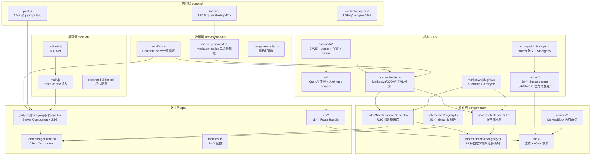
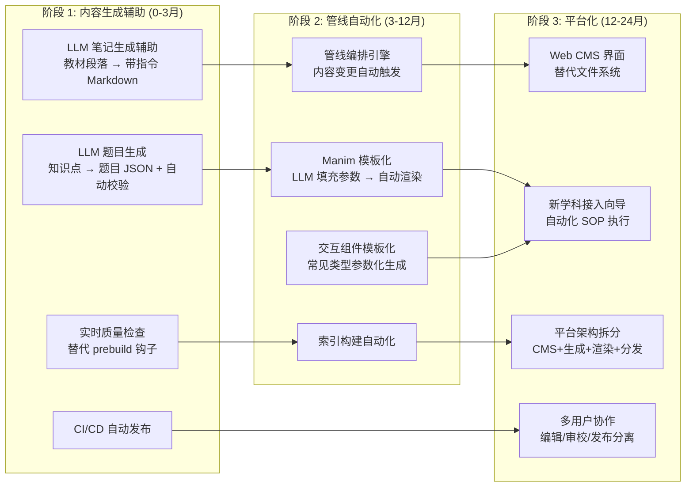

# gailvlun 全项目深度调研总览

> **汇总人**：主理人 齐活林（Qi）· 交付总监
> **汇总日期**：2026-07-05
> **项目版本**：gailvlun v0.3.1
> **调研团队**：software-gailvlun-research（1 主理人 + 1 产品经理 + 5 调研子智能体）
> **调研范围**：21 app 文件 / 197 组件 / 192 库文件 / 1799 内容文件 / 19708 manim 文件 / 303 脚本 / 67 文档
>
> **2026-09 校对说明**（计划 `25`）：本文档是 2026-07-05 的调研总览快照，第 2 节全景架构图与第 7 节要点里提到的 `directiveComponents.tsx`（现搬到 `components/shared/directives/registry.ts`）、`store.ts + 17 Zustand stores`（现为 `lib/stores/`，28 个）已按现网结构更新；其余数据（问题数、优先级统计等）为历史统计，未重新核算，仅供趋势参考。逐维度的准确现网描述见 `01`/`03`/`06` 等对应报告。

---

## 1. 调研概况

### 1.1 调研规模

| 指标 | 数值 |
|------|------|
| 调研维度 | 16 个 |
| 调研报告 | 16 篇维度报告 + 1 篇调研规划 + 本总览 = 18 个 md 文件 |
| 调研子智能体 | 5 个（Agent-A/B/C/D/E 并行） |
| 调研产品经理 | 1 个（许清楚制定调研规划） |
| 总报告行数 | ~12000+ 行 |
| Next.js 规范对比项 | 16 项（合规 5 / 偏离 8 / 缺失 3） |
| 问题清单总数 | ~140 项（P0×3 / P1×17 / P2×48 / P3×72） |

### 1.2 调研方法

- **代码静态分析**：5 个子智能体并行阅读所负责维度的全部源代码文件
- **Next.js 官方文档对比**：通过 WebFetch 查阅 Next.js 16 官方文档逐项对比
- **Mermaid 图示**：架构图 / 数据流图 / 时序图共 40+ 张
- **问题分级**：P0（阻塞）/ P1（高优）/ P2（中优）/ P3（低优）
- **已有文档深化**：与 docs/refer/、docs/sop/、docs/superpowers/ 建立引用/深化/补充关系

### 1.3 团队分工

| 子智能体 | 负责维度 | 报告数 | 状态 |
|----------|----------|--------|------|
| Agent-A 架构与渲染 | 01 总览 / 02 内容管理 / 03 渲染架构 / 10 路由SSR | 4 | ✅ |
| Agent-B AI与存储 | 04 AI对话 / 05 存储 / 06 状态管理 | 3 | ✅ |
| Agent-C 性能与交互 | 07 性能 / 08 交互组件 / 09 Manim动画 | 3 | ✅ |
| Agent-D 工程与测试 | 11 Electron / 12 测试 / 13 构建脚本 / 14 SOP | 4 | ✅ |
| Agent-E 规范与平台 | 15 Next.js规范 / 16 全自动化平台 | 2 | ✅ |

---

## 2. 项目全景架构图



---

## 3. 各维度报告索引

| # | 维度 | 报告文件 | 核心发现 | 问题数 |
|---|------|----------|----------|--------|
| 01 | 项目总览与架构哲学 | `01-architecture-overview.md` | 学科无关设计 + 共享渲染核心 + SSR/CSR 边界前移三大哲学；6 学科 5 步接入法 | 8（P1×1,P2×3,P3×4） |
| 02 | 内容管理系统 | `02-content-management.md` | manifest.ts 单一真相源 + 三种 renderType 分发 + 二段式媒体懒加载 | 10（P1×1,P2×4,P3×5） |
| 03 | 共享渲染架构 | `03-rendering-architecture.md` | 5 remark + 3 rehype 插件链 + 14 种自定义指令 + RSC 预渲染 + mhchem 单例陷阱 | 12（P2×3,P3×9） |
| 04 | AI 对话系统 | `04-ai-chat-system.md` | route.ts 734 行承载 SSE + 工具循环 + 9 个工具 + Anthropic 双向翻译 + 稳定前缀命中 prefix cache | 10（P2×2,P3×8） |
| 05 | 存储架构 | `05-storage-architecture.md` | IDB+LS 双层 + Storage v2 分会话分 key + 800ms 防抖 + v1→v2 幂等迁移 + 水合门控 | 10（P2×4,P3×6） |
| 06 | 状态管理 | `06-state-management.md` | 28 个 Zustand store（2026-07 调研时为 17 个，计划 `22` 搬家后集中到 `lib/stores/` 并新增）+ 引用相等订阅 + TokenDashboard 反订阅模式 | 12（P2×3,P3×9，2026-07 统计） |
| 07 | 性能优化 | `07-performance-optimization.md` | P0/P1 共 8 项已落地 + ChatThread 虚拟化 fallback + next.config.mjs 三项构建期优化 | 8（P0×1,P1×1,P2×2,P3×4） |
| 08 | 交互组件系统 | `08-interactive-components.md` | 53 个组件（概率论 35 + 化学 18）+ 三级懒加载 + :::interactive 指令集成 | 9（P2×4,P3×5） |
| 09 | Manim 动画系统 | `09-manim-animation.md` | 三套独立渲染管线 + REGISTER 模式 + 8456 tex 中间产物 + _clean_env_for_latex 修正 | 10（P2×3,P3×7） |
| 10 | 路由与 SSR/SSG | `10-routing-ssr-ssg.md` | ~633 个 SSG 预渲染 + dynamicParams=false + NoteRendererServer 构建期烘焙 + 11 个 API 路由 | 12（P2×3,P3×9） |
| 11 | 桌面端 Electron | `11-electron-desktop.md` | Route A 架构 + 固定端口 35349 + DPAPI 密钥加密 + pnpm symlink hoist 双护栏 | 12（P1×3,P2×5,P3×4） |
| 12 | 测试体系 | `12-testing-system.md` | 双运行器按 DOM 需求分流 + 7 步 prebuild 质量门禁 + 源码静态断言测试 | 10（P1×3,P2×3,P3×4） |
| 13 | 构建与脚本体系 | `13-build-scripts.md` | 303 脚本（11 个一次性 fix-* 未归档）+ build-index.ts 中文 bigram + 6 个 check 脚本 | 12（P1×3,P2×5,P3×4） |
| 14 | SOP 体系与内容生产 | `14-sop-content-pipeline.md` | 9 个核心 SOP 覆盖全生命周期 + 理工/人文模板分叉 + 8 步新学科接入 | 10（P1×3,P2×4,P3×3） |
| 15 | Next.js 16 规范对比 | `15-nextjs-compliance.md` | 合规 5 / 偏离 8 / 缺失 3（含 3 个 P0 严重问题） | 52（P0×3,P1×6,P2×21,P3×22） |
| 16 | 全自动化平台改造 | `16-automation-platform.md` | 1 学科 400-960 小时人工 + 3 阶段路线图 + Manim 是最大技术赌注 | 10 差距维度 |

---

## 4. 问题汇总（按优先级排序）

### 4.1 P0 严重问题（3 项，需立即处理）

| # | 问题 | 涉及文件 | 来源维度 |
|---|------|----------|----------|
| P0-1 | **`.env.local` 含 5 个真实 API Key**（AI_API_KEY/MIMO_API_KEY/ZHIPU_API_KEY/UNSPLASH_ACCESS_KEY/MinerU_API_Token），已视为泄露，需立即轮换 | `.env.local` | 15 |
| P0-2 | **无错误边界件**：项目缺少 `error.tsx` / `not-found.tsx` / `global-error.tsx`，任何 Server Component 抛错都会白屏 | `app/` 全目录 | 15 |
| P0-3 | **`QuizQuestion.tsx:531` 禁用 `react-hooks/rules-of-hooks`**，违反 React 顶级规则，可能引发运行时崩溃 | `components/quiz/QuizQuestion.tsx:531` | 15 |

### 4.2 P1 高优先级问题（17 项）

| # | 问题 | 涉及文件 | 来源维度 |
|---|------|----------|----------|
| P1-1 | 0 处 `next/image`，4090 张图片完全无优化（无 lazy/format/responsive） | 全项目 | 15 |
| P1-2 | 无 `generateMetadata`，376 个内容页共享根标题，SEO 全部失效 | 各 `page.tsx` | 15 |
| P1-3 | 无 `middleware.ts`（Next.js 16 已重命名 proxy.ts），无请求预处理 | 项目根目录 | 15 |
| P1-4 | 0 处 `next/font`，字体加载未优化 | `app/layout.tsx` | 15 |
| P1-5 | 4 处 `react-hooks/set-state-in-effect` 禁用（React 19 新规则） | 4 个组件 | 15 |
| P1-6 | `revalidate = false` 在 Next.js 16 + Cache Components 时将被移除 | `page.tsx` | 15 |
| P1-7 | Electron 固定端口 35349 占用无降级方案 | `electron/main.js` | 11 |
| P1-8 | Electron 密钥变更需重启服务（DPAPI 无热更新） | `electron/main.js` | 11 |
| P1-9 | Electron 未签名发布，SmartScreen 拦截风险 | `electron-builder.yml` | 11 |
| P1-10 | 性能测试空缺，无自动化性能回归测试 | `tests/performance/` | 12 |
| P1-11 | API 路由测试薄弱，11 个 API 路由仅 2 个有测试 | `tests/api/` | 12 |
| P1-12 | Electron 主进程零测试 | 无 `tests/electron/` | 12 |
| P1-13 | 脚本碎片化，11 个一次性 fix-* 脚本未归档 | `scripts/` 顶层 | 13 |
| P1-14 | 索引构建失败后部分产出不一致 | `scripts/build-index.ts` | 13 |
| P1-15 | 脚本缺乏文档（303 个脚本无统一 README） | `scripts/` | 13 |
| P1-16 | AI 工具可达性 4 个已知缺口（SOP 与实际代码不一致） | `docs/sop/` | 14 |
| P1-17 | `nav.generated.json` 未挂入 prebuild，存在内容不同步风险 | `scripts/gen-nav-manifest.ts` | 02 |

### 4.3 P2/P3 问题（120 项）

详细清单见各维度报告的「问题清单」章节。P2/P3 问题汇总：
- **P2 中优问题**：48 项（含概率论特例路径分裂、storage-architecture.md 文档过时、4 个学科无交互组件、化学物理无 npm script 等）
- **P3 低优问题**：72 项（含双 Token Tracker 重复、四种持久化风格不统一、超大文件分布等）

---

## 5. Next.js 16 规范合规总览

### 5.1 合规总览表

| # | 规范方向 | 判定 | 问题数 | 优先级 |
|---|----------|------|--------|--------|
| 1 | App Router 路由结构 | ✅ 合规 | 0 | - |
| 2 | Server / Client Components 边界 | ✅ 合规 | 0 | - |
| 3 | 数据获取模式 | ⚠️ 偏离 | 2 | P2 |
| 4 | 元数据 API | ❌ 缺失 | 3 | P1 |
| 5 | 缓存策略 | ⚠️ 偏离 | 4 | P1×1, P2×3 |
| 6 | 中间件（Middleware） | ❌ 缺失 | 1 | P1 |
| 7 | 动态路由与静态生成 | ✅ 合规 | 2 | P2×2 |
| 8 | API 路由设计 | ⚠️ 偏离 | 5 | P2×3, P3×2 |
| 9 | 图片优化 | ❌ 缺失 | 4 | P1×1, P3×3 |
| 10 | 字体优化 | ❌ 缺失 | 1 | P1 |
| 11 | Script 优化 | ⚠️ 偏离 | 2 | P3×2 |
| 12 | 错误处理 | ❌ 缺失 | 3 | P0×1 |
| 13 | 环境变量管理 | ⚠️ 偏离 | 5 | P0×1, P3×4 |
| 14 | 部署配置 | ✅ 合规 | 0 | - |
| 15 | TypeScript strict 合规 | ✅ 合规 | 0 | - |
| 16 | ESLint 合规 | ⚠️ 偏离 | 6 | P0×1, P1×2, P3×3 |

### 5.2 合规统计

- ✅ **合规**：5 项（31%）— App Router 路由结构、Server/Client 边界、动态路由与静态生成、部署配置、TypeScript strict
- ⚠️ **偏离**：8 项（50%）— 数据获取、缓存策略、API 路由、Script 优化、环境变量、ESLint 等
- ❌ **缺失**：3 项（19%）— 元数据 API、中间件、错误处理、图片优化、字体优化（5 个方向完全缺失对应能力）

### 5.3 修复优先级建议

**立即修复（P0）**：
1. 轮换 `.env.local` 中 5 个泄露的 API Key
2. 添加 `app/global-error.tsx` + `app/error.tsx` + `app/not-found.tsx`
3. 移除 `QuizQuestion.tsx:531` 的 `react-hooks/rules-of-hooks` 禁用

**短期修复（P1）**：
1. 引入 `next/image` 替换原生 ``（4090 张图片）
2. 为内容页添加 `generateMetadata`（376 个页面）
3. 添加 `middleware.ts`（Next.js 16 proxy.ts）
4. 引入 `next/font` 优化字体加载
5. 处理 `revalidate = false` 的 Next.js 16 兼容性
6. 修复 4 处 `set-state-in-effect` 禁用

---

## 6. 全自动化平台改造路线图

### 6.1 现状成本

| 环节 | 当前方式 | 单节人工成本 | 单学科总成本 |
|------|----------|------------|------------|
| 教材处理 | MinerU PDF 解析 → 手动清洗 | 2-4h | 60-120h |
| 详解笔记编写 | 手动 .md + 指令 + KaTeX | 4-8h | 120-240h |
| 录音逐字稿处理 | 手动录音 → 转写 → 分段 | 3-6h | 90-180h |
| 题目生成 | 手动 .json | 1-2h | 30-60h |
| Manim 动画 | 手动 .py → 渲染 → 集成 | 2-4h | 60-120h |
| 交互组件 | 手动 React → registry 注册 | 2-6h | 40-180h |
| 内容集成 + 考前模拟 | 手动 manifest + 检查 | 1-2h | 40-60h |
| **合计** | — | **13-32h/节** | **400-960h/学科** |

### 6.2 三阶段改造路线图



### 6.3 技术选型可行性评估

| 技术 | 可行性 | 难度 | ROI | 建议 |
|------|--------|------|-----|------|
| LLM 内容生成 | ★★★★★ | 低 | 高 | **优先启动**，1-2 周可出第一版 |
| 向量索引自动化 | ★★★★☆ | 低 | 中 | 阶段 2 启动 |
| 交互组件模板化 | ★★★☆☆ | 中 | 中 | 阶段 2 启动 |
| **Manim 动画自动生成** | ★★☆☆☆ | **高** | 中 | **最大技术赌注**，最早启动但兜底保留人工 |

### 6.4 改造目标

| 阶段 | 时间 | 目标降本 | 核心交付 |
|------|------|----------|----------|
| 阶段 1 | 0-3 月 | 50% | LLM 笔记/题目生成辅助 + 实时质量检查 + CI/CD |
| 阶段 2 | 3-12 月 | 80% | 管线编排 + Manim 模板化 + 交互组件模板化 |
| 阶段 3 | 12-24 月 | 95% | CMS + 平台门户 + 多学科向导 + 平台架构拆分 |

---

## 7. 关键发现与建议

### 7.1 项目核心优势（应保留）

1. **学科无关设计成熟**：SubjectId + CategoryId 设计使新增学科成本可控（5 步接入法）
2. **共享渲染核心是关键资产**：sharedRemarkPlugins + directiveComponents（现为 `components/shared/directives/registry.ts`）+ NoteRendererServer 必须保留，避免新学科自带渲染器导致分裂
3. **RSC 预渲染性能优势显著**：构建期完成 Markdown → HTML/KaTeX 烘焙，消除客户端瀑布
4. **流式双节流防 OOM**：UI 60ms + IDB 800ms 尾随防抖是针对实证 OOM 的有效修复
5. **Storage v2 分会话分 key**：根治了单 key 整包 stringify 的 CPU 热点
6. **三级懒加载链路**：按章节过滤 → LazyVisible 视口懒挂载 → dynamic 代码分割
7. **SOP 体系标准化**：9 个核心 SOP 覆盖全生命周期，是平台化改造的基础
8. **双运行器测试架构**：按 DOM 需求分流，7 步 prebuild 质量门禁
9. **Anthropic adapter 双向翻译层**：主循环对协议零感知，易于扩展新 AI 提供商
10. **稳定前缀 + 易变上下文分离**：命中 prefix cache，降低 token 消耗

### 7.2 主要技术债务（应偿还）

1. **Next.js 规范偏离严重**：16 项规范中仅 5 项合规，3 项完全缺失，含 3 个 P0 严重问题
2. **`.env.local` API Key 泄露**：5 个真实 Key 需立即轮换
3. **无错误边界**：任何 Server Component 抛错白屏
4. **图片/字体/元数据全缺**：4090 张图片无优化、376 页面无 generateMetadata、无 next/font
5. **概率论特例路径分裂**：走 `content/chapters/` 与通用路径不一致
6. **nav.generated.json 未挂入 prebuild**：内容不同步风险
7. **脚本碎片化**：11 个一次性 fix-* 脚本未归档，303 个脚本无统一文档
8. **storage-architecture.md 文档过时**：useChatHistory 已不用 persist，文档仍描述旧架构
9. **4 个学科无交互组件**：物理/近现代史/毛概/CET-4 在 registry 中空缺
10. **性能测试空缺**：无自动化性能回归测试

### 7.3 平台化改造核心建议

1. **优先启动 LLM 笔记生成辅助**：技术风险低、ROI 最高，1-2 周可出第一版
2. **Manim 自动化最早启动但兜底保留人工**：最大技术赌注，需长期投入
3. **manifest 升级为「平台 API」**：支持运行时注册，替代编译期固定
4. **评估 ISR 或 on-demand revalidation**：应对内容规模扩张，633+ 页面 SSG 构建时间可能成为瓶颈
5. **共享渲染核心必须保留**：避免新学科自带渲染器导致分裂
6. **概率论特例路径迁移作为平台化前置任务**
7. **Electron 固定端口需要降级方案**：端口占用时自动回退
8. **添加错误边界 + next/image + generateMetadata**：Next.js 规范合规化的基础

---

## 8. 关键待确认问题

以下问题需用户澄清（来自产品经理调研规划的 10 个问题 + 各维度报告新增）：

| # | 问题 | 影响 | 建议询问对象 |
|---|------|------|--------------|
| 1 | 全自动化平台的用户画像？（教师自助上传？学生自助学习？平台运营团队？） | 影响改造方向和优先级 | 用户 |
| 2 | 全自动化平台是否保留 Web + Electron 双形态？还是纯 Web 平台？ | 影响部署架构调研 | 用户 |
| 3 | AI 对话系统使用的具体 AI 提供商？（SiliconFlow / OpenAI / Anthropic？） | 影响 AI 维度调研深度 | 用户 |
| 4 | 向量索引 307MB 从 COS 下载到 /tmp 的策略是否在生产中稳定？ | 影响存储和部署调研 | 主理人 |
| 5 | 6 个学科的内容是否还在持续更新？还是已进入维护期？ | 影响全自动化平台改造的紧迫性 | 用户 |
| 6 | 是否有其他大学/课程需要复用此平台？ | 影响平台化的多租户/多课程设计 | 用户 |
| 7 | EdgeOne 部署的 CDN 缓存策略是什么？ | 影响部署配置调研 | 主理人 |
| 8 | Manim 动画渲染环境是否在 CI/CD 中可用？还是仅本地渲染？ | 影响自动化管线设计 | 主理人 |
| 9 | 当前 1228 个测试的运行时间是多少？是否在 CI 中全量运行？ | 影响测试体系调研 | 主理人 |
| 10 | 调研报告的目标读者是谁？（开发者？项目管理者？投资者？） | 影响所有报告的写作风格 | 用户 |
| 11 | **`.env.local` 中 5 个 API Key 是否已轮换？** | 安全风险 | 用户 |
| 12 | Manim 自动化是否值得投入？（最大技术赌注） | 影响阶段 2 改造方向 | 用户 |

---

## 9. 报告文件清单

```
docs/research/
├── 00-research-plan.md              ← 调研规划（产品经理许清楚）
├── 01-architecture-overview.md      ← 维度 01：项目总览与架构哲学
├── 02-content-management.md         ← 维度 02：内容管理系统
├── 03-rendering-architecture.md     ← 维度 03：共享渲染架构
├── 04-ai-chat-system.md             ← 维度 04：AI 对话系统
├── 05-storage-architecture.md        ← 维度 05：存储架构
├── 06-state-management.md            ← 维度 06：状态管理
├── 07-performance-optimization.md   ← 维度 07：性能优化
├── 08-interactive-components.md     ← 维度 08：交互组件系统
├── 09-manim-animation.md            ← 维度 09：Manim 动画系统
├── 10-routing-ssr-ssg.md            ← 维度 10：路由与 SSR/SSG
├── 11-electron-desktop.md           ← 维度 11：桌面端 Electron
├── 12-testing-system.md             ← 维度 12：测试体系
├── 13-build-scripts.md              ← 维度 13：构建与脚本体系
├── 14-sop-content-pipeline.md       ← 维度 14：SOP 体系与内容生产流程
├── 15-nextjs-compliance.md          ← 维度 15：Next.js 16 规范逐项对比
├── 16-automation-platform.md        ← 维度 16：全自动化平台改造调研
└── overview.md                      ← 本文档（总览）
```

**总计 18 个 md 文件，~12000+ 行**

---

## 10. 下一步建议

### 10.1 立即行动（P0）

1. **轮换 `.env.local` 中 5 个泄露的 API Key**
2. **添加错误边界件**：`app/global-error.tsx` + `app/error.tsx` + `app/not-found.tsx`
3. **移除 `QuizQuestion.tsx:531` 的 rules-of-hooks 禁用**，修复 hooks 调用顺序

### 10.2 短期改进（P1，1-2 周）

1. 引入 `next/image` 替换原生 ``
2. 为内容页添加 `generateMetadata`
3. 添加 `middleware.ts`
4. 引入 `next/font`
5. 处理 `revalidate = false` 的 Next.js 16 兼容性
6. 修复 4 处 `set-state-in-effect` 禁用
7. 将 `nav.generated.json` 挂入 prebuild 钩子

### 10.3 中期改造（1-3 月）

1. **启动全自动化平台改造阶段 1**：LLM 笔记生成辅助（技术风险低、ROI 最高）
2. 概率论特例路径迁移
3. storage-architecture.md 文档更新
4. 性能测试体系搭建
5. 4 个学科交互组件补齐

### 10.4 长期演进（3-24 月）

1. **阶段 2**：管线自动化 + Manim 模板化 + 交互组件模板化
2. **阶段 3**：CMS + 平台门户 + 多学科向导 + 平台架构拆分

---

> **本总览文档汇总自 5 个调研子智能体 + 1 个产品经理的并行调研产出。所有发现均基于实际源代码阅读和 Next.js 16 官方文档对比，不含臆测。详细的逐维度分析请参阅对应的维度报告文件。**
