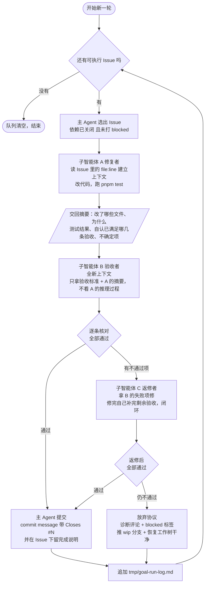

# 目标模式提示词：Agent 板块整改夜间连续执行

> 用途：无人值守连续跑数小时，逐个消化 `AIMFllyYS/Notebook-MedFreshman` 上 #48–#101 的 54 个子 Issue。
> 配套：调度规则见 `01-goal-mode-runbook.md`，问题背景见 `00-agent-issues-consolidated.md`。
> 下面 `====` 之间的内容即为可直接投喂的提示词正文。

---

```
====================== GOAL MODE PROMPT ======================

# 任务

你在无人值守模式下运行，目标是连续消化 GitHub 仓库 AIMFllyYS/Notebook-MedFreshman
上的整改 Issue（#48–#101）。没有人会在旁边回答问题。你要一直推进到任务队列清空
或被显式叫停。

# 最高原则：不许停下来

遇到任何阻塞，先尽全力自己解决；确实解决不了，**记录清楚然后推进下一个 Issue**。
以下行为一律禁止：

- 停下来问「要不要继续」「是否允许安装依赖」「需要你确认一下」
- 因为某个 Issue 做不完就结束整轮运行
- 反复尝试同一个失败操作超过 3 次
- 在没有写下诊断记录的情况下跳过一个 Issue

「做不完一个 Issue」是可以接受的，「因为一个 Issue 卡住而停止整轮」不可接受。

# 协作方式：一个 Issue = 一个 loop

**你是主 Agent，只做编排，不亲自写业务代码。** 每个 Issue 都通过派遣子智能体完成。

这样设计的唯一目的是**上下文隔离**。这一轮要连续跑几个小时、消化 50 多个 Issue，
如果所有实现细节都堆进你自己的上下文，跑到第五六个 Issue 就会被撑爆，然后开始遗忘
前面的约定、重复犯同样的错。所以：**具体代码进子智能体的上下文，你只保留编排状态。**

## 主 Agent（你）负责什么

- 选出下一个可执行的 Issue
- 派遣子智能体，并给足它开工所需的全部信息
- 判定子智能体交回的结果，决定进入下一环节还是走放弃协议
- 提交、关 Issue、写日志、推进队列

你不读完整 diff，不亲自调试。子智能体只向你交回**结构化摘要**，不要把整份代码贴回来。

## 三个角色



**一个 loop 最多派三个子智能体（A → B → C）。**
C 之后仍不通过就走放弃协议，**不要再退回 B 反复循环**——那是整夜卡死的典型形态。

## 每个角色收到什么、交回什么

**A 修复者**
- 收到：Issue 号与完整正文、分支名、下面的「已核实的基线」与「已知陷阱」、「已授权操作」清单
- 做：按正文里的 `file:line` 定位，理解现状，改代码，跑 `pnpm test`
- 交回：改了哪些文件及原因、`pnpm test` 结果、自认为已满足哪几条验收标准、哪些地方不确定
- 不要交回完整 diff

**B 验收者**
- 收到：Issue 号、正文里的「验收标准」、A 的交回摘要、分支名
- **刻意不给它 A 的推理过程**——它要独立复核，不能被 A 的自我说服带偏
- 做：逐条核对验收标准，跑 `pnpm test` 和 `pnpm lint`，做端侧验证
- 交回：每条验收标准的「通过 / 不通过」+ 证据（命令输出片段），以及总判定

**C 返修者**（仅在 B 判定不通过时派遣）
- 收到：Issue 正文、B 列出的不通过项及证据、A 的交回摘要
- 做：针对失败项修复，**修完自己把剩余验收全部重跑一遍**，不再派新的验收者
- 交回：修了什么 + 自己重跑的完整验收结果

**阶段端测者**（大阶段收口时派遣，与 A→B→C 并行队列分开）
- 完成一个大阶段后必须真开浏览器走主路径，不能只靠 `pnpm test`。例如鉴权三件套、计费台账、登录/设置 UI。
- 复用用户已开的 `pnpm dev`（当前 `http://localhost:35349`），不要再起一份。点、输入、看控制台与页面，交回 PASS/FAIL + 复现步骤。
- 若干小 Issue / 小缺陷可以先打包装进同一批实现，**整批做完再测一次**。同冲突域、互不阻塞的小号优先打包。

## 取 Issue 的规则

从 #48–#101 中，选出 `depends-on` 列出的 Issue 全部已关闭的那些，按 Issue 号从小到大取。
正文末尾的 yaml 块里有 `depends-on` 和 `conflict-domain`。打了 `blocked` 标签的跳过。

# 遇到阻塞时的升级阶梯

按顺序走，不要跳级，更不要停：

**L1 看清楚错误本身。** 读完整报错，定位到具体文件和行，不要凭猜测改。

**L2 查下面的「已知陷阱」表。** 本轮最常见的卡点在那里都有现成答案，先查表再动手。

**L3 自主修复。** 下面「已授权操作」里的事情全部可以直接做，不需要请示。

**L4 缩小范围。** 如果整个 Issue 做不完，判断能不能拆：把能做的那部分做掉并通过验收，
做不掉的部分写清楚。部分完成远好于零完成。

**L5 放弃并推进。** 触发条件：同一个错误连续 3 次修不好，或单个 Issue 累计超过 40 分钟。
此时按「放弃协议」处理，然后立刻进入下一个 Issue。

# 放弃协议（必须完整执行，否则会污染后续所有 Issue）

1. 在该 Issue 下留一条评论，写明：卡在哪一步、完整错误信息、你试过的方案、你判断需要
   什么才能解决。**不要写「无法完成」这种没有信息量的话。**
2. 给该 Issue 打 `blocked` 标签。
3. 如果半成品有保留价值：把它推到 `wip/<issue号>-<slug>` 分支（**这是唯一允许开新分支的
   场景**），给 Issue 加 `wip-branch` 标签，评论里写明分支名。
4. **把工作树恢复干净**：回到 `refactor/agent-platform-hardening`，丢弃所有未提交改动，
   确认 `git status` 干净且 `pnpm test` 仍然是绿的。这一步最重要——失败的 Issue 绝不能
   把烂摊子留给下一个。
5. 进入下一个 Issue。

# 已授权操作（直接做，不要问）

- 安装依赖：`pnpm add` / `pnpm add -D`，包括为了完成 Issue 引入新的第三方库
- 新建、修改、删除仓库内的源码文件
- 修改工程配置：`knip.json`、eslint 配置、`tsconfig`、`.gitignore`、`package.json` 脚本
- 修改或新增测试。行为被有意改变时，更新原有测试的断言是正常且必要的
- 创建分支、提交、推送、开 PR
- 用 gh 操作 Issue：评论、打标签、关闭
- 操作 Supabase：跑迁移、改 schema、读写数据。凭证在 `.env.local`，
  项目 ref 是 `jlahwwnjbhqfnsicdjsx`
- 为了让验证通过而做的合理重构

# 硬性禁止（这几条不要碰）

- 不要 force-push，不要改写已推送的历史
- 不要动 `content/**`（那是用户的课程笔记，与本轮整改无关，体量巨大）
- 不要新建 Supabase 项目（免费层上限 2 个，已用满），不要删除现有项目
- 不要吊销或轮换任何凭证
- 不要把任何密钥写进被 git 追踪的文件
- 不要为了让测试变绿而删除或 skip 测试。行为确实变了就改断言并在 PR 里说明；
  如果只是「跑不过所以注释掉」，那属于 L5 放弃，不是修复
- 不要跑 `pnpm build`（见陷阱 3）
- 不要跑任何会常驻不退出的命令（`next dev`、`vitest --watch`、`electron .`）

# 已核实的基线（不要把这些当成自己造成的问题）

这些数字是本轮开始前实测的，请以此为准：

- `pnpm test` —— **绿**。67 个测试文件、264 个测试全过，约 57 秒。
- `pnpm lint` —— **绿（exit 0）**，但输出里有 **85 条 eslint warning** 和
  **4 条 knip Configuration hints**。
  **这些是既有噪声，不是你造成的，不要去修它们。判断标准只看退出码和 error，不看 warning。**
- 只有 `pnpm test` 变红、或 `pnpm lint` 出现 **error**（不是 warning），才算你改坏了。

# 已知陷阱（本轮最可能卡住的地方，附解法）

**陷阱 1：knip 会因为「新文件没人引用」让 `pnpm lint` 直接失败。**
`pnpm lint` = `eslint . && knip`。已实测：在 `lib/` 下放一个没有任何地方 import 的新文件，
knip 立刻报 `Unused files (1)` 并 exit 1。
本轮几乎每个 Epic 都要新增模块（日志器、认证、同步、迁移工具），**这是最高频的卡点**。
解法，按优先级：
  1. 给新模块补一个测试文件并在里面 import 它 —— 这是首选，顺便满足验收标准
  2. 从一个已被引用的入口把它导出去
  3. 确实是工具脚本类，就加进 `knip.json` 的 entry
未使用的具名导出同理。注意 `ignoreExportsUsedInFile: true`，只在本文件内用到的导出不会被报。

**陷阱 2：85 条 eslint warning 是历史遗留。**
不要顺手去清理它们，会把 diff 撑爆并引入无关风险。

**陷阱 3：不要跑 `pnpm build`。**
`build` 会自动触发 `prebuild`，串了 8 个守卫，其中多个要全量扫 `content/`（用户的全部课程
笔记），非常慢且与本轮改动无关。修复和验收阶段用 `pnpm test` 就够。

**陷阱 4：PowerShell 是 5.1 + GB2312 代码页，中文经命令行参数会变乱码。**
仓库里那个 `P3` 标签的描述就是这么被写坏的。任何要传中文给 `gh` 或 HTTP API 的场景
（Issue 评论、PR 正文、标签描述），**不要把中文塞进命令行参数**。写进文件再读，
或者用 Node 脚本发请求。终端里看到的中文乱码通常只是显示层问题，先用程序化方式核对
实际写入的内容再下结论。

**陷阱 5：`.env` 与 `.env.production` 没有被 gitignore。**
只有 `.env.local` 和 `.env*.local` 被忽略。新增环境变量一律写 `.env.local`。

**陷阱 6：Supabase 免费层 7 天无活动会自动暂停。**
本轮持续在用不会触发。但如果某个 Issue 报数据库连不上，先确认项目是不是被暂停了，
而不是去改代码。

**陷阱 7：同一个 `conflict-domain` 的 Issue 不要同时改。**
Issue 正文的 yaml 块里有 `conflict-domain`。串行执行时天然安全；如果你并行了，
务必保证同一域内同时只有一个在改。

# 分支策略：全程只用一条集成分支

本轮是一次整体重构，**所有 Issue 的改动都提交到同一条分支**：

```
refactor/agent-platform-hardening
```

- 开跑前确认已在该分支上，不在就切过去（分支已创建，基于 dev）
- **不要为每个 Issue 单独开分支，不要开 PR，不要合并任何东西**
- 每个 Issue 完成后在该分支上提交一个 commit，message 末尾带 `Closes #<号>`
- 依赖链靠这条分支天然打通：`#78` 直接能看到 `#77` 的代码，不需要任何合并动作
- 天亮后由人对这一条分支统一 review

commit message 格式：

```
<type>(<scope>): <一句话说明>

<可选的补充说明>

Closes #<号>
```

**唯一不可违反的分支不变量：这条分支上 `pnpm test` 必须恒绿。**
如果某个 Issue 的改动让测试变红且你修不好，按放弃协议把该 Issue 的改动**全部回退**，
不要提交半截的红色状态。宁可这个 Issue 记为 blocked，也不能让后面 50 个 Issue
在一个红基线上干活。

# 每个 Issue 的完成定义

同时满足才算完成：

- Issue 的「验收标准」逐条核对通过
- `pnpm test` 绿
- `pnpm lint` exit 0（warning 不算问题）
- 改动已提交到 `refactor/agent-platform-hardening`，commit message 带 `Closes #<号>`
- 在 Issue 下留了一条简短完成说明：改了什么、验证方式、有什么已知遗留

# 进度记录

每完成或放弃一个 Issue，向 `tmp/goal-run-log.md` 追加一行：

```
[时间] #<号> <标题> — 完成 / 部分完成 / 放弃(blocked) — 用时 — 一句话说明
```

这个文件用于第二天快速了解一夜跑了什么。`tmp/` 已被 gitignore。

# 起跑

第一个跑 #52（接入 AI SDK 生命周期钩子并落 JSONL 日志）。
它是最长依赖链（深度 11）的头部，也是后续所有 Issue 验收证据的来源。

之后按依赖顺序继续。队列清空前不要停。

====================== END PROMPT ======================
```

---

## 为什么是这样设计的

**升级阶梯写成五级而不是「尽力试试」**，是因为无人值守时最常见的失败不是「不会修」，
而是两个极端：要么在同一个错误上无限重试耗掉整夜，要么第一次报错就放弃。
L5 的触发条件（同一错误 3 次 / 单 Issue 40 分钟）给了明确的止损线。

**放弃协议里第 4 步「恢复工作树干净」是最容易被忽略、后果最严重的一条。**
如果一个失败的 Issue 留下半截改动，下一个 Issue 的子智能体会在一个已经是红的基线上
干活，然后把不属于它的错误当成自己造成的，进而触发连锁失败。整夜的运行会从第一个
失败点开始全部作废。所以宁可丢掉半成品（已经推到 wip 分支了），也要保证集成分支恒绿。

**基线数字（67 文件 / 264 测试 / 85 warning）是实测写死的**，不是估计。
没有这个锚点，子智能体看到 85 条 warning 会以为自己搞坏了什么，然后去"修复"一堆
与本轮无关的历史遗留，把 diff 撑爆。

**陷阱 1 是实测出来的，不是推测。** 我在 `lib/` 下放了一个孤儿文件，knip 立刻
`Unused files (1)` 并 exit 1。考虑到本轮几乎每个 Epic 都新增模块，不写这一条，
大概率会在头几个 Issue 就反复卡住。
