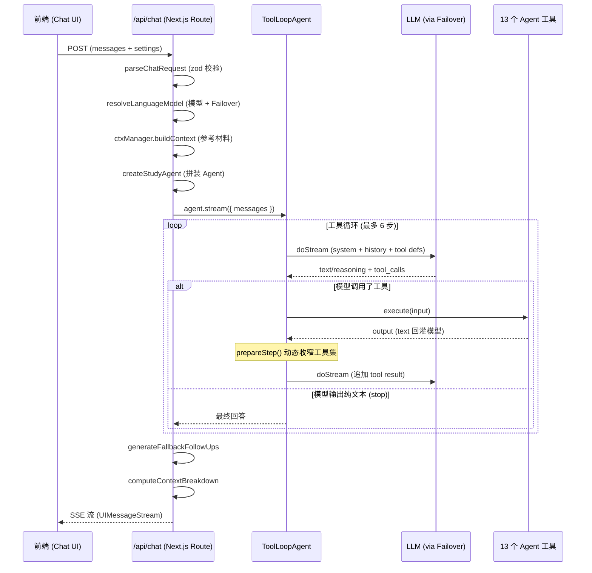
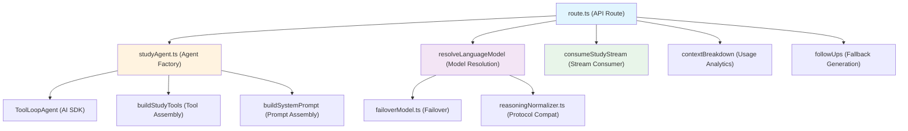
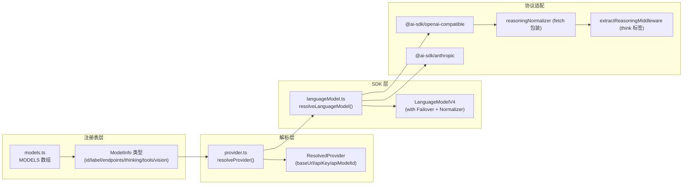

# 项目 Agent 架构深度分析报告

> [!NOTE]
> 本报告基于对 `lib/ai/`、`lib/chat/`、`lib/context/`、`app/api/chat/` 等核心模块的全量代码审查。分析范围覆盖 Agent 循环机制、上下文工程、Harness 层实现、模型接入抽象四大板块。

---

## 一、Agent 架构全景

### 1.1 架构定性：多步工具循环（Tool Loop Agent）

项目采用的是 **Vercel AI SDK v7 的 `ToolLoopAgent`** 架构（`ai@7.0.85`），属于 **ReAct 范式（Reasoning + Acting）** 的标准实现。

**关键结论：这不是单次调用，而是多次调用。**



### 1.2 核心数据流

| 阶段 | 关键文件 | 职责 |
|------|---------|------|
| **请求解析** | [requestSchema.ts](file:///d:/projects/Dev-Tools/StudyReview-Platform/lib/ai/agent/requestSchema.ts) | Zod 宽松校验，兼容旧版客户端 |
| **模型解析** | [languageModel.ts](file:///d:/projects/Dev-Tools/StudyReview-Platform/lib/ai/sdk/languageModel.ts) | Provider 选择 + Failover 链组装 |
| **上下文构建** | [fullContext.ts](file:///d:/projects/Dev-Tools/StudyReview-Platform/lib/context/fullContext.ts) / [semanticSearch.ts](file:///d:/projects/Dev-Tools/StudyReview-Platform/lib/context/semanticSearch.ts) | 参考材料 + 语义检索 |
| **Agent 组装** | [studyAgent.ts](file:///d:/projects/Dev-Tools/StudyReview-Platform/lib/ai/agent/studyAgent.ts) | System prompt + 工具集 + 循环策略 |
| **工具执行** | [server.ts](file:///d:/projects/Dev-Tools/StudyReview-Platform/lib/ai/agent/tools/server.ts) | 13 个工具的服务端入口 |
| **流消费** | [consumeStudyStream.ts](file:///d:/projects/Dev-Tools/StudyReview-Platform/lib/chat/consumeStudyStream.ts) | 客户端流→UI 消息映射 |
| **追踪可视化** | [buildTrace.ts](file:///d:/projects/Dev-Tools/StudyReview-Platform/lib/chat/buildTrace.ts) | Agent 步骤→Trace UI |

### 1.3 调用模式详解

每次用户发送消息时的调用链：

1. **单次 API 请求** — 前端 POST `/api/chat`
2. **Agent 内部多次 LLM 调用** — `ToolLoopAgent` 自动管理循环：
   - 第 1 步：模型看到 system + history + tools → 可能输出 tool_call
   - 第 2~6 步：模型看到 tool_result → 继续推理或再次调用工具
   - `stopWhen: isStepCount(MAX_TOOL_STEPS)` 限制最多 **6 步工具循环**
   - `maxRetries: 0` 不重试（Failover 由模型适配器负责）
3. **整个循环作为一条 SSE 流** 返回给前端

> [!IMPORTANT]
> **这与之前讨论的「工具调用放在输出最下方 → 激活新的调用 → 补充上下文」的机制完全吻合。** 具体来说：
> - AI SDK 的 `ToolLoopAgent` 会检测模型输出中的 `tool_calls`（`finish_reason: "tool_calls"`）
> - 检测到后自动执行对应工具，将 `tool result` 追加到消息历史
> - 然后发起新一轮 LLM 调用，模型能看到完整的工具返回内容
> - 循环直到模型输出纯文本（`finish_reason: "stop"`）或达到步数上限

---

## 二、上下文工程分析

### 2.1 System Prompt 拼装（Prefix Cache 优化）

上下文分为 **稳定前缀**（利于 prefix cache 命中）和 **易变后缀** 两层：

```
┌─────────────────────────────────────────────┐
│ 稳定前缀（跨会话不变 → 缓存命中）              │
│ ┌─────────────────────────────────────────┐ │
│ │ global.md (18KB, ~196行)                │ │
│ │ - 角色设定（小岸 AI 助教）               │ │
│ │ - 教学法原则 (6条)                      │ │
│ │ - 13个工具的使用策略                     │ │
│ │ - 公式/排版规范                         │ │
│ │ - SVG/Canvas 编写规范                   │ │
│ │ - 追问/出题格式                         │ │
│ └─────────────────────────────────────────┘ │
│ ┌─────────────────────────────────────────┐ │
│ │ subjects/{id}.md (按学科切换)            │ │
│ │ {subjectName} 模板变量已替换             │ │
│ └─────────────────────────────────────────┘ │
│ ┌─────────────────────────────────────────┐ │
│ │ 全局补充上下文（用户手动填写）            │ │
│ │ 固定技能（pinned skills 全文）           │ │
│ │ 可调用技能菜单（名称+描述列表）           │ │
│ └─────────────────────────────────────────┘ │
├─────────────────────────────────────────────┤
│ 易变后缀（每次请求可能不同）                   │
│ ┌─────────────────────────────────────────┐ │
│ │ 当前位置行：科目/分类/内容项/主题          │ │
│ │ 参考材料（或 80% 软上限省略提示）          │ │
│ └─────────────────────────────────────────┘ │
└─────────────────────────────────────────────┘
```

> [!TIP]
> **Prefix Cache 友好设计**：所有内容拼成 **一条** system 消息（部分模型如硅基流动 Qwen3 对第二条 system 报错），稳定排序技能（按 createdAt + id），保证逐字节一致。定价表显示多数模型支持 prefix cache（cachedInput 远低于 input），这是显著的成本优化。

### 2.2 上下文管理双模式

| 模式 | 实现 | 特点 |
|------|------|------|
| `full` | [FullContextManager](file:///d:/projects/Dev-Tools/StudyReview-Platform/lib/context/fullContext.ts) | 课程目录树摘要 + 当前页面全文 + 用户提问 |
| `semantic` | [SemanticSearchManager](file:///d:/projects/Dev-Tools/StudyReview-Platform/lib/context/semanticSearch.ts) | 当前页面全文 + hybridSearch 检索 top5 相关 chunk |

### 2.3 上下文预算与软上限

```
客户端估算 → estimateContextBudget()
   ├── limit = sessionContextBudgetTokens 或 contextK * 1000
   ├── estimated = 消息 token 估算 + 3000 (system 开销)
   └── softLimitReached = estimated / limit >= 0.8

服务端双重检查 → route.ts L150-151
   ├── serverSoftLimitReached = ctxResult.tokenCount / contextBudget >= 0.8
   └── contextTruncated = 客户端标记 || 服务端标记 || overflow

触发后 → 省略参考材料，system 中注入说明
```

### 2.4 工具回灌的上下文治理

每个工具输出必须包含 `text` 字段 — 这是 **唯一回灌给模型的内容**（通过 `toModelOutput`）。其余字段（如 `hits`、`sources`、`images`）只给前端展示，**不计入上下文 token**。

```typescript
// _shared.ts 的约定
export const toText = (output: TextToolOutput) => ({ type: "text" as const, value: output.text });
```

此外还有 **去重机制**（[dedupeByContextKey](file:///d:/projects/Dev-Tools/StudyReview-Platform/lib/ai/agent/tools/_shared.ts#L37-L52)）：同一 `contextKey` 在本次工具链中已加载过的内容，只回"已加载"提示，避免重复展开全文消耗 token。

### 2.5 上下文工程评估

| 维度 | 评分 | 说明 |
|------|------|------|
| Prefix Cache 优化 | ⭐⭐⭐⭐⭐ | 稳定前缀 + 排序技能 + 单条 system，cache 友好 |
| Token 预算管理 | ⭐⭐⭐⭐ | 双层软上限 + 参考材料裁剪；但缺少 per-tool-step 动态预算 |
| 去重治理 | ⭐⭐⭐⭐ | contextKey 机制有效；但 searchNotes 多次命中不同内容未做融合 |
| 长对话退化 | ⭐⭐⭐ | 仅靠 80% 软上限截断整个参考材料，缺少渐进式历史摘要 |
| 多模态上下文 | ⭐⭐⭐ | 图片通过 file parts 传入模型，但缺少图片 token 估算 |

---

## 三、Harness 层分析

### 3.1 Harness 定位

项目的 "Harness"（线束/脚手架）分散在以下几个层次中，它不是一个独立模块，而是**整个 Agent 运行时的编排层**：



### 3.2 当前 Harness 做得好的地方

#### ✅ 工具系统设计（优秀）

- **每个工具一个目录**，types / presentation / tool 三文件分离
- 服务端/客户端严格边界（ESLint 规则保护，[adding-an-agent-tool.md](file:///d:/projects/Dev-Tools/StudyReview-Platform/docs/refer/adding-an-agent-tool.md) 文档完善）
- `toModelOutput` 约定确保工具输出不污染上下文
- `prepareStep` 动态收窄工具集（生图模式、imageSearch 配额）
- 完整的 13 个工具覆盖教学全场景

#### ✅ 模型容灾（优秀）

- [failoverModel.ts](file:///d:/projects/Dev-Tools/StudyReview-Platform/lib/ai/sdk/failoverModel.ts): endpoints 链式容灾
- 首字节超时检测（区分用户取消 vs 端点不可用）
- 流式窥探（peek first chunk）检测延迟错误
- 与用户主动取消严格区分

#### ✅ 协议兼容（优秀）

- [reasoningNormalizer.ts](file:///d:/projects/Dev-Tools/StudyReview-Platform/lib/ai/sdk/reasoningNormalizer.ts): SSE 级别的思考字段归一化
- 支持 5 种思考协议方言（none / siliconflow / openai / openrouter / anthropic）
- `extractReasoningMiddleware` 处理 `<think>` 内嵌标签
- 结构化 reasoning 值（数组 / 对象）也能正确提取

#### ✅ 测试覆盖（良好）

- [studyAgent.test.ts](file:///d:/projects/Dev-Tools/StudyReview-Platform/lib/ai/agent/studyAgent.test.ts): 5 个端到端 Agent 循环测试
- MockLanguageModelV4 模拟多步工具调用
- 覆盖：工具循环、去重、生图模式、技能菜单、软上限

### 3.3 Harness 存在的问题

#### ⚠️ route.ts 职责过重

[route.ts](file:///d:/projects/Dev-Tools/StudyReview-Platform/app/api/chat/route.ts) 目前承担了太多编排逻辑（241 行）：
- 请求解析
- 模型选择 + 生图模式判断
- 上下文构建
- Agent 创建 + 流消费
- FollowUp 生成
- ContextBreakdown 计算
- Usage 统计
- 错误处理

这些应当拆分到独立的 Orchestrator / Pipeline 层。

#### ⚠️ 缺少 Agent 中间件 / Hook 机制

当前 Agent 循环的可扩展性受限：
- 没有 `beforeStep` / `afterStep` hook
- 没有 `onToolCall` / `onToolResult` 中间件
- 日志/追踪/计费只能在 route.ts 的末尾事后统计
- 无法在运行时插入 guardrail（内容安全检查）

#### ⚠️ 硬编码的步数上限

`MAX_TOOL_STEPS = 6` 硬编码在 [_shared.ts](file:///d:/projects/Dev-Tools/StudyReview-Platform/lib/ai/agent/tools/_shared.ts#L6)，没有按场景动态调整的机制（如复杂的跨学科检索可能需要更多步）。

---

## 四、模型接入分析

### 4.1 当前模型矩阵

| 分组 | 模型 | 上下文 | 思考 | 工具 | 视觉 | 协议 |
|------|------|-------|------|------|------|------|
| 主力模型 | GLM-5.3 Flash | 1M | ✅(必选) | ✅ | ✅ | openai-reasoning-effort |
| 主力模型 | Qwen3.8 27B | 256K | ✅ | ✅ | ✅ | openai-reasoning-effort |
| 主力模型 | Gemini 3.7 Flash | 1M | ✅(必选) | ✅ | ✅ | openai-reasoning-effort |
| 主力模型 | DeepSeek V4 Flash | 1M | ✅ | ✅ | ❌ | openai-reasoning-effort |
| 小米 MiMo | MiMo V2.5 Pro | 1M | ✅ | ✅ | ❌ | siliconflow |
| 小米 MiMo | MiMo V2.5 | 1M | ✅ | ✅ | ✅ | siliconflow |
| 硅基生图 | Z-Image Turbo | - | ❌ | ❌ | - | - |

### 4.2 模型接入架构



### 4.3 接入新模型的三种路径

#### 路径 A：内置模型（在 MODELS 数组添加）

适用于：项目自有中转站已接入的模型

```typescript
// models.ts 追加一条即可
{
  id: "xxx/new-model",
  label: "New Model",
  group: "主力模型",
  thinking: true,
  thinkingLevels: ["low", "medium", "high"],
  thinkingRequestStyle: "openai-reasoning-effort",
  tools: true,
  vision: true,
  contextK: 128,
  hint: "...",
  endpoints: [ep(RELAY, "xxx/new-model")],
  icon: "xxx",
  pricing: { input: 1, cachedInput: 0.1, output: 2 },
}
```

#### 路径 B：自定义 API 分组（用户 UI 配置）

适用于：用户自带 API Key 的任意 OpenAI 兼容端点

已实现 `CustomApiGroup` 机制：
- UI 填写 baseUrl / apiKey
- 每个分组可配多个模型
- 支持 `apiProtocol` 三选一（openai / anthropic / siliconflow）
- 自动装配 thinkingRequestStyle / reasoningField

#### 路径 C：桌面端自由中转（custom-openai）

适用于：桌面 Electron 版，用户自填完整 OpenAI 兼容端点

已有 `CUSTOM_OPENAI_MODEL_ID` 机制，通过 env 注入 `RELAY_BASE_URL` / `RELAY_MODEL_ID`。

### 4.4 模型接入的可扩展性评估

| 维度 | 评分 | 说明 |
|------|------|------|
| 新模型接入效率 | ⭐⭐⭐⭐⭐ | 内置模型只需加一条 MODELS 记录，0 代码改动 |
| 自定义模型支持 | ⭐⭐⭐⭐⭐ | CustomApiGroup 完整支持任意 OpenAI/Anthropic 兼容端点 |
| 协议兼容性 | ⭐⭐⭐⭐ | 5 种 thinking 方言 + SSE 归一化，覆盖主流国内外模型 |
| 容灾降级 | ⭐⭐⭐⭐ | endpoints 链 + fallback 模型链；但缺少健康度统计 |
| 旧模型兼容 | ⭐⭐⭐⭐⭐ | `LEGACY_REGISTRY_ALIASES` 优雅迁移已下架模型 |
| 模型能力协商 | ⭐⭐⭐ | 只有 tools/vision/thinking 三个布尔开关，缺少 structured output / json mode 等 |

---

## 五、综合诊断与改进建议

### 5.1 整体评分

| 模块 | 成熟度 | 可维护性 | 可扩展性 |
|------|--------|---------|---------|
| Agent 循环 | ⭐⭐⭐⭐ | ⭐⭐⭐⭐ | ⭐⭐⭐ |
| 上下文工程 | ⭐⭐⭐⭐ | ⭐⭐⭐⭐ | ⭐⭐⭐ |
| Harness / 编排 | ⭐⭐⭐ | ⭐⭐⭐ | ⭐⭐⭐ |
| 模型接入 | ⭐⭐⭐⭐⭐ | ⭐⭐⭐⭐⭐ | ⭐⭐⭐⭐ |
| 工具系统 | ⭐⭐⭐⭐⭐ | ⭐⭐⭐⭐⭐ | ⭐⭐⭐⭐⭐ |
| 测试覆盖 | ⭐⭐⭐⭐ | ⭐⭐⭐⭐ | ⭐⭐⭐⭐ |

### 5.2 高优先级改进建议

#### 1. 编排层重构（Orchestrator 抽取）

**问题**：route.ts 是 God Function，修改风险高，测试困难。

**建议**：抽取 `ChatOrchestrator` 类：
```
lib/ai/orchestrator.ts
  ├── resolveAndValidate()   // 模型选择 + 权限检查
  ├── buildContext()          // 上下文构建
  ├── createAndRunAgent()     // Agent 创建 + 执行
  ├── postProcess()           // FollowUp + Breakdown + Usage
  └── toStream()              // 流序列化
```

#### 2. Agent 中间件管道

**问题**：无法在工具调用前后插入横切逻辑。

**建议**：利用 AI SDK 的 `prepareStep` 扩展或包装 Agent，增加：
- `onToolCall(name, input)` → 可用于日志、限流、内容安全
- `onToolResult(name, output)` → 可用于上下文 token 累积追踪
- `onStepComplete(step)` → 可用于 streaming 进度推送

#### 3. 渐进式上下文压缩

**问题**：长对话只有粗暴的 80% 截断，用户体验断崖式下降。

**建议**：
- 引入对话历史摘要（每 N 轮生成摘要替换原始消息）
- 参考材料按相关度衰减而非全量裁剪
- 工具结果按时间衰减（旧工具结果可压缩为摘要）

#### 4. 模型能力协商扩展

**问题**：当前 ModelInfo 只有 `tools` / `vision` / `thinking` 三个能力标志。

**建议**：增加：
- `structuredOutput: boolean` — 是否支持 JSON Schema 约束输出
- `functionCallingStyle: 'native' | 'xml' | 'none'` — 工具调用协议
- `maxOutputTokens: number` — 最大输出长度
- `streamingSupport: boolean` — 流式支持

#### 5. 可观测性增强

**问题**：除了 Usage 和 ContextBreakdown，缺少运行时追踪。

**建议**：
- 每步工具调用记录耗时、token 消耗
- 端点切换事件记录（用于后续分析不同端点的稳定性）
- 引入 trace ID 关联一次完整 Agent 循环的所有步骤

### 5.3 低优先级 / 长期改进

| 建议 | 理由 |
|------|------|
| 支持多 Agent 协作 | 当前是单 Agent；未来如"出题 Agent + 批改 Agent"协作可提升教学效果 |
| MCP (Model Context Protocol) 接入 | 标准化工具协议，便于第三方工具集成 |
| 缓存层（Redis / 内存 LRU） | 当前只有模块级变量缓存，无跨进程持久化 |
| A/B 测试框架 | 对比不同模型/prompt 的教学效果 |

## Open Questions

> [!IMPORTANT]
> **Q1**: route.ts 的重构优先级如何？是否有并行开发的顾虑（多人同时修改 route.ts）？

> [!IMPORTANT]
> **Q2**: 是否有计划接入非 OpenAI 兼容的模型（如 Google Vertex AI 原生协议、AWS Bedrock）？这会影响 provider 抽象层的设计深度。

> [!IMPORTANT]
> **Q3**: 对于长对话上下文退化问题，倾向于"对话历史摘要"还是"增大上下文窗口 + 更积极的缓存"？

> [!IMPORTANT]
> **Q4**: 现有的 6 步工具循环上限是否遇到过不够用的场景？是否需要按工具类型/复杂度动态调整？
