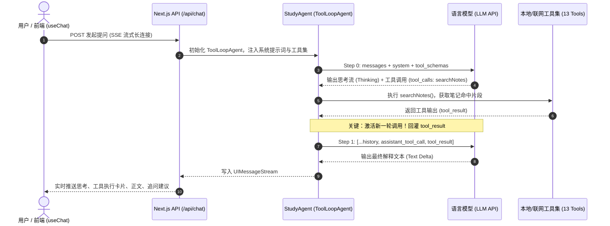
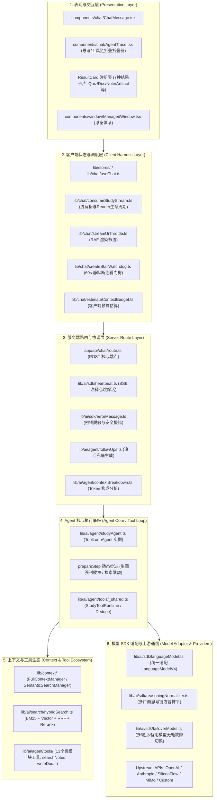
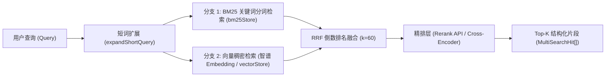
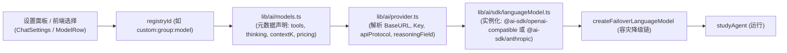

# 全局视角：项目 Agent 架构体系深度分析与演进规划

> **项目**：`StudyReview-Platform` (期末复习工作站 · 多学科辅助学习应用)  
> **核心底座**：Next.js 16 (React 19) + Vercel AI SDK 7 (`ToolLoopAgent`) + TypeScript  
> **状态评估**：刚刚完成《22 · Agent 架构体系收敛》，整体架构正处于从“初级单体脚本”迈向“企业级模块化 Agent 运行时”的高成熟度过渡阶段。

---

## 目录
1. [执行模型辨析：单次调用还是多次调用？](#1-执行模型辨析单次调用还是多次调用)
2. [全局 Agent 架构全景图](#2-全局-agent-架构全景图)
3. [维度一：上下文工程 (Context Engineering)](#3-维度一上下文工程-context-engineering)
4. [维度二：“H” 的工程体系深度剖析](#4-维度二h-的工程体系深度剖析)
5. [维度三：目前的 Harness（运行底座）做得怎么样？](#5-维度三目前的-harness运行底座做得怎么样)
6. [维度四：多模型接入机制与未来扩展指南](#6-维度四多模型接入机制与未来扩展指南)
7. [架构可持续性与高可用性规划建议](#7-架构可持续性与高可用性规划建议)

---

## 1. 执行模型辨析：单次调用还是多次调用？

### 结论：当前是标准的「多次调用循环（Multi-step Tool Loop）」

你在提问中提到：
> *“我不知道目前是单次调用还是多次调用。比如，我们约定好的提示词会要求 Agent 把工具调用相关的部分写在输出的最下方。停止这次调用后，因为有了这次工具调用，它就会激活新的调用，并把新调用出来的上下文补充进去……”*

这段描述非常精准地还原了 **早代基于提示词约定的 ReAct 文本模式（Prompt-based Tool Calling）**。而在本项目中，**已经全面升级为了基于 Vercel AI SDK 的原生多轮工具循环架构**：



### 核心运作机制与特征：
1. **执行引擎**：[`lib/ai/agent/studyAgent.ts`](file:///d:/projects/Dev-Tools/StudyReview-Platform/lib/ai/agent/studyAgent.ts) 实例化了 `new ToolLoopAgent<never, ToolSet>({ ... })`。
2. **最大循环步数**：由 [`lib/ai/agent/tools/_shared.ts`](file:///d:/projects/Dev-Tools/StudyReview-Platform/lib/ai/agent/tools/_shared.ts) 定义 `MAX_TOOL_STEPS = 6`。即一次用户交互中，Agent 最多可以连续调用 6 轮工具，直到模型自发产生自然语言终态回答或步数耗尽。
3. **协议层而非文本正则层**：
   - 工具调用不是靠提示词约定“写在正文末尾”，而是采用 OpenAI / Anthropic 原生的 **Function Calling 协议（JSON Schema）**。
   - 工具的入参校验由 Zod 在客户端与服务端强校验。
   - 工具执行结果通过 `toText` 封装后，作为 `role: 'tool'` 消息注入对话上下文，自动触发下一轮调用。
4. **单流多段（Multiplexed Single SSE Stream）**：
   - 尽管后端可能与 LLM 进行了 2~4 次 API 往返，但面向前端只保持一个持久 SSE 连接。
   - 通过 `createUIMessageStream`，思考过程（`reasoning`）、工具执行卡片（`tool-xxx`）、正文（`text-delta`）、消耗统计（`data-usage`）、上下文分解（`data-context-breakdown`）以统一有序的 UIMessageChunk 格式平滑下发。

---

## 2. 全局 Agent 架构全景图

整个系统遵循清晰的**分层单向依赖架构**，自下而上分为六层：



---

## 3. 维度一：上下文工程 (Context Engineering)

本项目在上下文工程上的设计极为严谨，解决了一般 AI 应用常见的“爆 Token”、“缓存未命中费用飙升”、“工具轮次冗余信息爆炸”等痛点。

### 3.1 稳定前缀与 KV Cache (Prefix Caching) 优化
在大模型按 Token 计费且长上下文延迟高的背景下，**命中断点缓存（Prefix Cache）是降低延迟和费用的核心**。
- **逐字节确定性组装**（[`studyAgent.ts:68-93`](file:///d:/projects/Dev-Tools/StudyReview-Platform/lib/ai/agent/studyAgent.ts#L68-L93)）：
  - System 提示词按照 `通识规范 (Base) -> 生图规则 -> 全局补充上下文 (GlobalContext) -> 固定技能 (Pinned Skills) -> 候选技能菜单 (SkillsMenu)` 的严格固定顺序排序拼接。
  - 用户安装的 Skills 按照 `createdAt` 和 `id` 排序，杜绝数组顺序漂移。
- **易变上下文后置隔离**（`Volatile Context`）：
  - 当前浏览路径定位（`buildLocationLine`）和检索出来的参考材料（`referenceContext`）作为 System 的尾部追加内容（`instructions = ${systemPrompt}\n\n${volatile}`）。
  - 保证前半部分（数十 KB）在多轮对话中永远不变，最大化触发 SiliconFlow / DeepSeek / Claude 的缓存命中。

### 3.2 技能按需加载机制（Skill Menu vs Pinned）
- **痛点**：如果用户写了 10 个专业复习技能，全部塞进 System Prompt 会瞬间吃掉 10,000+ Tokens。
- **解法**：
  - **Pinned 技能**：用户显式置顶的技能，全文注入。
  - **Menu 技能**：非置顶技能仅提取“名称 + 简要描述”生成几行的轻量菜单，同时暴露 `useSkill(name)` 工具。只有当模型判定需要该技能时，才通过 Tool Call 动态拉取全文。这是典型的 **Context Pruning（上下文剪枝）** 经典设计。

### 3.3 双上下文模式（Full vs Semantic）
在 [`lib/context/`](file:///d:/projects/Dev-Tools/StudyReview-Platform/lib/context/) 中抽象了 `ContextManager` 接口：
1. **Full 模式（`FullContextManager`）**：
   - 提取整门课程目录树摘要（`buildTreeSummary`，带内存模块级缓存，运行时只构建一次）。
   - 读取当前章节的 Markdown 全文。适合短章节、需要建立宏观学科视野的提问。
2. **Semantic 模式（`SemanticSearchManager`）**：
   - 当前页面全文 + 混合检索（`hybridSearch`）检索出的 Top 5 相关段落。适合跨学科大课件库精准提炼。

### 3.4 80% 软上限熔断与优雅降级（Soft Limit Budgeting）
- **客户端**：[`estimateContextBudget.ts`](file:///d:/projects/Dev-Tools/StudyReview-Platform/lib/chat/estimateContextBudget.ts) 结合模型上限（`models.ts:contextK`）实时预估用户输入与历史消息。
- **服务端**：[`app/api/chat/route.ts:149-161`](file:///d:/projects/Dev-Tools/StudyReview-Platform/app/api/chat/route.ts#L149-L161)
  ```ts
  const serverSoftLimitReached = contextBudget > 0 && ctxResult.tokenCount / contextBudget >= 0.8;
  const contextTruncated = body.contextTruncated || serverSoftLimitReached || ctxResult.overflow;
  ```
- **熔断策略**：一旦达到 80% 软上限，系统自动**剔除重型参考材料（Reference Context）**，并在 System 中注入轻量指导语告知模型：“当前达到软上限，本次仅依据最近消息作答”，同时前端向用户显示透明警示条。

### 3.5 多轮工具调用内的上下文去重（In-Flight Deduplication）
- **痛点**：在单次会话的 6 步工具迭代中，如果模型第 1 步搜了“细胞膜”，第 2 步又调用了“查看细胞膜大纲”，大量重复文字会反复灌回 Prompt。
- **解法**：[`lib/ai/agent/tools/_shared.ts`](file:///d:/projects/Dev-Tools/StudyReview-Platform/lib/ai/agent/tools/_shared.ts#L36-L52) 的 `dedupeByContextKey`：
  - 运行时维护 `loadedContextKeys: Set<string>`。
  - 若同一 `contextKey` 在本轮链路已被注入，直接拦截替换为简明标记：`【上下文已加载】xxx 的上下文已在本次对话工具链中注入过，请引用前文已加载内容，不要重复展开全文。`
  - `toText` 严格保证只把文本回灌给模型，滤除前端专用的 UI/图表渲染 JSON。

### 3.6 上下文透明化遥测（Context Breakdown）
服务端计算完后下发 `data-context-breakdown`，前端能精确查看到本次请求中：Tools、Skills、Conversation、Pages、WebSearch 各占用了多少 Tokens，是否命中缓存，是否有截断。

---

## 4. 维度二：“H” 的工程体系深度剖析

在本项目与现代 Agent 体系中，“H” 主要涵盖了以下四大核心工程板块（首要为 **Hybrid Search**，并兼顾 **Human-in-the-loop**、**History** 与 **Heartbeat**）：

### 4.1 H = Hybrid Search（混合检索 / RAG 知识检索工程）
这是位于 [`lib/ai/search/hybridSearch.ts`](file:///d:/projects/Dev-Tools/StudyReview-Platform/lib/ai/search/hybridSearch.ts) 的完整工业级 RAG 检索子系统：



- **双路并行召回**：
  - **BM25**：基于本地分词倒排索引，对专业术语、专有名词、定理名称具备极高的精确匹配召回率。
  - **Vector Search**：基于语义嵌入，对同义表述、泛化意图进行语义召回。
- **RRF (Reciprocal Rank Fusion) 融合**：
  - 核心公式：$RRF\_Score = \sum \frac{1}{k + rank_i}$（默认 $k=60$）。
  - 解决了“关键词得分与向量余弦相似度数值分布不可比”的行业难题。
- **两阶段精排（Rerank）**：
  - 融合初步结果后，调用专用 Rerank 模型 API 重新打分，提取前 5 个最紧密相关的 Chunk。
- **工程细节优化**：
  - **短查询防漂移**（`expandShortQuery`）：查询 $\le 2$ 个汉字时（例如“绪论”），自动将当前页面标题拼入向量检索，防止语义漂移至其他学科。
  - **学科亲和力加权**（`preferSubjectId`）：优先保障当前正在复习学科的内容露出。
  - **全链路诊断**（`SearchDiagnostics`）：毫秒级记录分词数、向量数、融合耗时与异常状态。

### 4.2 H = Human-in-the-loop（人机协同与确认工程）
在 [`lib/chat/buildTrace.ts`](file:///d:/projects/Dev-Tools/StudyReview-Platform/lib/chat/buildTrace.ts) 中，已经具备了标准的 HITL 状态机接口：
- 工具 Part 支持 `approval-requested`、`approval-responded`、`output-denied` 等生命周期状态。
- 在敏感工具（如未来接入修改文件、外发邮件或高额外部 API）被触发时，Agent 能够挂起等待用户在 UI 上点击“批准”或“拒绝”后方可继续推进。
- 在交互产物（如 `writeDocument` 分节大纲、`renderInteractive` 生成 HTML 代码、`createQuiz` 试题卡片）中，用户可以随时干预修改正文或独立打开浮窗体验。

### 4.3 H = History（会话历史与长记忆工程）
- **轻重分离的存储体系**：
  - 采用 IndexedDB v2 架构，划分 `chat-manifest`（目录与标题）、`chat-session:*`（会话正文）、`chat-blob:*`（图片/媒体大对象）。
- **请求时剥离历史冗余（Context Pruning）**：
  - 前端向后端提交历史时，通过 `toModelMessages` 彻底剥离历史消息里的中间思考（Reasoning）与复杂 UI 工具部件，只回传精简后的最终文本与文件附件，防止多轮历史产生 Token 滚雪球效应。

### 4.4 H = Heartbeat（长连接心跳保活工程）
- 位于 [`lib/ai/sdk/heartbeat.ts`](file:///d:/projects/Dev-Tools/StudyReview-Platform/lib/ai/sdk/heartbeat.ts)。
- 在深度思考（如 DeepSeek-R1 / Qwen3.8 27B 思考 20+ 秒）或连续多步工具执行时，很多反向代理（Nginx、Cloudflare 等）会在 15~30 秒无响应时强制切断连接。
- 通过包装流并在底层注入 SSE 注释心跳帧（`: keep-alive\n\n`），保证客户端与上游网关连接稳定存活。

---

## 5. 维度三：目前的 Harness（运行底座）做得怎么样？

### 5.1 什么是 Agent Harness？
在现代 AI 系统工程中，**LLM 本身只是“预测下一个 Token 的计算器”；而负责提示词注入、多轮工具迭代、工具参数校验、错误重试、格式归一化、超时保护、数据追踪的整套脚手架代码，统称为 Agent Harness（运行底座）**。

### 5.2 项目当前 Harness 的结构透视
项目目前是由**服务端 Agent 驱动底座**与**客户端流消费底座**协同构成的轻量级（Lightweight）Harness：

```
[服务端 Harness]
├─ studyAgent.ts          -> 基于 ToolLoopAgent 的多轮控制循环 (MAX_TOOL_STEPS=6)
├─ prepareStep()          -> 步进拦截器 (生图模式收窄 / imageSearch 配额阻断)
├─ failoverModel.ts       -> 端点与备用模型降级 Harness (无感主备切换)
├─ reasoningNormalizer.ts -> 思考链方言抹平 Harness (适配非标字段/标签提取)
├─ heartbeat.ts           -> SSE 长连接保活 Harness
└─ errorMessage.ts        -> 安全脱敏与错误格式化 Harness

[客户端 Harness]
├─ consumeStudyStream.ts  -> SSE 协议解析、ReadableStream 生命周期管理
├─ buildTrace.ts          -> 状态机追踪 (running / complete / error / interrupted / waiting)
├─ createStallWatchdog.ts -> 60s 静默看门狗 (检测流假死并中断释放)
└─ streamUiThrottle.ts    -> RAF 级别 UI 渲染节流 (防高频打爆 DOM)
```

### 5.3 现状客观评价：做得好的地方
1. **协议标准化与低耦合**：
   - 抛弃了脆弱的“Prompt 自定义标记解析”，拥抱 AI SDK 7 标准 `ToolLoopAgent`。
   - 工具生态在刚刚执行完毕的计划 22 中彻底完成解耦，13 个工具全部独立目录（`types.ts` + `presentation.ts` + `tool.ts` + `ResultCard.tsx`），扩展新工具极为清爽。
2. **多厂商方言平滑层极其出色（`reasoningNormalizer`）**：
   - 国内外模型思考字段混乱：OpenAI 叫 `reasoning`，SiliconFlow 叫 `reasoning_content`，Anthropic 叫 `thinking`，DeepSeek 塞在正文 `<think>` 标签里。
   - 本项目通过 `createReasoningNormalizingFetch` 中间件与 `extractReasoningMiddleware`，在网络字节到达 SDK 前全部自动格式化，上层业务毫无感知。
3. **健壮的容灾与防浪费机制**：
   - 具备 `failoverModel` 自动端点重试与降级。
   - 上游流报错后立即 `generationAbort.abort()`，阻断后续追问生成，防止产生非预期计费。
   - 具备 60 秒 Stall Watchdog，防止请求悬挂。

### 5.4 现状评估：存在的局限与瓶颈
1. **单体串行 Agent，缺乏多智能体或子 Agent（Sub-Agent）编排**：
   - 目前所有职责（出题、写文档、画图、查笔记、网络搜索）全由单一 `study-tutor` 承担。
   - 例如 `writeDocument` 工具生成长文档时，耗时可达 30~60 秒，若在单次会话循环中执行容易导致主聊天线程阻塞。
2. **缺乏工具调用的“自我反思与验证（Reflection / Critique）”**：
   - 目前工具执行后直接将原始输出回灌。如果工具返回空结果（如搜笔记返回 0 hits），模型有时会产生幻觉，而不是自我纠正换个关键词重新搜索。
3. **缺乏代码执行沙箱（Sandbox Harness）**：
   - 目前的 HTML 组件交互是直接由前端 iframe 渲染，尚无受限的 Node/Python 代码执行沙箱（无法像 Code Interpreter 那样执行数学脚本）。

---

## 6. 维度四：多模型接入机制与未来扩展指南

项目采用了 **“能力声明 - 凭证解析 - 协议适配 - 动态降级”** 四层解耦的模型接入机制。

### 6.1 现有模型接入管道分析



目前支持的协议类型（`CustomApiProtocol`）：
- `openai`：OpenAI 兼容格式（适用于 OpenAI、DeepSeek、Qwen、GLM、Kimi、Ollama、One-API、New-API、OpenRouter 等 90% 以上模型）。
- `siliconflow`：硅基流动优化协议（支持其特殊的生图路由与 reasoning 字段映射）。
- `anthropic`：Anthropic 官方协议（支持 Claude 原生 thinking 签名与分片 JSON 工具调用）。

---

### 6.2 未来接入各种各样模型的操作指南

#### 场景 1：接入新的 OpenAI 兼容模型（如 DeepSeek-V3/R1、本地 Ollama/vLLM、新代理商）
**几乎零代码，全配置化支持**：
- **方式 A（用户在 UI 自行添加）**：
  - 进入「设置」->「API 分组」->「添加分组」。
  - 填入 BaseURL、API Key，协议选择 `OpenAI`。
  - 点击“拉取模型”或手动填写模型 ID（例如 `deepseek-ai/DeepSeek-R1`），勾选“支持工具”或“思考模型”。
- **方式 B（作为项目内置预设模型集成）**：
  1. 打开 [`lib/ai/models.ts`](file:///d:/projects/Dev-Tools/StudyReview-Platform/lib/ai/models.ts)，在 `MODELS` 数组中追加配置：
     ```ts
     {
       id: "deepseek-r1",
       label: "DeepSeek R1 (推理旗舰)",
       group: "深度思考",
       thinking: true,
       thinkingRequired: true,
       thinkingLevels: ["medium", "high", "max"],
       tools: true,
       vision: false,
       contextK: 64,
       endpoints: [
         { provider: "relay", apiModelId: "deepseek-reasoner" },
         { provider: "siliconflow", apiModelId: "deepseek-ai/DeepSeek-R1" }, // 备用端点
       ],
       pricing: { input: 4, cachedInput: 1, output: 16 },
       hint: "极高数学与逻辑推理能力",
     }
     ```
  2. 即可自动享受多端点 Failover、思考链自动抽取与计费统计。

#### 场景 2：接入全新的异构厂商 SDK（如 Google Gemini 原生 SDK、Mistral 等）
当某个厂商无法通过 OpenAI 兼容协议良好运作（例如 Gemini 的原生 Live/Search 特性），需引入原生 SDK：
1. **安装对应 Provider**：
   ```bash
   pnpm add @ai-sdk/google
   ```
2. **在类型中声明新协议**：
   - 在 [`lib/ai/models.ts`](file:///d:/projects/Dev-Tools/StudyReview-Platform/lib/ai/models.ts) 中将 `CustomApiProtocol` 扩展为：
     ```ts
     export type CustomApiProtocol = "openai" | "anthropic" | "siliconflow" | "google";
     ```
3. **在工厂中接入解析**：
   - 打开 [`lib/ai/sdk/languageModel.ts`](file:///d:/projects/Dev-Tools/StudyReview-Platform/lib/ai/sdk/languageModel.ts)，在 `buildBaseModel` 中加入分支：
     ```ts
     if (p.apiProtocol === "google") {
       const google = createGoogleGenerativeAI({ baseURL: p.baseUrl, apiKey: p.apiKey });
       return google(p.apiModelId);
     }
     ```
4. **思考与配置映射**：
   - 在 `lib/ai/provider.ts` 的 `autoConfigFromProtocol` 中针对新协议配置其 `thinkingRequestStyle`。

#### 场景 3：接入多模态输入（语音/视频）与结构化输出（Structured Outputs）
- **视觉能力**：已有 `modelInfo.vision` 门禁标记。若模型 `vision: false`，发送带图消息会被前置拦截并友好提示。
- **结构化输出**：AI SDK 7 原生支持 `generateObject` / `streamObject`，若未来需要强制模型输出特定 JSON Schema（如严格格式的选择题），可在工具层或独立端点直接利用已接入的 `resolved.model` 调用，无需额外开发。

---

## 7. 架构可持续性与高可用性规划建议

为了让当前的 Agent 板块具备更强的可持续演进能力与企业级可用性，建议在未来的版本规划中分阶段落地以下优化：

| 演进方向 | 当前现状 | 建议优化策略 | 收益与价值 |
|---|---|---|---|
| **1. 智能工具反思 (Tool Reflection)** | 工具出错或无命中直接返回空文本，模型容易产生幻觉 | 在 `ToolModule` 增加 `validateOutput` 与重试提示机制，若检索为空自动提示“换个近义词重试” | 显著降低模型幻觉，提升复杂题目的解题正确率 |
| **2. 长任务异步子 Agent (Sub-Agent Handoff)** | `writeDocument` 长文档撰写在主对话中串行等待 | 引入 Background Agent 编排；主 Agent 仅生成 Task ID，由后台独立 Agent 循环撰写并推送通知 | 解决长任务阻塞主会话流、用户等待时间过长的问题 |
| **3. 评测基准 Harness (Evaluation Harness)** | 依赖手工发消息真机验证工具表现 | 建立轻量级自动化评测套件（基于现有 `tests/api/chat-sdk.test.ts`），针对 13 个工具构造标准问答集定期打分 | 保证模型或 Prompt 升级时，工具调用与召回能力不回退 |
| **4. 向量库本地化与跨端持久** | 向量检索强依赖在线智谱/SiliconFlow Embedding API | 探索轻量本地 Embedding（如 ONNX 运行 bge-micro / all-MiniLM）或混合持久化向量缓存 | 提升无网或弱网桌面端环境下的离线复习可用性 |
| **5. 思考链自适应隐藏与折叠** | 用户开启深度思考后，偶有思考内容超长拖慢体验 | UI 侧已有 `AgentTrace` 折叠，进一步支持服务端“思考步数感知”与思考摘要压缩 | 提升阅读体验与移动端流畅度 |

---

## 总结

你目前项目中的 Agent 架构**并非简单的单次请求拼装，而是一个成熟、现代且规范的原生多步工具循环（Multi-step Tool Loop）体系**。

在上下文工程层面，具备严格的 KV Cache 命中优化、技能按需菜单式剪枝和 80% 软上限熔断保护；在混合检索（H = Hybrid Search）层面，具备 BM25 与 Vector 的并行 RRF 融合与 Rerank 精排；在 Harness 底座层面，具备强大的思考链抹平、故障无缝切换与流式安全拦截；在模型接入层面，已实现主流协议全覆盖与高度配置化。整个模块架构健康度优良，具备非常强大的长远演进空间。
