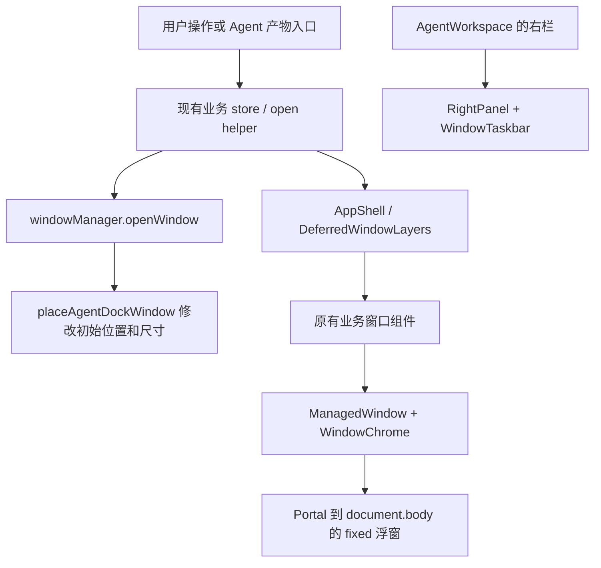
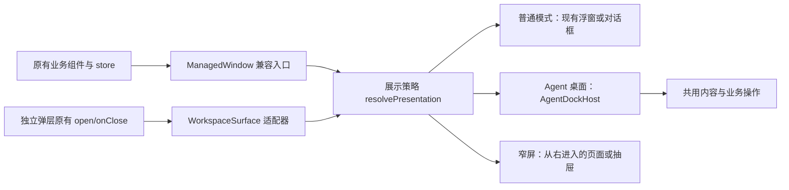

# Agent 模式右侧工作区统一改造规划

日期：2026-09-19  
分析基线：本地工作区，Git HEAD `3445f3c8`  
状态：方案与实施规划，尚未修改功能代码。单人分析，未使用子智能体。

> **落地状态（2026-09-19 更新）**：本文件是改造**前的现状分析与方案**，第 3 节的“现状”描述的是改造前的代码。
> 实际落地以外壳实现与 `agent-right-panel-unification.execution.md` 为准。方案里出现、但落地后已被替换或退役的设计：
> `WorkspaceSurface`（未采用）、`placeAgentDockWindow` / `agentDockRect` / `fallbackAgentDockRect` /
> `agentFullscreenPanelId`（右栏改为稳定宿主后整模块退役）、`RightPanel.hideAiTab`（并入 `hideBuiltinTabs`）、
> `useHydratedSetting`（改为设置 store 默认值 + `hydrateSettings()`）。

## 1. 建议采用的方案

**保留现有业务组件、打开入口和业务 store，以 `ManagedWindow` 为兼容入口，增加统一的展示策略和右侧宿主。普通模式沿用浮窗，Agent 桌面模式将同一份内容放进右侧工作区。独立弹层通过薄适配器接入。**

这里真正需要统一的是“内容在哪里展示、由谁控制窗口、怎样切换与关闭”，而不只是进场动画。截图中的核心关系是：中央对话与右侧内容并排，右侧有标签、工具栏和内容区。它可以在展开时从右侧进入，但展开后应参与布局，不能持续压住中央对话。

本项目已经完成了大量组件复用，不需要推倒重来。静态检索发现：

- `ManagedWindowType` 定义了 **17 种窗口类型**。
- **18 个业务组件**使用 `<ManagedWindow>`；数量不同是因为个人笔记与课堂便签等共用窗口类型。
- Agent 已有三栏布局、右栏缩放、窗口任务栏和右侧定位辅助函数。
- 设置、登录、账号等独立弹层没有经过该公共外壳，不能靠改 `ManagedWindow` 自动覆盖。

因此，工作量应集中在公共基础设施和少数布局不适合窄栏的组件，而不是为每个模块写一个 Agent 版本。不要引入新的窗口库，也不需要重写 AI 工具协议。

## 2. 分析范围与证据边界

本次阅读了项目入口、Agent 布局、窗口管理器、公共外壳、窗口加载层、快捷键/浮层栈，以及文档、笔记、浮动聊天和设置等代表性组件；检索了业务组件中的 `ManagedWindow`、`createPortal` 和定位相关代码。

本报告中的“现状”来自源码；标注的风险是根据代码推导，**没有启动应用逐项复现，也没有声称已经完成视觉验收**。截图只作为用户提供的布局参考，不将其中的文字或项目历史计划当作额外执行指令。已有文档中的多智能体工作流不用于本任务。

本次交付仅为规划文档。工作区原有 `docs/README.md` 修改与 `docs/design-snapshots/` 内容不纳入本次改动。

## 3. 当前调用链与根因

### 3.1 当前链路



右栏和窗口内容当前是两套并行结构。右栏有窗口入口，但实际窗口内容仍在 `document.body` 上。

| 代码位置 | 已核实的行为 | 对方案的影响 |
|---|---|---|
| [AgentWorkspace.tsx](../../components/layout/AgentWorkspace.tsx) | `PanelGroup` 三栏；右栏默认 28%、最小 16%、最大 44%；收起时条件卸载右栏 | 可以沿用分栏；需改变右侧宿主的卸载行为 |
| [RightPanel.tsx](../../components/layout/RightPanel.tsx) | `hideAiTab/showWindowDock` 控制栏目和任务栏；内容仍是视频、交互、浏览器等 | 新工作区需统一决定显示哪个内容，不能只加第三层标题栏 |
| [windowManager.ts](../../lib/stores/windowManager.ts) | `openWindow` 内调用 `placeAgentDockWindow`，维护几何、层级和激活状态 | 存储层混入了展示层的 DOM 测量副作用 |
| [agentDock.ts](../../lib/workspace/agentDock.ts) | 打开右栏、读矩形、右对齐；宽度允许大于右栏，最高按视口 62% 限制 | 只是右对齐浮窗，宽窗口仍可能向左覆盖对话 |
| [ManagedWindow.tsx](../../components/window/ManagedWindow.tsx) | 所有窗口 Portal 到 body；使用 fixed 坐标、阴影、圆角和缩放把手 | 最有效的统一改造入口 |
| [useManagedWindowChrome.ts](../../lib/hooks/useManagedWindowChrome.ts) | 连接拖动、缩放、全屏、Esc；Agent 仅跳过拖动提交 | 需要在接线层禁用行为，不能只隐藏按钮 |
| [useDraggable.ts](../../lib/hooks/useDraggable.ts) | 拖动过程中先直接写 DOM transform，抬手才提交 | 跳过提交仍可能发生临时拖动与回弹 |
| [useFullscreenTrack.ts](../../lib/hooks/useFullscreenTrack.ts) | 只有全屏开启才追踪目标栏尺寸 | 普通右对齐窗口不保证跟随分栏变化 |
| [WindowTaskbar.tsx](../../components/window/WindowTaskbar.tsx) | 图标点击切换最小化/恢复 | 不能直接把原图标条当成常规标签栏 |
| [AgentSettingsOverlay.tsx](../../components/chat/AgentSettingsOverlay.tsx) | 独立 body Portal，桌面居中，内部复用 ChatSettings | 需要桥接外壳，设置内容无需重写 |

### 3.2 需要一起解决的问题

1. **窗口外壳与宿主不一致。** 新右栏应是内容的实际容器，停止为每个窗口计算“看起来在右栏”的屏幕坐标。
2. **显示与交互状态没有统一。** `minimizeWindow` 没有同步选取新的激活窗口；`getActiveManagedWindow` 可以返回已最小化的 active 项；公共 Esc 注册只检查窗口是否存在。迁移为隐藏标签页后，这些问题会更明显。
3. **业务关闭不能简化为删窗口记录。** 笔记、文档、聊天分别维护打开状态和清理逻辑。[windowActions.ts](../../lib/keyboard/windowActions.ts) 已有按类型关闭分发；但它与实际组件 `onClose` 仍需核对，例如浮动聊天的 `handleClose` 还清理 Token tracker。
4. **不是所有窗口天然支持多开。** [ArtifactViewer.tsx](../../components/chat/ArtifactViewer.tsx)、[DocumentViewer.tsx](../../components/chat/DocumentViewer.tsx) 读取单个 `viewerId`。标签壳不能凭空渲染第二个实例。
5. **当前测试验证的是旧目标。** `agentDock.test.tsx` 验证右对齐坐标；`AgentWorkspace.test.tsx` 还明确断言收起时卸载右栏。新方案必须同步更新契约，不能保留这些断言再绕过它们。

## 4. “所有弹窗从右边出现”的具体定义

建议统一所有承载完整业务流程或结果的窗口，同时按交互语义处理附属浮层。以下是方案建议，不是从截图推断出的 Codex 内部实现。

| 表面类别 | Agent 模式中的目标 | 原因 |
|---|---|---|
| 文档、产物、笔记、预览、账单、设置、账号、登录等独立功能窗口 | 右侧工作区标签页 | 与中央对话并行使用，统一打开和关闭体验 |
| 删除确认、输入上限提示、人机验证等阻塞性对话 | 右侧所属窗口中的局部对话层，必要时右侧模态抽屉 | 保留确认/验证语义，避免每次确认都新增标签 |
| 下拉菜单、模型选择、右键菜单、工具提示、划词工具条 | 保持锚定触发点 | 它们属于当前操作的附属控件；改为远处标签会割裂操作 |
| 图片 Lightbox、画布放大 | 从右侧内容打开；用户明确选择放大时才覆盖更大区域 | 默认统一入口，保留查看细节的能力 |
| 浏览器原生文件选择、系统权限、原生验证挑战 | 系统控制 | 网页展示层无法可靠改写这些窗口 |

全局搜索、快捷键帮助、额度面板目前也是独立浮层，最终统一范围应显式登记：建议桌面 Agent 下改为右侧工具页。搜索输入栏可以仍然紧凑，但不能无记录地漏在中央。

必须把“业务窗口全部接入”和“附属菜单保留锚定”写入验收清单。不能以保留少数弹层为由让设置、账号等主要界面永远留在中央。

## 5. 方案比较

| 方案 | 初始成本 | 复用程度 | 主要问题 | 结论 |
|---|---|---|---|---|
| 全局 CSS 强制 `right:0` | 很低 | 高 | 无法处理内联几何、Portal、焦点、多个窗口、业务关闭；只能改变外观 | 不作为正式方案 |
| 为 20–30 个组件分别增加 Agent 分支 | 高 | 表面复用，容器逻辑重复 | 分支越来越多，后续每个组件都要维护两套行为 | 不采用 |
| 把所有 body Portal 全局重定向 | 看似很低 | 不确定 | 菜单、验证框和对话框语义不同；改变容器不等于改变 fixed 定位 | 不采用 |
| 公共窗口壳按模式选择宿主，独立弹层薄适配 | 中等且集中 | 高 | 要明确状态寿命、关闭分发和窄栏布局 | **推荐** |
| 引入完整桌面窗口/停靠框架 | 高 | 需要大量接入 | 现有 store、Portal、工具链均需迁移，本任务收益不足 | 暂不采用 |

“取巧”的合适位置是已有的窗口边界，不是全局劫持 React 或覆盖所有弹层 CSS。

## 6. 推荐架构与最小兼容接口

### 6.1 四个职责



- **业务层**：继续负责内容、请求、导出、保存和真实关闭；不感知 Agent 的坐标。
- **展示策略**：根据应用模式、设备宽度、表面类别和能力决定展示形式；应为可独立测试的纯逻辑。
- **宿主**：负责标签、容器布局、活动项、收起、扩展和入场动效。
- **公共外壳**：转接现有 `title/icon/actions/onClose/children`，避免业务 JSX 复制。

### 6.2 保持旧 API，增量添加可选能力

以下是拟议契约，不是可直接复制上线的完整实现：

```ts
type SurfacePresentation = "floating" | "dock" | "sheet" | "modal";
type SurfaceKind = "workspace" | "confirmation" | "anchored";

type SurfacePolicy = {
  preferredWidth?: number;       // 提示值，不强制挤压中央对话
  compactBelow?: number;         // 内容区宽度，而非浏览器宽度
  inactivePolicy?: "retain" | "suspend";
  allowExpand?: boolean;
};

type SurfaceRuntime = {
  presentation: SurfacePresentation;
  visible: boolean;
  active: boolean;
  contentWidth: number;
};
```

1. `ManagedWindow` 原有必填 props 不变；新增 `surfacePolicy?`。统一默认值覆盖绝大多数调用方。
2. 在外壳内使用响应式 `useAppMode` 和设备信息，不能仅调用不订阅的 `isAgentWorkspace()` 期待模式变化自动渲染。
3. 在外壳内部提供 `SurfaceRuntime` context，少数组件需要时读取实际可见性或内容宽度。
4. 类型到默认策略的表只存元数据，放在 `lib/window/`；不要在 lib 导入 UI 组件或把所有动态窗口都静态引入。
5. `fullscreenTarget`、`frameStyle`、`minSize`、`unmountWhenMinimized` 继续保留兼容，但按展示形式解释；浮窗阴影、缩放动画、屏幕坐标不应覆盖 dock 布局。

### 6.3 右侧宿主的实际结构

建议新增 `AgentDockHost`、`AgentDockTabs` 和一个轻量运行时注册/控制模块。保留 `DeferredWindowLayers` 在 AppShell 的原有业务挂载位置，业务组件仍在那里构造内容，通过公共外壳 Portal 到右侧专用内容节点。

宿主节点必须放在右侧标签栏下方，不能直接用包住整个 RightPanel 的 `RIGHT_PANEL_ID` 作内容节点，否则窗口可能覆盖标签和收起按钮。新增例如 `agent-dock-content` 的明确目标；`RIGHT_PANEL_ID` 保留既有兼容含义。

右侧工作区只有一个活动内容来源：

```ts
type DockActiveRef =
  | { kind: "managed"; id: string }
  | { kind: "external"; id: string }
  | { kind: "builtin"; id: "video" | "interactive" | "browser" }
  | null;
```

`DockActiveRef` 是右侧“当前看什么”的唯一真相源；`windowManager` 继续拥有窗口列表和浮窗几何。激活 managed 项时通过一个动作同步 `activeWindowId`；激活 built-in/external 项时清除 managed 活动标记，让旧快捷键不会误操作隐藏窗口。不要再维护一份复制的 `dockWindows[]`。

复用 WindowTaskbar 的图标、溢出菜单、加号能力；标签点击改为激活，重复点击活动标签不最小化。关闭按钮调用真实关闭，收起按钮控制整个右栏。原任务栏在 Studio 保留其行为。

`RightPanel` 中视频、交互、浏览器的业务内容继续复用，可以作为固定工具入口/标签接入同一个 active ref。第一阶段允许它们作为无活动窗口时的默认工具视图，但选择工具时必须明确取消当前 managed 页的显示，避免“工具已切换但被浮窗挡住”。

### 6.4 独立弹层的适配

新增 `WorkspaceSurface` 薄适配器，消费原来的 `open`、`onClose`、标题和内容：

```tsx
<WorkspaceSurface id="agent-settings" open={open}
  title="设置" onClose={onClose} kind="workspace">
  <ChatSettings onClose={onClose} showBack={false} navPlacement="top" />
</WorkspaceSurface>
```

这只是 Agent 分支的示意。Studio 原有居中/锚定外壳可以保留在组件中，逐个替换最外层包装，不要为了统一而同时重做所有非 Agent 样式。

外部表面的打开状态仍由原 store/父组件持有。运行时只登记元数据和命令，不再持久化第二个 `open`。注册表不得写入 ReactNode、DOM 节点或函数到 IndexedDB；函数通过运行时 ref 保存并在卸载时注销。重复 render 更新回调不能重新抢占活动标签，只有真正的打开/激活事件才切换。

Provider 若放在 AgentWorkspace 内，无法覆盖 AppShell 下的 `DeferredWindowLayers`。因此共享运行时应在 AppShell 的共同祖先提供，右侧 Host 只登记自己可用的目标节点。Portal 继承的是原 React 祖先的 context，不是 DOM 落点的 context。[React Portal 文档](https://react.dev/reference/react-dom/createPortal)

## 7. 窗口生命周期与状态规则

### 7.1 操作契约

| 操作 | Agent 目标行为 | 必须防止的问题 |
|---|---|---|
| 打开新内容 | 自动展开右栏并激活对应页，宿主准备好后再展示 | 先在中央/旧位置闪一下，再搬到右边 |
| 再次打开同一实例 | 复用该页并激活，更新业务数据 | 重复标签、重复请求、重置输入 |
| 切换标签 | 前一页隐藏，下一页显示 | 把切换实现成关闭或最小化 |
| 收起右栏 | 隐藏整个宿主，保留活动引用及内容状态 | 卸载全部编辑器、丢输入 |
| 关闭活动页 | 调用业务关闭，选择仍存在的最近活动项或默认工具页 | 只删窗口记录，留下业务打开标记 |
| 最小化旧窗口 | 兼容旧 API：窗口保留但退出活动候选，激活下一项 | active 指向已最小化窗口 |
| 扩展工作区 | 改右栏占比，收缩其他栏，保留可恢复布局 | 每个窗口各自变更几何，互相影响 |
| 切换应用模式 | 根据展示策略重建外壳，恢复正确内容和各模式几何 | Agent 宽度覆盖 Studio 上次浮窗位置 |

宿主还没挂载时，只登记待展示状态并等待 callback ref 通知目标可用。不要轮询 DOM，也不要先回退到 body 浮窗。展开布局应由 UI 控制层发起，逐步从 `windowManager.openWindow` 移除 DOM 测量和 `flushSync` 副作用。

### 7.2 标签切换与模式切换需要分开处理

同一 Agent 会话内，标签切换、收起和扩展应保持 Portal 目标节点与 `key` 稳定，隐藏非活动面板，不用 `key={activeId}` 包裹整组内容。右侧 Panel 使用可收起但不销毁 Host 的结构；改掉当前 `!rightCollapsed && ...` 条件卸载，配合布局库的可折叠能力实现。

但从 body 浮窗切成右侧 Portal，目标 DOM 节点确实发生变化，React 会重建 Portal 内容。只保持 windowId 相同无法消除这个问题。[React createPortal 参数说明](https://react.dev/reference/react-dom/createPortal)

第一版不引入自定义 DOM 搬运框架。模式切换采用明确的状态恢复策略：

- 业务正文、草稿、聊天生成状态在既有业务 store/会话层保存；切换前提交编辑器待刷新的修改。
- 需要延续的 PDF 页码、阅读滚动、局部表单草稿，以 windowId 为键存轻量临时快照；先覆盖有输入和编辑风险的组件。
- iframe 内无法导出的页面运行状态、编辑器完整撤销栈不能宣称自动保留；第一版保证业务内容不丢，记录这类重建限制。
- 异步刷新失败时保留当前展示与草稿，不能先卸载再报告保存失败。
- 若未来要求跨模式完全保留 iframe/编辑器实例，再单独评估生命周期更长的固定 Host；不把这项高成本要求偷偷塞进首期。

React 状态与组件在渲染树中的位置有关，改容器结构时应检查实例是否被替换。[React 状态保留说明](https://react.dev/learn/preserving-and-resetting-state)

### 7.3 非活动页与重内容

不要把“不是当前标签”直接映射成 `managed.minimized`：大量组件设置了 `unmountWhenMinimized`，会导致 iframe 和编辑器频繁卸载。

默认 `retain` 保留已打开内容的实例，隐藏并停止接受焦点；可暂停的媒体/动画通过可见性上下文暂停。`suspend` 必须按类型显式启用，并有恢复页码/滚动等状态的策略，不应默认遍及所有内容。第一版不额外引入缓存淘汰框架。

已有 [heavyEditor.ts](../../lib/window/heavyEditor.ts) 只给最前窗口挂载重编辑器。应保留低内存保护，将判断完善为“当前表面实际可见且活动”，切换到设置或收起右栏时不能仍把隐藏笔记视为前台。正文已有 store 保存，但撤销栈/选区仍需单独验证。

### 7.4 关闭与键盘共享同一命令

建议由 `ManagedWindow` 将它实际收到的 `onClose` 登记为运行时命令。标签叉号、窗口关闭快捷键和有效的 Esc 都调用这个命令；若窗口尚未完成 lazy mount，使用现有 `closeManagedWindow` 分发作为受控回退。

这样保留 `FloatingChatWindow.handleClose` 中的额外清理，也不必为每个业务窗口重新写一份 switch。命令登记使用最新 callback ref，卸载时只清理自己的注册，避免延迟卸载误删同 id 新实例的命令。

键盘处理优先顺序：嵌套确认/菜单 → 当前有焦点的表面 → 工作区操作。Agent 桌面右栏是非模态区域，焦点仍在中央输入框时，普通 Esc 不应关掉右侧文档。隐藏页、收起宿主和最小化窗口不注册可关闭的前台浮层。

`ChatSettings` 内部也有 Esc 注册；适配后须避免它与容器重复登记。`showBack={false}` 可用于现有设置内容的初步接入，但长期应让浮层注册直接读取表面是否可见，而不是依赖返回按钮间接控制。

## 8. 覆盖清单与每类改动

### 8.1 已接入公共壳的 17 种类型

以下都以“公共壳自动切换”为主；表中的特殊处理是适配与验证重点，不代表要重写业务组件。

| 窗口类型 | 业务组件 | 特殊处理/验证 |
|---|---|---|
| floating-chat | FloatingChatWindow | 保留真实关闭回调、生成状态；Agent 下停止独立几何持久化和 resize 坐标修正 |
| record-preview | RecordPreviewWindow | 卡片内容、引用操作与窄栏滚动 |
| artifact-viewer | ArtifactViewer | iframe 切标签不重载；现有单 viewerId 语义 |
| image-gen-viewer | ImageGenViewer | 图片缩放、下载与多实例状态 |
| billing-dashboard | BillingDashboard | 宽表/图表适配；原 viewport 全屏意图与新扩展动作区分 |
| document-viewer | DocumentViewer | 生成进度、Markdown 导出；现有单 viewerId 语义 |
| note-citation-viewer | NoteCitationViewer | 共用 DocumentWorkspace 的目录收缩 |
| source-trace-viewer | SourceTraceViewer | 来源目录与内容区分配 |
| source-preview | SourcePreviewViewer | iframe 尺寸变化、外链打开 |
| attachment-preview | AttachmentPreviewViewer | PDF/PPT/DOCX/HTML 各格式真实可用宽度 |
| membership-sponsor | MembershipSponsorWindow | 长内容、操作按钮可达 |
| user-note-editor | UserNoteEditorWindow、ClassroomNoteWindow | 编辑保存、重编辑器生命周期、删除确认；同类型两个组件 |
| user-note-library | NoteLibraryWindow | 现有最小宽度 520，不能机械压进窄栏 |
| flashcard-cite-picker | FlashcardCiteWindow | 选择后引用与关闭行为 |
| agent-product-picker | AgentProductPickerWindow | 文档/产物选择与后续查看器激活 |
| memory-proposal | MemoryProposalCloud | 接受/拒绝/关闭的业务含义不得互换 |
| quiz-explain | QuizExplainWindow | 对话运行状态与原有会话清理 |

保持现有单例/多例约束。对于 Artifact 与 Document，首期打开同类新内容时替换现有实例，不承诺同时存在多个同类内容标签。通过业务 store 对旧 viewer 的关闭/替换行为核对窗口记录，防止旧 id 留在标签栏却没有组件渲染。

以后确需多文档并排保留，再把 `viewerId` 改为 `openIds + activeId` 并升级 Layer；这是额外业务能力，不能混入“只改展示层”的成本估算。

### 8.2 独立弹层与附属层

| 当前入口 | 接入方式 | 阶段 |
|---|---|---|
| AgentSettingsOverlay | 原 open/onClose + WorkspaceSurface；直接复用 ChatSettings | 第二阶段优先 |
| GlobalSettings | 复用其已有 `page` 内容形式；在 Agent 下接入右栏，核对内部账号弹层 | 第二阶段 |
| AccountDialog、LoginOverlay | 保留表单、请求和认证逻辑，仅拆最外层定位/遮罩；按需要提取 Content | 第二阶段 |
| UserQuotaPanel | 独立右侧表面，避免与账单窗口重复打开状态 | 第二阶段 |
| SpotlightDialog、ShortcutHelpOverlay | 右侧工具页，保留搜索/快捷键功能并调整焦点归还 | 第三阶段 |
| InputLimitDialog、笔记删除确认、HumanChallengeDialog | 归属表面的局部确认层；认证强制验证时保持必要模态性 | 第三阶段 |
| ImageLightbox、CanvasFullscreenPortal | 右侧默认预览 + 显式扩展；检查焦点、层级、Esc 顺序 | 第三阶段 |
| AnchoredMenu、ModelMenu、ComposerPalette、Tooltip、SelectionPopover、MessageContextMenu 等 | 保留锚定；检查右栏裁剪、Portal 冒泡和隐藏页清理 | 各阶段随宿主验证 |

不能把 `createPortal` 搜索结果数量直接当成窗口数量，例如 `OpenUrlDialog.tsx` 实际导出的是加号菜单中的内联 `OpenUrlField`，不需要再造一个右侧“网址输入窗口”。

## 9. 布局、动效和响应式细节

### 9.1 桌面

- 右栏拥有统一标签栏和当前页工具栏。保留业务传入的 `actions`，删除浮窗专用的红绿灯、标题拖动和角落缩放把手；是否复用 WindowChrome 的样式用 variant 控制，不复制正文。
- 分隔线改变右栏实际宽度，业务窗口 `width/height:100%`、`min-width:0`、`min-height:0`，不写入各窗口的浮窗坐标。
- 使用现有主题 CSS 变量；无需照抄 Codex 品牌色，也不与已有设计快照的整体主题重构绑定。
- 打开右栏时可采用约 160–220ms 的轻微横向进入与透明度动画；切标签不反复播放整个抽屉动画；尊重减少动态效果偏好。这些数值是待验证的设计起点。
- 浮动聊天已有 `frameStyle.animation`，dock 下必须屏蔽旧缩放进场；不要让两个 transform 动画与拖拽 transform 同时作用。
- 右栏内部只保留合理的主滚动容器；PDF 等专用滚动内容除外，避免外壳和正文双重滚动。

### 9.2 宽度策略

目前最小 16% 的右栏可能远小于多个组件的 420/520px 最小宽度。建议以可用工作区宽度判断能否并列展示：左导航 + 中央对话最低可用宽度 + 右侧内容最低可用宽度 + 分隔线。

可先以中央约 440px、右栏约 420px 为验证起点，笔记库/复杂文档期望宽度更大。空间不足先允许左栏折叠，再转成右侧覆盖抽屉/单页展示，不能靠 `min-width:520px` 把整个页面撑出屏幕。实际阈值应根据现有字体和内容实测确定。

`DocumentWorkspace` 是优先改造的复用点：内容宽度不足时将左目录折叠为按钮/小抽屉，多种文档和笔记库一起受益。`ChatSettings` 已有 `navPlacement="top"`，可直接用于窄栏。组件应观察自己的容器宽度，而非只看 `window.innerWidth`。

### 9.3 手机与模式切换

AppShell 在移动端会处理 Agent 路由重定向，并保留模式状态；AgentWorkspace 自身的移动分支也没有右侧槽。不能用“mode 是 agent”就假设右侧 Host 一定存在。

展示决策必须包含设备/空间条件：桌面 Agent → dock；窄屏 Agent → 从右进入的 sheet/页面；Studio → 原方案。移动 Host 应位于实际的 AppShell 移动布局中，不能只放在可能不挂载的 AgentWorkspace。

手机 sheet 使用可见高度、软键盘、安全区与返回动作；遮挡主页面时使用真实模态语义，关闭后归还焦点。桌面 dock 不设全局 `aria-modal`，不锁住中央对话焦点。收起或切换前若焦点在将隐藏的内容里，应先移到可见标签/触发点。

### 9.4 扩展与旧全屏

区分“扩展右侧工作区”和“内容要求 viewport 全屏”。首期统一把 Agent 窗口壳上的放大动作定义为工作区扩展；图片/画布等明确的内容全屏保持单独入口。

Agent dock 不使用 `windowManager.setFullscreen` 控制布局，否则会触发旧逻辑中其他 fullscreen 窗口最小化等副作用。Studio 继续使用原全屏逻辑。模式切换保留独立的浮窗几何与 Agent 布局比例，恢复时校验是否仍在当前视口范围内。

## 10. 实施顺序与完成门槛

以下工时为熟悉项目的单人有效开发估计，不是本次模型费用估算，也不是交付承诺。建议累计约 **5–8 个工作日**；未知的编辑器/嵌入页行为可能增加验证时间。

| 阶段 | 工作内容 | 预计 | 完成门槛 |
|---|---|---|---|
| 0：小范围验证 | 建立入口清单；验证文档、笔记编辑器、iframe 三类通过公共壳进入 Host；验证实例寿命 | 0.5–1 天 | 证明不用复制正文，且切标签/收起不意外重挂载 |
| 1：公共窗口接入 | 展示策略、Host、活动状态、ManagedWindow/Chrome、关闭命令、键盘、旧坐标旁路 | 1.5–2 天 | 17 种 managed 类型接入，真实关闭、Studio 回归通过 |
| 2：独立业务弹层 | 设置、全局设置、账号、登录、额度薄适配；容器宽度适配 | 1–1.5 天 | 主要完整功能界面都进入右栏，无重复打开状态 |
| 3：附属层与窄屏 | 确认/验证、搜索/帮助、Lightbox、手机 Host、焦点/动效 | 1–1.5 天 | 覆盖分类清单；无隐藏页快捷键与越界遮挡 |
| 4：整体验收与清理 | 三模式切换、编辑状态、重内容、删除旧 Agent 几何路径、文档更新 | 1–2 天 | 完整验收矩阵通过，回退开关可用 |

第一阶段是有效的渐进交付，但不能声称已经达到“所有业务弹窗统一”。达到完整目标需要把独立业务弹层也覆盖。

## 11. 文件级改造地图

| 文件/模块 | 计划变化 |
|---|---|
| `components/window/ManagedWindow.tsx` | 公共模式分流、宿主选择、可见性、真实关闭命令注册；原业务 props 兼容 |
| `components/window/WindowChrome.tsx` | floating/dock 外观能力差异，保留 actions 插槽 |
| `lib/hooks/useManagedWindowChrome.ts` | 加入能力开关；dock 下不连接浮窗拖动/缩放/全屏跟踪；Esc 受可见性与焦点约束 |
| `lib/stores/windowManager.ts` | 保留窗口真相源；修复 active/minimized 语义；新路径不写 Agent 浮窗几何 |
| `lib/workspace/agentDock.ts` | 迁移期仅供旧路径使用；新 Host 就绪后删除 Agent 测矩形开窗逻辑 |
| `lib/window/toggleManagedFullscreen.ts`、`lib/hooks/useFullscreenTrack.ts` | Studio 保持；Agent 扩展由宿主处理，避免双控制 |
| `components/layout/AgentWorkspace.tsx` | 持续挂载可收起右侧 Host；调整宽度/扩展/空态 |
| `components/layout/RightPanel.tsx`、`components/window/WindowTaskbar.tsx` | 分离共享图标/加号能力与激活语义；明确 built-in 与 managed 的显示互斥 |
| `components/layout/AppShell.tsx` | 在共同祖先提供表面运行时；移动 Host；保留 DeferredWindowLayers 单份挂载 |
| 拟新增 `components/window/AgentDockHost.tsx`、`AgentDockTabs.tsx`、`WorkspaceSurface.tsx` | 宿主、标签和独立弹层兼容，不承载业务内容定义 |
| 拟新增 `lib/window/presentation.ts` 与表面运行时模块 | 纯展示决策、默认策略、运行时元数据与命令；避免万能窗口框架 |
| `lib/keyboard/windowActions.ts`、overlay 相关 hook | 统一关闭分发、限制隐藏页/非活动页响应 |
| `components/window/DocumentWorkspace.tsx`、相关 CSS | 窄栏目录折叠，复用到多个文档/笔记组件 |
| `components/chat/settings/ChatSettings.tsx` | 复用顶栏导航、清除重复 Esc；必要时读取可见性 |
| 独立弹层组件 | 替换容器，不复制表单、业务逻辑和请求 |
| 现有窗口/布局/键盘测试 | 更新旧坐标契约，增加能验证用户行为的回归场景 |

文件数量可能超过几个，但应主要是接线、公共容器和有明确必要的窄栏改动。审查标准是业务正文、数据协议是否被不必要地复制或重写，而不是追求一个不可信的“只改三行”。

## 12. 验证矩阵与验收标准

### 12.1 必须覆盖的行为

| 场景 | 验收结果 |
|---|---|
| 从产物卡片、文件入口、任务栏、快捷键打开同一功能 | 走一致展示策略；Agent 中没有中央浮窗闪烁 |
| 连续打开文档、网页、笔记 | 右栏统一展示；中央对话仍可输入；每页功能完整 |
| 再次打开相同实例/替换单例 viewer | 不重复、不留空标签；遵守现有实例数约束 |
| 切换标签和收起再展开 | 草稿/选择结果不丢；普通切换不调用真实关闭；iframe 不因切标签自动重载 |
| 关闭笔记/浮聊/文档 | 原业务清理被执行，业务 store 与 windowManager 一致 |
| Esc 与关闭快捷键 | 隐藏页不会被关；确认层优先；中央输入时不误关右侧 |
| 拖右侧分隔线、修改窗口大小 | 内容跟随容器；不存在浮窗位置漂移；内容工具栏可达 |
| Agent → Studio → Agent | 业务内容保留；浮窗位置/尺寸恢复；局部状态按约定恢复 |
| 正在生成的聊天切标签/收起 | 生成生命周期不被展示层意外停止 |
| 文档/iframe 加载失败 | 当前页显示可重试错误，其余对话和标签正常 |
| 登录后的账号变更、必须修改密码、验证挑战 | 认证流程完整；不得被纯展示迁移绕过或打断 |
| 刷新页面 | 保持现有不自动弹出历史窗口的语义，不额外持久化整个 dock 会话 |
| 360/390/768/1024/1440/1920 宽度和浏览器缩放 | 无页面横向越界；窄屏自动降级；小屏键盘不遮挡主要操作 |

[windowPersist.ts](../../lib/stores/windowPersist.ts) 明确清理刷新后旧的打开状态，因此首期仅保存布局偏好，不自行引入“刷新恢复全部标签”的新行为。

### 12.2 测试投入

优先更新/扩展现有 `ManagedWindow.test.tsx`、`AgentWorkspace.test.tsx`、`RightPanel.test.tsx`、`WindowTaskbar.test.tsx`、`agentDock.test.tsx`、`windowActions.test.ts` 和独立弹层已有测试。

新增测试应覆盖真实风险：策略分支、活动状态转移、保留实例、业务关闭副作用、Portal 目标迟到、收起不卸载、焦点/Esc 与单例窗口替换。不要只断言出现某个新 class。

实施阶段先运行相关 React 测试和仓库单元测试，再运行 `pnpm typecheck`、`pnpm lint` 和 `pnpm build`，区分已有失败与本次新增失败。真实浏览器验收必须覆盖编辑器、iframe、分栏拖动和手机视口；jsdom 通过不代表这些已经可用。Electron/PWA 的拖动与视口行为在对应运行环境补验。

本次只有文档变更，不以运行整个业务测试套件代替方案审查；当前交付不包含任何功能测试通过的声明。

## 13. 风险、回退与范围控制

| 风险 | 预防/回退 |
|---|---|
| Portal 目标切换导致内容重建 | 区分标签切换与模式切换；稳定 Host；模式切换前保存、恢复局部状态 |
| Provider 放错位置导致全局窗层无法接入 | AppShell 共同祖先提供运行时；用一个真实 Viewer 做首次集成验证 |
| 双 store 持有重复打开状态 | 业务 store 拥有 open，窗口 store 拥有 managed 列表，dock 仅拥有活动引用/布局 |
| 隐藏标签继续吃 Esc 或持有焦点 | 注册受有效可见性约束；嵌套表面优先；隐藏前归还焦点 |
| iframe/图表在宽度 0 时测量错误 | 展示后触发局部 resize/重测；保留实例与尺寸可用性分别验证 |
| 重内容保留导致内存增加 | 沿用重编辑器保护，按可见性暂停；仅对可恢复内容启用 suspend |
| 单例 viewer 留空标签 | 核对真实渲染实例，遵循业务替换协议；首期不宣称通用多开 |
| right-panel 原栏目和窗口同时活动 | DockActiveRef 统一控制；修改快捷键的旧 fallback |
| 全局 CSS 误伤 Studio 或其他页面 | 外壳级 variant 和明确作用域；禁止全局覆盖全部 fixed/dialog |

迁移期增加一个开发/配置开关 `agentDockEnabled`（拟议名称），所有新策略与旧 Agent 几何路径互斥。关闭开关后恢复现有表现，无需迁移业务数据。发布回退可以通过重新加载应用生效，不承诺运行中切开关仍保留 iframe 实例。

本期不做：重写 Agent 工具、改变聊天协议、全项目 UI 重设计、通用多实例文档系统、任意拖动停靠、刷新恢复全部窗口、跨设备同步布局。这些不是达成右侧统一展示的必要条件。

完成的判定应是：**现有业务内容仍只维护一份；Agent 的完整功能窗口统一进入右侧；不同窗口的打开、切换、关闭、收起和扩展遵循同一契约；普通模式与移动端均有明确且验证过的兼容行为。**
