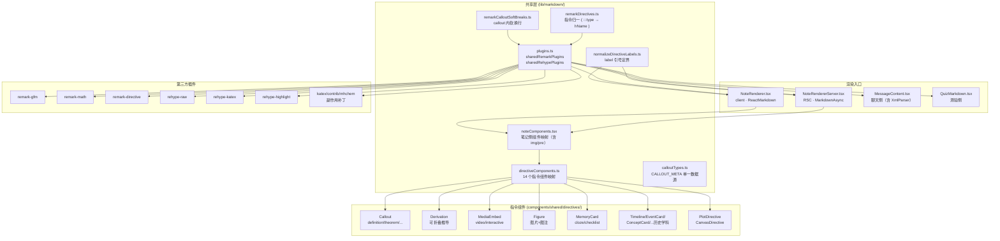
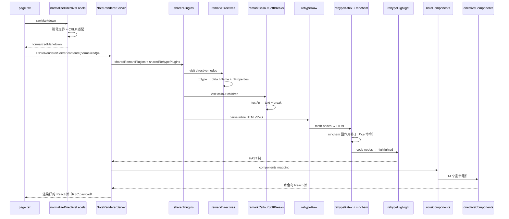
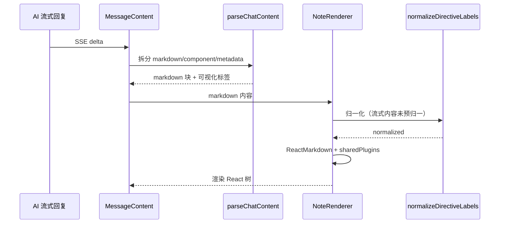

# 维度 03：共享渲染架构 深度调研报告

> **调研人**：Agent-A（架构与渲染调研员）
> **调研日期**：2026-07-05
> **项目版本**：gailvlun v0.3.1
> **关联文档**：`docs/refer/rendering-architecture.md`、`docs/refer/performance-audit-report.md`、`docs/sop/subject-onboarding.md`

## 1. 执行摘要

gailvlun 的共享渲染架构是一个**「中间复用、两端独立」**的设计：笔记侧（`NoteRendererServer` / `NoteRenderer`）与聊天侧（`MessageContent`）共享同一份 remark/rehype 插件链（`lib/markdown/plugins.ts`）与同一份指令组件映射（`directiveComponents.ts`），但各自维护独立的 React 组件入口与外层 CSS 容器（`.prose-notes` vs `.chat-prose`）。

核心契约是 `sharedRemarkPlugins` 与 `sharedRehypePlugins` 两个数组——所有渲染入口**必须**从此处导入插件，禁止内联配置。插件链顺序敏感：remark 链按 `Gfm → Math → Directive → remarkDirectives(自定义) → remarkCalloutSoftBreaks` 处理；rehype 链按 `Raw → Katex → Highlight` 处理，rehype-raw 必须在 rehype-katex 之前以支持内联 HTML/SVG。

自定义指令系统通过 `remarkDirectives.ts` 把 `:::type{label=...}` 与 `::type{id=...}` 语法归一为自定义 HAST 元素（`callout`/`derivation`/`mediaembed`/`figuremedia`/`functionplot`/`svgcanvas`/`memorycard`/`timeline`/`eventcard`/`conceptcard`/`comparetable`/`causeeffect`/`keypoint`/`historymap` 共 14 种），再由 `directiveComponents.ts` 映射到具体 React 组件。所有指令组件均为 `"use client"`，作为水合岛在 RSC 树中保留交互能力。

`NoteRendererServer`（RSC）使用 `MarkdownAsync` 在构建期完成 Markdown → HTML 渲染（含 KaTeX/highlight），浏览器只接收渲染好的 React 树；`NoteRenderer`（client）使用同步 `ReactMarkdown`，用于流式内容（AI 回复、视频讲稿、例题）等「内容在客户端才确定」的场景。两者复用同一份 `noteComponents` 映射，消除重复。

KaTeX mhchem 补丁问题是项目最特殊的工程坑位：`katex` 不可加入 `optimizePackageImports`，因为 `import "katex/contrib/mhchem"` 靠副作用给 katex 单例打补丁，barrel 优化会破坏单例关系导致化学方程式语法失效。

## 2. 架构总览



## 3. 核心机制详解

### 3.1 完整插件链（plugins.ts）

`lib/markdown/plugins.ts:12-49` 导出两个数组：

**`sharedRemarkPlugins`**（顺序敏感）：

| 序号 | 插件 | 作用 | 顺序敏感性 |
|---|---|---|---|
| 1 | `remarkGfm` | GitHub Flavored Markdown（表格、删除线、任务列表、自动链接） | 必须最先，扩展基础语法 |
| 2 | `remarkMath` | 解析 `$...$` / `$$...$$` 为 math 节点 | 必须在 directive 前，避免指令语法吞掉公式 |
| 3 | `remarkDirective` | 解析 `:::type` / `::type` / `:type` 为 directive 节点 | 必须在自定义 remarkDirectives 前 |
| 4 | `remarkDirectives`（自定义） | 把 directive 节点归一为自定义 HAST 元素（`callout`/`mediaembed` 等） | 必须在 remarkDirective 后 |
| 5 | `remarkCalloutSoftBreaks`（自定义） | 在 callout 容器子树内把单换行转为 break 节点 | 必须在 remarkDirectives 后，依赖 `name === "callout"` |

**`sharedRehypePlugins`**（顺序敏感）：

| 序号 | 插件 | 配置 | 顺序敏感性 |
|---|---|---|---|
| 1 | `rehypeRaw` | 默认 | **必须**在 rehype-katex 前，把内联 HTML/SVG 解析为 HAST 节点 |
| 2 | `rehypeKatex` | `{ throwOnError: false, strict: false }` | 必须在 rehype-raw 后，处理 math 节点 |
| 3 | `rehypeHighlight` | `{ detect: false, ignoreMissing: true, subset: [9 种语言] }` | 顺序不敏感，但放最后避免干扰 |

**subset 白名单**（`plugins.ts:36-46`）：`python`、`javascript`、`typescript`、`bash`、`shell`、`json`、`html`、`css`、`markdown`。注释说明：「未标语言的 fence 保持原样即可」——避免对每篇 KaTeX 重的内容做无谓的自动语言识别。

### 3.2 自定义指令系统

**指令语法**（基于 `remark-directive`）：

| 语法 | 类型 | 示例 |
|---|---|---|
| `:::type{label="..."}` ... `:::` | 容器指令（containerDirective） | `:::definition{label="正态分布"}` |
| `::type{id="..."}` | 叶子指令（leafDirective） | `::video{id=ch01-1.4-classical}` |
| `:type` | 文本指令（textDirective） | 项目不使用，但需兜底 |

**归一流程**（`lib/markdown/remarkDirectives.ts:30-184`）：

1. `visit()` 遍历 mdast 树，筛选 `containerDirective`/`leafDirective`/`textDirective` 节点
2. 按 `node.name` 匹配处理器，设置 `data.hName`（HAST 标签名）与 `data.hProperties`（属性对象）
3. 未识别的 `textDirective`（如散文中的 `Nd:YAG`、`3:X`）被还原为字面文本 `":name"`，避免被 `mdast-util-to-hast` 静默丢弃

**14 种指令组件**（`lib/markdown/directiveComponents.ts:17-32`）：

| hName | 指令名 | 类型 | 组件 | 用途 |
|---|---|---|---|---|
| `callout` | `:::definition/theorem/example/insight/pitfall/note/tip/memory` | 容器 | `Callout` | 8 种语义卡片 |
| `callout` | `:::callout{kind=...}` | 容器 | `Callout` | SOP 08 试卷统一写法 |
| `derivation` | `:::derivation` | 容器 | `Derivation` | 可折叠推导 |
| `mediaembed` | `::video` / `::interactive` | 叶子 | `MediaEmbed` | 视频/交互组件嵌入 |
| `figuremedia` | `::figure` | 叶子 | `Figure` | 图片+图注 |
| `functionplot` | `::plot` | 叶子 | `PlotDirective` | 单函数绘图 |
| `svgcanvas` | `:::canvas` | 容器 | `CanvasDirective` | 多函数共享坐标系 |
| `memorycard` | `:::memory` | 容器 | `MemoryCard` | 记忆卡（cloze/checklist） |
| `timeline` | `:::timeline` | 容器 | `Timeline` | 时间轴（历史学科） |
| `eventcard` | `:::event` | 容器 | `EventCard` | 事件卡（历史学科） |
| `conceptcard` | `:::concept` | 容器 | `ConceptCard` | 概念卡（历史学科） |
| `comparetable` | `:::compare` | 容器 | `CompareTable` | 对比表（历史学科） |
| `causeeffect` | `:::cause-effect` | 容器 | `CauseEffect` | 因果关系（历史学科） |
| `keypoint` | `:::keypoint` | 容器 | `KeyPoint` | 核心要点（历史学科） |
| `historymap` | `::map` | 叶子 | `HistoryMap` | 历史地图（历史学科） |

### 3.3 指令组件实现细节

#### Callout（`components/shared/directives/Callout.tsx`）

- 从 `node.properties.kind` 读取类型（默认 `note`），从 `CALLOUT_META` 取样式类名与中文标签
- 渲染为 `<div className="callout {meta.cls}">` + `<div className="callout-label">`
- 支持 8 种类型：`definition`/`theorem`/`example`/`insight`/`pitfall`/`note`/`tip`/`memory`
- `memory` 类型虽在 `CALLOUT_META` 中，但实际渲染走独立的 `MemoryCard` 组件（`remarkDirectives.ts:48-56` 优先匹配）

#### Derivation（`components/shared/directives/Derivation.tsx`）

- 原生 `<details>` + `<summary>`，无 JS 状态管理（浏览器原生折叠）
- `label` 默认「推导过程」

#### MediaEmbed（`components/shared/directives/MediaEmbed.tsx`）

- 分流 `kind: "video" | "interactive"`
- **VideoEmbed**：从 `getVideo(id)` 查 `mediaManifest`，未命中显示「即将生成」占位；命中显示播放按钮（`LazyVisible` 包裹），点击后挂载 `InlinePlayer`（dynamic ssr:false）；与 PiP 状态联动（`useStore.openPip`/`pipReturnTime`/`closePip`）
- **InteractiveEmbed**：从 `getInteractive(id)` 查 registry，未命中显示占位；命中渲染 `<C />`（`LazyVisible` 包裹）

#### Figure（`components/shared/directives/Figure.tsx`）

- `src`/`alt`/`caption` 三属性
- `onError` 切换到 `ImageOff` 兜底
- `loading="lazy"` + `decoding="async"` 优化加载

#### MemoryCard（`components/shared/directives/MemoryCard.tsx`）

- 两模式：`mode="cloze"`（挖空）与默认（清单 checklist）
- **cloze**：把 `**...**`/`<u>...</u>`/`_..._` 中的内容遮蔽为可点击挖空，点击后显示
- **checklist**：把 `- [ ] ...` 渲染为可逐项点击的背诵条目
- 从 React children 提取文本（`extractText` 递归），再交给 `QuizMarkdown` 重新渲染——这是「二次渲染」模式，因为需要先做挖空/清单处理
- 使用 framer-motion `AnimatePresence` 做展开/收起动画

#### 历史学科指令（Timeline/EventCard/ConceptCard/CompareTable/CauseEffect/KeyPoint/HistoryMap）

- 全部为 `"use client"` 组件，专为历史学科设计
- `Timeline` 从 children 提取文本，按 `- **year** title — desc` 格式解析为时间轴项
- `HistoryMap` 从 `points` 属性解析 `name:x:y` 格式（如 `北京:50:30,上海:60:70`）
- `EventCard` 支持 `year/title/location/people/result/impact` 多字段，可折叠详情

### 3.4 NoteRendererServer vs NoteRenderer 边界

| 维度 | NoteRendererServer | NoteRenderer |
|---|---|---|
| 文件 | `components/notes/NoteRendererServer.tsx` | `components/notes/NoteRenderer.tsx` |
| 类型 | RSC（无 `"use client"`） | Client Component（`"use client"`） |
| 核心 API | `MarkdownAsync`（react-markdown 9 RSC 异步版） | `ReactMarkdown`（同步） |
| 调用时机 | 构建期 / Node Function | 客户端挂载后 |
| normalizeDirectiveLabels | **不调用**（由 page.tsx 预先归一） | **调用**（流式内容未预归一） |
| 使用场景 | 静态笔记正文 SSR | AI 流式回复、视频讲稿、例题 |
| 性能特征 | 构建期烘焙，浏览器只接收 React 树 | 客户端实时解析，主线程开销 |

**约束**（`NoteRendererServer.tsx:13` 注释）：「`content` 必须由调用方（page.tsx）预先经 normalizeDirectiveLabels 归一一次，本组件不再重复归一」。这是性能优化：避免在构建期对每篇笔记重复跑正则。

### 3.5 noteComponents 共享映射

`lib/markdown/noteComponents.tsx:10-14`：

```typescript
export const noteComponents = {
  ...directiveComponents,      // 14 个指令组件
  img: ContentImage,           // 统一图片（错误兜底 + figure 包裹）
  pre: ({ node, ...props }) => <CodeBlock {...props} />,  // 代码块（复制 + 语言标签）
} as unknown as Components;
```

注释强调：「本文件不加 `"use client"`：它只是一组组件引用的纯对象，可被服务端与客户端组件同时 import；其中的指令组件 / CodeBlock / ContentImage 自身已是 `"use client"`，从服务端渲染时自动成为水合岛」。这是 RSC 体系的关键设计——`noteComponents` 是纯数据，跨越 RSC/CSR 边界无障碍。

### 3.6 KaTeX mhchem 补丁问题

**根因**（`next.config.mjs:20-26` 注释）：

> katex 不可加入 `optimizePackageImports`——它靠 `import "katex/contrib/mhchem"` 的副作用给 katex 单例打补丁，barrel 优化的深层导入改写会破坏该单例关系，导致 SSR 包里 mhchem 的气体箭头 `^`、三键 `#` 等惰性特性失效（`\ce{N2 ^}`、`\ce{-C#CH}` 渲染成红字错误），而 node 直跑无此改写故正常。

**机制**：
1. `lib/markdown/plugins.ts:7` 通过 `import "katex/contrib/mhchem"` 注入化学方程式支持
2. mhchem 模块在加载时给 `katex` 单例挂载 `\ce` 命令处理器
3. Next.js 的 `optimizePackageImports` 会把 `import "katex/contrib/mhchem"` 改写为深层路径导入（如 `katex/contrib/mhchem/dist/...`），破坏模块副作用
4. 单例被破坏后，`\ce{N2 ^}` 中的 `^` 不被识别为气体箭头，渲染成红色错误字符

**解决方案**：在 `next.config.mjs:25` 的 `experimental.optimizePackageImports` 中**只**加入 `framer-motion` 与 `lucide-react`，**显式排除** `katex`。

**已加入 barrel 优化的库**：
- `framer-motion`：18 处具名导入改写为深层导入，显著减小 bundle
- `lucide-react`：图标深层导入，减小图标库体积

### 3.7 normalizeDirectiveLabels 归一化

**问题**（`lib/markdown/normalizeDirectiveLabels.ts:1-20` 注释）：remark-directive 的属性语法 `:::type{label=值}` 中，**未加引号的属性值不能包含空格或 ASCII 直引号**。中文标题如 `:::definition{label=σ-p 超共轭}`（含空格）或 `:::insight{label=从"衣食住行"讲起}`（含直引号）会导致属性解析失败 → 整个指令被丢弃 → callout 框消失、围栏裸露。

**处理策略**（`normalizeDirectiveLabels.ts:43-76`）：
1. 跟踪围栏代码块状态，块内不做任何替换
2. 仅匹配指令起始行 `^\s*:{1,4}[A-Za-z][\w-]*\{[^}\n]*\}`
3. 把 `label=值` 中的成对 ASCII 引号转为中文弯引号（`"` → `“”`）
4. 用 ASCII 双引号给整个值定界（`{label="σ-p 超共轭"}`）

**幂等性**：已包裹的值不会被重复包裹（`fixBraces` 先去一层引号再包裹）。

**CRLF 适配**（`normalizeDirectiveLabels.ts:23-26`）：正则用 `[^\n]*` 而非 `.*`，因为 `.` 不匹配 `\r`，CRLF 文件按 `\n` 切行后行尾留有 `\r` 会导致匹配失败。

**两侧入口约束**：`NoteRendererServer`（由 page.tsx 预归一）与 `NoteRenderer`（自身归一）都必须经此函数，`MessageContent` 同理。

### 3.8 remarkCalloutSoftBreaks 软换行

**问题**（`lib/markdown/remarkCalloutSoftBreaks.ts:1-17` 注释）：标准 Markdown 语义下，段内单换行被折叠为空格。这导致题目卡片内用单换行分隔的 ABCD 选项堆在一行。全局启用 `remarkSoftBreaks` 会破坏笔记正文段落排版。

**解决方案**：只在 `containerDirective` 且 `name === "callout"` 的子树内，把 text 节点的单换行拆为 `text + break`。精准修复题目/解析/知识延伸等卡片的换行，零回归。

**安全性**：只改写 text 节点，行内公式（inlineMath）、代码（code/inlineCode）、数学块（math）在 mdast 里是独立节点类型，不会被波及。

### 3.9 CALLOUT_META 单一数据源

`lib/markdown/calloutTypes.ts:1-25`：

```typescript
export const CALLOUT_TYPES = ["definition","theorem","example","insight","pitfall","note","tip","memory"] as const;
export const CALLOUTS = new Set<string>(CALLOUT_TYPES);
export const CALLOUT_META: Record<string, { label: string; cls: string }> = {
  definition: { label: "定义", cls: "callout-definition" },
  theorem: { label: "定理", cls: "callout-theorem" },
  example: { label: "例", cls: "callout-example" },
  insight: { label: "直觉", cls: "callout-insight" },
  pitfall: { label: "易错点", cls: "callout-pitfall" },
  note: { label: "注", cls: "callout-note" },
  tip: { label: "提示", cls: "callout-tip" },
  memory: { label: "记忆卡", cls: "callout-memory" },
};
```

`Callout.tsx` 自动从 `CALLOUT_META` 读取，新增 callout 类型只需改这一处 + CSS（`callouts.css`），无需改组件代码。

## 4. 数据流与调用链路

### 4.1 笔记渲染主链路



### 4.2 客户端流式渲染链路



## 5. 关键代码路径

### 5.1 共享插件链

- `lib/markdown/plugins.ts:1-49` — `sharedRemarkPlugins` 与 `sharedRehypePlugins` 完整定义
- `lib/markdown/plugins.ts:7` — `import "katex/contrib/mhchem"` 副作用导入

### 5.2 指令归一

- `lib/markdown/remarkDirectives.ts:30-184` — 主 visit 函数
- `lib/markdown/remarkDirectives.ts:48-56` — `memory` 指令优先匹配
- `lib/markdown/remarkDirectives.ts:58-63` — `callout` 指令 kind 属性处理
- `lib/markdown/remarkDirectives.ts:64-68` — 8 种 CALLOUTS 类型匹配
- `lib/markdown/remarkDirectives.ts:176-180` — textDirective 兜底还原

### 5.3 软换行与归一化

- `lib/markdown/remarkCalloutSoftBreaks.ts:26-53` — callout 子树内 text 节点拆分
- `lib/markdown/normalizeDirectiveLabels.ts:43-76` — 主归一函数
- `lib/markdown/normalizeDirectiveLabels.ts:31-41` — `fixBraces` 引号定界

### 5.4 组件映射

- `lib/markdown/directiveComponents.ts:17-32` — 14 个指令组件映射表
- `lib/markdown/noteComponents.tsx:10-14` — 笔记侧组件映射（含 img/pre）
- `lib/markdown/calloutTypes.ts:1-25` — CALLOUT_META 单一数据源

### 5.5 渲染入口

- `components/notes/NoteRendererServer.tsx:15-25` — RSC 异步渲染
- `components/notes/NoteRenderer.tsx:12-24` — 客户端同步渲染
- `app/[subject]/[category]/[id]/page.tsx:57-64` — `normalizeDirectiveLabels` + `NoteRendererServer` 调用

### 5.6 指令组件实现

- `components/shared/directives/Callout.tsx:10-23` — Callout 组件
- `components/shared/directives/MediaEmbed.tsx:101-107` — MediaEmbed 分流
- `components/shared/directives/MediaEmbed.tsx:21-74` — VideoEmbed（PiP 联动）
- `components/shared/directives/MemoryCard.tsx:32-98` — MemoryCard 主组件
- `components/shared/directives/MemoryCard.tsx:103-169` — ClozeText 挖空模式
- `components/shared/directives/MemoryCard.tsx:175-238` — ChecklistMarkdown 清单模式
- `components/shared/directives/Derivation.tsx:8-16` — Derivation 折叠
- `components/shared/directives/Figure.tsx:11-39` — Figure 图片
- `components/shared/directives/Timeline.tsx:48-69` — Timeline 时间轴
- `components/shared/directives/HistoryMap.tsx:29-50` — HistoryMap 历史地图

### 5.7 共享基础组件

- `components/shared/CodeBlock.tsx:11-37` — 代码块（复制 + 语言标签）
- `components/shared/ContentImage.tsx:14-49` — 统一图片（错误兜底 + figure 包裹）

### 5.8 构建配置

- `next.config.mjs:24-26` — `optimizePackageImports` 配置（含 katex 排除约束）
- `next.config.mjs:13-18` — `outputFileTracingIncludes/Excludes` 内容打包规则

## 6. 设计决策与取舍分析

### 6.1 为什么用「中间复用、两端独立」而非完全统一

- **取舍**：共享插件链 vs 独立组件入口
- **理由**：笔记与聊天的渲染需求高度相似（都需 KaTeX、指令、代码高亮），但外层排版令牌不同（笔记 `.prose-notes` 15px/1.8 行高，聊天 `.chat-prose` 13px/1.65 行高），且聊天侧有额外的 XML 标签解析（`<FormulaSteps>`/`<SvgDiagram>` 等）
- **代价**：需维护 `noteComponents` 与 `MessageContent` 两套组件映射，但 `directiveComponents` 是共享的

### 6.2 为什么 NoteRendererServer 不调用 normalizeDirectiveLabels

- **取舍**：性能 vs 职责单一
- **理由**：构建期对每篇笔记跑正则有开销；page.tsx 已在 SSR 入口统一归一一次，NoteRendererServer 重复归一是浪费
- **代价**：约束依赖注释固化，无运行时校验；若调用方忘记归一会导致 callout 围栏裸露

### 6.3 为什么 MemoryCard 从 React children 提取文本再二次渲染

- **取舍**：性能 vs 交互能力
- **理由**：cloze 模式需要把 `**...**` 遮蔽为可点击挖空，checklist 模式需要把 `- [ ] ...` 渲染为可点击条目；这些交互需要在渲染阶段介入，不能直接复用 react-markdown 的渲染结果
- **代价**：children → 文本 → QuizMarkdown 是二次渲染，有性能开销；但 MemoryCard 默认折叠，展开时才渲染，影响可控

### 6.4 为什么 remarkCalloutSoftBreaks 只在 callout 内生效

- **取舍**：精准修复 vs 全局软换行
- **理由**：全局启用 `remarkSoftBreaks` 会破坏笔记正文段落排版（单换行被保留为 `<br>`，段落无法正确折叠）；只在 callout 子树内生效，精准修复题目卡片的 ABCD 选项换行
- **代价**：需自定义插件，但代码仅 53 行，复杂度低

### 6.5 为什么 rehype-highlight 用 detect:false + subset 白名单

- **取舍**：自动语言识别 vs 性能
- **理由**：`detect:true` 会让 highlight.js 对每个未标语言的 fence 遍历所有 grammar 做自动识别——对概率论/物理这种「整卷 KaTeX 但几乎无代码块」的内容是纯浪费
- **代价**：未标语言的 fence 不高亮（保持原样），但作者显式写 ` ```lang ` 时仍高亮

### 6.6 为什么指令组件全部是 "use client"

- **取舍**：SSR 友好 vs 交互能力
- **理由**：Callout/Derivation 等看似可 SSR，但 MemoryCard（状态）、MediaEmbed（PiP 联动）、EventCard（折叠）等需交互；统一 `"use client"` 简化心智模型，且 RSC 会自动把它们作为水合岛保留
- **代价**：每个指令组件都是一个水合岛，但体积小，影响可控

### 6.7 为什么 textDirective 需要兜底还原

- **取舍**：严格丢弃 vs 字面还原
- **理由**：remark-directive 会把散文中的 `词:Word`（如 `Nd:YAG`、比值 `3:X`）误解析为 textDirective；未识别的 textDirective 会被 `mdast-util-to-hast` 静默丢弃 → 吞掉冒号后的文字
- **代价**：需在 `remarkDirectives.ts:176-180` 显式还原为 `":name"` 文本

## 7. 问题清单

| # | 问题描述 | 严重程度 | 涉及文件 | 建议修复方向 |
|---|----------|----------|----------|--------------|
| 1 | `noteComponents.tsx` 中 `pre` 组件用 `({ node, ...props }: any)` 类型断言，丢失类型安全 | P3 | `lib/markdown/noteComponents.tsx:13` | 用 `Components['pre']` 类型签名 |
| 2 | `directiveComponents.ts:32` 用 `as unknown as Partial<Components>` 双重断言绕过类型检查，14 个指令组件的 props 未与 react-markdown 的 `Components` 类型对齐 | P2 | `lib/markdown/directiveComponents.ts:17-32` | 定义 `DirectiveComponentProps` 接口，让所有指令组件实现统一签名 |
| 3 | `Callout.tsx` 从 `node?.properties?.kind` 读取属性，但 `directiveComponents` 类型断言后 properties 类型丢失，依赖运行时 `String(... ?? "note")` 兜底 | P3 | `components/shared/directives/Callout.tsx:11-13` | 与 #2 一起修，定义统一 NodeProps 接口 |
| 4 | `MemoryCard.tsx:41-57` 的 `extractText` 递归遍历 React 节点提取文本，对复杂 markdown（表格、嵌套列表）可能丢失结构；提取后由 `QuizMarkdown` 二次渲染，可能与首次渲染结果不一致 | P2 | `components/shared/directives/MemoryCard.tsx:41-57` | 考虑直接在 react-markdown 的 components 映射中拦截 `**...**` 与 `- [ ]`，避免二次渲染 |
| 5 | `MediaEmbed.tsx` 的 `InlinePlayer` dynamic import 在 `loading` 返回 shimmer 占位，但 `LazyVisible` 的 placeholder 是 `SkeletonBlock`；两层占位可能造成视觉跳变 | P3 | `components/shared/directives/MediaEmbed.tsx:11-14,56` | 统一占位组件，或移除 `LazyVisible` 包装 |
| 6 | `remarkDirectives.ts:176-180` 的 textDirective 兜底用 `[SKIP, index]` 返回，但 `SKIP` 是 unist-util-visit 的常量，需确认 import 正确；若 import 错误会静默失效 | P3 | `lib/markdown/remarkDirectives.ts:1,176-180` | 已 `import { SKIP }`，确认无问题；可加测试覆盖 `Nd:YAG` 场景 |
| 7 | `normalizeDirectiveLabels.ts:27` 的正则 `DIRECTIVE_OPEN` 要求指令名以字母开头 `[A-Za-z]`，但不支持中文指令名（如 `:::定义`）；当前所有指令均为英文，无实际问题，但扩展性受限 | P3 | `lib/markdown/normalizeDirectiveLabels.ts:27` | 若未来支持中文指令名，需放宽正则到 `[\w-]` |
| 8 | `plugins.ts:7` 的 `import "katex/contrib/mhchem"` 是裸副作用导入，无类型声明；TypeScript strict 模式下可能告警 | P3 | `lib/markdown/plugins.ts:7` | 添加 `// @ts-ignore` 或在 `katex.d.ts` 中声明模块 |
| 9 | `Callout.tsx` 不支持嵌套 callout（callout 内再写 `:::definition` 会渲染异常），因 remark-directive 的容器指令嵌套解析有限制 | P3 | `components/shared/directives/Callout.tsx` | 文档约定禁止嵌套，或改用嵌套友好的渲染策略 |
| 10 | `rendering-architecture.md` 文档提到「7 种 callout 类型」，但实际 `calloutTypes.ts` 已扩展到 8 种（含 `memory`），文档未同步 | P3 | `docs/refer/rendering-architecture.md` §2.3 | 更新文档为 8 种，并说明 `memory` 走独立组件 |
| 11 | `HistoryMap.tsx:16-27` 的 `parsePoints` 用逗号分隔 `name:x:y`，但属性值在 markdown 中若含空格会被 `normalizeDirectiveLabels` 包裹引号，可能导致解析失败 | P2 | `components/shared/directives/HistoryMap.tsx:16-27`、`lib/markdown/normalizeDirectiveLabels.ts` | 测试 `::map{points="北京:50:30,上海:60:70"}` 场景，确认引号包裹后解析正常 |
| 12 | `directiveComponents.ts` 中 `PlotDirective` 与 `CanvasDirective` 来自 `@/components/canvas/`，与其他指令组件（来自 `@/components/shared/directives/`）路径不一致，组织松散 | P3 | `lib/markdown/directiveComponents.ts:5-6` | 统一放到 `components/shared/directives/` 或在文档中说明 canvas 子系统的独立性 |

## 8. 改进建议

### P1（高收益 · 低风险）

无 P1 问题。当前渲染架构在「共享 + 独立」的边界划分清晰，性能优化（RSC 预渲染、LazyVisible、讲稿懒加载）已落地。

### P2（中收益 · 中风险）

- **统一指令组件类型签名**（#2、#3）：定义 `DirectiveComponentProps` 接口，所有指令组件实现统一签名，消除 `as unknown as Partial<Components>` 双重断言
- **MemoryCard 避免二次渲染**（#4）：在 react-markdown 的 components 映射中拦截 `**...**` 与 `- [ ]`，避免 extractText + QuizMarkdown 二次渲染
- **HistoryMap 引号兼容测试**（#11）：确认 `normalizeDirectiveLabels` 包裹引号后 `points` 属性解析正常

### P3（低优先）

- **类型安全**（#1、#8）：补全 `pre` 组件与 mhchem 导入的类型声明
- **文档同步**（#10）：更新 `rendering-architecture.md` 的 callout 类型数量
- **占位统一**（#5）：MediaEmbed 两层占位组件统一
- **指令组件组织**（#12）：统一路径或说明 canvas 子系统独立性
- **嵌套 callout 支持**（#9）：文档约定或渲染策略调整

## 9. 与全自动化平台改造的关系

本维度对平台化改造的影响：

1. **共享渲染核心是平台化的关键资产**：`sharedRemarkPlugins` + `directiveComponents` 让任何学科的内容都复用同一渲染管线。平台化时**必须保留**这一约束，避免新学科自带渲染器导致渲染分裂。

2. **指令系统是平台化的扩展点**：14 种指令组件覆盖了通用学科（callout/derivation/figure/mediaembed）与历史学科（timeline/eventcard/conceptcard/comparetable/causeeffect/keypoint/historymap）两大类。平台化时可：
   - 把指令组件注册改为插件式（每个学科插件包自带指令组件）
   - 保持 `remarkDirectives.ts` 的归一逻辑不变，只扩展 `directiveComponents` 映射

3. **RSC 预渲染是平台化的性能保障**：`NoteRendererServer` 在构建期完成 Markdown → HTML 渲染，平台化后内容规模可能扩张 5-10 倍，RSC 预渲染的价值更显著。

4. **mhchem 单例陷阱是平台化的约束**：平台化时若引入更多副作用模块（如 Mermaid、MathJax），需同样注意 `optimizePackageImports` 的限制。`next.config.mjs` 的注释已固化这一约束。

5. **normalizeDirectiveLabels 是平台化的内容质量保障**：AI 生成内容与作者笔误都可能导致 callout 围栏裸露，归一化是兜底防线。平台化时应保留两侧入口（NoteRenderer + MessageContent）的归一约束。

6. **CALLOUT_META 单一数据源是平台化的扩展范式**：新增 callout 类型只需改一处 + CSS，无需改组件代码。这一范式应推广到其他指令类型（如 timeline 的 period 类型、eventcard 的字段定义）。

7. **MemoryCard 二次渲染是平台化的性能债务**：若平台化后 MemoryCard 大量使用，二次渲染的开销需评估。建议在平台化前优化为单次渲染（#4）。

8. **指令组件全部 "use client" 是平台化的心智模型简化**：统一为水合岛虽有小开销，但简化了 RSC/CSR 边界判断。平台化时应保留这一约定。

## 10. 参考资料

### 项目内文档

- `docs/refer/rendering-architecture.md` — 共享渲染架构规范（权威文档）
- `docs/refer/performance-audit-report.md` — 性能审查报告（RSC 预渲染、懒加载）
- `docs/sop/subject-onboarding.md` — 学科接入 SOP（指令组件注册）

### 关键源码

- `lib/markdown/plugins.ts` — 共享插件链
- `lib/markdown/remarkDirectives.ts` — 指令归一
- `lib/markdown/remarkCalloutSoftBreaks.ts` — 软换行
- `lib/markdown/normalizeDirectiveLabels.ts` — 标签归一化
- `lib/markdown/directiveComponents.ts` — 指令组件映射
- `lib/markdown/noteComponents.tsx` — 笔记侧组件映射
- `lib/markdown/calloutTypes.ts` — CALLOUT_META 单一数据源
- `components/notes/NoteRendererServer.tsx` — RSC 渲染入口
- `components/notes/NoteRenderer.tsx` — 客户端渲染入口
- `components/shared/directives/*` — 14 个指令组件
- `components/shared/CodeBlock.tsx` — 代码块
- `components/shared/ContentImage.tsx` — 统一图片
- `next.config.mjs` — barrel 优化与 mhchem 约束

### 外部文档

- [react-markdown 9 RSC](https://github.com/remarkjs/react-markdown)
- [remark-directive](https://github.com/remarkjs/remark-directive)
- [rehype-katex](https://github.com/remarkjs/remark-rehype/tree/main/packages/rehype-katex)
- [KaTeX mhchem](https://github.com/KaTeX/KaTeX/tree/main/contrib/mhchem)
- [Next.js optimizePackageImports](https://nextjs.org/docs/app/api-reference/config/next-config-js/optimizePackageImports)
