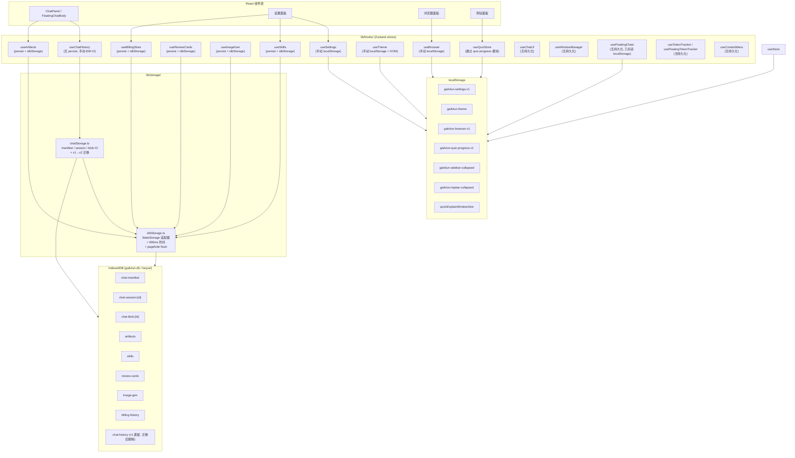
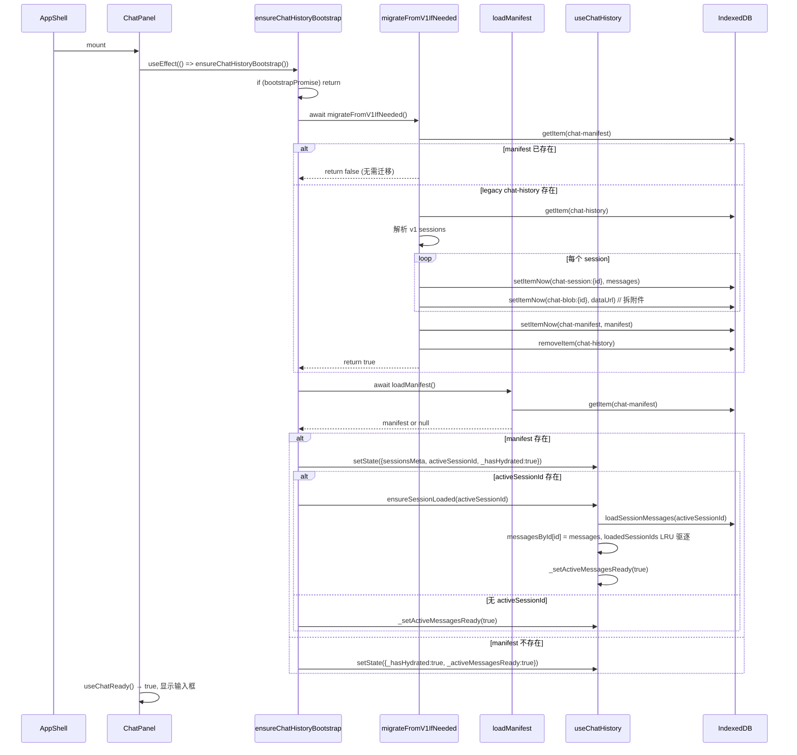
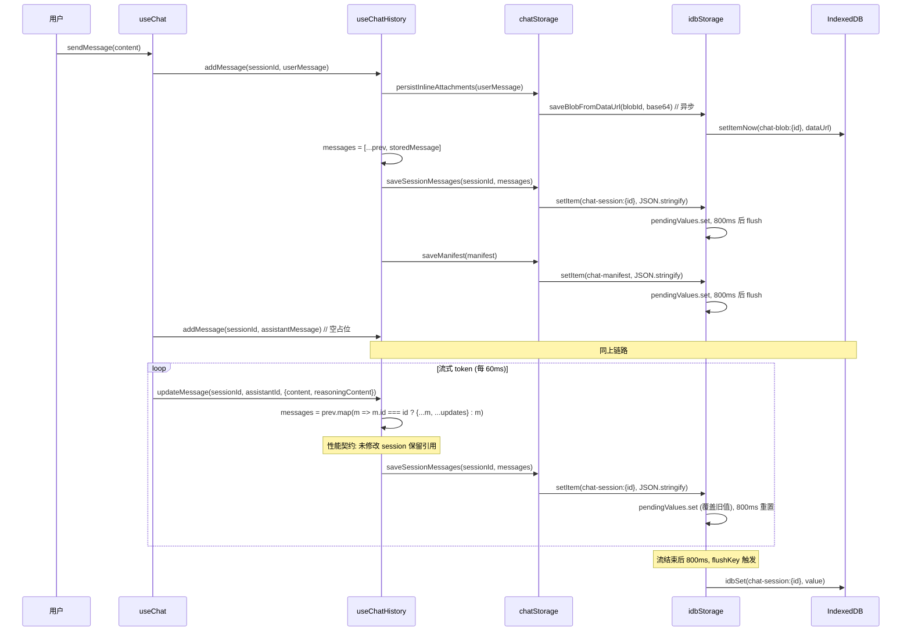

# 存储架构 深度调研报告

> **调研人**：Agent-B（AI与存储调研员）
> **调研日期**：2026-07-05
> **项目版本**：gailvlun v0.3.1
> **关联文档**：[存储架构规范](../../docs/refer/storage-architecture.md)、[性能审查报告](../../docs/refer/performance-audit-report.md)

## 1. 执行摘要

gailvlun 的存储架构采用 **IndexedDB（大数据、异步）+ localStorage（小数据、同步）** 双层分层，由 `lib/storage/idbStorage.ts`（224 行）与 `lib/storage/chatStorage.ts`（292 行）协同实现。核心设计有六大支柱：

1. **StateStorage 适配器**：`idbStorage` 为 zustand `persist` 中间件提供异步 `getItem/setItem/removeItem`，单库单 store（`gailvlun-db/keyval`），SSR 安全守卫。
2. **流式 OOM 根治**：`WRITE_DEBOUNCE_MS = 800` 尾随防抖 + `pagehide`/`visibilitychange` 强制 flush，把每 token 一次的「整段 chat-history JSON.stringify + IDB 写入」合并为单次，解决调试器实证的渲染进程 OOM。
3. **Storage v2 分会话分 key**：`chat-manifest`（元数据）+ `chat-session:{id}`（消息数组）+ `chat-blob:{id}`（图片 data URL）三层分离，从 v1 单 key 整包迁移到 v2 分片，幂等迁移 + 附件自动拆 blob。
4. **水合门控**：`_hasHydrated` 标志 + `onRehydrateStorage` 回调 + `useHydrated(store)` hook（基于 `useSyncExternalStore`）+ `useChatReady()` 双重门控，防止 SSR/CSR 水合不匹配与抢跑。
5. **LRU 冷卸载**：`useChatHistory` 内存中最多保留 `MAX_LOADED_SESSIONS = 3` 个会话消息体，超出时按 `keepIds`（active + pinned + 刚加载）驱逐，切换会话时从 IDB 异步加载。
6. **跨 store 孤儿清理**：删除会话时联动 `useArtifacts.prune(keepIds)`，防止 artifact 失去引用变成孤儿。

整体设计在「单库共存 + 防 OOM + 水合门控」上做得相当成熟，但 `useChatHistory` 已**不再使用 zustand `persist`**（改用 `sessionsMeta` + `messagesById` 内存态 + 手动 IDB IO），文档中 `useChatHistory → PERSIST_KEYS.chatHistory` 的描述已过时。附件拆 blob 后消息 JSON 体积下降一个数量级，但 `chat-session:{id}` 单 key 仍是「整段 messages 数组」，超长会话（500+ 消息）仍可能成为 stringify 热点。

## 2. 架构总览



### 核心原则

- **大数据走 IndexedDB**：对话历史（含 toolCalls 元数据）、交互演示 HTML（8-40KB/个）、技能、复习卡片、生图会话、计费记录 → IDB
- **小数据留 localStorage**：设置（~1KB）、主题（~10B）、UI 折叠态、书签、测验成绩（~2-20KB）→ LS
- **单一真相源**：DB 名、store 名、PERSIST_KEYS 全部集中在 `idbStorage.ts:13-25`
- **SSR 安全**：所有存储操作 `typeof window === "undefined"` 守卫降级
- **写后读一致性**：`getItem` 先查 `pendingValues`（尚未落盘的最新值），避免「写后立即读」拿到旧数据（`idbStorage.ts:120-122`）

## 3. 核心机制详解

### 3.1 IndexedDB 适配器（`lib/storage/idbStorage.ts`）

#### 3.1.1 常量与 key 命名

```typescript
// idbStorage.ts:13-25
const DB_NAME = "gailvlun-db";
const STORE_NAME = "keyval";

export const PERSIST_KEYS = {
  chatHistory: "chat-history",        // v1 遗留，迁移后删除
  chatManifest: "chat-manifest",      // v2 manifest
  artifacts: "artifacts",
  skills: "skills",
  reviewCards: "review-cards",
  imageGen: "image-gen",
  billingHistory: "billing-history",
} as const;

export const CHAT_SESSION_KEY_PREFIX = "chat-session:";
export const CHAT_BLOB_KEY_PREFIX = "chat-blob:";
```

- 专属 DB `gailvlun-db`，不与 `idb-keyval` 默认 `keyval-store` 混淆
- 单 object store `keyval`，所有 key 共存，便于 `clearAll()` 统一清理
- v2 引入按会话 / blob 前缀的 key 命名，但仍在同一 store 内

#### 3.1.2 StateStorage 接口（`idbStorage.ts:117-179`）

```typescript
export const idbStorage = {
  async getItem(name): Promise<string | null> {
    if (!isBrowser()) return null;
    // 1. 命中尚未落盘的最新值
    const pending = pendingValues.get(name);
    if (pending !== undefined) return pending;
    try {
      // 2. 先读 IndexedDB
      const val = await idbGet(name, idbStore);
      if (val != null) return val;
      // 3. IndexedDB 无 → 回退读旧 localStorage（透明迁移）
      const legacy = localStorage.getItem(name);
      if (legacy != null) {
        await idbSet(name, legacy, idbStore);  // 播种
        localStorage.removeItem(name);           // 释放旧空间
        return legacy;
      }
      return null;
    } catch {
      // 4. IndexedDB 不可用（隐私模式）→ localStorage 兜底
      return localStorage.getItem(name);
    }
  },

  setItem(name, value): void {
    if (!isBrowser()) return;
    pendingValues.set(name, value);
    // 尾随防抖：最新值胜出，高频写合并为一次
    const existing = pendingTimers.get(name);
    if (existing) clearTimeout(existing);
    pendingTimers.set(name, setTimeout(() => flushKey(name), WRITE_DEBOUNCE_MS));
  },

  async removeItem(name): Promise<void> {
    if (!isBrowser()) return;
    // 取消尚未落盘的写，避免删除后又被旧值覆盖
    const timer = pendingTimers.get(name);
    if (timer) { clearTimeout(timer); pendingTimers.delete(name); }
    pendingValues.delete(name);
    try { await idbDel(name, idbStore); } catch {}
    try { localStorage.removeItem(name); } catch {}
  },
};
```

**关键设计**：
- **透明迁移**：`getItem` 首次读不到 IDB 时回退读旧 LS 并播种，幂等且 Strict Mode 双跑安全
- **写后读一致性**：`pendingValues` Map 缓存尚未落盘的最新值，`getItem` 优先返回它
- **删除防覆盖**：`removeItem` 先取消 pending timer，避免删除后旧值又写回来
- **降级容错**：IDB 不可用（隐私模式 / 禁用）时降级为 localStorage，内存态仍可用

#### 3.1.3 SSR 守卫（`idbStorage.ts:42-44`）

```typescript
function isBrowser(): boolean {
  return typeof window !== "undefined" && typeof indexedDB !== "undefined";
}
```

所有方法首行检查 `isBrowser()`，SSR 时返回 `null` / no-op，避免 Next.js 服务端渲染时访问 `indexedDB` 报错。

#### 3.1.4 工具函数

| 函数 | 位置 | 用途 |
|------|------|------|
| `estimateSize(key)` | `idbStorage.ts:184-193` | 用 `new Blob([val]).size` 估算 key 字节数 |
| `clearAll()` | `idbStorage.ts:196-223` | 清空 `PERSIST_KEYS` 全部 + `chat-session:*` / `chat-blob:*` 前缀 |
| `setItemNow(name, value)` | `idbStorage.ts:89-98` | 立即写入并等待完成（迁移等数据安全路径用） |
| `flushPendingWrites()` | `idbStorage.ts:84-86` | 立即落盘所有挂起写（卸载/隐藏时调用） |
| `__resetIdbStoragePendingForTests()` | `idbStorage.ts:101-105` | 测试专用：清空 pending 队列 |

### 3.2 Storage v2 分会话分 key 架构（`lib/storage/chatStorage.ts`）

#### 3.2.1 Key 契约

| Key | 内容 | 写入时机 |
|-----|------|---------|
| `chat-manifest` | `{version:2, activeSessionId, sessions: SessionMeta[]}` | createSession / deleteSession / addMessage / updateMessage / updateSessionTitle |
| `chat-session:{id}` | `ChatMessage[]`（附件为 `ChatAttachmentRef`，仅存 id） | addMessage / updateMessage |
| `chat-blob:{id}` | 图片 data URL | persistInlineAttachments / 迁移 |
| `chat-history` | v1 遗留整包 | 迁移成功后 removeItem |

**SessionMeta 字段**（`chatStorage.ts:18-28`）：
```typescript
interface SessionMeta {
  id: string;
  title: string;
  createdAt: number;
  updatedAt: number;
  kind?: 'main' | 'floating';
  context?: ChatContext;
  messageCount: number;       // 历史列表展示用
  preview?: string;           // 最近 user 消息前 80 字
  artifactIds: string[];      // 冷卸载时 prune 用
}
```

#### 3.2.2 防 OOM 机制

v1 的 OOM 根因（`idbStorage.ts:47-51` 注释）：
> zustand persist 每次 set() 都会同步 JSON.stringify(整段状态) 并调 setItem 写盘。流式对话每 token 一次 updateMessage → 每 token 写一次「整段 chat-history」。无防抖时每次 setItem 都 `await idbSet(...)`（异步），高频 token 下大量写入并发在飞、各自持有一份不断变大的历史字符串 → O(n²) 活跃内存 → 渲染进程 OOM（调试器实证断在此 setItem）。

v2 的三层防御：
1. **800ms 尾随防抖**（`idbStorage.ts:150-156`）— 高频写合并为单次，最新值胜出
2. **分会话分 key**（`chatStorage.ts:100-102`）— 单会话 stringify 只序列化该会话消息，不再整包
3. **附件拆 blob**（`chatStorage.ts:260-273`）— base64 data URL 不进 messages JSON，单独存 `chat-blob:{id}`，messages 中只保留 `{id, type, mimeType}` 引用

#### 3.2.3 附件拆分与还原

**写入时拆分**（`chatStorage.ts:260-273`）：
```typescript
export function persistInlineAttachments(message: ChatMessage): ChatMessage {
  if (!message.attachments?.length) return message;
  const attachments: StoredChatAttachment[] = [];
  for (const a of message.attachments) {
    if ('base64' in a && a.base64) {
      const id = `blob-${message.id}-${attachments.length}`;
      void saveBlobFromDataUrl(id, a.base64);  // 异步写 chat-blob:{id}
      attachments.push({ id, type: 'image', mimeType: a.mimeType });
    } else {
      attachments.push(a);
    }
  }
  return { ...message, attachments };
}
```

**API 发送时还原**（`chatStorage.ts:233-258`）：
```typescript
export async function hydrateAttachmentsForApi(messages: ChatMessage[]): Promise<ChatMessage[]> {
  // 遍历每条消息的 attachments
  // 对于 {id} 引用，loadBlobDataUrl(id) 读 chat-blob:{id}
  // 还原为 {type:'image', mimeType, base64: dataUrl}
}
```

**导出时还原**（`chatStorage.ts:215-231`）— `loadAllSessionsForExport` 调用 `hydrateAttachmentsForApi`，保证导出格式兼容 v1（含 inline base64）。

### 3.3 v1 → v2 迁移策略（`chatStorage.ts:177-212`）

```mermaid
flowchart TD
    A[migrateFromV1IfNeeded] --> B{manifest 已存在?}
    B -->|是| C[return false 已迁移]
    B -->|否| D{legacy chat-history 存在?}
    D -->|否| C
    D -->|是| E[JSON.parse legacy]
    E --> F{解析成功?}
    F -->|否| C
    F -->|是| G[for each session in v1]
    G --> H[migrateAttachmentsInMessages<br/>拆分 base64 到 chat-blob:{id}]
    H --> I[saveSessionMessagesNow<br/>立即写入 chat-session:{id}]
    I --> J{写入成功?}
    J -->|否| K[return false, 保留 legacy 以便重试]
    J -->|是| L[buildSessionMeta]
    L --> M{所有 session 处理完?}
    M -->|否| G
    M -->|是| N[saveManifestNow<br/>立即写入 chat-manifest]
    N --> O{manifest 写入成功?}
    O -->|否| K
    O -->|是| P[idbStorage.removeItem chat-history<br/>删除 legacy]
    P --> Q[return true 迁移成功]
```

**幂等保证**：
- 首行检查 `manifest` 是否已存在（`chatStorage.ts:179-180`），已存在则 return false
- `saveSessionMessagesNow` / `saveManifestNow` 使用 `setItemNow`（绕过防抖立即写入），确保迁移完成前数据已落盘
- 任一步骤失败都保留 legacy `chat-history`，下次启动可重试

**Strict Mode 双跑安全**：
- `bootstrapPromise` 单例（`useChatHistory.ts:60`、`335-358`）保证 `ensureChatHistoryBootstrap` 只执行一次
- 即使 React Strict Mode 双调用 `useEffect`，第二次调用命中 `if (bootstrapPromise) return bootstrapPromise`

**测试覆盖**（`chatStorage.migrate.test.ts`）：
- ✅ v1 单体 JSON 拆分为 manifest + per-session
- ✅ v2 写入失败时保留 legacy 以便重试（`failSetItemForPrefix = "chat-session:"`）
- ✅ inline 图片迁移为 blob ref 且可 hydrate 回 API 附件

### 3.4 水合门控机制（`lib/hooks/useHydrated.ts`）

#### 3.4.1 问题

IndexedDB 是异步存储。zustand `persist` 从 IDB 恢复数据时，首屏 store 为空。若用户在此窗口期发送消息，`createSession` 会创建竞争会话，与稍后回灌的持久化会话冲突，导致活动会话 / 历史丢失。

#### 3.4.2 方案

每个 IDB 持久化 store 包含 `_hasHydrated: boolean` 标志，通过 `onRehydrateStorage` 回调在水合完成时置真。

**`useHydrated` hook**（`useHydrated.ts:21-34`）：
```typescript
export function useHydrated<T extends PersistableStore>(store: T): boolean {
  return useSyncExternalStore(
    (onStoreChange) => {
      const unsubHydrate = store.persist.onHydrate(onStoreChange);
      const unsubFinish = store.persist.onFinishHydration(onStoreChange);
      return () => { unsubHydrate(); unsubFinish(); };
    },
    () => store.persist.hasHydrated(),
    () => false, // SSR 快照：服务端无 IDB，返回 false 与客户端首帧一致
  );
}
```

**`useChatReady` 双重门控**（`useChatReady.ts:7-22`）：
```typescript
export function useChatReady(sessionId?: string | null): boolean {
  return useSyncExternalStore(
    (onChange) => useChatHistory.subscribe(onChange),
    () => {
      const s = useChatHistory.getState();
      if (!s._hasHydrated) return false;
      if (sessionId !== undefined) {
        if (!sessionId) return true;
        return !!s.messagesById[sessionId] || s.sessionLoadState[sessionId] === 'loaded';
      }
      if (!s.activeSessionId) return true;
      return s._activeMessagesReady;  // active 会话消息已从 IDB 加载
    },
    () => false,
  );
}
```

#### 3.4.3 消费点

| 消费方 | 门控行为 | 位置 |
|--------|----------|------|
| `ChatPanel` / `FloatingChatBody` | `useChatReady()` 为 false 时显示「正在加载历史记录…」，禁用输入框 | `ChatPanel.tsx:45` |
| `useChat.sendMessage` | `_hasHydrated` 为 false 时直接 return；`sessionLoadState` 非 loaded 时 return | `useChat.ts:102-105` |
| `ChatPanel` outbound effect | `chatReady` 为 false 时不触发 sendMessage | `ChatPanel.tsx:67-72` |

#### 3.4.4 useChatHistory 的兼容 shim

由于 `useChatHistory` 不再使用 zustand `persist`，但 `useHydrated(useChatHistory)` 仍被消费，代码在 store 上挂了一个 shim（`useChatHistory.ts:361-383`）：
```typescript
(useChatHistory as ...).persist = {
  hasHydrated: () => useChatHistory.getState()._hasHydrated,
  onHydrate: (fn) => { fn(); return () => {}; },
  onFinishHydration: (fn) => {
    if (useChatHistory.getState()._hasHydrated) { fn(); return () => {}; }
    return useChatHistory.subscribe((s) => { if (s._hasHydrated) fn(); });
  },
};
```

### 3.5 流式双节流（UI 60ms + IDB 800ms）

```mermaid
flowchart LR
    LLM[上游 LLM token] -->|每 ~30ms| API["/api/chat SSE"]
    API -->|data: content delta| useChat[useChat 事件循环]
    useChat -->|scheduleUi| Throttle["60ms 尾随节流<br/>streamUiThrottle.ts"]
    Throttle -->|每 60ms| writeUi["updateMessage<br/>(克隆 session.messages 数组)"]
    writeUi -->|set()| Zustand[Zustand store]
    Zustand -->|subscribe| useChatHistory["useChatHistory"]
    useChatHistory -->|addMessage/updateMessage| chatStorage["chatStorage.saveSessionMessages"]
    chatStorage -->|setItem| idbStorage["idbStorage.setItem"]
    idbStorage -->|800ms 尾随防抖| PendingValues["pendingValues Map"]
    PendingValues -->|flush| IDBWrite["idbSet → IndexedDB"]

    subgraph Flush["强制落盘时机"]
        PageHide[pagehide]
        BeforeUnload[beforeunload]
        VisibilityHidden[visibilitychange: hidden]
    end
    PageHide --> PendingValues
    BeforeUnload --> PendingValues
    VisibilityHidden --> PendingValues
```

**UI 层 60ms 节流**（`streamUiThrottle.ts`、`useChat.ts:236-254`）：
- `createStreamUiThrottle()` 返回 `{schedule, flush}`
- `schedule(write)` 只保留最新 pending write，60ms 后执行
- `flush()` 强制执行 pending（流结束 / 错误 / 卸载时调用）
- 选择 60ms 的理由：低于人眼感知延迟（~100ms），高于 LLM token 间隔（~30ms），KaTeX 重渲染能跟上

**IDB 层 800ms 防抖**（`idbStorage.ts:46-114`）：
- `pendingValues: Map<string, string>` 暂存最新值
- `pendingTimers: Map<string, setTimeout>` 每个独立计时
- `flushKey(name)` 取消计时 + 取出 pending + `writeNow` 真实写入
- `writeNow` 失败时降级到 localStorage（`idbStorage.ts:57-68`）

**强制落盘**（`idbStorage.ts:107-114`）：
```typescript
if (typeof window !== "undefined") {
  const flush = () => flushPendingWrites();
  window.addEventListener("pagehide", flush);
  window.addEventListener("beforeunload", flush);
  document.addEventListener("visibilitychange", () => {
    if (document.visibilityState === "hidden") flush();
  });
}
```

**为什么同时监听 pagehide + beforeunload + visibilitychange**：
- `pagehide`：移动端 Safari 推荐，页面卸载时触发
- `beforeunload`：桌面 Chrome 传统事件，部分场景与 pagehide 重复
- `visibilitychange`：切到后台 tab / 最小化窗口时触发，**比卸载更早**，适合「用户暂时离开」场景

### 3.6 localStorage 层 PERSIST_KEYS 清单

> 注：localStorage 不通过 `PERSIST_KEYS` 统一管理，各 store 自己定义 key 名。下表为完整清单。

| Key | Store | 用途 | 大小 |
|-----|-------|------|------|
| `gailvlun-settings-v1` | `useSettings` | 模型选择、自定义 API 分组、字体缩放、工具开关、思考/搜索默认、全局上下文、汇率 | ~1-5KB |
| `gailvlun-theme` | `useTheme` | 主题模式（dark/light）+ 外观设置（默认/彩色/自定义） | ~10-500B |
| `gailvlun-browser-v1` | `useBrowser` | 书签列表、主页 URL、通用浏览器当前 URL、视图模式（mobile/desktop） | ~1-5KB |
| `gailvlun-quiz-progress-v1` | `useQuizStore`（经 `lib/quiz-progress` 模块） | 每章节答题会话（answers/phase/currentIndex/hintsUsed/selfScores） | ~2-20KB / 章节 |
| `gailvlun-sidebar-collapsed` | `useStore` | 侧边栏折叠状态（布尔） | ~5B |
| `gailvlun-topbar-collapsed` | `useStore` | 顶栏折叠状态（布尔） | ~5B |
| `quickExplainWindowSize` | `useFloatingChats` | 划词浮窗尺寸 `{width, height}` | ~30B |

**设计差异**：
- `useSettings` / `useBrowser` 手动 `load()` + `persist(get)` 模式（每次 action 后调用 `persist`）
- `useTheme` 直接 `localStorage.setItem` + 同步 DOM `data-theme` 属性
- `useStore` 用 `readBoolean` / `writeBoolean` 工具函数，且通过 `setLayoutAttr` 同步到 html 属性（首屏 paint 前 CSS 可用）
- `useQuizStore` 通过独立模块 `lib/quiz-progress` 间接持久化

## 4. 数据流与调用链路

### 4.1 启动水合时序



### 4.2 发送消息的存储链路



### 4.3 删除会话的跨 store 清理

```mermaid
flowchart TD
    A[deleteSession id] --> B[sessionsMeta = filter out id]
    A --> C[messagesById delete id]
    A --> D[loadedSessionIds filter out id]
    A --> E[sessionLoadState id = idle]
    A --> F[saveManifest new activeSessionId]
    A --> G[async listBlobIdsForSession id]
    G --> H[deleteSessionData id, blobIds]
    H --> I[idbStorage.removeItem chat-session:id]
    H --> J[for each blobId: idbStorage.removeItem chat-blob:blobId]
    A --> K[pruneArtifactsFromMetas sessionsMeta]
    K --> L[useArtifacts.prune keepIds = 全部剩余 artifactIds]
    L --> M[删除不在 keepIds 中的 artifact]
    A --> N{deletedActive?}
    N -->|是| O[nextActiveToLoad = sessionsMeta[0].id]
    N -->|否| P[无操作]
    O --> Q[ensureSessionLoaded nextActiveToLoad]
    Q --> R[_setActiveMessagesReady true]
```

## 5. 关键代码路径

| 模块 | 文件:行号 | 说明 |
|------|----------|------|
| IDB 适配器 | `lib/storage/idbStorage.ts:117-179` | `idbStorage` StateStorage |
| 800ms 防抖 | `lib/storage/idbStorage.ts:46-114` | `pendingValues` + `pendingTimers` + `flushKey` |
| 强制落盘 | `lib/storage/idbStorage.ts:107-114` | `pagehide` / `beforeunload` / `visibilitychange` |
| 透明迁移 | `lib/storage/idbStorage.ts:128-136` | `getItem` 回退 LS 播种 |
| SSR 守卫 | `lib/storage/idbStorage.ts:42-44` | `isBrowser()` |
| clearAll | `lib/storage/idbStorage.ts:196-223` | 清 PERSIST_KEYS + 前缀 key |
| manifest IO | `lib/storage/chatStorage.ts:72-87` | `loadManifest` / `saveManifest` |
| session IO | `lib/storage/chatStorage.ts:89-102` | `loadSessionMessages` / `saveSessionMessages` |
| blob IO | `lib/storage/chatStorage.ts:112-121` | `loadBlobDataUrl` / `saveBlobFromDataUrl` |
| 附件拆分 | `lib/storage/chatStorage.ts:260-273` | `persistInlineAttachments` |
| 附件还原 | `lib/storage/chatStorage.ts:233-258` | `hydrateAttachmentsForApi` |
| v1→v2 迁移 | `lib/storage/chatStorage.ts:177-212` | `migrateFromV1IfNeeded` |
| 迁移测试 | `lib/storage/chatStorage.migrate.test.ts` | 3 场景覆盖 |
| useChatHistory store | `lib/hooks/useChatHistory.ts:98-332` | 不用 persist，手动 IO |
| LRU 冷卸载 | `lib/hooks/useChatHistory.ts:84-91`、`131-171` | `evictLoadedSessions` + `MAX_LOADED_SESSIONS=3` |
| 跨 store 孤儿清理 | `lib/hooks/useChatHistory.ts:75-82` | `pruneArtifactsFromMetas` |
| bootstrap | `lib/hooks/useChatHistory.ts:335-359` | `ensureChatHistoryBootstrap` |
| persist shim | `lib/hooks/useChatHistory.ts:361-383` | 兼容 `useHydrated(useChatHistory)` |
| useHydrated | `lib/hooks/useHydrated.ts:21-34` | `useSyncExternalStore` |
| useChatReady | `lib/hooks/useChatReady.ts:7-22` | 双重门控 |
| 会话上限 | `lib/hooks/useChatHistory.ts:21`、`188-196` | `MAX_SESSIONS = 50` |

## 6. 设计决策与取舍分析

### 6.1 单库单 store vs 多库

**决策**：所有 IDB key 共享 `gailvlun-db/keyval` 单库单 object store。

**取舍**：
- ✅ 优点：`clearAll()` 一次 `idbKeys` 遍历即可清空；不需要管理多库版本升级
- ✅ 优点：`idb-keyval` 库 API 极简（`get/set/del/keys`）
- ❌ 缺点：无法按 store 分别设置索引、事务隔离
- **现状评估**：当前场景（key-value 持久化）足够；若未来需要复杂查询（如按 sessionId 查所有 blob），需迁移到多 store + 索引

### 6.2 useChatHistory 不用 persist 中间件

**决策**：v2 后 `useChatHistory` 改为内存态 `sessionsMeta` + `messagesById` + 手动调用 `chatStorage.saveSessionMessages` / `saveManifest`，不再用 zustand `persist`。

**取舍**：
- ✅ 优点：精确控制写入时机（addMessage 写 session + manifest，updateMessage 只写 session）
- ✅ 优点：支持 LRU 冷卸载（只保留 3 个会话在内存），不与 persist 状态冲突
- ✅ 优点：`updateMessage` 可保留未修改 session 的引用（性能契约，供 useChat 引用相等订阅）
- ❌ 缺点：需手动维护 `_hasHydrated` shim 兼容 `useHydrated`
- ❌ 缺点：每个 action 都要记得调 save*，容易遗漏
- **现状评估**：性能收益（LRU + 引用相等）远大于维护成本，是正确取舍

### 6.3 附件拆 blob vs 内联 base64

**决策**：v2 将 base64 data URL 拆到 `chat-blob:{id}`，messages JSON 只保留 `{id, type, mimeType}` 引用。

**取舍**：
- ✅ 优点：messages JSON 体积降一个数量级（单图 1MB base64 → 几十字节引用）
- ✅ 优点：stringify 速度大幅提升，IDB 写入体积下降
- ✅ 优点：API 发送时按需 hydrate，未发送的图不进内存
- ❌ 缺点：导出 / API 发送需额外 IO（`loadBlobDataUrl`）
- ❌ 缺点：删除会话需联动删 blob（`listBlobIdsForSession` + `deleteSessionData`）
- **现状评估**：附件体积通常是消息正文的 10-100 倍，拆分收益显著

### 6.4 800ms 防抖 vs 更短间隔

**决策**：`WRITE_DEBOUNCE_MS = 800`。

**取舍**：
- ✅ 优点：流式期间 800ms 内多个 token 合并为单次写盘，IDB 压力骤降
- ✅ 优点：800ms < 用户切换会话 / 关闭页面的典型间隔，体感无丢失
- ❌ 缺点：崩溃（非正常退出）时最多丢 800ms 数据；但 `pagehide` / `visibilitychange` 已覆盖正常退出
- ❌ 缺点：800ms 内用户切换会话，新会话加载可能读到旧 pending 值（已通过 `pendingValues` 缓存解决）
- **现状评估**：800ms 是经验值，未做基准测试；可考虑按 key 大小动态调整（大 key 防抖更长）

### 6.5 LRU ≤ 3 vs 更大缓存

**决策**：`MAX_LOADED_SESSIONS = 3`。

**取舍**：
- ✅ 优点：内存占用可控，多浮窗场景下不会爆
- ✅ 优点：`keepIds` 包含 active + pinned + 刚加载，避免误驱逐
- ❌ 缺点：频繁切换会话时需重新加载（200ms+ 延迟）
- **现状评估**：3 对「主面板 + 2 浮窗」场景刚好；若用户开 4+ 浮窗会触发 LRU 驱逐，但 pinned 可保护

## 7. 问题清单

| # | 问题描述 | 严重程度 | 涉及文件 | 建议修复方向 |
|---|----------|----------|----------|--------------|
| 1 | `useChatHistory.updateMessage` 在 `saveSessionMessages` 后仅在 `shouldSaveManifest` 为 true 时调 `saveManifest`，但 `updatedAt: Date.now()` 已修改 sessionsMeta，未持久化的 updatedAt 会导致重启后排序错乱 | P2 | `lib/hooks/useChatHistory.ts:288-317` | 每次 updateMessage 都 saveManifest，或在 sessionsMeta 变更时统一 save |
| 2 | `clearAll()` 清理 `chat-session:*` / `chat-blob:*` 时用 `idbKeys(idbStore)` 遍历所有 key，但 `chatStorage.ts` 内部又 `createStore(DB_NAME, STORE_NAME)` 重新创建了 store 实例（`chatStorage.ts:14-16`），与 `idbStorage.ts:39` 的 `idbStore` 是不同引用，可能导致 keys 列表不一致 | P2 | `lib/storage/chatStorage.ts:14-16`、`lib/storage/idbStorage.ts:39` | 统一从 `idbStorage.ts` 导出 `idbStore`，`chatStorage.ts` 复用而非重建 |
| 3 | `useChatHistory.deleteSession` 中 `void (async () => { ... deleteSessionData ... })()` 异步删除 blob，若用户在删除完成前刷新页面，blob 会变成孤儿（manifest 已无该 session，但 chat-blob:{id} 仍在 IDB） | P2 | `lib/hooks/useChatHistory.ts:230-233` | 改为 await，或提供启动时孤儿 blob 扫描清理 |
| 4 | `ensureChatHistoryBootstrap` 的 `bootstrapPromise` 是模块级变量，测试间不会重置，可能导致跨测试用例污染 | P3 | `lib/hooks/useChatHistory.ts:60`、`335-358` | 提供测试专用 `__resetBootstrapForTests()` |
| 5 | `idbStorage.getItem` 的透明迁移逻辑在 `legacy != null` 时 `await idbSet(name, legacy, idbStore)` 播种，但若 IDB 写入失败（隐私模式），会进入 catch 但 `legacy` 已从 localStorage 删除（`idbStorage.ts:131-135`），导致数据丢失 | P2 | `lib/storage/idbStorage.ts:128-136` | 先 `localStorage.removeItem` 后再 `idbSet` 改为先 idbSet 成功再 removeItem；或用 try-finally |
| 6 | `useReviewCards.onRehydrateStorage` 在水合时把 processing/parsing 状态改为 error（`useReviewCards.ts:156-164`），但直接修改 `state.byId[id]` 而未通过 set，可能不触发订阅者更新 | P3 | `lib/hooks/useReviewCards.ts:156-164` | 在 `onRehydrateStorage` 返回前批量修改 state 是 zustand 惯例，但应确保 `_setHasHydrated` 触发订阅 |
| 7 | `idbStorage.setItem` 返回 `void`（`idbStorage.ts:150`），调用方无法知道写入是否成功；`saveSessionMessages` / `saveManifest` 也返回 void，无法在失败时重试 | P3 | `lib/storage/chatStorage.ts:100-102`、`85-87` | 提供 `setItemAsync` 返回 Promise<boolean>，关键路径用 |
| 8 | `useSettings` 的 `persist(get)` 在每次 action 后同步 `JSON.stringify` + `localStorage.setItem`（`useSettings.ts:214-244`），高频调用（如拖动 fontScale 滑块）可能卡顿 | P3 | `lib/hooks/useSettings.ts:214-244` | 加 100ms 防抖，或迁到 IDB（但 LS 同步写通常 <1ms，可接受） |
| 9 | `useBrowser.loadPersist` 在模块加载时同步执行（`useBrowser.ts:132`），SSR 时返回 fallback，但客户端首帧与 SSR 不一致可能导致水合警告 | P3 | `lib/hooks/useBrowser.ts:55-82`、`132` | 改为 lazy 初始化或在 `useEffect` 中 hydrate |
| 10 | `chatStorage.migrate.test.ts` 未覆盖「manifest 存在但部分 chat-session:{id} 缺失」的场景（manifest 与 session 不一致） | P3 | `lib/storage/chatStorage.migrate.test.ts` | 增加测试用例：manifest 有 session 但 loadSessionMessages 返回 null |

## 8. 改进建议

### P0（高收益，立即）
- 无 P0 项。存储架构稳定，防 OOM 机制有效，无数据丢失风险（除 P2#5 的边缘场景）。

### P1（中收益，近期）
1. **修复透明迁移的数据丢失风险**：`idbStorage.getItem` 的迁移逻辑改为「先 idbSet 成功再 removeItem」（P2#5）。
2. **统一 idbStore 实例**：`chatStorage.ts` 复用 `idbStorage.ts` 的 `idbStore`，避免 clearAll 时 keys 列表不一致（P2#2）。
3. **孤儿 blob 启动扫描**：`ensureChatHistoryBootstrap` 完成后扫描 `chat-blob:*` key，删除不在任何 session 中的 blob（P2#3）。

### P2（中收益，中期）
4. **updateSessionTitle 持久化**：`updateMessage` 时 `updatedAt` 变更应同步 saveManifest，避免重启后排序错乱（P2#1）。
5. **setItem 返回 Promise**：关键路径（迁移、删除）需要知道写入成功与否，提供 `setItemAsync` 返回 `Promise<boolean>`（P3#7）。
6. **会话级压缩归档**：超长会话（500+ 消息）的 `chat-session:{id}` 仍是 stringify 热点，可考虑分段存储（每 100 条一段）或 LZ4 压缩。

### P3（低紧迫，可选）
7. **测试 resetBootstrap**：提供 `__resetBootstrapForTests()` 避免跨测试污染（P3#4）。
8. **useSettings 防抖**：高频 action（fontScale 拖动）加 100ms 防抖（P3#8）。
9. **useBrowser 水合警告**：lazy 初始化或 useEffect hydrate（P3#9）。
10. **多 store + 索引**：若未来需要按 sessionId 查所有 blob，迁移到多 object store + 索引（如 `blobs` store 用 `sessionId` 作为 index）。

## 9. 与全自动化平台改造的关系

### 9.1 已具备的平台化基础
- **PERSIST_KEYS 集中管理**：新增持久化 store 只需在 `idbStorage.ts:17-25` 加 key。
- **StateStorage 适配器复用**：`idbStorage` 可被任意 zustand store 通过 `createJSONStorage(() => idbStorage)` 使用。
- **v2 分 key 架构**：`chat-session:{id}` / `chat-blob:{id}` 模式可推广到其他实体（如 `review-card:{id}` / `artifact:{id}` 细分）。
- **迁移框架**：`migrateFromV1IfNeeded` 模式可复用于未来 v2→v3 迁移。
- **水合门控可复用**：`useHydrated` / `useChatReady` 模式可推广到任何异步持久化 store。

### 9.2 平台化改造建议
1. **存储层抽象为接口**：当前 `idbStorage` 直接耦合 `idb-keyval`，平台化多端（Web / Electron / 移动端 RN）需抽象为 `StorageBackend` 接口，各端实现（IDB / SQLite / AsyncStorage）。
2. **会话级加密**：平台化多租户场景需支持会话级加密（如用户 API key 加密存储），可在 `idbStorage` 层加 `encrypt/decrypt` 钩子。
3. **存储配额管理**：当前 `MAX_SESSIONS = 50` 是硬编码，平台化需按用户配额动态调整；`estimateSize` 已就绪，可扩展为 `estimateQuotaUsage`。
4. **跨设备同步**：当前纯本地存储，平台化需引入同步层（如 CRDT-based sync）；`chat-manifest` 已是中央元数据，可作为同步起点。
5. **批量导出/导入**：`loadAllSessionsForExport` 已就绪，可扩展为标准 JSON / ZIP 导出，支持跨设备迁移。
6. **存储监控**：`estimateSize` 应暴露到设置面板，让用户看到各 key 体积；平台化需接入 APM 上报存储失败率。

## 10. 参考资料

- [idb-keyval API](https://github.com/jakearchibald/idb-keyval)
- [Zustand persist middleware](https://zustand.docs.pmnd.rs/reference/integrations/persisting-store-data)
- [useSyncExternalStore](https://react.dev/reference/react/useSyncExternalStore)
- [IndexedDB API](https://developer.mozilla.org/docs/Web/API/IndexedDB_API)
- [Page Visibility API](https://developer.mozilla.org/docs/Web/API/Page_Visibility_API)
- [项目内：存储架构规范](../../docs/refer/storage-architecture.md)
- [项目内：性能审查报告 §3.1 流式对话双节流](../../docs/refer/performance-audit-report.md)
