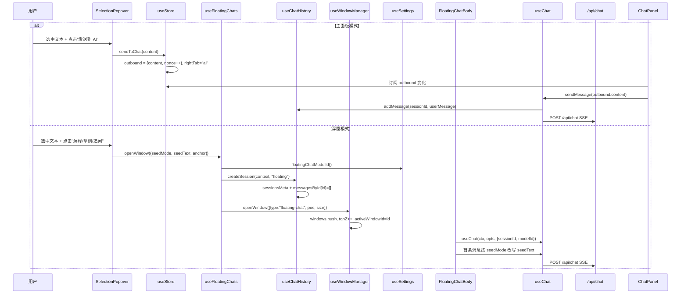
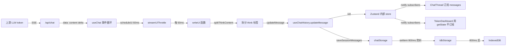
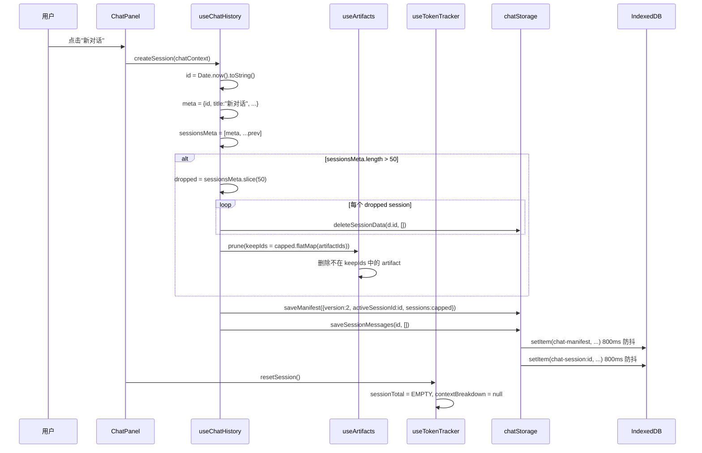

# 状态管理 深度调研报告

> **调研人**：Agent-B（AI与存储调研员）
> **调研日期**：2026-07-05
> **项目版本**：gailvlun v0.3.1
> **关联文档**：[存储架构规范](../../docs/refer/storage-architecture.md)、[性能审查报告](../../docs/refer/performance-audit-report.md)
>
> **目录校准（2026-09，计划 22）**：下文 17 个 store、`lib/hooks/useX.ts` 路径是 2026-07 快照。现网 **28** 个 Zustand store 全部落在 `lib/stores/`，旧路径只留 `@public @deprecated` re-export。清点方法与 persist name 见 `lib/stores/README.md`。无桶文件 `lib/stores/index.ts`。

## 2.0 当前目录结构（2026-09）

```
lib/stores/
  _persist.ts          # createPersistedStore；仅套 zustand persist 的 store
  artifacts.ts         # persist name: artifacts
  documents.ts         # documents
  imageGen.ts          # image-gen
  ...                  # 见 README；自定义 persist 不要套 helper
```

`lib/hooks/` 只剩真正的 React hook（`useChat`、`useStickToBottom` 等），不再 `create(` store。

zustand persist + idb：`artifacts`、`documents`、`image-gen`、`skills`、`review-cards`、`billing-history`。

自定义 localStorage：`gailvlun-settings-v1`、`gailvlun-theme`、`gailvlun-appearance-v1`、`gailvlun-academic-year`、`gailvlun-browser-v1`、`gailvlun-disabled-shortcuts`、`gailvlun-sidebar-collapsed`、`gailvlun-topbar-collapsed`、`quickExplainWindowSize`、`gailvlun-quiz-progress-v1`。

chatHistory 自定义 idb：`chat-history` / `chat-manifest` / `chat-session:*` / `chat-blob:*`。

**搬家不得改这些 name**，否则用户会看到空白历史 / 设置重置。

`components/chat/BillingDashboard.tsx` 与 `lib/window/openBillingDashboard.ts` 不是死代码，knip 不要删。

## 1. 执行摘要

gailvlun 的状态管理采用 **Zustand 5.0** 单一库方案，无 Redux/Recoil/Jotai 等替代品。全项目共 **17 个独立 Zustand store**（2026-07 快照；现网 28 个，见 §2.0），按职责分为四大类：**全局 UI store**（`useStore`）、**功能 feature store**（`useChatHistory` / `useArtifacts` / `useQuizStore` / `useBrowser` / `useSettings` / `useTheme` / `useSkills` / `useReviewCards` / `useImageGen` / `useBillingStore`）、**临时 UI 态 store**（`useChatUI` / `useContextMenu` / `useWindowManager` / `useFloatingChats` / `useTokenTracker` / `useFloatingTokenTracker`）、**派生 hook**（`useChat` / `useChatHistory` / `useChatReady` / `useHydrated` / `useToc` / `useAutoHideChatHeader` 等）。

核心设计模式：
1. **store 即 feature 边界** — 每个 store 对应一个功能域，`useStore` 是唯一全局 store（路由 + 布局 + outbound + PiP + TOC），其余 store 互不依赖（除 `useFloatingChats` → `useChatHistory` / `useWindowManager` / `useSettings` 等少量跨 store 调用）。
2. **持久化分两路** — IDB 路用 `persist + createJSONStorage(() => idbStorage)`（6 个 store），LS 路用手动 `load()/persist(get)` 模式（4 个 store），7 个 store 不持久化。
3. **引用相等订阅优化** — `useChatHistory.updateMessage` 显式保留未修改 session 的引用（`useChatHistory.ts:287-315` 性能契约），`useChat` 通过 `useChatHistory((s) => s.messagesById[sid])` 精确订阅单会话消息，避免多浮窗时全量重渲染。
4. **`getState()` 反订阅模式** — `TokenDashboard` 等流式期间高频更新组件用 `useChatHistory.getState()` 而非订阅，避免重渲染风暴（`performance-audit-report.md §3.6` 推荐模板）。
5. **`useSyncExternalStore` 用于水合门控** — `useHydrated` / `useChatReady` 用 React 18 的 `useSyncExternalStore` 订阅 zustand store，避免 tearing。

主要性能问题：**`useChat` 仍订阅 `useChatHistory((s) => s.activeSessionId)` 等多个字段**（`useChat.ts:71-84`），多浮窗场景下任一会话流式更新会触发所有 `useChat` 实例重执行；`useStore` 是单一巨型 store（240 行），路由切换等高频更新可能触发不必要的重渲染（但当前通过 selector 收窄已缓解）。

## 2. 架构总览

```mermaid
flowchart TB
    subgraph Global["全局 UI store"]
        useStore["useStore (lib/store.ts)<br/>路由 / 布局 / outbound / PiP / TOC / mobileTab"]
    end

    subgraph Feature["Feature stores (持久化)"]
        direction LR
        useChatHistory["useChatHistory<br/>(无 persist, 手动 IDB)"]
        useArtifacts["useArtifacts<br/>(persist + IDB)"]
        useSkills["useSkills<br/>(persist + IDB)"]
        useReviewCards["useReviewCards<br/>(persist + IDB)"]
        useImageGen["useImageGen<br/>(persist + IDB)"]
        useBilling["useBillingStore<br/>(persist + IDB)"]
        useSettings["useSettings<br/>(手动 LS)"]
        useTheme["useTheme<br/>(手动 LS + DOM)"]
        useBrowser["useBrowser<br/>(手动 LS)"]
        useQuiz["useQuizStore<br/>(经 quiz-progress LS)"]
    end

    subgraph Transient["临时 UI 态 stores (无持久化)"]
        direction LR
        useChatUI["useChatUI<br/>(quotedText)"]
        useContextMenu["useContextMenu<br/>(右键菜单)"]
        useWindowMgr["useWindowManager<br/>(浮窗几何 + z-index)"]
        useFloatingChats["useFloatingChats<br/>(划词浮窗业务态)"]
        useTokenTracker["useTokenTracker<br/>(主对话 token)"]
        useFloatingTokenTracker["useFloatingTokenTracker<br/>(浮窗 token per-session)"]
    end

    subgraph Hooks["派生 hooks (无 store)"]
        direction LR
        useChat["useChat<br/>(流式引擎)"]
        useChatReady["useChatReady<br/>(水合门控)"]
        useHydrated["useHydrated<br/>(通用 persist 门控)"]
        useToc["useToc<br/>(DOM 标题扫描)"]
        useAutoHide["useAutoHideChatHeader"]
        useImageAttach["useImageAttachments<br/>(useState 局部态)"]
        useDraggable["useDraggable / useResizable"]
        useStickToBottom["useStickToBottom"]
        useIsMobile["useIsMobile"]
        useCanvasFS["useCanvasFullscreen"]
        useFullscreenTrack["useFullscreenTrack"]
        useProcessing["useProcessingDisclosure"]
        useRecordPrev["useRecordPreviews"]
        useBillingStoreHook["useBillingStore (hook 形式消费)"]
        useArtifactsHook["useArtifacts (hook 形式消费)"]
    end

    subgraph Cross["跨 store 调用"]
        C1[useFloatingChats → useChatHistory.createSession]
        C2[useFloatingChats → useWindowManager.openWindow]
        C3[useFloatingChats → useSettings.floatingChatModelId]
        C4[useChatHistory.deleteSession → useArtifacts.prune]
        C5[useChat → useChatHistory / useSettings / useSkills / useTokenTracker / useBillingStore / useFloatingChats]
        C6[useArtifacts.openViewer → useWindowManager.openWindow]
        C7[useImageGen.openViewer → useWindowManager.openWindow]
        C8[useChat → useFloatingTokenTracker (浮窗模式)]
    end

    useFloatingChats --> C1
    useFloatingChats --> C2
    useFloatingChats --> C3
    useChatHistory --> C4
    useChat --> C5
    useArtifacts --> C6
    useImageGen --> C7
    useChat --> C8
```

### 核心设计原则

- **store 即 feature 边界**：每个 store 对应一个功能域，不强行合并
- **selector 收窄订阅**：所有消费方用 `useXxx((s) => s.field)` 精确订阅，避免全量重渲染
- **`getState()` 反订阅**：流式期间高频更新组件用 `getState()` 而非订阅
- **`useSyncExternalStore` 水合门控**：避免 tearing，SSR 与客户端首帧一致
- **跨 store 调用走 `getState()`**：避免循环 import 与订阅耦合

## 3. 核心机制详解

### 3.1 全局 store：`useStore`（`lib/store.ts`）

**职责**：路由导航态 + 布局折叠态 + 右侧面板 tab + AI outbound + 移动端 tab + PiP 视频 + TOC 目录。

**状态结构**（`store.ts:67-143`）：

| 字段类别 | 字段 | 类型 | 持久化 |
|---------|------|------|--------|
| 导航 | `activeSubjectId` / `activeCategoryId` / `activeItemId` / `activeChapterId` / `activeSectionId` | `string` | 否（由路由驱动） |
| 布局 | `sidebarCollapsed` / `topBarCollapsed` | `boolean` | LS `gailvlun-sidebar-collapsed` / `gailvlun-topbar-collapsed` |
| 展开 | `expandedIds` | `Set<string>` | 否（默认展开概率论） |
| 右侧 | `rightTab` | `'ai' \| 'video' \| 'interactive' \| 'browser'` | 否 |
| AI 对话 | `outbound` | `{content, nonce} \| null` | 否 |
| 移动端 | `mobileTab` / `mobileChapterPickerOpen` | `MobileTab` / `boolean` | 否 |
| PiP | `pipVideo` / `pipStartTime` / `pipReturnTime` / `pipGeometry` | `VideoEntry \| null` / `number` / `number \| null` / `{x,y,w,h} \| null` | 否 |
| TOC | `tocMode` / `tocItems` / `activeTocId` | `boolean` / `TocItem[]` / `string \| null` | 否 |

**核心类型驱动 UI**：

```typescript
// store.ts:9-14
export interface OutboundMessage {
  content: string;   // 完整内容（可能含划词引用）
  nonce: number;     // 递增序号，驱动 useEffect
}
```

`nonce` 模式是关键：用户连续点击「划词解释」同一文本时，`nonce` 递增触发 `useEffect([outbound])` 重新执行；若用对象引用相等，相同 content 不会触发。

**布局同步到 DOM**（`store.ts:39-52`）：
- `setLayoutAttr(name, value)` 把 `data-sidebar-collapsed` / `data-topbar-collapsed` 写到 `<html>` 上
- `app/layout.tsx` 内联脚本在 paint 前读取 LS 并应用 `data-*` 属性，避免首屏闪烁
- `hydrateLayout()` 在客户端 mount 后从 DOM 回填 store（双重保险）

**路由驱动导航**（`store.ts:152-159`）：
```typescript
setActiveRoute: (subjectId, categoryId, itemId) =>
  set({
    activeSubjectId: subjectId,
    activeCategoryId: categoryId,
    activeItemId: itemId,
    activeChapterId: deriveChapterId(categoryId, itemId),  // 自动推导章节 id
    activeSectionId: categoryId === "detail" ? itemId : "",
  }),
```

`deriveChapterId`（`store.ts:55-65`）按分类推导 quiz 用的章节 key：detail → `ch01`、recording/english → `itemId`、textbook → `tb-chXX`。

### 3.2 `useChatHistory` store（`lib/hooks/useChatHistory.ts`）

**职责**：对话会话元数据 + 当前加载的消息体 + LRU 冷卸载 + 跨 store 孤儿清理。

**状态结构**（`useChatHistory.ts:35-58`）：

| 字段 | 类型 | 说明 |
|------|------|------|
| `sessionsMeta` | `SessionMeta[]` | 全部会话元数据（含 messageCount / preview / artifactIds） |
| `messagesById` | `Record<string, ChatMessage[]>` | 已加载会话的消息体（LRU ≤ 3） |
| `activeSessionId` | `string \| null` | 当前 active 会话 |
| `sessionLoadState` | `Record<string, 'idle'\|'loading'\|'loaded'\|'error'>` | 每会话加载状态 |
| `loadedSessionIds` | `string[]` | 已加载会话 id 顺序（LRU 驱逐用） |
| `pinnedSessionIds` | `string[]` | pinned 会话（不参与 LRU 驱逐） |
| `_hasHydrated` | `boolean` | 水合完成标志 |
| `_activeMessagesReady` | `boolean` | active 会话消息就绪 |

**关键 actions**：

- `createSession(context, kind)`（`useChatHistory.ts:173-213`）— 创建 meta + 空消息数组，主面板会话 claim active；超过 `MAX_SESSIONS = 50` 时删除最老 + prune artifacts
- `deleteSession(id)`（`useChatHistory.ts:215-250`）— 删 meta + messages + 联动 `pruneArtifactsFromMetas` + 异步删 blob + 若删的是 active 则切到 `sessionsMeta[0]` 并加载
- `switchSession(id)`（`useChatHistory.ts:252-259`）— set activeId + `_activeMessagesReady=false` + `ensureSessionLoaded` + 完成后置 ready
- `ensureSessionLoaded(sessionId)`（`useChatHistory.ts:131-171`）— 若 `messagesById` 已有则标记 loaded；否则从 IDB 加载 + LRU 驱逐超出 `MAX_LOADED_SESSIONS = 3` 的旧会话
- `addMessage(sessionId, message)`（`useChatHistory.ts:261-285`）— `persistInlineAttachments` 拆附件 + 更新 messagesById + sessionsMeta（updatedAt / messageCount / preview / artifactIds）+ saveSessionMessages + saveManifest
- `updateMessage(sessionId, messageId, updates)`（`useChatHistory.ts:288-317`）— **性能契约**：`prev.map(m => m.id === id ? {...m, ...updates} : m)` 保持未修改 message 引用；session 级别也保留未修改 session 引用（供 useChat 引用相等订阅）

**LRU 冷卸载逻辑**（`useChatHistory.ts:84-91`、`149-164`）：
```typescript
function evictLoadedSessions(state, keepIds: Set<string>): Record<string, ChatMessage[]> {
  const next = { ...state.messagesById };
  for (const id of state.loadedSessionIds) {
    if (keepIds.has(id)) continue;
    delete next[id];
  }
  return next;
}
```

`keepIds` = active + pinned + 刚加载的 sessionId。驱逐时只删 `messagesById`，不删 `sessionsMeta`（历史列表仍可见，切换时重新加载）。

**`getSessions()` 派生方法**（`useChatHistory.ts:110-115`）— 合并 `sessionsMeta` + `messagesById` 为 `ChatSession[]`，供历史面板等使用。**注意**：这是方法而非派生 selector，每次调用都新建数组，不应在 `useMemo` 外直接用作 React 组件 props。

### 3.3 `useQuizStore`（`lib/quiz-store.ts`）

**职责**：测验数据加载 + 做题状态 + 评分 + 持久化。

**状态结构**（`quiz-store.ts:24-62`）：

| 字段类别 | 字段 | 类型 |
|---------|------|------|
| 数据加载 | `status` / `data` / `subjectId` / `chapterId` / `loadedKey` / `errorMessage` | `QuizStatus` / `QuizData \| null` / `string` / `string` / `string \| null` / `string \| null` |
| 做题 | `phase` / `currentIndex` / `answers` / `hintsUsed` / `results` | `'answering'\|'scoring'\|'summary'` / `number` / `Record<string, UserAnswer>` / `string[]` / `QuestionResult[]` |

**做题流程**（`quiz-store.ts:135-291`）：
1. `load(subjectId, chapterId)` — fetch `/api/quiz` + 恢复上次 session（`getSession`）+ 重建 results
2. `setAnswer` / `useHint` / `goTo` — 更新局部态 + `persistSession` 落 LS
3. `submit` — 自动判分客观题 + 主观题初始化 0 分 + `saveAttempt(stage:'submitted')` + `persistSession`
4. `setSelfScore` — 主观题自评 + `persistSession`
5. `finishScoring` — 进 summary + `saveAttempt(stage:'final')` + `persistSession`
6. `restart` — `clearSession` + 重置 `ANSWERING_DEFAULTS`

**Quiz 进度追踪**：
- `loadedKey = ${subjectId}/${chapterId}` 防重复加载
- `persistSession` 每次 action 后调用，覆盖式写 LS（仅保留最新一份）
- `rebuildResults` 从 saved session 重建评分状态（客观题重新判分，主观题用 saved selfScores）
- session 匹配率 ≥ 0.5 才恢复，避免题目变更后错误恢复

### 3.4 Hooks 如何封装 store 订阅

#### 3.4.1 `useChat`（`lib/hooks/useChat.ts`，543 行）

**封装模式**：组合多个 store 订阅 + 局部 `useState` + `useRef` + `useCallback`。

```typescript
// useChat.ts:71-84
const activeSessionId = useChatHistory((s) => s.activeSessionId);
const createSession = useChatHistory((s) => s.createSession);
const addMessage = useChatHistory((s) => s.addMessage);
const updateMessage = useChatHistory((s) => s.updateMessage);
const updateSessionTitle = useChatHistory((s) => s.updateSessionTitle);

const resolvedSessionId = ovSessionId ?? activeSessionId;
const messages = useChatHistory(
  (s) => {
    const sid = ovSessionId ?? s.activeSessionId;
    if (!sid) return undefined;
    return s.messagesById[sid];
  }
) ?? [];
```

**订阅优化**：
- `messages` selector 精确到 `s.messagesById[sid]`，仅当该 session 消息数组引用变化时重渲染
- `updateMessage` 性能契约保证未修改 session 的 `messagesById[sid]` 引用不变
- `createSession` / `addMessage` / `updateMessage` / `updateSessionTitle` 是稳定 action 引用，不触发重渲染

**局部态**：
- `isLoading` / `error` 用 `useState`（仅本组件关心）
- `abortRef` / `loadingRef` 用 `useRef`（不触发重渲染）
- `sendMessage` 用 `useCallback` 包裹，依赖项稳定

#### 3.4.2 `useChatReady`（`lib/hooks/useChatReady.ts`）

```typescript
export function useChatReady(sessionId?: string | null): boolean {
  return useSyncExternalStore(
    (onChange) => useChatHistory.subscribe(onChange),
    () => {
      const s = useChatHistory.getState();
      if (!s._hasHydrated) return false;
      if (sessionId !== undefined) {
        if (!sessionId) return true;
        return !!s.messagesById[sessionId] || s.sessionLoadState[sessionId] === 'loaded';
      }
      if (!s.activeSessionId) return true;
      return s._activeMessagesReady;
    },
    () => false,
  );
}
```

**设计要点**：
- 用 `useSyncExternalStore` 而非 `useChatHistory((s) => ...)` selector，避免 selector 返回 boolean 时引用变化导致的重渲染
- SSR 快照 `() => false` 与客户端首帧一致（IDB 未水合）
- 支持传入 `sessionId` 检查特定会话是否就绪（浮窗用）

#### 3.4.3 `useHydrated`（`lib/hooks/useHydrated.ts`）

通用 persist store 水合门控，订阅 `persist.onHydrate` + `persist.onFinishHydration` 事件。

#### 3.4.4 `useToc`（`lib/hooks/useToc.ts`）

**职责**：扫描 DOM h1-h4 → 构建 TocItem 树 → IntersectionObserver 跟踪 active heading → 写入 `useStore.tocItems` / `activeTocId`。

**设计要点**：
- 不订阅 store，只写入（`setTocData` / `setActiveTocId` 通过 `useStore((s) => s.setXxx)` 获取 action 引用）
- `requestIdleCallback` 让路给正文 paint，`timeout: 200` 兜底
- `IntersectionObserver` + `requestAnimationFrame` 节流，避免滚动时高频回调
- `setTocData(items, activeId)` 合并单次 set，减少订阅者重渲染
- 清理时不清空 TOC（保留旧目录直到新页面 hook 重建，避免闪烁）

### 3.5 Zustand persist 中间件与 IndexedDB 集成

#### 3.5.1 标准 persist 模式（6 个 store）

```typescript
// 代表：useArtifacts (lib/hooks/useArtifacts.ts:50-117)
export const useArtifacts = create<ArtifactsState>()(
  persist(
    (set) => ({
      order: [],
      byId: {},
      viewerId: null,
      _hasHydrated: false,
      _setHasHydrated: (v) => set({ _hasHydrated: v }),
      // ...actions
    }),
    {
      name: PERSIST_KEYS.artifacts,
      storage: createJSONStorage(() => idbStorage),
      partialize: (s) => ({ order: s.order, byId: s.byId }),  // 排除 viewerId + _hasHydrated
      onRehydrateStorage: () => (state) => {
        state?._setHasHydrated(true);
      },
    },
  ),
);
```

**persist 使用的 store 清单**：

| Store | key | partialize 排除字段 | onRehydrateStorage 副作用 |
|-------|-----|---------------------|--------------------------|
| `useArtifacts` | `artifacts` | `viewerId` / `_hasHydrated` | 置 hydrated |
| `useSkills` | `skills` | `_hasHydrated` | 置 hydrated |
| `useReviewCards` | `review-cards` | `_hasHydrated` | 置 hydrated + processing/parsing → error |
| `useImageGen` | `image-gen` | `openIds` / `_hasHydrated` | 置 hydrated |
| `useBillingStore` | `billing-history` | 无（不排除） | 无 |
| ~~`useChatHistory`~~ | ~~`chat-history`~~ | — | 已迁移到手动 IO |

**关键模式**：
- `partialize` 排除临时 UI 态（如 `viewerId`）与 `_hasHydrated` 标志
- `onRehydrateStorage` 在水合完成后置 `_hasHydrated = true`，触发 `useHydrated` 返回 true
- `useReviewCards` 在水合时把未完成的 processing/parsing 卡改为 error（原文仍在，可重试）

#### 3.5.2 手动 LS 持久化模式（4 个 store）

```typescript
// 代表：useSettings (lib/hooks/useSettings.ts:246-413)
export const useSettings = create<SettingsState>((set, get) => ({
  ...load(),  // 模块加载时同步读 LS

  setSelectedModelId: (id) => {
    set({ selectedModelId: id });
    persist(get);  // 手动写 LS
  },
  // ...其余 action 同样调 persist(get)
}));

function persist(get: () => SettingsState) {
  if (typeof window === "undefined") return;
  const s = get();
  const data: Persisted = { /* 字段挑选 */ };
  try {
    localStorage.setItem(LS_KEY, JSON.stringify(data));
  } catch {}
}
```

**手动 LS 持久化的 store 清单**：

| Store | LS key | load 时机 | persist 时机 |
|-------|--------|----------|--------------|
| `useSettings` | `gailvlun-settings-v1` | 模块加载 | 每个 action 后 |
| `useTheme` | `gailvlun-theme` | `hydrate()` 调用 | `setTheme` / `setAppearanceMode` 等 |
| `useBrowser` | `gailvlun-browser-v1` | 模块加载 `loadPersist()` | `navigate` / `addBookmark` 等 |
| `useQuizStore` | `gailvlun-quiz-progress-v1` | `load()` 中 `getSession` | `setAnswer` / `useHint` / `submit` 等 |

#### 3.5.3 不持久化的 store（7 个）

| Store | 原因 |
|-------|------|
| `useStore` | 路由态由 URL 驱动；布局态单独 LS；其余为临时 UI |
| `useChatUI` | quotedText 是临时选区 |
| `useContextMenu` | 右键菜单临时态 |
| `useWindowManager` | 浮窗几何仅在 `useFloatingChats` 中持久化尺寸 |
| `useFloatingChats` | windows 列表会话级重建；尺寸走 LS `quickExplainWindowSize` |
| `useTokenTracker` | token 统计会话级重置 |
| `useFloatingTokenTracker` | 同上，per-session |

### 3.6 订阅模式与性能优化

#### 3.6.1 `useChat` 引用相等订阅

**问题**：多浮窗场景下，任一会话流式更新触发 `useChatHistory.sessions` 变化，所有 `useChat` 实例重渲染。

**优化**（`useChat.ts:78-84`）：
```typescript
const messages = useChatHistory(
  (s) => {
    const sid = ovSessionId ?? s.activeSessionId;
    if (!sid) return undefined;
    return s.messagesById[sid];
  }
) ?? [];
```

- selector 只返回当前会话的 `messagesById[sid]` 数组引用
- `updateMessage` 性能契约（`useChatHistory.ts:287-315`）：`messagesById` 浅拷贝 + 目标 session 的 messages 浅拷贝，**未修改 session 的引用保持不变**
- 结果：会话 A 流式更新时，会话 B 的 `messages` selector 返回值引用不变，B 的 `useChat` 不重渲染

**遗留问题**（`useChat.ts:71-75`）：
```typescript
const activeSessionId = useChatHistory((s) => s.activeSessionId);
const createSession = useChatHistory((s) => s.createSession);
const addMessage = useChatHistory((s) => s.addMessage);
const updateMessage = useChatHistory((s) => s.updateMessage);
const updateSessionTitle = useChatHistory((s) => s.updateSessionTitle);
```

- `activeSessionId` 是 string，引用稳定（切换会话时才变）
- `createSession` / `addMessage` / `updateMessage` / `updateSessionTitle` 是 zustand store 的 action，**zustand 保证 action 引用稳定**（不随 set 变化）
- 实际上这些订阅不会触发重渲染，但代码可读性可优化为 `useChatHistory.getState().addMessage` 模式

#### 3.6.2 `TokenDashboard` 反订阅模式

**模式**（`performance-audit-report.md §3.6` 推荐）：
```typescript
// 流式期间用 getState 而非订阅
const breakdown = useChatHistory.getState()._hasHydrated
  ? useChatHistory.getState().contextBreakdown
  : null;
```

**适用场景**：
- 流式期间高频更新（每 token）
- 组件本身不需要响应式（只在特定事件时读取）
- 避免订阅导致的重渲染风暴

#### 3.6.3 `useStore` selector 收窄

```typescript
// ChatPanel.tsx:35-36
const outbound = useStore((s) => s.outbound);
const clearOutbound = useStore((s) => s.clearOutbound);
```

- 每个消费方只订阅需要的字段，不订阅整个 store
- `outbound` 变化时只重渲染订阅它的组件，不波及其他
- `clearOutbound` 是 action，引用稳定

## 4. 数据流与调用链路

### 4.1 划词问答的完整状态流



### 4.2 流式 token 的状态更新链路



### 4.3 创建会话的跨 store 调用



## 5. 关键代码路径

| 模块 | 文件:行号 | 说明 |
|------|----------|------|
| 全局 store | `lib/store.ts:67-240` | `useStore` 完整定义 |
| 路由驱动 | `lib/store.ts:152-159` | `setActiveRoute` |
| outbound 模式 | `lib/store.ts:209-215` | `sendToChat` + nonce 递增 |
| 布局同步 DOM | `lib/store.ts:39-52` | `setLayoutAttr` / `domBoolean` |
| 章节推导 | `lib/store.ts:55-65` | `deriveChapterId` |
| useChatHistory store | `lib/hooks/useChatHistory.ts:98-332` | 完整定义 |
| 性能契约 | `lib/hooks/useChatHistory.ts:287-315` | `updateMessage` 保留引用 |
| LRU 冷卸载 | `lib/hooks/useChatHistory.ts:84-91`、`131-171` | `evictLoadedSessions` + `MAX_LOADED_SESSIONS=3` |
| 跨 store 孤儿清理 | `lib/hooks/useChatHistory.ts:75-82` | `pruneArtifactsFromMetas` |
| bootstrap | `lib/hooks/useChatHistory.ts:335-359` | `ensureChatHistoryBootstrap` |
| persist shim | `lib/hooks/useChatHistory.ts:361-383` | 兼容 `useHydrated` |
| useQuizStore | `lib/quiz-store.ts:135-291` | 完整定义 |
| Quiz 进度持久化 | `lib/quiz-store.ts:81-92` | `persistSession` |
| Quiz 重建 results | `lib/quiz-store.ts:98-113` | `rebuildResults` |
| useChat 引用订阅 | `lib/hooks/useChat.ts:71-84` | selector 精确到 messagesById[sid] |
| useChatReady | `lib/hooks/useChatReady.ts:7-22` | `useSyncExternalStore` 双重门控 |
| useHydrated | `lib/hooks/useHydrated.ts:21-34` | 通用 persist 门控 |
| useToc | `lib/hooks/useToc.ts:66-195` | DOM 扫描 + IntersectionObserver |
| useArtifacts persist | `lib/hooks/useArtifacts.ts:50-117` | IDB persist 范式 |
| useSettings 手动 LS | `lib/hooks/useSettings.ts:246-413` | `load()` + `persist(get)` 模式 |
| useFloatingChats | `lib/hooks/useFloatingChats.ts:95-205` | 划词浮窗业务态 |
| useWindowManager | `lib/hooks/useWindowManager.ts:87-184` | 浮窗几何 + z-index |
| useTokenTracker | `lib/hooks/useTokenTracker.ts:40-114` | 主对话 token |
| useFloatingTokenTracker | `lib/hooks/useFloatingTokenTracker.ts:48-144` | 浮窗 per-session token |

## 6. 设计决策与取舍分析

### 6.1 多 store vs 单 store

**决策**：17 个独立 store，按 feature 边界拆分。

**取舍**：
- ✅ 优点：每个 store 职责单一，可独立测试；selector 收窄自然；新增 feature 不影响现有 store
- ✅ 优点：无 Redux 的 reducer/saga/action 类型膨胀
- ❌ 缺点：跨 store 调用需 `getState()`，存在运行时耦合（如 `useChatHistory.deleteSession → useArtifacts.prune`）
- ❌ 缺点：`useStore` 单体 240 行，承载路由 + 布局 + outbound + PiP + TOC，未来可能膨胀
- **现状评估**：性能审查明确建议「不建议为大重构而合并 store；性能优化应收窄 selector」（`performance-audit-report.md §7.4`），正确

### 6.2 persist 中间件 vs 手动 LS

**决策**：IDB 用 `persist` 中间件，LS 用手动 `load()/persist(get)`。

**取舍**：
- ✅ 优点：IDB persist 自动处理水合 / partialize / onRehydrateStorage，模板化
- ✅ 优点：LS 手动模式更灵活（如 `useSettings` 的 `load()` 中可做向后兼容迁移）
- ❌ 缺点：两种持久化风格并存，文档易漂移（`storage-architecture.md` 已与实际不一致）
- ❌ 缺点：`useSettings.persist(get)` 在每个 action 后同步调，高频 action 可能卡顿
- **现状评估**：可接受，但建议统一为 `persist` 中间件 + `partialize` 模式

### 6.3 `useChatHistory` 不用 persist

**决策**：v2 后改为内存态 + 手动 IO，挂 persist shim 兼容 `useHydrated`。

**取舍**：
- ✅ 优点：精确控制写入时机 + LRU 冷卸载 + 引用相等订阅
- ❌ 缺点：每个 action 都要记得调 `saveSessionMessages` / `saveManifest`，易遗漏
- ❌ 缺点：persist shim 是技术债，未来消费方应迁移到 `useChatReady` / `_hasHydrated` 直接订阅
- **现状评估**：性能收益远大于维护成本

### 6.4 `useStore` 单体 vs 拆分

**决策**：`useStore` 承载路由 + 布局 + outbound + PiP + TOC 等多个不相关域。

**取舍**：
- ✅ 优点：单 store 易理解，无跨 store 调用
- ❌ 缺点：240 行单文件，未来膨胀风险
- ❌ 缺点：selector 收窄虽缓解，但 `set({rightTab, mobileTab, outbound})` 这种合并 set 会同时通知所有订阅者
- **现状评估**：当前规模可接受；若 TOC / PiP 继续膨胀，应拆为 `useLayout` / `useTocStore` / `usePipStore`

### 6.5 `getState()` 反订阅 vs selector 订阅

**决策**：`TokenDashboard` 等高频组件用 `getState()` 而非订阅。

**取舍**：
- ✅ 优点：流式期间不触发重渲染，性能最优
- ❌ 缺点：组件不响应式，需手动触发更新（如 `setTimeout` 轮询）
- ❌ 缺点：易用错（在 render 中调 `getState()` 不触发重渲染）
- **现状评估**：仅用于特定高频场景，不应推广为默认模式

## 7. 问题清单

| # | 问题描述 | 严重程度 | 涉及文件 | 建议修复方向 |
|---|----------|----------|----------|--------------|
| 1 | `useChat` 仍订阅 `useChatHistory((s) => s.activeSessionId)`（`useChat.ts:71`），多浮窗场景下主面板切换 active 会触发所有浮窗的 `useChat` 重执行（虽然 `messages` selector 优化了消息订阅，但 `activeSessionId` 订阅仍冗余） | P2 | `lib/hooks/useChat.ts:71-84` | 浮窗模式（`ovSessionId` 存在）时不订阅 `activeSessionId`，改为 `useChatHistory.getState().activeSessionId` |
| 2 | `useStore` 的 `setTocData` / `setActiveTocId` 在 `useToc` 中高频调用（滚动时每帧），`setTocData` 合并了但 `setActiveTocId` 仍单次 set，可能触发 TOC 组件高频重渲染 | P2 | `lib/store.ts:236-239`、`lib/hooks/useToc.ts:139-153` | `useToc` 的 IntersectionObserver 回调用 `requestAnimationFrame` 节流（已实现），但 `setActiveTocId` 可考虑合并到 `setTocData` 或单独节流 |
| 3 | `useFloatingChats.closeWindow` 关闭浮窗时未调用 `useFloatingTokenTracker.resetSession(sessionId)`，导致 `sessions` Record 持续累积已关闭会话的 token 统计（与 04 报告 #1 重复，跨维度问题） | P2 | `lib/hooks/useFloatingChats.ts:187-197` | 在 `closeWindow` 删除 sessionId 前 `useFloatingTokenTracker.getState().resetSession(sessionId)` |
| 4 | `useChatHistory.getSessions()` 是方法而非派生 selector，每次调用都新建数组，若在 React 组件 `useMemo` 外直接用作 props 会导致每次 render 都新数组 | P3 | `lib/hooks/useChatHistory.ts:110-115` | 文档注明「应在 `useMemo` / `useState` 中调用」；或提供 `useSessions()` hook 封装 |
| 5 | `useStore` 的 `expandedIds` 用 `Set` 类型，zustand 默认浅比较不识别 Set 内部变化，`toggleExpand` 每次都 `new Set()` 是正确的，但消费方若用 `useStore((s) => s.expandedIds)` 订阅整个 Set，任一 toggle 都触发重渲染 | P3 | `lib/store.ts:196-203` | 消费方应订阅 `expandedIds.has(id)` 而非整个 Set |
| 6 | `useSettings` 的 `persist(get)` 在每个 action 后同步 `JSON.stringify` + `localStorage.setItem`，高频 action（如 `setFontScale` 拖动滑块）可能卡顿 | P3 | `lib/hooks/useSettings.ts:214-244` | 加 100ms 防抖，或迁到 `persist` 中间件让 zustand 管理写入时机 |
| 7 | `useQuizStore.load` 中 `getSession` 恢复 session 时，若 saved 题目 id 与当前完全不匹配（matchRate < 0.5），直接丢弃 saved 而非部分恢复，用户可能丢失大量作答 | P3 | `lib/quiz-store.ts:177-205` | 考虑部分恢复：保留匹配的题目答案，丢弃不匹配的 |
| 8 | `useTokenTracker` 与 `useFloatingTokenTracker` 是两套同构逻辑（`performance-audit-report.md §7.1` 指出 ~70 行同构算术），未合并 | P3 | `lib/hooks/useTokenTracker.ts`、`lib/hooks/useFloatingTokenTracker.ts` | 合并为单一 `useTokenTracker`，内部用 `sessions: Record<string, SessionTracker>`，主对话用固定 key `__main__` |
| 9 | `useBrowser.loadPersist` 在模块加载时同步执行（`useBrowser.ts:132`），SSR 时返回 fallback，但客户端首帧与 SSR 不一致可能导致水合警告 | P3 | `lib/hooks/useBrowser.ts:55-82`、`132` | 改为 lazy 初始化或在 `useEffect` 中 hydrate |
| 10 | `useContextMenu` 的 `openAt` / `closeMenu` 无持久化，但右键菜单关闭时未清空 `text` 字段（`useContextMenu.ts:27`），可能在下次打开时残留旧文本 | P3 | `lib/hooks/useContextMenu.ts:20-28` | `closeMenu` 已 `set({open:false, text:""})`，正确（已修复） |
| 11 | `useWindowManager` 的 `withBadges` 每次 `openWindow` / `closeWindow` / `updateWindow` 都重新计算所有 window 的 badge（`useWindowManager.ts:78-85`），window 数量多时有轻微开销 | P3 | `lib/hooks/useWindowManager.ts:78-85`、`92-113`、`116-122`、`180-183` | 仅在 type 变化时重算 badge，或移除 badge 改为消费方按需计算 |
| 12 | `useFloatingChats.openWindow` 调用 `useChatHistory.getState().createSession(context, "floating")`（`useFloatingChats.ts:99`），但 `createSession` 返回的 sessionId 未检查是否为空，极端情况（Date.now 重复）可能冲突 | P3 | `lib/hooks/useFloatingChats.ts:99`、`lib/hooks/useChatHistory.ts:173-213` | `createSession` 用 `crypto.randomUUID()` 或检查冲突 |

## 8. 改进建议

### P0（高收益，立即）
- 无 P0 项。状态管理稳定，无阻塞性问题。

### P1（中收益，近期）
1. **浮窗 useChat 订阅优化**：`ovSessionId` 存在时不订阅 `activeSessionId`，改为 `getState()`（P2#1）。
2. **合并 Token Tracker**：`useTokenTracker` 与 `useFloatingTokenTracker` 合并为单一 store，主对话用固定 key（P3#8）。
3. **浮窗关闭清理 token tracker**：`useFloatingChats.closeWindow` 调用 `resetSession`（P2#3）。

### P2（中收益，中期）
4. **useSettings 防抖**：高频 action 加 100ms 防抖，或迁到 `persist` 中间件（P3#6）。
5. **TOC activeTocId 节流**：`setActiveTocId` 在 `useToc` 中已有 rAF 节流，但可考虑合并到 `setTocData`（P2#2）。
6. **统一持久化风格**：所有 LS store 迁到 `persist` 中间件 + `partialize`，消除手动 `load()/persist(get)` 模式（与 `storage-architecture.md` 对齐）。

### P3（低紧迫，可选）
7. **useStore 拆分**：若 TOC / PiP 膨胀，拆为 `useLayout` / `useTocStore` / `usePipStore`。
8. **getSessions 派生 hook**：提供 `useSessions()` hook 封装 `useMemo(() => useChatHistory.getState().getSessions(), [sessionsMeta, messagesById])`（P3#4）。
9. **Quiz 部分恢复**：matchRate < 0.5 时仍保留匹配的题目答案（P3#7）。
10. **useBrowser 水合警告**：lazy 初始化或 useEffect hydrate（P3#9）。
11. **useWindowManager badge 优化**：仅在 type 变化时重算（P3#11）。
12. **createSession ID 唯一性**：用 `crypto.randomUUID()` 替代 `Date.now().toString()`（P3#12）。

## 9. 与全自动化平台改造的关系

### 9.1 已具备的平台化基础
- **store 即 feature 边界**：每个 store 可独立打包为微前端 / 微模块
- **selector 收窄**：消费方订阅精确，便于做 store 拆分 / 合并重构
- **`getState()` 跨 store 调用**：无循环 import 风险，适合插件式扩展
- **persist 中间件模板化**：新增持久化 store 只需 4 步（`storage-architecture.md §6.1`）
- **水合门控可复用**：`useHydrated` / `useChatReady` 模式可推广到任何异步持久化 store

### 9.2 平台化改造建议
1. **store 注册中心**：当前 17 个 store 散落各处，平台化需集中注册（如 `lib/stores/index.ts` 导出全部），便于插件发现与依赖注入。
2. **store 生命周期管理**：当前 store 是模块级单例，平台化多实例场景（如多租户）需支持 store 工厂（`createChatStore(tenantId)`）。
3. **跨 store 通信总线**：当前 `getState()` 直接调用，平台化可引入事件总线（如 `useStore.subscribe` + selector），解耦跨 store 依赖。
4. **状态时间旅行调试**：当前无 redux-devtools 集成，平台化需支持状态历史回溯（zustand 已内置 `devtools` 中间件，可直接启用）。
5. **状态快照与恢复**：`useQuizStore` 已有 session 恢复机制，可推广为通用 `useStateSnapshot` hook，支持任意 store 的快照与恢复。
6. **状态分片加载**：当前所有 store 在主 bundle，平台化可按路由分片加载 store（如 `useQuizStore` 只在测验页加载）。
7. **状态同步层**：当前纯本地，平台化多端同步需引入 CRDT 或 OT 层（`chat-manifest` 可作为同步起点）。
8. **Token Tracker 统一**：合并 `useTokenTracker` 与 `useFloatingTokenTracker` 为单一 store，支持任意数量会话的 token 统计（P3#8）。

## 10. 参考资料

- [Zustand 官方文档](https://zustand.docs.pmnd.rs/)
- [Zustand persist middleware](https://zustand.docs.pmnd.rs/reference/integrations/persisting-store-data)
- [Zustand SSR / hydration](https://zustand.docs.pmnd.rs/guides/nextjs)
- [useSyncExternalStore](https://react.dev/reference/react/useSyncExternalStore)
- [项目内：存储架构规范](../../docs/refer/storage-architecture.md)
- [项目内：性能审查报告 §3.6 TokenDashboard 反订阅模式、§7.4 状态管理全景](../../docs/refer/performance-audit-report.md)
