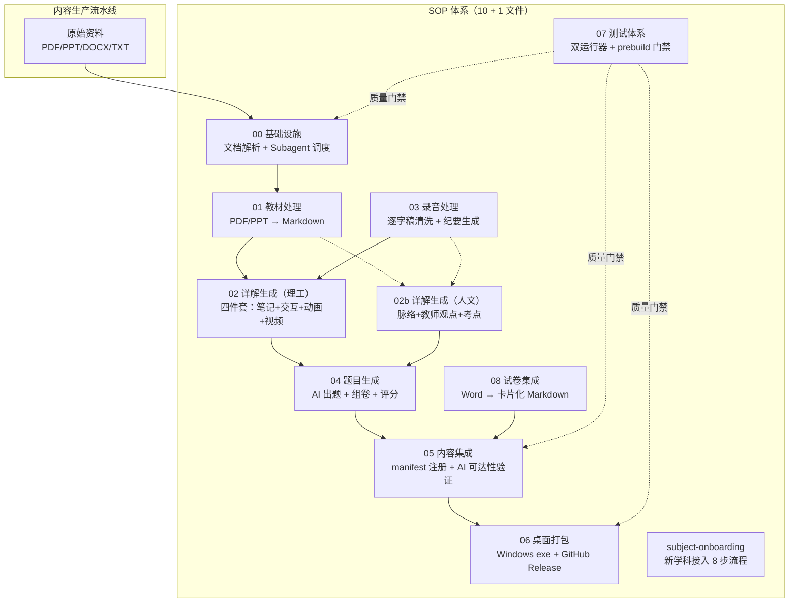
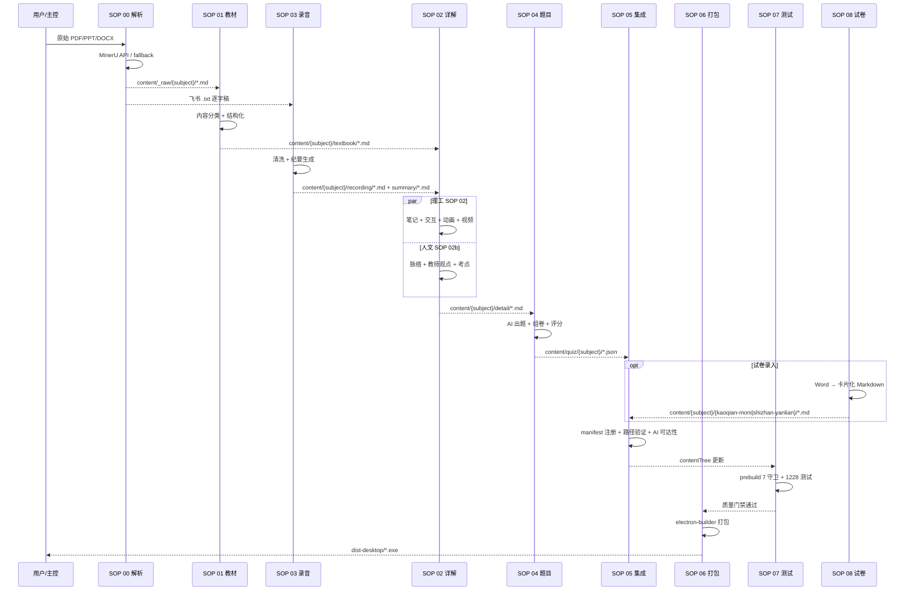

# SOP 体系与内容生产流程深度调研报告

> **调研人**：Agent-D（工程与测试调研员）
> **调研日期**：2026-07-05
> **项目版本**：gailvlun v0.3.1
> **关联文档**：`docs/sop/` 全部 11 个 SOP 文件、`docs/refer/`、`docs/plans/`

## 1. 执行摘要

gailvlun 项目建立了 **10 个编号 SOP + 1 个新学科接入指南**的完整标准化操作流程体系，覆盖从基础设施（00）→ 教材处理（01）→ 详解生成（02/02b）→ 录音处理（03）→ 题目生成（04）→ 内容集成（05）→ 桌面打包（06）→ 测试（07）→ 试卷集成（08）的端到端内容生产链路。SOP 体系的核心设计是 **"主控智能体 + 多 subagent 并行"** 架构——主控负责规划与调度，独立的 Shell/GeneralPurpose subagent 按章节拆分（每 subagent 处理 3-4 章/讲）避免上下文过长导致质量下降。

整个内容生产流程已具备 **相当成熟的自动化基础**：文档解析有 MinerU API + 4 级容灾降级（MinerU → marker → 按类型选库 → 智能体直读），内容生成有 subagent 并行 + workflow.js 编排，质量门禁有 prebuild 7 脚本守卫 + 1228 个测试。但仍存在多个**人工节点**：教材内容分类判断、详解原创撰写、录音清洗规则、题目质量核验、试卷卡片化重写等，均需智能体决策。

**人文 vs 理工**的 SOP 差异清晰：理工科（02）要求"四件套"（笔记 + 交互 + 动画 + 视频），强调定义-定理-推导结构；人文科（02b）无动画/交互要求，强调脉络梳理、教师观点保留、考试重点标注。新学科接入（subject-onboarding）有完整的 8 步流程，从目录结构到 manifest 注册到端到端验证。

SOP 体系是 **全自动化平台改造的最佳切入点**——已固化的 subagent 调度模板、Prompt 模板、产出规范可直接转化为平台 workflow；prebuild 质量门禁可作为平台产出的验收关卡；SOP 04 题目生成、SOP 08 试卷录入是最适合优先自动化的环节。

## 2. 架构总览



## 3. 核心机制详解

### 3.1 SOP 文件固定章节结构

每个 SOP 文件必须包含以下章节（`docs/sop/README.md:30-42`）：

```
# SOP 标题
## 适用场景
## 输入物料
## 执行角色分配（主控 + subagent 拆分）
## 步骤流程
## 文档解析规范（引用 00-infrastructure.md）
## 产出规范（文件路径 + 命名）
## AI 工具可达性验证（引用 05-content-integration.md）
## 参考文件（相对路径链接）
```

**设计要点**：
1. **统一结构**：所有 SOP 遵循相同章节顺序，便于智能体快速定位。
2. **引用机制**：文档解析规范引用 00，AI 可达性验证引用 05，避免重复。
3. **路径明确**：产出规范列出文件路径 + 命名规则。

### 3.2 Subagent 分工铁律

**核心位置**：`docs/sop/README.md:46-72`

**4 条铁律**：
1. **单个 subagent 处理不超过 3-4 章/讲**：防止单智能体上下文过长导致质量下降。
2. **文档解析** 由独立 Shell subagent 完成（运行 `scripts/parse-docs.ts`），不混入内容生产。
3. **manifest 注册** 由专门的集成 subagent 在所有内容生产完成后统一执行。
4. **并行化**：无依赖的章节可通过 `dispatching-parallel-agents` skill 分派多个 subagent 同时处理。

**三阶段调度模板**：

```
阶段 1 — 文档解析（Shell subagent）
  └── 运行 scripts/parse-docs.ts --subject {X} --files "..."
  └── 产出：content/_raw/{subject}/*.md

阶段 2 — 内容生产（N 个 GeneralPurpose subagent，并行）
  └── 每个 subagent 接收：
      - 当前 SOP 文档路径
      - 分配的章节范围
      - 阶段 1 产出的原始 markdown 路径
  └── 每个 subagent 产出：对应章节的最终 .md / .json 文件

阶段 3 — 集成验证（GeneralPurpose subagent）
  └── 按 05-content-integration.md 执行 manifest 注册 + 验证
```

**Subagent Prompt 模板**（`docs/sop/README.md:76-92`）：

```
你是内容生产子智能体，负责 {科目} 的 {板块}，处理范围：{章节范围}。

必读文档：
1. docs/sop/{对应SOP文件} — 完整操作规范
2. {输入文件路径列表}

产出要求：
- 文件路径：{具体路径}
- 格式规范：{摘要}

注意：
- 仅处理分配给你的章节，不要越界
- 完成后列出所有产出文件的路径和对应 manifest ID
```

### 3.3 完整内容生产流程



### 3.4 人文 vs 理工 SOP 差异

| 维度 | SOP 02（理工科） | SOP 02b（人文科） |
|------|-----------------|------------------|
| 适用科目 | 概率论、大学物理、有机化学 | 中国近现代史纲要、毛概 |
| 四件套 | 笔记 + 交互 + 动画 + 视频 | 仅笔记 |
| 内容结构 | 定义-定理-推导-例题-易错-小结 | 时代背景-核心问题-主线叙事-关键人物-因果链-对比评价-考试要点 |
| 录音处理 | 提取技术细节、公式推导 | 提取教师独特观点、考试暗示 |
| 视觉辅助 | Tier 1-5（::plot/figure/canvas/interactive/video） | 表格对比、引用块 |
| 篇幅 | 单节不少于 1500 字 | 每章 2000-5000 字 |
| 模板核心 | 定义/定理/例题/易错/小结 | 时代坐标/核心问题/因果链/对比评价/考试要点 |
| Subagent 拆分 | 每 2-3 小节 | 每 2-3 章/专题 |

### 3.5 新学科接入 8 步流程

**核心位置**：`docs/sop/subject-onboarding.md`

1. **步骤 1：创建交互组件目录** — `components/interactives/{subject}/chXX/`
2. **步骤 2：在 registry.ts 注册条目** — `interactives` 数组追加 InteractiveMeta
3. **步骤 3：创建视频文件** — `public/media/videos/{subject}/chXX/`
4. **步骤 4：在 media.generated.ts 添加视频条目** — `generatedVideos` 数组追加 VideoEntry
5. **步骤 5：创建 Markdown 内容** — `content/{subject}/detail/{itemId}.md`
6. **步骤 6：在 manifest.ts 添加 ContentItem** — `contentTree.subjects` 追加
7. **步骤 7：验证端到端链路** — 访问 `/{subject}/detail/{itemId}` 验证导航/正文/视频/交互/AI
8. **步骤 8（可选）：扩展 AI 对话标签** — ChatMessageVisualizations.tsx 增加 case

**接入约束**：
- `SubjectId` 类型定义于 `lib/types/content.ts`
- 新增学科需先在此类型中追加字面量
- 在 `app/[subject]/[category]/[id]/page.tsx` 的 `VALID_SUBJECTS` 集合中同步追加
- 概率论走特例分支（`content/chapters/`），其他学科推荐使用通用结构（`content/{subject}/{category}/{itemId}.md`）

### 3.6 每个环节的自动化程度分析

| SOP | 环节 | 自动化程度 | 说明 |
|-----|------|-----------|------|
| 00 | 文档解析 | **半自动** | MinerU API 自动解析，但需人工选文件、降级时需手动选替代方案 |
| 00 | 后处理（公式/章节拆分） | **半自动** | 智能体辅助，但需人工校验 |
| 01 | 教材内容分类 | **纯手动** | 需智能体判断教材正文 vs 例题 Tab vs 丢弃 |
| 01 | 结构化格式转换 | **半自动** | 智能体按模板转换，但需人工校验公式/图片 |
| 02 | 笔记撰写 | **纯手动** | 智能体原创撰写，基于教材+录音 |
| 02 | 交互组件开发 | **纯手动** | 智能体开发 TSX 组件 |
| 02 | Manim 动画 | **纯手动** | 智能体编写 .py 场景 + 人工渲染 |
| 03 | 逐字稿清洗 | **半自动** | 智能体按规则清洗，但需人工校验说话人合并 |
| 03 | 纪要生成 | **半自动** | 智能体从录音+纪要生成，需人工校验考试重点 |
| 04 | 出题 | **半自动** | 智能体出题，但需独立子智能体核验答案 |
| 04 | 组卷 | **半自动** | 智能体合并+编号+评分标准 |
| 05 | manifest 注册 | **全自动** | 集成 subagent 编辑 manifest.ts |
| 05 | AI 可达性验证 | **半自动** | 路径可达性可脚本验证，AI 调用需人工触发 |
| 06 | 桌面打包 | **全自动** | `pnpm run desktop:build` 一键端到端 |
| 07 | 测试 | **全自动** | prebuild 7 守卫 + 1228 测试 |
| 08 | 试卷卡片化 | **纯手动** | 智能体按模板重写，需人工校验图片/公式 |

## 4. 数据流与调用链路

### 4.1 内容路径约定

**核心位置**：`docs/sop/README.md:106-116`

| 板块 | 最终产出路径 | manifest 注册位置 |
|------|-------------|-------------------|
| 教材 | `content/{subject}/textbook/{chapterId}.md` | `contentTree.subjects[x].categories[textbook].items[]` |
| 详解 | `content/{subject}/detail/{itemId}.md`（概率论例外：`content/chapters/`） | `contentTree.subjects[x].categories[detail].items[]` |
| 录音 | `content/{subject}/recording/rec-XX.md` | `contentTree.subjects[x].categories[recording].items[]` |
| 纪要 | `content/{subject}/summary/sum-XX.md` | `contentTree.subjects[x].categories[summary].items[]` |
| 题目 | `content/quiz/{subject}/{chapterId}.json` | 前端 QuizTab 直接读取（无需 manifest） |
| 例题 | `content/examples/{subject}/{chapterId}/{sectionId}/` | 通过 `readExamples()` 自动发现 |
| 考前模拟 | `content/{subject}/kaoqian-moni/{paperId}.md` | `contentTree.subjects[x].categories[kaoqian-moni].items[]` |
| 实战演练 | `content/{subject}/shizhan-yanlian/{paperId}.md` | `contentTree.subjects[x].categories[shizhan-yanlian].items[]` |
| 试卷图片 | `public/{subject}/{categoryId}/images/` | Markdown 内 `/{subject}/{categoryId}/images/...` 引用 |

### 4.2 AI 工具可达性要求

**核心位置**：`docs/sop/README.md:118-127`

每个 SOP 执行完毕后，必须确保产出内容对右侧 AI 面板可见：

- AI 通过 `getCurrentPage` 工具调用 `readContentMarkdown(subjectId, categoryId, itemId)` 读取当前页
- AI 通过 `getOutline` 获取课程大纲树（遍历 `contentTree`）
- AI 通过 `getSection` 按 ID 跨小节读取内容
- AI 通过 `searchNotes` 全文检索笔记

**验证方法**：浏览器访问 `/{subject}/{category}/{itemId}`，切到 AI Tab，发送"这一节讲了什么"，确认 AI 能调用 `getCurrentPage` 并返回正确内容。

### 4.3 容灾降级策略

**核心位置**：`docs/sop/00-infrastructure.md:131-155`

```
优先级 1（推荐）: MinerU API（精度最高）
    ↓ 不可用时
优先级 2: marker（开源 Python，精度接近 MinerU）
    ↓ 未安装时
优先级 3: 按文件类型使用对应开源库
    ↓ 全部失败时
优先级 4: 智能体直接读取文件（最后手段）
```

**降级触发条件**：
- `MinerU_API_Token` 未配置
- API 返回错误码 A0202/A0211（Token 错误或过期）
- API 返回 HTTP 429（请求频率限制）
- API 返回 HTTP 503 或网络超时
- 连续 3 次轮询无响应

**降级后的后处理差异**：
- MinerU 自动识别公式为 LaTeX → 降级方案可能输出纯文本公式，需人工/AI 补充 `$...$`
- MinerU 自动识别表格为 Markdown table → 降级方案可能丢失表格结构
- MinerU 提取图片为 CDN 链接 → 降级方案输出本地路径或无图片

## 5. 关键代码路径

| 关注点 | 文件:行号 | 说明 |
|--------|----------|------|
| SOP 索引 | `docs/sop/README.md:1-150` | 全局规范 + 路径约定 + Subagent 调度模板 |
| 文件章节结构 | `docs/sop/README.md:30-42` | 8 个固定章节 |
| Subagent 4 铁律 | `docs/sop/README.md:46-54` | 上下文控制核心规则 |
| 三阶段调度模板 | `docs/sop/README.md:56-72` | 解析 → 内容生产 → 集成 |
| Subagent Prompt 模板 | `docs/sop/README.md:76-92` | 通用 prompt 模板 |
| 内容路径约定 | `docs/sop/README.md:106-116` | 9 类内容的路径 |
| AI 工具可达性 | `docs/sop/README.md:118-127` | 4 个 AI 工具验证方法 |
| 容灾降级链路 | `docs/sop/00-infrastructure.md:131-155` | 4 级降级优先级 |
| 降级触发条件 | `docs/sop/00-infrastructure.md:138-144` | 5 类触发条件 |
| 教材内容分类判断 | `docs/sop/01-textbook-processing.md:64-68` | 正文例题 vs 例题Tab 区分 |
| 详解四件套 | `docs/sop/02-detail-generation.md:39` | 笔记+交互+动画+视频 |
| 视觉内容 Tier 1-5 | `docs/sop/02-detail-generation.md:46-52` | plot/figure/canvas/interactive/video |
| 人文科与理工科区别 | `docs/sop/02b-detail-generation-humanities.md:27-31` | 无动画/交互 + 教师观点 + 考点 |
| 录音清洗规则 | `docs/sop/03-recording-processing.md:81-113` | 去噪 + 说话人合并 + 标注 |
| 纪要固定模板 | `docs/sop/03-recording-processing.md:147-178` | 关键词+议题+要点+考试重点+互动 |
| 题目 JSON Schema | `docs/sop/04-quiz-generation.md:104-145` | 完整字段定义 |
| 题型 answer 约定 | `docs/sop/04-quiz-generation.md:147-156` | 6 类题型 answer 字段 |
| 答案核验强制规范 | `docs/sop/04-quiz-generation.md:174-208` | 子智能体核验 + sourceRef |
| manifest 注册规则 | `docs/sop/05-content-integration.md:38-59` | 不重复 + 排序 + status |
| AI 工具已知缺口 | `docs/sop/05-content-integration.md:97-130` | getOutline/searchNotes/getSection 限制 |
| 桌面打包三不变量 | `docs/sop/06-desktop-packaging-release.md:26-57` | node_modules 双层坑 + 两道护栏 + 密钥不进包 |
| 桌面构建 7 阶段 | `docs/sop/06-desktop-packaging-release.md:71-82` | gen-ids → next build → robocopy → hoist → smoke → pack → assert |
| 测试 P0-P3 分层 | `docs/sop/07-testing.md:36-42` | node:test + Vitest 分工 |
| 试卷卡片化铁律 | `docs/sop/08-exam-paper-integration.md:176` | 禁止嵌套指令，平铺同级块 |
| 试卷 callout kind 表 | `docs/sop/08-exam-paper-integration.md:222-234` | 7 类 callout 用途 |
| 新学科接入 8 步 | `docs/sop/subject-onboarding.md:491-631` | 端到端流程 |
| SubjectId 类型约束 | `docs/sop/subject-onboarding.md:5-7` | 类型字面量列表 |

## 6. 设计决策与取舍分析

### 6.1 SOP 编号体系（00-08）

**选择**：00-08 顺序编号 + 02b 人文科分支 + subject-onboarding 独立。

**取舍理由**：
- ✅ **顺序反映依赖**：00 是基础设施，01-04 是内容生产，05 是集成，06-08 是交付。
- ✅ **02b 分支清晰**：理工与人文模板差异大，分支避免混淆。
- ✅ **subject-onboarding 独立**：跨 SOP 的端到端流程，不归任一编号。
- ❌ **编号不可变**：新增 SOP 需追加编号（09+），不能插入中间。

### 6.2 Subagent 上下文控制

**选择**：单个 subagent 处理 3-4 章/讲。

**取舍理由**：
- ✅ **质量保障**：避免上下文过长导致智能体遗漏细节。
- ✅ **并行加速**：多个 subagent 可并行处理不同章节。
- ❌ **协调成本**：主控需管理多个 subagent 的输入输出。
- ❌ **一致性风险**：不同 subagent 的产出风格可能不一致，需集成 subagent 统一校验。

### 6.3 内容路径特例（概率论）

**选择**：概率论走特例分支（`content/chapters/`），其他学科走通用路径（`content/{subject}/{category}/{itemId}.md`）。

**取舍理由**：
- ✅ **历史兼容**：概率论是首个学科，路径已固化。
- ✅ **新学科统一**：推荐新学科使用通用结构，无需改代码。
- ❌ **代码分支**：`lib/content/loader.ts` 需维护概率论特例逻辑。
- **改进**：长期应统一为通用路径，但需迁移概率论内容。

### 6.4 容灾降级 4 级策略

**选择**：MinerU → marker → 按类型选库 → 智能体直读。

**取舍理由**：
- ✅ **精度递减但可用**：从最高精度到兜底，保证内容不丢失。
- ✅ **降级提示自动化**：`scripts/parse-docs.ts` 失败时自动提示降级命令。
- ❌ **降级后需人工校验**：纯文本公式、丢失表格等需人工补充。
- ❌ **依赖外部环境**：marker / pymupdf / python-pptx 等需开发者预装。

### 6.5 题目生成的"出题 → 核验"两遍

**选择**：出题 subagent 与核验 subagent 独立。

**取舍理由**（`docs/sop/04-quiz-generation.md:177-181`）：
- ✅ **答案绝对正确**：独立核验避免出题者盲点。
- ✅ **干扰项有效**：核验子智能体检查干扰项是否"似是而非"。
- ❌ **成本翻倍**：每个题目需两个 subagent 处理。
- **改进**：可引入自动化答案校验（如公式题用 sympy 验证）。

## 7. 问题清单

| # | 问题描述 | 严重程度 | 涉及文件 | 建议修复方向 |
|---|----------|----------|----------|--------------|
| 1 | `getOutline` AI 工具只遍历概率论旧 `manifest.chapters`，不覆盖 contentTree 其他科目 | P1 | `lib/ai/tools.ts` | 扩展 `getOutlineText()` 支持多科目 |
| 2 | `getSection` AI 工具写死 `categoryId = "detail"`，只能读详解板块 | P1 | `lib/ai/tools.ts` | 扩展支持 categoryId 参数 |
| 3 | `searchNotes` AI 工具只检索概率论 `content/chapters/` | P1 | `lib/ai/tools.ts` | 扩展为遍历所有科目所有 category |
| 4 | 题目测试无 `getQuizData` AI 工具，AI 无法读取题目数据 | P2 | `lib/ai/tools.ts` | 新增 `getQuizData` 工具 |
| 5 | 试卷分类默认不参与 AI 语义检索索引 | P2 | `lib/content/loader.ts` `lib/ai/indexing/chunker.ts` | 评估是否加入 `kaoqian-moni`/`shizhan-yanlian` 到 `SEARCHABLE_CATEGORIES` |
| 6 | SOP 文件无版本控制，更新后无变更日志 | P3 | `docs/sop/` | 每个 SOP 添加 `## 变更记录` 章节 |
| 7 | Subagent Prompt 模板未形式化为可执行脚本 | P3 | `docs/sop/README.md:76-92` | 转化为 `scripts/dispatch-subagent.mjs` 自动派发 |
| 8 | 容灾降级依赖开发者预装 marker/pymupdf/python-pptx 等 | P2 | `scripts/fallback-*.py` | 提供 `scripts/setup-fallback.sh` 一键安装 |
| 9 | 试卷卡片化"禁止嵌套指令"规则依赖人工遵守 | P2 | `docs/sop/08-exam-paper-integration.md:176` | 添加 prebuild 守卫脚本检测嵌套 `:::` |
| 10 | 新学科接入 8 步流程无自动化脚本 | P2 | `docs/sop/subject-onboarding.md` | 实现 `scripts/new-subject.mjs` 脚手架命令 |

## 8. 改进建议

### P0 紧急
- 无（SOP 体系已成熟，覆盖完整内容生产链路）

### P1 高优先级
1. **AI 工具扩展**：`getOutline` / `getSection` / `searchNotes` 支持多科目多板块，这是 AI 辅助学习的基础能力。
2. **`getQuizData` 工具**：让 AI 能读取题目数据，支持"这道题怎么做"类问答。
3. **试卷分类索引**：评估是否让 `kaoqian-moni` / `shizhan-yanlian` 参与 AI 语义检索。

### P2 中优先级
1. **SOP 版本控制**：每个 SOP 添加变更记录章节。
2. **Subagent 派发自动化**：Prompt 模板转化为可执行脚本。
3. **容灾降级一键安装**：`scripts/setup-fallback.sh`。
4. **嵌套指令守卫**：prebuild 检测嵌套 `:::`。
5. **新学科接入脚手架**：`scripts/new-subject.mjs` 自动化 8 步流程。

### P3 长期改进
1. **SOP 自动化测试**：每个 SOP 产出后自动跑对应守卫。
2. **SOP 文档生成**：从代码注释自动生成 SOP 文档。
3. **多语言 SOP**：英文版支持国际协作。

## 9. 与全自动化平台改造的关系

SOP 体系是 **全自动化平台改造的核心资产**——已固化的流程、模板、守卫可直接转化为平台能力。

### 9.1 最适合优先自动化的 SOP 环节

| 优先级 | SOP 环节 | 自动化潜力 | 理由 |
|--------|---------|-----------|------|
| P0 | SOP 04 题目生成 | 高 | JSON Schema 明确，出题 → 核验可自动化，已有大量 gen-* 脚本 |
| P0 | SOP 08 试卷录入 | 高 | 卡片化模板明确，图片提取可脚本化，已有 `scripts/content/extract-docx-images.mjs` |
| P1 | SOP 03 录音清洗 | 中高 | 清洗规则明确（去噪+合并+标注），但说话人合并需智能体判断 |
| P1 | SOP 05 内容集成 | 高 | manifest 注册是确定性操作，路径验证可脚本化 |
| P2 | SOP 01 教材处理 | 中 | 内容分类判断需智能体，但格式转换可自动化 |
| P2 | SOP 02 详解生成 | 低 | 原创撰写是智能体核心能力，难以完全自动化 |
| P3 | SOP 00 文档解析 | 已自动化 | MinerU API + 4 级容灾降级已成熟 |
| P3 | SOP 06 桌面打包 | 已自动化 | `pnpm run desktop:build` 一键端到端 |
| P3 | SOP 07 测试 | 已自动化 | prebuild 7 守卫 + 1228 测试 |

### 9.2 SOP 体系作为平台 Workflow 的基础

- **三阶段调度模板**（解析 → 内容生产 → 集成）可直接转化为平台 workflow 引擎的阶段。
- **Subagent Prompt 模板**可转化为平台任务派发模板。
- **产出规范**（路径 + 命名）可转化为平台产物校验规则。
- **AI 工具可达性验证**可转化为平台自动验收关卡。

### 9.3 prebuild 质量门禁作为平台验收

- 7 个守卫脚本（encoding/script-ids/katex-chars/media-sync/prose-svg/latex-escape/unit-tests）已作为 `pnpm build` 前置门禁。
- 平台化改造后，所有自动化产出的内容必须通过这 7 个守卫才能"上线"。
- 可扩展守卫：嵌套指令检测、manifest 完整性、AI 工具可达性等。

### 9.4 容灾降级链路作为平台韧性基础

- 4 级降级策略（MinerU → marker → 选库 → 智能体直读）保证内容生产不因外部 API 故障中断。
- 平台化改造时，降级触发应自动化：检测 API 错误码后自动切换替代方案。
- 降级后的后处理差异（公式补全、表格校验）应有人工 fallback 提示。

### 9.5 新学科接入流程作为平台扩展能力

- 8 步接入流程是平台"插件化"的雏形。
- 平台化改造时，应实现 `scripts/new-subject.mjs` 脚手架命令，自动化 8 步中的 6 步（仅步骤 5 创建内容和步骤 8 扩展 AI 标签需人工）。
- 新学科接入后自动跑 SOP 07 测试验证。

## 10. 参考资料

### 项目内文档
- `docs/sop/README.md` — SOP 体系索引与全局规范
- `docs/sop/00-infrastructure.md` — 基础设施：文档解析与 Subagent 调度
- `docs/sop/01-textbook-processing.md` — 教材板块处理
- `docs/sop/02-detail-generation.md` — 详解生成（理工科）
- `docs/sop/02b-detail-generation-humanities.md` — 详解生成（人文科）
- `docs/sop/03-recording-processing.md` — 课堂录音清洗与纪要生成
- `docs/sop/04-quiz-generation.md` — 题目测试生成与组卷
- `docs/sop/05-content-integration.md` — 内容注册与 AI 工具可达性验证
- `docs/sop/06-desktop-packaging-release.md` — 桌面端打包与 Release 发布
- `docs/sop/07-testing.md` — 测试体系
- `docs/sop/08-exam-paper-integration.md` — 考试试卷录入与卡片化集成
- `docs/sop/subject-onboarding.md` — 多学科接入 SOP
- `docs/refer/exam-type-distribution.md` — 各科目考试题型配比
- `docs/refer/mineru-parsing-guide.md` — MinerU API 完整文档
- `docs/refer/rendering-architecture.md` — Markdown 渲染架构

### 实现源码
- `scripts/parse-docs.ts` — MinerU API 解析主脚本
- `scripts/fallback-pdf.py` / `scripts/fallback-pptx.py` / `scripts/fallback-docx.py` — 容灾降级
- `scripts/workflows/generate-all-chapters.workflow.js` — 章节生成 workflow
- `scripts/workflows/generate-chapter.workflow.js` — 单章生成 workflow
- `lib/content/loader.ts` — 内容加载器（路径解析）
- `lib/content-data/manifest.ts` — 内容目录树
- `lib/ai/tools.ts` — AI 工具定义
- `lib/ai/indexing/chunker.ts` — 向量索引 chunker
- `components/interactives/registry.ts` — 交互组件注册表
- `content/media.generated.ts` — 视频清单

### 外部参考
- [MinerU 文档解析 API](https://mineru.net/) — 文档解析服务
- [marker](https://github.com/VikParuchuri/marker) — 开源 PDF/DOCX/PPTX 转 Markdown 工具
- [pymupdf](https://pymupdf.readthedocs.io/) — Python PDF 处理库
- [python-pptx](https://python-pptx.readthedocs.io/) — Python PPTX 处理库
- [pandoc](https://pandoc.org/) — 万能格式转换器
