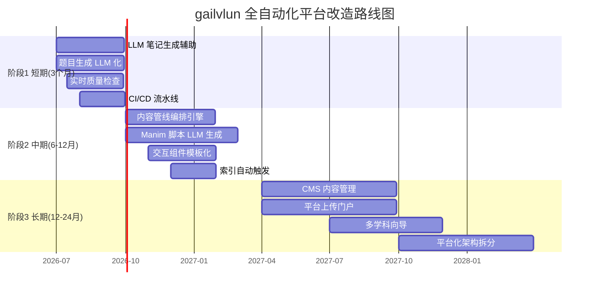
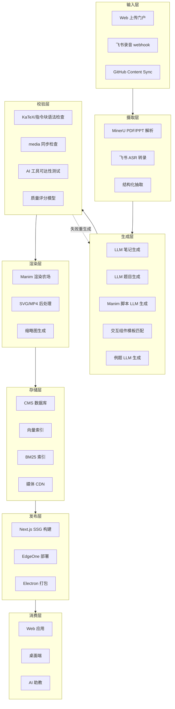
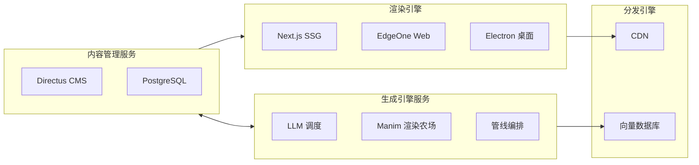
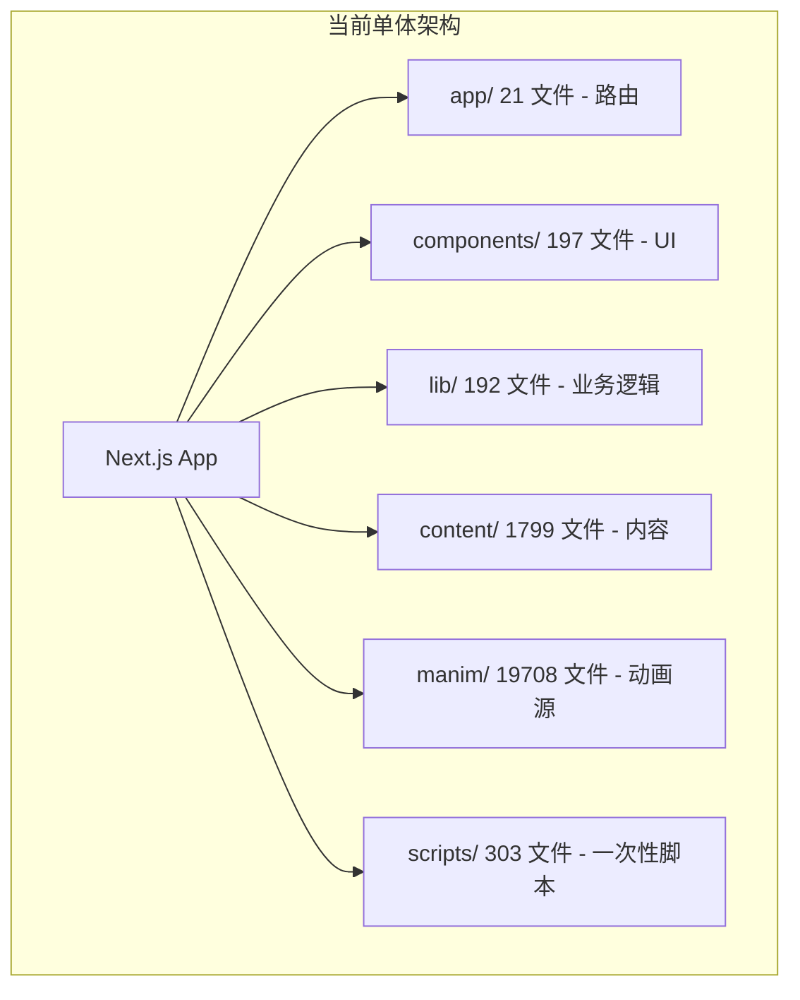
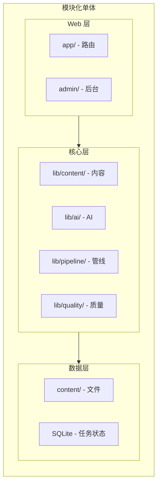
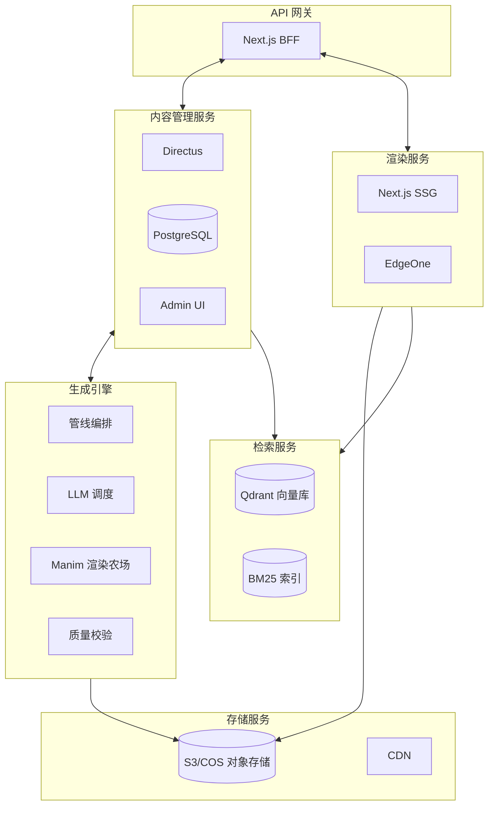
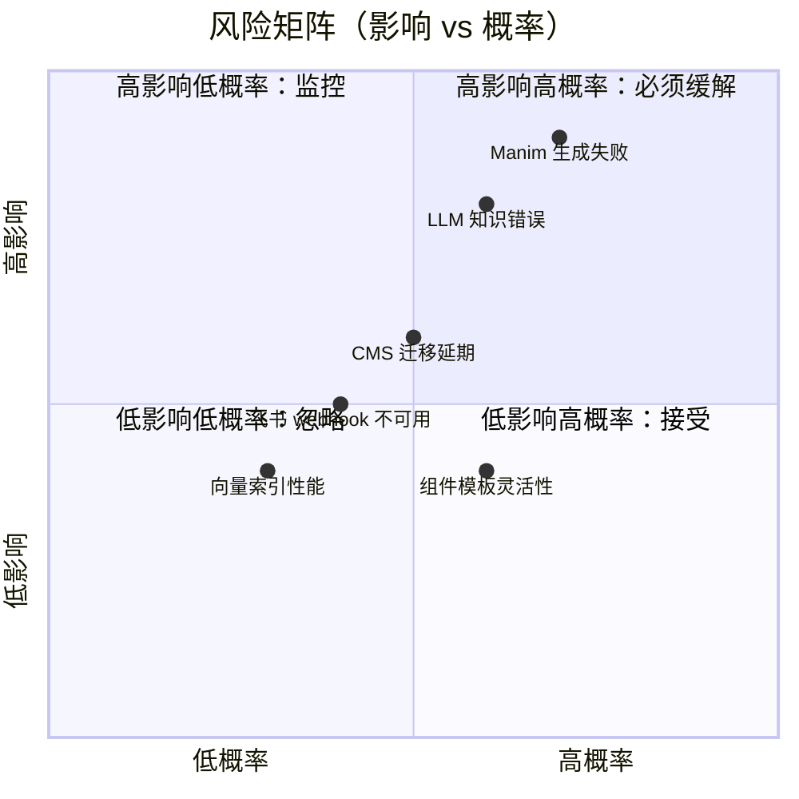

# 全自动化平台改造深度调研报告

> **调研人**：Agent-E（规范与平台调研员）
> **调研日期**：2026-07-05
> **项目版本**：gailvlun v0.3.1（package.json 标注 v0.4.0）

---

## 1. 执行摘要

gailvlun 当前是一个**以「SOP 驱动 + subagent 编排」为内容生产模式的半自动学习平台**：8 套 SOP 文档（`docs/sop/00-08`）+ `scripts/` 下 64 个一次性脚本 + 6 个学科共 1799 个内容文件，构成了一个高度依赖 AI 智能体（Cursor Agent / Workflow subagent）的内容生产管线。

调研结论：**当前架构距离「全自动化平台」有 10 个维度的差距，可分 3 个阶段（短期 3 个月 / 中期 6-12 个月 / 长期 12-24 个月）演进**。核心瓶颈不在 LLM 能力，而在**内容质量校验闭环、Manim 动画自动生成、交互组件模板化**三个硬骨头。

### 关键数据

| 维度 | 当前状态 | 全自动化目标 | 差距 |
|------|----------|-------------|------|
| 内容生产单位成本 | 1 小节 ≈ 4-8 小时人工（含笔记+交互+动画+例题+测试） | < 30 分钟人工审核 | 8-16x |
| LLM 在生产链中的覆盖率 | ~30%（仅文本生成用 LLM，结构与校验靠 SOP） | > 80% | 50+ 个百分点 |
| 脚本数量 | 64 个一次性脚本 | < 10 个核心管线脚本 | 重构而非新增 |
| SOP 数量 | 8 套 SOP + 1 套 onboarding | 0 套（向导化） | 全部重写为运行时流程 |
| 学科接入时间 | 1 学科 ≈ 2-4 周 | < 1 天 | 14-28x |
| 内容管理 | 文件系统 + manifest.ts | CMS + 数据库 | 架构级迁移 |

### 改造路线图概览



---

## 2. 现状分析

### 2.1 当前内容生产的 8 大环节与人工成本

| # | 环节 | 输入 | 工具/脚本 | 自动化程度 | 单位人工成本 | 涉及 SOP |
|---|------|------|----------|-----------|-------------|----------|
| 1 | 教材处理 | PDF/PPT 课件 | `scripts/parse-docs.ts`（MinerU API）+ fallback 链路 | 50% | 每章 1-2 小时 | SOP-01 |
| 2 | 详解笔记编写 | 教材+录音+纪要 | subagent + 模板 | 10% | 每小节 2-4 小时 | SOP-02 / 02b |
| 3 | 录音逐字稿处理 | 飞书 ASR .txt + .docx 纪要 | subagent 手动清洗 | 20% | 每讲 1-2 小时 | SOP-03 |
| 4 | 题目生成 | 详解 + 题型分布 | subagent + JSON 模板 | 5% | 每章 3-6 小时 | SOP-04 |
| 5 | Manim 动画 | 小节概念描述 | subagent 编写 .py + `manim/render.py` 渲染 | 5% | 每动画 4-8 小时 | SOP-02 Step 5 |
| 6 | 交互组件 | 小节概念描述 | subagent 编写 TSX + `registry.ts` 注册 | 5% | 每组件 3-6 小时 | SOP-02 Step 4 |
| 7 | 内容集成 | 所有产出文件 | subagent 编辑 `manifest.ts` + node 校验脚本 | 30% | 每批 1-2 小时 | SOP-05 |
| 8 | 考前模拟试卷 | Word 试卷 | MinerU 解析 + subagent 卡片化 | 30% | 每套卷 2-4 小时 | SOP-08 |

**汇总**：一个完整小节（笔记+交互+动画+例题+测试）的人工成本约 **13-32 小时**，一个完整学科（按 30 小节算）约 **400-960 小时**。

### 2.2 现有自动化脚本盘点（scripts/ 目录 64 个文件）

按用途分类：

| 类别 | 脚本数 | 代表脚本 | 评估 |
|------|--------|---------|------|
| **解析类** | 4 | `parse-docs.ts`、`fallback-pdf.py`、`fallback-pptx.py`、`fallback-docx.py` | MinerU API + 容灾降级链路完整，可保留 |
| **检查类** | 7 | `check-content-encoding.mjs`、`check-katex-chars.mjs`、`check-media-sync.mjs`、`check-prose-svg-rules.mjs`、`check-recording-example-latex-escapes.mjs`、`check-physics-recording-quiz-quality.mjs`、`check-maogai-textbook-syntax.ts` | 已在 `prebuild` 集成（`package.json:12`），是质量护栏，可保留 |
| **修复类** | 10 | `fix-bare-directive-labels.mjs`、`fix-katex-circled-numbers.ts`、`fix-math-entities.mjs`、`fix-math-fences.mjs`、`fix-quiz-json*.js`、`fix-headings-*.ts`、`fix-maogai-quotes.js`、`fix-ch03.js`、`fix-ch08.js`、`fix-section-headings.ts` | 一次性修复历史数据，长期应改为「生成时校验」 |
| **生成类** | 10 | `gen-maogai-quiz-ch01-03.py`、`gen-physics-exercises-ch05-07.py`、`gen-rec-*.mjs`、`gen-icon.mjs`、`gen-script-ids.mjs`、`gen-nav-manifest.ts` | 学科特定，难复用；`gen-nav-manifest.ts` 应保留 |
| **构建类** | 3 | `build-index.ts`、`build-desktop.mjs`、`gen-nav-manifest.ts` | 核心基础设施，保留 |
| **测试类** | 2 | `run-unit-tests.mjs`、`test-render-all.mjs` | 保留 |
| **辅助类** | 4 | `free-build-disk.mjs`、`report-disk.mjs`、`extract_units.py`、`ai-image-generation-prompt.txt` | 边角工具，可整合 |
| **学科特定一次性脚本** | 24 | `convert-maogai-textbook.ts`、`fill-maogai-example-answers.ts`、`generate-maogai-examples.ts`、`gen_maogai_quiz_*.py`、`write-rec-*.mjs` 等 | 一次性使用，已完成历史使命，应归档 |

**关键发现**：64 个脚本中**只有 7 个检查类脚本 + 3 个构建类脚本是长期复用的**，其余 54 个（84%）是一次性或学科特定脚本。这说明当前的「自动化」大量是临时补丁，缺乏可复用的核心管线。

### 2.3 SOP 体系评估

8 套 SOP + 1 套 onboarding 的优势：
- **流程文档化**：每个环节有明确步骤、角色分配、产出规范
- **subagent 编排规范**：明确拆分「主控 + Parser + Writer + Integrator」角色，控制上下文长度
- **容灾降级**：MinerU 不可用时有 marker/pymupdf/python-pptx 链路

SOP 模式的根本局限：
- **依赖 AI 智能体作为执行者**：SOP 是「写给 AI 看的文档」，不是「平台运行时流程」
- **无状态**：每次执行都从零开始，无进度持久化、无断点续传
- **无质量度量**：SOP 完成后靠「AI 工具可达性验证」人工抽检，无自动化质量评分
- **无版本控制**：SOP 文档更新与已生成内容无关联，旧内容不会因 SOP 改进而自动升级
- **学科扩展成本高**：每接入新学科需手动跑完 SOP-00 到 SOP-05（2-4 周）

---

## 3. 目标定义（全自动化平台愿景）

### 3.1 终态用户故事

**教师/内容创作者视角**：
> 我登录 gailvlun 平台，上传一个 PDF 教材 + 一份飞书录音导出包。平台自动解析教材结构、清洗录音、按章节匹配，30 分钟内生成完整草稿：每小节含原创笔记（1500+字）、2-4 个例题、1 个交互组件（从模板库匹配）、1 个 Manim 动画（LLM 生成脚本并渲染）、10 道测试题（按题型分布自动配比）。我只需审核与微调，平台自动构建索引、发布到生产环境。

**学生视角**：
> 我打开 gailvlun，选学科 → 看到的内容是新鲜的（每周自动增量更新）；AI 助教能引用最新内容；考前模拟试卷自动从题库按我的薄弱点组卷。

**平台运维者视角**：
> 我看到仪表盘显示「内容生产队列 / 渲染队列 / 索引构建队列」，每个任务有进度、质量评分、失败重试。新增学科只需填表：科目名 + 教材 PDF + 录音包，平台自动跑完全流程。

### 3.2 全自动化平台的 5 个核心特征

1. **零脚本上传**：用户在 Web UI 拖拽上传教材/录音，平台自动调度解析
2. **LLM 主导生产**：笔记/题目/动画脚本/交互组件参数由 LLM 生成，人工仅审核
3. **模板化复用**：交互组件、动画场景、题目结构均有模板库，LLM 选模板 + 填参数
4. **实时质量闭环**：生成即校验（KaTeX 语法、指令块规范、media 同步、AI 可达性），不合格自动重生成
5. **CI/CD 自动发布**：内容入库 → 触发索引构建 → 触发预渲染 → 触发部署，全程无人工

### 3.3 平台架构愿景图



---

## 4. 差距分析（10 个差距维度）

### 4.1 内容输入：从手动放置文件到平台上传

| 项 | 当前 | 目标 |
|----|------|------|
| 教材上传 | 手动放 `D:\教材\` + 命令行 `npx tsx scripts/parse-docs.ts` | Web UI 拖拽上传，自动入库 |
| 录音上传 | 手动从飞书导出 .txt + 手动放 `D:\飞书文档保存\` | 飞书开放平台 webhook 自动拉取 |
| PPT 上传 | 手动放 OneDrive 目录 | 同教材 |
| 试卷上传 | 手动 .docx 文件 | Web UI 上传 + OCR 兜底 |

**差距**：缺少 Web 上传门户、文件队列管理、上传后自动触发解析的 webhook 机制。

### 4.2 笔记生成：从手动编写到 LLM + 模板

| 项 | 当前 | 目标 |
|----|------|------|
| 撰写者 | subagent（Cursor Agent） | LLM（DeepSeek/Qwen）+ 项目模板 |
| 输入 | subagent 读教材+录音+纪要 | LLM 接收结构化输入包 |
| 输出 | .md 文件（含 :::definition/theorem/example 指令块） | 同左，但 LLM 直接产出 |
| 校验 | subagent 自检 + 人工抽检 | 自动校验指令块/KaTeX/篇幅 + 质量评分 |
| 单位成本 | 2-4 小时/小节 | < 30 分钟/小节（审核） |

**差距**：缺少 LLM 提示词工程库、笔记质量评分模型、自动重生成闭环。当前 `lib/ai/prompts/` 仅有对话 prompt，无笔记生成 prompt。

### 4.3 题目生成：从手动编写到 LLM 生成 + 校验

| 项 | 当前 | 目标 |
|----|------|------|
| 出题者 | subagent | LLM（按题型分布配比） |
| 题型分布 | subagent 读 `docs/refer/考试题型分布.md` | LLM 内嵌题型分布配置 |
| 评分标准 | subagent 编写 | LLM 生成 + 自动校验得分点 |
| 滚动复习 | subagent 读前序章节 | LLM 自动从前序章节抽取知识点 |
| 校验 | JSON schema + 人工 | JSON schema + LLM 自评 + 自动试做 |

**差距**：缺少题目质量评分模型、自动试做器（LLM 跑一遍验证答案正确性）。当前 `content/quiz/` 已有 JSON 文件，但生成过程全靠 subagent。

### 4.4 动画生成：从手动 .py 到 LLM 生成 Manim 脚本

| 项 | 当前 | 目标 |
|----|------|------|
| 编写者 | subagent（懂 Manim 的） | LLM 生成 Python 代码 |
| 模板 | 无 | Manim 场景模板库（函数图像/几何变换/概率模拟/化学结构） |
| 渲染 | `python manim/render.py --chapter` | 渲染农场 + 失败重试 |
| 时长 | 20-60s | 同左 |
| 校验 | 渲染成功 + 人工看 | 渲染成功 + LLM 看截图判断是否符合讲解 |

**差距**：**这是最大的硬骨头**。Manim 是 Python 库，LLM 生成 Python 代码的可靠性低（语法错、API 用错、运行时崩）。需要：
1. Manim 场景模板库（覆盖 80% 常见动画类型）
2. LLM 只填参数 + 拼装模板，不从头写代码
3. 渲染失败自动反馈错误给 LLM 重试

### 4.5 交互组件：从手动 React 到模板化 + 参数化

| 项 | 当前 | 目标 |
|----|------|------|
| 编写者 | subagent | LLM 选模板 + 填参数 |
| 模板 | 无 | 交互组件模板库（拖动/调参/动画/可视化） |
| 注册 | 手动编辑 `registry.ts` | 自动注册（CMS 驱动） |
| 复用 | 一次性 | 跨学科复用 |

**差距**：当前 `components/interactives/` 下每个组件都是 200-500 行 bespoke TSX，零复用。需要抽象出 5-10 个通用模板（如「函数图像探索器」「维恩图」「分子结构旋转器」「时间轴」），LLM 只选模板 + 填参数。

### 4.6 索引构建：从手动运行到自动触发

| 项 | 当前 | 目标 |
|----|------|------|
| 触发 | `npx tsx scripts/build-index.ts`（手动） | 内容入库自动触发 |
| 构建 | 全量重建（307MB） | 增量更新 |
| 托管 | 本地 `content/.index/` + COS 下载 | 向量数据库（Qdrant/Milvus） |
| 失败 | 人工重跑 | 自动重试 + 告警 |

**差距**：缺少向量数据库、增量索引、webhook 触发机制。当前 `lib/ai/search/vectorStore.ts` 是基于文件的简单实现。

### 4.7 质量检查：从 prebuild 到实时检查

| 项 | 当前 | 目标 |
|----|------|------|
| 时机 | `prebuild` 脚本（构建前一次性） | 生成时实时 + 定期巡检 |
| 范围 | 7 个 check 脚本 | + 笔记质量评分 + 题目试做 + 动画截图判断 |
| 反馈 | 阻塞构建 | 生成时反馈给 LLM 重生成 |
| 仪表盘 | 无 | 质量评分可视化 |

**差距**：缺少实时质量反馈闭环、质量评分模型、仪表盘。当前 7 个 check 脚本是事后兜底，不是事中干预。

### 4.8 发布流程：从手动 build 到 CI/CD

| 项 | 当前 | 目标 |
|----|------|------|
| 触发 | `pnpm build`（手动） | 内容入库自动触发 |
| 构建 | `next build` + `free-build-disk.mjs` + `report-disk.mjs` | CI/CD 流水线 |
| 部署 | EdgeOne CLI 手动 + Electron `desktop:build` 手动 | 自动部署 Web + 桌面 |
| 回滚 | 无 | 版本化 + 一键回滚 |

**差距**：缺少 CI/CD 配置（GitHub Actions / EdgeOne Pages Functions）、版本化部署、回滚机制。

### 4.9 内容管理：从文件系统到 CMS 数据库

| 项 | 当前 | 目标 |
|----|------|------|
| 存储 | 文件系统（`content/*.md` + `content/quiz/*.json`） | CMS 数据库（PostgreSQL/SQLite） |
| 元数据 | `lib/content-data/manifest.ts`（手工编辑 TS） | CMS 自动维护 |
| 版本 | git 提交 | CMS 版本化 + diff |
| 搜索 | 向量索引 + BM25 | 同左 + CMS 全文检索 |
| 权限 | 无 | 多用户 + 审核流 |

**差距**：缺少 CMS、数据库、审核流。当前 `manifest.ts` 是手工编辑的 TS 文件，任何内容增删都需改代码。

### 4.10 多学科扩展：从手动接入 SOP 到平台向导

| 项 | 当前 | 目标 |
|----|------|------|
| 接入流程 | 跑完 SOP-00 到 SOP-05（2-4 周） | 填表 + 上传教材 + 1 天 |
| 学科配置 | 改 `lib/types/content.ts` + `app/[subject]/page.tsx` | 平台向导表单 |
| 内容生产 | N 个 subagent 并行 | 平台管线自动调度 |
| 验证 | 人工抽检 | 自动质量评分 |

**差距**：缺少学科接入向导、自动配置生成、管线调度引擎。

---

## 5. 技术选型可行性评估

### 5.1 LLM 内容生成（笔记/题目）— 可行性：★★★★★

| 项 | 评估 |
|----|------|
| 技术成熟度 | 高。DeepSeek-V4-Pro / Qwen3 / GLM-5.2 均能产出 1500+ 字结构化 markdown |
| 成本 | 低。每小节约 5K-10K tokens 输入 + 3K-5K tokens 输出 ≈ ¥0.1-0.3 |
| 质量风险 | 中。可能出现：公式语法错、指令块不闭合、内容偏离教材 |
| 缓解措施 | 1) 强约束 prompt + few-shot 示例；2) 自动校验 + 重生成；3) 人工审核 |
| 推荐模型 | DeepSeek-V4-Pro（主力）/ GLM-5.2（容灾）/ Qwen3（备选） |

**结论**：笔记与题目生成是 LLM 的强项，当前 `lib/ai/prompts/` 已有对话 prompt 基础设施，扩展笔记生成 prompt 即可。

### 5.2 向量索引自动化 — 可行性：★★★★☆

| 项 | 评估 |
|----|------|
| 技术成熟度 | 高。`scripts/build-index.ts` 已实现 BM25 + bge-m3 向量 |
| 增量更新 | 中。当前全量重建，需改造为增量（按文件 hash diff） |
| 向量数据库 | 可选 Qdrant（自托管）/ Turbopuffer（云）/ pgvector（PostgreSQL） |
| 成本 | 中。bge-m3 embedding API 每百万 tokens ¥0.7 |
| 风险 | 低。索引失败不影响内容可用性，仅影响 AI 检索 |

**结论**：当前 `lib/ai/search/` 已实现 hybrid search，升级为增量 + 向量数据库是工程问题，非技术可行性问题。

### 5.3 Manim 动画自动生成 — 可行性：★★☆☆☆（最难）

| 项 | 评估 |
|----|------|
| 技术成熟度 | 低。LLM 生成 Python 代码可靠性差，Manim API 复杂 |
| 模板化可行性 | 中。80% 动画可归为 5-8 类（函数图像/几何变换/概率模拟/分子结构/电路图/力学示意） |
| LLM 角色 | 选模板 + 填参数 + 生成过渡文案，不从头写代码 |
| 渲染可靠性 | 中。Manim 渲染失败率 20-30%（字体/依赖/显存） |
| 成本 | 高。每动画 LLM 调用 5-10K tokens + 渲染 1-3 分钟 |
| 风险 | 高。生成的动画可能文不对题、视觉混乱 |

**缓解方案**：
1. 建立 Manim 场景模板库（`manim/templates/`），每模板有参数 schema
2. LLM 只输出 `{ template: "function_plot", params: { fn: "sin(x)", range: [-3.14, 3.14] } }`
3. 模板渲染失败自动回退到「静态 SVG + 文字说明」
4. 渲染成功后用多模态 LLM 看截图判断是否符合讲解（GPT-4V / Claude 3.5 Sonnet）

**结论**：Manim 自动生成是**最大的技术赌注**，建议阶段 2 启动，先做模板库覆盖 80% 场景，剩余 20% 仍人工。

### 5.4 交互组件自动生成 — 可行性：★★★☆☆

| 项 | 评估 |
|----|------|------|
| 技术成熟度 | 中。React 组件 LLM 生成可行性高于 Python |
| 模板化可行性 | 高。当前 197 个组件可聚类为 10-15 个模板 |
| LLM 角色 | 选模板 + 填参数 + 生成样式 token |
| 风险 | 中。可能出现 hydration mismatch、SVG 坐标错乱 |

**模板库建议**（基于现有组件聚类）：

| 模板 | 覆盖场景 | 现有代表 |
|------|---------|---------|
| 函数图像探索器 | 数学/物理函数可视化 | `FunctionPlot.tsx` |
| 维恩图/集合运算 | 概率/逻辑 | `VennPlayground.tsx` |
| 拖动分类器 | 概念归类 | `SampleSpaceBuilder.tsx` |
| 频率收敛模拟 | 概率/统计 | `FrequencyConvergence.tsx` |
| 分子结构旋转器 | 化学 | `NewmanProjection.tsx` |
| 时间轴 | 历史 | （待补） |
| 电路图 | 物理 | （待补） |
| 文本填空 | 语言 | （待补） |

**结论**：交互组件模板化可行性高，建议阶段 2 启动，先做 5 个高频模板覆盖 60% 场景。

### 5.5 平台化架构演进 — 可行性：★★★☆☆

| 项 | 评估 |
|----|------|
| 单体 → 微服务 | 中。Next.js 单体可保留为「渲染引擎」，新增 CMS/生成引擎为独立服务 |
| CMS 选型 | Strix（自托管 headless CMS）/ Directus / 自研基于 PostgreSQL |
| 部署 | EdgeOne（Web）+ Electron（桌面）+ 独立 Node 服务（生成引擎） |
| 风险 | 高。架构拆分需迁移 1799 个内容文件，影响面大 |

**结论**：平台化是长期目标（阶段 3），短期建议在现有 Next.js 单体内演进，新增 `/admin` 后台路由 + API 路由扩展。

---

## 6. 改造路径路线图（3 阶段）

### 6.1 阶段 1（短期，0-3 个月）：内容生成辅助

**目标**：LLM 接入内容生产链，人工成本降低 50%

#### 6.1.1 LLM 笔记生成辅助

- **新增** `lib/ai/prompts/note-generation.ts`：按 SOP-02 模板生成笔记 prompt
- **新增** `app/api/generate-note/route.ts`：POST 接收 `{ subjectId, chapterId, sectionId, inputs }`，SSE 流式返回 markdown
- **改造** `scripts/` 新增 `generate-note.ts`：CLI 工具，批量调用 API 生成笔记草稿
- **质量护栏**：复用现有 `check-katex-chars.mjs` + `check-prose-svg-rules.mjs`，新增 `check-note-structure.mjs`（校验 :::definition/theorem/example 指令块闭合）
- **预期成本下降**：2-4 小时/小节 → 30-60 分钟/小节（含审核）

#### 6.1.2 题目生成 LLM 化

- **新增** `lib/ai/prompts/quiz-generation.ts`：按 SOP-04 + `docs/refer/考试题型分布.md` 生成题目 prompt
- **新增** `app/api/generate-quiz/route.ts`：POST 接收 `{ subjectId, chapterId, knowledgePoints }`，返回 JSON
- **新增** `lib/quiz/auto-validate.ts`：JSON schema 校验 + LLM 自评（让另一个 LLM 试做并打分）
- **预期成本下降**：3-6 小时/章 → 1-2 小时/章（含审核）

#### 6.1.3 实时质量检查

- **整合** 7 个 check 脚本到 `lib/quality/` 模块，供生成时调用
- **新增** `app/api/validate-content/route.ts`：POST 接收 markdown，返回 `{ score, issues }`
- **改造** 生成 API 在产出后自动调用 `validate-content`，不合格自动重生成（最多 3 次）

#### 6.1.4 CI/CD 流水线

- **新增** `.github/workflows/content-ci.yml`：内容 PR 触发 `prebuild` + `lint` + `test`
- **新增** `.github/workflows/deploy.yml`：master 合并触发 EdgeOne 部署
- **新增** `.github/workflows/desktop-release.yml`：tag 触发 Electron 打包 + GitHub Release

### 6.2 阶段 2（中期，3-12 个月）：管线自动化

**目标**：端到端管线编排，人工成本降低 80%

#### 6.2.1 内容管线编排引擎

- **新增** `lib/pipeline/` 模块：基于状态机的内容生产管线
  ```ts
  interface PipelineTask {
    id: string;
    type: "parse" | "generate-note" | "generate-quiz" | "render-manim" | "register";
    status: "pending" | "running" | "done" | "failed";
    dependencies: string[];
    payload: unknown;
  }
  ```
- **新增** `app/api/pipeline/route.ts`：提交任务、查询状态、取消任务
- **新增** `app/admin/pipeline/page.tsx`：管线仪表盘（队列/进度/失败重试）
- **持久化**：SQLite（`pipeline.db`）存任务状态

#### 6.2.2 Manim 脚本 LLM 生成

- **新增** `manim/templates/` 目录：5-8 个场景模板
  - `function_plot.py`：函数图像（参数：fn, range, color）
  - `geometry_transform.py`：几何变换（参数：shape, transform）
  - `probability_sim.py`：概率模拟（参数：experiment, trials）
  - `molecule_rotate.py`：分子结构旋转（参数：smiles, axis）
  - `circuit_diagram.py`：电路图（参数：components[]）
- **新增** `lib/ai/prompts/manim-generation.ts`：LLM 选模板 + 填参数
- **新增** `app/api/generate-manim/route.ts`：POST 接收概念描述，返回 `{ template, params }`
- **新增** `scripts/render-manim.ts`：渲染农场（并发 4-8 个 Manim 进程）
- **失败兜底**：渲染失败回退到「静态 SVG + 文字说明」

#### 6.2.3 交互组件模板化

- **新增** `components/interactives/templates/` 目录：5-10 个通用模板
- **改造** `registry.ts` 支持模板实例（`{ template, params }` 而非 bespoke Component）
- **新增** `lib/ai/prompts/interactive-generation.ts`：LLM 选模板 + 填参数
- **预期覆盖**：60% 场景用模板，40% 仍需 bespoke

#### 6.2.4 索引自动触发

- **改造** `scripts/build-index.ts` 支持增量更新（按文件 hash diff）
- **新增** `lib/pipeline/triggers/index-trigger.ts`：内容入库后自动触发索引构建
- **评估** 向量数据库迁移：Qdrant（自托管）或 pgvector（PostgreSQL）

### 6.3 阶段 3（长期，12-24 个月）：平台化

**目标**：从单体 Next.js 应用演进为平台化架构

#### 6.3.1 CMS 内容管理

- **选型**：Directus（自托管 headless CMS，PostgreSQL 后端）
- **迁移**：1799 个内容文件导入 CMS，`manifest.ts` 改为从 CMS API 拉取
- **新增** `app/admin/content/page.tsx`：内容管理后台（CRUD + 审核流）
- **新增** `app/api/cms/route.ts`：CMS webhook 接收内容变更

#### 6.3.2 平台上传门户

- **新增** `app/admin/upload/page.tsx`：Web 上传 UI（拖拽 + 进度 + 队列）
- **新增** 飞书开放平台集成：webhook 自动拉取录音转录
- **新增** `lib/storage/upload.ts`：S3/COS 兼容的对象存储抽象

#### 6.3.3 多学科向导

- **新增** `app/admin/onboarding/page.tsx`：学科接入向导表单
  - 科目名/图标/颜色
  - 教材 PDF 上传
  - 录音包上传
  - 题型分布配置
  - 自动生成 `lib/types/content.ts` + `manifest.ts` 条目
- **新增** `lib/pipeline/subject-onboarding.ts`：自动跑完 SOP-00 到 SOP-05

#### 6.3.4 平台化架构拆分



- **CMS 服务**：Directus + PostgreSQL，独立部署
- **生成引擎**：Node.js 服务，调度 LLM + Manim 渲染
- **渲染引擎**：现有 Next.js 应用，改为从 CMS 拉内容
- **分发引擎**：EdgeOne CDN + Qdrant 向量数据库

---

## 7. 平台化架构演进方向

### 7.1 当前架构（单体 Next.js）



**问题**：
- 内容与代码耦合（`content/` 与 `lib/` 同仓）
- 一次性脚本堆积（303 文件，84% 已废弃）
- Manim 源码庞大（19708 文件，主要 `_raw` 渲染产物）
- 无运行时内容管理能力（必须改代码才能增删内容）

### 7.2 中期架构（模块化单体）



**改进**：
- 新增 `app/admin/` 后台路由
- 新增 `lib/pipeline/` 管线编排
- 新增 `lib/quality/` 质量检查
- SQLite 存任务状态
- 内容仍在文件系统，但通过 `lib/content/` 抽象层访问

### 7.3 长期架构（平台化）



**核心拆分**：
1. **CMS 服务**：Directus + PostgreSQL，内容 CRUD + 审核流
2. **生成引擎**：Node.js 服务，LLM 调度 + Manim 渲染农场 + 质量校验
3. **渲染服务**：现有 Next.js 应用，改为从 CMS 拉内容做 SSG
4. **检索服务**：Qdrant 向量库 + BM25 索引，独立部署
5. **存储服务**：S3/COS 对象存储 + CDN
6. **API 网关**：Next.js BFF，统一鉴权与路由

### 7.4 架构演进的关键决策点

| 决策 | 选项 A | 选项 B | 推荐 |
|------|--------|--------|------|
| CMS 选型 | Directus（自托管） | Strapi（自托管） | Directus（更轻量，PostgreSQL 原生） |
| 向量数据库 | Qdrant（自托管） | Turbopuffer（云） | Qdrant（与现有 EdgeOne 部署一致） |
| 任务队列 | SQLite + 轮询 | Redis + BullMQ | 阶段 2 用 SQLite，阶段 3 迁 Redis |
| 渲染农场 | 本地多进程 | Kubernetes Job | 阶段 2 本地，阶段 3 评估 K8s |
| LLM 编排 | 自研 | LangChain / LlamaIndex | 自研（项目已有 `lib/ai/` 基础设施） |

---

## 8. 问题清单与风险

### 8.1 按严重程度排序的问题清单

| # | 问题 | 严重度 | 影响 | 缓解措施 |
|---|------|--------|------|---------|
| 1 | Manim 动画 LLM 生成可靠性低（< 50% 一次成功） | P0 | 阻塞阶段 2 | 模板化覆盖 80%，剩余人工；多模态 LLM 看截图判断 |
| 2 | 内容质量自动评分模型缺失 | P0 | 无法闭环自动生成 | 用 LLM 做评分器（cost 次要），先实现 5 维度评分 |
| 3 | 1799 个内容文件迁移到 CMS 工作量大 | P1 | 阶段 3 启动门槛 | 写迁移脚本，按学科分批；保留文件系统兜底 |
| 4 | 飞书开放平台录音 webhook 需企业账号 | P1 | 影响录音自动上传 | 短期保留手动上传，中期申请企业账号 |
| 5 | 交互组件模板化后丢失 bespoke 灵活性 | P1 | 部分复杂场景无法覆盖 | 保留 40% bespoke 配额，模板覆盖 60% |
| 6 | LLM 生成笔记可能出现知识性错误 | P1 | 误导学生 | 强制人工审核 + 引用教材溯源 |
| 7 | 管线编排引擎自研成本高 | P2 | 阶段 2 延期 | 评估 Temporal / Inngest 等开源方案 |
| 8 | EdgeOne Pages SSR 128MiB 限制 | P2 | 平台化后服务拆分受限 | 已有 Electron 桌面方案兜底；Web 端改 SSG |
| 9 | 向量索引增量更新算法复杂 | P2 | 索引构建慢 | 阶段 1 保持全量，阶段 2 实现增量 |
| 10 | 多学科向导的题型分布配置需人工 | P3 | 新学科接入仍需 1-2 天 | 可接受（远低于当前 2-4 周） |

### 8.2 风险矩阵



### 8.3 关键技术赌注

1. **Manim 模板化能否覆盖 80%**：赌注核心。若不足 60%，则动画仍需大量人工，全自动化目标失败。
2. **LLM 生成笔记质量能否达到 SOP-02 标准**：需对比 LLM 草稿与人工笔记，建立质量基线。
3. **Directus CMS 能否承载 1799 文件 + 增量内容**：需 POC 验证。
4. **EdgeOne 能否承载平台化后的服务拆分**：可能需迁移到 Vercel / 自建 K8s。

---

## 9. 参考资料

### 项目内文档

1. `docs/sop/00-infrastructure.md` — 文档解析与 subagent 调度规范
2. `docs/sop/01-textbook-processing.md` — 教材处理 SOP
3. `docs/sop/02-detail-generation.md` — 详解笔记生成 SOP（理工科）
4. `docs/sop/02b-detail-generation-humanities.md` — 详解笔记生成 SOP（人文科）
5. `docs/sop/03-recording-processing.md` — 录音逐字稿处理 SOP
6. `docs/sop/04-quiz-generation.md` — 题目生成 SOP
7. `docs/sop/05-content-integration.md` — 内容集成与验证 SOP
8. `docs/sop/06-desktop-packaging-release.md` — 桌面打包发布 SOP
9. `docs/sop/07-testing.md` — 测试体系 SOP
10. `docs/sop/08-exam-paper-integration.md` — 考试试卷录入 SOP
11. `docs/sop/subject-onboarding.md` — 新学科接入 SOP
12. `docs/research/15-nextjs-compliance.md` — Next.js 16 规范对比报告（本系列姊妹篇）

### 项目代码

1. `lib/ai/prompts/` — 现有 AI prompt 基础设施
2. `lib/ai/search/` — 向量检索 + BM25 实现
3. `lib/content/loader.ts` — 内容加载器
4. `lib/content-data/manifest.ts` — 内容目录树
5. `scripts/build-index.ts` — 索引构建脚本
6. `scripts/parse-docs.ts` — MinerU 文档解析
7. `components/interactives/registry.ts` — 交互组件注册表
8. `manim/render.py` — Manim 渲染脚本

### 外部参考

1. [Directus 官方文档](https://docs.directus.io/) — Headless CMS 选型
2. [Qdrant 官方文档](https://qdrant.tech/documentation/) — 向量数据库
3. [Manim Community Edition](https://docs.manim.community/) — 数学动画库
4. [Next.js 16 Cache Components](https://nextjs.org/docs/app/api-reference/config/next-config-js/cacheComponents) — 缓存模型演进
5. [Temporal 工作流引擎](https://temporal.io/) — 管线编排备选方案

---

## 10. 总结与建议

### 10.1 核心结论

gailvlun 当前是一个**精心设计的半自动学习平台**，SOP 体系与 subagent 编排模式在内容生产质量上是成功的（已产出 1799 个内容文件、6 个学科全覆盖）。但距离「全自动化平台」有 10 个维度的差距，核心瓶颈在于：

1. **Manim 动画自动生成**（技术赌注最大）
2. **内容质量自动评分**（闭环关键）
3. **交互组件模板化**（复用关键）

### 10.2 推荐执行顺序

**立即启动（阶段 1，0-3 个月）**：
- LLM 笔记生成辅助（ROI 最高，技术风险最低）
- LLM 题目生成（同上）
- 实时质量检查（闭环基础）
- CI/CD 流水线（发布自动化）

**中期攻坚（阶段 2，3-12 个月）**：
- Manim 模板库 + LLM 生成（最难，最早启动）
- 交互组件模板化（次难）
- 管线编排引擎（基础设施）
- 索引自动触发（增量升级）

**长期演进（阶段 3，12-24 个月）**：
- CMS 内容管理（架构迁移）
- 平台上传门户（用户入口）
- 多学科向导（扩展能力）
- 平台化架构拆分（终态）

### 10.3 关键成功因素

1. **Manim 模板库覆盖率**：决定全自动化能否实现
2. **LLM 生成质量基线**：决定人工审核成本能否降到 20% 以下
3. **管线编排可靠性**：决定平台能否无人值守运行
4. **CMS 迁移完整性**：决定 1799 个文件能否无损迁移

### 10.4 风险兜底

若阶段 2 Manim 自动化失败，建议保留「subagent + 人工审核」模式作为兜底，将精力转向**笔记与题目生成**（ROI 更高）。全自动化不必强求 100%，80% 自动化 + 20% 人工审核已是巨大进步。

---

> **报告完成时间**：2026-07-05
> **下一步**：建议优先启动阶段 1 的 LLM 笔记生成辅助，技术风险低、ROI 高，可在 1-2 周内出第一个可用版本。
